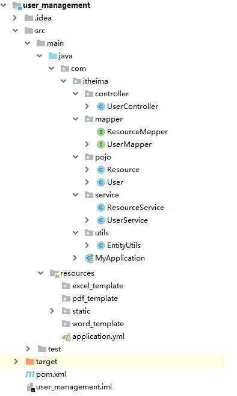
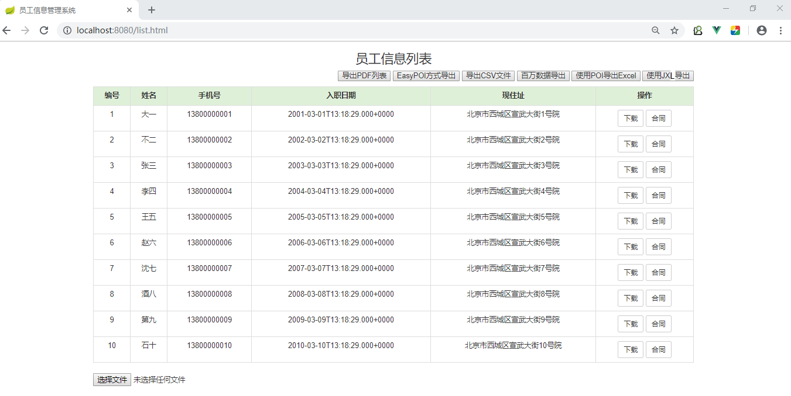
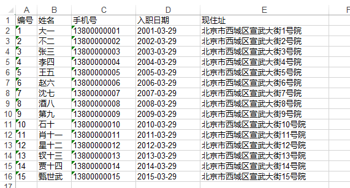
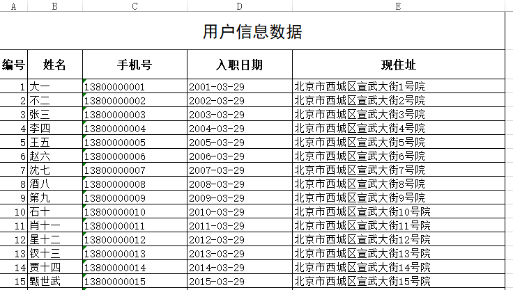

# 前言

报表[forms for reporting to the higher organizations]，就是向上级报告情况的表格。简单的说：报表就是用表格、图表等格式来动态显示数据，可以用公式表示为：“报表 = 多样的格式 + 动态的数据”。 


# 1、开发环境搭建

功能说明：整个案例我们操作用户表，做一个企业员工（用户）数据的导入导出。

我们使用SpringBoot+通用mapper+vue方式搭建开发环境


第一步：准备数据库，把资料文件夹下中的sql脚本直接执行

《report_manager_db.sql》

第二步：打开idea或Eclipse，导入资料文件夹中准备好的《user_management》项目

以idea为例，导入后整体结构如下



第三步：启动引导类，浏览器访问 http://localhost:8080/list.html




# 2、Excel说明

在企业级应用开发中，Excel报表是一种最常见的报表需求。Excel报表开发一般分为两种形式：
1、为了方便操作，基于Excel的报表批量上传数据，也就是把Excel中的数据导入到系统中。
2、通过java代码生成Excel报表。也就是把系统中的数据导出到Excel中，方便查阅。

## 2.1 Excel的两种版本

目前世面上的Excel分为两个大的版本Excel2003和Excel2007及以上两个版本；
两者之间的区别如下：


Excel2003 是一个特有的二进制格式，其核心结构是复合文档类型的结构，存储数据量较小；

Excel2007 的核心结构是 XML 类型的结构，采用的是基于 XML 的压缩方式，使其占用的空间更小，

​                  操作效率更高

## 2.2 常见的Excel操作工具

Java中常见的用来操作Excel的方式一般有2种：JXL和POI。

### 2.2.1  JXL

JXL只能对Excel进行操作,属于比较老的框架，它只支持到Excel 95-2000的版本。现在已经停止更新和
维护,所以本课程中只时简单地演示一下jxl的代码，不会把它作为重点，

### 2.2.2 POI

POI是apache的项目,可对微软的Word,Excel,PPT进行操作,包括office2003和2007,Excle2003和2007。
poi现在一直有更新。所以现在主流使用POI。

Apache POI是Apache软件基金会的开源项目，由Java编写的免费开源的跨平台的 Java API，Apache
POI提供API给Java语言操作Microsoft Office的功能。

API对象介绍
工作簿 ： WorkBook （HSSFWordBook ： 2003版本，XSSFWorkBook ： 2007级以上）
工作表 ： Sheet         （HSSFSheet ：          2003版本，XSSFSheet ：          2007级以上）
行 ：         Row           （HSSFRow ：             2003版本，XSSFRow ：            2007级以上）
单元格 ： Cell            （HSSFCell ：               2003版本，XSSFCell ：             2007级以上）


# 3、使用JXL导出excel

目前Excel的版本有2013、2010、2007，这些都是新版本的excel，新版本的excel已经出现十多年了，使用人群已经比较多了，所以目前做项目大都做的是导出新版本的excel，而jxl只能操作低版本的excel，所以现在使用jxl做项目已经比较少见，那我们在这里使用jxl导出一个简单一些的excel。

## 3.1 使用jxl导出基本知识点

通过WritableWorkbook，WritableSheet，Label这三个对象我们就可以实现Excel文件的导出工作。

1、 创建可写入的Excel工作薄

```java
WritableWorkbook workbook= Workbook.createWorkbook(输出流);
```

2、创建工作表

```java
WritableSheet sheet= workbook.createSheet(工作表的名称, 工作表的索引值);
```

3、创建单元格

添加文本类单元格

```java
Label labelC = new Label(列索引值, 行索引值, "单元格中的内容");

sheet.addCell(labelC);
```

4、写入到文件

```java
workbook.write();// 写入数据
```

5、释放资源：

```java
workbook.close();// 关闭文件
```


## 3.2 代码实现导出用户列表数据

第一步：UserController中添加方法

```java
@GetMapping(value = "/downLoadXlsByJxl",name = "使用jxl下载")
public void downLoadXlsByJxl(HttpServletResponse response){
    userService.downLoadByJxl(response);
}
```

第二步：UserService中的方法

```java
private static SimpleDateFormat simpleDateFormat = new SimpleDateFormat("yyyy-MM-ss");

public void downLoadXlsByJxl(HttpServletResponse response){
        try {
//            创建一个工作薄
            ServletOutputStream outputStream = response.getOutputStream();
            WritableWorkbook workbook = Workbook.createWorkbook(outputStream);
//            创建一个工作表
            WritableSheet sheet = workbook.createSheet("一个JXL入门", 0);
//            设置列宽
            sheet.setColumnView(0,5);
            sheet.setColumnView(1,8);
            sheet.setColumnView(2,15);
            sheet.setColumnView(3,15);
            sheet.setColumnView(4,30);
//            处理标题
            String[] titles = new String[]{"编号","姓名","手机号","入职日期","现住址"};
            Label label = null;
            for (int i = 0; i < titles.length; i++) {
                label = new Label(i,0,titles[i]);
                sheet.addCell(label);
            }
//            处理导出的内容
            List<User> userList = this.findAll();
            int rowIndex = 1;
            for (User user : userList) {
                label = new Label(0,rowIndex,user.getId().toString());
                sheet.addCell(label);
                label = new Label(1,rowIndex,user.getUserName());
                sheet.addCell(label);
                label = new Label(2,rowIndex,user.getPhone());
                sheet.addCell(label);
                label = new Label(3,rowIndex,simpleDateFormat.format(user.getHireDate()));
                sheet.addCell(label);
                label = new Label(4,rowIndex,user.getAddress());
                sheet.addCell(label);
                rowIndex++;
            }
            
            //            导出的文件名称
            String filename="一个JXL入门.xls";
//            设置文件的打开方式和mime类型
             response.setHeader( "Content-Disposition", "attachment;filename="  + new String(filename.getBytes(),"ISO8859-1"));
            response.setContentType("application/vnd.ms-excel");
//            导出
            workbook.write();
//            关闭资源
            workbook.close();
            outputStream.close();
        } catch (Exception e) {
            e.printStackTrace();
        }
    }
```

导出内容如下：



# 4、POI操作excel

添加所需的依赖：

```xml
<dependency>
    <groupId>org.apache.poi</groupId>
    <artifactId>poi</artifactId>
    <version>4.0.1</version>
</dependency>

<dependency>
    <groupId>org.apache.poi</groupId>
    <artifactId>poi-ooxml</artifactId>
    <version>4.0.1</version>
</dependency>

<dependency>
    <groupId>org.apache.poi</groupId>
    <artifactId>poi-ooxml-schemas</artifactId>
    <version>4.0.1</version>
</dependency>
```


## 4.1、POI操作Excel高低版本区别

在POI包中有如下几个主要对象和excel的几个对象对应：

| 对应excel名称 | 低版本中的类名 | 高版本中的类名 |
| :------------ | :------------- | :------------- |
| 工作簿        | HSSFWorkbook   | XSSFWorkbook   |
| 工作表        | HSSFSheet      | XSSFSheet      |
| 行            | HSSFRow        | XSSFRow        |
| 单元格        | HSSFCell       | XSSFCell       |
| 单元格样式    | HSSFCellStyle  | XSSFCellStyle  |


入门案例代码：创建一个新的工作薄，里面随便写一句话

操作低版本：

```java
package com.itheima.demo;
import org.apache.poi.hssf.usermodel.HSSFWorkbook;
import org.apache.poi.ss.usermodel.Cell;
import org.apache.poi.ss.usermodel.Row;
import org.apache.poi.ss.usermodel.Sheet;
import org.apache.poi.ss.usermodel.Workbook;
import org.apache.poi.xssf.usermodel.XSSFWorkbook;
import java.io.FileOutputStream;
public class POIDemo01 {
    public static void main(String[] args) throws Exception{
        Workbook workbook = new HSSFWorkbook(); //创建了一个全新（里面什么都没有）的工作薄
        Sheet sheet = workbook.createSheet("demo测试");  //创建了一个全新（里面什么都没有）的工作表
        Row row = sheet.createRow(0);  //创建了第一行（空的）
        Cell cell = row.createCell(0);//创建的是第一行的第一个单元格
        cell.setCellValue("这是我第一次玩POI");
//        把工作薄输出到本地磁盘
        workbook.write(new FileOutputStream("d://test.xls"));
    }
}

```

操作高版本：

```java
package com.itheima.demo;
import org.apache.poi.ss.usermodel.Cell;
import org.apache.poi.ss.usermodel.Row;
import org.apache.poi.ss.usermodel.Sheet;
import org.apache.poi.ss.usermodel.Workbook;
import org.apache.poi.xssf.usermodel.XSSFWorkbook;

import java.io.FileOutputStream;
 
public class POIDemo02 {
    public static void main(String[] args) throws Exception{
        Workbook workbook = new XSSFWorkbook(); //创建了一个全新（里面什么都没有）的工作薄
        Sheet sheet = workbook.createSheet("demo测试");  //创建了一个全新（里面什么都没有）的工作表
        Row row = sheet.createRow(0);  //创建了第一行（空的）
        Cell cell = row.createCell(0);//创建的是第一行的第一个单元格
        cell.setCellValue("这是我第一次玩POI");
//        把工作薄输出到本地磁盘
        workbook.write(new FileOutputStream("d://test.xlsx"));
    }
}

```

比较上面两个代码会发现，在开发中只是类的名称不一样，方法是一样的。


## 4.2、实现用户数据的导入

### 4.2.1、需求

把资料中的《用户导入测试数据.xlsx》文档中的数据导入到系统中，

内容如下：


数据的导入就是读取excel中的内容，转成对象插入到数据库中

### 4.2.2 、思路

一般来说，即将导入的文件，每个列代表什么意思基本上都是固定的，比如第1列就是用户姓名，最后一列就是用户的现住址，并且在做excel时对每个列的类型都是有要求的，这样就可以给我们开发带来很大的简便。

最终的目标就是读取每一行数据，把数据转成用户的对象，保存到表中

实现的步骤：1、根据上传的文件创建Workbook

​                        2、获取到第一个sheet工作表

​                        3、从第二行开始读取数据

​                        4、读取每一个单元格，把内容放入到用户对象的相关的属性中

 

### 4.2.3、代码实现

第一步：在Controller接收文件,具体的实现交给service

```java
@PostMapping(value = "/uploadExcel", name = "上传用户数据")
public void uploadExcel(MultipartFile file)  throws Exception{
   userService.uploadExcel(file);
}
```

第二步：UserService添加上传用户的方法

```java
public void uploadExcel(MultipartFile file) throws Exception {
    Workbook workbook = new XSSFWorkbook(file.getInputStream()); //根据上传的输入流创建workbook
    Sheet sheet = workbook.getSheetAt(0); //获取工作薄中的第一个工作表
    int lastRowIndex = sheet.getLastRowNum(); //获取这个sheet中最后一行数据，为了循环遍历

    //        以下三个为了节省栈内存，所以提到循环的外面
    User user = null;
    Row row = null;
    Cell cell = null;

    //开始循环每行，获取每行的单元格中的值，放入到user属性中
    for (int i = 1; i <= lastRowIndex; i++) {
        row = sheet.getRow(i);
        user = new User();
        //          因为第一个列单元格中是字符串，可以直接使用getStringCellValue方法
        String userName = row.getCell(0).getStringCellValue(); //用户名
        user.setUserName(userName);
        String phone = null; //手机号
        try {
            phone = row.getCell(1).getStringCellValue();
        } catch (IllegalStateException e) {
            phone = row.getCell(1).getNumericCellValue()+"";
        }
        user.setPhone(phone);
        String province = row.getCell(2).getStringCellValue(); //省份
        user.setProvince(province);
        String city = row.getCell(3).getStringCellValue(); //城市
        user.setCity(city);
        //            因为在填写excel中的数据时就可以约定这个列只能填写数值，所以可以直接用getNumericCellValue方法
        Integer salary = ((Double)row.getCell(4).getNumericCellValue()).intValue(); //工资
        user.setSalary(salary);
        String hireDateStr = row.getCell(5).getStringCellValue(); //入职日期
        Date hireDate = simpleDateFormat.parse(hireDateStr);
        user.setHireDate(hireDate);
        String birthdayStr = row.getCell(6).getStringCellValue(); //出生日期
        Date birthday = simpleDateFormat.parse(birthdayStr);
        user.setBirthday(birthday);

        String address = row.getCell(7).getStringCellValue(); //现住地址
        user.setAddress(address);
        userMapper.insert(user);
    }

}
```


上传成功后直接查询数据库中的数据：


## 4.3、实现用户数据的导出

### 4.3.1、需求

我们先来一个简单的excel的导出，不要求有什么样式。就是和jxl导出的内容一样就可以


### 4.3.2、基本思路

 1、创建一个全新的工作薄

 2、在新的工作薄中创建一个新的工作表

 3、在工作表创建第一行作为标题行，标题固定

 4、从第二行循环遍历创建，有多少条用户数据就应该创建多少行

 5、把每一个user对象的属性放入到相应的单元格中

### 4.3.3、代码实现

第一步：在Controller添加方法,具体的实现交给service

```java
@GetMapping(value = "/downLoadXlsxByPoi",name = "使用POI下载高版本")
public void downLoadXlsx(HttpServletResponse response) throws Exception{
    userService.downLoadXlsx(response);
}
```

第二步：UserService中实现

```java
public void downLoadXlsx(HttpServletResponse response) throws Exception {
    //        创建一个空的工作薄
    Workbook workbook = new XSSFWorkbook();
    //        在工作薄中创建一个工作表
    Sheet sheet = workbook.createSheet("测试");
    //        设置列宽
    sheet.setColumnWidth(0,5*256);
    sheet.setColumnWidth(1,8*256);
    sheet.setColumnWidth(2,15*256);
    sheet.setColumnWidth(3,15*256);
    sheet.setColumnWidth(4,30*256);
    //            处理标题
    String[] titles = new String[]{"编号","姓名","手机号","入职日期","现住址"};

    //        创建标题行
    Row titleRow = sheet.createRow(0);
    Cell cell = null;
    for (int i = 0; i < titles.length; i++) {
        cell = titleRow.createCell(i);
        cell.setCellValue(titles[i]);
    }
    //        处理内容
    List<User> userList = this.findAll();
    int rowIndex = 1;
    Row row = null;
    for (User user : userList) {
        row = sheet.createRow(rowIndex);
        cell = row.createCell(0);
        cell.setCellValue(user.getId());

        cell = row.createCell(1);
        cell.setCellValue(user.getUserName());

        cell = row.createCell(2);
        cell.setCellValue(user.getPhone());

        cell = row.createCell(3);
        cell.setCellValue(simpleDateFormat.format(user.getHireDate()));

        cell = row.createCell(4);
        cell.setCellValue(user.getAddress());

        rowIndex++;
    }
    //            导出的文件名称
    String filename="员工数据.xlsx";
    //            设置文件的打开方式和mime类型
    ServletOutputStream outputStream = response.getOutputStream();
    response.setHeader( "Content-Disposition", "attachment;filename="  + new String(filename.getBytes(),"ISO8859-1"));
    response.setContentType("application/vnd.openxmlformats-officedocument.spreadsheetml.sheet");
    workbook.write(outputStream);

}
```


## 4.4、导出时样式的设置


如果要求导出的excel如下内容：



通过上图可以看出有些样式需要我们来设置，来看一下都有哪些知识点：
1.画框线

  ```java
/**
 * 设置框线
 */
HSSFCellStyle contentStyle = book.createCellStyle();
contentStyle.setBorderBottom(HSSFCellStyle.BORDER_THIN);//底线
contentStyle.setBorderTop(HSSFCellStyle.BORDER_THIN);//顶部线
contentStyle.setBorderLeft(HSSFCellStyle.BORDER_THIN);//左侧线
contentStyle.setBorderRight(HSSFCellStyle.BORDER_THIN);//右侧线
  ```


2.合并单元格

```java
//合并单元格 起始行, 结束行, 起始列, 结束列		
sheet.addMergedRegion(new CellRangeAddress(0,0,0,4));
```

3.设置行高

```java
/**
设置行高
*/
sheet.getRow(1).setHeight((short)500);
```

4.设置表格的对齐方式和字体

```java
//*设置对齐方式和字体***/
//内容部分的样式
style_content.setAlignment(HSSFCellStyle.ALIGN_CENTER);//设置水平居中
style_content.setVerticalAlignment(HSSFCellStyle.VERTICAL_CENTER);//设置垂直居中

HSSFFont font = book.createFont();//创建字体
font.setFontName("宋体");//设置字体名称
font.setFontHeightInPoints((short)11);//设置字体大小
style_content.setFont(font);//对样式设置字体
        
//标题样式
HSSFCellStyle style_title = book.createCellStyle();//创建标题样式
style_title.setAlignment(HSSFCellStyle.ALIGN_CENTER);//设置水平居中
style_title.setVerticalAlignment(HSSFCellStyle.VERTICAL_CENTER);//设置垂直居中
HSSFFont titleFont = book.createFont();//设置标题字体
titleFont.setFontName("黑体");
titleFont.setBold(true);//加粗
titleFont.setFontHeightInPoints((short)18);//字体大小    
style_title.setFont(titleFont);//将标题字体设置到标题样式
sheet.getRow(0).getCell(0).setCellStyle(style_title);//单元格设置标题样式

```


其实真正要用代码实现我们最终想要的效果的话，难道不大，但是代码写起来非常麻烦，所以明天给大家介绍一种非常简单的方式，并且还带有样式。


