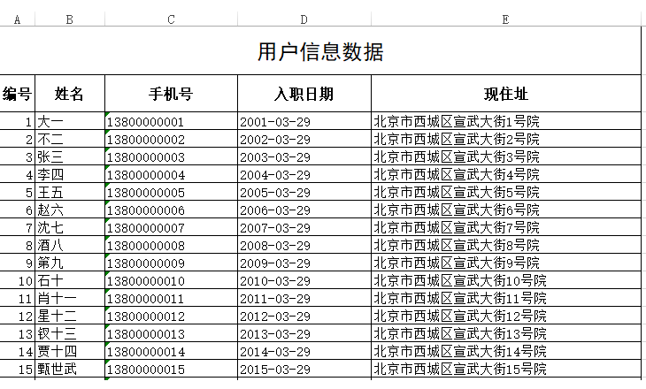
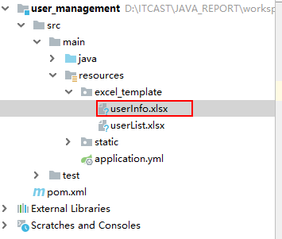
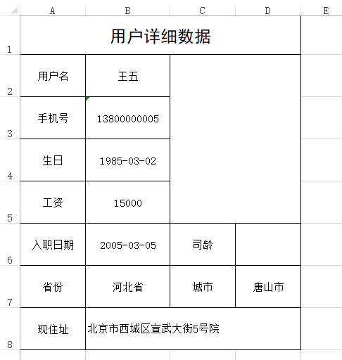
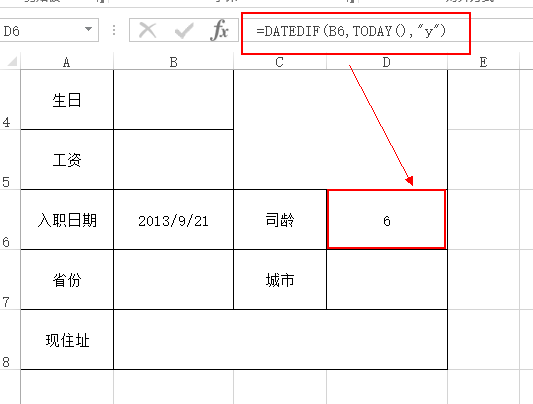
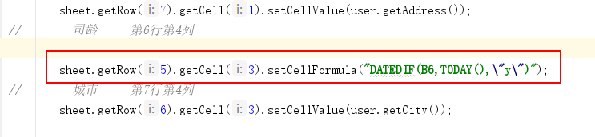
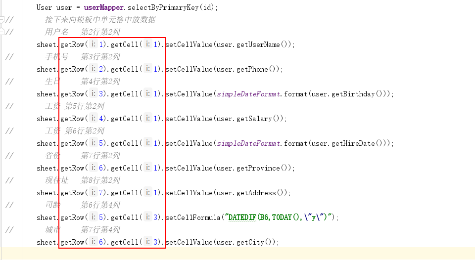
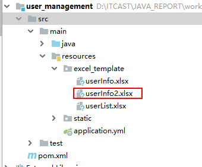
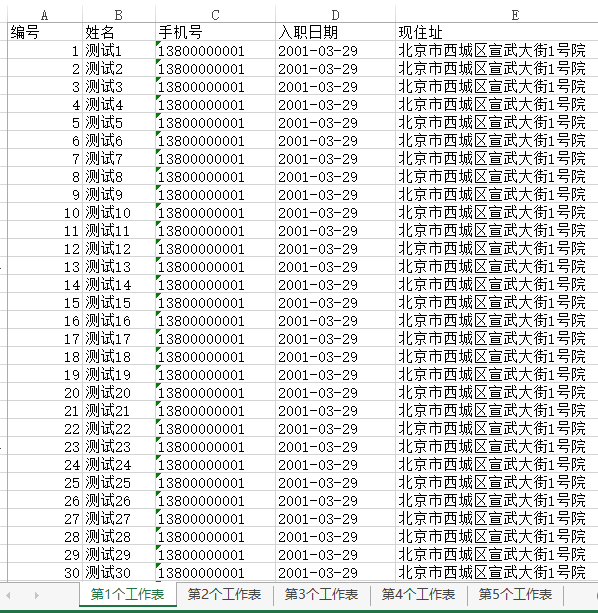

# 1、基于模板导出列表数据

## 1.1、需求

按照以下样式导出excel



## 1.2、思路

首先准备一个excel模板，这个模板把复杂的样式和固定的内容先准备好并且放入到项目中，然后读取到模板后向里面放入数据。


## 1.3、实现

第一步：准备一个excel作为导出的模板，模板内容如下

 第一个sheet：


第二个sheet：


第二步：把这个模板改一个英文名称比如：userList.xlsx,放入到项目中


第三步：UserService实现方法

```java
public void downLoadXlsxWithTempalte(HttpServletRequest request, HttpServletResponse response) throws Exception {
    //        获取模板的路径
    File rootPath = new File(ResourceUtils.getURL("classpath:").getPath()); //SpringBoot项目获取根目录的方式
    File templatePath = new File(rootPath.getAbsolutePath(),"/excel_template/userList.xlsx");
    //        读取模板文件产生workbook对象,这个workbook是一个有内容的工作薄
    Workbook workbook  = new XSSFWorkbook(templatePath);
    //        读取工作薄的第一个工作表，向工作表中放数据
    Sheet sheet = workbook.getSheetAt(0);
    //        获取第二个的sheet中那个单元格中的单元格样式
    CellStyle cellStyle = workbook.getSheetAt(1).getRow(0).getCell(0).getCellStyle();
    //        处理内容
    List<User> userList = this.findAll();
    int rowIndex = 2;
    Row row = null;
    Cell cell = null;
    for (User user : userList) {
        row = sheet.createRow(rowIndex);
        row.setHeightInPoints(15); //设置行高

        cell = row.createCell(0);
        cell.setCellValue(user.getId());
        cell.setCellStyle(cellStyle); //设置单元格样式

        cell = row.createCell(1);
        cell.setCellValue(user.getUserName());
        cell.setCellStyle(cellStyle);

        cell = row.createCell(2);
        cell.setCellValue(user.getPhone());
        cell.setCellStyle(cellStyle);

        cell = row.createCell(3);
        cell.setCellValue(simpleDateFormat.format(user.getHireDate()));
        cell.setCellStyle(cellStyle);

        cell = row.createCell(4);
        cell.setCellValue(user.getAddress());
        cell.setCellStyle(cellStyle);

        rowIndex++;
    }
    //            导出的文件名称
    String filename="用户列表数据.xlsx";
    //            设置文件的打开方式和mime类型
    ServletOutputStream outputStream = response.getOutputStream();
    response.setHeader( "Content-Disposition", "attachment;filename="  + new String(filename.getBytes(),"ISO8859-1"));
    response.setContentType("application/vnd.openxmlformats-officedocument.spreadsheetml.sheet");
    workbook.write(outputStream);

}
```

第四步：修改UserController中的方法，导出测试

```java
@GetMapping(value = "/downLoadXlsxByPoi",name = "使用POI下载高版本")
public void downLoadXlsx(HttpServletRequest request,HttpServletResponse response) throws Exception{
    //       userService.downLoadXlsx(response);
    userService.downLoadXlsxWithTempalte(request,response); //下载的excel带样式
}
```


# 2、导出用户详细数据

## 2.1、 需求

如下，点击用户列表中的下载按钮，下载文件内容如下


## 2.2、思路

最简单的方式就是先根据案例制作模板，导出时查询用户数据、读取模板，把数据放入到模板中对应的单元格中，其中我们先处理最基本的数据，稍后再处理图片

## 2.3、实现

第一步：制作一个excel导出模板，如下


第二步：制作好的模板放入到项目中



第三步：Controller中添加方法

```java
@GetMapping(value = "/download",name = "导出用户详细信息")
public void downLoadUserInfoWithTempalte(Long id,HttpServletRequest request,HttpServletResponse response) throws Exception{
    userService.downLoadUserInfoWithTempalte(id,request,response);
}
```


第四步：在UserService中添加方法

```java
    public void downLoadUserInfoWithTempalte(Long id, HttpServletRequest request, HttpServletResponse response) throws Exception  {
        //        获取模板的路径
        File rootPath = new File(ResourceUtils.getURL("classpath:").getPath()); //SpringBoot项目获取根目录的方式
        File templatePath = new File(rootPath.getAbsolutePath(),"/excel_template/userInfo.xlsx");
//        读取模板文件产生workbook对象,这个workbook是一个有内容的工作薄
        Workbook workbook  = new XSSFWorkbook(templatePath);
//        读取工作薄的第一个工作表，向工作表中放数据
        Sheet sheet = workbook.getSheetAt(0);
//        处理内容
        User user = userMapper.selectByPrimaryKey(id);
//        接下来向模板中单元格中放数据
//        用户名   第2行第2列
        sheet.getRow(1).getCell(1).setCellValue(user.getUserName());
//        手机号   第3行第2列
        sheet.getRow(2).getCell(1).setCellValue(user.getPhone());
//        生日     第4行第2列  日期转成字符串
        sheet.getRow(3).getCell(1).setCellValue
            (simpleDateFormat.format(user.getBirthday()));
//        工资 第5行第2列
        sheet.getRow(4).getCell(1).setCellValue(user.getSalary());
//        工资 第6行第2列
        sheet.getRow(5).getCell(1).setCellValue
            (simpleDateFormat.format(user.getHireDate()));
//        省份     第7行第2列
        sheet.getRow(6).getCell(1).setCellValue(user.getProvince());
//        现住址   第8行第2列
        sheet.getRow(7).getCell(1).setCellValue(user.getAddress());
//        司龄     第6行第4列暂时先不考虑
          
//        城市     第7行第4列
        sheet.getRow(6).getCell(3).setCellValue(user.getCity());

//            导出的文件名称
        String filename="用户详细信息数据.xlsx";
//            设置文件的打开方式和mime类型
        ServletOutputStream outputStream = response.getOutputStream();
        response.setHeader( "Content-Disposition", "attachment;filename="  + new String(filename.getBytes(),"ISO8859-1"));
        response.setContentType("application/vnd.openxmlformats-officedocument.spreadsheetml.sheet");
        workbook.write(outputStream);
    }
```


点击页面上的下载按钮，效果如下：



接下来处理一下头像照片和司龄


# 3、导出数据带图片、公式

## 3.1、导出图片

个人信息的导出中包含了头像照片，需要用到POI的导出图片功能，那么POI主要提供了两个类来处理照片，这两个类是Patriarch和ClientAnchor前者负责在表中创建图片，后者负责设置图片的大小位置。 

在UserService的方法中添加以下代码

```java
// 先创建一个字节输出流
ByteArrayOutputStream byteArrayOut = new ByteArrayOutputStream();
// BufferedImage是一个带缓冲区图像类,主要作用是将一幅图片加载到内存中
BufferedImage bufferImg = ImageIO.read(new File(rootPath + user.getPhoto()));
// 把读取到图像放入到输出流中
ImageIO.write(bufferImg, "jpg", byteArrayOut);
// 创建一个绘图控制类，负责画图
Drawing patriarch = sheet.createDrawingPatriarch();
// 指定把图片放到哪个位置
ClientAnchor anchor = new XSSFClientAnchor(0, 0, 0, 0, 2, 1, 4, 5);
// 开始把图片写入到sheet指定的位置
patriarch.createPicture(anchor, workbook.addPicture(
    byteArrayOut.toByteArray(), Workbook.PICTURE_TYPE_JPEG));
```

关于XSSFClientAnchor的8个参数说明：

```properties

dx1 - the x coordinate within the first cell.//定义了图片在第一个cell内的偏移x坐标，既左上角所在cell的偏移x坐标，一般可设0
dy1 - the y coordinate within the first cell.//定义了图片在第一个cell的偏移y坐标，既左上角所在cell的偏移y坐标，一般可设0
dx2 - the x coordinate within the second cell.//定义了图片在第二个cell的偏移x坐标，既右下角所在cell的偏移x坐标，一般可设0
dy2 - the y coordinate within the second cell.//定义了图片在第二个cell的偏移y坐标，既右下角所在cell的偏移y坐标，一般可设0

col1 - the column (0 based) of the first cell.//第一个cell所在列，既图片左上角所在列
row1 - the row (0 based) of the first cell.//图片左上角所在行
col2 - the column (0 based) of the second cell.//图片右下角所在列
row2 - the row (0 based) of the second cell.//图片右下角所在行
```


## 3.2、导出公式

应用场景说明，在导出用户详细数据时有一个司龄的显示，这里的司龄就是截止到现在入职到本公司的时间，为了学习POI对公式的操作，我们这里使用POI的公式来做。

计算截止到现在入职到本公司的时间应该用到两个日期相差的函数:DATEDIF函数，这个函数需要3个参数

P1: 一个日期  P2:截止日期   P3: 时间单位  举例：

1、**DATEDIF("2015-10-01","2020-10-01","y")** 结果是5

2、**CONCATENATE(DATEDIF("2015-10-01","2020-10-01","y")),"年",DATEDIF("2015-10-01","2020-10-01","ym"),"个月")**  结果是5年0个月

放到这个用户导出时，第一个参数就是放到相应单元格上数据，第二个参数就是当天时间，

如果直接在excel中操作，如下：



在使用POI导出时使用setCellFormula方法来设置公式：




关于POI支持公式详见官网： https://poi.apache.org/components/spreadsheet/eval-devguide.html 


***ps:其实在正常开发时应该在模板中直接设置好公式，这样打开直接导出的excel文档时公式会直接运行出我们想要的结果***


# 4、自定义导出详细数据的引擎

## 4.1、说明

看我们刚才导出时写的代码，必须要提前知道要导出数据在哪一行哪一个单元格，但是如果模板一旦发生调整，那么我们的java代码必须要修改，我们可以自定义个导出的引擎，有了这个引擎即使模板修改了我们的java代码也不用修改




## 4.2、思路

在制作模板时，在需要插入数据的位置我们坐上标记，在导出时，对象的属性要和标记做对应，如果对应匹配一样，就把值赋值到相应的位置。


## 4.3、实现

第一步：制作模板，命名 userInfo2.xlsx


第二步：添加到项目中



第三步：实现导出的引擎代码

```java
package com.itheima.utils;

import org.apache.commons.lang3.StringUtils;
import org.apache.poi.ss.usermodel.*;
import org.apache.poi.xssf.usermodel.XSSFClientAnchor;
import org.apache.tomcat.util.http.fileupload.ByteArrayOutputStream;
import org.springframework.util.ResourceUtils;

import javax.imageio.ImageIO;
import java.awt.image.BufferedImage;
import java.io.File;
import java.text.SimpleDateFormat;
import java.util.Date;
import java.util.Map;

public class ExcelExportEngine {

    private static SimpleDateFormat  sdf = new SimpleDateFormat("yyyy-MM-dd");

    public  static Workbook writeToExcel(Object object, Workbook workbook,String photoPath) throws Exception{
      //先把bean转成map
        Map<String, Object> map = EntityUtils.entityToMap(object);
        //循环遍历每一对数据,把日期型的转成字符串，方便导出
        for (String key : map.keySet()) {
            Object vlaue = map.get(key);
            if(vlaue instanceof Date){
                System.out.println(sdf.format(vlaue));
                map.put(key,sdf.format(vlaue));
            }
        }
        //获取第一个sheet，整体的思路是循环100个行的100个单元格
        Sheet sheet = workbook.getSheetAt(0);
        Cell cell =null;
        Row row = null;
        for (int i = 0; i < 100; i++) {
            row = sheet.getRow(i); //获取到空行为止
            if(row==null){
                break;
            }else{
                for (int j = 0; j < 100; j++) {
                    cell = row.getCell(j);//获取到空单元格不处理
                    if(cell!=null){
                        writeCell(cell,map); //开始向单元格中写内容
                    }
                }
            }
        }

        if(StringUtils.isNotBlank(photoPath)){
            File rootPath = new File(ResourceUtils.getURL("classpath:").getPath()); //SpringBoot项目获取根目录的方式
            ByteArrayOutputStream byteArrayOut = new ByteArrayOutputStream();
//        BufferedImage是一个带缓冲区图像类,主要作用是将一幅图片加载到内存中
            BufferedImage bufferImg = ImageIO
                    .read(new File(rootPath + photoPath));
            ImageIO.write(bufferImg, "jpg", byteArrayOut);
            Drawing patriarch = sheet.createDrawingPatriarch();

            Sheet sheet2 = workbook.getSheetAt(1);
            row = sheet2.getRow(0);
            int col1 = ((Double) row.getCell(0).getNumericCellValue()).intValue();
            int row1 = ((Double) row.getCell(1).getNumericCellValue()).intValue();
            int col2 = ((Double) row.getCell(2).getNumericCellValue()).intValue();
            int row2 = ((Double) row.getCell(3).getNumericCellValue()).intValue();
//            锚点，固定点
            ClientAnchor anchor = new XSSFClientAnchor(0, 0, 0, 0,  col1, row1, col2, row2);
            patriarch.createPicture(anchor, workbook.addPicture(byteArrayOut.toByteArray(), Workbook.PICTURE_TYPE_JPEG));
            workbook.removeSheetAt(1);
        }

        return workbook;
    }

    private static void writeCell(Cell cell, Map<String, Object> map) {
        CellType cellType = cell.getCellType();
        switch (cellType){
            case FORMULA:{  //如果是公式就直接放行了
                break;
            }default:{
                String cellValue = cell.getStringCellValue();
                //就是判断一下获取到单元格中的值是否和map中的key保持一致
                if(StringUtils.isNotBlank(cellValue)){
                    for (String key : map.keySet()) {
                        if(key.equals(cellValue)){
                            cell.setCellValue(map.get(key).toString());
                        }
                    }
                }
            }
        }
    }
}
```

第四步：修改UserService的方法

```java
public void downLoadUserInfoWithTempalte2(Long id, HttpServletRequest request, HttpServletResponse response) throws Exception  {
    //        获取模板的路径
    File rootPath = new File(ResourceUtils.getURL("classpath:").getPath()); //SpringBoot项目获取根目录的方式
    File templatePath = new File(rootPath.getAbsolutePath(),"/excel_template/userInfo2.xlsx");
    //        读取模板文件产生workbook对象,这个workbook是一个有内容的工作薄
    Workbook workbook  = new XSSFWorkbook(templatePath);
    // 查询用户信息
    User user = userMapper.selectByPrimaryKey(id);
   // 这里使用引擎直接导出
    workbook = ExcelExportEngine.writeToExcel(user,workbook,user.getPhoto());
    //            导出的文件名称
    String filename="用户详细信息数据.xlsx";
    //            设置文件的打开方式和mime类型
    ServletOutputStream outputStream = response.getOutputStream();
    response.setHeader( "Content-Disposition", "attachment;filename="  + new String(filename.getBytes(),"ISO8859-1"));
    response.setContentType("application/vnd.openxmlformats-officedocument.spreadsheetml.sheet");
    workbook.write(outputStream);
}
```


# 5、百万数据导出

## 5.1、概述

​	我们都知道Excel可以分为早期的Excel2003版本（使用POI的HSSF对象操作）和Excel2007版本（使用POI的XSSF操作），两者对百万数据的支持如下：
​	Excel 2003：在POI中使用HSSF对象时，excel 2003最多只允许存储65536条数据，一般用来处理较少的数据量。这时对于百万级别数据，Excel肯定容纳不了。
​	Excel 2007：当POI升级到XSSF对象时，它可以直接支持excel2007以上版本，因为它采用ooxml格式。这时excel可以支持1048576条数据，单个sheet表就支持近百万条数据。但实际运行时还可能存在问题，原因是执行POI报表所产生的行对象，单元格对象，字体对象，他们都不会销毁，这就导致OOM的风险。

## 5.2、解决方案分析

​	对于百万数据量的Excel导入导出，只讨论基于Excel2007的解决方法。在ApachePoi 官方提供了对操作大数据量的导入导出的工具和解决办法，操作Excel2007使用XSSF对象，可以分为三种模式：

 java代码解析xml

 dom4j:一次性加载xml文件再解析

 SAX:逐行加载，逐行解析

 **用户模式：**用户模式有许多封装好的方法操作简单，但创建太多的对象，非常耗内存（之前使用的方法）

 **事件模式：**基于SAX方式解析XML，SAX全称Simple API for XML，它是一个接口，也是一个软件包。它是一种XML解析的替代方法，不同于DOM解析XML文档时把所有内容一次性加载到内存中的方式，它逐行扫描文档，一边扫描，一边解析。

 **SXSSF对象**：是用来生成海量excel数据文件，主要原理是借助临时存储空间生成excel

  

 

## 5.3、原理分析 

在实例化SXSSFWorkBook这个对象时，可以指定在内存中所产生的POI导出相关对象的数量（默认100），一旦内存中的对象的个数达到这个指定值时，就将内存中的这些对象的内容写入到磁盘中（XML的文件格式），就可以将这些对象从内存中销毁，以后只要达到这个值，就会以类似的处理方式处理，直至Excel导出完成。

## 5.4、百万数据的导出

### 5.4.1、模拟数据

第一步、创建表

```sql
CREATE TABLE `tb_user2` (
  `id` bigint(20) NOT NULL  COMMENT '用户ID',
  `user_name` varchar(100) DEFAULT NULL COMMENT '姓名',
  `phone` varchar(15) DEFAULT NULL COMMENT '手机号',
  `province` varchar(50) DEFAULT NULL COMMENT '省份',
  `city` varchar(50) DEFAULT NULL COMMENT '城市',
  `salary` int(10) DEFAULT NULL,
  `hire_date` datetime DEFAULT NULL COMMENT '入职日期',
  `dept_id` bigint(20) DEFAULT NULL COMMENT '部门编号',
  `birthday` datetime DEFAULT NULL COMMENT '出生日期',
  `photo` varchar(200) DEFAULT NULL COMMENT '照片路径',
  `address` varchar(300) DEFAULT NULL COMMENT '现在住址' 
) ENGINE=InnoDB DEFAULT CHARSET=utf8;

```

2、创建存储过程

 ```sql
DELIMITER $$    -- 重新定义“;”分号
DROP PROCEDURE IF EXISTS test_insert $$   -- 如果有test_insert这个存储过程就删除
CREATE PROCEDURE test_insert()			  -- 创建存储过程

BEGIN
	DECLARE n int DEFAULT 1;				    -- 定义变量n=1
	SET AUTOCOMMIT=0;						    -- 取消自动提交
	
		while n <= 5000000 do					
			INSERT INTO `tb_user2` VALUES ( n, CONCAT('测试', n), '13800000001', '北京市', '北京市', '11000', '2001-03-01 21:18:29', '1', '1981-03-02 00:00:00', '\\static\\user_photos\\1.jpg', '北京市西城区宣武大街1号院');
			SET n=n+1;
		END while;
		COMMIT;
END $$

 ```

3、开始执行

```sql
CALL test_insert();
```

 插入500W数据大概需要200至300秒左右


### 5.4.2、思路分析

导出时使用的是SXSSFWorkBook这个类，一个工作表sheet最多只能放1048576行数据， 当我们的业务数据已超过100万了，一个sheet就不够用了，必须拆分到多个工作表。

导出百万数据时有两个弊端：

1、不能使用模板

2、不能使用太多的样式  

也就是说导出的数据太多时必须要放弃一些。

### 5.4.3、代码实现

UserController代码

```java
@GetMapping(value = "/downLoadMillion",name = "导出用户百万数据的导出")
public void downLoadMillion(Long id,HttpServletRequest request,HttpServletResponse response) throws Exception{
    userService.downLoadMillion(request,response);
}
```

UserService代码

```java
public void downLoadMillion(HttpServletRequest request, HttpServletResponse response) throws Exception {
//        创建一个空的工作薄
        Workbook workbook = new SXSSFWorkbook();
        int page = 1;
        int pageSize=200000;
        int rowIndex = 1; //每一个工作页的行数
        int num = 0; //总数据量
        Row row = null;
        Cell cell = null;
        Sheet sheet = null;
        while (true){  //不停地查询
             List<User> userList = this.findPage(page,pageSize);
             if(CollectionUtils.isEmpty(userList)){  //如果查询不到就不再查询了
                 break;
             }
            if(num%1000000==0){  //每100W个就重新创建新的sheet和标题
                rowIndex = 1;
                 //        在工作薄中创建一个工作表
                 sheet = workbook.createSheet("第"+((num/1000000)+1)+"个工作表");
//        设置列宽
                 sheet.setColumnWidth(0,8*256);
                 sheet.setColumnWidth(1,12*256);
                 sheet.setColumnWidth(2,15*256);
                 sheet.setColumnWidth(3,15*256);
                 sheet.setColumnWidth(4,30*256);
                 //            处理标题
                 String[] titles = new String[]{"编号","姓名","手机号","入职日期","现住址"};
                //        创建标题行
                Row titleRow = sheet.createRow(0);

                for (int i = 0; i < titles.length; i++) {
                    cell = titleRow.createCell(i);
                    cell.setCellValue(titles[i]);
                }
             }

//        处理内容

        for (User user : userList) {
            row = sheet.createRow(rowIndex);
            cell = row.createCell(0);
            cell.setCellValue(user.getId());

            cell = row.createCell(1);
            cell.setCellValue(user.getUserName());

            cell = row.createCell(2);
            cell.setCellValue(user.getPhone());

            cell = row.createCell(3);
            cell.setCellValue(simpleDateFormat.format(user.getHireDate()));

            cell = row.createCell(4);
            cell.setCellValue(user.getAddress());
            rowIndex++;
            num++;
        }
          page++;// 继续查询下一页
        }
//            导出的文件名称
        String filename="百万数据.xlsx";
//            设置文件的打开方式和mime类型
        ServletOutputStream outputStream = response.getOutputStream();
        response.setHeader( "Content-Disposition", "attachment;filename="  + new String(filename.getBytes(),"ISO8859-1"));
        response.setContentType("application/vnd.openxmlformats-officedocument.spreadsheetml.sheet");
        workbook.write(outputStream);
    }
```


### 5.4.4、测试结果

导出的这个文档大概需要3-5分钟的时间，有105 MB，内容如下




