# 1、了解百万数据的导入

## 1.1 需求分析

使用POI基于事件模式解析案例提供的Excel文件

## 1.2  思路分析

  **用户模式：**加载并读取Excel时，是通过一次性的将所有数据加载到内存中再去解析每个单元格内容。当Excel数据量较大时，由于不同的运行环境可能会造成内存不足甚至OOM异常。

例如读取我们刚刚导出的百万数据：

```java
package com.itheima.test;

import org.apache.poi.xssf.usermodel.XSSFSheet;
import org.apache.poi.xssf.usermodel.XSSFWorkbook;

//测试百万数据的导入
public class POIDemo5 {
    public static void main(String[] args) throws Exception {
        XSSFWorkbook workbook = new XSSFWorkbook("C:\\Users\\syl\\Desktop\\百万用户数据的导出.xlsx");
        XSSFSheet sheetAt = workbook.getSheetAt(0);
        String stringCellValue = sheetAt.getRow(0).getCell(0).getStringCellValue();
        System.out.println(stringCellValue);
    }
}

```

会直接报内存溢出的错误：

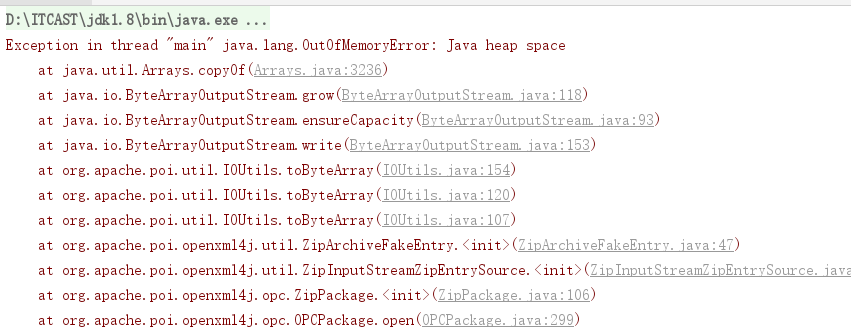


  **事件模式：**它逐行扫描文档，一边扫描一边解析。由于应用程序只是在读取数据时检查数据，因此不需要将数据存储在内存中，这对于大型文档的解析是个巨大优势。

 

## 1.3 代码实现

### 1.3.1 步骤分析

（1）设置POI的事件模式
   根据Excel获取文件流
   根据文件流创建OPCPackage  用来组合读取到的xml 组合出来的数据占用的空间更小
   创建XSSFReader对象
（2）Sax解析
   **自定义Sheet处理器**
   创建Sax的XmlReader对象
   设置Sheet的事件处理器
   逐行读取

### 1.3.2  自定义处理器

```java
package com.itheima.test;

import com.itheima.pojo.User;
import org.apache.poi.xssf.eventusermodel.XSSFSheetXMLHandler;
import org.apache.poi.xssf.usermodel.XSSFComment;

public class SheetHandler implements XSSFSheetXMLHandler.SheetContentsHandler {

//    编号 用户名  手机号  入职日期 现住址
    private User user=null;
    @Override
    public void startRow(int rowIndex) { //每一行的开始   rowIndex代表的是每一个sheet的行索引
        if(rowIndex==0){
            user = null;
        }else{
            user = new User();
        }
    }
    @Override  //处理每一行的所有单元格
    public void cell(String cellName, String cellValue, XSSFComment comment) {

        if(user!=null){
            String letter = cellName.substring(0, 1);  //每个单元名称的首字母 A  B  C
            switch (letter){
                case "A":{
                    user.setId(Long.parseLong(cellValue));
                    break;
                }
                case "B":{
                    user.setUserName(cellValue);
                    break;
                }
            }
        }
    }
    @Override
    public void endRow(int rowIndex) { //每一行的结束
        if(rowIndex!=0){
            System.out.println(user);
        }

    }
}

```


### 1.3.3  自定义解析

在今天的资料中提供了这个类，直接可以拿过来使用

```java
package com.itheima.test;

import org.apache.poi.openxml4j.opc.OPCPackage;
import org.apache.poi.openxml4j.opc.PackageAccess;
import org.apache.poi.xssf.eventusermodel.XSSFReader;
import org.apache.poi.xssf.eventusermodel.XSSFSheetXMLHandler;
import org.apache.poi.xssf.model.SharedStringsTable;
import org.apache.poi.xssf.model.StylesTable;
import org.xml.sax.InputSource;
import org.xml.sax.XMLReader;
import org.xml.sax.helpers.XMLReaderFactory;

import java.io.InputStream;

/**
 * 自定义Excel解析器
 */
public class ExcelParser {

    public void parse (String path) throws Exception {
        //1.根据Excel获取OPCPackage对象
        OPCPackage pkg = OPCPackage.open(path, PackageAccess.READ);
        try {
            //2.创建XSSFReader对象
            XSSFReader reader = new XSSFReader(pkg);
            //3.获取SharedStringsTable对象
            SharedStringsTable sst = reader.getSharedStringsTable();
            //4.获取StylesTable对象
            StylesTable styles = reader.getStylesTable();
            XMLReader parser = XMLReaderFactory.createXMLReader();
            // 处理公共属性：Sheet名，Sheet合并单元格
            parser.setContentHandler(new XSSFSheetXMLHandler(styles,sst, new SheetHandler(), false));
            XSSFReader.SheetIterator sheets = (XSSFReader.SheetIterator) reader.getSheetsData();
            while (sheets.hasNext()) {
                InputStream sheetstream = sheets.next();
                InputSource sheetSource = new InputSource(sheetstream);
                try {
                    parser.parse(sheetSource);
                } finally {
                    sheetstream.close();
                }
            }
        } finally {
            pkg.close();
        }
    }
}

```


### 1.3.4 测试

用户模式下读取测试Excel文件直接内存溢出，测试Excel文件映射到内存中还是占用了不少内存；事件模式下可以流畅的运行。

 使用事件模型解析

```java
public class POIDemo5 {
    public static void main(String[] args) throws Exception{
        new ExcelParser().parse("C:\\Users\\syl\\Desktop\\百万用户数据的导出.xlsx");
    }
}
```


# 2、opencsv操作CSV文件

## 2.1 CSV文件简介

现在好多的网站中导出的文件会出现一种csv文件，我们接下来学习一下csv文件的导出方式。

CSV文件：Comma-Separated Values，中文叫逗号分隔值或者字符分割值，其文件以纯文本的形式存储表格数据。该文件是一个字符序列，可以由任意数目的记录组成，记录间以某种换行符分割。每条记录由字段组成，字段间的分隔符是其他字符或者字符串。所有的记录都有完全相同的字段序列，相当于一个结构化表的纯文本形式。
用文本文件、excel或者类似与文本文件的编辑器都可以打开CSV文件。

为了简化开发，我们可以使用opencsv类库来导出csv文件

需要的依赖

```xml
<dependency>
    <groupId>com.opencsv</groupId>
    <artifactId>opencsv</artifactId>
    <version>4.5</version>
</dependency>
```


## 2.2 opencsv常用API

写入到csv文件会用到CSVWriter对象，创建此对象常见API如下

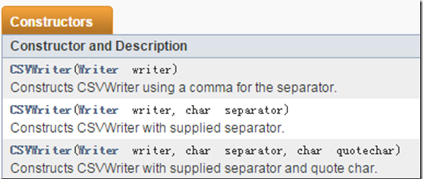


使用CSVWriter对象写入数据常用的方法如下：

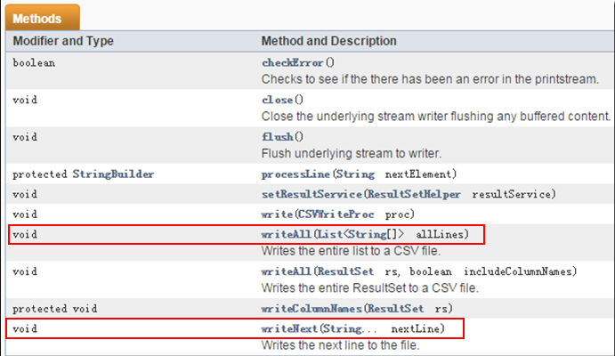


读取csv文件会用到CSVReader对象，创建此对象常见API如下

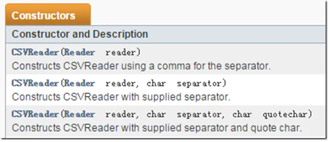

构造器涉及到的三个参数：

1. reader：读取文件的流对象，常有的是BufferedReader，InputStreamReader。
2. separator：用于定义前面提到的分割符，默认为逗号`CSVWriter.DEFAULT_SEPARATOR`用于分割各列。
3. quotechar：用于定义各个列的引号，有时候csv文件中会用引号或者其它符号将一个列引起来，例如一行可能是："1","2","3"，如果想读出的字符不包含引号，就可以把参数设为："CSVWriter.NO_QUOTE_CHARACTER "


read方法


## 2.3 导出CSV文件

### 2.3.1 需求

我们还是以需求作为学习的驱动：把用户的列表数据导出到csv文件中

### 2.3.2 代码实现

UserController代码

```java
@GetMapping(value = "/downLoadCSV",name = "导出用户数据到CSV文件中")
public void downLoadCSV(HttpServletResponse response){
    userService.downLoadCSV(response);
}
```

UserService代码

```java
public void downLoadCSV(HttpServletResponse response) {

    try {
        //            准备输出流
        ServletOutputStream outputStream = response.getOutputStream();
        //            文件名
        String filename="百万数据.csv";
        //            设置两个头 一个是文件的打开方式 一个是mime类型
        response.setHeader( "Content-Disposition", "attachment;filename="  + new String(filename.getBytes(),"ISO8859-1"));
        response.setContentType("text/csv");
        //            创建一个用来写入到csv文件中的writer
        CSVWriter writer = new CSVWriter(new OutputStreamWriter(outputStream,"utf-8"));
        //            先写头信息
        writer.writeNext(new String[]{"编号","姓名","手机号","入职日期","现住址"});

        //            如果文件数据量非常大的时候，我们可以循环查询写入
        int page = 1;
        int pageSize=200000;
        while (true) {  //不停地查询
            List<User> userList = this.findPage(page, pageSize);
            if (CollectionUtils.isEmpty(userList)) {  //如果查询不到就不再查询了
                break;
            }
            //                把查询到的数据转成数组放入到csv文件中
            for (User user : userList) {
                writer.writeNext(new String[]{user.getId().toString(),user.getUserName(),user.getPhone(),simpleDateFormat.format(user.getHireDate()),user.getAddress()});
            }
            writer.flush();
            page++;
        }
        writer.close();
    } catch (Exception e) {
        e.printStackTrace();
    }
}
```

## 2.4 了解opencsv读取CSV文件

读取刚才导出的CSV文件

```java
package com.itheima.test;

import com.itheima.pojo.User;
import com.opencsv.CSVReader;

import java.io.FileReader;
import java.text.SimpleDateFormat;
import java.time.Year;
import java.util.List;

//读取百万级数据的csv文件
public class CsvDemo {

    private static SimpleDateFormat simpleDateFormat = new SimpleDateFormat("yyyy-MM-dd");

    public static void main(String[] args) throws Exception {
        CSVReader csvReader = new CSVReader(new FileReader("d:\\百万用户数据的导出.csv"));
        String[] titles = csvReader.readNext(); //读取到第一行 是小标题
//        "编号","姓名","手机号","入职日期","现住址"
        User user = null;
        while (true){
            user = new User();
            String[] content = csvReader.readNext();
            if(content==null){
                break;
            }
            user.setId(Long.parseLong(content[0]));
            user.setUserName(content[1]);
            user.setPhone(content[2]);
            user.setHireDate(simpleDateFormat.parse(content[3]));
            user.setAddress(content[4]);
            System.out.println(user);
        }
    }
}

```

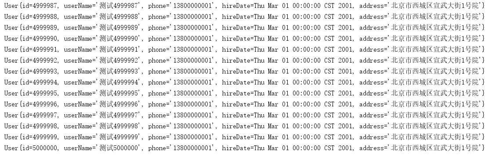


# 3、POI导出word

## 3.1 需求

在列表页面中点击合同按钮，跳转到合同页面

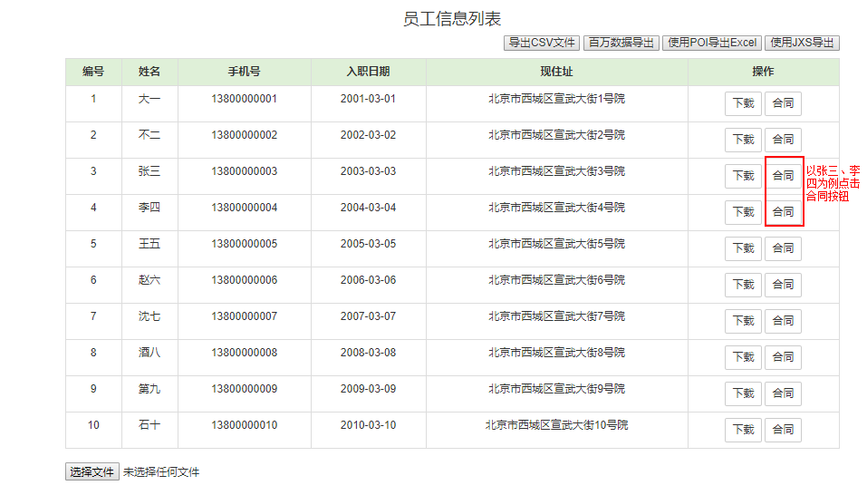

页面中有下载按钮，点击下载按钮，把页面展示的内容导出到word中。

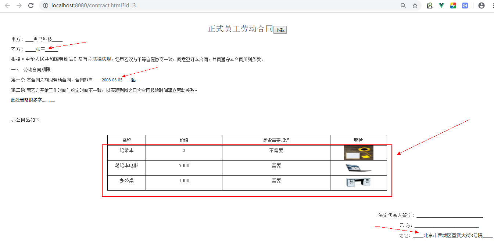


## 3.2 分析

### 3.2.1 POI操作Word的API介绍

poi对低版本的doc本身支持的就不好所以我们直接说高版本的docx版本的api。

1、poi操作word正文

 XWPFDocument代表一个docx文档，其可以用来读docx文档，也可以用来写docx文档 

一个文档包含多个段落，一个段落包含多个Runs文本，一个Runs包含多个Run，Run是文档的最小单元

获取所有段落：List<XWPFParagraph> paragraphs = word.getParagraphs();

获取一个段落中的所有片段Runs：List<XWPFRun> xwpfRuns = xwpfParagraph.getRuns();

获取一个Runs中的一个Run：XWPFRun run = xwpfRuns.get(index);

2、poi操作word中的表格

一个文档包含多个表格，一个表格包含多行，一行包含多列单元格

获取所有表格：List<XWPFTable> xwpfTables = doc.getTables();

获取一个表格中的所有行：List<XWPFTableRow> xwpfTableRows = xwpfTable.getRows();

获取一行中的所有列：List<XWPFTableCell> xwpfTableCells = xwpfTableRow.getTableCells();

获取一格里的内容：List<XWPFParagraph> paragraphs = xwpfTableCell.getParagraphs();

之后和正文段落一样


### 3.2.2 思路分析

首先我们先制作一个word模板，把动态的内容先写特殊字符然后替换，表格的话需要我们自己创建然后向表格中放内容。

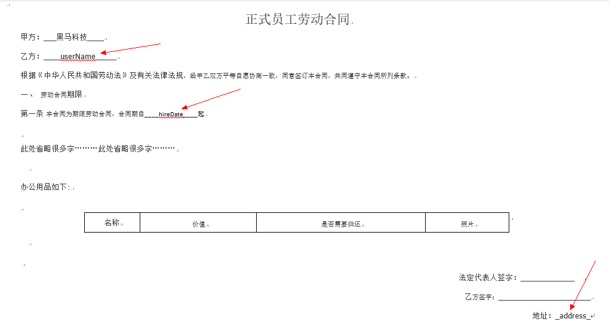

## 3.3 代码实现

第一步：制作模板（模板内容如上图所示），放入到项目中

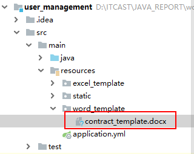

第二步：提供根据id查询用户的方法，并且用户中带有办公资源数据

1、User类中添加一个集合属性

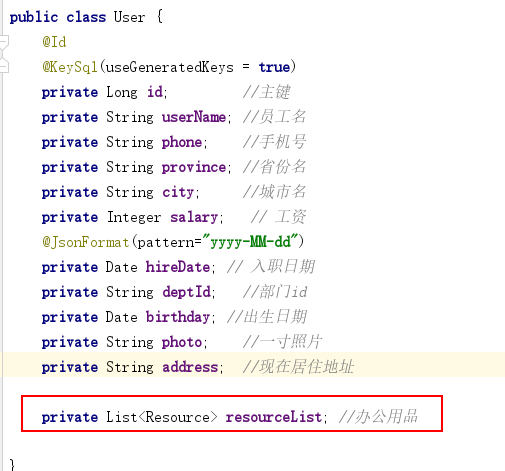

2、UserController代码

提供一个根据用户ID查询用户对象

```java
@GetMapping("/{id}")
public User  findById(@PathVariable("id") Long id){
    return userService.findById(id);
}

```

3、UserService代码

查询用户信息，并且查询用户的办公用品数据，赋值到用户中

```java
@Autowired
private ResourceMapper resourceMapper;
public User findById(Long id) {
    //查询用户
    User user = userMapper.selectByPrimaryKey(id);
    //根据用户id查询办公用品
    Resource resource = new Resource();
    resource.setUserId(id);
    List<Resource> resourceList = resourceMapper.select(resource);
    user.setResourceList(resourceList);
    return user;
}

```

第三步：完成导出word功能

Controller代码

```java
@GetMapping(value = "/downloadContract",name = "导出用户合同")
public void downloadContract(Long id,HttpServletResponse response) throws Exception{
    userService.downloadContract(id,response);
}
```

UserService代码

先准备两个方法，一个是想指定的单元格中放入图片，另一个是 复制word中表格的行

```java

//    向单元格中写入图片
private void setCellImage(XWPFTableCell cell, File imageFile) {

    XWPFRun run = cell.getParagraphs().get(0).createRun();
    //        InputStream pictureData, int pictureType, String filename, int width, int height
    try(FileInputStream inputStream = new FileInputStream(imageFile)) {
        run.addPicture(inputStream,XWPFDocument.PICTURE_TYPE_JPEG,imageFile.getName(), Units.toEMU(100),Units.toEMU(50));
    } catch (Exception e) {
        e.printStackTrace();
    }

}

//    用于深克隆行
private void copyRow(XWPFTable xwpfTable, XWPFTableRow sourceRow, int rowIndex) {
    XWPFTableRow targetRow = xwpfTable.insertNewTableRow(rowIndex);
    targetRow.getCtRow().setTrPr(sourceRow.getCtRow().getTrPr());
    //        获取源行的单元格
    List<XWPFTableCell> cells = sourceRow.getTableCells();
    if(CollectionUtils.isEmpty(cells)){
        return;
    }
    XWPFTableCell targetCell = null;
    for (XWPFTableCell cell : cells) {
        targetCell = targetRow.addNewTableCell();
        //            附上单元格的样式
        //            单元格的属性
        targetCell.getCTTc().setTcPr(cell.getCTTc().getTcPr());
        targetCell.getParagraphs().get(0).getCTP().setPPr(cell.getParagraphs().get(0).getCTP().getPPr());
    }
}
```

完成导出主体方法

```java
/**
     * 下载用户合同数据
     * @param id
     */
public void downloadContract(Long id,HttpServletResponse response) throws Exception {
    //        1、读取到模板
    File rootFile = new File(ResourceUtils.getURL("classpath:").getPath()); //获取项目的根目录
    File templateFile = new File(rootFile, "/word_template/contract_template.docx");
    XWPFDocument word = new XWPFDocument(new FileInputStream(templateFile));
    //        2、查询当前用户User--->map
    User user = this.findById(id);
    Map<String,String> params = new HashMap<>();
    params.put("userName",user.getUserName());
    params.put("hireDate",simpleDateFormat.format(user.getHireDate()));
    params.put("address",user.getAddress());
    //        3、替换数据
    //         处理正文开始
    List<XWPFParagraph> paragraphs = word.getParagraphs();
    for (XWPFParagraph paragraph : paragraphs) {
        List<XWPFRun> runs = paragraph.getRuns();
        for (XWPFRun run : runs) {
            String text = run.getText(0);
            for (String key : params.keySet()) {
                if(text.contains(key)){
                    run.setText(text.replaceAll(key,params.get(key)),0);
                }
            }
        }
    }
    //         处理正文结束

    //      处理表格开始     名称	价值	是否需要归还	照片
    List<Resource> resourceList = user.getResourceList(); //表格中需要的数据
    XWPFTable xwpfTable = word.getTables().get(0);

    XWPFTableRow row = xwpfTable.getRow(0);
    int rowIndex = 1;
    for (Resource resource : resourceList) {
        //        添加行
        //            xwpfTable.addRow(row);
        copyRow(xwpfTable,row,rowIndex);
        XWPFTableRow row1 = xwpfTable.getRow(rowIndex);
        row1.getCell(0).setText(resource.getName());
        row1.getCell(1).setText(resource.getPrice().toString());
        row1.getCell(2).setText(resource.getNeedReturn()?"需求":"不需要");

        File imageFile = new File(rootFile,"/static"+resource.getPhoto());
        setCellImage(row1.getCell(3),imageFile);
        rowIndex++;
    }
    //     处理表格开始结束
    //        4、导出word
    String filename = "员工(" + user.getUserName() + ")合同.docx";
    response.setHeader("content-disposition", "attachment;filename=" + new String(filename.getBytes(), "ISO8859-1"));
    response.setContentType("application/vnd.openxmlformats-officedocument.spreadsheetml.sheet");
    word.write(response.getOutputStream());
}
```

# 4、easyPOI

## 4.1 简介

以上在导出导出excel、导出csv、word时代码有点过于繁琐，好消息是近两年在开发市场上流行一种简化POI开发的类库：easyPOI。从名称上就能发现就是为了简化开发。

**能干什么？**

Excel的快速导入导出,Excel模板导出,Word模板导出,可以仅仅5行代码就可以完成Excel的导入导出,修改导出格式简单粗暴,快速有效。

**为谁而开发？**

不太熟悉poi的
不想写太多重复太多的
只是简单的导入导出的
喜欢使用模板的
都可以使用easypoi

**目标是什么？**
Easypoi的目标不是替代poi,而是让一个不懂导入导出的快速使用poi完成Excel和word的各种操作,而不是看很多api才可以完成这样工作。

再次强调一下easyPOI完全替代不了POI！


**需要的依赖**

把项目中的poi的依赖去除

```xml
<dependency>
    <groupId>cn.afterturn</groupId>
    <artifactId>easypoi-base</artifactId>
    <version>4.1.0</version>
</dependency>
<dependency>
    <groupId>cn.afterturn</groupId>
    <artifactId>easypoi-web</artifactId>
    <version>4.1.0</version>
</dependency>
<dependency>
    <groupId>cn.afterturn</groupId>
    <artifactId>easypoi-annotation</artifactId>
    <version>4.1.0</version>
</dependency>
```

或SpringBoot

```xml
<dependency>
    <groupId>cn.afterturn</groupId>
    <artifactId>easypoi-spring-boot-starter</artifactId>
    <version>4.1.0</version>
</dependency>
```


## 4.2 注解方式导出

第一步：修改实体类，添加注解

其中主要用到的注解是@Excel注解，更详细的说明<a href="#excle注解">请看这里</a> (按住ctrl点击)

此处注意必须要有空构造函数，否则会报错“对象创建错误”

```java
package com.itheima.pojo;
import cn.afterturn.easypoi.excel.annotation.Excel;
import com.fasterxml.jackson.annotation.JsonFormat;
import com.opencsv.bean.CsvBindByName;
import lombok.Data;
import tk.mybatis.mapper.annotation.KeySql;
import javax.persistence.Id;
import javax.persistence.Table;
import java.util.Date;
import java.util.List;
/**
 * 员工
 */
@Data
@Table(name="tb_user")
public class User {
    @Id
    @KeySql(useGeneratedKeys = true)
    @Excel(name = "编号", orderNum = "0", width = 5)
    private Long id;         //主键
    @Excel(name = "员工名", orderNum = "1", width = 15)
    private String userName; //员工名
    @Excel(name = "手机号", orderNum = "2", width = 15)
    private String phone;    //手机号
    @Excel(name = "省份名", orderNum = "3", width = 15)
    private String province; //省份名
    @Excel(name = "城市名", orderNum = "4", width = 15)
    private String city;     //城市名
    @Excel(name = "工资", orderNum = "5", width = 10)
    private Integer salary;   // 工资
    @JsonFormat(pattern="yyyy-MM-dd")
    @Excel(name = "入职日期",  format = "yyyy-MM-dd",orderNum = "6", width = 15)
    private Date hireDate; // 入职日期
    private String deptId;   //部门id
    @Excel(name = "出生日期",  format = "yyyy-MM-dd",orderNum = "7", width = 15)
    private Date birthday; //出生日期
    @Excel(name = "照片", orderNum = "10",width = 15,type = 2)
    private String photo;    //一寸照片
    @Excel(name = "现在居住地址", orderNum = "9", width = 30)
    private String address;  //现在居住地址

    private List<Resource> resourceList; //办公用品

}

```

第二步：UserController添加方法

```java
@GetMapping(value = "/downLoadWithEasyPOI",name = "使用EasyPOI下载Excel")
public void downLoadWithEasyPOI(HttpServletRequest request,HttpServletResponse response) throws Exception{
    userService.downLoadXlsxWithEayPoi(request,response);
}
```


第三步：UserService实现方法

```java
public void downLoadXlsxWithEayPoi(HttpServletRequest request, HttpServletResponse response) throws Exception {
    //        查询用户数据
    List<User> userList = userMapper.selectAll();
    //指定导出的格式是高版本的格式
    ExportParams exportParams = new ExportParams("员工信息", "数据",ExcelType.XSSF);
    //        直接使用EasyPOI提供的方法
    Workbook workbook = ExcelExportUtil.exportExcel(exportParams, User.class, userList);
    String filename="员工信息.xlsx";
    //            设置文件的打开方式和mime类型
    ServletOutputStream outputStream = response.getOutputStream();
    response.setHeader( "Content-Disposition", "attachment;filename="  + new String(filename.getBytes(),"ISO8859-1"));
    response.setContentType("application/vnd.openxmlformats-officedocument.spreadsheetml.sheet");
    workbook.write(outputStream);
}
```

## 4.3 注解方式导入

有导出就应该有导入，我们就把刚才导出的数据库导入到表中

Excel导入时需要的参数类ImportParams常用设置说明

1. 读取指定的sheet 比如要读取上传得第二个sheet 那么需要把startSheetIndex = 1 就可以了
2. 读取几个sheet  比如读取前2个sheet,那么 sheetNum=2 就可以了
3. 读取第二个到第五个sheet 设置 startSheetIndex = 1 然后sheetNum = 4
4. 读取全部的sheet sheetNum  设置大点就可以了
5. 保存Excel 设置 needVerfiy = true,默认保存的路径为upload/excelUpload/Test/yyyyMMddHHmss 保存名称上传时间五位随机数 如果自定义路径 修改下saveUrl 就可以了,同时saveUrl也是图片上传时候的保存的路径
6. 判断一个Excel是不是合法的Excel  importFields 设置下值,就是表示表头必须至少包含的字段,如果缺一个就是不合法的excel,不导入
7. 图片的导入

有图片的导出就有图片的导入,导入的配置和导出是一样的,但是需要设置保存路径 1.设置保存路径saveUrl 默认为"upload/excelUpload" 可以手动修改 ImportParams 修改下就可以了


第一步：修改实体类，表明哪些需要导入

```java
package com.itheima.pojo;
import cn.afterturn.easypoi.excel.annotation.Excel;
import com.fasterxml.jackson.annotation.JsonFormat;
import lombok.Data;
import tk.mybatis.mapper.annotation.KeySql;

import javax.persistence.Id;
import javax.persistence.Table;
import java.util.Date;
import java.util.List;
/**
 * 员工
 */
@Data
@Table(name="tb_user")
public class User {
    @Id
    @KeySql(useGeneratedKeys = true)
    @Excel(name = "编号", orderNum = "0", width = 5)
    private Long id;         //主键
    @Excel(name = "员工名", orderNum = "1", width = 15,isImportField="true")
    private String userName; //员工名
    @Excel(name = "手机号", orderNum = "2", width = 15,isImportField="true")
    private String phone;    //手机号
    @Excel(name = "省份名", orderNum = "3", width = 15,isImportField="true")
    private String province; //省份名
    @Excel(name = "城市名", orderNum = "4", width = 15,isImportField="true")
    private String city;     //城市名
    @Excel(name = "工资", orderNum = "5", width = 10, type=10, isImportField="true") //type=10表示会导出数字
    private Integer salary;   // 工资
    @JsonFormat(pattern="yyyy-MM-dd")
    @Excel(name = "入职日期",  format = "yyyy-MM-dd",orderNum = "6", width = 15,isImportField="true")
    private Date hireDate; // 入职日期
    private String deptId;   //部门id
    @Excel(name = "出生日期",  format = "yyyy-MM-dd",orderNum = "7", width = 15,isImportField="true")
    private Date birthday; //出生日期
    @Excel(name = "照片", orderNum = "10",width = 15,type = 2,isImportField="true",savePath = "D:\\java_report\\workspace\\user_management\\src\\main\\resources\\static\\user_photos\\")
    private String photo;    //一寸照片
    @Excel(name = "现在居住地址", orderNum = "9", width = 30,isImportField="true")
    private String address;  //现在居住地址

    private List<Resource> resourceList; //办公用品

}

```

第二步：修改UserController中的导入方法

```java
@PostMapping(value = "/uploadExcle", name = "上传用户数据")
public void uploadExcle(MultipartFile file) throws Exception{
    //        userService.uploadExcle(file);
    userService.uploadExcleWithEasyPOI(file);
}
```


第三步：在UserService中添加使用easyPOI导入的方法

```java
public void uploadExcleWithEasyPOI(MultipartFile file) throws Exception {

    ImportParams importParams = new ImportParams();
    importParams.setTitleRows(1); //有多少行的标题
    importParams.setHeadRows(1);//有多少行的头
    List<User> userList = ExcelImportUtil.importExcel(file.getInputStream(),User.class,importParams);

    System.out.println(userList);
    for (User user : userList) {
        user.setId(null);
        userMapper.insertSelective(user);
    }
}
```

## 4.4 模板方式导出数据

模板是处理复杂Excel的简单方法，复杂的Excel样式，可以用Excel直接编辑，完美的避开了代码编写样式的雷区，同时指令的支持，也提了模板的有效性
 **采用的写法是{{}}代表表达式，然后根据表达式里面的数据取值**

关于样式问题
**easypoi不会改变excel原有的样式**


需求：导出用户的详细信息，这个功能我们做过，今天我们使用easyPOI的方式再做一次

第一步：制作模板

这个模板和我们做的userInfo2.xlsx模板一样，只是这个变量使用了{{}}包起来了

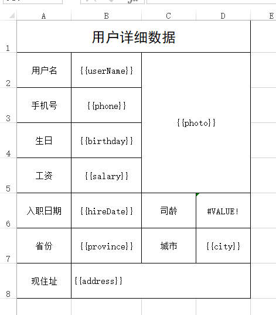

第二步：放到项目中

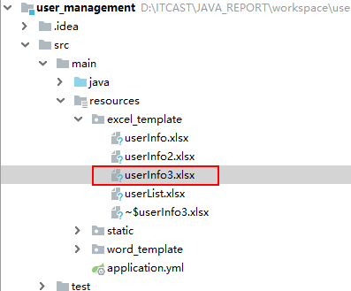


第三步：改写UserController中导出用户信息的方法

```java
@GetMapping(value = "/download",name = "导出用户详细信息")
public void downLoadUserInfoWithTempalte(Long id,HttpServletRequest request,HttpServletResponse response) throws Exception{
    //        userService.downLoadUserInfoWithTempalte(id,request,response);
    //        userService.downLoadUserInfoWithTempalte2(id,request,response);
    userService.downLoadUserInfoWithEastPOI(id,request,response);
}
```


第四步：完成UserService中的方法

```java
public void downLoadUserInfoWithEastPOI(Long id, HttpServletRequest request, HttpServletResponse response) throws Exception  {
    //        获取模板的路径
    File rootPath = new File(ResourceUtils.getURL("classpath:").getPath()); //SpringBoot项目获取根目录的方式
    File templatePath = new File(rootPath.getAbsolutePath(),"/excel_template/userInfo3.xlsx");
    //        读取模板文件
    TemplateExportParams params = new TemplateExportParams(templatePath.getPath(),true);

    //        查询用户，转成map
    User user = userMapper.selectByPrimaryKey(id);
    Map<String, Object> map = EntityUtils.entityToMap(user);
    ImageEntity image = new ImageEntity();
    //        image.setHeight(640); //测试发现 这里设置了长度和宽度在合并后的单元格中没有作用
    //        image.setWidth(380);
    image.setRowspan(4);//向下合并三行
    image.setColspan(2);//向右合并两列
    image.setUrl(user.getPhoto());
    map.put("photo", image);
    Workbook workbook = ExcelExportUtil.exportExcel(params, map);

    //            导出的文件名称
    String filename="用户详细信息数据.xlsx";
    //            设置文件的打开方式和mime类型
    ServletOutputStream outputStream = response.getOutputStream();
    response.setHeader( "Content-Disposition", "attachment;filename="  + new String(filename.getBytes(),"ISO8859-1"));
    response.setContentType("application/vnd.openxmlformats-officedocument.spreadsheetml.sheet");
    workbook.write(outputStream);
}
```


## 4.5 导出CSV

csv的导出基本上和excel的导出一致,大体参数也是一致的

CsvExportParams 的参数描述如下

| 属性       | 类型     | 默认值 | 功能                             |
| ---------- | -------- | ------ | -------------------------------- |
| encoding   | String   | UTF8   | 文件编码                         |
| spiltMark  | String   | ,      | 分隔符                           |
| textMark   | String   | “      | 字符串识别,可以去掉,需要前后一致 |
| titleRows  | int      | 0      | 表格头,忽略                      |
| headRows   | int      | 1      | 标题                             |
| exclusions | String[] | 0      | 忽略的字段                       |

需求：改写之前使用OpenCSV导出csv文件


第一步：修改UserController方法

```java
@GetMapping(value = "/downLoadCSV",name = "导出用户数据到CSV文件中")
public void downLoadCSV(HttpServletResponse response) throws Exception{
    //        userService.downLoadCSV(response);
    userService.downLoadCSVWithEasyPOI(response);
}
```

第二步：完成UserService方法

```java
public void downLoadCSVWithEasyPOI(HttpServletResponse response) throws Exception {
        ServletOutputStream outputStream = response.getOutputStream();
//            文件名
        String filename="百万数据.csv";
//            设置两个头 一个是文件的打开方式 一个是mime类型
        response.setHeader( "Content-Disposition", "attachment;filename="  + new String(filename.getBytes(),"ISO8859-1"));
        response.setContentType("application/csv");
//            创建一个用来写入到csv文件中的writer
        CsvExportParams params = new CsvExportParams();
//        设置忽略的列
        params.setExclusions(new String[]{"照片"}); //这里写表头 中文
        List<User> list = userMapper.selectAll();
        CsvExportUtil.exportCsv(params, User.class, list, outputStream);
    }
```

说明：从上述的代码中你会发现，如果需要导出几百万数据时不可能全部加载到一个List中的，所以easyPOI的方式导出csv是支持不了太大的数据量的，如果导出几百万条数据还是得选择OpenCSV方式导出。


<a name="excle注解">Excel注解详细</a>


| 属性           | 类型     | 类型             | 说明                                                         |
| -------------- | -------- | ---------------- | ------------------------------------------------------------ |
| name           | String   | null             | 列名                                                         |
| needMerge      | boolean  | fasle            | 纵向合并单元格                                               |
| orderNum       | String   | "0"              | 列的排序,支持name_id                                         |
| replace        | String[] | {}               | 值得替换  导出是{a_id,b_id} 导入反过来                       |
| savePath       | String   | "upload"         | 导入文件保存路径                                             |
| type           | int      | 1                | 导出类型 1 是文本 2 是图片,3 是函数,10 是数字 默认是文本     |
| width          | double   | 10               | 列宽                                                         |
| height         | double   | 10               | 列高,后期打算统一使用@ExcelTarget的height,这个会被废弃,注意  |
| isStatistics   | boolean  | fasle            | 自动统计数据,在追加一行统计,把所有数据都和输出这个处理会吞没异常,请注意这一点 |
| isHyperlink    | boolean  | false            | 超链接,如果是需要实现接口返回对象                            |
| isImportField  | boolean  | true             | 校验字段,看看这个字段是不是导入的Excel中有,如果没有说明是错误的Excel,读取失败,支持name_id |
| exportFormat   | String   | ""               | 导出的时间格式,以这个是否为空来判断是否需要格式化日期        |
| importFormat   | String   | ""               | 导入的时间格式,以这个是否为空来判断是否需要格式化日期        |
| format         | String   | ""               | 时间格式,相当于同时设置了exportFormat 和 importFormat        |
| databaseFormat | String   | "yyyyMMddHHmmss" | 导出时间设置,如果字段是Date类型则不需要设置 数据库如果是string类型,这个需要设置这个数据库格式,用以转换时间格式输出 |
| numFormat      | String   | ""               | 数字格式化,参数是Pattern,使用的对象是DecimalFormat           |
| imageType      | int      | 1                | 导出类型 1 从file读取 2 是从数据库中读取 默认是文件 同样导入也是一样的 |
| suffix         | String   | ""               | 文字后缀,如% 90 变成90%                                      |
| isWrap         | boolean  | true             | 是否换行 即支持\n                                            |
| mergeRely      | int[]    | {}               | 合并单元格依赖关系,比如第二列合并是基于第一列 则{1}就可以了  |
| mergeVertical  | boolean  | fasle            | 纵向合并内容相同的单元格                                     |


