# 1 EasyPOI导出word

需求：使用easyPOI方式导出合同word文档

Word模板和Excel模板用法基本一致，支持的标签也是一致的，仅仅支持07版本的word也是只能生成后缀是docx的文档，poi对doc支持不好所以easyPOI中就没有支持doc，我们就拿docx做导出

这里得好好说说模板中标签的用法：

下面列举下EasyPoi支持的指令以及作用，最主要的就是各种fe的用法

```properties
三元运算 {{test ? obj:obj2}}
n: 表示 这个cell是数值类型 {{n:}}
le: 代表长度{{le:()}} 在if/else 运用{{le:() > 8 ? obj1 : obj2}}
fd: 格式化时间 {{fd:(obj;yyyy-MM-dd)}}
fn: 格式化数字 {{fn:(obj;###.00)}}
fe: 遍历数据,创建row
!fe: 遍历数据不创建row
$fe: 下移插入,把当前行,下面的行全部下移.size()行,然后插入
#fe: 横向遍历
v_fe: 横向遍历值
!if: 删除当前列 {{!if:(test)}}
单引号表示常量值 ‘’ 比如’1’ 那么输出的就是 1
&NULL& 空格
&INDEX& 表示循环中的序号,自动添加
]] 换行符 多行遍历导出
sum： 统计数据
```

第一步：根据上述的指令要求，我们制作模板如下


第二步：把制作好的模板放入到项目中

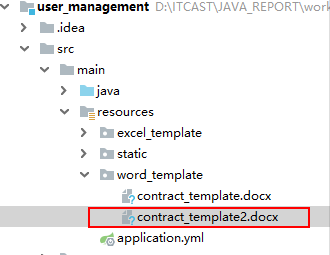


第三步：修改原来的导出合同的方法

UserController

```java
@GetMapping(value = "/downloadContract",name = "导出用户合同")
public void downloadContract(Long id,HttpServletResponse response) throws Exception{
//        userService.downloadContract(id,response);
   userService.downloadContractWithEasyPOI(id,response);
}
```

UserService添加方法

```java
public void downloadContractWithEasyPOI(Long id,HttpServletResponse response) throws Exception {

    File rootPath = new File(ResourceUtils.getURL("classpath:").getPath()); //SpringBoot项目获取根目录的方式
    File templatePath = new File(rootPath.getAbsolutePath(),"/word_template/contract_template2.docx");

    //        先获取导出word需要的数据
    User user = this.findById(id);
    //        把需要的数据放到map中，方便替换
    Map<String,Object> params = new HashMap<String,Object>();
    params.put("userName",user.getUserName());
    params.put("hireDate",simpleDateFormat.format(user.getHireDate()));
    params.put("address",user.getAddress());

    //        下面是表格中需要的数据
    List<Map> maplist = new ArrayList<>();
    Map<String,Object> map = null;
    for (Resource resource : user.getResourceList()) {
        map = new HashMap<String,Object>();
        map.put("name",resource.getName());
        map.put("price",resource.getPrice());
        map.put("needReturn",resource.getNeedReturn());
        ImageEntity image = new ImageEntity();
        image.setHeight(180);
        image.setWidth(240);
        image.setUrl(rootPath.getPath()+"\\static"+resource.getPhoto());
        map.put("photo",image);
        maplist.add(map);
    }
    //        把组建好的表格需要的数据放到大map中
    params.put("maplist",maplist);
    //        根据模板+数据 导出文档
    XWPFDocument xwpfDocument = WordExportUtil.exportWord07(templatePath.getPath(), params);
    String filename=user.getUserName()+"_合同.docx";
    //            设置文件的打开方式和mime类型
    ServletOutputStream outputStream = response.getOutputStream();
    response.setHeader( "Content-Disposition", "attachment;filename="  + new String(filename.getBytes(),"ISO8859-1"));
    response.setContentType("application/vnd.openxmlformats-officedocument.wordprocessingml.document");
    xwpfDocument.write(outputStream);
}
```


导出结果如下：


说明：

easyPOI在导出word时，发现导出的表格中没有我们预想的图片，所以easyPOI不是万能的，如果有同样的需求还是得用POI来做！


# 2 PDF文档简介

PDF（Portable Document Format的简称，意为“便携式文件格式”）是由Adobe Systems在1993年用于文件交换所发展出的文件格式。

PDF格式的文档的使用有如下好处：
1、跨平台
PDF文件格式与操作系统平台无关，也就是说，PDF文件不管是在Windows，Unix还是在苹果公司的Mac OS操作系统中都是通用的。不受平台的限制。越来越多的电子图书、产品说明、公司文告、网络资料、电子邮件开始使用PDF格式文件。

2、安全性高，不易修改
PDF是一种通用文件格式，不管创建源文档时使用的是哪些应用程序和平台，它均可以保留任何源文档的字体、图像、图形和版面设置。已成为世界上安全可靠地分发和交换电子文档及电子表单的实际标准。

3、阅读性能高，阅读舒适性好。

4、 相比Word格式的文档，PDF文件格式更为正式。
而WORD文档在跨平台使用方面不如PDF方便，而且WORD文档是可以进行编辑修改的，在安全性和可靠性上不如PDF，而且往往很难反映出用其它编辑软件排版的版面信息，使用上有一定的局限性。 

所以，现在网站导出PDF也是比较普遍的，我们今天主要的课程就是学习如果导出PDF文件。


# 3 Word转PDF

## 3.1 场景说明

把Word转成PDF目前最简单的方式就是调用office的方法，本质上就是打开Word后另存为成pdf，通过什么方式来调用呢？

使用 **jacob**，速度上还是可以的，Word中的原样式也不会丢失。

## 3.2 环境准备

最基本的环境：1、本机上安装了2007以上的office软件  2、jdk1.6以上的版本


第一步：从官网上下载资料（课程资料中已有）

 https://sourceforge.net/projects/jacob-project/files/jacob-project/ 

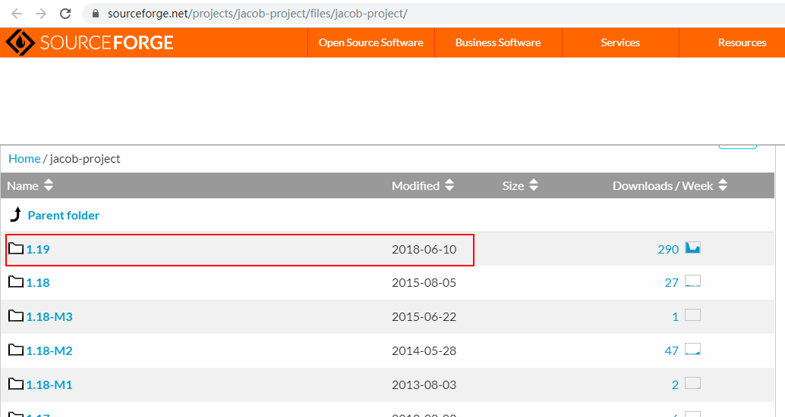

第二步：把下载的资料中的jar放入到本地仓库

这个jar从中央仓库中没有找到，需要我们自己打到本地仓库中

进入到jar所在的目录执行以下命令：

mvn install:install-file -DgroupId=com.jacob -DartifactId=jacob -Dversion=1.19 -Dfile=jacob.jar  -Dpackaging=jar

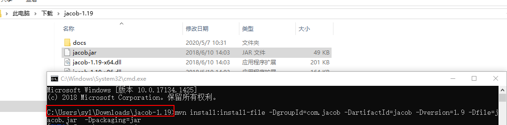

第三步：把dll文件放入到 jre\bin 目录下 64位的放x64文件，32位的放x86文件

如果不太确定是32位还是64位的就把两个dll都放进去

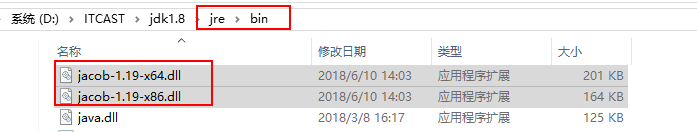


第四步：在项目的pom中添加依赖

```xml
<dependency>
    <groupId>com.jacob</groupId>
    <artifactId>jacob</artifactId>
    <version>1.9</version>
</dependency>
```

## 3.3 代码测试

需求：把我D盘下的Word转成PDF

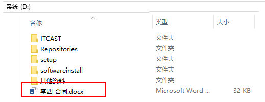

Junit测试代码：

```java
package com.itheima.demo;

import com.jacob.activeX.ActiveXComponent;
import com.jacob.com.Dispatch;

public class JacobDemo {
    public static void main(String[] args) {
        String source = "D:\\李四_合同.docx";
        String target = "D:\\李四_合同.pdf";
        System.out.println("Word转PDF开始启动...");
        ActiveXComponent app = null;
        try {
            //            调用window中的程序
            app = new ActiveXComponent("Word.Application");
            //            调用的时候不显示窗口
            app.setProperty("Visible", false);
            // 获得所有打开的文档
            Dispatch docs = app.getProperty("Documents").toDispatch();
            Dispatch doc = Dispatch.call(docs, "Open", source).toDispatch();
            System.out.println("转换文档到PDF：" + target);
            // 另存为，将文档保存为pdf，其中Word保存为pdf的格式宏的值是17
            Dispatch.call(doc, "SaveAs", target, 17);
            Dispatch.call(doc, "Close");
        } catch (Exception e) {
            System.out.println("Word转PDF出错：" + e.getMessage());
        } finally {
            // 关闭office
            if (app != null) {
                app.invoke("Quit", 0);
            }
        }
    }
}

```


结果：

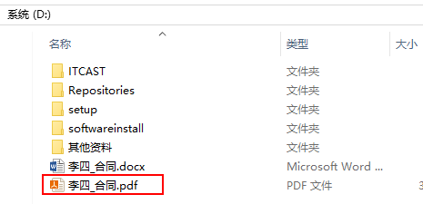

打开后查看内容中的样式基本上没有错乱：

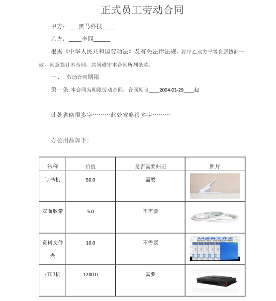


# 4 iText导出PDF（了解）

上面的例子是根据word转成的PDF，下面我们让java代码直接导出PDF

目前世面上比较流行的制作PDF报表的工具如下：

1. **iText PDF**
2. **Jasper Report**

我们先说一下 iText

iText是著名的开放项目，是用于生成PDF文档的一个java类库。通过iText不仅可以生成PDF或rtf的文档，而且可以将XML、Html文件转化为PDF文件。  代码编写太复杂！！！

举例：

1、用iText生成PDF文档需要5个步骤：

```java
//建立com.lowagie.text.Document对象的实例。
Document document = new Document(); 
//建立一个书写器(Writer)与document对象关联，通过书写器(Writer)可以将文档写入到磁盘中。
PDFWriter.getInstance(document, new FileOutputStream("test.PDF")); 
//打开文档。
document.open(); 
//向文档中添加内容。
document.add(new Paragraph("Hello World")); 
//关闭文档。
document.close(); 
```

2、如果有表格

```java
Table table = new Table(3);
table.setBorderWidth(1);
table.setBorderColor(new Color(0, 0, 255));
table.setPadding(5);
table.setSpacing(5);
Cell cell = new Cell("header");
cell.setHeader(true);
cell.setColspan(3);
table.addCell(cell);
table.endHeaders();
cell = new Cell("example cell with colspan 1 and rowspan 2");
cell.setRowspan(2);
cell.setBorderColor(new Color(255, 0, 0));
table.addCell(cell);
table.addCell("1.1");
table.addCell("2.1");
table.addCell("1.2");
table.addCell("2.2");
table.addCell("cell test1");
cell = new Cell("big cell");
cell.setRowspan(2);
cell.setColspan(2);
table.addCell(cell);
table.addCell("cell test2"); 
```

3、 中文字体的处理

默认的iText字体设置不支持中文字体，需要下载亚洲字体包iTextAsian.jar，否则不能往PDF文档中输出中文字体。通过下面的代码就可以在文档中使用中文了：

```java
Font font = getPdfChineseFont();
 
font.setColor(new BaseColor(0xff0000));
font.setSize(16);
font.setStyle("bold");
font.setStyle("italic");
font.setStyle("underline");
 
public static Font getPdfChineseFont() throws Exception {
    BaseFont bfChinese = BaseFont.createFont("STSongStd-Light", "UniGB-UCS2-H",
            BaseFont.NOT_EMBEDDED);
    Font fontChinese = new Font(bfChinese, 12, Font.NORMAL);
    return fontChinese;
} 
```

4、样式代码

```java
pdfCell.setHorizontalAlignment(Element.ALIGN_CENTER);
pdfCell.setVerticalAlignment(Element.ALIGN_MIDDLE);
pdfCell.setBackgroundColor(new BaseColor(0xdd7e6b));
 
pdfCell.setBorderWidthTop(0.1f);
pdfCell.setBorderWidthBottom(0.1f);
pdfCell.setBorderWidthLeft(0.1f);
pdfCell.setBorderWidthRight(0.1f);
pdfCell.setBorderColorBottom(new BaseColor(0x674ea7));
pdfCell.setBorderColorLeft(new BaseColor(0x674ea7));
pdfCell.setBorderColorRight(new BaseColor(0x674ea7));
pdfCell.setBorderColorTop(new BaseColor(0x674ea7));

```

5、画线的代码就更复杂了

所以，综上我们如果直接使用iText导出一个较为复杂的PDF的时候，代码量是非常大的，不推荐使用这种方式，那怎么办呢？我们使用一个封装了iText的一个类库：JasperReport


# 5 JasperReport导出PDF

## 5.1 JasperReport简介

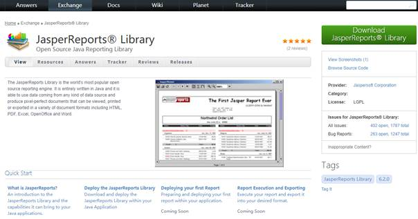

JasperReport是一个强大、灵活的报表生成工具，能够展示丰富的页面内容，并将之转换成PDF，HTML，或者XML格式。该库完全由Java写成，可以用于在各种Java应用程序，包括J2EE，Web应用程序中生成动态内容。只需要将JasperReport引入工程中即可完成PDF报表的编译、显示、输出等工作。

在开源的JAVA报表工具中，JasperReport发展是比较好的，比一些商业的报表引擎做得还好，如支持了十字交叉报表、统计报表、图形报表，支持多种报表格式的输出，如PDF、RTF、XML、CSV、XHTML、TEXT、DOCX以及OpenOffice。

数据源支持更多，常用 JDBCSQL查询、XML文件、CSV文件、HQL（Hibernate查询），HBase，JAVA集合等。还允许你义自己的数据源，通过JASPER文件及数据源，JASPER就能生成最终用户想要的文档格式。

## 5.2 JasperReport的开发步骤

### 5.2.1 生命周期

通常我们提到PDF报表的时候,浮现在脑海中的是最终的PDF文档文件。在JasperReports中，这只是报表生命周期的最后阶段。通过JasperReports生成PDF报表一共要经过三个阶段，我们称之为 JasperReport的生命周期，

这三个阶段为：

设计（Design）阶段、

执行（Execution）阶段

输出（Export）阶段，如下图所示：

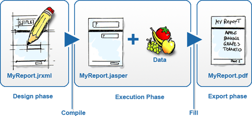

 

**设计阶段（Design**）：所谓的报表设计就是创建一些模板，模板包含了报表的布局与设计，包括执行计算的复杂公式、可选的从数据源获取数据的查询语句、以及其它的一些信息。模板设计完成之后，我们将模板保存为JRXML文件（JR代表JasperReports）,其实就是一个XML文件。

**执行阶段（Execution）：**使用以JRXML文件编译为可执行的二进制文件（即.Jasper文件）结合数据进行执行，填充报表数据

**输出阶段（Export）**：数据填充结束，可以指定输出为多种形式的报表

### 5.2.2 执行流程

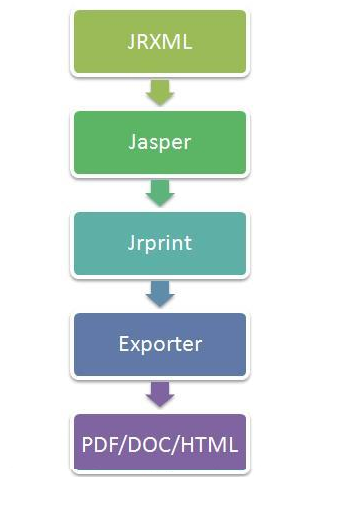

1、JRXML:报表填充模板，本质是一个XML. 

JasperReport已经封装了一个dtd，只要按照规定的格式写这个xml文件，那么jasperReport就可以将其解析最终生成报表，但是jasperReport所解析的不是我们常见的.xml文件，而是.jrxml文件，其实跟xml是一样的，只是后缀不一样。

2、Jasper:由JRXML模板编译生成的二进制文件，用于代码填充数据。 

解析完成后JasperReport就开始编译.jrxml文件，将其编译成.jasper文件，因为JasperReport只可以对.jasper文件进行填充数据和转换，这步操作就跟我们java中将java文件编译成class文件是一样的

3、Jrprint:当用数据填充完Jasper后生成的文件，用于输出报表。 

这一步才是JasperReport的核心所在，它会根据你在xml里面写好的查询语句来查询指定是数据库，也可以控制在后台编写查询语句，参数，数据库。在报表填充完后，会再生成一个.jrprint格式的文件（读取jasper文件进行填充，然后生成一个jrprint文件）

4、Exporter:决定要输出的报表为何种格式，报表输出的管理类。

5、JasperReport可以输出多种格式的报表文件，常见的有Html,PDF,xls等

综上我们得知，对于使用JasperReport进行开发，我们重点关注只有如下四点：

```
制作报表模板
模板编译
构造数据
填充模板数据
```

## 5.3 模板工具Jaspersoft Studio

### 5.3.1 概述

​	Jaspersoft Studio是JasperReports库和JasperReports服务器的基于Eclipse的报告设计器; 它可以作为Eclipse插件或作为独立的应用程序使用。Jaspersoft Studio允许您创建包含图表，图像，子报表，交叉表等的复杂布局。您可以通过JDBC，TableModels，JavaBeans，XML，Hibernate，大数据（如Hive），CSV，XML / A以及自定义来源等各种来源访问数据，然后将报告发布为PDF，RTF， XML，XLS，CSV，HTML，XHTML，文本，DOCX或OpenOffice。

​	Jaspersoft Studio 是一个可视化的报表设计工具,使用该软件可以方便地对报表进行可视化的设计，设计结果为格式.jrxml 的XML 文件，并且可以把.jrxml 文件编译成.jasper 格式文件方便 JasperReport 报表引擎解析、显示。

### 5.3.2 安装配置

到 JasperReport官网下载 [https://community.jaspersoft.com/community-download](https://community.jaspersoft.com/community-download)

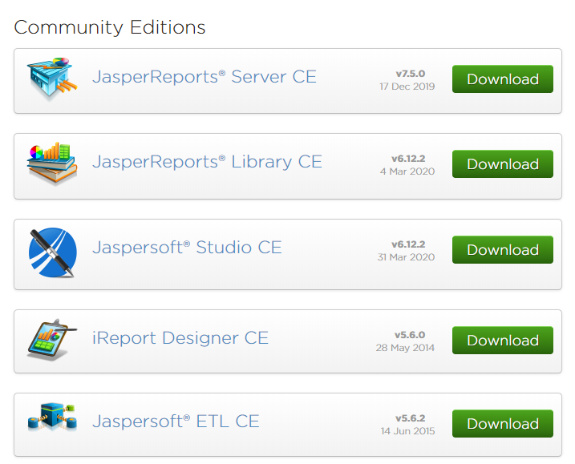

当然我们可以直接使用下载好的这个软件

双击安装今天资料中的安装包

下一步下一步的安装即可


​	 

### 5.3.3 面板介绍


Report editing area （主编辑区域）中，您直观地通过拖动，定位，对齐和通过 Designer palette（设计器调色板）对报表元素调整大小。JasperSoft Studio 有一个多标签编辑器，Design,Source和Preview：

Design tab：当你打开一个报告文件，它允许您以图形方式创建报表选中

Source tab：包含用于报表的 JRXML 源代码。

Preview tab：允许在选择数据源和输出格式后，运行报表预览。

Repository Explorer view：包含 JasperServer 生成的连接和可用的数据适配器列表

Project Explorer view：包含JasperReports 的工程项目清单

Outline view：在大纲视图中显示了一个树的形式的方式报告的完整结构。

Properties view：通常是任何基于 Eclipse 的产品/插件的基础之一。它通常被填充与实际所选元素的属性的信息。这就是这样，当你从主设计区域（即：一个文本字段）选择一个报表元素或从大纲，视图显示了它的信息。其中一些属性可以是只读的，但大部分都是可编辑的，对其进行修改，通常会通知更改绘制的元素（如：元素的宽度或高度）。

Problems view：显示的问题和错误，例如可以阻断报告的正确的编译。

Report state summary 提供了有关在报表编译/填充/执行统计用户有用的信息。错误会显示在这里 

### 5.3.3 基本使用

#### 5.3.3.1 模板制作

（1）打开Jaspersoft Studio ，新建一个project, 步骤： File -> New -> Project-> JasperReportsProject


 

（2） 新建一个Jasper Report模板，在 Stidio的左下方Project Explorer 找到刚才新建的Project (我这里新建的是DemoReport),步骤：项目右键 -> New -> Jasper Report

****

 

（3）选择 Blank A4 (A4纸大小的模板)，然后 Next 命名为test01.jrxml.

****


如图所示，报表模板被垂直的分层，每一个部分都是一个Band,每一个Band的特点不同：

****

 

 Title(标题)：只在整个报表的第一页的最上端显示。只在第一页显示，其他页面均不显示。

 Page Header(页头)：在整个报表中每一页都会显示。在第一页中，出现的位置在 Title Band的下面。在除了第一页的其他页面中Page Header 的内容均在页面的最上端显示。

 Page Footer(页脚)：在整个报表中每一页都会显示。显示在页面的最下端。一般用来显示页码。

 Detail 1(详细)：报表内容，每一页都会显示。

 Column Header(列头)：Detail中打印的是一张表的话，这Column Header就是表中列的列头。

 Column Footer(列脚)：Detail中打印的是一张表的话，这Column Footer就是表中列的列脚。

 Summary(统计)：表格的合计段，出现在整个报表的最后一页中，在Detail 1 Band后面。主要是用来做报表的合计显示。

#### 5.3.3.2 编译模板

右键单机模板文件 -> compile Report 对模板进行编译，生成.jasper文件

****


## 5.4 入门案例

需求：


### 环境准备

1、导入依赖

```xml
<dependency>
    <groupId>net.sf.jasperreports</groupId>
    <artifactId>jasperreports</artifactId>
    <version>6.5.0</version>
</dependency>
<dependency>
    <groupId>org.olap4j</groupId>
    <artifactId>olap4j</artifactId>
    <version>1.2.0</version>
</dependency>
<dependency>
    <groupId>com.lowagie</groupId>
    <artifactId>itext</artifactId>
    <version>2.1.7</version>
</dependency>

```

2、准备中文字体资源文件

jasperReports本身对中文的支持不够好，所以如果涉及到中文，需要自己准备中文的资源，现在已“华文宋体为例”

把图中的文件夹和properties文件直接拷贝到项目的resources文件夹下


如下效果：


### 导出一个最基本的PDF文件

第一步：使用Jaspersoft Studio制作一个简单的模板

1、 创建新模板，删除不需要的Band


2、画边框和线


3、添加几个静态的文本


4、添加变量


在右下角修改变量名称


5、使用变量


效果：


6、有中文的设置字体为华文宋体


7、保存后编辑


第二步：把test01.jasper文件放到磁盘的某个位置，比如我直接放到D盘下


第三步：测试代码

```java
package com.itheima.demo;

import net.sf.jasperreports.engine.*;
import java.io.FileInputStream;
import java.io.FileOutputStream;
import java.io.InputStream;
import java.util.HashMap;
import java.util.Map;

public class PDFDemo1 {
    /**
     *  基于parameters以Map的形式填充数据
     */
    public static void main(String[] args) throws Exception {
            String filePath = "D:\\test01.jasper";
//        文件的输入流
            InputStream inputStream = new FileInputStream(filePath);
            //2.创建JasperPrint,向jasper文件中填充数据
            FileOutputStream os = new FileOutputStream("d:\\demo1.pdf");
            try {
                Map parameters = new HashMap<>();
                //设置参数 参数的key = 模板中使用的parameters参数的name
                parameters.put("name","张三");
                parameters.put("phone","13800000000");
                //3.将JasperPrint已PDF的形式输出
                JasperPrint jasperPrint = JasperFillManager.fillReport(inputStream,parameters,new JREmptyDataSource());
                //导出
                JasperExportManager.exportReportToPdfStream(jasperPrint,os);
            } catch (JRException e) {
                e.printStackTrace();
            }finally {
                os.flush();
            }
    }
}

```

效果：


## 5.5 导出用户列表

### 5.5.1 需求


### 5.5.2 数据直接从数据库中获取

第一步：制作模板

1、创建新模板，删除不需要的Band


2、配置数据连接

使用JDBC数据源填充数据：使用Jaspersoft Studio 先要配置一个数据库连接

填写数据源的类型，选择“DatabaseJDBC Connection”

****


配置数据库信息


这一步，需要： （1）给创建的这个数据连接起个名字； （2）根据数据库选择驱动类型； Jaspersoft Studio 已经内置了很多常用数据库的驱动，使用的时候直接选就可以了。当然，如果这还满足不了你的话，你还可以添加你指定的 JDBC 驱动 jar 包。

3、读取表中属性

左下角右击模板名称选择 Dataset and Query


点击后：


点击“OK”按钮

左下角的Fields中就有了我们想要的属性字段了


4、模板如下


修改标题，并且要使用华文宋体


第二步：把编译后的jasper文件放入到项目中


第三步：完成代码

1、Controller中添加方法

```java
@GetMapping(value = "/downLoadPDF",name = "导出PDF")
public void  downLoadPDF(HttpServletResponse response) throws Exception{
    userService.downLoadPDFByDB(response);
}
```

2、Service添加方法

```java
@Autowired
private HikariDataSource hikariDataSource;

public void downLoadPDFByDB(HttpServletResponse response) throws Exception {
    //        获取模板文件
    String ctxPath = ResourceUtils.getURL("classpath:").getPath();

    String filePath =  ctxPath+"/pdf_template/userList_db.jasper";
    ServletOutputStream outputStream = response.getOutputStream();
    //            文件名
    String filename="用户列表数据.pdf";
    //            设置两个头 一个是文件的打开方式 一个是mime类型
    response.setHeader( "Content-Disposition", "attachment;filename="  + new String(filename.getBytes(),"ISO8859-1"));
    response.setContentType("application/pdf");
    //        文件的输入流
    InputStream inputStream = new FileInputStream(filePath);
    //2.创建JasperPrint,向jasper文件中填充数据
    Map parameters = new HashMap<>();
    //3.将JasperPrint已PDF的形式输出
    JasperPrint jasperPrint = JasperFillManager.fillReport(inputStream,parameters,hikariDataSource.getConnection());
    //导出
    JasperExportManager.exportReportToPdfStream(jasperPrint,outputStream);
}
```


效果如下：


### 5.5.3 数据从后台获取

从上面效果来看，导出的日期格式有问题，其实数据库表中的数据很多情况下都需要做一些业务处理才能被使用的，所以再学习一下数据经过处理后再导出。

第一步：创建模板

1、创建新模板，删除不需要的Band


2、创建4个field

这4个field的名称要和User实体类中的属性名称要保持一致，但是注意这里有一个hireDateStr


3、制作如下模板


第二步：把编译的后的模板文件放入到项目中


第三步：修改UserController中的代码

```java
@GetMapping(value = "/downLoadPDF",name = "导出PDF")
public void  downLoadPDF(HttpServletResponse response) throws Exception{
    //userService.downLoadPDFByDB(response);
    userService.downLoadPDF(response);
}
```


第四步：完成UserService代码

1、在User中添加一个hireDateStr字段

```java
@JsonIgnore //转json时不考虑这个字段
@Transient //表示非数据库字段
private String hireDateStr;
```

2、UserService添加方法

```java
public void downLoadPDF(HttpServletResponse response) throws Exception {
//        获取模板文件
        String ctxPath = ResourceUtils.getURL("classpath:").getPath();
        String filePath =  ctxPath+"/pdf_template/userList.jasper";
        ServletOutputStream outputStream = response.getOutputStream();
        //            文件名
        String filename="用户列表数据.pdf";
//            设置两个头 一个是文件的打开方式 一个是mime类型
        response.setHeader( "Content-Disposition", "attachment;filename="  + new String(filename.getBytes(),"ISO8859-1"));
        response.setContentType("application/pdf");
//        文件的输入流
        InputStream inputStream = new FileInputStream(filePath);
        //2.创建JasperPrint,向jasper文件中填充数据
        Map parameters = new HashMap<>();

//        查询所有数据
        List<User> userList = userMapper.selectAll();
//        给hireDateStr赋值
        userList = userList.stream().map(user -> {
            user.setHireDateStr(simpleDateFormat.format(user.getHireDate()));
            return user;
        }).collect(Collectors.toList());
        JRBeanCollectionDataSource dataSource = new JRBeanCollectionDataSource(userList);
        //3.将JasperPrint已PDF的形式输出
        JasperPrint jasperPrint = JasperFillManager.fillReport(inputStream,parameters,dataSource);
        //导出
        JasperExportManager.exportReportToPdfStream(jasperPrint,outputStream);
    }
```


## 5.6 导出用户详细信息

第一步：创建模板

1、创建新模板，删除不需要的Band


2、创建parameter


3、设置模板基本信息


4、添加图片数据

a)、在JasperReport 拖拽image 到detail中


弹出 create new image element选择Image creation mode 中的最后一个No image


 b)、选中刚才添加的image . 在右侧Properties -> Image中,Expression 设置刚才定义的photo 


最终的模板如下：


第二步：把编译后的模板放入到项目中


第三步：代码实现

1、修改UserController中下载个人信息的方法

```java
@GetMapping(value = "/download",name = "导出用户详细信息")
public void downLoadUserInfoWithTempalte(Long id,HttpServletRequest request,HttpServletResponse response) throws Exception{
    userService.downLoadUserInfoPDF(id,request,response);
}
```


2、在UserService中添加方法

```java
public void downLoadUserInfoPDF(Long id, HttpServletRequest request, HttpServletResponse response) throws Exception{
    //        获取模板路径
    String ctxPath = ResourceUtils.getURL("classpath:").getPath();

    String filePath =  ctxPath+"/pdf_template/userInfo.jasper";
    ServletOutputStream outputStream = response.getOutputStream();
    //            文件名
    String filename="用户详细数据.pdf";
    //            设置两个头 一个是文件的打开方式 一个是mime类型
    response.setHeader( "Content-Disposition", "attachment;filename="  + new String(filename.getBytes(),"ISO8859-1"));
    response.setContentType("application/pdf");
    //        文件的输入流
    InputStream inputStream = new FileInputStream(filePath);
    //2.创建JasperPrint,向jasper文件中填充数据
    User user = userMapper.selectByPrimaryKey(id);
    Map<String, Object> parameters = EntityUtils.entityToMap(user);
    parameters.put("salary",user.getSalary().toString()); //因为模板中的salary字段是字符串
    parameters.put("photo",ctxPath+user.getPhoto());
    //3.将JasperPrint已PDF的形式输出
    JasperPrint jasperPrint = JasperFillManager.fillReport(inputStream,parameters,new JREmptyDataSource());
    //导出
    JasperExportManager.exportReportToPdfStream(jasperPrint,outputStream);
}
```


导出的效果：


