# 1、图表报表简介

​       在大数据时代，人们需要对大量的数据进行分析，帮助用户或公司领导更直观的察觉差异，做出判断，减少时间成本，而在web项目中除了表格显示数据外，还可以通过图表来表现数据，这种图表形式表现数据使人看的清楚明白且更加直观。对于web项目展示图形报表使用最多的技术就是基于js的前端报表框架，目前前端市场使用最多的图形报表框架有：**JfreeChart、ECharts、Highcharts**、FusionCharts、amCharts等。

# 2、JFreechart

## 2.1 简介

JFreeChart是JAVA平台上的一个开放的图表绘制类库。它完全使用JAVA语言编写，可生成饼图（pie charts）、柱状图（bar charts）、散点图（scatter plots）、时序图（time series）、甘特图（Gantt charts）等等多种图表，并且可以产生PNG和JPEG格式的输出，还可以与PDF或EXCEL关联。

## 2.2 入门Demo

需要的依赖：

```xml
<dependency>
    <groupId>org.jfree</groupId>
    <artifactId>jfreechart</artifactId>
    <version>1.5.0</version>
</dependency>
```

### 2.2.1 饼图&3D饼图

```java
package com.itheima.test;

import org.jfree.chart.ChartFactory;
import org.jfree.chart.ChartUtils;
import org.jfree.chart.JFreeChart;
import org.jfree.chart.StandardChartTheme;
import org.jfree.data.general.DefaultPieDataset;

import java.awt.*;
import java.io.File;

public class JfreeChartsDemo1 {

    public static void main(String[] args) throws Exception {
//构建饼图的数据集
        DefaultPieDataset dataset=new DefaultPieDataset();
        dataset.setValue("销售部", 120);
        dataset.setValue("人事部", 50);
        dataset.setValue("技术部", 180);

        StandardChartTheme standardChartTheme=new StandardChartTheme("CN");
        //设置标题字体
        standardChartTheme.setExtraLargeFont(new Font("华文宋体",Font.BOLD,20));
        //设置图例的字体
        standardChartTheme.setRegularFont(new Font("华文宋体", Font.BOLD,15));
        //设置轴向的字体
        standardChartTheme.setLargeFont(new Font("华文宋体",Font.BOLD,15));
        //应用主题样式
        ChartFactory.setChartTheme(standardChartTheme);
//参数1  title 标题
//参数2　dataset 数据集
//参数3   是否开启图例
//参数4   是否开启工具栏
//参数5  是否开启url跳转
//        JFreeChart chart= ChartFactory.createPieChart("各部门人数", dataset, true, false, false);

        JFreeChart chart= ChartFactory.createPieChart3D("各部门人数", dataset, true, false, false);
//生成一张图表的图片文件
        ChartUtils.saveChartAsPNG(new File("d:\\chart1.png"), chart, 400, 300);
    }
}
```

效果图：

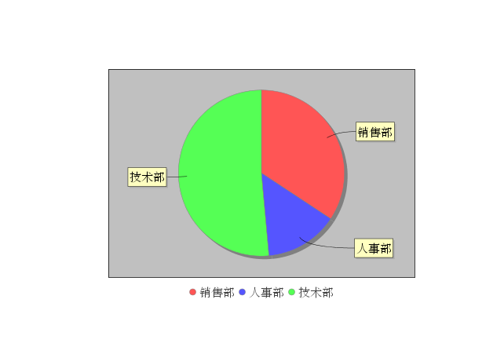

3D效果图

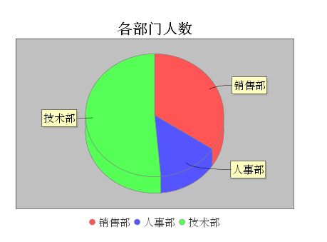


### 2.2.2 折线图

```java
package com.itheima.test;

import org.jfree.chart.ChartFactory;
import org.jfree.chart.ChartUtils;
import org.jfree.chart.JFreeChart;
import org.jfree.chart.StandardChartTheme;
import org.jfree.data.category.DefaultCategoryDataset;
import org.jfree.data.general.Dataset;
import org.jfree.data.general.DefaultPieDataset;
import org.jfree.data.general.DefaultValueDataset;

import java.awt.*;
import java.io.File;

public class JfreeChartsDemo2 {

    public static void main(String[] args) throws Exception {
//构建饼图的数据集
        DefaultCategoryDataset dataset=new DefaultCategoryDataset();
        dataset.addValue(15,"技术部","2011");
        dataset.addValue(11,"技术部","2012");
        dataset.addValue(10,"技术部","2013");
        dataset.addValue(16,"技术部","2014");

        dataset.addValue(10,"销售部","2011");
        dataset.addValue(30,"销售部","2012");
        dataset.addValue(6,"销售部","2013");
        dataset.addValue(16,"销售部","2014");

        dataset.addValue(10,"产品部","2011");
        dataset.addValue(20,"产品部","2012");
        dataset.addValue(30,"产品部","2013");
        dataset.addValue(15,"产品部","2014");
        StandardChartTheme standardChartTheme=new StandardChartTheme("CN");
        //设置标题字体
        standardChartTheme.setExtraLargeFont(new Font("华文宋体",Font.BOLD,20));
        //设置图例的字体
        standardChartTheme.setRegularFont(new Font("华文宋体", Font.PLAIN,15));
        //设置轴向的字体
        standardChartTheme.setLargeFont(new Font("华文宋体",Font.PLAIN,15));
        //应用主题样式
        ChartFactory.setChartTheme(standardChartTheme);
//参数1  title 标题
//参数2　x轴的说明
//参数3   Y轴的说明
//参数4   数据集
        JFreeChart chart= ChartFactory.createLineChart("入职人数", "年度", "人数", dataset);
//生成一张图表的图片文件
        ChartUtils.saveChartAsPNG(new File("d:\\chart2.png"), chart, 400, 300);
    }
}
```

效果图：

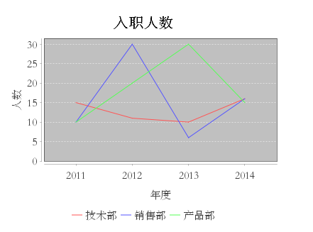


### 2.2.3 柱状图（条形图）

```java
package com.itheima.test;

import org.jfree.chart.ChartFactory;
import org.jfree.chart.ChartUtils;
import org.jfree.chart.JFreeChart;
import org.jfree.chart.StandardChartTheme;
import org.jfree.data.category.DefaultCategoryDataset;

import java.awt.*;
import java.io.File;

public class JfreeChartsDemo3 {

    public static void main(String[] args) throws Exception {
//构建饼图的数据集
        DefaultCategoryDataset dataset=new DefaultCategoryDataset();
        dataset.addValue(15,"技术部","2011");
        dataset.addValue(11,"技术部","2012");
        dataset.addValue(10,"技术部","2013");
        dataset.addValue(16,"技术部","2014");

        dataset.addValue(10,"销售部","2011");
        dataset.addValue(30,"销售部","2012");
        dataset.addValue(6,"销售部","2013");
        dataset.addValue(16,"销售部","2014");

        dataset.addValue(10,"产品部","2011");
        dataset.addValue(20,"产品部","2012");
        dataset.addValue(30,"产品部","2013");
        dataset.addValue(15,"产品部","2014");

        StandardChartTheme standardChartTheme=new StandardChartTheme("CN");
        //设置标题字体
        standardChartTheme.setExtraLargeFont(new Font("华文宋体",Font.BOLD,20));
        //设置图例的字体
        standardChartTheme.setRegularFont(new Font("华文宋体", Font.PLAIN,15));
        //设置轴向的字体
        standardChartTheme.setLargeFont(new Font("华文宋体",Font.PLAIN,15));
        //应用主题样式
        ChartFactory.setChartTheme(standardChartTheme);
//参数1  title 标题
//参数2　x轴的说明
//参数3   Y轴的说明
//参数4   数据集
        JFreeChart chart= ChartFactory.createBarChart("入职人数", "年度", "人数", dataset);
//生成一张图表的图片文件
        ChartUtils.saveChartAsPNG(new File("d:\\chart3.png"), chart, 400, 300);
    }
}
```

效果图：

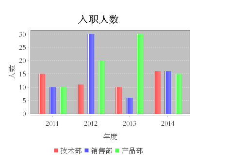


# 3、Highcharts

## 3.1 简介

​         Highcharts 是一个用纯JavaScript编写的一个图表库， 能够很简单便捷的在web网站或是web应用程序添加有交互性的图表，并且免费提供给个人学习、个人网站和非商业用途使用。HighCharts支持的图表类型有曲线图、区域图、柱状图、饼状图、散状点图和综合图表。  

## 3.2 下载安装

 官网下载： https://www.highcharts.com.cn/download 

1、下载

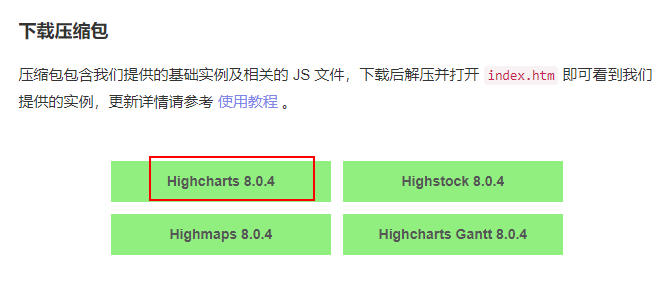

2、解压

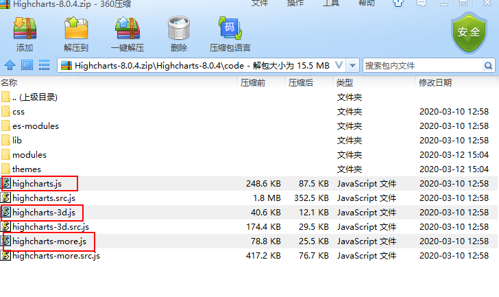

3、把js放入到项目中

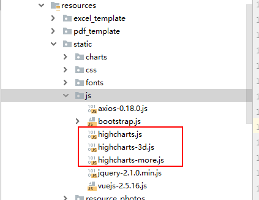

## 3.3 入门案例

第一步：创建一个html  demo.html

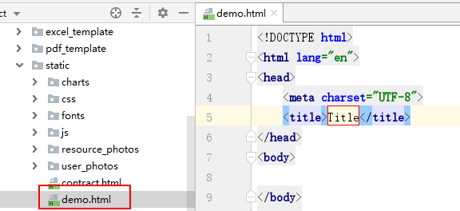

第二步：页面中引入js文件

```html
<!DOCTYPE html>
<html lang="en">
<head>
    <meta charset="UTF-8">
    <title>Title</title>
    <script src="js/highcharts.js"></script>
</head>
<body>

</body>
</html>
```

第三步：准备一个dom

 ```html
<body>
<div id="container" style="width: 600px;height:400px;"></div>
</body>
 ```

第四步：js代码

```javascript
<script>
        // 图表配置
        var options = {
            chart: {
                type: 'bar'                          //指定图表的类型，默认是折线图（line）
            },
            title: {
                text: '我的第一个图表'                 // 标题
            },
            xAxis: {
                categories: ['苹果', '香蕉', '橙子']   // x 轴分类
            },
            yAxis: {
                title: {
                    text: '吃水果个数'                // y 轴标题
                }
            },
            series: [{                              // 数据列
                name: '小明',                        // 数据列名
                data: [1, 0, 4]                     // 数据
            }, {
                name: '小红',
                data: [5, 7, 3]
            }]
        };
        // 图表初始化函数
        var chart = Highcharts.chart('container', options);
    </script>
```

运行结果：

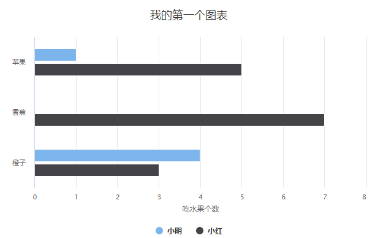


```properties
属性解释：
（1）chart ：图表基本属性
    a)	plotBackgroundColor  区域背景颜色
    b)	plotBorderWidth  区域边框宽度
    c)	plotShadow  区域阴影
    d)	type  图表类型
（2）title ：图表标题
    a)	text 标题文本
（3）tooltip ：工具提示
    a)	pointFormat  工具提示显示格式
（4）plotOptions：区域选项
    a)	allowPointSelect  点击区域后选择
    b)	cursor  光标类型
    c)	dataLabels  数据标签
    d)	showInLegend  是否显示图例
（5）series： 数据组
    a)	name  名称
    b)	colorByPoint  点的颜色
    c)	data  数据

```


## 3.4 准备页面

在static文件夹下创建页面echarts_index.html ,内容如下

```html
<!DOCTYPE html>
<html>
<head>
    <meta charset="UTF-8">
    <meta name="viewport" content="width=device-width, initial-scale=1.0,user-scalable=no,minimal-ui" />
    <title>highcharts图表报表</title>
    <link rel="stylesheet" href="css/charts_demo.css">
    <script src="js/vuejs-2.5.16.js"></script>
    <script src="js/axios-0.18.0.js"></script>
    <script src="js/highcharts.js"></script>
    <script src="js/highcharts-3d.js"></script>
    <script src="js/highcharts-more.js"></script>
    <script src="js/drilldown.js"></script>


</head>
<body>
<div id="app" class="my-box">
    <div class="my-box-left">
        <button @click="columnCharts">统计各部门人数</button> <br/> <br/>
        <button @click="lineCharts">月份入职人数统计</button> <br/> <br/>
        <button @click="pieCharts">员工地方来源统计</button> <br/> <br/>
    </div>
    <div class="my-box-right">
        <div id="container" style="height:450px;"></div>
    </div>
</div>
</body>
<script>
 new Vue({
     el:"#app",
     data:{},
     methods: {
         columnCharts() {

         },
         lineCharts(){

         },
         pieCharts(){

         }
     }
});
</script>
</html>
```


## 3.5 统计各部门人数（柱状图）

第一步：准备sql语句：用户表和部门表关联查询，根据部门名称分组统计

```sql
select dept_name deptName,count(u.id) num from tb_dept d LEFT JOIN tb_user u on  d.id=u.dept_id GROUP BY dept_name
```

第二步：后台代码

1、创建一个新的StatController

```java
package com.itheima.controller;

import com.itheima.service.StatService;
import org.springframework.beans.factory.annotation.Autowired;
import org.springframework.web.bind.annotation.GetMapping;
import org.springframework.web.bind.annotation.RequestMapping;
import org.springframework.web.bind.annotation.RestController;
import java.util.List;
import java.util.Map;

@RestController
@RequestMapping("/stat")
public class StatController {
    @Autowired
    private StatService statService;
    @GetMapping(value = "/columnCharts",name = "统计各部门人数，柱状图")
    public List<Map> columnCharts(){
        return  statService.columnCharts();
    }
}

```

2、创建StatService

```java
package com.itheima.service;

import com.itheima.mapper.UserMapper;
import org.springframework.beans.factory.annotation.Autowired;
import org.springframework.stereotype.Service;

import java.util.List;
import java.util.Map;

@Service
public class StatService {

    @Autowired
    private UserMapper userMapper;

    public List<Map> columnCharts() {
        return userMapper.columnCharts();
    }
}

```

3、UserMapper定义方法

```java
@Select(value = "select dept_name deptName,count(u.id) num from tb_dept d LEFT JOIN tb_user u on  d.id=u.dept_id GROUP BY dept_name")

List<Map> columnCharts();
```

第三步：完成js方法

在highcharts_index.html页面中参考highcharts官网上的柱状图完成以下代码

 https://www.highcharts.com.cn/demo/highcharts/column-basic 

```javascript
 methods: {
         columnCharts() {
             axios.get("/stat/columnCharts").then(res => {
                 let datas = res.data;
                 let titles=[];  //x轴上显示的数据
                 let values=[]; //y轴上显示的数据
                 for (let i = 0; i < datas.length; i++) {
                     titles[i] = datas[i].deptName;
                     values[i] = datas[i].num;
                 }
                 Highcharts.chart('container', {
                     chart: {
                         type: 'column'
                     },
                     title: {
                         text: '各部门人数'
                     },
                     xAxis: {
                         categories:titles,
                         crosshair: true
                     },
                     yAxis: {
                         min: 0,
                         title: {
                             text: '人数'
                         }
                     },
                     tooltip: {
                         // head + 每个 point + footer 拼接成完整的 table
                         headerFormat: '<span style="font-size:10px">{point.key}</span><table>',
                         pointFormat: '<tr><td style="color:{series.color};padding:0">{series.name}: </td>' +
                             '<td style="padding:0"><b>{point.y:.1f} </b></td></tr>',
                         footerFormat: '</table>',
                         shared: true,
                         useHTML: true
                     },
                     plotOptions: {
                         column: {
                             borderWidth: 0
                         }
                     },
                     series: [{
                         name: '各部门人数',
                         data: values
                     }]
                 });


             })
         },
         pieCharts(){},
         lineCharts(){}
     }
```

最后效果：


## 3.6 月份入职人数统计（折线图）

第一步：准备SQL语句

一年12个月，想知道什么月份入职的人员最后

```sql
select m.name,IFNULL(t.num,0) num from tb_month m LEFT JOIN (
select DATE_FORMAT(hire_date,'%m') months ,count(id) num from tb_user GROUP BY DATE_FORMAT(hire_date,'%m')
) t ON m.name=t.months
```


第二步：完成后台代码

1、StatController添加方法

```java
@GetMapping(value = "/lineCharts",name = "月份入职人数统计，折线图")
public List<Map> lineCharts(){
    return  statService.lineCharts();
}
```


2、StatService添加方法

```java
public List<Map> lineCharts() {
    return userMapper.lineCharts();
}
```


3、UserMapper添加方法

```java
@Select("select m.name,IFNULL(t.num,0) num from tb_month m LEFT JOIN ( " +
        "select DATE_FORMAT(hire_date,'%m') months ,count(id) num from tb_user GROUP BY DATE_FORMAT(hire_date,'%m') " +
        ") t ON m.name=t.months")
List<Map> lineCharts();
```


第三步：完成js代码

在highcharts_index.html页面中参考highcharts官网上的柱状图完成以下代码

 https://www.highcharts.com.cn/demo/highcharts/line-basic 

```javascript
lineCharts(){
    axios.get("/stat/lineCharts").then(res=>{
        let datas = res.data;
        let values=[]; //y轴上显示的数据
        for (let i = 0; i < datas.length; i++) {
            values[i] = datas[i].num;
        }
        var chart = Highcharts.chart('container', {
            title: {
                text: '月份入职人数统计'
            },
            yAxis: {
                title: {
                    text: '入职人数'
                }
            },
            legend: {
                layout: 'vertical',
                align: 'right',
                verticalAlign: 'middle'
            },
            plotOptions: {
                series: {
                    label: {
                        connectorAllowed: false
                    },
                    pointStart: 2010
                }
            },
            series: [{
                name: '入职人数',
                data: values
            }],
            responsive: {
                rules: [{
                    condition: {
                        maxWidth: 500
                    },
                    chartOptions: {
                        legend: {
                            layout: 'horizontal',
                            align: 'center',
                            verticalAlign: 'bottom'
                        }
                    }
                }]
            }
        });

    })
}
```

效果：


## 3.7 员工地方来源统计（可下钻的饼状图）

统计公司员工的来源

第一步：环境准备

什么是下钻的效果

 https://www.highcharts.com.cn/demo/highcharts/column-drilldown 

 https://www.highcharts.com.cn/demo/highcharts/pie-drilldown 

如果想要下钻的效果，需要在多引入一个js，从下载的压缩包中找到后放到项目中，并且在html中引入

```html
<script src="js/drilldown.js"></script>
```

第二步：后台方法准备数据

1、StatController代码添加方法

```java
@GetMapping(value = "/pieCharts",name = "公司员工地方来源，包括省、市")
public List<Map> pieCharts(){
    return  statService.pieCharts();
}
```

3、StatService中添加方法

这个方法直接返回js上需要的所有数据

[{id:"河北省","drilldown":"河北省","name":"河北省","y":10,"data":[{"name":"石家庄","y":4},{"name":"唐山","y":3},{"name":"保定","y":3}]}]

```java
public List<Map> pieCharts() {
        List<Map> resultMapList = new ArrayList();
//        最终想要的数据格式：[{id:"河北省","drilldown":"河北省","name":"河北省","y":10,"data":[{"name":"石家庄","y":4},{"name":"唐山","y":3},{"name":"保定","y":3}]}]
        List<User> userList = userMapper.selectAll(); //查询所有员工数据
//        根据省份分组
        Map<String, List<User>> provinceMap = userList.stream().collect(Collectors.groupingBy(User::getProvince));
        for (String provinceName : provinceMap.keySet()) {
            int provinceSize = 0;
            Map resultMap = new HashMap();
            resultMap.put("id",provinceName);
            resultMap.put("drilldown",provinceName);
            resultMap.put("name",provinceName);
//            再根据城市分组
            Map<String, List<User>> cityMap = provinceMap.get(provinceName).stream().collect(Collectors.groupingBy(User::getCity));
            List<Map> dataMapList = new ArrayList<>();
            for (String cityName : cityMap.keySet()) {
                Map dataMap = new HashMap();
                dataMap.put("name",cityName);
                int citySize = cityMap.get(cityName).size();
                dataMap.put("y",citySize);
                dataMapList.add(dataMap);
                provinceSize+=citySize;
            }
            resultMap.put("y",provinceSize);
            resultMap.put("data",dataMapList);
            resultMapList.add(resultMap);
        }
            return resultMapList;
    }
```

第三步：完成js代码

```javascript
 pieCharts(){
             axios.get("/stat/pieCharts").then(res=>{
                let datas = res.data;
                 Highcharts.chart('container', {
                     chart: {
                         type: 'column'
                     },
                     title: {
                         text: '公司原因地方来源'
                     },
                     xAxis: {
                         type: 'category'
                     },
                     yAxis: {
                         title: {
                             text: '人数'
                         }
                     },
                     legend: {
                         enabled: false
                     },
                     plotOptions: {
                         series: {
                             borderWidth: 0,
                             dataLabels: {
                                 enabled: true,
                                 format: '{point.y}'
                             }
                         }
                     },
                     tooltip: {
                         headerFormat: '<span style="font-size:11px">{series.name}</span><br>',
                         pointFormat: '<span style="color:{point.color}">{point.name}</span>: <b>{point.y}</b><br/>'
                     },
                     series: [{
                         name: '省份',
                         colorByPoint: true,
                         data: datas
                     }],
                     drilldown: {
                         series: datas
                     }
                 });

             })

         }
```


效果：

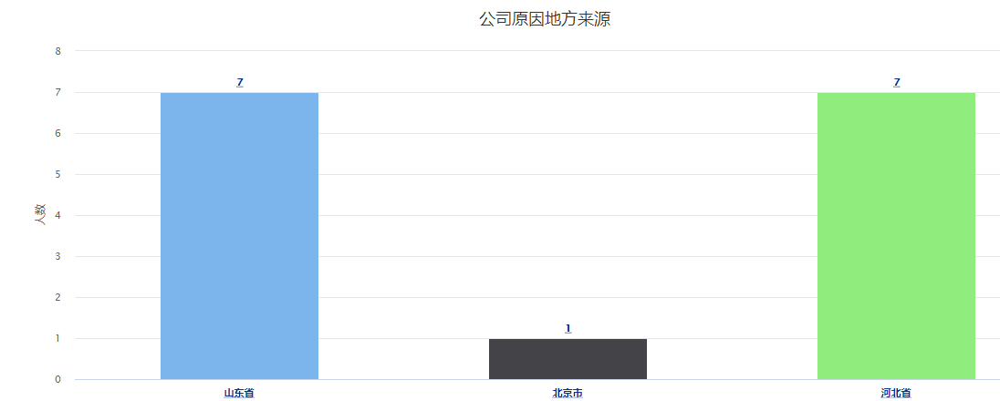

点击河北省

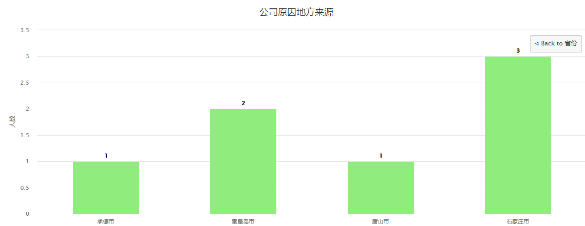


# 4、Echarts

## 4.1 简介

ECharts是由百度前端团队开发的一款开源的基于js图形报表组件，一个使用 JavaScript 实现的开源可视化库，可以流畅的运行在 PC 和移动设备上，兼容当前绝大部分浏览器（IE8/9/10/11，Chrome，Firefox，Safari等），底层依赖轻量级的矢量图形库 ZRender，提供直观，交互丰富，可高度个性化定制的数据可视化图表。

ECharts 特性：

丰富的可视化类型

多种数据格式无需转换直接使用

千万数据的前端展现

移动端优化

多渲染方案，跨平台使用！

深度的交互式数据探索

多维数据的支持以及丰富的视觉编码手段

动态数据

绚丽的特效


## 4.2 下载安装

1、下载js

 https://github.com/apache/incubator-echarts/tree/4.7.0 

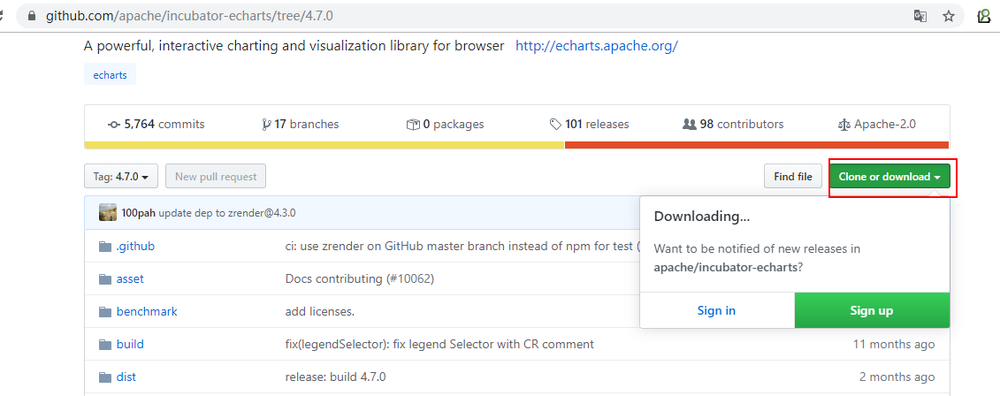


或 从 npm 安装  (前提是电脑上有node环境)

npm install echarts


2、把下载好的js放入到项目中

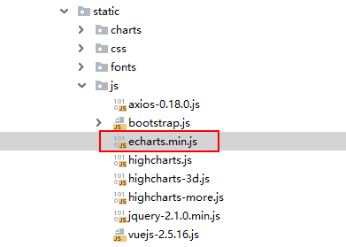

## 4.3 入门案例

第一步 导入js依赖

```html
<!DOCTYPE html>
<html>
<head>
    <meta charset="utf-8">
    <!-- 引入 ECharts 文件 -->
    <script src="js/echarts.min.js"></script>
</head>
</html>
```

4.3.2 配置dom容器

在绘图前我们需要为 ECharts 准备一个具备高宽的 DOM 容器。

```html
<body>
    <!-- 为 ECharts 准备一个具备大小（宽高）的 DOM -->
    <div id="main" style="width: 600px;height:400px;"></div>
</body>
```

4.3.3 初始化图形

然后就可以通过 echarts.init 方法初始化一个 echarts 实例并通过 setOption 方法生成一个简单的柱状图，下面是完整代码。

```html
<!DOCTYPE html>
<html>
<head>
    <meta charset="utf-8">
    <title>ECharts</title>
    <!-- 引入 echarts.js -->
    <script src="echarts.min.js"></script>
</head>
<body>
    <!-- 为ECharts准备一个具备大小（宽高）的Dom -->
    <div id="main" style="width: 600px;height:400px;"></div>
    <script type="text/javascript">
        // 基于准备好的dom，初始化echarts实例
        var myChart = echarts.init(document.getElementById('main'));

        // 指定图表的配置项和数据
        var option = {
            title: {
                text: 'ECharts 入门示例'
            },
            tooltip: {},
            legend: {
                data:['销量']
            },
            xAxis: {
                data: ["衬衫","羊毛衫","雪纺衫","裤子","高跟鞋","袜子"]
            },
            yAxis: {},
            series: [{
                name: '销量',
                type: 'bar',
                data: [5, 20, 36, 10, 10, 20]
            }]
        };

        // 使用刚指定的配置项和数据显示图表。
        myChart.setOption(option);
    </script>
</body>
</html>
```

效果：

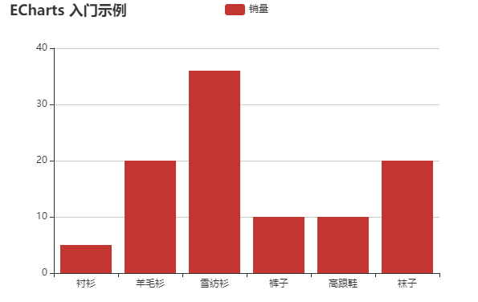


## 4.4 准备页面

在static下新建一个页面echarts_index.html 内容如下

```html
<!DOCTYPE html>
<html>
<head>
    <meta charset="UTF-8">
    <meta name="viewport" content="width=device-width, initial-scale=1.0,user-scalable=no,minimal-ui" />
    <title>echarts图表报表</title>
    <link rel="stylesheet" href="css/charts_demo.css">
    <script src="js/vuejs-2.5.16.js"></script>
    <script src="js/axios-0.18.0.js"></script>
    <script src="js/echarts.min.js"></script>

</head>
<body>
<div id="app" class="my-box">
    <div class="my-box-left">
        <button @click="columnCharts">统计各部门人数</button> <br/> <br/>
        <button @click="lineCharts">月份入职人数统计</button> <br/> <br/>
        <button @click="pieCharts">员工地方来源统计</button> <br/> <br/>
        <button @click="mapCharts">员工地方来源统计(地图)</button> <br/> <br/>
    </div>
    <div class="my-box-right">
        <div id="container" style="height:450px;"></div>
    </div>
</div>
</body>
<script>
    new Vue({
        el:"#app",
        data:{},
        methods: {
            columnCharts() {

            },
            lineCharts(){

            },
            pieCharts(){

            },
            mapCharts(){

            }
        }
    });
</script>
</html>
```


## 4.5 统计各部门人数（柱状图）

官网参考 https://echarts.apache.org/examples/zh/editor.html?c=bar-simple 

可以直接使用3.5小结highcharts的后台方法

修改echarts_index.html中的js方法

```javascript
columnCharts() {
    axios.get("/stat/columnCharts").then(res=>{
        let datas = res.data;
        let titles=[];  //x轴上显示的数据
        let values=[]; //y轴上显示的数据
        for (let i = 0; i < datas.length; i++) {
            titles[i] = datas[i].deptName;
            values[i] = datas[i].num;
        }

        var myChart = echarts.init(document.getElementById('container'));
        // 指定图表的配置项和数据
        var option = {
            title: {
                text: '各部门人数'
            },
            tooltip: {},
            legend: {
                data:['人数']
            },
            xAxis: {
                data: titles
            },
            yAxis: {},
            series: [{
                name: '人数',
                type: 'bar',
                data: values
            }]
        };

        // 使用刚指定的配置项和数据显示图表。
        myChart.clear();
        myChart.setOption(option);

    })
}
```

效果：

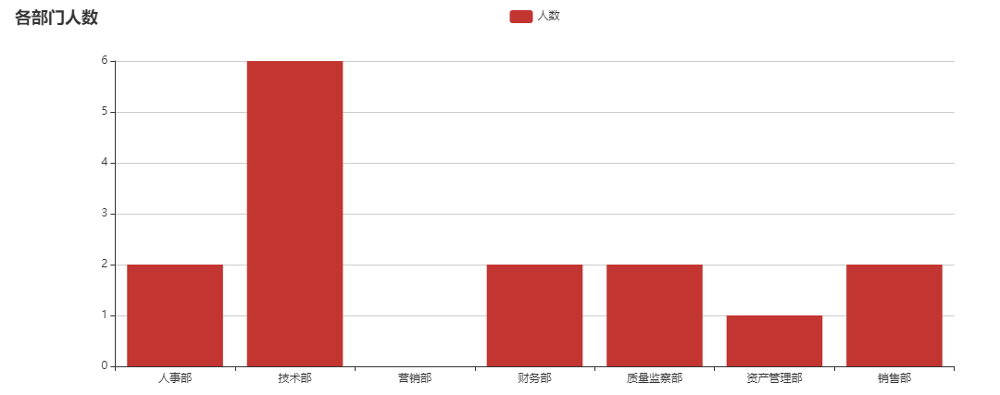


## 4.6 月份入职人数统计（折线图）

官网参考 https://echarts.apache.org/examples/zh/editor.html?c=line-simple 

可以直接使用3.6小结highcharts的后台方法

修改echarts_index.html中的js方法

```javascript
lineCharts(){
    axios.get("/stat/lineCharts").then(res=>{
        let datas = res.data;
        let titles=[];  //x轴上显示的数据
        let values=[]; //y轴上显示的数据
        for (let i = 0; i < datas.length; i++) {
            titles[i] = datas[i].name;
            values[i] = datas[i].num;
        }

        var myChart = echarts.init(document.getElementById('container'));

        option = {
            xAxis: {
                type: 'category',
                data: titles
            },
            yAxis: {
                type: 'value'
            },
            series: [{
                data: values,
                type: 'line'
            }]
        };

        // 使用刚指定的配置项和数据显示图表。
        myChart.clear();
        myChart.setOption(option);
    })
}
```

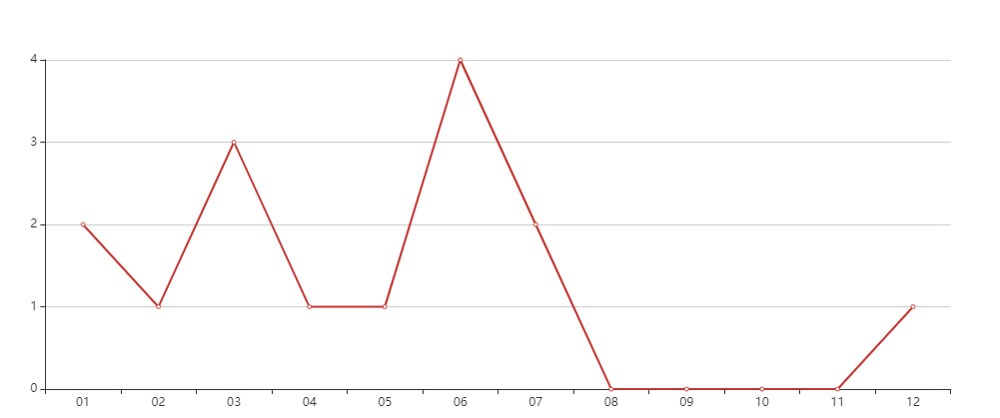

## 4.7 员工地方来源统计（饼图）

Echarts没有提供下钻的效果，但是有一个和下钻类似的效果

官网参考  https://echarts.apache.org/examples/zh/editor.html?c=pie-nest 

安装官网上给的参考数据，会发现需要用到三种数据：省份集合、城市集合、城市名称集合

第一步：根据需求后台提供数据

1、StatController新添加一个方法

```java
@GetMapping(value = "/pieECharts",name = "公司员工地方来源，包括省、市")
public Map  pieECharts(){
    return  statService.pieECharts();
}
```


2、StatService处理数据

```java
public  Map pieECharts() {
    Map resultMap = new HashMap();
    //        最终想要的数据格式：{province:[{name:,value:}],city:[]}
    Example example = new Example(User.class);
    example.setOrderByClause("province , city");
    List<User> userList = userMapper.selectByExample(example); //查询所有员工数据
    //        根据省份分组
    List<Map> provinceMapList = new ArrayList<>();
    //        注意分组时得排序，不然数据会乱
    Map<String, List<User>> provinceMap = userList.stream().collect(Collectors.groupingBy(User::getProvince,LinkedHashMap::new,Collectors.toList()));
    for (String provinceName : provinceMap.keySet()) {
        Map map = new HashMap();
        map.put("name",provinceName);
        map.put("value",provinceMap.get(provinceName).size());
        provinceMapList.add(map);
    }

    List<Map> cityMapList = new ArrayList<>();
    //        注意分组时得排序，不然数据会乱
    Map<String, List<User>> cityMap = userList.stream().collect(Collectors.groupingBy(User::getCity, LinkedHashMap::new,Collectors.toList()));
    for (String cityName : cityMap.keySet()) {
        Map map = new HashMap();
        map.put("name",cityName);
        map.put("value",cityMap.get(cityName).size());
        cityMapList.add(map);
    }

    resultMap.put("province",provinceMapList);
    resultMap.put("city",cityMapList);

    return resultMap;
}
```

第二步：完成JS代码

```javascript
pieCharts(){
    axios.get("/stat/pieECharts").then(res=>{
        let datas = res.data;
        // 需要三种数据：都可以从datas中获取
        //  1、省份数据 [{name:"河北省",value:10}]
        // 2、城市数据 [{name:"石家庄",value:3}]
        // 3、城市的名称
        let provinceData =  datas.province;
        let cityData = datas.city;
        let cityNames = [];
        for (let i = 0; i < cityData.length; i++) {
            cityNames[i] = cityData[i].name;
        }


        var myChart = echarts.init(document.getElementById('container'));

        option = {
            tooltip: {
                trigger: 'item',
                formatter: '{a} <br/>{b}: {c} ({d}%)'
            },
            legend: {
                orient: 'vertical',
                left: 10,
                data: cityNames
            },
            series: [
                {
                    name: '员工来源',
                    type: 'pie',
                    selectedMode: 'single',
                    radius: [0, '30%'],

                    label: {
                        position: 'inner'
                    },
                    labelLine: {
                        show: false
                    },
                    data: provinceData
                },
                {
                    name: '员工来源',
                    type: 'pie',
                    radius: ['40%', '55%'],
                    label: {
                        formatter: '{a|{a}}{abg|}\n{hr|}\n  {b|{b}：}{c}  {per|{d}%}  ',
                        backgroundColor: '#eee',
                        borderColor: '#aaa',
                        borderWidth: 1,
                        borderRadius: 4,
                        // shadowBlur:3,
                        // shadowOffsetX: 2,
                        // shadowOffsetY: 2,
                        // shadowColor: '#999',
                        // padding: [0, 7],
                        rich: {
                            a: {
                                color: '#999',
                                lineHeight: 22,
                                align: 'center'
                            },
                            // abg: {
                            //     backgroundColor: '#333',
                            //     width: '100%',
                            //     align: 'right',
                            //     height: 22,
                            //     borderRadius: [4, 4, 0, 0]
                            // },
                            hr: {
                                borderColor: '#aaa',
                                width: '100%',
                                borderWidth: 0.5,
                                height: 0
                            },
                            b: {
                                fontSize: 16,
                                lineHeight: 33
                            },
                            per: {
                                color: '#eee',
                                backgroundColor: '#334455',
                                padding: [2, 4],
                                borderRadius: 2
                            }
                        }
                    },
                    data: cityData
                }
            ]
        };


        // 使用刚指定的配置项和数据显示图表。
        myChart.clear();
        myChart.setOption(option);
    })
}
```

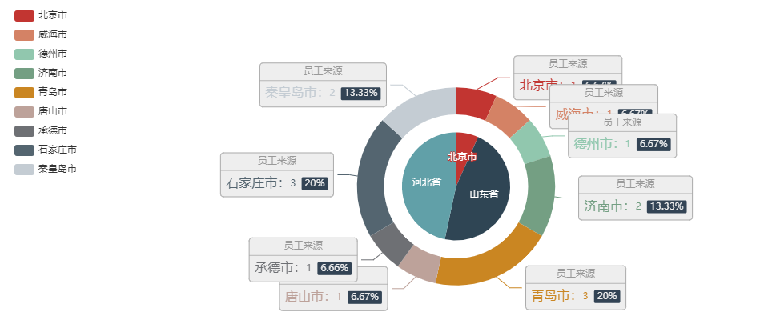


## 4.8 员工地方来源统计（中国地图）

直接使用4.7小结提供的后台数据

第一步：参考官网源码引用js

 https://echarts.apache.org/examples/zh/editor.html?c=map-polygon 

```html
    <script type="text/javascript" src="https://cdn.jsdelivr.net/npm/echarts/dist/echarts.min.js"></script>
    <script type="text/javascript" src="https://cdn.jsdelivr.net/npm/echarts-gl/dist/echarts-gl.min.js"></script>
    <script type="text/javascript" src="https://cdn.jsdelivr.net/npm/echarts-stat/dist/ecStat.min.js"></script>
    <script type="text/javascript" src="https://cdn.jsdelivr.net/npm/echarts/dist/extension/dataTool.min.js"></script>
    <script type="text/javascript" src="https://cdn.jsdelivr.net/npm/echarts/map/js/china.js"></script>
    <script type="text/javascript" src="https://cdn.jsdelivr.net/npm/echarts/map/js/world.js"></script>
    <script type="text/javascript" src="https://api.map.baidu.com/api?v=2.0&ak=UzpZ9A94pysSfj013URfjCfeUKjMv52F"></script>
    <script type="text/javascript" src="https://cdn.jsdelivr.net/npm/echarts/dist/extension/bmap.min.js"></script>
```


第二步：修改js代码

```javascript
mapCharts(){
    axios.get("/stat/pieECharts").then(res=>{
        var myChart = echarts.init(document.getElementById('container'));

        var data = res.data.city;
        for (let i = 0; i < data.length; i++) {
            data[i].name = data[i].name.substring(0,data[i].name.length-1);
            data[i].value = data[i].value; 
        }

        var geoCoordMap = {
            '海门':[121.15,31.89],
            '鄂尔多斯':[109.781327,39.608266],
            '招远':[120.38,37.35],
            '舟山':[122.207216,29.985295],
            '齐齐哈尔':[123.97,47.33],
            '盐城':[120.13,33.38],
            '赤峰':[118.87,42.28],
            '青岛':[120.33,36.07],
            '乳山':[121.52,36.89],
            '金昌':[102.188043,38.520089],
            '泉州':[118.58,24.93],
            '莱西':[120.53,36.86],
            '日照':[119.46,35.42],
            '胶南':[119.97,35.88],
            '南通':[121.05,32.08],
            '拉萨':[91.11,29.97],
            '云浮':[112.02,22.93],
            '梅州':[116.1,24.55],
            '文登':[122.05,37.2],
            '上海':[121.48,31.22],
            '攀枝花':[101.718637,26.582347],
            '威海':[122.1,37.5],
            '承德':[117.93,40.97],
            '厦门':[118.1,24.46],
            '汕尾':[115.375279,22.786211],
            '潮州':[116.63,23.68],
            '丹东':[124.37,40.13],
            '太仓':[121.1,31.45],
            '曲靖':[103.79,25.51],
            '烟台':[121.39,37.52],
            '福州':[119.3,26.08],
            '瓦房店':[121.979603,39.627114],
            '即墨':[120.45,36.38],
            '抚顺':[123.97,41.97],
            '玉溪':[102.52,24.35],
            '张家口':[114.87,40.82],
            '阳泉':[113.57,37.85],
            '莱州':[119.942327,37.177017],
            '湖州':[120.1,30.86],
            '汕头':[116.69,23.39],
            '昆山':[120.95,31.39],
            '宁波':[121.56,29.86],
            '湛江':[110.359377,21.270708],
            '揭阳':[116.35,23.55],
            '荣成':[122.41,37.16],
            '连云港':[119.16,34.59],
            '葫芦岛':[120.836932,40.711052],
            '常熟':[120.74,31.64],
            '东莞':[113.75,23.04],
            '河源':[114.68,23.73],
            '淮安':[119.15,33.5],
            '泰州':[119.9,32.49],
            '南宁':[108.33,22.84],
            '营口':[122.18,40.65],
            '惠州':[114.4,23.09],
            '江阴':[120.26,31.91],
            '蓬莱':[120.75,37.8],
            '韶关':[113.62,24.84],
            '嘉峪关':[98.289152,39.77313],
            '广州':[113.23,23.16],
            '延安':[109.47,36.6],
            '太原':[112.53,37.87],
            '清远':[113.01,23.7],
            '中山':[113.38,22.52],
            '昆明':[102.73,25.04],
            '寿光':[118.73,36.86],
            '盘锦':[122.070714,41.119997],
            '长治':[113.08,36.18],
            '深圳':[114.07,22.62],
            '珠海':[113.52,22.3],
            '宿迁':[118.3,33.96],
            '咸阳':[108.72,34.36],
            '铜川':[109.11,35.09],
            '平度':[119.97,36.77],
            '佛山':[113.11,23.05],
            '海口':[110.35,20.02],
            '江门':[113.06,22.61],
            '章丘':[117.53,36.72],
            '肇庆':[112.44,23.05],
            '大连':[121.62,38.92],
            '临汾':[111.5,36.08],
            '吴江':[120.63,31.16],
            '石嘴山':[106.39,39.04],
            '沈阳':[123.38,41.8],
            '苏州':[120.62,31.32],
            '茂名':[110.88,21.68],
            '嘉兴':[120.76,30.77],
            '长春':[125.35,43.88],
            '胶州':[120.03336,36.264622],
            '银川':[106.27,38.47],
            '张家港':[120.555821,31.875428],
            '三门峡':[111.19,34.76],
            '锦州':[121.15,41.13],
            '南昌':[115.89,28.68],
            '柳州':[109.4,24.33],
            '三亚':[109.511909,18.252847],
            '自贡':[104.778442,29.33903],
            '吉林':[126.57,43.87],
            '阳江':[111.95,21.85],
            '泸州':[105.39,28.91],
            '西宁':[101.74,36.56],
            '宜宾':[104.56,29.77],
            '呼和浩特':[111.65,40.82],
            '成都':[104.06,30.67],
            '大同':[113.3,40.12],
            '镇江':[119.44,32.2],
            '桂林':[110.28,25.29],
            '张家界':[110.479191,29.117096],
            '宜兴':[119.82,31.36],
            '北海':[109.12,21.49],
            '西安':[108.95,34.27],
            '金坛':[119.56,31.74],
            '东营':[118.49,37.46],
            '牡丹江':[129.58,44.6],
            '遵义':[106.9,27.7],
            '绍兴':[120.58,30.01],
            '扬州':[119.42,32.39],
            '常州':[119.95,31.79],
            '潍坊':[119.1,36.62],
            '重庆':[106.54,29.59],
            '台州':[121.420757,28.656386],
            '南京':[118.78,32.04],
            '滨州':[118.03,37.36],
            '贵阳':[106.71,26.57],
            '无锡':[120.29,31.59],
            '本溪':[123.73,41.3],
            '克拉玛依':[84.77,45.59],
            '渭南':[109.5,34.52],
            '马鞍山':[118.48,31.56],
            '宝鸡':[107.15,34.38],
            '焦作':[113.21,35.24],
            '句容':[119.16,31.95],
            '北京':[116.46,39.92],
            '徐州':[117.2,34.26],
            '衡水':[115.72,37.72],
            '包头':[110,40.58],
            '绵阳':[104.73,31.48],
            '乌鲁木齐':[87.68,43.77],
            '枣庄':[117.57,34.86],
            '杭州':[120.19,30.26],
            '淄博':[118.05,36.78],
            '鞍山':[122.85,41.12],
            '溧阳':[119.48,31.43],
            '库尔勒':[86.06,41.68],
            '安阳':[114.35,36.1],
            '开封':[114.35,34.79],
            '济南':[117,36.65],
            '德阳':[104.37,31.13],
            '温州':[120.65,28.01],
            '九江':[115.97,29.71],
            '邯郸':[114.47,36.6],
            '临安':[119.72,30.23],
            '兰州':[103.73,36.03],
            '沧州':[116.83,38.33],
            '临沂':[118.35,35.05],
            '南充':[106.110698,30.837793],
            '天津':[117.2,39.13],
            '富阳':[119.95,30.07],
            '泰安':[117.13,36.18],
            '诸暨':[120.23,29.71],
            '郑州':[113.65,34.76],
            '哈尔滨':[126.63,45.75],
            '聊城':[115.97,36.45],
            '芜湖':[118.38,31.33],
            '唐山':[118.02,39.63],
            '平顶山':[113.29,33.75],
            '邢台':[114.48,37.05],
            '德州':[116.29,37.45],
            '济宁':[116.59,35.38],
            '荆州':[112.239741,30.335165],
            '宜昌':[111.3,30.7],
            '义乌':[120.06,29.32],
            '丽水':[119.92,28.45],
            '洛阳':[112.44,34.7],
            '秦皇岛':[119.57,39.95],
            '株洲':[113.16,27.83],
            '石家庄':[114.48,38.03],
            '莱芜':[117.67,36.19],
            '常德':[111.69,29.05],
            '保定':[115.48,38.85],
            '湘潭':[112.91,27.87],
            '金华':[119.64,29.12],
            '岳阳':[113.09,29.37],
            '长沙':[113,28.21],
            '衢州':[118.88,28.97],
            '廊坊':[116.7,39.53],
            '菏泽':[115.480656,35.23375],
            '合肥':[117.27,31.86],
            '武汉':[114.31,30.52],
            '大庆':[125.03,46.58]
        };

        var convertData = function (data) {
            var res = [];
            for (var i = 0; i < data.length; i++) {
                var geoCoord = geoCoordMap[data[i].name];
                if (geoCoord) {
                    res.push({
                        name: data[i].name,
                        value: geoCoord.concat(data[i].value)
                    });
                }
            }
            return res;
        };

        /* function renderItem(params, api) {
                        var coords = [
                            [116.7,39.53],
                            [103.73,36.03],
                            [112.91,27.87],
                            [120.65,28.01],
                            [119.57,39.95]
                        ];
                        var points = [];
                        for (var i = 0; i < coords.length; i++) {
                            points.push(api.coord(coords[i]));
                        }
                        var color = api.visual('color');

                        return {
                            type: 'polygon',
                            shape: {
                                points: echarts.graphic.clipPointsByRect(points, {
                                    x: params.coordSys.x,
                                    y: params.coordSys.y,
                                    width: params.coordSys.width,
                                    height: params.coordSys.height
                                })
                            },
                            style: api.style({
                                fill: color,
                                stroke: echarts.color.lift(color)
                            })
                        };
                    }*/

        option = {
            backgroundColor: 'transparent',
            title: {
                text: '公司员工来源',                
                left: 'center',
                textStyle: {
                    color: '#fff'
                }
            },
            tooltip : {
                trigger: 'item'
            },
            bmap: {
                center: [104.114129, 37.550339],
                zoom: 5,
                roam: true,
                mapStyle: {
                    styleJson: [
                        {
                            "featureType": "water",
                            "elementType": "all",
                            "stylers": {
                                "color": "#044161"
                            }
                        },
                        {
                            "featureType": "land",
                            "elementType": "all",
                            "stylers": {
                                "color": "#004981"
                            }
                        },
                        {
                            "featureType": "boundary",
                            "elementType": "geometry",
                            "stylers": {
                                "color": "#064f85"
                            }
                        },
                        {
                            "featureType": "railway",
                            "elementType": "all",
                            "stylers": {
                                "visibility": "off"
                            }
                        },
                        {
                            "featureType": "highway",
                            "elementType": "geometry",
                            "stylers": {
                                "color": "#004981"
                            }
                        },
                        {
                            "featureType": "highway",
                            "elementType": "geometry.fill",
                            "stylers": {
                                "color": "#005b96",
                                "lightness": 1
                            }
                        },
                        {
                            "featureType": "highway",
                            "elementType": "labels",
                            "stylers": {
                                "visibility": "off"
                            }
                        },
                        {
                            "featureType": "arterial",
                            "elementType": "geometry",
                            "stylers": {
                                "color": "#004981"
                            }
                        },
                        {
                            "featureType": "arterial",
                            "elementType": "geometry.fill",
                            "stylers": {
                                "color": "#00508b"
                            }
                        },
                        {
                            "featureType": "poi",
                            "elementType": "all",
                            "stylers": {
                                "visibility": "off"
                            }
                        },
                        {
                            "featureType": "green",
                            "elementType": "all",
                            "stylers": {
                                "color": "#056197",
                                "visibility": "off"
                            }
                        },
                        {
                            "featureType": "subway",
                            "elementType": "all",
                            "stylers": {
                                "visibility": "off"
                            }
                        },
                        {
                            "featureType": "manmade",
                            "elementType": "all",
                            "stylers": {
                                "visibility": "off"
                            }
                        },
                        {
                            "featureType": "local",
                            "elementType": "all",
                            "stylers": {
                                "visibility": "off"
                            }
                        },
                        {
                            "featureType": "arterial",
                            "elementType": "labels",
                            "stylers": {
                                "visibility": "off"
                            }
                        },
                        {
                            "featureType": "boundary",
                            "elementType": "geometry.fill",
                            "stylers": {
                                "color": "#029fd4"
                            }
                        },
                        {
                            "featureType": "building",
                            "elementType": "all",
                            "stylers": {
                                "color": "#1a5787"
                            }
                        },
                        {
                            "featureType": "label",
                            "elementType": "all",
                            "stylers": {
                                "visibility": "off"
                            }
                        }
                    ]
                }
            },
            series : [
                {
                    name: '人员',
                    type: 'scatter',
                    coordinateSystem: 'bmap',
                    data: convertData(data),
                    symbolSize: function (val) {
                        return val[2] * 100;//数据太小了，为了能显示 把符号扩大了100倍
                    },
                    label: {
                        formatter: '{b}',
                        position: 'right'
                    },
                    itemStyle: {
                        color: '#ddb926'
                    },
                    emphasis: {
                        label: {
                            show: true
                        }
                    }
                },
                {
                    name: 'Top 5',
                    type: 'effectScatter',
                    coordinateSystem: 'bmap',
                    data: convertData(data.sort(function (a, b) {
                        return b.value - a.value;
                    }).slice(0, 6)),
                    symbolSize: function (val) {
                        return val[2] / 10;
                    },
                    showEffectOn: 'emphasis',
                    rippleEffect: {
                        brushType: 'stroke'
                    },
                    hoverAnimation: true,
                    label: {
                        formatter: '{b}',
                        position: 'right',
                        show: true
                    },
                    itemStyle: {
                        color: '#f4e925',
                        shadowBlur: 10,
                        shadowColor: '#333'
                    },
                    zlevel: 1
                },
                {
                    type: 'custom',
                    coordinateSystem: 'bmap',
                    // renderItem: renderItem,
                    itemStyle: {
                        opacity: 0.5
                    },
                    animation: false,
                    silent: true,
                    data: [0],
                    z: -10
                }
            ]
        };
        // 使用刚指定的配置项和数据显示图表。
        myChart.clear();
        myChart.setOption(option);
    })
}
```

效果：

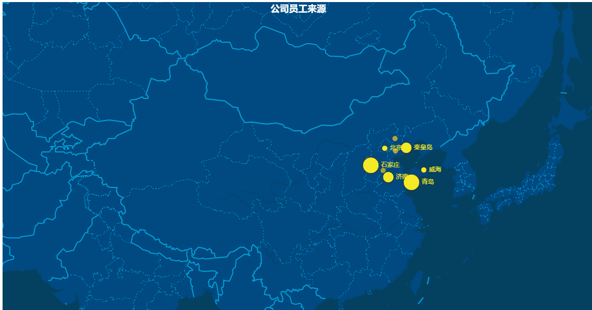