{width="8.5in" height="11.0in"}

> 深入理解分布式事务：原理与实战
>
> 肖宇　冰河　著
>
> ISBN：978-7-111-69223-2
>
> 本书纸版由机械工业出版社于2021年出版，电子版由华
> 章分社（北京华章图文信息有限公司，北京奥维博世图
> 书发行有限公司）全球范围内制作与发行。
>
> 版权所有，侵权必究
>
> 客服热线：+ 86-10-68995265\
> 客服信箱：<service@bbbvip.com>\
> 官方网址：[www.hzmedia.com.cn](http://www.hzmedia.com.cn)
>
> 新浪微博 \@华章数媒
>
> 微信公众号 华章电子书（微信号：hzebook）
>
> 1
>
> 目录
>
> 作者简介
>
> 关于本书
>
> 推荐语
>
> 序
>
> 前言
>
> 第一部分　分布式事务基础
>
> 第1章　事务的基本概念
>
> 1.1　事务的特性 1.1.1　原子性 1.1.2　一致性 1.1.3　隔离性
> 1.1.4　持久性
>
> 1.2　事务的类型\
> 1.2.1　扁平事务
>
> 1.2.2　带有保存点的扁平事务 1.2.3　链式事务
>
> 1.2.4　嵌套事务
>
> 1.2.5　分布式事务
>
> 1.3　本地事务\
> 1.3.1　基本概念
>
> 1.3.2　本地事务的执行流程 1.3.3　本地事务的优缺点
>
> 1.4　MySQL事务基础
>
> 1.4.1　并发事务带来的问题
>
> 1.4.2　MySQL事务隔离级别
>
> 1.4.3　MySQL中各种事务隔离级别的区别 1.4.4　MySQL事务隔离级别最佳实践
> 1.4.5　MySQL中锁的分类
>
> 2
>
> 1.4.6　死锁的产生和预防 1.4.7　MySQL中的死锁问题
> 1.4.8　InnoDB中的MVCC原理
>
> 1.5　本章小结
>
> 第2章　MySQL事务的实现原理
>
> 2.1　Redo　Log
>
> 2.1.1　Redo　Log基本概念
>
> 2.1.2　Redo　Log基本原理 2.1.3　Redo　Log刷盘规则
> 2.1.4　Redo　Log刷盘最佳实践
>
> 2.1.5　Redo　Log写入机制 2.1.6　Redo　Log的LSN机制
> 2.1.7　Redo　Log相关参数
>
> 2.2　Undo　Log
>
> 2.2.1　Undo　Log基本概念
>
> 2.2.2　Undo　Log存储方式 2.2.3　Undo　Log基本原理
> 2.2.4　Undo　Log实现MVCC机制
>
> 2.2.5　Undo　Log相关参数 2.3　BinLog
>
> 2.3.1　BinLog基本概念 2.3.2　BinLog记录模式 2.3.3　BinLog文件结构
> 2.3.4　BinLog写入机制 2.3.5　BinLog组提交机制
>
> 2.3.6　BinLog与Redo　Log的区别 2.3.7　BinLog相关参数
>
> 2.4　MySQL事务流程
>
> 2.4.1　MySQL事务执行流程
>
> 3
>
> 2.4.2　MySQL事务恢复流程 2.5　MySQL中的XA事务
>
> 2.5.1　XA事务的基本原理 2.5.2　MySQL　XA事务语法
> 2.5.3　JDBC操作MySQL　XA事务
>
> 2.6　本章小结
>
> 第3章　Spring事务的实现原理
>
> 3.1　Spring事务原理
>
> 3.1.1　JDBC直接操作事务
>
> 3.1.2　使用Spring管理事务 3.1.3　Spring事务分类 3.1.4　Spring事务超时
> 3.1.5　Spring事务回滚规则
>
> 3.2　Spring事务三大接口
>
> 3.2.1　PlatformTransactionManager接口
>
> 3.2.2　TransactionDefinition接口 3.2.3　TransactionStatus接口
>
> 3.3　Spring事务隔离级别 3.4　Spring事务传播机制
>
> 3.4.1　7种事务传播机制类型 3.4.2　常用的事务传播类型
>
> 3.5　Spring事务嵌套最佳实践
>
> 3.5.1　环境准备
>
> 3.5.2　最佳实践场景一 3.5.3　最佳实践场景二 3.5.4　最佳实践场景三
> 3.5.5　最佳实践场景四 3.5.6　最佳实践场景五 3.5.7　最佳实践场景六
>
> 4
>
> 3.5.8　最佳实践场景七
>
> 3.6　Spring事务失效的场景
>
> 3.6.1　数据库不支持事务
>
> 3.6.2　事务方法未被Spring管理
>
> 3.6.3　方法没有被public修饰
>
> 3.6.4　同一类中的方法调用
>
> 3.6.5　未配置事务管理器
>
> 3.6.6　方法的事务传播类型不支持事务 3.6.7　不正确地捕获异常
>
> 3.6.8　标注错误的异常类型
>
> 3.7　本章小结
>
> 第4章　分布式事务的基本概念
>
> 4.1　分布式系统架构 4.1.1　产生的背景 4.1.2　架构目标和架构原则
>
> 4.2　分布式系统架构演进 4.2.1　单体应用架构 4.2.2　垂直应用架构
>
> 4.2.3　分布式架构\
> 4.2.4　SOA架构\
> 4.2.5　微服务架构
>
> 4.3　分布式事务场景
>
> 4.3.1　跨JVM进程
>
> 4.3.2　跨数据库实例
>
> 4.3.3　多服务访问单数据库
>
> 4.4　数据一致性
>
> 4.4.1　数据的一致性问题
>
> 4.4.2　数据一致性解决方案 4.5　本章小结
>
> 5
>
> 第5章　分布式事务的理论知识
>
> 5.1　CAP理论\
> 5.1.1　一致性
>
> 5.1.2　可用性\
> 5.1.3　分区容忍性 5.1.4　CAP的组合
>
> 5.2　Base理论 5.3　本章小结
>
> 第二部分　分布式事务解决方案
>
> 第6章　强一致性分布式事务解决方案
>
> 6.1　强一致性事务概述
>
> 6.1.1　典型方案 6.1.2　适用场景 6.1.3　优缺点
>
> 6.2　DTP模型
>
> 6.2.1　DTP模型的重要概念
>
> 6.2.2　DTP模型的执行流程 6.3　2PC模型
>
> 6.3.1　2PC模型的执行流程 6.3.2　事务执行成功的流程
> 6.3.3　事务执行失败的流程 6.3.4　2PC模型存在的问题
>
> 6.4　3PC模型
>
> 6.4.1　事务执行成功的流程
>
> 6.4.2　事务执行失败的流程 6.4.3　3PC模型中存在的问题
>
> 6.5　本章小结
>
> 第7章　最终一致性分布式事务解决方案
>
> 7.1　最终一致性分布式事务概述
>
> 6
>
> 7.1.1　典型方案 7.1.2　适用场景 7.1.3　优缺点
>
> 7.2　服务模式
>
> 7.2.1　可查询操作
>
> 7.2.2　幂等操作\
> 7.2.3　TCC操作\
> 7.2.4　可补偿操作
>
> 7.3　TCC解决方案\
> 7.3.1　适用场景
>
> 7.3.2　需要实现的服务模式 7.3.3　方案的执行流程\
> 7.3.4　方案的优缺点
>
> 7.3.5　需要注意的问题
>
> 7.4　可靠消息最终一致性解决方案
>
> 7.4.1　适用场景
>
> 7.4.2　需要实现的服务模式 7.4.3　方案的执行流程\
> 7.4.4　方案的优缺点
>
> 7.4.5　需要注意的问题
>
> 7.5　最大努力通知型解决方案
>
> 7.5.1　适用场景
>
> 7.5.2　需要实现的服务模式
>
> 7.5.3　方案的执行流程
>
> 7.5.4　方案的优缺点
>
> 7.5.5　需要注意的问题
>
> 7.5.6　最大努力通知与可靠消息最终一致性的区 别
>
> 7.6　本章小结
>
> 7
>
> 第三部分　分布式事务原理
>
> 第8章　XA强一致性分布式事务原理
>
> 8.1　X/Open　DTP模型与XA规范
>
> 8.1.1　DTP模型
>
> 8.1.2　XA规范
>
> 8.1.3　JTA规范
>
> 8.1.4　XA二阶段提交
>
> 8.2　MySQL对XA规范的支持 8.2.1　MySQL　XA事务的语法
>
> 8.2.2　MySQL　XID详解
>
> 8.2.3　MySQL　XA事务的状态 8.2.4　MySQL　XA的问题
>
> 8.3　XA规范的问题思考 8.3.1　XA规范的缺陷
> 8.3.2　XA流程的优化与异常思考
>
> 8.3.3　解决XA数据不一致的问题
>
> 8.3.4　解决事务管理器的单点故障问题
>
> 8.4　主流的解决方案\
> 8.5　本章小结
>
> 第9章　TCC分布式事务原理
>
> 9.1　TCC核心思想 9.2　TCC实现原理
>
> 9.2.1　TCC核心组成 9.2.2　TCC核心原理
>
> 9.3　TCC核心流程
>
> 9.3.1　业务场景介绍
>
> 9.3.2　Try阶段流程 9.3.3　Confirm阶段流程 9.3.4　Cancel阶段流程
>
> 8
>
> 9.4　TCC关键技术\
> 9.5　本章小结
>
> 第10章　可靠消息最终一致性分布式事务原理
>
> 10.1　基本原理\
> 10.2　本地消息表
>
> 10.2.1　实现原理\
> 10.2.2　优缺点
>
> 10.3　独立消息服务 10.3.1　实现原理 10.3.2　优缺点
>
> 10.4　RocketMQ事务消息
>
> 10.4.1　实现原理
>
> 10.4.2　RocketMQ本地事务监听接口
>
> 10.5　消息发送的一致性
>
> 10.5.1　消息发送与确认机制
>
> 10.5.2　消息发送的不一致性 10.5.3　如何保证消息发送的一致性
>
> 10.6　消息接收的一致性
>
> 10.6.1　消息接收与确认机制
>
> 10.6.2　消息接收的不一致性 10.6.3　如何保证消息接收的一致性
>
> 10.7　消息的可靠性
>
> 10.7.1　消息发送的可靠性
>
> 10.7.2　消息存储的可靠性 10.7.3　消息消费的可靠性
>
> 10.8　本章小结
>
> 第11章　最大努力通知型分布式事务原理
>
> 11.1　适用场景 11.2　方案特点
>
> 9
>
> 11.3　基本原理 11.4　异常处理 11.5　本章小结
>
> 第四部分　分布式事务源码与实战
>
> 第12章　XA强一致性分布式事务解决方案源码解析
>
> 12.1　分布式数据一致性场景的搭建
>
> 12.1.1　构建环境 12.1.2　准备环境 12.1.3　修改配置 12.1.4　启动
>
> 12.1.5　验证
>
> 12.2　ShardingSphere对XA分布式事务方案的整合
>
> 12.2.1　ShardingTransactionManager接口
> 12.2.2　XATransactionManager接口 12.2.3　DataSourceSwapper类
>
> 12.2.4　XAConnectionWrapper接口
>
> 12.2.5　XA事务初始化
>
> 12.2.6　XA资源注册
>
> 12.3　ShardingSphere对Atomikos方案的实战与源 码解析
>
> 12.3.1　Atomikos-XA分布式事务初始化流程
> 12.3.2　Atomikos-XA分布式事务Begin流程
> 12.3.3　Atomikos-XA分布式事务资源注册原理
> 12.3.4　Atomikos-XA分布式事务Commit流程
> 12.3.5　Atomikos-XA分布式事务Rollback流程
> 12.3.6　Atomikos-XA分布式事务恢复流程
>
> 12.4　ShardingSphere对Narayana方案的实战与源 码解析
>
> 12.4.1　Narayana环境搭建
>
> 10
>
> 12.4.2　Narayana-XA分布式事务初始化流程
> 12.4.3　Narayana-XA分布式事务Begin流程
> 12.4.4　Narayana-XA分布式事务资源注册
> 12.4.5　Narayana-XA分布式事务Commit流程
> 12.4.6　Narayana-XA分布式事务Rollback流程
> 12.4.7　Narayana-XA分布式事务恢复流程
>
> 12.5　本章小结
>
> 第13章　Hmily-TCC分布式事务解决方案源码解析
>
> 13.1　Hmily-TCC分布式场景的搭建
>
> 13.1.1　准备环境
>
> 13.1.2　下载源码并编译\
> 13.1.3　修改配置
>
> 13.1.4　启动程序
>
> 13.1.5　验证
>
> 13.2　Hmily框架初始流程源码解析
>
> 13.2.1　加载配置
>
> 13.2.2　初始化事务日志存储 13.2.3　初始化事务恢复调度器
> 13.2.4　初始化事件分发器 13.2.5　初始化Metrics监控信息
>
> 13.3　Hmily-TCC分布式事务源码解析
>
> 13.3.1　Try流程源码解析 13.3.2　Confirm流程源码解析
> 13.3.3　Cancel流程源码解析
>
> 13.4　Hmily对RPC框架的支持 13.4.1　对Dubbo框架的支持
>
> 13.4.2　对Spring　Cloud框架的支持 13.4.3　对BRPC框架的支持
>
> 13.4.4　对Motan框架的支持
>
> 11
>
> 13.4.5　对gRPC框架的支持 13.4.6　对Sofa-RPC框架的支持
> 13.4.7　对Tars框架的支持
>
> 13.5　Hmily-TCC事务恢复源码解析
>
> 13.5.1　逻辑处理 13.5.2　事务恢复
>
> 13.6　本章小结
>
> 第14章　XA强一致性分布式事务实战
>
> 14.1　场景说明
>
> 14.2　程序模块说明 14.3　数据库表设计 14.4　程序实现
>
> 14.4.1　项目搭建
>
> 14.4.2　持久层的实现 14.4.3　业务逻辑层的实现 14.4.4　接口层的实现
> 14.4.5　项目启动类的实现
>
> 14.5　测试程序 14.6　本章小结
>
> 第15章　TCC分布式事务实战
>
> 15.1　场景说明
>
> 15.2　程序模块说明
>
> 15.3　数据库表设计
>
> 15.4　实现项目公共模块
>
> 15.4.1　项目搭建
>
> 15.4.2　持久层的实现 15.4.3　Dubbo接口的定义
>
> 15.5　实现转出银行微服务
>
> 15.5.1　项目搭建
>
> 12
>
> 15.5.2　业务逻辑层的实现 15.5.3　接口层的实现 15.5.4　项目启动类的实现
>
> 15.6　实现转入银行微服务 15.6.1　业务逻辑层的实现
>
> 15.6.2　项目启动类的实现 15.7　测试程序
>
> 15.8　本章小结
>
> 第16章　可靠消息最终一致性分布式事务实战
>
> 16.1　场景说明
>
> 16.2　程序模块说明
>
> 16.3　RocketMQ环境搭建与测试
>
> 16.3.1　搭建Java环境 16.3.2　搭建RocketMQ环境 16.3.3　测试RocketMQ环境
>
> 16.4　数据库表设计 16.5　实现订单微服务
>
> 16.5.1　项目搭建
>
> 16.5.2　持久层的实现 16.5.3　业务逻辑层的实现 16.5.4　接口层的实现
> 16.5.5　项目启动类的实现
>
> 16.6　实现库存微服务\
> 16.6.1　项目搭建
>
> 16.6.2　持久层的实现 16.6.3　业务逻辑层的实现 16.6.4　项目启动类的实现
>
> 16.7　测试程序 16.8　本章小结
>
> 13
>
> 第17章　最大努力通知型分布式事务实战
>
> 17.1　场景说明
>
> 17.2　程序模块说明 17.3　数据库表设计 17.4　实现账户微服务
>
> 17.4.1　项目搭建
>
> 17.4.2　持久层的实现 17.4.3　业务逻辑层的实现 17.4.4　接口层的实现
> 17.4.5　启动类的实现
>
> 17.5　实现充值微服务
>
> 17.5.1　项目搭建与持久层的实现
>
> 17.5.2　业务逻辑层的实现 17.5.3　接口层的实现 17.5.4　启动类的实现
>
> 17.6　测试程序 17.7　本章小结
>
> 14
>
> 作者简介
>
> 肖宇
>
> 分布式事务架构专家，Apache
> ShenYu（incubating）网关创始人，Dromara开源组织创
>
> 始人，Hmily、RainCat、Myth等分布式事务框架的作 者，Apache
> ShardingSphere提交者。
>
> 热爱开源，追求优雅代码。有丰富的微服务架构经
> 验，尤其擅长微服务技术栈中的分布式事务、微服务架
> 构、分布式数据库、API网关等解决方案。
>
> 冰河
>
> 互联网高级技术专家、MySQL技术专家、分布式事务 架构专家。
>
> 多年来，一直致力于分布式系统架构、微服务、分
> 布式数据库、分布式事务与大数据技术的研究，在高并
> 发、高可用、高可扩展性、高可维护性和大数据等领域 拥有丰富的架构经验。
>
> 可视化多数据源数据异构中间件mykit-data作者；
> 《海量数据处理与大数据技术实战》和《MySQL技术大
> 全：开发、优化与运维实战》作者；"冰河技术"微信 公众号维护者。
>
> 15
>
> 关于本书
>
> 这是一本广度与深度兼备、理论与实战兼顾的分布
> 式事务专著，从基础知识、解决方案、原理分析、源码
> 实现、工程实战5个维度对分布式事务做了全面、深入的
>
> 讲解，试图解决你在实践中遇到的所有关于分布式事务 的问题。
>
> 两位作者都是分布式事务领域的资深架构专家，是 Apache
> ShenYu（incubating）网关创始人、Hmily、
> RainCat、Myth等分布式事务框架的作者。本书因为内容
> 扎实，所以得到了来自京东、阿里、腾讯、蚂蚁金服、
> 滴滴、饿了么、58集团、IBM等互联网大厂及Apache软件
> 基金会的近20位专家的高度评价。
>
> 基础知识维度：首先全面介绍了事务和分布式事务
> 的概念和基础知识，然后详细讲解了MySQL事务和Spring
>
> 事务的实现原理。
>
> 解决方案维度：详细介绍了分布式事务的各种解决
> 方案，包括强一致性分布式事务解决方案和最终一致性 分布式事务解决方案。
>
> 原理分析维度：详细讲解了分布式事务的原理，包
> 括XA强一致性分布式事务、TCC分布式事务、可靠消息最
>
> 终一致性分布式事务和最大努力通知型分布式事务的原 理。
>
> 16
>
> 源码实现维度：深入分析了Atomikos、Narayana框
> 架实现XA强一致性分布式事务解决方案的源码，以及
> Dromara开源社区的Hmily分布式事务框架实现TCC分布式 事务的源码。
>
> 工程实践维度：通过多个在生产环境中经历了高并
> 发、大流量考验的综合案例，讲解了XA强一致性分布式
> 事务、TCC分布式事务、可靠消息最终一致性分布式事务
>
> 和最大努力通知型分布式事务的工程实践方法。
>
> 全书配有大量流程图和原理图，便于读者阅读理
> 解；精选了大量来自生产环境的完整案例及其代码，便
>
> 于读者动手实践。阅读本书，你将体验到事半功倍的效 果。
>
> 17
>
> 推荐语
>
> 在分布式应用系统中，特别是在金融相关的场景
> 下，分布式事务是大家都关注的核心技术，同样也是系
>
> 统的技术难点。本书从数据库和服务的分布式基础开
> 始，由浅入深阐述了分布式事务的原理、解决方案。这
> 种以框架开发者视角分享的分布式事务实现的源码和实
> 践用例，对于应用架构师和开发者都有极大的价值。
>
> ------郑灏　京东科技高级技术总监
>
> 分布式事务是伴随分布式数据库架构发展而衍生出
> 的关键技术，是影响分布式数据库市场竞争力的关键。
> 本书深入浅出地讲解了分布式事务的基本原理和应用实
> 践，具有很好的指导意义，适合数据库研发人员、数据 库架构师和DBA。
>
> ------高新刚　京东科技数据库研发负责人
>
> 本书深入浅出、通俗易懂，不论是对入门型还是进
> 阶型的微服务爱好者都有一定的指导和借鉴意义。
>
> ------沈建林　京东科技中间件团队负责人
>
> 如今，越来越多的企业开始面向广阔的数字生态搭
> 建企业应用，而对这些需要升级技术底座的企业来说，
> 分布式事务成为要解决的关键性技术问题，相信这本书
> 一定能很好地帮读者答疑解惑！
>
> 18
>
> ------付晓岩　IBM副合伙人、资深企业级业务架构专家、
>
> 《企业级业务架构设计：方法论与实践》和《银行 数字化转型》作者
>
> 本书从事务的基本概念、数据强一致性模型的2PC与
> 3PC实现，到Base补偿式事务等方面，详细描述了分布式
> 事务的应用场景以及多种分布式系统架构的演进。这是
>
> 一本深入讲解分布式事务原理和丰富应用的很好的参考 书。
>
> ------刘勋　滴滴大数据高级技术专家，Apache
> Hadoop/Zeppelin提交者、Submarine提交者及PMC
>
> 本书由浅入深地介绍了各分布式事务的优缺点和适
> 用场景，理论结合实践，大大减少了事务相关资料阅读
> 与理解的难度，对于想深入学习事务的读者来说非常值 得入手！
>
> ------代立冬　Apache DolphinScheduler PMC主席、Apache Incubator PMC
>
> 本书以开源分布式框架作者的视角，全面总结了事
> 务的核心技术，内容涵盖了广泛使用的MySQL和Spring的
>
> 事务机制、业界分布式事务架构理论以及源码与实战，
> 适合希望深入理解事务机制、提升软件设计与架构经验 的读者阅读。
>
> ------杨晓峰　腾讯专家工程师、腾讯硬件委员会执委、
> 开源联盟主委会成员、大数据专家团成员、OpenJDK提
>
> 19
>
> 交者
>
> 专门以事务为主题的图书并不常见。本书系统地梳
> 理了事务的概念，针对数据库到中间件和框架类的事务
> 实现，带领读者抽丝剥茧，帮助读者从全景到细节，建
> 立对事务的深入理解，是工程师深度探索技术的优质读 物。
>
> ------张亮　Apache ShardingSphere PMC主席、SphereEx CEO
>
> 本书由浅入深、由点到面，完整地将分布式事务相
> 关理论、解决方案以及源码实战呈现在读者面前。推荐
> 给正在寻求突破和快速成长的技术人。
>
> ------曾波（波姐）　资深互联网架构师、《Java性能优化 实践》译者
>
> 本书不仅包含了肖宇和冰河积累多年的实战经验，
> 更从多种场景出发，详解可落地方案，而且从多种分布
> 式事务框架的使用和原理入手，带领读者一步步揭开分
> 布式事务的面纱。这本书非常不错，强烈推荐大家阅读 学习。
>
> ------程超　《高可用可伸缩微服务架构》作者
>
> 本书作者在微服务领域深耕多年，拥有深厚的分布
> 式事务开发经验，不仅在公司主导一线开发，同时也是
> 开源分布式事务框架Hmily项目的作者。本书字里行间蕴
>
> 含着作者对分布式事务独到的见解，内容上不仅有原理
>
> 20
>
> 和业界主流的解决方案，还包含了一线项目的实战和源
> 码解析。无论是刚入门的开发者，还是从事开发和研究
> 工作多年的资深工程师，本书都会让你受益匪浅。
>
> ------张永伦　Apache ShardingSphere PMC/Apache ShenYu PPMC
>
> 本书从MySQL InnoDB引擎的事务实现讲起，逐步扩
> 展到分布式事务场景，从原理到工程实践，理论结合实
> 践，是分布式事务领域的经典之作，无论是对分布式事
> 务的初学者还是具有一定开发实践经验的工程师或架构
> 师，都有一定的参考和借鉴意义。
>
> ------于雨　蚂蚁金服dubbo go项目负责人
>
> 冰河是一个对技术非常严谨和有追求的人，尤其对
> 分布式领域的分布式事务有着深刻的理解和丰富的架构
> 经验。本书把分布式事务的基础、原理、解决方案和实
> 战都讲得非常透彻，强烈推荐每一位程序员阅读。
>
> ------程军　公众号"军哥手记"维护者，前饿了么技术 总监
>
> 无论是传统的单体架构，还是目前主流的分布式架
> 构，事务都是绕不开的技术难题。本书从基本概念到原
> 理介绍，再到主流的解决方案，系统地梳理了分布式事
> 务的核心知识，既有理论，又有实战，对于微服务设计
> 有很好的指导意义，也是市面上围绕这一主题少见的有 深度的好书。
>
> 21
>
> ------骆俊武　京东新零售业务机构负责人
>
> 22
>
> 序
>
> 无论使用什么样的开发语言，无论软件运行在何种
> 操作系统上，无论架构采用的是单体应用架构还是分布
> 式微服务架构，只要我们开发复杂的交易型业务系统，
> 必然就有一个困扰诸多开发人员的技术难题无法绕开， 那就是事务。
>
> 许多作者在讲解架构模式与设计模式，或者介绍软
> 件开发方法与理论，抑或剖析业界与社区主流的开发框
> 架时，大多会用一定篇幅介绍事务这一概念，由此可见
> 它的重要性。奇怪的是，据我所知，整个技术社区却没
> 有一本专门讲解事务的图书。
>
> 这是因为事务涉及的知识面既广且深，这些知识的
> 叠加对作者的能力提出了极高的要求，即至少要在事务
> 领域实践多年，真刀真枪地写过底层事务框架。作为一
> 名业务系统的架构师和程序员，我对事务的认识也只是
> 一知半解。虽然我也曾在书中用相当一部分篇幅详细介
> 绍事务的相关知识，但是很惭愧，我并未建立对事务的
> 系统认知。究其原因，是我获取的事务相关知识皆来自
> 散落于各种文献的片言只语。幸运的是，肖宇看到了这
> 一关键空白，与他的朋友冰河共同创作了本书，为我们
> 推开了认识并了解事务的一扇窗。
>
> 本书可谓事务，尤其是分布式事务的极佳学习与实
> 战宝典。书中首先介绍了事务的基本概念、MySQL事务和
>
> Spring事务的实现原理。在夯实这些基础知识后，进而
> 向分布式事务迈进，相继介绍了分布式系统架构的演
>
> 23
>
> 进、分布式事务场景与分布式事务的理论知识。在读者
> 具备了足够的事务知识后，书中陆续抛出干货，相当深
> 入地介绍和分析了强一致性与最终一致性分布式事务的
> 解决方案，高屋建瓴地剖析与总结了各种分布式事务模
> 式的原理，将XA强一致性、TCC、可靠消息最终一致性、
>
> 最大努力通知型等事务模式一网打尽，各种技术知识的
> 讲解精彩纷呈。即便如此，作者尤嫌不足，进一步引出
> 源码分析，先后对ShardingSphere、Atomikos、
>
> Narayana、Hmily-TCC等框架的源码进行剖析，并给出了 实战演练的案例。
>
> 本书的结构安排体现了作者的匠心独运，充分证明
> 了作者的事务知识已经烂熟于胸，因而下笔才能游刃有
> 余。何以证明？肖宇是Apache ShardingSphere的贡献者
>
> 之一，也是Hmily、RainCat、Myth等分布式事务框架的
> 作者，毫不夸张地说，事务这门技能已经融入他的技术
> 血液中了！而他的朋友冰河，也是深耕分布式事务领域
> 多年的高级技术专家和资深架构师。
>
> 倘若你对国内开源社区有所关注和了解，就一定感
> 受到了Dromara开源社区的影响力，而肖宇作为该社区的
>
> 创始人，正在默默地为推动中国开源技术的发展贡献自
> 己的力量。肖宇还是微服务网关ShenYu框架的创始人，
> 在他的努力下，该框架目前已经成功进入Apache基金会
> 的孵化阶段。在认真拜读过ShenYu框架的源代码后，我
> 认为该框架的代码质量与设计能够在众多开源框架中名
> 列前茅。肖宇在开源方面已经取得了如此斐然的成绩，
> 没想到他还笔耕不辍，携手冰河历经近两年的时间为大
> 家贡献了如此具有深度的技术书。
>
> 24
>
> 很荣幸受肖宇兄所邀为本书作序，我已经能够预
> 见，随着本书的出版，必定会有越来越多的同行将目光
>
> 投向事务，并愿意沉下心去理解事务，认真地学习事
> 务，努力掌握事务编写的技巧，进而熟练地运用事务，
> 为推动事务发展贡献一份力量。
>
> 张逸　场量科技联合创始人、《解构领域驱动设计》作
>
> 者
>
> 25
>
> 前言
>
> 为什么要写这本书
>
> 随着互联网的不断发展，互联网企业的业务在飞速
> 变化，推动着系统架构也在不断地发生变化。总体来
> 说，系统架构大致经历了单体应用架构→垂直应用架构
> →分布式架构→SOA架构→微服务架构的演变。如今微服
> 务技术越来越成熟，很多企业都采用微服务架构来支撑
> 内部及对外的业务，尤其是在高并发大流量的电商业务
> 场景下，微服务更是企业首选的架构模式。
>
> 微服务的普及也带来了新的问题。原本单一的应用
> 架构只需要连接一台数据库实例即可完成所有业务操
> 作，业务方法的逻辑在一个事务中即可完成，涉及的所
> 有数据库操作要么全部提交，要么全部不提交，很容易
> 实现数据的一致性。而在微服务架构下，原本单一的应
> 用被拆分为一个个很小的服务，每个服务都有其独立的
> 业务和数据库，服务与服务之间的交互通过接口或者远 程过程调用（Remote
> Procedure Call，RPC）的方式进
> 行，此时，服务与服务之间的数据一致性问题就变得棘 手了。
>
> 因为微服务这种架构模式本质上就是多个应用连接
> 多个数据库共同完成一组业务逻辑，所以数据一致性问
> 题就凸显出来了。除此之外，多个应用连接同一个数据
> 库和单个应用连接多个数据库也会产生数据一致性问
>
> 题。可以这么说，在互联网行业，任何企业都会或多或
> 少地遇到数据一致性问题。业界将这种数据一致性问题
>
> 26
>
> 称为分布式事务问题。为了解决分布式事务问题，业界
> 提出了一些著名的理论，比如CAP理论和Base理论，并针
> 对这些理论提出了很多解决方案，比如解决强一致性分
> 布式事务的DTP模型、XA事务、2PC模型、3PC模型，解决
> 最终一致性分布式事务的TCC、可靠消息最终一致性、最
> 大努力通知型等模型。不少企业和开源组织，甚至个人
> 都基于这些模型实现了比较通用的分布式事务框架。
>
> 深入掌握分布式事务已然成为互联网行业中每个中
> 高级开发人员和架构师必须掌握的技能，而熟练掌握分
> 布式事务产生的各种场景和解决方案也成为各大互联网
> 公司对应聘者的基本要求。
>
> 尽管对于分布式事务这个话题，业界有不少成熟的
> 解决方案，但是纵观整个图书市场，几乎找不到一本系
> 统深入讲解分布式事务的图书。本书从实际需求出发，
> 全面且细致地介绍了有关分布式事务的基础知识、解决
> 方案、实现原理和源码实战。每章根据需要配有相关的
> 原理图和流程图，并提供完整的实战案例源码。书中的
> 每个解决方案都经过了高并发大流量生产环境的考验，
> 可以直接拿来解决实际生产环境中的分布式事务问题。
> 通过对本书的阅读和学习，读者可以更加全面、深入、
> 透彻地理解分布式事务的基础、解决方案、原理和应
>
> 用，提高应对分布式事务问题的处理能力和项目的实战 能力。
>
> 读者对象
>
> 本书适合以下几类读者阅读：
>
> 27
>
> ·互联网从业者，如中高级开发人员、架构师、技 术经理、技术专家；
>
> ·需要系统学习分布式事务的开发人员；\
> ·需要提高分布式事务开发水平的人员；\
> ·需要时常查阅分布式事务技术资料和开发案例的
>
> 人员。
>
> 本书特色
>
> 1.大量图解和开发案例
>
> 为了方便读者理解，我们在介绍分布式事务的基
> 础、解决方案、原理、源码与实战章节中配有大量的图
>
> 解和图表，同时在源码与实战章节配有完整的分布式事
> 务案例，读者可以参考本书的案例进行学习，并运行本
> 书的案例代码，以更深入地理解和掌握分布式事务。这
> 些案例代码和图解的draw.io源文件收录于随书资料里，
>
> 读者可以从下面的链接获取相关内容。
>
> [·GitHub：https://github.com/dromara/distribute-](https://github.com/dromara/distribute-transaction)
> [transaction。](https://github.com/dromara/distribute-transaction)
>
> [·Gitee：https://gitee.com/dromara/distribute-](https://gitee.com/dromara/distribute-transaction)
> [transaction。](https://gitee.com/dromara/distribute-transaction)
>
> 2.技术点全面
>
> 28
>
> 本书全面且细致地介绍了分布式事务的各项知识，
> 包含分布式事务的基础、解决方案、原理、源码与实
> 战。通过阅读本书，读者能够全面掌握分布式事务的原 理和应用。
>
> 3.案例应用性强，具备较高的实用价值
>
> 本书关于分布式事务的各项技术点都配有相关的案
> 例，都是实现分布式事务相关技术的典型案例，具有很
> 强的实用性，方便读者随时查阅和参考。
>
> 另外，这些实战案例大都是我们实际工作的总结，
> 尤其是书中涉及的分布式事务框架，均是业界知名的开
> 源分布式事务框架，稍加修改与完善便可应用于实际的 生产环境中。
>
> 本书内容
>
> 本书分为如下四个部分。
>
> 第一部分　分布式事务基础（第1～5章）
>
> 首先介绍事务的基本概念，然后介绍MySQL事务和
> Spring事务的实现原理，最后介绍分布式事务的基本概
>
> 念和理论知识。
>
> 第二部分　分布式事务解决方案（第6～7章）
>
> 以大量图解的方式详细介绍了分布式事务的各种解
> 决方案，包括强一致性分布式事务解决方案和最终一致
> 性分布式事务解决方案。
>
> 29
>
> 第三部分　分布式事务原理（第8～11章）
>
> 以大量图解的方式详细讲解了分布式事务的原理，
> 包括XA强一致性分布式事务、TCC分布式事务、可靠消息
>
> 最终一致性分布式事务和最大努力通知型分布式事务。
>
> 第四部分　分布式事务源码与实战（第12～17章）
>
> 首先详细讲解了业界比较知名的ShardingSphere框
> 架实现XA分布式事务的源码，然后详细剖析了Dromara开
>
> 源社区的Hmily分布式事务框架实现TCC分布式事务的源
> 码，最后分别对XA强一致性分布式事务、TCC分布式事
> 务、可靠消息最终一致性分布式事务和最大努力通知型
> 分布式事务进行了实战案例讲解。
>
> 如何阅读本书\
> ·对于没有接触过分布式事务的读者，建议按照顺
>
> 序从第1章开始阅读，并实现每一个案例。
>
> ·对于有一定MySQL和Spring开发基础的读者，可以
> 根据实际情况，有选择性地阅读分布式事务的相关章 节。
>
> ·对于书中涉及的每个分布式事务案例，读者可以
> 先自行思考实现方式，再阅读相关的案例讲解，了解各
> 技术对应的原理细节，以加深理解，达到事半功倍的学 习效果。
>
> 勘误和支持
>
> 30
>
> 本书是肖宇和冰河（排名不分先后）联合撰写的。
> 由于水平有限，编写时间仓促，书中难免会出现一些错
> 误或者不准确的地方，恳请读者批评指正。为此，我们
> 特意在Dromara社区的GitHub上创建了一个单独的仓库用
>
> 来记录本书的勘误信息，仓库地址为
> <https://github.com/dromara/transaction-book>[。读者](https://github.com/dromara/transaction-book。读者可以将书中的错误发布在Bug勘误中，如果遇到任何问题，也可以记录在这个仓库中，我们将尽量在线上为读者提供最满意的解答。如果有更多宝贵的建议或者意见，也可以联系我们。)
> [可以将书中的错误发布在Bug勘误中，如果遇到任何问](https://github.com/dromara/transaction-book。读者可以将书中的错误发布在Bug勘误中，如果遇到任何问题，也可以记录在这个仓库中，我们将尽量在线上为读者提供最满意的解答。如果有更多宝贵的建议或者意见，也可以联系我们。)
> [题，也可以记录在这个仓库中，我们将尽量在线上为读](https://github.com/dromara/transaction-book。读者可以将书中的错误发布在Bug勘误中，如果遇到任何问题，也可以记录在这个仓库中，我们将尽量在线上为读者提供最满意的解答。如果有更多宝贵的建议或者意见，也可以联系我们。)
> [者提供最满意的解答。如果有更多宝贵的建议或者意](https://github.com/dromara/transaction-book。读者可以将书中的错误发布在Bug勘误中，如果遇到任何问题，也可以记录在这个仓库中，我们将尽量在线上为读者提供最满意的解答。如果有更多宝贵的建议或者意见，也可以联系我们。)
> [见，也可以联系我们。](https://github.com/dromara/transaction-book。读者可以将书中的错误发布在Bug勘误中，如果遇到任何问题，也可以记录在这个仓库中，我们将尽量在线上为读者提供最满意的解答。如果有更多宝贵的建议或者意见，也可以联系我们。)
>
> 肖宇的联系方式如下。\
> ·微信：xixy199195。\
> ·邮箱：xiaoyu@apache.org。\
> ·公众号：Dromara开源组织。
>
> 冰河的联系方式如下。\
> ·微信：hacker_binghe。\
> ·邮箱：1028386804@qq.com。\
> ·公众号：冰河技术。
>
> 如果想获得更多有关分布式事务或者开源框架的最
> 新动态，可以关注微信公众号"Dromara开源组织"和 "冰河技术"。
>
> 31
>
> 致谢
>
> 首先感谢张逸为本书作序。感谢郑灏、刘启荣、高
> 新刚、沈建林、付晓岩、史少锋、刘勋、张亮、代立
> 冬、杨晓峰、于君泽、孙玄、沈剑、曾波、程超、张永
> 伦、于雨、程军和骆俊武（排名不分先后）等专家为本 书撰写推荐语。
>
> 感谢Dromara开源社区的兄弟姐妹们，感谢你们对社
> 区的长期支持和贡献。你们的支持是我们写作的最大动 力。
>
> 感谢机械工业出版社华章公司的杨福川老师和董惠
> 芝编辑、韩蕊编辑在这一年多的时间里始终支持我们写
> 作，是你们的鼓励和帮助引导我们顺利完成了全部书
>
> 稿。
>
> 感谢家人在我们写作期间默默给予我们支持与鼓
> 励，并时刻为我们传递着信心和力量！
>
> 最后，感谢所有支持、鼓励和帮助过我们的人。谨
> 以此书献给我们最亲爱的家人，以及众多热爱开源事业
> 和关注Dromara开源社区的朋友们！
>
> 肖宇、冰河
>
> 32
>
> 第一部分　分布式事务基础
>
> ·第1章　事务的基本概念\
> ·第2章　MySQL事务的实现原理\
> ·第3章　Spring事务的实现原理\
> ·第4章　分布式事务的基本概念\
> ·第5章　分布式事务的理论知识
>
> 33
>
> 第1章　事务的基本概念
>
> 事务一般指的是逻辑上的一组操作，或者作为单个
> 逻辑单元执行的一系列操作。同属于一个事务的操作会
> 作为一个整体提交给系统，这些操作要么全部执行成
>
> 功，要么全部执行失败。本章就简单地介绍一下事务的 基本概念。
>
> 本章涉及的内容如下。\
> ·事务的特性。\
> ·事务的类型。\
> ·本地事务。\
> ·MySQL事务基础。
>
> 34
>
> 1.1　事务的特性
>
> 总体来说，事务存在四大特性，分别是原子性
> （Atomic）、一致性（Consistency）、隔离性
> （Isolation）和持久性（Durability），如图1-1所示，
> 因此，事务的四大特性又被称为ACID。

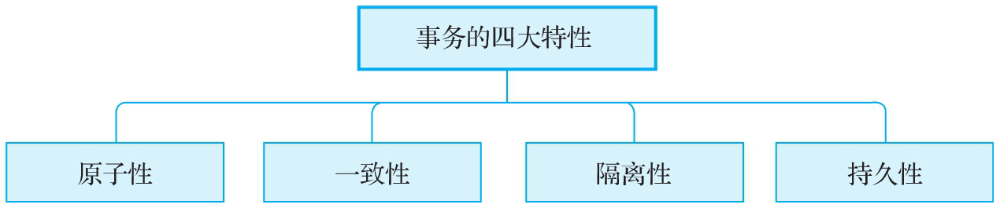{width="6.427890419947507in"
height="1.3391437007874016in"}

> 图1-1　事务的四大特性
>
> 35
>
> 1.1.1　原子性
>
> 事务的原子性指的是构成事务的所有操作要么全部
> 执行成功，要么全部执行失败，不可能出现部分执行成
> 功，部分执行失败的情况。
>
> 例如，在转账业务中，张三向李四转账100元，于是
> 张三的账户余额减少100元，李四的账户余额增加100
> 元。在开启事务的情况下，这两个操作要么全部执行成
> 功，要么全部执行失败，不可能出现只将张三的账户余
> 额减少100元的操作，也不可能出现只将李四的账户余额 增加100元的操作。
>
> 36
>
> 1.1.2　一致性
>
> 事务的一致性指的是在事务执行之前和执行之后，
> 数据始终处于一致的状态。例如，同样是转账业务，张
> 三向李四转账100元，且转账前和转账后的数据是正确
>
> 的，那么，转账后张三的账户余额会减少100元，李四的
> 账户余额会增加100元，这就是数据处于一致的状态。如
> 果张三的账户余额减少了100元，而李四的账户余额没有
> 增加100元，这就是数据处于不一致状态。
>
> 37
>
> 1.1.3　隔离性
>
> 事务的隔离性指的是并发执行的两个事务之间互不
> 干扰。也就是说，一个事务在执行过程中不能看到其他
> 事务运行过程的中间状态。例如，在张三向李四转账的
> 业务场景中，存在两个并发执行的事务A和事务B，事务A
>
> 执行扣减张三账户余额的操作和增加李四账户余额的操
> 作，事务B执行查询张三账户余额的操作。在事务A完成
> 之前，事务B读取的张三的账户余额仍然为扣减之前的账
>
> 户余额，不会读取到扣减后的账户余额。
>
> {width="0.5104166666666666in"
> height="0.5104166666666666in"}注意
> MySQL通过锁和MVCC机制来保证事务的隔离性。
>
> 38
>
> 1.1.4　持久性
>
> 事务的持久性指的是事务提交完成后，此事务对数
> 据的更改操作会被持久化到数据库中，并且不会被回
> 滚。例如，在张三向李四转账的业务场景中，在同一事
> 务中执行扣减张三账户余额和增加李四账户余额的操
> 作，事务提交完成后，这种对数据的修改操作就会被持
> 久化到数据库中，且不会被回滚。
>
> {width="0.5104166666666666in"
> height="0.5104166666666666in"}注意
> 数据库的事务在实现时，会将一次事务中包含的所
>
> 有操作全部封装成一个不可分割的执行单元，这个单元
> 中的所有操作要么全部执行成功，要么全部执行失败。
> 只要其中任意一个操作执行失败，整个事务就会执行回 滚操作。
>
> 39
>
> 1.2　事务的类型
>
> 事务主要分为五大类，分别为扁平事务、带有保存
> 点的扁平事务、链式事务、嵌套事务和分布式事务。本
> 节就简单介绍一下事务的五大类型。
>
> 40
>
> 1.2.1　扁平事务
>
> 扁平事务是事务操作中最常见，也是最简单的事
> 务。在数据库中，扁平事务通常由begin或者start
> transaction字段开始，由commit或者rollback字段结
> 束。在这之间的所有操作要么全部执行成功，要么全部
> 执行失败（回滚）。当今主流的数据库都支持扁平事 务。
>
> 扁平事务虽然是最常见、最简单的事务，但是无法
> 提交或者回滚整个事务中的部分事务，只能把整个事务
> 全部提交或者回滚。为了解决这个问题，带有保存点的 扁平事务出现了。
>
> 41
>
> 1.2.2　带有保存点的扁平事务
>
> 通俗地讲，内部设置了保存点的扁平事务，就是带
> 有保存点的扁平事务。带有保存点的扁平事务通过在事
> 务内部的某个位置设置保存点（savepoint），达到将当
>
> 前事务回滚到此位置的目的，示例如下。
>
> 在MySQL数据库中，通过如下命令设置事务的保存
>
> 点。
>
> savepoint \[savepoint_name\]
>
> 例如，设置一个名称为save_user_point的保存点， 代码如下所示。
>
> savepoint save_user_point;
>
> 通过如下命令将当前事务回滚到定义的保存点位
>
> 置。
>
> rollback to \[savepoint_name\]
>
> 例如，将当前事务回滚到定义的名称为
> save_user_point的保存点位置，代码如下所示。
>
> 42
>
> rollback to save_user_point;
>
> 通过如下命令删除保存点。
>
> release savepoint \[savepoint_name\]
>
> 例如，删除当前事务中名称为save_user_point的保 存点，代码如下所示。
>
> release savepoint save_user_point;
>
> 从本质上讲，普通的扁平事务也是有保存点的，只
> 是普通的扁平事务只有一个隐式的保存点，并且这个隐
> 式的保存点会在事务启动的时候，自动设置为当前事务
> 的开始位置。也就是说，普通的扁平事务具有保存点，
> 而且默认是事务的开始位置。
>
> 43
>
> 1.2.3　链式事务
>
> 链式事务是在带有保存点的扁平事务的基础上，自
> 动将当前事务的上下文隐式地传递给下一个事务。也就
> 是说，一个事务的提交操作和下一个事务的开始操作具
> 备原子性，上一个事务的处理结果对下一个事务是可见
> 的，事务与事务之间就像链条一样传递下去。
>
> {width="0.5104166666666666in"
> height="0.5104166666666666in"}注意
> 链式事务在提交的时候，会释放要提交的事务中的
>
> 所有锁和保存点，也就是说，链式事务的回滚操作只能
> 回滚到当前所在事务的保存点，而不能回滚到已提交事 务的保存点。
>
> 44
>
> 1.2.4　嵌套事务
>
> 顾名思义，嵌套事务就是有多个事务处于嵌套状
> 态，共同完成一项任务的处理，整个任务具备原子性。
>
> 嵌套事务最外层有一个顶层事务，这个顶层事务控制着
> 所有的内部子事务，内部子事务提交完成后，整体事务
> 并不会提交，只有最外层的顶层事务提交完成后，整体 事务才算提交完成。
>
> 关于嵌套事务需要注意以下几点。
>
> 1）回滚嵌套事务内部的子事务时，会将事务回滚到 外部顶层事务的开始位置。
>
> 2）嵌套事务的提交是从内部的子事务向外依次进行
> 的，直到最外层的顶层事务提交完成。
>
> 3）回滚嵌套事务最外层的顶层事务时，会回滚嵌套
> 事务包含的所有事务，包括已提交的内部子事务。
>
> 在主流的关系型数据库中，MySQL不支持原生的嵌套 事务，而SQL
> Server支持。这里，笔者不建议使用嵌套 事务。
>
> 45
>
> 1.2.5　分布式事务
>
> 分布式事务指的是事务的参与者、事务所在的服务
> 器、涉及的资源服务器以及事务管理器等分别位于不同
> 分布式系统的不同服务或数据库节点上。简单来说，分
> 布式事务就是一个在不同环境（比如不同的数据库、不
> 同的服务器）下运行的整体事务。这个整体事务包含一
> 个或者多个分支事务，并且整体事务中的所有分支事务
> 要么全部提交成功，要么全部提交失败。
>
> 例如，在电商系统的下单减库存业务中，订单业务
> 所在的数据库为事务A的节点，库存业务所在的数据库为
>
> 事务B的节点。事务A和事务B组成了一个具备ACID特性的
> 分布式事务，要么全部提交成功，要么全部提交失败。
>
> 46
>
> 1.3　本地事务
>
> 1.2节简单介绍了事务的ACID特性。本节主要介绍本
> 地事务的基本概念及优缺点。
>
> 47
>
> 1.3.1　基本概念
>
> 在常见的计算机系统和应用系统中，很多事务是通
> 过关系型数据库进行控制的。这种控制事务的方式是利
> 用数据库本身的事务特性来实现，而在这种实现方式
>
> 中，数据库和应用通常会被放在同一台服务器中，因
> 此，这种基于关系型数据库的事务也可以称作本地事务 或者传统事务。
>
> 本地事务使用常见的执行模式，可以使用如下伪代 码来表示。
>
> transaction begin
>
> insert into 表名 (字段名列表) values (值列表) update 表名 set 字段名 =
> 字段值 where id = id值 delete from 表名 where id = id值
>
> transaction commit/rollback
>
> 另外，本地事务也具有一些特征。以下列举几个本 地事务具有的典型特征。
>
> 1）一次事务过程中只能连接一个支持事务的数据
> 库，这里的数据库一般指的是关系型数据库。
>
> 2）事务的执行结果必须满足ACID特性。
>
> 3）事务的执行过程会用到数据库本身的锁机制。
>
> 48
>
> 1.3.2　本地事务的执行流程
>
> 本地事务的执行流程如图1-2所示。

{width="6.427891513560805in"
height="3.965926290463692in"}

> 图1-2　本地事务的执行流程
>
> 从图1-2中可以看出：
>
> 1）客户端开始事务操作之前，需要开启一个连接会
>
> 话；
>
> 2）开始会话后，客户端发起开启事务的指令；
>
> 3）事务开启后，客户端发送各种SQL语句处理数据；
>
> 49
>
> 4）正常情况下，客户端会发起提交事务的指令，如
> 果发生异常情况，客户端会发起回滚事务的指令；
>
> 5）上述流程完成后，关闭会话。
>
> 本地事务是由资源管理器在本地进行管理的。
>
> 50
>
> 1.3.3　本地事务的优缺点
>
> 本地事务的优点总结如下。
>
> 1）支持严格的ACID特性，这也是本地事务得以实现 的基础。
>
> 2）事务可靠，一般不会出现异常情况。
>
> 3）本地事务的执行效率比较高。
>
> 4）事务的状态可以只在数据库中进行维护，上层的
> 应用不必理会事务的具体状态。
>
> 5）应用的编程模型比较简单，不会涉及复杂的网络 通信。
>
> 本地事务的缺点总结如下。
>
> 1）不具备分布式事务的处理能力。
>
> 2）一次事务过程中只能连接一个支持事务的数据
> 库，即不能用于多个事务性数据库。
>
> 51
>
> 1.4　MySQL事务基础
>
> 在互联网领域，MySQL数据库是使用最多的关系型数
> 据库之一，也是一种典型的支持事务的关系型数据库，
> 因此我们有必要对MySQL数据库的事务进行简单介绍。
>
> 52
>
> 1.4.1　并发事务带来的问题
>
> 数据库一般会并发执行多个事务，而多个事务可能会
> 并发地对相同的数据进行增加、删除、修改和查询操作，
> 进而导致并发事务问题。并发事务带来的问题包括更新丢
> 失（脏写）、脏读、不可重复读和幻读，如图1-3所示。

{width="6.427891513560805in"
height="1.3803477690288715in"}

> 图1-3　并发事务带来的问题
>
> 1.更新丢失（脏写）
>
> 当两个或两个以上的事务选择数据库中的同一行数
> 据，并基于最初选定的值更新该行数据时，因为每个事务
>
> 之间都无法感知彼此的存在，所以会出现最后的更新操作
> 覆盖之前由其他事务完成的更新操作的情况。也就是说，
> 对于同一行数据，一个事务对该行数据的更新操作覆盖了
> 其他事务对该行数据的更新操作。
>
> 例如，张三的账户余额是100元，当前有事务A和事务
> B两个事务，事务A是将张三的账户余额增加100元，事务B
> 是将张三的账户余额增加200元。起初，事务A和事务B同
>
> 时读取到张三的账户余额为100元。然后，事务A和事务B
> 将分别更新张三的银行账户余额，假设事务A先于事务B提
>
> 53
>
> 交，但事务A和事务B都提交后的结果是张三的账户余额是
> 300元。也就是说，后提交的事务B覆盖了事务A的更新操 作。
>
> 更新丢失（脏写）本质上是写操作的冲突，解决办法
> 是让每个事务按照串行的方式执行，按照一定的顺序依次 进行写操作。
>
> 2.脏读
>
> 一个事务正在对数据库中的一条记录进行修改操作，
> 在这个事务完成并提交之前，当有另一个事务来读取正在
> 修改的这条数据记录时，如果没有对这两个事务进行控
>
> 制，则第二个事务就会读取到没有被提交的脏数据，并根
> 据这些脏数据做进一步的处理，此时就会产生未提交的数
> 据依赖关系。我们通常把这种现象称为脏读，也就是一个
> 事务读取了另一个事务未提交的数据。
>
> 例如，当前有事务A和事务B两个事务，事务A是向张
> 三的银行账户转账100元，事务B是查询张三的账户余额。
>
> 事务A执行转账操作，在事务A未提交时，事务B查询到张
> 三的银行账户多了100元，后来事务A由于某些原因，例如
> 服务超时、系统异常等因素进行回滚操作，但事务B查询
> 到的数据并没有改变。此时，事务B查询到的数据就是脏 数据。
>
> 脏读本质上是读写操作的冲突，解决办法是先写后 读，也就是写完之后再读。
>
> 3.不可重复读
>
> 54
>
> 一个事务读取了某些数据，在一段时间后，这个事务
> 再次读取之前读过的数据，此时发现读取的数据发生了变
> 化，或者其中的某些记录已经被删除，这种现象就叫作不
> 可重复读。即同一个事务，使用相同的查询语句，在不同
> 时刻读取到的结果不一致。
>
> 例如，当前有事务A和事务B两个事务，事务A是向张
> 三的银行账户转账100元，事务B是查询张三的账户余额。
>
> 第一次查询时，事务A还没有转账，第二次查询时，事务A
> 已经转账成功，此时，就会导致事务B两次查询结果不一 致。
>
> 不可重复读本质上也是读写操作的冲突，解决办法是
> 先读后写，也就是读完之后再写。
>
> 4.幻读
>
> 一个事务按照相同的查询条件重新读取之前读过的数
> 据，此时发现其他事务插入了满足当前事务查询条件的新
> 数据，这种现象叫作幻读。即一个事务两次读取一个范围
> 的数据记录，两次读取到的结果不同。
>
> 例如，当前有事务A和事务B两个事务，事务A是两次
> 查询张三的转账记录，事务B是向张三的银行账户转账100
>
> 元。事务A第一次查询时，事务B还没有转账，事务A第二
> 次查询时，事务B已经转账成功，此时，就会导致事务A两
> 次查询的转账数据不一致。
>
> 幻读本质上是读写操作的冲突，解决办法是先读后 写，也就是读完之后再写。
>
> 55
>
> 很多人不懂不可重复读和幻读到底有何区别。这里， 我们简单介绍一下。
>
> 1）不可重复读的重点在于更新和删除操作，而幻读 的重点在于插入操作。
>
> 2）使用锁机制实现事务隔离级别时，在可重复读隔
> 离级别中，SQL语句第一次读取到数据后，会将相应的数
> 据加锁，使得其他事务无法修改和删除这些数据，此时可
>
> 以实现可重复读。这种方法无法对新插入的数据加锁。如
> 果事务A读取了数据，或者修改和删除了数据，此时，事
> 务B还可以进行插入操作，导致事务A莫名其妙地多了一条
> 之前没有的数据，这就是幻读。
>
> 3）幻读无法通过行级锁来避免，需要使用串行化的
> 事务隔离级别，但是这种事务隔离级别会极大降低数据库
>
> 的并发能力。
>
> 4）从本质上讲，不可重复读和幻读最大的区别在于 如何通过锁机制解决问题。
>
> 另外，除了可以使用悲观锁来避免不可重复读和幻读
> 的问题外，我们也可以使用乐观锁来处理，例如，
> MySQL、Oracle和PostgreSQL等数据库为了提高整体性
> 能，就使用了基于乐观锁的MVCC（多版本并发控制）机制
> 来避免不可重复读和幻读。
>
> 56
>
> 1.4.2　MySQL事务隔离级别
>
> 按照SQL：1992事务隔离级别，InnoDB默认是可重复
> 读的。MySQL中的InnoDB储存引擎提供SQL标准所描述的4
> 种事务隔离级别，分别为读未提交（Read
>
> Uncommitted）、读已提交（Read Committed）、可重复 读（Repeatable
> Read）和串行化（Serializable），如 图1-4所示。

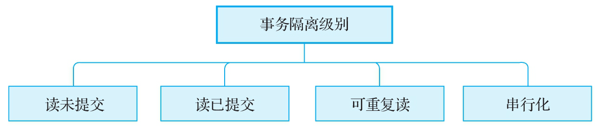{width="6.427890419947507in"
height="1.3700470253718284in"}

> 图1-4　事务隔离级别
>
> 可以在命令行用\--transaction-isolation选项或在
> MySQL的配置文件my.cnf、my.ini里，为所有连接设置默 认的事务隔离级别。
>
> 例如，可以在my.cnf或者my.ini文件中的mysqld节点 下面配置如下选项。
>
> transaction-isolation = {READ-UNCOMMITTED \| READ-COMMITTED \|
> REPEATABLE-READ \| SERIALIZABLE}
>
> 也可以使用SET TRANSACTION命令改变单个或者所有
> 新连接的事务隔离级别，基本语法如下所示。
>
> 57
>
> SET \[SESSION \| GLOBAL\] TRANSACTION ISOLATION LEVEL {READ
> UNCOMMITTED \| READ COMMITTED \| REPEATABLE READ \| SERIALIZABLE}
>
> 如果使用SET TRANSACTION命令来设置事务隔离级 别，需要注意以下几点。
>
> 1）不带SESSION或GLOBAL关键字设置事务隔离级别，
> 指的是为下一个（还未开始的）事务设置隔离级别。
>
> 2）使用GLOBAL关键字指的是对全局设置事务隔离级
> 别，也就是设置后的事务隔离级别对所有新产生的数据库
>
> 连接生效。
>
> 3）使用SESSION关键字指的是对当前的数据库连接设
> 置事务隔离级别，此时的事务隔离级别只对当前连接的后 续事务生效。
>
> 4）任何客户端都能自由改变当前会话的事务隔离级
> 别，可以在事务中间改变，也可以改变下一个事务的隔离
>
> 级别。
>
> 使用如下命令可以查询全局级别和会话级别的事务隔 离级别。
>
> SELECT @@global.tx_isolation; SELECT @@session.tx_isolation; SELECT
> @@tx_isolation;
>
> 58
>
> 1.4.3　MySQL中各种事务隔离级别的区别
>
> 4种事务隔离级别对于并发事务带来的问题的解决程
> 度不一样，具体如表1-1所示。
>
> 表1-1　不同事务隔离级别对问题的解决程度对比

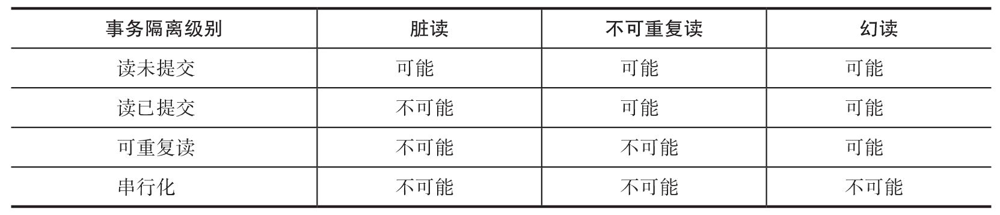{width="6.427890419947507in"
height="1.3803477690288715in"}

> 1）读未提交允许脏读，即在读未提交的事务隔离级
> 别下，可能读取到其他会话未提交事务修改的数据。这种
>
> 事务隔离级别下存在脏读、不可重复读和幻读的问题。
>
> 2）读已提交只能读取到已经提交的数据。Oracle等
> 数据库使用的默认事务隔离级别就是读已提交。这种事务
>
> 隔离级别存在不可重复读和幻读的问题。
>
> 3）可重复读就是在同一个事务内，无论何时查询到
> 的数据都与开始查询到的数据一致，这是MySQL中InnoDB
> 存储引擎默认的事务隔离级别。这种事务隔离级别下存在
>
> 幻读的问题。
>
> 4）串行化是指完全串行地读，每次读取数据库中的
> 数据时，都需要获得表级别的共享锁，读和写都会阻塞。
>
> 这种事务隔离级别解决了并发事务带来的问题，但完全的
>
> 59
>
> 串行化操作使得数据库失去了并发特性，所以这种隔离级
> 别往往在互联网行业中不太常用。
>
> 接下来，为了让大家更好地理解MySQL的事务隔离级 别，列举几个实际案例。
>
> 60
>
> 1.4.4　MySQL事务隔离级别最佳实践
>
> 在MySQL中创建一个test数据库，在test数据库中创
> 建一个account数据表作为测试使用的账户数据表，如下 所示。
>
> mysql\> create database test;
>
> Query OK, 1 row affected (0.02 sec)
>
> mysql\> use test; Database changed mysql\>
>
> mysql\> create table account(
>
> -\> id int not null auto_increment,
>
> -\> name varchar(30) not null default \'\',
>
> -\> balance int not null default 0,
>
> -\> primary key(id)
>
> -\> ) engine=InnoDB default charset=utf8mb4;
>
> Query OK, 0 rows affected (0.02 sec)
>
> 创建完数据库和数据表之后，向account数据表中插
> 入几条测试数据，如下所示。
>
> mysql\> insert into
>
> -\> test.account(name, balance)
>
> -\> values
>
> -\> (\'
>
> -\> (\'
>
> -\> (\'

张三\', 300),

李四\', 350),

王五\', 500);

> Query OK, 3 rows affected (0.03 sec)
>
> Records: 3 Duplicates: 0 Warnings: 0
>
> 此时，account数据表中有张三、李四和王五的账户
> 信息，账户余额分别为300元、350元和500元。
>
> 61
>
> 准备工作完成了，接下来，我们一起来看MySQL中每
> 种事务隔离级别下数据的处理情况。
>
> 1.读未提交
>
> 第一步：打开服务器终端A，登录MySQL，将当前终
> 端的事务隔离级别设置为read uncommitted，也就是读 未提交，如下所示。
>
> mysql\> set session transaction isolation level read uncommitted;
> Query OK, 0 rows affected (0.01 sec)
>
> 在终端A开启事务并查询account数据表中的数据， 如下所示。
>
> mysql\> start transaction;
>
> Query OK, 0 rows affected (0.00 sec)
>
> mysql\> select \* from account;\
> +\-\-\--+\-\-\-\-\-\-\--+\-\-\-\-\-\-\-\--+
>
> \| id \| name \| balance \|\
> +\-\-\--+\-\-\-\-\-\-\--+\-\-\-\-\-\-\-\--+
>
> \|
>
> \|
>
> \|

1 \|

2 \|

3 \|

张三

李四

王五

\|

\|

\|

300 \|

350 \|

500 \|

> +\-\-\--+\-\-\-\-\-\-\--+\-\-\-\-\-\-\-\--+
>
> 3 rows in set (0.00 sec)
>
> 此时，可以看到数据表中张三、李四和王五的账户
> 余额分别为300元、350元和500元。
>
> 第二步：在终端A的事务提交之前，打开服务器的另
> 一个终端B，连接MySQL，将当前事务模式设置为read
>
> 62
>
> uncommitted并更新account表的数据，将张三的账户余 额加100元。
>
> mysql\> set session transaction isolation level read uncommitted;
> Query OK, 0 rows affected (0.00 sec)
>
> mysql\> start transaction;
>
> Query OK, 0 rows affected (0.00 sec)
>
> mysql\> update account set balance = balance + 100 where id = 1; Query
> OK, 1 row affected (0.00 sec)
>
> Rows matched: 1 Changed: 1 Warnings: 0
>
> 在终端B查询account数据表中的数据，如下所示。
>
> mysql\> select \* from account;\
> +\-\-\--+\-\-\-\-\-\-\--+\-\-\-\-\-\-\-\--+
>
> \| id \| name \| balance \|\
> +\-\-\--+\-\-\-\-\-\-\--+\-\-\-\-\-\-\-\--+
>
> \|
>
> \|
>
> \|

1 \|

2 \|

3 \|

张三

李四

王五

\|

\|

\|

400 \|

350 \|

500 \|

> +\-\-\--+\-\-\-\-\-\-\--+\-\-\-\-\-\-\-\--+
>
> 3 rows in set (0.00 sec)
>
> 可以看到，在终端B中，当前事务未提交时，张三的
> 账户余额变为更新后的值，即400元。
>
> 第三步：在终端A查看account数据表的数据，如下 所示。
>
> mysql\> select \* from account;\
> +\-\-\--+\-\-\-\-\-\-\--+\-\-\-\-\-\-\-\--+
>
> \| id \| name \| balance \|\
> +\-\-\--+\-\-\-\-\-\-\--+\-\-\-\-\-\-\-\--+
>
> \|
>
> \|

1 \|

2 \|

张三

李四

\|

\|

400 \|

350 \|

> 63
>
> \| 3 \| 王五 \| 500 \|\
> +\-\-\--+\-\-\-\-\-\-\--+\-\-\-\-\-\-\-\--+
>
> 3 rows in set (0.00 sec)
>
> 可以看到，虽然终端B的事务并未提交，但是终端A
> 可以查询到终端B已经更新的数据。
>
> 第四步：如果终端B的事务由于某种原因执行了回滚
> 操作，那么终端B中执行的所有操作都会被撤销。也就是
> 说，终端A查询到的数据其实就是脏数据。
>
> 在终端B执行事务回滚操作，并查询account数据表 中的数据，如下所示。
>
> mysql\> rollback;
>
> Query OK, 0 rows affected (0.00 sec)
>
> mysql\> select \* from account;\
> +\-\-\--+\-\-\-\-\-\-\--+\-\-\-\-\-\-\-\--+
>
> \| id \| name \| balance \|\
> +\-\-\--+\-\-\-\-\-\-\--+\-\-\-\-\-\-\-\--+
>
> \|
>
> \|
>
> \|

1 \|

2 \|

3 \|

张三

李四

王五

\|

\|

\|

300 \|

350 \|

500 \|

> +\-\-\--+\-\-\-\-\-\-\--+\-\-\-\-\-\-\-\--+
>
> 3 rows in set (0.00 sec)
>
> 可以看到，在终端B执行了事务的回滚操作后，张三
> 的账户余额重新变为300元。
>
> 第五步：在终端A将张三的账户余额减100元，再次
> 查询account数据表的数据，可以发现张三的账户余额变
>
> 为200元，而不是300元，如下所示。
>
> 64
>
> mysql\> update account set balance = balance - 100 where id = 1; Query
> OK, 1 row affected (0.00 sec)
>
> Rows matched: 1 Changed: 1 Warnings: 0
>
> mysql\> select \* from account;\
> +\-\-\--+\-\-\-\-\-\-\--+\-\-\-\-\-\-\-\--+
>
> \| id \| name \| balance \|\
> +\-\-\--+\-\-\-\-\-\-\--+\-\-\-\-\-\-\-\--+
>
> \|
>
> \|
>
> \|

1 \|

2 \|

3 \|

张三

李四

王五

\|

\|

\|

200 \|

350 \|

500 \|

> +\-\-\--+\-\-\-\-\-\-\--+\-\-\-\-\-\-\-\--+
>
> 3 rows in set (0.00 sec)
>
> 执行第三步时读取到张三的账户余额为400元，然后
> 将张三的账户余额减100元，因为在应用程序中并不知道
> 其他会话回滚了事务，所以更新张三的账户余额就变为
>
> 300元了，这就是脏读的问题。可以采用读已提交的事务
> 隔离级别解决这个问题。
>
> 2.读已提交
>
> 第一步：打开一个终端A，将当前终端的事务隔离级 别设置为read
> committed，也就是读已提交，如下所 示。
>
> mysql\> set session transaction isolation level read committed; Query
> OK, 0 rows affected (0.00 sec)
>
> 在终端A开启事务并查询account数据表中的数据， 如下所示。
>
> mysql\> start transaction;
>
> Query OK, 0 rows affected (0.00 sec)
>
> 65
>
> mysql\> select\* from account;\
> +\-\-\--+\-\-\-\-\-\-\--+\-\-\-\-\-\-\-\--+
>
> \| id \| name \| balance \|\
> +\-\-\--+\-\-\-\-\-\-\--+\-\-\-\-\-\-\-\--+
>
> \|
>
> \|
>
> \|

1 \|

2 \|

3 \|

张三

李四

王五

\|

\|

\|

300 \|

350 \|

500 \|

> +\-\-\--+\-\-\-\-\-\-\--+\-\-\-\-\-\-\-\--+
>
> 3 rows in set (0.00 sec)
>
> 可以看到，张三、李四和王五的账户余额分别为300 元、350元和500元。
>
> 第二步：在终端A的事务提交之前，打开终端B，将
> 当前终端的事务隔离级别设置为read committed，开启
> 事务并更新account数据表中的数据，将张三的账户余额
>
> 增加100元，如下所示。
>
> mysql\> set session transaction isolation level read committed; Query
> OK, 0 rows affected (0.00 sec)
>
> mysql\> start transaction;
>
> Query OK, 0 rows affected (0.00 sec)
>
> mysql\> update account set balance = balance + 100 where id = 1; Query
> OK, 1 row affected (0.00 sec)
>
> Rows matched: 1 Changed: 1 Warnings: 0
>
> 在终端B查询account数据表中的数据，如下所示。
>
> mysql\> select \* from account;\
> +\-\-\--+\-\-\-\-\-\-\--+\-\-\-\-\-\-\-\--+
>
> \| id \| name \| balance \|\
> +\-\-\--+\-\-\-\-\-\-\--+\-\-\-\-\-\-\-\--+
>
> \|
>
> \|
>
> \|

1 \|

2 \|

3 \|

张三

李四

王五

\|

\|

\|

400 \|

350 \|

500 \|

> +\-\-\--+\-\-\-\-\-\-\--+\-\-\-\-\-\-\-\--+
>
> 3 rows in set (0.00 sec)
>
> 66
>
> 可以看到，在终端B的查询结果中，张三的账户余额
> 已经由原来的300元变成400元。
>
> 第三步：在终端B的事务提交之前，在终端A中查询
> account数据表中的数据，如下所示。
>
> mysql\> select\* from account;\
> +\-\-\--+\-\-\-\-\-\-\--+\-\-\-\-\-\-\-\--+
>
> \| id \| name \| balance \|\
> +\-\-\--+\-\-\-\-\-\-\--+\-\-\-\-\-\-\-\--+
>
> \|
>
> \|
>
> \|

1 \|

2 \|

3 \|

张三

李四

王五

\|

\|

\|

300 \|

350 \|

500 \|

> +\-\-\--+\-\-\-\-\-\-\--+\-\-\-\-\-\-\-\--+
>
> 3 rows in set (0.00 sec)
>
> 可以看到，在终端A查询出来的张三的账户余额仍为
> 300元，说明此时已经解决了脏读的问题。
>
> 第四步：在终端B提交事务，如下所示。
>
> mysql\> commit;
>
> Query OK, 0 rows affected (0.00 sec)
>
> 第五步：在终端B提交事务后，在终端A再次查询
> account数据表中的数据，如下所示。
>
> mysql\> select\* from account;\
> +\-\-\--+\-\-\-\-\-\-\--+\-\-\-\-\-\-\-\--+
>
> \| id \| name \| balance \|\
> +\-\-\--+\-\-\-\-\-\-\--+\-\-\-\-\-\-\-\--+
>
> \|
>
> \|
>
> \|

1 \|

2 \|

3 \|

张三

李四

王五

\|

\|

\|

400 \|

350 \|

500 \|

> 67
>
> +\-\-\--+\-\-\-\-\-\-\--+\-\-\-\-\-\-\-\--+
>
> 3 rows in set (0.01 sec)
>
> 可以看到，终端A在终端B的事务提交前和提交后读
> 取到的account数据表中的数据不一致，产生了不可重复
>
> 读的问题。要想解决这个问题，就需要使用可重复读的 事务隔离级别。
>
> 3.可重复读
>
> 第一步：打开终端A，登录MySQL，将当前终端的事
> 务隔离级别设置为repeatable read，也就是可重复读。
>
> 开启事务并查询account数据表中的数据，如下所示。
>
> mysql\> set session transaction isolation level repeatable read; Query
> OK, 0 rows affected (0.00 sec)
>
> mysql\> start transaction;
>
> Query OK, 0 rows affected (0.00 sec)
>
> mysql\> select \* from account;\
> +\-\-\--+\-\-\-\-\-\-\--+\-\-\-\-\-\-\-\--+
>
> \| id \| name \| balance \|\
> +\-\-\--+\-\-\-\-\-\-\--+\-\-\-\-\-\-\-\--+
>
> \|
>
> \|
>
> \|

1 \|

2 \|

3 \|

张三

李四

王五

\|

\|

\|

300 \|

350 \|

500 \|

> +\-\-\--+\-\-\-\-\-\-\--+\-\-\-\-\-\-\-\--+
>
> 3 rows in set (0.00 sec)
>
> 可以看到，此时张三、李四、王五的账户余额分别 为300元、350元、500元。
>
> 第二步：在终端A的事务提交之前，打开终端B，登
> 录MySQL，将当前终端的事务隔离级别设置为可重复读。
>
> 68
>
> 开启事务，将张三的账户余额增加100元，随后提交事 务，如下所示。
>
> mysql\> set session transaction isolation level repeatable read; Query
> OK, 0 rows affected (0.00 sec)
>
> mysql\> start transaction;
>
> Query OK, 0 rows affected (0.00 sec)
>
> mysql\> update account set balance = balance + 100 where id = 1; Query
> OK, 1 row affected (0.01 sec)
>
> Rows matched: 1 Changed: 1 Warnings: 0
>
> mysql\> commit;
>
> Query OK, 0 rows affected (0.00 sec)
>
> 接下来，在终端B查询account数据表中的数据，如 下所示。
>
> mysql\> select \* from account;\
> +\-\-\--+\-\-\-\-\-\-\--+\-\-\-\-\-\-\-\--+
>
> \| id \| name \| balance \|\
> +\-\-\--+\-\-\-\-\-\-\--+\-\-\-\-\-\-\-\--+
>
> \|
>
> \|
>
> \|

1 \|

2 \|

3 \|

张三

李四

王五

\|

\|

\|

400 \|

350 \|

500 \|

> +\-\-\--+\-\-\-\-\-\-\--+\-\-\-\-\-\-\-\--+
>
> 3 rows in set (0.00 sec)
>
> 可以看到，在终端B查询的结果中，张三的账户余额
> 已经由原来的300元变成400元。
>
> 第三步：在终端A查询account数据表中的数据，如 下所示。
>
> 69
>
> mysql\> select \* from account;\
> +\-\-\--+\-\-\-\-\-\-\--+\-\-\-\-\-\-\-\--+
>
> \| id \| name \| balance \|\
> +\-\-\--+\-\-\-\-\-\-\--+\-\-\-\-\-\-\-\--+
>
> \|
>
> \|
>
> \|

1 \|

2 \|

3 \|

张三

李四

王五

\|

\|

\|

300 \|

350 \|

500 \|

> +\-\-\--+\-\-\-\-\-\-\--+\-\-\-\-\-\-\-\--+
>
> 3 rows in set (0.00 sec)
>
> 可以看到，在终端A查询的结果中，张三的账户余额
> 仍为300元，并没有出现不可重复读的问题，说明可重复
> 读的事务隔离级别解决了不可重复读的问题。
>
> 第四步：在终端A为张三的账户增加100元，如下所
>
> 示。
>
> mysql\> update account set balance = balance + 100 where id = 1; Query
> OK, 1 row affected (0.00 sec)
>
> Rows matched: 1 Changed: 1 Warnings: 0
>
> 接下来，在终端A查询account数据表中的数据，如 下所示。
>
> mysql\> select \* from account;\
> +\-\-\--+\-\-\-\-\-\-\--+\-\-\-\-\-\-\-\--+
>
> \| id \| name \| balance \|\
> +\-\-\--+\-\-\-\-\-\-\--+\-\-\-\-\-\-\-\--+
>
> \|
>
> \|
>
> \|

1 \|

2 \|

3 \|

张三

李四

王五

\|

\|

\|

500 \|

350 \|

500 \|

> +\-\-\--+\-\-\-\-\-\-\--+\-\-\-\-\-\-\-\--+
>
> 3 rows in set (0.00 sec)
>
> 可以看到，此时张三的账户余额变成500元，而不是
> 400元，数据的一致性没有遭到破坏。这是因为在终端A
>
> 70
>
> 为张三的账户余额增加100元之前，终端B已经为张三的
> 账户余额增加了100元，共计增加了200元，所以最终张 三的账户余额是500元。
>
> 可重复读的隔离级别使用了MVCC（Multi-Version Concurrency
> Control，多版本并发控制）机制，数据库
>
> 中的查询（select）操作不会更新版本号，是快照读，
> 而操作数据表中的数据（insert、update、delete）则
> 会更新版本号，是当前读。
>
> 第五步：在终端B开启事务，插入一条数据后提交事 务，如下所示。
>
> mysql\> start transaction;
>
> Query OK, 0 rows affected (0.00 sec)
>
> mysql\> insert into account(name, balance) valu
>
> Query OK, 1 row affected (0.00 sec)
>
> mysql\> commit;
>
> Query OK, 0 rows affected (0.01 sec)

es(\'赵六\', 100);

> 在终端B查询account数据表中的数据，如下所示。
>
> mysql\> select \* from account;\
> +\-\-\--+\-\-\-\-\-\-\--+\-\-\-\-\-\-\-\--+
>
> \| id \| name \| balance \|\
> +\-\-\--+\-\-\-\-\-\-\--+\-\-\-\-\-\-\-\--+
>
> \|
>
> \|
>
> \|
>
> \|

1 \|

2 \|

3 \|

4 \|

张三

李四

王五

赵六

\|

\|

\|

\|

400 \|

350 \|

500 \|

100 \|

> +\-\-\--+\-\-\-\-\-\-\--+\-\-\-\-\-\-\-\--+
>
> 4 rows in set (0.00 sec)
>
> 71
>
> 可以看到，在终端B查询的结果中，已经显示出新插 入的赵六的账户信息了。
>
> 第六步：在终端A查询account数据表的数据，如下 所示。
>
> mysql\> select \* from account;\
> +\-\-\--+\-\-\-\-\-\-\--+\-\-\-\-\-\-\-\--+
>
> \| id \| name \| balance \|\
> +\-\-\--+\-\-\-\-\-\-\--+\-\-\-\-\-\-\-\--+
>
> \|
>
> \|
>
> \|

1 \|

2 \|

3 \|

张三

李四

王五

\|

\|

\|

500 \|

350 \|

500 \|

> +\-\-\--+\-\-\-\-\-\-\--+\-\-\-\-\-\-\-\--+
>
> 3 rows in set (0.00 sec)
>
> 可以看到，在终端A查询的数据中，并没有赵六的账
> 户信息，说明没有出现幻读。
>
> 第七步：在终端A为赵六的账户增加100元，如下所
>
> 示。
>
> mysql\> update account set balance = balance + 100 where id = 4; Query
> OK, 1 row affected (0.00 sec)
>
> Rows matched: 1 Changed: 1 Warnings: 0
>
> SQL语句执行成功。接下来，在终端A查询account数 据表中的数据，如下所示。
>
> mysql\> select \* from account;\
> +\-\-\--+\-\-\-\-\-\-\--+\-\-\-\-\-\-\-\--+
>
> \| id \| name \| balance \|\
> +\-\-\--+\-\-\-\-\-\-\--+\-\-\-\-\-\-\-\--+
>
> \|
>
> \|

1 \|

2 \|

张三

李四

\|

\|

500 \|

350 \|

> 72
>
> \| 3 \| 王五 \| 500 \|\
> \| 4 \| 赵六 \| 200 \|\
> +\-\-\--+\-\-\-\-\-\-\--+\-\-\-\-\-\-\-\--+
>
> 4 rows in set (0.00 sec)
>
> 可以看到，在终端A执行完数据更新操作后，查询到
> 赵六的账户信息，出现了幻读的问题。如何解决该问题
> 呢？答案是使用可串行化的事务隔离级别或者间隙锁和 临键锁。
>
> 4.串行化
>
> 第一步：打开终端A，登录MySQL，将当前终端的事
> 务隔离级别设置为serializable，开启事务，然后查询
> account数据表中id为1的数据，如下所示。
>
> mysql\> set session transaction isolation level serializable; Query
> OK, 0 rows affected (0.00 sec)
>
> mysql\> start transaction;
>
> Query OK, 0 rows affected (0.00 sec)
>
> mysql\> select \* from account where id = 1;\
> +\-\-\--+\-\-\-\-\-\-\--+\-\-\-\-\-\-\-\--+
>
> \| id \| name \| balance \|\
> +\-\-\--+\-\-\-\-\-\-\--+\-\-\-\-\-\-\-\--+
>
> \| 1 \| 张三 \| 300 \|\
> +\-\-\--+\-\-\-\-\-\-\--+\-\-\-\-\-\-\-\--+
>
> 1 row in set (0.00 sec)
>
> 可以看到，张三、李四和王五的账户余额分别为300 元、350元和500元。
>
> 第二步：打开终端B，登录MySQL，将当前终端的事
> 务隔离级别设置为serializable，开启事务，修改
>
> 73
>
> account数据表中id为1的数据，如下所示。
>
> mysql\> set session transaction isolation level serializable; Query
> OK, 0 rows affected (0.00 sec)
>
> mysql\> start transaction;
>
> Query OK, 0 rows affected (0.00 sec)
>
> mysql\> update account set balance = balance + 100 where id = 1; ERROR
> 1205 (HY000): Lock wait timeout exceeded; try restarting transaction
>
> mysql\>
>
> 可以看到，在终端B中对account数据表中id为1的数
> 据执行更新操作时，会发生阻塞，锁超时后会抛出 "ERROR 1205(HY000):Lock
> wait timeout\
> exceeded:try restarting transaction"错误，避免了 幻读。
>
> 另外，在可重复的事务隔离级别下，如果终端A执行
> 的是一个范围查询，那么该范围内的所有行（包括每行
> 记录所在的间隙区间范围，如果某行记录还未被插入数
> 据，这行记录也会被加锁，这是一种间隙锁，后文会详
> 细讲解）都会被加锁。此时终端B在此范围内插入数据，
> 就会被阻塞，从而避免了幻读。
>
> 本节使用start transaction命令来开启事务，也可
> 以使用begin命令来开启事务。
>
> 终端A是一个范围查询的串行化示例，大家可自行验 证，笔者不再赘述。
>
> 74
>
> 1.4.5　MySQL中锁的分类
>
> 从本质上讲，锁是一种协调多个进程或多个线程对某一资源的访问的
> 机制，MySQL使用锁和MVCC机制实现了事务隔离级别。接下来简单介绍
> MySQL中锁的分类。
>
> MySQL中的锁可以从以下几个方面进行分类，如图1-5所示。

{width="4.952380796150481in"
height="1.3650787401574802in"}

> 图1-5　锁的分类
>
> 1）从性能上看，MySQL中的锁可以分为悲观锁和乐观锁，这里的乐观
> 锁是通过版本对比来实现的。
>
> 2）从对数据库的操作类型上看，MySQL中的锁可以分为读锁和写锁，
> 这里的读锁和写锁都是悲观锁。
>
> 3）从操作数据的粒度上看，MySQL中的锁可以分为表锁、行锁和页面
>
> 锁。
>
> 4）从更细粒度上看，MySQL中的锁可以分为间隙锁和临键锁。
>
> 下面分别对这些锁的分类进行详细的介绍。
>
> 1.悲观锁和乐观锁
>
> （1）悲观锁
>
> 顾名思义，悲观锁对于数据库中数据的读写持悲观态度，即在整个数
> 据处理的过程中，它会将相应的数据锁定。在数据库中，悲观锁的实现需
> 要依赖数据库提供的锁机制，以保证对数据库加锁后，其他应用系统无法
> 修改数据库中的数据。
>
> 75
>
> 在悲观锁机制下，读取数据库中的数据时需要加锁，此时不能对这些
> 数据进行修改操作。修改数据库中的数据时也需要加锁，此时不能对这些
> 数据进行读取操作。
>
> （2）乐观锁
>
> 悲观锁会极大地降低数据库的性能，特别是对长事务而言，性能的损
> 耗往往是无法承受的。乐观锁则在一定程度上解决了这个问题。
>
> 顾名思义，乐观锁对于数据库中数据的读写持乐观态度，即在整个数
> 据处理的过程中，大多数情况下它是通过数据版本记录机制实现的。
>
> 实现乐观锁的一种常用做法是为数据增加一个版本标识，如果是通过
> 数据库实现，往往会在数据表中增加一个类似version的版本号字段。在查
>
> 询数据表中的数据时，会将版本号字段的值一起读取出来，当更新数据
> 时，会令版本号字段的值加1。将提交数据的版本与数据表对应记录的版本
> 进行对比，如果提交的数据版本号大于数据表中当前要修改的数据的版本
> 号，则对数据进行修改操作。否则，不修改数据表中的数据。
>
> 2.读锁和写锁
>
> （1）读锁
>
> 读锁又称为共享锁或S锁（Shared Lock），针对同一份数据，可以加
> 多个读锁而互不影响。
>
> （2）写锁
>
> 写锁又称为排他锁或X锁（Exclusive Lock），如果当前写锁未释放，
> 它会阻塞其他的写锁和读锁。
>
> 需要注意的是，对同一份数据，如果加了读锁，则可以继续为其加读
> 锁，且多个读锁之间互不影响，但此时不能为数据增加写锁。一旦加了写
> 锁，则不能再增加写锁和读锁。因为读锁具有共享性，而写锁具有排他
>
> 性。
>
> 3.表锁、行锁和页面锁
>
> （1）表锁
>
> 76
>
> 表锁也称为表级锁，就是在整个数据表上对数据进行加锁和释放锁。
> 典型特点是开销比较小，加锁速度快，一般不会出现死锁，锁定的粒度比
> 较大，发生锁冲突的概率最高，并发度最低。
>
> 在MySQL中，有两种表级锁模式：一种是表共享锁（Table Shard
> Lock）；另一种是表独占写锁（Table Write Lock）。
>
> 当一个线程获取到一个表的读锁后，其他线程仍然可以对表进行读操
> 作，但是不能对表进行写操作。当一个线程获取到一个表的写锁后，只有
> 持有锁的线程可以对表进行更新操作，其他线程对数据表的读写操作都会
> 被阻塞，直到写锁被释放为止。
>
> 可以在MySQL的命令行通过如下命令手动增加表锁。
>
> lock table 表名称 read(write),表名称2 read(write);
>
> 例如，为account数据表增加表级读锁，如下所示。
>
> mysql\> lock table account read;
>
> Query OK, 0 rows affected (0.00 sec)
>
> 为account数据表增加表级写锁，如下所示。
>
> mysql\> lock table account write; Query OK, 0 rows affected (0.00 sec)
>
> 使用如下命令可以查看数据表上增加的锁。
>
> show open tables;
>
> 例如，查看account数据表上增加的锁，如下所示。
>
> mysql\> show open tables;\
> +\-\-\-\-\-\-\-\-\-\-\-\-\-\-\-\-\-\-\--+\-\-\-\-\-\-\-\-\-\-\-\-\-\-\-\-\-\-\-\-\-\-\-\-\-\--+\-\-\-\-\-\-\--+\-\-\-\-\-\-\-\-\-\-\-\--+
>
> \| Database \| Table \| In_use \| Name_locked \|\
> +\-\-\-\-\-\-\-\-\-\-\-\-\-\-\-\-\-\-\--+\-\-\-\-\-\-\-\-\-\-\-\-\-\-\-\-\-\-\-\-\-\-\-\-\-\--+\-\-\-\-\-\-\--+\-\-\-\-\-\-\-\-\-\-\-\--+
>
> \| test \| account \| 1 \| 0 \|\
> ##########################省略其他信息################
>
> +\-\-\-\-\-\-\-\-\-\-\-\-\-\-\-\-\-\-\--+\-\-\-\-\-\-\-\-\-\-\-\-\-\-\-\-\-\-\-\-\-\-\-\-\-\--+\-\-\-\-\-\-\--+\-\-\-\-\-\-\-\-\-\-\-\--+
>
> 50 rows in set (0.00 sec)
>
> 77
>
> 使用如下命令可以删除表锁。
>
> unlock tables;
>
> 例如，删除account数据表中手动添加的表锁，如下所示。
>
> mysql\> unlock tables;
>
> Query OK, 0 rows affected (0.00 sec)
>
> （2）行锁
>
> 行锁也称为行级锁，就是在数据行上对数据进行加锁和释放锁。典型
> 特点是开销比较大，加锁速度慢，可能会出现死锁，锁定的粒度最小，发
> 生锁冲突的概率最小，并发度最高。
>
> 在InnoDB存储引擎中，有两种类型的行锁：一种是共享锁，另一种是
> 排他锁。共享锁允许一个事务读取一行数据，但不允许一个事务对加了共
> 享锁的当前行增加排他锁。排他锁只允许当前事务对数据行进行增删改查
> 操作，不允许其他事务对增加了排他锁的数据行增加共享锁和排他锁。
>
> 使用行锁时，需要注意以下几点。
>
> 1）行锁主要加在索引上，如果对非索引的字段设置条件进行更新，行
> 锁可能会变成表锁。
>
> 2）InnoDB的行锁是针对索引加锁，不是针对记录加锁，并且加锁的索
> 引不能失效，否则行锁可能会变成表锁。
>
> 3）锁定某一行时，可以使用lock in share mode命令来指定共享锁， 使用for
> update命令来指定排他锁，例如下面的SQL语句。
>
> select \* from account where id = 1 for update;
>
> （3）页面锁
>
> 页面锁也称为页级锁，就是在页面级别对数据进行加锁和释放锁。对
> 数据的加锁开销介于表锁和行锁之间，可能会出现死锁，锁定的粒度大小
> 介于表锁和行锁之间，并发度一般。
>
> 78
>
> 接下来，我们总结一下表锁、行锁和页面锁的特点，如表1-2所示。
>
> 表1-2　表锁、行锁和页面锁的特点

{width="4.952379702537183in"
height="0.7460312773403325in"}

> 4.间隙锁和临键锁
>
> （1）间隙锁
>
> 在MySQL中使用范围查询时，如果请求共享锁或排他锁，InnoDB会给符
> 合条件的已有数据的索引项加锁。如果键值在条件范围内，而这个范围内
> 并不存在记录，则认为此时出现了"间隙（也就是GAP）"。InnoDB存储引
> 擎会对这个"间隙"加锁，而这种加锁机制就是间隙锁（GAP Lock）。
>
> 说得简单点，间隙锁就是对两个值之间的间隙加锁。MySQL的默认隔离
> 级别是可重复读，在可重复读隔离级别下会存在幻读的问题，而间隙锁在
> 某种程度下可以解决幻读的问题。
>
> 例如，account数据表中存在如下数据。
>
> mysql\> select \* from account;
>
> +\-\-\--+\-\-\-\-\-\-\--+\-\-\-\-\-\-\-\--+
>
> \| id \| name \| balance \|\
> +\-\-\--+\-\-\-\-\-\-\--+\-\-\-\-\-\-\-\--+
>
> \|
>
> \|
>
> \|

1 \|

2 \|

3 \|

张三

李四

王五

\|

\|

\|

300 \|

350 \|

500 \|

> \| 15 \|
>
> \| 20 \|

赵六

田七

\|

\|

100 \|

360 \|

> +\-\-\--+\-\-\-\-\-\-\--+\-\-\-\-\-\-\-\--+
>
> 5 rows in set (0.00 sec)
>
> 此时，account数据表中的间隙包括id为(3,15\]、(15,20\]、(20，正无
> 穷\]的三个区间。
>
> 如果执行如下命令，将符合条件的用户的账户余额增加100元。
>
> update account set balance = balance + 100 where id \> 5 and id \<16;
>
> 则其他事务无法在(3,20\]这个区间内插入或者修改任何数据。
>
> 79
>
> 这里需要注意的是，间隙锁只有在可重复读事务隔离级别下才会生
>
> 效。
>
> （2）临键锁
>
> 临键锁（Next-Key Lock）是行锁和间隙锁的组合，例如上面例子中的
> 区间(3,20\]就可以称为临键锁。
>
> 80
>
> 1.4.6　死锁的产生和预防
>
> 虽然锁在一定程度上能够解决并发问题，但稍有不
> 慎，就可能造成死锁。发生死锁的必要条件有4个，分别
>
> 为互斥条件、不可剥夺条件、请求与保持条件和循环等待 条件，如图1-6所示。

{width="6.427890419947507in"
height="1.3391437007874016in"}

> 图1-6　死锁的必要条件
>
> （1）互斥条件
>
> 在一段时间内，计算机中的某个资源只能被一个进程
> 占用。此时，如果其他进程请求该资源，则只能等待。
>
> （2）不可剥夺条件
>
> 某个进程获得的资源在使用完毕之前，不能被其他进
> 程强行夺走，只能由获得资源的进程主动释放。
>
> （3）请求与保持条件
>
> 进程已经获得了至少一个资源，又要请求其他资源，
> 但请求的资源已经被其他进程占有，此时请求的进程就会
> 被阻塞，并且不会释放自己已获得的资源。
>
> 81
>
> （4）循环等待条件
>
> 系统中的进程之间相互等待，同时各自占用的资源又
> 会被下一个进程所请求。例如有进程A、进程B和进程C三
> 个进程，进程A请求的资源被进程B占用，进程B请求的资
> 源被进程C占用，进程C请求的资源被进程A占用，于是形
> 成了循环等待条件，如图1-7所示。

{width="5.974642388451444in"
height="3.8114096675415574in"}

> 图1-7　死锁的循环等待条件
>
> 需要注意的是，只有4个必要条件都满足时，才会发 生死锁。
>
> 处理死锁有4种方法，分别为预防死锁、避免死锁、
> 检测死锁和解除死锁，如图1-8所示。
>
> 82

{width="6.427890419947507in"
height="1.3597451881014873in"}

> 图1-8　处理死锁的方法
>
> 1）预防死锁：处理死锁最直接的方法就是破坏造成
> 死锁的4个必要条件中的一个或多个，以防止死锁的发 生。
>
> 2）避免死锁：在系统资源的分配过程中，使用某种
> 策略或者方法防止系统进入不安全状态，从而避免死锁的
>
> 发生。
>
> 3）检测死锁：这种方法允许系统在运行过程中发生
> 死锁，但是能够检测死锁的发生，并采取适当的措施清除
>
> 死锁。
>
> 4）解除死锁：当检测出死锁后，采用适当的策略和
> 方法将进程从死锁状态解脱出来。
>
> 在实际工作中，通常采用有序资源分配法和银行家算
> 法这两种方式来避免死锁，大家可自行了解。
>
> 83
>
> 1.4.7　MySQL中的死锁问题
>
> 在MySQL 5.5.5及以上版本中，MySQL的默认存储引
> 擎是InnoDB。该存储引擎使用的是行级锁，在某种情况
> 下会产生死锁问题，所以InnoDB存储引擎采用了一种叫 作等待图（wait-for
> graph）的方法来自动检测死锁， 如果发现死锁，就会自动回滚一个事务。
>
> 接下来，我们看一个MySQL中的死锁案例。
>
> 第一步：打开终端A，登录MySQL，将事务隔离级别
> 设置为可重复读，开启事务后为account数据表中id为1
> 的数据添加排他锁，如下所示。
>
> mysql\> set session transaction isolation level repeatable read; Query
> OK, 0 rows affected (0.00 sec)
>
> mysql\> start transaction;
>
> Query OK, 0 rows affected (0.00 sec)
>
> mysql\> select \* from account where id =1 for update;\
> +\-\-\--+\-\-\-\-\-\-\--+\-\-\-\-\-\-\-\--+
>
> \| id \| name \| balance \|\
> +\-\-\--+\-\-\-\-\-\-\--+\-\-\-\-\-\-\-\--+
>
> \| 1 \| 张三 \| 300 \|\
> +\-\-\--+\-\-\-\-\-\-\--+\-\-\-\-\-\-\-\--+
>
> 1 row in set (0.00 sec)
>
> 第二步：打开终端B，登录MySQL，将事务隔离级别
> 设置为可重复读，开启事务后为account数据表中id为2
> 的数据添加排他锁，如下所示。
>
> 84
>
> mysql\> set session transaction isolation level repeatable read; Query
> OK, 0 rows affected (0.00 sec)
>
> mysql\> start transaction;
>
> Query OK, 0 rows affected (0.00 sec)
>
> mysql\> select \* from account where id =2 for update;\
> +\-\-\--+\-\-\-\-\-\-\--+\-\-\-\-\-\-\-\--+
>
> \| id \| name \| balance \|\
> +\-\-\--+\-\-\-\-\-\-\--+\-\-\-\-\-\-\-\--+
>
> \| 2 \| 李四 \| 350 \|\
> +\-\-\--+\-\-\-\-\-\-\--+\-\-\-\-\-\-\-\--+
>
> 1 row in set (0.00 sec)
>
> 第三步：在终端A为account数据表中id为2的数据添 加排他锁，如下所示。
>
> mysql\> select \* from account where id =2 for update;
>
> 此时，线程会一直卡住，因为在等待终端B中id为2 的数据释放排他锁。
>
> 第四步：在终端B中为account数据表中id为1的数据 添加排他锁，如下所示。
>
> mysql\> select \* from account where id =1 for update;
>
> ERROR 1213 (40001): Deadlock found when trying to get lock; try
> restarting transaction
>
> 此时发生了死锁。通过如下命令可以查看死锁的日 志信息。
>
> show engine innodb status\\G
>
> 85
>
> 通过命令行查看LATEST DETECTED DEADLOCK选项相
> 关的信息，可以发现死锁的相关信息，或者通过配置
> innodb_print_all_deadlocks（MySQL 5.6.2版本开始提
> 供）参数为ON，将死锁相关信息打印到MySQL错误日志 中。
>
> 在MySQL中，通常通过以下几种方式来避免死锁。
>
> 1）尽量让数据表中的数据检索都通过索引来完成，
> 避免无效索引导致行锁升级为表锁。
>
> 2）合理设计索引，尽量缩小锁的范围。
>
> 3）尽量减少查询条件的范围，尽量避免间隙锁或缩 小间隙锁的范围。
>
> 4）尽量控制事务的大小，减少一次事务锁定的资源
> 数量，缩短锁定资源的时间。
>
> 5）如果一条SQL语句涉及事务加锁操作，则尽量将
> 其放在整个事务的最后执行。
>
> 6）尽可能使用低级别的事务隔离机制。
>
> 86
>
> 1.4.8　InnoDB中的MVCC原理
>
> 1.4.4节提到了可重复读隔离级别使用了MVCC机制，
> 本节将具体介绍InnoDB存储引擎中的MVCC原理。
>
> 在MVCC机制中，每个连接到数据库的读操作，在某个
> 瞬间看到的都是数据库中数据的一个快照，而写操作的事
> 务提交之前，读操作是看不到这些数据的变化的。
>
> MVCC机制能够大大提升数据库的读写性能，很多数据
> 库厂商的事务性存储引擎都实现了MVCC机制，包含
> MySQL、Oracle、PostgreSQL等。虽然不同数据库实现
> MVCC机制的细节不同，但大多实现了非阻塞的读操作，写
> 操作也只会锁定必要的数据行。
>
> 从本质上讲，MVCC机制保存了数据库中数据在某个时
> 间点上的数据快照，这意味着同一个读操作的事务，按照
> 相同的条件查询数据，无论查询多少次，结果都是一样
>
> 的。从另一个角度来讲，这也意味着不同的事务在同一时
> 刻看到的同一张表的数据可能不同。
>
> 在InnoDB存储引擎中，MVCC机制是通过在每行数据表
> 记录后面保存两个隐藏的列来实现的，一个列用来保存行
> 的创建版本号，另一个列用来保存行的过期版本号。每当
> 有一个新的事务执行时，版本号就会自动递增。事务开始
> 时刻的版本号作为事务的版本号，用于和查询到的每行记 录的版本号做对比。
>
> 87
>
> 接下来，我们来看在可重复读事务隔离级别下，MVCC
> 机制是如何完成增删改查操作的。
>
> 1.查询操作
>
> 在查询操作中，InnoDB存储引擎会根据下面两个条件 检查每行记录。
>
> 1）InnoDB存储引擎只会查找不晚于当前事务版本的
> 数据行，也就是说，InnoDB存储引擎只会查找版本号小于
>
> 或者等于当前事务版本的数据行。这些数据行要么在事务
> 开始前就已经存在，要么就是事务本身插入或者更新的数 据行。
>
> 2）数据行删除的版本要么还没有被定义，要么大于
> 当前事务的版本号，只有这样才能确保事务读取到的行，
>
> 在事务开始之前没有被删除。
>
> 这里需要注意的是，只有符合上面两个条件的数据
> 行，才会被返回作为查询的结果数据。
>
> 例如，存在事务A和事务B两个事务，事务A中存在两
> 条相同的select语句，事务B中存在一条update语句。事
> 务A中的第一条select语句在事务B提交之前执行，第二条
>
> select语句在事务B提交之后执行。事务A如下所示。
>
> start transaction;
>
> select \* from account where id = 1; //在事务B提交之前执行
>
> select \* from account where id = 1; /
>
> commit;
>
> 88

/在事务B提交之后执行

> 事务B如下所示。
>
> start transaction;
>
> update account set balance = balance + 100 where id = 1; commit;
>
> 如果不使用MVCC机制，则事务A中的第一条select语
> 句读取的数据是修改前的数据，而第二条select语句读取
>
> 的是修改后的数据，两次读取的数据不一致。如果使用了
> MVCC机制，则无论事务B如何修改数据，事务A中的两条
> select语句查询出来的结果始终是一致的。
>
> 2.插入操作
>
> 在插入操作中，InnoDB存储引擎会将新插入的每一行
> 记录的当前系统版本号保存为行版本号。
>
> 例如向account数据表中插入一条数据，同时假设
> MVCC的两个版本号分别为create_version和
> delete_version：create_version代表创建行的版本号；
> delete_version代表删除行的版本号。为了更好地展示效
> 果，再增加一个描述事务版本号的字段trans_id。向
> account数据表插入数据的SQL语句如下所示。
>
> insert into account(id, name, balance) values (1001, \'冰河\', 100);
>
> 对应的版本号信息如表1-3所示。
>
> 表1-3　MVCC机制下的插入操作
>
> 89

{width="6.427891513560805in"
height="0.587163167104112in"}

> 从表1-3中可以看出，当向数据表中新增记录时，需
> 要设置保存行的版本号，而删除行的版本号未定义。
>
> 3.更新操作
>
> 在更新操作中，InnoDB存储引擎会插入一行新记录，
> 并保存当前系统的版本号作为新记录行的版本号，同时保
> 存当前系统的版本号到原来的数据行作为删除标识。
>
> 例如，将account数据表中id为1001的用户的账户余
> 额增加100元，SQL语句如下所示。
>
> update account set balance = balance + 100 where id = 1001;
>
> 执行SQL语句成功后，再次查询account数据表中的数
> 据，存在版本号和事务编号不同的两条记录，如表1-4所 示。
>
> 表1-4　MVCC机制下的更新操作

{width="6.427890419947507in"
height="0.7725820209973753in"}

> 从表1-4可以看出，执行更新操作时，MVCC机制是先
> 将原来的数据复制一份，将balance字段的值增加100后，
>
> 再将create_version字段的值设置为当前系统的版本号，
> 而delete_version字段的值未定义。除此之外，MVCC机制
>
> 90
>
> 还会将原来行的delete_version字段的值设置为当前的系
> 统版本号，以标识原来行被删除。
>
> 这里需要注意的是，原来的行会被复制到Undo Log
>
> 中。
>
> 4.删除操作
>
> 在删除操作中，InnoDB存储引擎会保存删除的每一个
> 行记录当前的系统版本号，作为行删除标识。
>
> 例如，删除account数据表中id为1001的数据，SQL语 句如下所示。
>
> delete from account where id = 1001;
>
> 对应的版本号信息如表1-5所示。
>
> 表1-5　MVCC机制下的删除操作

{width="6.427891513560805in"
height="0.5562598425196851in"}

> 从表1-5中可以看出，当删除数据表中的数据行时，
> MVCC机制会将当前系统的版本号写入被删除数据行的删除
>
> 版本字段delete_version中，以此来标识当前数据行已经 被删除。
>
> 91
>
> 1.5　本章小结
>
> 本章主要介绍了事务的基础知识，包括事务的特
> 性、事务的类型、本地事务的概念、MySQL事务基础以及
>
> 最佳实践等。下一章主要介绍事务的实现原理。
>
> 92
>
> 第2章　MySQL事务的实现原理
>
> MySQL作为互联网行业使用最多的关系型数据库之
> 一，其InnoDB存储引擎本身就支持事务。MySQL的事务实
>
> 现离不开Redo Log和Undo Log。从某种程度上说，事务
> 的隔离性是由锁和MVCC机制实现的，原子性和持久性是 由Redo
> Log实现的，一致性是由Undo Log实现的。
>
> 本章就简单地介绍下MySQL事务的实现原理，涉及的 内容如下。
>
> ·Redo Log。
>
> ·Undo Log。\
> ·BinLog。\
> ·MySQL事务的流程。\
> ·MySQL中的XA事务。
>
> 93
>
> 2.1　Redo Log
>
> MySQL中事务的原子性和持久性是由Redo Log实现
> 的。从这句话就可以看出，Redo Log在MySQL事务的实现
>
> 中起着至关重要的作用，它确保MySQL事务提交后，事务
> 所涉及的所有操作要么全部执行成功，要么全部执行失 败。
>
> 94
>
> 2.1.1　Redo Log基本概念
>
> Redo Log也被称作重做日志，它是在InnoDB存储引
> 擎中产生的，用来保证事务的原子性和持久性。Redo
> Log主要记录的是物理日志，也就是对磁盘上的数据进行 的修改操作。Redo
> Log往往用来恢复提交后的物理数据 页，不过只能恢复到最后一次提交的位置。
>
> Redo Log通常包含两部分：一部分是内存中的日志 缓冲，称作Redo Log
> Buffer，这部分日志比较容易丢
> 失；另一分是存放在磁盘上的重做日志文件，称作Redo Log
> File，这部分日志是持久化到磁盘上的，不容易丢 失。
>
> 95
>
> 2.1.2　Redo Log基本原理
>
> Redo Log能够保证事务的原子性和持久性，在MySQL
> 发生故障时，尽力避免内存中的脏页数据写入数据表的
> IBD文件。在重启MySQL服务时，可以根据Redo Log恢复事
> 务已经提交但是还未写入IBD文件中的数据，从而对事务
> 提交的数据进行持久化操作。
>
> 例如，在商城系统的下单业务中，用户提交订单时，
> 系统会创建一条新的订单记录并保存到订单数据表中。在 MySQL内部，Redo
> Log的基本原理可以使用图2-1表示。

{width="6.427891513560805in"
height="3.625988626421697in"}

> 图2-1　商城业务用户下单时MySQL内部Redo Log的基本原
>
> 理
>
> 96
>
> 从图2-1中可以看出，用户下单后系统创建订单记
> 录，MySQL在提交事务时，会将数据写入Redo Log Buffer，而Redo Log
> Buffer中的数据会根据一定的规则 写入Redo
> Log文件，具体规则将在2.1.3节中介绍。当 MySQL发生故障重启时，会通过Redo
> Log中的数据对订单 表中的数据进行恢复，也就是将Redo Log文件中的数据恢
> 复到order.ibd文件中。系统可以根据需要，查询并加载
> 订单表中的数据（也就是加载order.ibd文件中的数
> 据），也可以向订单表写入数据（也就是持久化数据到 order.ibd文件中）。
>
> 97
>
> 2.1.3　Redo Log刷盘规则
>
> 在MySQL的InnoDB存储引擎中，通过提交事务时强制
> 执行写日志操作机制实现事务的持久化。InnoDB存储引擎
>
> 为了保证在事务提交时，将日志提交到事务日志文件中， 默认每次将Redo Log
> Buffer中的日志写入日志文件时，
> 都调用一次操作系统的fsync()操作。因为MySQL进程和其
> 占用的内存空间都工作在操作系统的用户空间中，所以 MySQL的Log
> Buffer也工作在操作系统的用户空间中。默 认情况下，如果想要将Log
> Buffer中的数据持久化到磁盘
> 的日志文件中，还需要经过操作系统的内核空间缓冲区， 也就是OS
> Buffer。从Redo Log Buffer中将数据持久化到
> 磁盘的日志文件中的大致流程如图2-2所示。
>
> 98

{width="6.427890419947507in"
height="6.180663823272091in"}

> 图2-2　Redo Log Buffer写日志到Redo Log文件示意图
>
> 从图2-2中可以看出，Redo Log从用户空间的Log Buffer写入磁盘的Redo
> Log文件时需要经过内核空间的OS
> Buffer。这是因为在打开日志文件时，没有使用O_DIRECT
> 标志位，而O_DIRECT标志位可以不经过操作系统内核空间
>
> 的OS Buffer，直接向磁盘写数据。
>
> 99
>
> 在InnoDB存储引擎中，Redo Log具有以下几种刷盘规
>
> 则。
>
> 1）开启事务，发出提交事务指令后是否刷新日志由
> 变量innodb_flush_log_at_trx_commit决定。
>
> 2）每秒刷新一次，刷新日志的频率由变量
> innodb_flush_log_at_timeout的值决定，默认是1s。需
>
> 要注意的是，刷新日志的频率和是否执行了commit操作无 关。
>
> 3）当Log Buffer中已经使用的内存超过一半时，也 会触发刷盘操作。
>
> 4）当事务中存在checkpoint（检查点）时，在一定
> 程度上代表了刷写到磁盘时日志所处的LSN的位置。其 中，LSN（Log Sequence
> Number）表示日志的逻辑序列 号。
>
> 接下来，对第1）条规则进行简单介绍。
>
> 当事务提交时，需要先将事务日志写入Log Buffer， 这些写入Log
> Buffer的日志并不是随着事务的提交立刻写
> 入磁盘的，而是根据一定的规则将Log Buffer中的数据刷
> 写到磁盘，从而保证了Redo Log文件中数据的持久性。这
> 种刷盘规则可以通过innodb_flush_log_at_trx_commit变
> 量控制，innodb_flush_log_at_trx_commit变量可取的值
> 有0、1和2，默认为1。每个取值代表的刷盘规则如图2-3
>
> 所示。
>
> 100

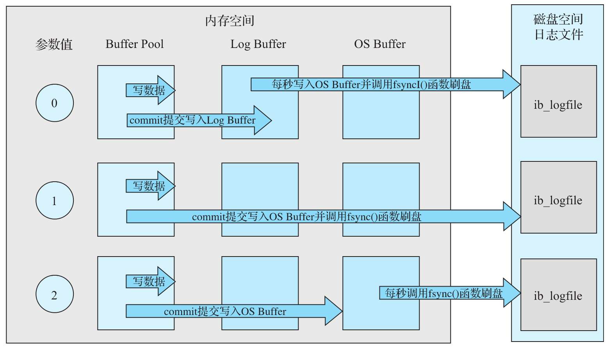{width="6.427890419947507in"
height="3.6671937882764656in"}

> 图2-3　innodb_flush_log_at_trx_commit变量每个取值代表 的刷盘规则
>
> ·如果该变量设置为0，则每次提交事务时，不会将 Log Buffer中的日志写入OS
> Buffer，而是通过一个单独的 线程，每秒写入OS
> Buffer并调用fsync()函数写入磁盘的 Redo
> Log文件。这种方式不是实时写磁盘的，而是每隔1s
> 写一次日志，如果系统崩溃，可能会丢失1s的数据。
>
> ·如果该变量设置为1，则每次提交事务都会将Log Buffer中的日志写入OS
> Buffer，并且会调用fsync()函数将日
>
> 志数据写入磁盘的Redo Log文件中。这种方式虽然在系统
> 崩溃时不会丢失数据，但是性能比较差。如果没有设置
> innodb_flush_log_at_trx_commit变量的值，则默认为1。
>
> ·如果该变量设置为2，则每次提交事务时，都只是 将数据写入OS
> Buffer，之后每隔1s，通过fsync()函数将OS
>
> 101
>
> Buffer中的日志数据同步写入磁盘的Redo Log文件中。
>
> 需要注意的是，在MySQL中，有一个变量
> innodb_flush_log_at_timeout的值为1，这个变量表示刷
>
> 新日志的频率。另外，在InnoDB存储引擎中，刷新数据页 到磁盘和刷新Undo
> Log页到磁盘就只有一种检查点规则。
>
> 102
>
> 2.1.4　Redo Log刷盘最佳实践
>
> 不同的Redo Log刷盘规则，对MySQL数据库性能的影
> 响也不同。本节以一个示例来具体说明
> innodb_flush_log_at_trx_commit变量的不同取值，对
> MySQL数据库的性能影响。
>
> 创建一个数据库test，在数据库中创建一个名为
> flush_disk_test的数据表，如下所示。
>
> create database if not exists test; create table flush_disk_test(
>
> id int not null auto_increment,
>
> name varchar(20),
>
> primary key(id)
>
> )engine=InnoDB;
>
> 为了测试方便，这里创建一个名为insert_data的存
> 储过程，接收一个int类型的参数。这个参数表示向
> flush_disk_test数据表中插入的记录行数，如下所示。
>
> drop procedure if exists insert_data;\
> delimiter \$\$
>
> create procedure insert_data(i int)\
> begin
>
> declare s int default 1;
>
> declare c varchar(50) default \'binghe\';\
> while s\<=i do
>
> start transaction;
>
> insert into flush_disk_test (name) values(c);\
> commit;
>
> set s=s+1;
>
> end while;
>
> 103
>
> end\$\$ delimiter ;
>
> 1）将innodb_flush_log_at_trx_commit变量的值设
> 置为0，调用insert_data向flush_disk_test数据表中插
> 入10万条数据，如下所示。
>
> mysql\> call insert_data (100000); Query OK, 0 rows affected (2.18
> sec)
>
> 可以看到，当innodb_flush_log_at_trx_commit变
> 量的值设置为0时，向表中插入10万条数据耗时2.18s。
>
> 2）将innodb_flush_log_at_trx_commit变量的值设
> 置为1，调用insert_data向flush_disk_test数据表中插
> 入10万条数据，如下所示。
>
> mysql\> call insert_data (100000); Query OK, 0 rows affected (16.18
> sec)
>
> 可以看到，当innodb_flush_log_at_trx_commit变
> 量的值设置为1时，向表中插入10万条数据耗时16.18s。
>
> 3）将innodb_flush_log_at_trx_commit变量的值设
> 置为2，调用insert_data向flush_disk_test数据表中插
> 入10万条数据，如下所示。
>
> mysql\> call insert_data (100000); Query OK, 0 rows affected (3.05
> sec)
>
> 104
>
> 可以看到，当innodb_flush_log_at_trx_commit变
> 量的值设置为2时，向表中插入10万条数据耗时3.05s。
>
> 当innodb_flush_log_at_trx_commit变量的值设置
> 为0或者2时，插入10万条数据耗费的时间差别不是很
> 大，但是与innodb_flush_log_at_trx_commit变量的值
> 设置为1对比来看，耗时差别较大。
>
> 需要注意的是，虽然将 innodb_flush_log_at_trx_commit变量的值设置为0或者
>
> 2时，插入数据的性能比较高，但是在系统发生故障时，
> 可能会丢失1s的数据，而这1s内可能会产生大量的数
> 据。也就是说，可能会造成大量数据丢失。
>
> 细心的读者可以发现，其实insert_data还有优化的
> 空间，那就是在存储过程中把事务的开启和关闭放到循 环体外面，如下所示。
>
> drop procedure if exists insert_data;\
> delimiter \$\$
>
> create procedure insert_data(i int)\
> begin
>
> declare s int default 1;
>
> declare c varchar(50) default \'binghe\';\
> start transaction;
>
> while s\<=i do
>
> insert into flush_disk_test (name) values(c);\
> set s=s+1;
>
> end while;
>
> commit;
>
> end\$\$\
> delimiter ;
>
> 此时，再次测试将 innodb_flush_log_at_trx_commit变量的值设置为1的情
>
> 105
>
> 况，如下所示。
>
> mysql\> call insert_data (100000); Query OK, 0 rows affected (9.32
> sec)
>
> 可以看到，向数据表中插入数据的性能提升了不
>
> 少。
>
> 106
>
> 2.1.5　Redo Log写入机制
>
> Redo Log主要记录的是物理日志，其文件内容是以顺
> 序循环的方式写入的，一个文件写满时会写入另一个文
> 件，最后一个文件写满时，会向第一个文件写数据，并且
> 是覆盖写，如图2-4所示。

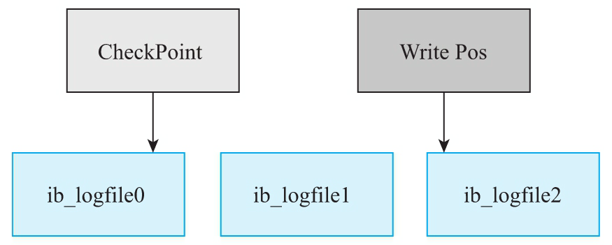{width="6.427891513560805in"
height="2.5752766841644794in"}

> 图2-4　Redo Log的写入机制
>
> 由图2-4可以看出：
>
> 1）Wirte Pos是数据表中当前记录所在的位置，随着
> 不断地向数据表中写数据，这个位置会向后移动，当移动
> 到最后一个文件的最后一个位置时，又会回到第一个文件
> 的开始位置进行写操作；
>
> 2）CheckPoint是当前要擦除的位置，这个位置也是
> 向后移动的，移动到最后一个文件的最后一个位置时，也
>
> 107
>
> 会回到第一个文件的开始位置进行擦除。只不过在擦除记
> 录之前，需要把记录更新到数据文件中；
>
> 3）Write Pos和CheckPoint之间存在间隔时，中间的
> 间隔表示还可以记录新的操作。如果Write Pos移动的速
> 度较快，追上了CheckPoint，则表示数据已经写满，不能 再向Redo
> Log文件中写数据了。此时，需要停止写入数 据，擦除一些记录。
>
> 108
>
> 2.1.6　Redo Log的LSN机制
>
> LSN（Log Sequence Number）表示日志的逻辑序列
> 号。在InnoDB存储引擎中，LSN占用8字节的存储空间，
> 并且LSN的值是单调递增的。一般可以从LSN中获取如下 信息。
>
> 1）Redo Log写入数据的总量。
>
> 2）检查点位置。
>
> 3）数据页版本相关的信息。
>
> LSN除了存在于Redo Log中外，还存在于数据页中。
> 在每个数据页的头部，有一个fil_page_lsn参数记录着
> 当前页最终的LSN值。将数据页中的LSN值和Redo Log中
> 的LSN值进行比较，如果数据页中的LSN值小于Redo Log
> 中的LSN值，则表示丢失了一部分数据，此时，可以通过 Redo
> Log的记录来恢复数据，否则不需要恢复数据。
>
> 在MySQL的命令行通过如下命令可以查看LSN值。
>
> mysql\> show engine innodb status \\G
>
> \#########

省略部分日志#############

> Log sequence number
>
> Log buffer assigned up to
>
> Log buffer completed up to
>
> Log written up to
>
> Log flushed up to
>
> Added dirty pages up to
>
> Pages flushed up to
>
> Last checkpoint at

3072213599

3072213599

3072213599

3072213599

3072213599

3072213599

3072213599

3072213599

109

> 1620 log i/o\'s done, 0.00 log i/o\'s/second
> #########省略部分日志#############
>
> 重要的参数说明如下所示。
>
> 1）Log sequence number：表示当前内存缓冲区中 的Redo Log的LSN。
>
> 2）Log flushed up to：表示刷新到磁盘上的Redo Log文件中的LSN。
>
> 3）Pages flushed up to：表示已经刷新到磁盘数 据页上的LSN。
>
> 4）Last checkpoint at：表示上一次检查点所在位 置的LSN。
>
> 110
>
> 2.1.7　Redo Log相关参数
>
> 在MySQL中，输入如下命令可以查看与Redo Log相关 的参数。
>
> show variables like \'%innodb_log%\';
>
> 可以查询到与Redo Log有关的几个重要参数如下所
>
> 示。
>
> 1）innodb_log_buffer_size：表示log buffer的大 小，默认为8MB。
>
> 2）innodb_log_file_size：表示事务日志的大小， 默认为5MB。
>
> 3）innodb_log_files_group=2：表示事务日志组中
> 的事务日志文件个数，默认为2个。
>
> 4）innodb_log_group_home_dir=./：表示事务日志
> 组所在的目录，当前目录表示MySQL数据所在的目录。
>
> 111
>
> 2.2　Undo Log
>
> Undo Log在MySQL事务的实现中也起着至关重要的作
> 用，MySQL中事务的一致性是由Undo Log实现的。本节对 MySQL中的Undo
> Log进行介绍，主要包括Undo Log文件的
> 基本概念、存储方式、基本原理、MVCC机制和Undo Log
>
> 文件的常见参数配置。
>
> 112
>
> 2.2.1　Undo Log基本概念
>
> Undo Log在MySQL事务的实现中主要起到两方面的作
> 用：回滚事务和多版本并发事务，也就是常说的MVCC机 制。
>
> 在MySQL启动事务之前，会先将要修改的数据记录存 储到Undo
> Log中。如果数据库的事务回滚或者MySQL数据 库崩溃，可以利用Undo
> Log对数据库中未提交的事务进
>
> 行回滚操作，从而保证数据库中数据的一致性。
>
> Undo Log会在事务开始前产生，当事务提交时，并 不会立刻删除相应的Undo
> Log。此时，InnoDB存储引擎 会将当前事务对应的Undo
> Log放入待删除的列表，接下 来，通过一个后台线程purge
> thread进行删除处理。
>
> Undo Log与Redo Log不同，Undo Log记录的是逻辑
> 日志，可以这样理解：当数据库执行一条insert语句 时，Undo
> Log会记录一条对应的delete语句；当数据库 执行一条delete语句时，Undo
> Log会记录一条对应的 insert语句；当数据库执行一条update语句时，Undo
> Log会记录一条相反的update语句。
>
> 当数据库崩溃重启或者执行回滚事务时，可以从\
> Undo Log中读取相应的数据记录进行回滚操作。
>
> MySQL中的多版本并发控制也是通过Undo Log实现
> 的，当select语句查询的数据被其他事务锁定时，可以
>
> 113
>
> 从Undo Log中分析出当前数据之前的版本，从而向客户
> 端返回之前版本的数据。
>
> 需要注意的是，因为MySQL事务执行过程中产生的 Undo
> Log也需要进行持久化操作，所以Undo Log也会产
>
> 生Redo Log。由于Undo Log的完整性和可靠性需要Redo
> Log来保证，因此数据库崩溃时需要先做Redo Log数据恢 复，然后做Undo
> Log回滚。
>
> 114
>
> 2.2.2　Undo Log存储方式
>
> 在MySQL中，InnoDB存储引擎对于Undo Log的存储采
> 用段的方式进行管理，在InnoDB存储引擎的数据文件中 存在一种叫作rollback
> segment的回滚段，这个回滚段 内部有1024个undo log segment段。
>
> Undo Log默认存放在共享数据表空间中，默认为
> ibdata1文件中。如果开启了innodb_file_per_table参
>
> 数，就会将Undo Log存放在每张数据表的.ibd文件中。
>
> 默认情况下，InnoDB存储引擎会将回滚段全部写在
> 同一个文件中，也可以通过innodb_undo_tablespaces变
>
> 量将回滚段平均分配到多个文件中。
> innodb_undo_tablespaces变量的默认值为0，表示将 rollback
> segment回滚段全部写到同一个文件中。
>
> 需要注意的是，innodb_undo_tablespaces变量只能
> 在停止MySQL服务的情况下修改，重启MySQL服务后生
> 效，但是不建议修改这个变量的值。
>
> 115
>
> 2.2.3　Undo Log基本原理
>
> Undo Log写入磁盘时和Redo Log一样，默认情况下 都需要经过内核空间的OS
> Buffer，如图2-5所示。
>
> 同样，如果在打开日志文件时设置了O_DIRECT标志
> 位，就可以不经过操作系统内核空间的OS Buffer，直接
>
> 向磁盘写入数据，这点和Redo Log也是一样的。
>
> 这里依然以商城系统的下单业务为例来简单说明\
> Undo Log的基本原理，如图2-6所示。
>
> 从图2-6中可以看出，MySQL数据库事务提交之前，
> InnoDB存储引擎会将数据表中修改前的数据保存到Undo Log Buffer。Undo Log
> Buffer中的数据会持久化到磁盘
>
> 的Undo Log文件中。当数据库发生故障重启或者事务回
> 滚时，InnoDB存储引擎会读取Undo Log中的数据，将事
> 务还未提交的数据回滚到最初的状态。同时，系统可以
> 根据需要查询并加载订单表中的数据，也就是加载
>
> order.ibd文件中的数据，也可以向订单表写入数据，也
> 就是持久化数据到order.ibd文件中。
>
> 116
>
> 2.2.4　Undo Log实现MVCC机制
>
> 在MySQL中，Undo Log除了实现事务的回滚操作外，
> 另一个重要的作用就是实现多版本并发控制，也就是MVCC
>
> 机制。在事务提交之前，向Undo Log保存事务当前的数 据，这些保存到Undo
> Log中的旧版本数据可以作为快照供 其他并发事务进行快照读。
>
> 117

{width="6.427891513560805in"
height="6.170363079615048in"}

> 图2-5　Undo Log Buffer写日志到Undo Log文件的示意图
>
> 118

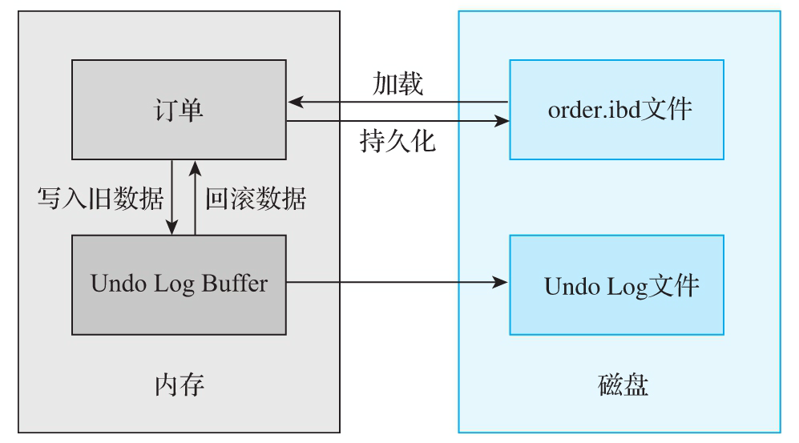{width="6.427891513560805in"
height="3.5641830708661417in"}

> 图2-6　商城业务用户下单时MySQL内部Undo Log的基本 原理
>
> Undo Log的回滚段中，undo logs分为insert undo log和update undo log。
>
> 1）insert undo log：事务对插入新记录产生的Undo
> Log，只在事务回滚时需要，在事务提交后可以立即丢 弃。
>
> 2）update undo log：事务对记录进行删除和更新操 作时产生的Undo
> Log，不仅在事务回滚时需要，在一致性
> 读时也需要，因此不能随便删除，只有当数据库所使用的
> 快照不涉及该日志记录时，对应的回滚日志才会被purge
>
> 线程删除。
>
> 关于InnoDB实现MVCC机制，简单点理解就是InnoDB存
> 储引擎在数据表的每行记录后面保存了两个隐藏列，一个
>
> 119
>
> 隐藏列保存行的创建版本，另一个隐藏列保存行的删除版
> 本。每开始一个新的事务，这些版本号就会递增。
>
> 在可重复读隔离级别下，MVCC机制在增删改查操作下 分别按照如下方式实现。
>
> 1）当前操作是select操作时，InnoDB存储引擎只会
> 查找版本号小于或者等于当前事务版本号的数据行，这样
>
> 可以保证事务读取的数据行要么之前就已经存在，要么是
> 当前事务自身插入或者修改的记录。另外，行的删除版本
> 号要么未定义，要么大于当前事务的版本号，这样可以保
> 证事务读取的行在事务开始之前没有被删除。
>
> 2）当前操作是insert操作时，将当前事务的版本号
> 保存为当前行的创建版本号。
>
> 3）当前操作是delete操作时，将当前事务的版本号
> 保存为删除的数据行的删除版本号，作为行删除标识。
>
> 4）当前操作是update操作时，InnoDB存储引擎会将
> 待修改的行复制为新的行，将当前事务的版本号保存为新
>
> 数据行的创建版本号，同时保存当前事务的版本号为原来
> 数据行的删除版本号。
>
> 需要注意的是，将当前事务的版本号保存为行删除版
> 本号时，相应的数据行并不会被真正删除，当事务提交
> 时，会将这些行记录放入一个待删除列表，因此需要根据
> 一定的策略对这些标识为删除的行进行清理。为此，
> InnoDB存储引擎会开启一个后台线程进行清理工作，是否
> 可以清理需要后台线程来判断。
>
> 120
>
> 为便于读者理解Undo Log实现MVCC机制的原理，上面
> 介绍的实现过程经过了简化。从本质上说，为实现MVCC机
> 制，InnoDB存储引擎在数据库每行数据的后面添加了3个
>
> 字段：6字节的事务id（DB_TRX_ID）字段、7字节的回滚
> 指针（DB_ROLL_PTR）字段、6字节的DB_ROW_ID字段。每
> 个字段的作用如下所示。
>
> 1）6字节的事务id（DB_TRX_ID）字段。
>
> 用来标识最近一次对本行记录做修改（insert、
> update）的事务的标识符，即最后一次修改本行记录的事
> 务id。如果是delete操作，在InnoDB存储引擎内部也属于
> 一次update操作，即更新行中的一个特殊位，将行标识为
>
> 已删除，并非真正删除。
>
> 2）7字节的回滚指针（DB_ROLL_PTR）字段。
>
> 主要指向上一个版本的行记录，能够从最新版本的行
> 记录逐级向上，找到要查找的行版本记录。
>
> 3）6字节的DB_ROW_ID字段。
>
> 这个字段包含一个随着新数据行的插入操作而单调递
> 增的行id，当由InnoDB存储引擎自动产生聚集索引时，聚
> 集索引会包含这个行id，否则这个行id不会出现在任何索 引中。
>
> 为了方便读者理解，这里举一个简单的示例。假设有
> 事务A和事务B两个事务，事务A对商品数据表中的库存字
> 段进行更新，同时事务B读取商品的信息。Undo Log实现
> 的MVCC机制流程如图2-7所示。
>
> 121

{width="6.427891513560805in"
height="2.0499201662292212in"}

> 图2-7　Undo Log实现的MVCC机制流程
>
> 手动开启事务A后，更新商品数据表中id为1的数据，
> 首先会把更新命令中的数据写入Undo Buffer中。在事务A
> 提交之前，事务B手动开启事务，查询商品数据表中id为1
> 的数据，此时的事务B会读取Undo Log中的数据并返回给
>
> 客户端。
>
> 122
>
> 2.2.5　Undo Log相关参数
>
> 在MySQL命令行输入如下命令可以查看Undo Log相关 的参数。
>
> show variables like \"%undo%\";
>
> 其中几个重要的参数说明如下所示。
>
> 1）innodb_max_undo_log_size：表示Undo Log空间
> 的最大值，当超过这个阈值（默认是1GB），会触发
> truncate回收（收缩）操作，回收操作后，Undo Log空 间缩小到10MB。
>
> 2）innodb_undo_directory：表示Undo Log的存储 目录。
>
> 3）innodb_undo_log_encrypt：MySQL 8中新增的参 数，表示Undo
> Log是否加密，OFF表示不加密，ON表示加 密，默认为OFF。
>
> 4）innodb_undo_log_truncate：表示是否开启在线 回收Undo
> Log文件操作，支持动态设置，ON表示开启， OFF表示关闭，默认为OFF。
>
> 5）innodb_undo_tablespaces：此参数必须大于或 等于2，即回收一个Undo
> Log时，要保证另一个Undo Log
>
> 123
>
> 是可用的。
>
> 6）innodb_undo_logs：表示Undo Log的回滚段数
> 量，此参数的值至少大于或等于35，默认为128。
>
> 7）innodb_purge_rseg_truncate_frequency：用于 控制回收Undo
> Log的频率。Undo Log空间在回滚段释放
> 之前是不会回收的，要想增加释放回滚区间的频率，就
> 要降低innodb_purge_rseg_truncate_frequency参数的 值。
>
> 124
>
> 2.3　BinLog
>
> Redo Log是InnoDB存储引擎特有的日志，MySQL也有
> 其自身的日志，这个日志就是BinLog，即二进制日志。
>
> 125
>
> 2.3.1　BinLog基本概念
>
> BinLog是一种记录所有MySQL数据库表结构变更以及
> 表数据变更的二进制日志。BinLog中不会记录诸如
> select和show这类查询操作的日志，同时，BinLog是以
> 事件形式记录相关变更操作的，并且包含语句执行所消
> 耗的时间。BinLog有以下两个最重要的使用场景。
>
> 1）主从复制：在主数据库上开启BinLog，主数据库
> 把BinLog发送至从数据库，从数据库获取BinLog后通过
> I/O线程将日志写到中继日志，也就是Relay Log中。然
> 后，通过SQL线程将Relay Log中的数据同步至从数据
> 库，从而达到主从数据库数据的一致性。
>
> 2）数据恢复：当MySQL数据库发生故障或者崩溃
> 时，可以通过BinLog进行数据恢复。例如，可以使用
> mysqlbinlog等工具进行数据恢复。
>
> 126
>
> 2.3.2　BinLog记录模式
>
> BinLog文件中主要有3种记录模式，分别为Row、 Statement和Mixed。
>
> 1.Row模式
>
> Row模式下的BinLog文件会记录每一行数据被修改的
> 情况，然后在MySQL从数据库中对相同的数据进行修改。
>
> Row模式的优点是能够非常清楚地记录每一行数据的
> 修改情况，完全实现主从数据库的同步和数据的恢复。
>
> Row模式的缺点是如果主数据库中发生批量操作，尤
> 其是大批量的操作，会产生大量的二进制日志。比如， 使用alter
> table操作修改拥有大量数据的数据表结构
> 时，会使二进制日志的内容暴涨，产生大量的二进制日
> 志，从而大大影响主从数据库的同步性能。
>
> 2.Statement模式
>
> Statement模式下的BinLog文件会记录每一条修改数
> 据的SQL语句，MySQL从数据库在复制SQL语句的时候，会
> 通过SQL进程将BinLog中的SQL语句解析成和MySQL主数据
> 库上执行过的SQL语句相同的SQL语句，然后在从数据库
>
> 上执行SQL进程解析出来的SQL语句。
>
> 127
>
> Statement模式的优点是由于不记录数据的修改细
> 节，只是记录数据表结构和数据变更的SQL语句，因此产
>
> 生的二进制日志数据量比较小，这样能够减少磁盘的I/O
> 操作，提升数据存储和恢复的效率。
>
> Statement模式的缺点是在某些情况下，可能会导致
> 主从数据库中的数据不一致。例如，在MySQL主数据库中
> 使用了last_insert_id()和now()等函数，会导致MySQL
>
> 主从数据库中的数据不一致。
>
> 3.Mixed模式
>
> Mixed模式下的BinLog是Row模式和Statement模式的
> 混用。在这种模式下，一般会使用Statement模式保存
> BinLog，如果存在Statement模式无法复制的操作，例如
> 在MySQL主数据库中使用了last_insert_id()和now()等
> 函数，MySQL会使用Row模式保存BinLog。也就是说，如
> 果将BinLog的记录模式设置为Mixed,MySQL会根据执行的
> SQL语句选择写入的记录模式。
>
> 128
>
> 2.3.3　BinLog文件结构
>
> MySQL的BinLog文件中保存的是对数据库、数据表和
> 数据表中的数据的各种更新操作。用来表示修改操作的数
>
> 据结构叫作日志事件（Log Event），不同的修改操作对
> 应着不同的日志事件。在MySQL中，比较常用的日志事件 包括Query Event、Row
> Event、Xid Event等。从某种程
> 度上说，BinLog文件的内容就是各种日志事件的集合。
>
> 目前在MySQL的官方文档中，对于MySQL的BinLog文件
> 结构有3种版本，如图2-8～图2-10所示。

{width="6.427890419947507in"
height="3.121234689413823in"}

> 图2-8　第一版本的BinLog文件结构
>
> 129

{width="6.427890419947507in"
height="4.04833552055993in"}

> 图2-9　第三版本的BinLog文件结构
>
> 130

{width="6.427890419947507in"
height="4.913627515310586in"}

> 图2-10　第四版本的BinLog文件结构
>
> 关于BinLog文件结构的更多细节，读者可以参考
> MySQL官方文档自行了解，链接为
> [https://dev.mysql.com/doc/internals/en/event-](https://dev.mysql.com/doc/internals/en/event-header-fields.html)
> [header-fields.html，这里不再赘述。](https://dev.mysql.com/doc/internals/en/event-header-fields.html)
>
> 131
>
> 2.3.4　BinLog写入机制
>
> MySQL事务在提交的时候，会记录事务日志和二进制 日志，也就是Redo
> Log和BinLog。这里就存在一个问
> 题：对于事务日志和二进制日志，MySQL会先记录哪种 呢？
>
> 我们已经知道，Redo Log是InnoDB存储引擎特有的
> 日志，BinLog是MySQL本身就有的上层日志，并且会先于
>
> InnoDB的事务日志被写入，因此在MySQL中，二进制日志
> 会先于事务日志被写入。
>
> 简单点理解就是MySQL在写BinLog文件时，会按照如 下规则进行写操作。
>
> 1）根据记录的模式（Row、Statement和Mixed）和
> 操作（create、drop、alter、insert、update等）触发
>
> 事件生成日志事件（事件触发执行机制）。
>
> 2）将事务执行过程中产生的日志事件写入相应的缓
> 冲区。注意，这里是每个事务线程都有一个缓冲区。日
> 志事件保存在数据结构binlog_cache_mngr中，这个数据
> 结构中有两个缓冲区：一个是stmt_cache，用于存放不
> 支持事务的信息；另一个是trx_cache，用于存放支持事 务的信息。
>
> 3）事务在Commit阶段会将产生的日志事件写入磁盘
> 的BinLog文件中。因为不同的事务会以串行的方式将日
>
> 132
>
> 志事件写入BinLog文件中，所以一个事务中包含的日志
> 事件信息在BinLog文件中是连续的，中间不会插入其他 事务的日志事件。
>
> 综上，一个事务的BinLog是完整的，并且中间不会 插入其他事务的BinLog。
>
> 133
>
> 2.3.5　BinLog组提交机制
>
> 为了提高MySQL中日志刷盘的效率，MySQL数据库提 供了组提交（group
> commit）功能。通过组提交功能，
> 调用一次fsync()函数能够将多个事务的日志刷新到磁盘
>
> 的日志文件中，而不用将每个事务的日志单独刷新到磁
> 盘的日志文件中，从而大大提升了日志刷盘的效率。
>
> 在InnoDB存储引擎中，提交事务时，一般会进行两 个阶段的操作。
>
> 1）修改内存中事务对应的信息，并将日志写入相应 的Redo Log Buffer。
>
> 2）调用fsync()函数将Redo Log Buffer中的日志信 息刷新到磁盘的Redo
> Log文件中。
>
> 其中，步骤2）因为存在写磁盘的操作，所以比较耗
> 时。事务提交后，先将日志信息写入内存中的Redo Log
> Buffer，然后调用fsync()函数将多个事务的日志信息从 内存中的Redo Log
> Buffer刷新到磁盘的Redo Log文件
> 中，这样能够大大提升事务日志的写入效率，尤其对于
> 写入和更新操作比较频繁的业务，性能提升更加明显。
>
> 在MySQL 5.6之前的版本中，如果开启了BinLog，则
> InnoDB存储引擎的组提交功能就会失效，导致事务性能
> 下降。这是因为在MySQL中需要保证BinLog和事务日志的
>
> 134
>
> 一致性，为了保证二者的一致性，使用了两阶段事务。
> 两阶段事务的步骤如下所示。
>
> 1）当事务提交时，InnoDB存储引擎需要进行 prepare操作。
>
> 2）MySQL上层会将数据库、数据表和数据表中的数
> 据的更新操作写入BinLog文件。
>
> 3）InnoDB存储引擎将事务日志写入Redo Log文件
>
> 中。
>
> 为了保证BinLog和事务日志的一致性，在步骤1）的
> prepare阶段会启用一个prepare_commit_mutex锁，这样
> 会导致开启二进制日志后组提交功能失效。
>
> 这个问题在MySQL 5.6中得到了解决。在MySQL 5.6
> 中，提交事务时会在InnoDB存储引擎的上层将事务按照
> 一定的顺序放入一个队列，队列中的第一个事务称为
>
> leader，其他事务称为follower。在执行顺序上，虽然
> 还是先写BinLog，再写事务日志，但是写日志的机制发
> 生了变化：移除了prepare_commit_mutex锁。开启
>
> BinLog后，组提交功能不会失效。BinLog的写入和
> InnoDB的事务日志写入都是通过组提交功能进行的。
>
> MySQL 5.6中，这种实现方式称为二进制日志组提交 （Binary Log Group
> Commit,BLGC）。BLGC的实现主要 分为Flush、Sync和Commit三个阶段。
>
> 135
>
> 1）Flush阶段：将每个事务的BinLog写入对应的内 存缓冲区。
>
> 2）Sync阶段：将内存缓冲区中的BinLog写入磁盘的
> BinLog文件，如果队列中存在多个事务，则此时只执行
> 一次刷盘操作就可以将多个事务的BinLog刷新到磁盘的
> BinLog文件中，这就是BLGC操作。
>
> 3）Commit阶段：leader事务根据队列中事务的顺序
> 调用存储引擎层事务的提交操作，由于InnoDB存储引擎
> 本身就支持组提交功能，因此解决了
> prepare_commit_mutex锁导致的组提交功能失效的问 题。
>
> 在Flush阶段，将BinLog写入内存缓冲区时，不是写
> 完就立刻进入Sync阶段，而是等待一定时间，多积累几
> 个事务的BinLog再一起进入Sync阶段。这个等待时间由
> 变量binlog_max_flush_queue_time决定，
> binlog_max_flush_queue_time变量的默认值为0。除非
> 有大量的事务不断地进行写入和更新操作，否则不建议
> 修改这个变量的值，这是因为修改后可能会导致事务的 响应时间变长。
>
> 进入Sync阶段后，会将内存缓冲区中多个事务的
> BinLog刷新到磁盘的BinLog文件中，和刷新一个事务的
>
> BinLog一样，也是由sync_binlog变量进行控制的。
>
> 一组事务正在执行Commit阶段的操作时，其他新产
> 生的事务可以执行Flush阶段的操作，Commit阶段的事务
>
> 和Flush阶段的事务不会互相阻塞。这样，组提交功能就
>
> 136
>
> 会持续生效。此时，组提交功能的性能和队列中的事务
> 数量有关，如果队列中只存在一个事务，组提交功能和
> 单独提交一个事务的效果差不多，有时甚至会更差。提
> 交的事务越多，组提交功能的性能提升就越明显。
>
> 137
>
> 2.3.6　BinLog与Redo Log的区别
>
> BinLog和Redo Log在一定程度上都能恢复数据，但
> 是二者有着本质的区别，具体内容如下。
>
> 1）BinLog是MySQL本身就拥有的，不管使用何种存
> 储引擎，BinLog都存在，而Redo Log是InnoDB存储引擎
> 特有的，只有InnoDB存储引擎才会输出Redo Log。
>
> 2）BinLog是一种逻辑日志，记录的是对数据库的所 有修改操作，而Redo
> Log是一种物理日志，记录的是每 个数据页的修改。
>
> 3）Redo Log具有幂等性，多次操作的前后状态是一
> 致的，而BinLog不具有幂等性，记录的是所有影响数据
> 库的操作。例如插入一条数据后再将其删除，则Redo
> Log前后的状态未发生变化，而BinLog就会记录插入操作 和删除操作。
>
> 4）BinLog开启事务时，会将每次提交的事务一次性
> 写入内存缓冲区，如果未开启事务，则每次成功执行插
> 入、更新和删除语句时，就会将对应的事务信息写入内 存缓冲区，而Redo
> Log是在数据准备修改之前将数据写 入缓冲区的Redo
> Log中，然后在缓冲区中修改数据。而 且在提交事务时，先将Redo
> Log写入缓冲区，写入完成 后再提交事务。
>
> 138
>
> 5）BinLog只会在事务提交时，一次性写入BinLog，
> 其日志的记录方式与事务的提交顺序有关，并且一个事
> 务的BinLog中间不会插入其他事务的BinLog。而Redo
> Log记录的是物理页的修改，最后一个提交的事务记录会
> 覆盖之前所有未提交的事务记录，并且一个事务的Redo
> Log中间会插入其他事务的Redo Log。
>
> 6）BinLog是追加写入，写完一个日志文件再写下一
> 个日志文件，不会覆盖使用，而Redo Log是循环写入，
> 日志空间的大小是固定的，会覆盖使用。
>
> 7）BinLog一般用于主从复制和数据恢复，并且不具
> 备崩溃自动恢复的能力，而Redo Log是在服务器发生故
> 障后重启MySQL，用于恢复事务已提交但未写入数据表的 数据。
>
> 139
>
> 2.3.7　BinLog相关参数
>
> 在MySQL中，输入如下命令可以查看与BinLog相关的 参数。
>
> show variables like \'%log_bin%\'; show variables like \'%binlog%\';
>
> 其中，几个重要的参数如下所示。
>
> 1）log_bin：表示开启二进制日志，未指定BinLog
> 的目录时，会在MySQL的数据目录下生成BinLog，指定
> BinLog的目录时，会在指定的目录下生成BinLog。
>
> 2）log_bin_index：设置此参数可以指定二进制索 引文件的路径与名称。
>
> 3）binlog_do_db：表示只记录指定数据库的二进制 日志。
>
> 4）binlog_ignore_db：表示不记录指定数据库的二 进制日志。
>
> 5）max_binlog_size：表示BinLog的最大值，默认 值为1GB。
>
> 6）sync_binlog：这个参数会影响MySQL的性能和数
> 据的完整性。取值为0时，事务提交后，MySQL将
>
> 140
>
> binlog_cache中的数据写入BinLog文件的同时，不会执
> 行fsync()函数刷盘。当取值为大于0的数字N时，在进行
> N次事务提交操作后，MySQL将执行一次fsync()函数，将
> 多个事务的BinLog刷新到磁盘中。
>
> 7）max_binlog_cache_size：表示BinLog占用的最 大内存。
>
> 8）binlog_cache_size：表示BinLog使用的内存大
>
> 小。
>
> 9）binlog_cache_use：表示使用BinLog缓存的事务 数量。
>
> 10）binlog_cache_disk_use：表示使用BinLog缓存
> 但超过binlog_cache_size的值，并且使用临时文件来保
> 存SQL语句中的事务数量。
>
> 需要注意的是，MySQL中默认不会开启BinLog。如果
> 需要开启BinLog，要修改my.cnf或my.ini配置文件，在
> mysqld下面增加log_bin=mysql_bin_log命令，重启 MySQL服务，如下所示。
>
> binlog-format=ROW log-bin=mysqlbinlog
>
> 141
>
> 2.4　MySQL事务流程
>
> MySQL的事务流程分为MySQL事务执行流程和MySQL事
> 务恢复流程，本节对MySQL的事务流程进行简单的介绍。
>
> 142
>
> 2.4.1　MySQL事务执行流程
>
> 2.1～2.3节详细介绍了Redo Log、Undo Log和
> BinLog,MySQL事务执行的过程中，主要是通过Redo Log和
>
> Undo Log实现的。
>
> MySQL事务执行流程如图2-11所示。
>
> 从图2-11中可以看出，MySQL在事务执行的过程中， 会记录相应SQL语句的Undo
> Log和Redo Log，然后在内存 中更新数据并形成数据脏页。接下来Redo
> Log会根据一定
>
> 的规则触发刷盘操作，Undo Log和数据脏页则通过检查点
> 机制刷盘。事务提交时，会将当前事务相关的所有Redo
> Log刷盘，只有当前事务相关的所有Redo Log刷盘成功， 事务才算提交成功。
>
> 143

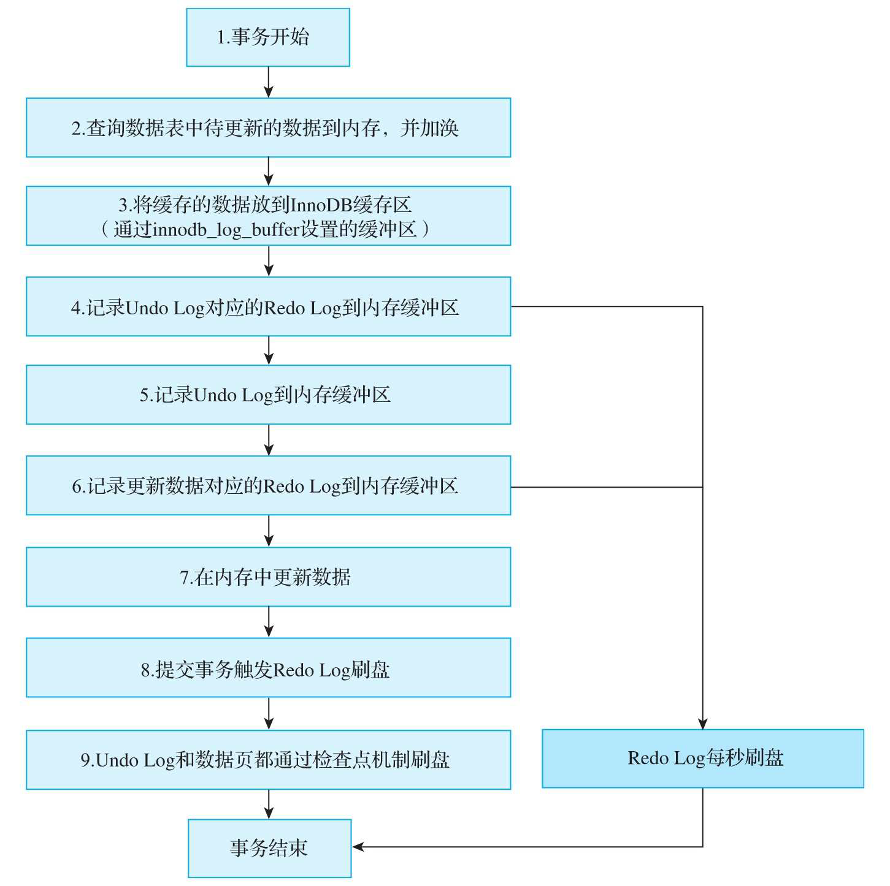{width="6.427891513560805in"
height="6.407287839020123in"}

> 图2-11　MySQL事务执行流程
>
> 144
>
> 2.4.2　MySQL事务恢复流程
>
> 如果一切正常，则MySQL事务会按照图2-11中的顺序
> 执行。实际上，MySQL事务的执行不会总是那么顺利。如
> 果MySQL由于某种原因崩溃或者宕机，则需要进行数据的 恢复或者回滚操作。
>
> 按照图2-11所示，如果事务在执行第8步，即事务提
> 交之前，MySQL崩溃或者宕机，此时会先使用Redo Log恢 复数据，然后使用Undo
> Log回滚数据。如果在执行第8步 之后MySQL崩溃或者宕机，此时会使用Redo
> Log恢复数
>
> 据，大体流程如图2-12所示。
>
> 145

{width="6.427890419947507in"
height="7.674325240594926in"}

> 图2-12　MySQL事务恢复流程
>
> 如图2-12所示，MySQL发生崩溃或者宕机时，需要重
> 启MySQL。MySQL重启之后，会获取日志检查点信息，随后
>
> 146
>
> 根据日志检查点信息使用Redo Log恢复数据。如果在
> MySQL崩溃或者宕机时，事务未提交，则接下来使用Undo
> Log回滚数据。如果在MySQL崩溃或者宕机时，事务已经提 交，则用Redo
> Log恢复数据即可。
>
> 147
>
> 2.5　MySQL中的XA事务
>
> MySQL 5.0.3版本开始支持XA分布式事务，并且只有
> InnoDB存储引擎支持XA事务，MySQL Connector/J 5.0.0
> 版本之后开始提供对XA事务的支持。本节对MySQL中的XA 事务进行简单的介绍。
>
> 148
>
> 2.5.1　XA事务的基本原理
>
> XA事务支持不同数据库之间实现分布式事务。这里的
> 不同数据库，可以是不同的MySQL实例，也可以是不同的
> 数据库类型，比如MySQL数据库和Oracle数据库。
>
> XA事务本质上是一种基于两阶段提交的分布式事务，
> 分布式事务可以简单理解为多个数据库事务共同完成一个
> 原子性的事务操作。参与操作的多个事务要么全部提交成
> 功，要么全部提交失败。在使用XA分布式事务时，InnoDB
> 存储引擎的事务隔离级别需要设置为串行化。
>
> XA事务由一个事务管理器（Transaction
> Manager）、一个或者多个资源管理器（Resource
>
> Manager）和一个应用程序（Application Program）组
> 成，组成模型如图2-13所示。

{width="6.427891513560805in"
height="2.770997375328084in"}

> 图2-13　XA事务模型
>
> 149
>
> 1）事务管理器：主要对参与全局事务的各个分支事
> 务进行协调，并与资源管理器进行通信。
>
> 2）资源管理器：主要提供对对事务资源的访问能
> 力。实际上，一个数据库就可以看作一个资源管理器。
>
> 3）应用程序：主要用来明确全局事务和各个分支事
> 务，指定全局事务中的各个操作。
>
> 因为XA事务是基于两阶段提交的分布式事务，所以XA
> 事务也被拆分为Prepare阶段和Commit阶段。
>
> 在Prepare阶段，事务管理器向资源管理器发送准备
> 指令，资源管理器接收到指令后，执行数据的修改操作并
>
> 记录相关的日志信息，然后向事务管理器返回可以提交或
> 者不可以提交的结果信息。
>
> 在Commit阶段，事务管理器接收所有资源管理器返回
> 的结果信息，如果某一个或多个资源管理器向事务管理器
> 返回的结果信息为不可以提交，或者超时，则事务管理器
> 向所有的资源管理器发送回滚指令。如果事务管理器收到
> 的所有资源管理器返回的结果信息为可以提交，则事务管
> 理器向所有的资源管理器发送提交事务的指令。
>
> 150
>
> 2.5.2　MySQL XA事务语法
>
> 在MySQL命令行输入如下命令可以查看存储引擎是否 支持XA事务。
>
> mysql\> show engines \\G
>
> \*\*\*\*\*\*\*\*\*\*\*\*\*\*\*\*\*\*\*\*\*\*\*\*\*\*\* 1. row
> \*\*\*\*\*\*\*\*\*\*\*\*\*\*\*\*\*\*\*\*\*\*\*\*\*\*\*
>
> Engine: InnoDB
>
> Support: DEFAULT
>
> Comment: Supports transactions, row-level locking, and
>
> foreign keys\
> Transactions: YES
>
> XA: YES
>
> Savepoints: YES
>
> \*\*\*\*\*\*\*\*\*\*\*\*\*\*\*\*\*\*\*\*\*\*\*\*\*\*\* 2. row
> \*\*\*\*\*\*\*\*\*\*\*\*\*\*\*\*\*\*\*\*\*\*\*\*\*\*\*
>
> Engine: MRG_MYISAM\
> Support: YES
>
> Comment: Collection of identical MyISAM tables\
> Transactions: NO
>
> XA: NO
>
> Savepoints: NO
>
> \*\*\*\*\*\*\*\*\*\*\*\*\*\*\*\*\*\*\*\*\*\*\*\*\*\*\* 3. row
> \*\*\*\*\*\*\*\*\*\*\*\*\*\*\*\*\*\*\*\*\*\*\*\*\*\*\*
>
> Engine: MEMORY
>
> Support: YES
>
> Comment: Hash based, stored in memory, useful for temporary tables
>
> Transactions: NO
>
> XA: NO
>
> Savepoints: NO
>
> \*\*\*\*\*\*\*\*\*\*\*\*\*\*\*\*\*\*\*\*\*\*\*\*\*\*\* 4. row
> \*\*\*\*\*\*\*\*\*\*\*\*\*\*\*\*\*\*\*\*\*\*\*\*\*\*\*
>
> Engine: BLACKHOLE
>
> Support: YES
>
> Comment: /dev/null storage engine (anything you write to it
> disappears)
>
> Transactions: NO
>
> XA: NO
>
> Savepoints: NO
>
> \*\*\*\*\*\*\*\*\*\*\*\*\*\*\*\*\*\*\*\*\*\*\*\*\*\*\* 5. row
> \*\*\*\*\*\*\*\*\*\*\*\*\*\*\*\*\*\*\*\*\*\*\*\*\*\*\*
>
> Engine: MyISAM
>
> Support: YES
>
> Comment: MyISAM storage engine\
> Transactions: NO
>
> 151
>
> XA: NO
>
> Savepoints: NO
>
> \*\*\*\*\*\*\*\*\*\*\*\*\*\*\*\*\*\*\*\*\*\*\*\*\*\*\* 6. row
> \*\*\*\*\*\*\*\*\*\*\*\*\*\*\*\*\*\*\*\*\*\*\*\*\*\*\*
>
> Engine: CSV
>
> Support: YES
>
> Comment: CSV storage engine\
> Transactions: NO
>
> XA: NO
>
> Savepoints: NO
>
> \*\*\*\*\*\*\*\*\*\*\*\*\*\*\*\*\*\*\*\*\*\*\*\*\*\*\* 7. row
> \*\*\*\*\*\*\*\*\*\*\*\*\*\*\*\*\*\*\*\*\*\*\*\*\*\*\*
>
> Engine: ARCHIVE
>
> Support: YES
>
> Comment: Archive storage engine\
> Transactions: NO
>
> XA: NO
>
> Savepoints: NO
>
> \*\*\*\*\*\*\*\*\*\*\*\*\*\*\*\*\*\*\*\*\*\*\*\*\*\*\* 8. row
> \*\*\*\*\*\*\*\*\*\*\*\*\*\*\*\*\*\*\*\*\*\*\*\*\*\*\*
>
> Engine: PERFORMANCE_SCHEMA\
> Support: YES
>
> Comment: Performance Schema\
> Transactions: NO
>
> XA: NO
>
> Savepoints: NO
>
> \*\*\*\*\*\*\*\*\*\*\*\*\*\*\*\*\*\*\*\*\*\*\*\*\*\*\* 9. row
> \*\*\*\*\*\*\*\*\*\*\*\*\*\*\*\*\*\*\*\*\*\*\*\*\*\*\*
>
> Engine: FEDERATED
>
> Support: NO
>
> Comment: Federated MySQL storage engine\
> Transactions: NULL
>
> XA: NULL
>
> Savepoints: NULL
>
> 9 rows in set (0.00 sec)
>
> 从输出的结果信息来看，只有InnoDB存储引擎支持
> 事务、XA事务和事务保存点。
>
> MySQL XA事务的基本语法如下所示。
>
> 1）开启XA事务，如果使用的是XA START命令而不是 XA
> BEGIN命令，则不支持\[JOIN\|RESUME\]，xid是一个唯
> 一值，表示事务分支标识符，语法如下。
>
> XA {START\|BEGIN} xid \[JOIN\|RESUME\]
>
> 152
>
> 2）结束一个XA事务，不支持\[SUSPEND\[FOR MIGRATE\]\]，语法如下。
>
> XA END xid \[SUSPEND \[FOR MIGRATE\]\]
>
> 3）准备提交XA事务。
>
> XA PREPARE xid
>
> 4）提交XA事务，如果使用了ONE PHASE命令，表示
> 使用一阶段提交。在两阶段提交协议中，如果只有一个
> 资源管理器参与操作，则可以优化为一阶段提交。
>
> XA COMMIT xid \[ONE PHASE\]
>
> 5）回滚XA事务。
>
> XA ROLLBACK xid
>
> 6）列出所有处于准备阶段的XA事务。
>
> XA RECOVER \[CONVERT XID\]
>
> 关于MySQL XA事务的更多语法，读者可以参考MySQL 官方文档，地址为
>
> 153
>
> [https://dev.mysql.com/doc/refman/8.0/en/xa-](https://dev.mysql.com/doc/refman/8.0/en/xa-states.html)
> [states.html。如果使用的是MySQL
> 5.7版本，则可](https://dev.mysql.com/doc/refman/8.0/en/xa-states.html)以到
> [https://dev.mysql.com/doc/refman/5.7/en/xa-](https://dev.mysql.com/doc/refman/5.7/en/xa-states.html)
> [states.html进行查阅，笔者不再赘述。](https://dev.mysql.com/doc/refman/5.7/en/xa-states.html)
>
> 下面是MySQL官方文档中对于XA事务的一个简单示
> 例，演示了MySQL作为全局事务中的一个事务分支，将一
>
> 行记录插入一个表。
>
> mysql\> XA START \'xatest\';
>
> Query OK, 0 rows affected (0.00 sec)
>
> mysql\> INSERT INTO mytable (i) VALUES(10); Query OK, 1 row affected
> (0.04 sec)
>
> mysql\> XA END \'xatest\';
>
> Query OK, 0 rows affected (0.00 sec)
>
> mysql\> XA PREPARE \'xatest\';
>
> Query OK, 0 rows affected (0.00 sec)
>
> mysql\> XA COMMIT \'xatest\';
>
> Query OK, 0 rows affected (0.00 sec)
>
> MySQL XA事务使用XID标识分布式事务，xid主要由 以下几部分组成。
>
> xid: gtrid\[, bqual \[, formatID \]\]
>
> 1）gtrid：必须，为字符串，表示全局事务标识
>
> 符。
>
> 2）bqual：可选，为字符串，默认是空串，表示分 支限定符。
>
> 154
>
> 3）formatID：可选，默认值为1，用于标识gtrid和 bqual值使用的格式。
>
> 155
>
> 2.5.3　JDBC操作MySQL XA事务
>
> 这里单独使用一个小节介绍如何使用JDBC操作MySQL XA事务。MySQL
> Connector/J 5.0.0版本开始支持XA事 务，也就是说，从Connector/J
> 5.0.0版本开始提供了 Java版本XA接口的实现。基于此，可以直接通过Java代
> 码来执行MySQL的XA事务。
>
> JDBC操作MySQL XA事务的完整源码如下所示。
>
> import com.mysql.jdbc.jdbc2.optional.MysqlXAConnection;\
> import com.mysql.jdbc.jdbc2.optional.MysqlXid;
>
> import javax.sql.XAConnection;
>
> import javax.transaction.xa.XAException;
>
> import javax.transaction.xa.XAResource;
>
> import javax.transaction.xa.Xid;
>
> import java.sql.Connection;
>
> import java.sql.DriverManager;
>
> import java.sql.PreparedStatement;
>
> import java.sql.SQLException;
>
> public class MysqlXAConnectionTest {
>
> public static void main(String\[\] args) throws SQLException {
>
> //打印XA日志
>
> boolean writeLog = true;
>
> // 获得资源管理器操作接口实例RM1\
> Connection conn1 =
>
> DriverManager.getConnection(\"jdbc:mysql://localhost:3306/test\",
> \"binghe\", \"binghe123\");
>
> //配置打印XA日志
>
> XAConnection xaConn1 = new
> MysqlXAConnection((com.mysql.jdbc.Connection) conn1, writeLog);
>
> XAResource rm1 = xaConn1.getXAResource();\
> // 获得资源管理器操作接口实例RM2
>
> Connection conn2 =
>
> DriverManager.getConnection(\"jdbc:mysql://localhost:3306/test\",
> \"binghe\",\"binghe123\");
>
> //配置打印XA日志
>
> XAConnection xaConn2 = new
> MysqlXAConnection((com.mysql.jdbc.Connection) conn2, writeLog);
>
> 156
>
> XAResource rm2 = xaConn2.getXAResource();
>
> // 应用程序请求事务管理器执行一个分布式事务，事务管理器生成全局事务
>
> id
>
> byte\[\] gtrid = \"binghe123\".getBytes();
>
> int formatId = 1;
>
> Xid xid1=null;
>
> Xid xid2=null;
>
> try {
>
> // ==============分别执行RM1和RM2上的事务分支
>
> ====================
>
> // 事务管理器生成rm1上的事务分支id
>
> byte\[\] bqual1 = \"binghe001\".getBytes();
>
> xid1 = new MysqlXid(gtrid, bqual1, formatId);\
> // 执行rm1上的事务分支
>
> rm1.start(xid1, XAResource.TMNOFLAGS);\
> PreparedStatement ps1 =
>
> conn1.prepareStatement(\"INSERT into xa_test(name) VALUES
> (\'binghe\')\");
>
> ps1.execute();
>
> rm1.end(xid1, XAResource.TMSUCCESS);\
> // 事务管理器生成rm2上的事务分支id
>
> byte\[\] bqual2 = \"binghe002\".getBytes();
>
> xid2 = new MysqlXid(gtrid, bqual2, formatId);\
> // 执行rm2上的事务分支
>
> rm2.start(xid2, XAResource.TMNOFLAGS);\
> PreparedStatement ps2 =
>
> conn2.prepareStatement(\"INSERT into xa_test(name) VALUES
> (\'binghe\')\");
>
> ps2.execute();
>
> rm2.end(xid2, XAResource.TMSUCCESS);\
> // ===================两阶段提交
>
> ================================
>
> // 第一阶段：通知所有的资源管理器准备提交事务分支\
> int rm1_prepare = rm1.prepare(xid1);
>
> int rm2_prepare = rm2.prepare(xid2);
>
> // 第二阶段：提交所有事务分支
>
> boolean onePhase = false;
>
> //所有事务分支都进入准备状态，提交所有事务分支\
> if (rm1_prepare == XAResource.XA_OK
>
> && rm2_prepare == XAResource.XA_OK ) {
>
> rm1.commit(xid1, onePhase);
>
> rm2.commit(xid2, onePhase);
>
> } else { //如果有事务分支没有进入准备状态，则回滚所有的分\
> 支事务
>
> rm1.rollback(xid1);
>
> rm2.rollback(xid2);
>
> }
>
> } catch (XAException e) {
>
> // 如果出现异常，也要进行回滚
>
> rm1.rollback(xid1);
>
> 157
>
> rm2.rollback(xid2);
>
> e.printStackTrace();
>
> }
>
> }
>
> }
>
> 可以看到，直接使用JDBC操作MySQL的XA事务还是挺
> 烦琐的，不过在实际的工作中，很少使用JDBC直接操作
> MySQL的XA事务，大部分时间会使用第三方框架或者容器
> 来操作XA事务，能够大大提高开发的效率。
>
> 在某种程度上，MySQL XA事务可分为内部XA事务和
> 外部XA事务。外部XA事务属于分布式事务的一种实现方
> 式，而内部XA事务则表示MySQL使用了InnoDB作为存储引
>
> 擎，并且开启了BinLog，为了保证BinLog与Redo Log的
> 一致性，MySQL内部使用了XA事务。
>
> 158
>
> 2.6　本章小结
>
> 本章主要介绍了MySQL事务的实现原理，对Redo Log、Undo
> Log和BinLog进行了简单的介绍，然后介绍了
> MySQL事务的流程，包括MySQL事务的执行流程和MySQL事
>
> 务的恢复流程，最后简单介绍了MySQL的XA事务。第3章
> 将会对Spring事务的实现原理进行介绍。
>
> 159
>
> 第3章　Spring事务的实现原理
>
> 在Web开发领域，Spring毫无疑问地成为Java领域中
> 必不可少的开发框架。Spring不仅支持IOC、DI、和AOP
> 几大特性，而且基于AOP实现了事务管理的功能，极大地
> 简化了需要开发人员手动操作数据库事务的流程。
>
> 本章将介绍Spring事务的实现原理，涉及的内容如
>
> 下。
>
> ·Spring事务原理。\
> ·Spring事务三大接口。\
> ·Spring事务隔离级别。\
> ·Spring事务传播机制。\
> ·Spring事务嵌套最佳实践。\
> ·Spring事务失效的场景。
>
> 160
>
> 3.1　Spring事务原理
>
> Spring框架中支持对于事务的管理功能，开发人员
> 使用Spring框架能够极大的简化对于数据库事务的管理
> 操作。本节将对Spring事务的原理进行简单的介绍。
>
> 161
>
> 3.1.1　JDBC直接操作事务
>
> 从本质上讲，Spring事务是对数据库事务的进一步
> 封装。也就是说，如果数据库不支持事务，Spring也无 法实现事务操作。
>
> 使用JDBC通过事务的方式操作数据库的步骤如下。
>
> 第一步：加载JDBC驱动，代码如下。
>
> Class.forName(\"com.mysql.jdbc.Driver\");
>
> 第二步：建立与数据库的连接，后两个参数分别为 账号和密码，代码如下。
>
> Connection conn = DriverManager.getConnection(url, \"root\",
> \"root\");
>
> 第三步：开启事务，代码如下。
>
> conn.setAutoCommit(true/false);
>
> 第四步：执行数据库的CRUD操作，代码如下。
>
> PreparedStatement ps = con.prepareStatement(sql); //新增、修改、删除
>
> ps.executeUpdate();
>
> 162
>
> //查询 ps.executeQuery()
>
> 第五步：提交或者回滚事务，代码如下。
>
> //提交事务 conn.commit(); //回滚事务 conn.rollback();
>
> 第六步：关闭连接，代码如下。
>
> ps.close(); conn.close();
>
> 163
>
> 3.1.2　使用Spring管理事务
>
> 如果使用Spring的事务功能，则不必手动开启事
> 务、提交事务和回滚事务，也就是不用再写3.1.1节中第
>
> 三步和第五步中的代码。而是开启事务、提交事务和回
> 滚事务的操作全部交由Spring框架自动完成，那么
> Spring是如何自动开启事务、提交事务和回滚事务的 呢？
>
> 简单地说，就是在配置文件或者项目的启动类中配
> 置Spring事务相关的注解驱动，在相关的类或者方法上
> 标识@Transactional注解，即可开启并使用Spring的事 务管理功能。
>
> Spring框架在启动的时候会创建相关的bean实例对
> 象，并且会扫描标注有相关注解的类和方法，为这些方
> 法生成代理对象。如果扫描到标注有@Transactional注
> 解的类或者方法时，会根据@Transactional注解的相关
> 参数进行配置注入，在代理对象中会处理相应的事务，
> 对事务进行管理。例如在代理对象中开启事务、提交事
> 务和回滚事务。而这些操作都是Spring框架通过AOP代理
>
> 自动完成的，无须开发人员过多关心其中的细节。
>
> 如下方法就使用了Spring的@Transactional注解管 理事务。
>
> \@Transactional(rollbackFor=Exception) Public void saveUser(User
> user){
>
> 164
>
> //省略保存用户的代码
>
> }
>
> 165
>
> 3.1.3　Spring事务分类
>
> 通过Spring管理的事务可以分为逻辑事务和物理事 务两大类。
>
> 1）逻辑事务：通常指通过Spring等框架管理的事
> 务，这种事务是建立在物理事务之上的，比物理事务更
>
> 加抽象。
>
> 2）物理事务：通常指的是针对特定数据库的事务。
>
> Spring支持两种事务声明方式，分别是编程式事务 和声明式事务。
>
> 1）编程式事务：如果系统需要明确的事务，并且需
> 要细粒度的控制各个事务的边界，此时建议使用编程式 事务。
>
> 2）声明式事务：如果系统对于事务的控制粒度较为
> 粗糙，则建议使用声明式事务。
>
> 166
>
> 3.1.4　Spring事务超时
>
> 在实际工作中，对于某些性能要求比较高的应用，
> 要求事务执行的时间尽可能短，此时可以给这些事务设
> 置超时时间，一般事务的超时时间以秒为单位。如果事
> 务的超时时间设置得过长，则与事务相关的数据就会被
> 锁住，影响系统的并发性与整体性能。另外，因为检测
> 事务超时的任务是在事务开始时启动的，所以事务超时
> 机制对于程序在执行过程中会创建新事务的传播行为才
> 有意义。需要注意的是，程序在执行过程中可能会创建
> 新事务的传播类型有REQUIRED、REQUIRES_NEW、NESTED 三种。
>
> 167
>
> 3.1.5　Spring事务回滚规则
>
> 使用Spring管理事务，可以指定在方法抛出异常
> 时，哪些异常能够回滚事务，哪些异常不回滚事务。默
>
> 认情况下，在方法抛出RuntimeException时回滚事务，
> 也可以手动指定回滚事务的异常类型，代码如下。
>
> \@Transactional(rollbackFor?=?Exception.class)
>
> 这里需要注意的是，对于Spring事务，注解
> \@Transactional中的rollbackFor属性可以指定 Throwable异常类及其子类。
>
> 168
>
> 3.2　Spring事务三大接口
>
> Spring支持事务的管理功能，最核心的就是Spring
> 事务的三大接口：PlatformTransaction-Manager、
> TransactionDefinition和TransactionStatus。本节分 别介绍这三大接口。
>
> 169
>
> 3.2.1　PlatformTransactionManager接口
>
> 通过Spring的源码可知，Spring并不是直接管理事
> 务的，而是提供了多种事务管理器。通过这些事务管理
> 器，Spring将事务管理的职责委托给了Hibernate、
>
> MyBatis、JTA等持久化框架的事务来实现。
>
> PlatformTransactionManager接口位于Spring的
> org.springframework.transaction包下。通过
> PlatformTransactionManager接口，Spring为
> Hibernate、MyBatis、JTA等持久化框架提供了事务管理
> 器，具体的实现由框架自己完成。
>
> PlatformTransactionManager接口的源码如下所
>
> 示。
>
> public interface PlatformTransactionManager {
>
> /\*\*
>
> \*获取事务状态
>
> \*/
>
> TransactionStatus getTransaction(@Nullable TransactionDefinition
> definition) throws TransactionException;
>
> /\*\*
>
> \*提交事务
>
> \*/
>
> void commit(TransactionStatus status) throws TransactionException;
>
> /\*\*
>
> \*回滚事务
>
> \*/
>
> void rollback(TransactionStatus status) throws TransactionException;
>
> }
>
> 170
>
> 3.2.2　TransactionDefinition接口
>
> TransactionDefinition接口位于Spring的
> org.springframework.transaction包下，主要定义了与
>
> 事务相关的方法，表示事务属性的常量等信息。部分事
> 务属性的常量与Propagation枚举类中的事务传播类型相 对应。
>
> TransactionDefinition接口的源码如下所示。
>
> public interface TransactionDefinition {
>
> /\*\*
>
> \*支持当前事务，若当前没有事务就创建一个新的事务\
> \*/
>
> int PROPAGATION_REQUIRED = 0;
>
> /\*\*
>
> \*如果当前存在事务，则加入该事务，如果当前没有事务，则以非事务的方式继续\
> 运行
>
> \*/
>
> int PROPAGATION_SUPPORTS = 1;
>
> /\*\*
>
> \*如果当前存在事务，则加入该事务，如果当前没有事务，则抛出异常\
> \*/
>
> int PROPAGATION_MANDATORY = 2;
>
> /\*\*
>
> \*创建一个新的事务，如果当前存在事务，则把当前事务挂起\
> \*/
>
> int PROPAGATION_REQUIRES_NEW = 3;
>
> /\*\*
>
> \*以非事务方式运行，如果当前存在事务，则把当前事务挂起\
> \*/
>
> int PROPAGATION_NOT_SUPPORTED = 4;
>
> /\*\*
>
> \*以非事务方式运行，如果当前存在事务，则抛出异常
>
> 171
>
> \*/
>
> int PROPAGATION_NEVER = 5;
>
> /\*\*
>
> \*表示如果当前正有一个事务在运行中，则该方法运行在一个嵌套的事务中，\
> 被嵌套的事务可以独立于封装的事务进行提交或者回滚（这里需要事务的保存
>
> 点），
>
> 如果封装的事务不存在，后续事务行为同PROPAGATION_REQUIRES NEW
>
> \*/
>
> int PROPAGATION_NESTED = 6;
>
> /\*\*
>
> \*使用后端数据库默认的隔离级别\
> \*/
>
> int ISOLATION_DEFAULT = -1;
>
> /\*\*
>
> \*最低的隔离级别
>
> \*/
>
> int ISOLATION_READ_UNCOMMITTED =\
> Connection.TRANSACTION_READ_UNCOMMITTED;
>
> /\*\*
>
> \*阻止脏读，但是可能会产生幻读或不可重复读的问题\
> \*/
>
> int ISOLATION_READ_COMMITTED = Connection.TRANSACTION_READ_COMMITTED;
>
> /\*\*
>
> \*可以阻止脏读和不可重复读，但是可能会产生幻读\
> \*/
>
> int ISOLATION_REPEATABLE_READ =
> Connection.TRANSACTION_REPEATABLE_READ;
>
> /\*\*
>
> \*可以防止脏读、不可重复读以及幻读\
> \*/
>
> int ISOLATION_SERIALIZABLE = Connection.TRANSACTION_SERIALIZABLE;
>
> /\*\*
>
> \*使用默认的超时时间\
> \*/
>
> int TIMEOUT_DEFAULT = -1;
>
> /\*\*
>
> \*获取事务的传播行为\
> \*/
>
> int getPropagationBehavior();
>
> 172
>
> /\*\*
>
> \*获取事务的隔离级别\
> \*/
>
> int getIsolationLevel();
>
> /\*\*
>
> \*获取事务的超时时间\
> \*/
>
> int getTimeout();
>
> /\*\*
>
> \*返回当前是否为只读事务\
> \*/
>
> boolean isReadOnly();
>
> /\*\*
>
> \*

获取事务的名称

> \*/
>
> \@Nullable
>
> String getName();
>
> }
>
> 173
>
> 3.2.3　TransactionStatus接口
>
> TransactionStatus接口主要用来存储事务执行的状
> 态，并且定义了一组方法，用来判断或者读取事务的状 态信息。
>
> TransactionStatus接口的源码如下所示。
>
> public interface TransactionStatus extends SavepointManager, Flushable
> {
>
> /\*\*
>
> \*判断是否是新事务\
> \*/
>
> boolean isNewTransaction();\
> /\*\*
>
> \*是否有保存点
>
> \*/
>
> boolean hasSavepoint();\
> /\*\*
>
> \*设置为只回滚
>
> \*/
>
> void setRollbackOnly();\
> /\*\*
>
> \*是否为只回滚
>
> \*/
>
> boolean isRollbackOnly();\
> /\*\*
>
> \*将事务涉及的数据刷新到磁盘\
> \*/
>
> \@Override
>
> void flush();\
> /\*\*
>
> \*

判断当前事务是否已经完成

> \*/
>
> boolean isCompleted();
>
> }
>
> 174
>
> 3.3　Spring事务隔离级别
>
> Spring中存在5种隔离级别，分别为
> ISOLATION_DEFAULT、ISOLATION_READ_UNCOMMITTED、
>
> ISOLATION_READ_COMMITTED、 ISOLATION_REPEATABLE_READ、
> ISOLATION_SERIALIZABLE。本节简单介绍一下这些事务 隔离级别。
>
> 1.ISOLATION_DEFAULT隔离级别
>
> ISOLATION_DEFAULT隔离级别是Spring中
> PlatformTransactionManager默认的事务隔离级别。也
>
> 就是说，将Spring的事务隔离级别设置为
> ISOLATION_DEFAULT时，Spring不做事务隔离级别的处
> 理，会直接使用数据库默认的事务隔离级别。
>
> 2.ISOLATION_READ_UNCOMMITTED隔离级别
>
> ISOLATION_READ_UNCOMMITTED隔离级别是Spring中
> 最低的隔离级别。当Spring中的隔离级别设置为
> ISOLATION_READ_UNCOMMITTED时，事务A能够读取到事务
> B未提交的数据。这种隔离级别下会产生脏读、不可重复
> 读和幻读的问题。相当于MySQL中的未提交读隔离级别。
>
> 3.ISOLATION_READ_COMMITTED隔离级别
>
> ISOLATION_READ_COMMITTED隔离级别能够保证事务A
> 修改的数据提交之后才能被事务B读取，事务B不能读取
>
> 175
>
> 事务A未提交的数据。在这种隔离级别下，虽然脏读的问
> 题解决了，但是可能会产生不可重复读和幻读的问题。
> 相当于MySQL中的已提交读隔离级别。
>
> 4.ISOLATION_REPEATABLE_READ隔离级别
>
> ISOLATION_REPEATABLE_READ隔离级别能够保证不会
> 产生脏读和不可重复读的问题，但是可能会产生幻读的
> 问题。事务A第一次按照一定的查询条件从数据表中查询
> 出数据后，事务B向同一个数据表中插入了符合事务A查
> 询条件的数据，事务A再次从数据表中查询数据时，会将
> 事务B插入的数据查询出来。相当于MySQL中的可重复读 隔离级别。
>
> 5.ISOLATION_SERIALIZABLE隔离级别
>
> 在ISOLATION_SERIALIZABLE隔离级别下，事务只能
> 够按照特定的顺序执行，也就是多个事务之间只能够按
> 照串行化的顺序执行。这是最可靠的隔离级别，然而这
> 种可靠性付出了极大的代价，也就是牺牲了并发性，相
> 当于MySQL中的串行化隔离级别。
>
> 176
>
> 3.4　Spring事务传播机制
>
> Spring事务传播机制主要定义了7种类型，分别是
> REQUIRED、SUPPORTS、MAND-ATORY、REQUIRES_NEW、
> NOT_SUPPORTED、NEVER、NESTED，如表3-1所示。
>
> 表3-1　Spring事务传播机制类型分类

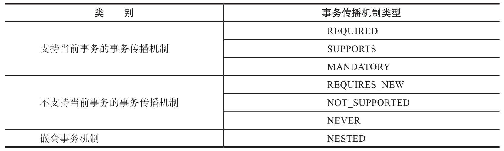{width="6.427890419947507in"
height="1.9263068678915136in"}

> 本节将对这些事务传播机制的类型进行简单的介绍。
>
> 177
>
> 3.4.1　7种事务传播机制类型
>
> Spring中事务传播机制的类型是通过枚举的方式定 义的，源码在
> org.springframework.transaction.annotation.Propag
> ation枚举类中，如下所示。
>
> package org.springframework.transaction.annotation;
>
> import org.springframework.transaction.TransactionDefinition; public
> enum Propagation {
>
> REQUIRED(TransactionDefinition.PROPAGATION_REQUIRED),\
> SUPPORTS(TransactionDefinition.PROPAGATION_SUPPORTS),\
> MANDATORY(TransactionDefinition.PROPAGATION_MANDATORY),
>
> REQUIRES_NEW(TransactionDefinition.PROPAGATION_REQUIRES_NEW),\
> NOT_SUPPORTED(TransactionDefinition.PROPAGATION_NOT_SUPPORTED),
>
> NEVER(TransactionDefinition.PROPAGATION_NEVER),\
> NESTED(TransactionDefinition.PROPAGATION_NESTED);\
> private final int value;
>
> Propagation(int value) { this.value = value; }\
> public int value() { return this.value; }
>
> }
>
> 通过枚举类Propagation的源码可以看出，
> Propagation类中的每个枚举项都与Transaction-
>
> Definition接口中定义的常量相对应。再来看下
> TransactionDefinition接口中定义的常量，如下所示。
>
> package org.springframework.transaction; import java.sql.Connection;
>
> public interface TransactionDefinition {
>
> int PROPAGATION_REQUIRED = 0;\
> int PROPAGATION_SUPPORTS = 1;\
> int PROPAGATION_MANDATORY = 2;
>
> 178
>
> int PROPAGATION_REQUIRES_NEW = 3;\
> int PROPAGATION_NOT_SUPPORTED = 4;\
> int PROPAGATION_NEVER = 5;
>
> int PROPAGATION_NESTED = 6;
>
> int ISOLATION_DEFAULT = -1;
>
> int ISOLATION_READ_UNCOMMITTED =
>
> Connection.TRANSACTION_READ_UNCOMMITTED;
>
> int ISOLATION_READ_COMMITTED = Connection.TRANSACTION_READ_COMMITTED;
>
> int ISOLATION_REPEATABLE_READ =
> Connection.TRANSACTION_REPEATABLE_READ;
>
> int ISOLATION_SERIALIZABLE = Connection.TRANSACTION_SERIALIZABLE;
>
> ##########################省略部分代码########################
>
> }
>
> 在TransactionDefinition接口中定义的 ISOLATION_READ_UNCOMMITTED、ISOLA-
> TION_READ_COMMITTED、ISOLATION_REPEATABLE_READ、
> ISOLATION_SERIALI-ZABLE事务传播类型和JDBC中的事务 传播类型相对应。
>
> 这里需要说明的是，枚举类Propagation结合
> \@Transactional注解使用，枚举类中定义的事务传播行
>
> 为类型与TransactionDefinition接口中定义的事务传播
> 类型相对应。在使用@Transactional注解时，使用的是
> Propagation枚举类中的事务传播类型，而不是直接使用
> TransactionDefinition接口中定义的事务传播类型。
>
> 1.REQUIRED事务传播类型
>
> REQUIRED事务传播类型表示如果当前没有事务，就
> 创建一个事务，如果已经存在一个事务，就加入这个事
> 务。这是最常见的事务传播类型，也是Spring当中默认
> 的事务传播类型。外部不存在事务时，开启新的事务，
>
> 179
>
> 外部存在事务时，将其加入外部事务中。如果调用端发
> 生异常，则调用端和被调用端的事务都将回滚。
>
> 在这种事务传播类型下，当前操作必须在一个事务 中执行。
>
> REQUIRED事务传播类型在Propagation枚举类中的源 码如下所示。
>
> REQUIRED(TransactionDefinition.PROPAGATION_REQUIRED)
>
> 基本用法的代码片段如下所示。
>
> \@Transactional(propagation=Propagation.REQUIRED)
>
> 2.REQUIRES_NEW事务传播类型
>
> REQUIRES_NEW事务传播类型表示如果当前存在事
> 务，则把当前事务挂起，并重新创建新的事务并执行，
>
> 直到新的事务提交或者回滚，才会恢复执行原来的事
> 务。这种事务传播类型具备隔离性，将原有事务和新创
> 建的事务隔离，原有事务和新创建的事务的提交和回滚
> 互不影响。新创建的事务和被挂起的事务没有任何关
> 系，它们是两个不相干的独立事务。外部事务执行失败
> 后回滚，不会回滚内部事务的执行结果。内部事务执行
> 失败抛出异常，被外部事务捕获到时，外部事务可以不
> 处理内部事务的回滚操作。
>
> 180
>
> REQUIRES_NEW事务传播类型在Propagation枚举类中 的源码如下所示。
>
> REQUIRES_NEW(TransactionDefinition.PROPAGATION_REQUIRES_NEW)
>
> 基本用法的代码片段如下所示。
>
> \@Transactional(propagation=Propagation.REQUIRES_NEW)
>
> 3.SUPPORTS事务传播类型
>
> SUPPORTS事务传播类型表示支持当前事务，如果当
> 前没有事务，就以非事务的方式执行。外部不存在事务
> 时，不会开启新的事务，外部存在事务时，将其加入外 部事务。
>
> SUPPORTS事务传播类型在Propagation枚举类中的源 码如下所示。
>
> SUPPORTS(TransactionDefinition.PROPAGATION_SUPPORTS)
>
> 基本用法的代码片段如下所示。
>
> \@Transactional(propagation=Propagation.SUPPORTS)
>
> 4.MANDATORY事务传播类型
>
> 181
>
> MANDATORY事务传播类型表示支持当前事务，这种事
> 务传播类型具备强制性，当前操作必须存在事务，如果 不存在，则抛出异常。
>
> MANDATORY事务传播类型在Propagation枚举类中的 源码如下所示。
>
> MANDATORY(TransactionDefinition.PROPAGATION_MANDATORY)
>
> 基本用法的代码片段如下所示。
>
> \@Transactional(propagation=Propagation.MANDATORY)
>
> 5.NOT_SUPPORTED事务传播类型
>
> NOT_SUPPORTED事务传播类型表示以非事务方式执
> 行，如果当前操作在一个事务中，则把当前事务挂起，
>
> 直到当前操作完成再恢复事务的执行。如果当前操作存
> 在事务，则把事务挂起，以非事务的方式运行。
>
> NOT_SUPPORTED事务传播类型在Propagation枚举类 中的源码如下所示。
>
> NOT_SUPPORTED(TransactionDefinition.PROPAGATION_NOT_SUPPORTED)
>
> 基本用法的代码片段如下所示。
>
> \@Transactional(propagation=Propagation.NOT_SUPPORTED)
>
> 182
>
> 6.NEVER事务传播类型
>
> NEVER事务传播类型表示以非事务的方式执行，如果
> 当前操作存在事务，则抛出异常。
>
> NEVER事务传播类型和NOT_SUPPORTED事务传播类型
> 的区别是如果当前存在事务，则NEVER事务传播类型会抛
>
> 出异常，而NOT_SUPPORTED事务传播类型会把当前事务挂
> 起，以非事务的方式执行。NEVER事务传播类型与
> MANDATORY事务传播类型的区别是NEVER事务传播类型表
> 示如果当前操作存在事务，则抛出异常，而MANDATORY事
> 务传播类型表示如果当前操作不存在事务，则抛出异 常。
>
> NEVER事务传播类型在Propagation枚举类中的源码 如下所示。
>
> NEVER(TransactionDefinition.PROPAGATION_NEVER)
>
> 基本用法的代码片段如下所示。
>
> \@Transactional(propagation=Propagation.NEVER)
>
> 7.NESTED事务传播类型
>
> NESTED事务传播类型表示如果当前方法有一个事务
> 正在运行，则这个方法应该运行在一个嵌套事务中，被
> 嵌套的事务可以独立于被封装的事务进行提交或者回
>
> 183
>
> 滚。如果没有活动事务，则按照REQUIRED事务传播类型 执行。
>
> 如果封装事务存在，并且外层事务抛出异常回滚，
> 那么内层事务必须回滚。如果内层事务回滚，则并不影
> 响外层事务的提交和回滚。如果封装事务不存在，则按
> 照REQUIRED事务传播类型执行。
>
> NESTED事务传播类型在Propagation枚举类中的源码 如下所示。
>
> NESTED(TransactionDefinition.PROPAGATION_NESTED)
>
> 基本用法的代码片段如下所示。
>
> \@Transactional(propagation=Propagation.NESTED)
>
> 184
>
> 3.4.2　常用的事务传播类型
>
> 虽然Spring提供了7种事务传播机制类型，但是在日
> 常工作中经常使用的只有REQU-IRED、NOT_SUPPORTED和 REQUIRES_NEW这3种。
>
> 这3种事务传播类型的使用场景如表3-2所示。
>
> 表3-2　Spring常用事务传播类型使用场景

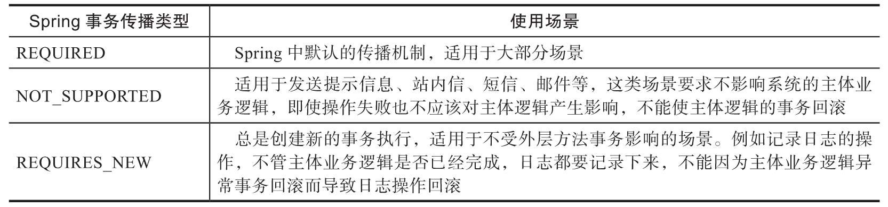{width="6.427891513560805in"
height="1.503961067366579in"}

> 185
>
> 3.5　Spring事务嵌套最佳实践
>
> 3.4节简单介绍了Spring事务传播机制的理论，本节
> 以案例的形式介绍Spring事务传播机制的使用方法。
>
> 186
>
> 3.5.1　环境准备
>
> 电商场景中一个典型的操作就是下单减库存。从本
> 节开始，以下单减库存的场景为例，说明Spring事务传
> 播机制的使用方法。先准备环境。
>
> 第一步：创建Maven项目spring-tx，并在pom.xml文 件中添加Maven依赖。
>
> \<dependencies\>\
> \<dependency\>
>
> \<groupId\>org.springframework\</groupId\>\
> \<artifactId\>spring-context\</artifactId\>\
> \<version\>4.3.21.RELEASE\</version\>
>
> \</dependency\>
>
> \<!\--加入lombok\--\>\
> \<dependency\>
>
> \<groupId\>org.projectlombok\</groupId\>\
> \<artifactId\>lombok\</artifactId\>\
> \<version\>1.18.4\</version\>
>
> \</dependency\>
>
> \<dependency\>\
> \<groupId\>org.aspectj\</groupId\>
>
> \<artifactId\>aspectjweaver\</artifactId\>\
> \<version\>1.9.1\</version\>
>
> \</dependency\>
>
> \<!\--加入日志包\--\>\
> \<dependency\>
>
> \<groupId\>ch.qos.logback\</groupId\>\
> \<artifactId\>logback-core\</artifactId\>\
> \<version\>1.1.2\</version\>
>
> \</dependency\>\
> \<dependency\>
>
> \<groupId\>ch.qos.logback\</groupId\>\
> \<artifactId\>logback-classic\</artifactId\>\
> \<version\>1.1.2\</version\>
>
> \</dependency\>
>
> 187
>
> \<dependency\>\
> \<groupId\>org.slf4j\</groupId\>
>
> \<artifactId\>slf4j-api\</artifactId\>\
> \<version\>1.7.7\</version\>
>
> \</dependency\>
>
> \<dependency\>\
> \<groupId\>org.springframework\</groupId\>
>
> \<artifactId\>spring-jdbc\</artifactId\>\
> \<version\>4.3.21.RELEASE\</version\>
>
> \</dependency\>
>
> \<dependency\>\
> \<groupId\>mysql\</groupId\>
>
> \<artifactId\>mysql-connector-java\</artifactId\>\
> \<version\>5.1.46\</version\>\
> \<scope\>runtime\</scope\>
>
> \</dependency\>
>
> \<dependency\>\
> \<groupId\>com.alibaba\</groupId\>
>
> \<artifactId\>druid\</artifactId\>\
> \<version\>1.1.8\</version\>
>
> \</dependency\>
>
> \</dependencies\>
>
> 第二步：创建用于测试的实体类，在
> io.transaction.spring.entity包下分别创建订单类
>
> Order和商品类Product，如下所示。
>
> 创建订单类Order代码如下。
>
> public class Order {
>
> /\*\*
>
> \* 数据id
>
> \*/
>
> private Long id;\
> /\*\*
>
> \* 订单编号
>
> \*/
>
> private String orderNo;\
> #########省略get/set方法#############
>
> }
>
> 188
>
> 创建商品类Product代码如下。
>
> public class Product {
>
> /\*\*
>
> \* 数据id
>
> \*/
>
> private Long id;\
> /\*\*
>
> \* 商品名称
>
> \*/
>
> private String productName;\
> /\*\*
>
> \* 商品价格
>
> \*/
>
> private BigDecimal productPrice;\
> /\*\*
>
> \* 库存数量
>
> \*/
>
> private Integer stockCount;\
> ##########省略get/set方法##############
>
> }
>
> 注意，这里为了方便展示，简写了订单类和商品类
> 的实体类，在实际开发过程中，订单类和商品类的设计 远比本节描述的复杂。
>
> 第三步：创建操作数据库的Dao类。在
> io.transaction.spring.dao包下分别创建OrderDao类和
>
> ProductDao类，如下所示。
>
> OrderDao类主要用于操作数据库中的订单数据并提
> 供保存订单的方法。创建OrderDao类代码如下。
>
> \@Repository
>
> public class OrderDao {
>
> \@Autowired
>
> private JdbcTemplate jdbcTemplate;
>
> 189
>
> public int saveOrder(Order order){
>
> String sql = \"insert into order_info (id, order_no)
>
> values (?, ?)\";
>
> return jdbcTemplate.update(sql, order.getId(),
>
> order.getOrderNo());
>
> }\
> }
>
> ProductDao类主要用于操作数据库中的商品信息并
> 提供扣减库存的方法。创建Product-Dao类代码如下。
>
> \@Repository
>
> public class ProductDao {
>
> \@Autowired
>
> private JdbcTemplate jdbcTemplate;
>
> public int updateProductStockCountById(Integer stockCount, Long id){
>
> String sql = \"update product_info set stock_count = stock_count - ?
> where id = ?\";
>
> return jdbcTemplate.update(sql, stockCount, id);\
> }
>
> }
>
> 第四步：创建Service类。在 io.transaction.spring.service包下分别创建
>
> OrderServcie类和ProductService类，如下所示。
>
> OrderService类调用OrderDao类，实现保存订单的
> 操作，同时会调用ProductService的方法实现减库存的
> 操作。创建OrderService类代码如下。
>
> \@Service
>
> public class OrderService {
>
> \@Autowired
>
> private OrderDao orderDao;\
> \@Autowired
>
> 190
>
> private ProductService productService;
>
> public void submitOrder(){
>
> //生成订单
>
> Order order = new Order();
>
> long number = Math.abs(new Random().nextInt(500));\
> order.setId(number);
>
> order.setOrderNo(\"order\_\" + number);\
> orderDao.saveOrder(order);
>
> //减库存
>
> productService.updateProductStockCountById(1, 1L);\
> }
>
> }
>
> ProductServcie类的主要作用是扣减库存，创建 ProductService类代码如下。
>
> \@Service
>
> public class ProductService {
>
> \@Autowired
>
> private ProductDao productDao;
>
> public void updateProductStockCountById(Integer stockCount, Long id){
>
> productDao.updateProductStockCountById(stockCount, id);\
> int i = 1 / 0;
>
> }\
> }
>
> 注意在ProductService类的
> updateProductStockCountById()方法中，有一行代码为
>
> int i=1/0，说明这个方法会抛出异常。
>
> 第五步：创建配置类。在 io.transaction.spring.config包下创建配置类
>
> MainConfig，如下所示。
>
> 191
>
> \@EnableTransactionManagement
>
> \@Configuration
>
> \@ComponentScan(basePackages = {\"io.transaction.spring\"})\
> public class MainConfig {
>
> \@Bean
>
> public DataSource dataSource(){
>
> DruidDataSource dataSource = new DruidDataSource();
>
> dataSource.setUsername(\"root\");\
> dataSource.setPassword(\"root\");\
> dataSource.setUrl(\"jdbc:mysql://localhost:3306/spring-
>
> tx\");
>
> dataSource.setDriverClassName(\"com.mysql.jdbc.Driver\");
>
> return dataSource;
>
> }\
> \@Bean
>
> public JdbcTemplate jdbcTemplate(DataSource dataSource){
>
> return new JdbcTemplate(dataSource);\
> }
>
> \@Bean
>
> public PlatformTransactionManager transactionManager(DataSource
> dataSource) {
>
> return new DataSourceTransactionManager(dataSource);\
> }
>
> }
>
> MainConfig类的作用是开始Spring事务管理，扫描
> io.transaction.spring包下的类，将DataSource、
> JdbcTemplate和PlatformTransactionManager对象加载 到IOC容器中。
>
> 第六步：创建系统启动类，也是整个程序的运行入
> 口类。在io.transaction.spring包下创建Main类，用于
>
> 启动应用程序，如下所示。
>
> public class Main {
>
> public static void main(String\[\] args){
>
> AnnotationConfigApplicationContext context = new
> AnnotationConfigApplicationContext(MainConfig.class);
>
> OrderService orderService = context.getBean(OrderService.class);
>
> orderService.submitOrder();
>
> 192
>
> }\
> }
>
> 第七步：创建数据库spring-tx，并在spring-tx数
> 据库中创建order_info数据表和product_info数据表， 如下所示。
>
> create database if not exists spring-tx;
>
> CREATE TABLE IF NOT EXISTS order_info (
>
> \`id\` bigint(20) NOT NULL,\
> \`order_no\` varchar(50) DEFAULT \'\',\
> PRIMARY KEY (\`id\`)
>
> ) ENGINE=InnoDB DEFAULT CHARSET=utf8mb4;
>
> CREATE TABLE IF NOT EXISTS product_info (
>
> \`id\` bigint(20) NOT NULL,
>
> \`product_name\` varchar(50) DEFAULT NULL,\
> \`product_price\` decimal(10,2) DEFAULT NULL,\
> \`stock_count\` int(11) DEFAULT NULL,
>
> PRIMARY KEY (\`id\`)
>
> ) ENGINE=InnoDB DEFAULT CHARSET=utf8mb4;
>
> 向product_info数据表中插入基础数据，如下所
>
> 示。
>
> INSERT INTO \`spring-tx\`.\`product_info\`(\`id\`, \`product_name\`,
> \`product_price\`, \`stock_count\`) VALUES (1, \'笔记本电脑\',
> 10000.00, 100);
>
> 此时查询order_info数据表和product_info数据表 中的数据，如下所示。
>
> mysql\> select \* from order_info; Empty set (0.00 sec)
>
> 193
>
> mysql\> select \* from product_info;\
> +\-\-\--+\-\-\-\-\-\-\-\-\-\-\-\-\-\-\-\--+\-\-\-\-\-\-\-\-\-\-\-\-\-\--+\-\-\-\-\-\-\-\-\-\-\-\--+
>
> \| id \| product_name \| product_price \| stock_count \|\
> +\-\-\--+\-\-\-\-\-\-\-\-\-\-\-\-\-\-\-\--+\-\-\-\-\-\-\-\-\-\-\-\-\-\--+\-\-\-\-\-\-\-\-\-\-\-\--+
>
> \| 1 \| 笔记本电脑 \| 10000.00 \| 100 \|\
> +\-\-\--+\-\-\-\-\-\-\-\-\-\-\-\-\-\-\-\--+\-\-\-\-\-\-\-\-\-\-\-\-\-\--+\-\-\-\-\-\-\-\-\-\-\-\--+
>
> 1 row in set (0.00 sec)
>
> 至此，准备工作就完成了。接下来验证Spring中的 各个事务传播机制的类型。
>
> 194
>
> 3.5.2　最佳实践场景一
>
> 场景一为外部方法无事务注解，内部方法添加 REQUIRED事务传播类型。
>
> 第一步：在OrderService类的submitOrder()方法上 不添加注解，如下所示。
>
> public void submitOrder(){
>
> //生成订单
>
> Order order = new Order();
>
> long number = Math.abs(new Random().nextInt(500));\
> order.setId(number);
>
> order.setOrderNo(\"order\_\" + number);\
> orderDao.saveOrder(order);
>
> //

减库存

> productService.updateProductStockCountById(1, 1L);
>
> }
>
> 第二步：在ProductService类的
>
> updateProductStockCountById()方法中添加@Transac-
> tional(propagation=Propagation.REQUIRED)注解，如 下所示。
>
> \@Transactional(propagation = Propagation.REQUIRED)
>
> public void updateProductStockCountById(Integer stockCount, Long id){
>
> productDao.updateProductStockCountById(stockCount, id);\
> int i = 1 / 0;
>
> }
>
> 195
>
> 第三步：运行Main类中的main()方法，抛出了如下 异常。
>
> Exception in thread \"main\" java.lang.ArithmeticException: / by zero
>
> 这是因ProductService类的
> updateProductStockCountById()方法中存在如下代码而
>
> 引起的。
>
> int i = 1 / 0;
>
> 第四步：查询order_info表和product_info表中的 数据，如下所示。
>
> mysql\> select \* from order_info;\
> +\-\-\-\--+\-\-\-\-\-\-\-\-\-\--+
>
> \| id \| order_no \|\
> +\-\-\-\--+\-\-\-\-\-\-\-\-\-\--+
>
> \| 172 \| order_172 \|\
> +\-\-\-\--+\-\-\-\-\-\-\-\-\-\--+
>
> 1 row in set (0.00 sec)
>
> mysql\> select \* from product_info;\
> +\-\-\--+\-\-\-\-\-\-\-\-\-\-\-\-\-\-\-\--+\-\-\-\-\-\-\-\-\-\-\-\-\-\--+\-\-\-\-\-\-\-\-\-\-\-\--+
>
> \| id \| product_name \| product_price \| stock_count \|\
> +\-\-\--+\-\-\-\-\-\-\-\-\-\-\-\-\-\-\-\--+\-\-\-\-\-\-\-\-\-\-\-\-\-\--+\-\-\-\-\-\-\-\-\-\-\-\--+
>
> \| 1 \| 笔记本电脑 \| 10000.00 \| 100 \|\
> +\-\-\--+\-\-\-\-\-\-\-\-\-\-\-\-\-\-\-\--+\-\-\-\-\-\-\-\-\-\-\-\-\-\--+\-\-\-\-\-\-\-\-\-\-\-\--+
>
> 1 row in set (0.00 sec)
>
> 可以看到，当OrderService类的submitOrder()方法
> 上不添加注解，而ProductService类的
> updateProductStockCountById()方法中添加
>
> 196
>
> \@Transactional(propagation=Propagation.REQUIRED)
> 注解，并且ProductService类的
> updateProductStockCountById()方法抛出异常时，
> OrderService类的submitOrder()方法执行成功，向数据
> 库保存订单信息。ProductService类的
> updateProductStockCountById()方法执行失败抛出异 常，并没有扣减库存。
>
> 总结：外部方法无事务注解，内部方法添加
> REQUIRED事务传播类型时，内部方法抛出异常。内部
>
> 方法执行失败，不会影响外部方法的执行，外部方法执 行成功。
>
> 197
>
> 3.5.3　最佳实践场景二
>
> 场景二为外部方法添加REQUIRED事务传播类型，内 部方法无事务注解。
>
> 第一步：在OrderService类的submitOrder()方法上
>
> 添加 \@Transactional(propagation=Propagation.REQUIRED)
> 注解，如下所示。
>
> \@Transactional(propagation = Propagation.REQUIRED) public void
> submitOrder(){
>
> //生成订单
>
> Order order = new Order();
>
> long number = Math.abs(new Random().nextInt(500));\
> order.setId(number);
>
> order.setOrderNo(\"order\_\" + number);\
> orderDao.saveOrder(order);
>
> //

减库存

> productService.updateProductStockCountById(1, 1L);
>
> }
>
> 第二步：ProductService类的
>
> updateProductStockCountById()方法上不添加注解，如 下所示。
>
> public void updateProductStockCountById(Integer stockCount, Long id){
>
> productDao.updateProductStockCountById(stockCount, id);\
> int i = 1 / 0;
>
> }
>
> 198
>
> 第三步：运行Main类中的main()方法，抛出了如下 异常。
>
> Exception in thread \"main\" java.lang.ArithmeticException: / by zero
>
> 第四步：查询order_info表和product_info表中的 数据，如下所示。
>
> mysql\> select \* from order_info;\
> Empty set (0.00 sec)
>
> mysql\> select \* from product_info;\
> +\-\-\--+\-\-\-\-\-\-\-\-\-\-\-\-\-\-\-\--+\-\-\-\-\-\-\-\-\-\-\-\-\-\--+\-\-\-\-\-\-\-\-\-\-\-\--+
>
> \| id \| product_name \| product_price \| stock_count \|\
> +\-\-\--+\-\-\-\-\-\-\-\-\-\-\-\-\-\-\-\--+\-\-\-\-\-\-\-\-\-\-\-\-\-\--+\-\-\-\-\-\-\-\-\-\-\-\--+
>
> \| 1 \| 笔记本电脑 \| 10000.00 \| 100 \|\
> +\-\-\--+\-\-\-\-\-\-\-\-\-\-\-\-\-\-\-\--+\-\-\-\-\-\-\-\-\-\-\-\-\-\--+\-\-\-\-\-\-\-\-\-\-\-\--+
>
> 1 row in set (0.00 sec)
>
> 可以看到，当OrderService类的submitOrder()方法 上添加
> \@Transactional(propagation=Propagation.REQUIRED)
> 注解，而ProductService类的
> updateProductStockCountById()方法不添加事务注解，
> 并且ProductService类的 updateProductStockCountById()方法抛出异常时，
> OrderService类的submitOrder()方法和ProductService
> 类的updateProductStockCountById()方法都执行失败。
>
> 总结：外部方法添加REQUIRED事务传播类型，内
> 部方法无事务注解时，内部方法抛出异常，会影响外部
>
> 199
>
> 方法的执行，导致外部方法的事务回滚。
>
> 200
>
> 3.5.4　最佳实践场景三
>
> 场景三为外部方法添加REQUIRED事务传播类型，内
> 部方法添加REQUIRED事务传播类型。
>
> 第一步：在OrderService类的submitOrder()方法上
>
> 添加 \@Transactional(propagation=Propagation.REQUIRED)
> 注解，如下所示。
>
> \@Transactional(propagation = Propagation.REQUIRED) public void
> submitOrder(){
>
> //生成订单
>
> Order order = new Order();
>
> long number = Math.abs(new Random().nextInt(500));\
> order.setId(number);
>
> order.setOrderNo(\"order\_\" + number);\
> orderDao.saveOrder(order);
>
> //

减库存

> productService.updateProductStockCountById(1, 1L);
>
> }
>
> 第二步：在ProductService类的
>
> updateProductStockCountById()方法上添加@Transac-
> tional(propagation=Propagation.REQUIRED)注解，如 下所示。
>
> \@Transactional(propagation = Propagation.REQUIRED)
>
> public void updateProductStockCountById(Integer stockCount, Long id){
>
> productDao.updateProductStockCountById(stockCount, id);
>
> 201
>
> int i = 1 / 0;\
> }
>
> 第三步：运行Main类中的main()方法，抛出了如下 异常。
>
> Exception in thread \"main\" java.lang.ArithmeticException: / by zero
>
> 第四步：查询order_info表和product_info表中的 数据，如下所示。
>
> mysql\> select \* from order_info;\
> Empty set (0.00 sec)
>
> mysql\> select \* from product_info;\
> +\-\-\--+\-\-\-\-\-\-\-\-\-\-\-\-\-\-\-\--+\-\-\-\-\-\-\-\-\-\-\-\-\-\--+\-\-\-\-\-\-\-\-\-\-\-\--+
>
> \| id \| product_name \| product_price \| stock_count \|\
> +\-\-\--+\-\-\-\-\-\-\-\-\-\-\-\-\-\-\-\--+\-\-\-\-\-\-\-\-\-\-\-\-\-\--+\-\-\-\-\-\-\-\-\-\-\-\--+
>
> \| 1 \| 笔记本电脑 \| 10000.00 \| 100 \|\
> +\-\-\--+\-\-\-\-\-\-\-\-\-\-\-\-\-\-\-\--+\-\-\-\-\-\-\-\-\-\-\-\-\-\--+\-\-\-\-\-\-\-\-\-\-\-\--+
>
> 1 row in set (0.00 sec)
>
> 可以看到，当OrderService类的submitOrder()方法 上添加
> \@Transactional(propagation=Propagation.REQUIRED)
> 注解，ProductService类的 updateProductStockCountById()方法上添加
> \@Transactional(propagation=Propagation.REQUIRED)
> 注解，并且ProductService类的
> updateProductStockCountById()方法抛出异常时，
> OrderService类的submitOrder()方法和ProductService
> 类的updateProductStockCountById()方法都执行失败。
>
> 202
>
> 总结：外部方法添加REQUIRED事务传播类型，内
> 部方法添加REQUIRED事务传播类型时，内部方法抛出
> 异常，会影响外部方法的执行，事务会回滚。
>
> 203
>
> 3.5.5　最佳实践场景四
>
> 场景四为外部方法添加REQUIRED事务传播类型，内
> 部方法添加NOT_SUPPORTED事务传播类型。
>
> 第一步：在OrderService类的submitOrder()方法上
>
> 添加 \@Transactional(propagation=Propagation.REQUIRED)
> 注解，如下所示。
>
> \@Transactional(propagation = Propagation.REQUIRED) public void
> submitOrder(){
>
> //生成订单
>
> Order order = new Order();
>
> long number = Math.abs(new Random().nextInt(500));\
> order.setId(number);
>
> order.setOrderNo(\"order\_\" + number);\
> orderDao.saveOrder(order);
>
> //

减库存

> productService.updateProductStockCountById(1, 1L);
>
> }
>
> 第二步：在ProductService类的
>
> updateProductStockCountById()方法上添加@Transac-
> tional(propagation=Propagation.NOT_SUPPORTED)注 解，如下所示。
>
> \@Transactional(propagation = Propagation. NOT_SUPPORTED)
>
> public void updateProductStockCountById(Integer stockCount, Long id){
>
> productDao.updateProductStockCountById(stockCount, id);
>
> 204
>
> int i = 1 / 0;\
> }
>
> 第三步：运行Main类中的main()方法，抛出了如下 异常。
>
> Exception in thread \"main\" java.lang.ArithmeticException: / by zero
>
> 第四步：查询order_info表和product_info表中的 数据，如下所示。
>
> mysql\> select \* from order_info;\
> Empty set (0.00 sec)
>
> mysql\> select \* from product_info;\
> +\-\-\--+\-\-\-\-\-\-\-\-\-\-\-\-\-\-\-\--+\-\-\-\-\-\-\-\-\-\-\-\-\-\--+\-\-\-\-\-\-\-\-\-\-\-\--+
>
> \| id \| product_name \| product_price \| stock_count \|\
> +\-\-\--+\-\-\-\-\-\-\-\-\-\-\-\-\-\-\-\--+\-\-\-\-\-\-\-\-\-\-\-\-\-\--+\-\-\-\-\-\-\-\-\-\-\-\--+
>
> \| 1 \| 笔记本电脑 \| 10000.00 \| 99 \|\
> +\-\-\--+\-\-\-\-\-\-\-\-\-\-\-\-\-\-\-\--+\-\-\-\-\-\-\-\-\-\-\-\-\-\--+\-\-\-\-\-\-\-\-\-\-\-\--+
>
> 1 row in set (0.00 sec)
>
> 可以看到，当OrderService类的submitOrder()方法 上添加
> \@Transactional(propagation=Propagation.REQUIRED)
> 注解，ProductService类的 updateProductStockCountById()方法上添加
> \@Transactional(propagation=Propagation.NOT_SUPPOR
> TED)注解，并且ProductService类的
> updateProductStockCountById()方法抛出异常时，
> OrderService类的submitOrder()方法执行失败，
>
> 205
>
> ProductService类的updateProductStockCountById()方 法执行成功。
>
> 总结：外部方法添加REQUIRED事务传播类型，内
> 部方法添加NOT_SUPPORTED事务传播类型时，内部方
>
> 法抛异常，如果外部方法执行成功，事务会提交，如果
> 外部方法执行失败，事务会回滚。
>
> 206
>
> 3.5.6　最佳实践场景五
>
> 场景五为外部方法添加REQUIRED事务传播类型，内
> 部方法添加REQUIRES_NEW事务传播类型。
>
> 第一步：在OrderService类的submitOrder()方法上
>
> 添加 \@Transactional(propagation=Propagation.REQUIRED)
> 注解，如下所示。
>
> \@Transactional(propagation = Propagation.REQUIRED) public void
> submitOrder(){
>
> //生成订单
>
> Order order = new Order();
>
> long number = Math.abs(new Random().nextInt(500));\
> order.setId(number);
>
> order.setOrderNo(\"order\_\" + number);\
> orderDao.saveOrder(order);
>
> //

减库存

> productService.updateProductStockCountById(1, 1L);
>
> }
>
> 第二步：在ProductService类的
>
> updateProductStockCountById()方法上添加@Transac-
> tional(propagation=Propagation.REQUIRES_NEW)注 解，如下所示。
>
> \@Transactional(propagation = Propagation.REQUIRES_NEW)
>
> public void updateProductStockCountById(Integer stockCount, Long id){
>
> productDao.updateProductStockCountById(stockCount, id);
>
> 207
>
> int i = 1 / 0;\
> }
>
> 第三步：运行Main类中的main()方法，抛出了如下 异常。
>
> Exception in thread \"main\" java.lang.ArithmeticException: / by zero
>
> 第四步：查询order_info表和product_info表中的 数据，如下所示。
>
> mysql\> select \* from order_info;\
> Empty set (0.00 sec)
>
> mysql\> select \* from product_info;\
> +\-\-\--+\-\-\-\-\-\-\-\-\-\-\-\-\-\-\-\--+\-\-\-\-\-\-\-\-\-\-\-\-\-\--+\-\-\-\-\-\-\-\-\-\-\-\--+
>
> \| id \| product_name \| product_price \| stock_count \|\
> +\-\-\--+\-\-\-\-\-\-\-\-\-\-\-\-\-\-\-\--+\-\-\-\-\-\-\-\-\-\-\-\-\-\--+\-\-\-\-\-\-\-\-\-\-\-\--+
>
> \| 1 \| 笔记本电脑 \| 10000.00 \| 100 \|\
> +\-\-\--+\-\-\-\-\-\-\-\-\-\-\-\-\-\-\-\--+\-\-\-\-\-\-\-\-\-\-\-\-\-\--+\-\-\-\-\-\-\-\-\-\-\-\--+
>
> 1 row in set (0.00 sec)
>
> 可以看出，当OrderService类的submitOrder()方法 上添加
> \@Transactional(propagation=Propagation.REQUIRED)
> 注解，ProductService类的 updateProductStockCountById()方法上添加
> \@Transactional(propagation=Propagation.REQUIRES_N
> EW)注解，并且ProductService类的
> updateProductStockCountById()方法抛出异常时，
> OrderService类的submitOrder()方法和ProductService
>
> 208
>
> 类的updateProductStockCountById()方法都会执行失 败，事务回滚。
>
> 总结：外部方法添加REQUIRED事务传播类型，内
> 部方法添加REQUIRES_NEW事务传播类型，内部方法抛
>
> 出异常时，内部方法和外部方法都会执行失败，事务回 滚。
>
> 209
>
> 3.5.7　最佳实践场景六
>
> 场景六为外部方法添加REQUIRED事务传播类型，内
> 部方法添加REQUIRES_NEW事务传播类型，并且把异常代
> 码移动到外部方法的末尾。
>
> 第一步：在OrderService类的submitOrder()方法上
>
> 添加 \@Transactional(propagation=Propagation.REQUIRED)
> 注解，并且在该方法末尾添加int i=1/0，代码如下所 示。
>
> \@Transactional(propagation = Propagation.REQUIRED) public void
> submitOrder(){
>
> //生成订单
>
> Order order = new Order();
>
> long number = Math.abs(new Random().nextInt(500));\
> order.setId(number);
>
> order.setOrderNo(\"order\_\" + number);\
> orderDao.saveOrder(order);
>
> //

减库存

> productService.updateProductStockCountById(1, 1L);
>
> int i = 1 / 0;
>
> }
>
> 第二步：在ProductService类的
>
> updateProductStockCountById()方法上添加@Transac-
> tional(propagation=Propagation.REQUIRES_NEW)注 解，去除int
> i=1/0，代码如下所示。
>
> 210
>
> \@Transactional(propagation = Propagation.REQUIRES_NEW)
>
> public void updateProductStockCountById(Integer stockCount, Long id){
>
> productDao.updateProductStockCountById(stockCount, id);\
> }
>
> 第三步：运行Main类中的main()方法，抛出了如下 异常。
>
> Exception in thread \"main\" java.lang.ArithmeticException: / by zero
>
> 第四步；查询order_info表和product_info表中的 数据，如下所示。
>
> mysql\> select \* from order_info;\
> Empty set (0.00 sec)
>
> mysql\> select \* from product_info;\
> +\-\-\--+\-\-\-\-\-\-\-\-\-\-\-\-\-\-\-\--+\-\-\-\-\-\-\-\-\-\-\-\-\-\--+\-\-\-\-\-\-\-\-\-\-\-\--+
>
> \| id \| product_name \| product_price \| stock_count \|\
> +\-\-\--+\-\-\-\-\-\-\-\-\-\-\-\-\-\-\-\--+\-\-\-\-\-\-\-\-\-\-\-\-\-\--+\-\-\-\-\-\-\-\-\-\-\-\--+
>
> \| 1 \| 笔记本电脑 \| 10000.00 \| 99 \|\
> +\-\-\--+\-\-\-\-\-\-\-\-\-\-\-\-\-\-\-\--+\-\-\-\-\-\-\-\-\-\-\-\-\-\--+\-\-\-\-\-\-\-\-\-\-\-\--+
>
> 1 row in set (0.00 sec)
>
> 可以看出，OrderService类的submitOrder()方法上
>
> 添加 \@Transactional(propagation=Propagation.REQUIRED)
> 注解，并且在该方法末尾添加int i=1/0，在
> ProductService类的updateProductStockCountById()方 法上添加
>
> \@Transactional(propagation=Propagation.REQUIRES_N EW)注解，去除int
> i=1/0。
>
> 211
>
> updateProductStockCountById()方法抛出异常时，
> OrderService类的submitOrder()方法执行失败，事务回
> 滚。ProductService类的
> updateProductStockCountById()方法执行成功，事务提 交。
>
> 总结：外部方法添加REQUIRED事务传播类型，内
> 部方法添加REQUIRES_NEW事务传播类型，并且把异常
>
> 代码移动到外部方法的末尾，内部方法抛异常时，外部
> 方法执行失败，事务回滚；内部方法执行成功时，事务 提交。
>
> 212
>
> 3.5.8　最佳实践场景七
>
> 场景七为外部方法添加REQUIRED事务传播类型，内
> 部方法添加REQUIRES_NEW事务传播类型，并且把异常代
> 码移动到外部方法的末尾，同时外部方法和内部方法在 同一个类中。
>
> 第一步：在OrderService类的submitOrder()方法上
>
> 添加 \@Transactional(propagation=Propagation.REQUIRED)
> 注解，并且在OrderService类的submitOrder()方法末尾 添加int
> i=1/0，如下所示。
>
> \@Transactional(propagation = Propagation.REQUIRED) public void
> submitOrder(){
>
> //生成订单
>
> Order order = new Order();
>
> long number = Math.abs(new Random().nextInt(500));\
> order.setId(number);
>
> order.setOrderNo(\"order\_\" + number);\
> orderDao.saveOrder(order);
>
> //

减库存

> this.updateProductStockCountById(1, 1L);
>
> int i = 1 / 0;
>
> }
>
> 这里需要注意
>
> productService.updateProductStockCountById(1,1L) 这行代码已经变成了
> this.updateProductStockCountById(1,1L)。
>
> 213
>
> 第二步：在OrderService类中添加
> updateProductStockCountById()方法，如下所示。
>
> \@Transactional(propagation = Propagation.REQUIRES_NEW)
>
> public void updateProductStockCountById(Integer stockCount, Long id){
>
> productDao.updateProductStockCountById(stockCount, id);\
> }
>
> 第三步：运行Main类中的main()方法，抛出了如下 异常。
>
> Exception in thread \"main\" java.lang.ArithmeticException: / by zero
>
> 第四步：查询order_info表和product_info表中的 数据，如下所示。
>
> mysql\> select \* from order_info;\
> Empty set (0.00 sec)
>
> mysql\> select \* from product_info;\
> +\-\-\--+\-\-\-\-\-\-\-\-\-\-\-\-\-\-\-\--+\-\-\-\-\-\-\-\-\-\-\-\-\-\--+\-\-\-\-\-\-\-\-\-\-\-\--+
>
> \| id \| product_name \| product_price \| stock_count \|\
> +\-\-\--+\-\-\-\-\-\-\-\-\-\-\-\-\-\-\-\--+\-\-\-\-\-\-\-\-\-\-\-\-\-\--+\-\-\-\-\-\-\-\-\-\-\-\--+
>
> \| 1 \| 笔记本电脑 \| 10000.00 \| 100 \|\
> +\-\-\--+\-\-\-\-\-\-\-\-\-\-\-\-\-\-\-\--+\-\-\-\-\-\-\-\-\-\-\-\-\-\--+\-\-\-\-\-\-\-\-\-\-\-\--+
>
> 1 row in set (0.00 sec)
>
> 可以看出，在OrderService类的submitOrder()方法 上添加
> \@Transactional(propagation=Propagation.REQUIRED)
> 注解，在OrderService类的submitOrder()方法末尾添加
>
> 214
>
> int i=1/0代码，同时在OrderService类中添加
> updateProductStockCountById()方法，update-
> ProductStockCountById()方法抛出异常时，
> OrderService类的submitOrder()方法和update-
> ProductStockCountById()方法执行失败，事务回滚。
>
> 总结：外部方法添加REQUIRED事务传播类型，内
> 部方法添加REQUIRES_NEW事务传播类型，并且把异常
>
> 代码移动到外部方法的末尾，同时外部方法和内部方法
> 在同一个类中，内部方法抛出异常，外部方法和内部方
> 法都会执行失败，事务回滚。
>
> 215
>
> 3.6　Spring事务失效的场景
>
> 在日常工作中，如果Spring的事务管理功能使用不
> 当，会造成Spring事务不生效的问题。本节简单总结一
> 下在哪些场景下Spring的事务会不生效。
>
> 216
>
> 3.6.1　数据库不支持事务
>
> Spring事务生效的前提是连接的数据库支持事务，
> 如果底层的数据库不支持事务，则Spring的事务肯定会
> 失效。例如，使用的数据库为MySQL，并且选用了MyISAM
>
> 存储引擎，则Spring的事务就会失效。
>
> 217
>
> 3.6.2　事务方法未被Spring管理
>
> 如果事务方法所在的类没有加载到Spring IOC容器
> 中，也就是说，事务方法所在的类没有被Spring管理，
> 则Spring事务会失效，示例如下。
>
> public class ProductService {
>
> \@Autowired
>
> private ProductDao productDao;
>
> \@Transactional(propagation = Propagation.REQUIRES_NEW)\
> public void updateProductStockCountById(Integer stockCount,
>
> Long id){
>
> productDao.updateProductStockCountById(stockCount, id);
>
> }\
> }
>
> ProductService类上没有添加@Service注解，
> Product的实例也没有加载到Spring IOC容器中，就会造
>
> 成updateProductStockCountById()方法的事务在Spring 中失效。
>
> 218
>
> 3.6.3　方法没有被public修饰
>
> 如果事务所在的方法没有被public修饰，此时
> Spring的事务会失效，如下代码所示。
>
> \@Service
>
> public class ProductService {
>
> \@Autowired
>
> private ProductDao productDao;
>
> \@Transactional(propagation = Propagation.REQUIRES_NEW)\
> private void updateProductStockCountById(Integer stockCount,
>
> Long id){
>
> productDao.updateProductStockCountById(stockCount, id);
>
> }\
> }
>
> 虽然ProductService上添加了@Service注解，同时
> updateProductStockCountById()方法上添加了
> \@Transactional(propagation=Propagation.REQUIRES_N
> EW)注解，但是因为updateProductStockCountById()方
> 法为内部的私有方法（使用private修饰），所以此时
> updateProductStockCountById()方法的事务在Spring中 还是会失效。
>
> 219
>
> 3.6.4　同一类中的方法调用
>
> 如果同一个类中的两个方法A和B上均添加了事务注
> 解，方法A调用方法B，则方法B的事务会失效，示例如 下。
>
> \@Service
>
> public class OrderService {
>
> \@Autowired
>
> private OrderDao orderDao;\
> \@Autowired
>
> private ProductDao productDao;
>
> public void submitOrder(){
>
> //生成订单
>
> Order order = new Order();
>
> long number = Math.abs(new Random().nextInt(500));\
> order.setId(number);
>
> order.setOrderNo(\"order\_\" + number);\
> orderDao.saveOrder(order);
>
> //减库存
>
> this.updateProductStockCountById(1, 1L);\
> }
>
> \@Transactional(propagation = Propagation.REQUIRES_NEW)\
> public void updateProductStockCountById(Integer stockCount,
>
> Long id){
>
> productDao.updateProductStockCountById(stockCount, id);
>
> }\
> }
>
> submitOrder()方法和 updateProductStockCountById()方法都在OrderService
>
> 类中，submitOrder()方法上没有添加事务注解，
> updateProductStockCountById()方法上标注了事务注
>
> 220
>
> 解，submitOrder()方法调用了 updateProductStockCountById()方法，此时
> updateProduct-StockCountById()方法的事务在Spring 中会失效。
>
> 221
>
> 3.6.5　未配置事务管理器
>
> 如果在项目中没有配置Spring的事务管理器，即使
> 使用了Spring的事务管理功能，Spring的事务也不会生
> 效，例如没有在项目的配置类中配置如下代码。
>
> \@Bean
>
> public PlatformTransactionManager transactionManager(DataSource
> dataSource) {
>
> return new DataSourceTransactionManager(dataSource);\
> }
>
> 此时，Spring的事务就会失效。
>
> 222
>
> 3.6.6　方法的事务传播类型不支持事务
>
> 如果内部方法的事务传播类型为不支持事务的传播
> 类型，则内部方法的事务在Spring中会失效，示例如 下。
>
> \@Service
>
> public class OrderService {
>
> \@Autowired
>
> private OrderDao orderDao;\
> \@Autowired
>
> private ProductDao productDao;
>
> \@Transactional(propagation = Propagation.REQUIRED)\
> public void submitOrder(){
>
> //生成订单
>
> Order order = new Order();
>
> long number = Math.abs(new Random().nextInt(500));\
> order.setId(number);
>
> order.setOrderNo(\"order\_\" + number);\
> orderDao.saveOrder(order);
>
> //减库存
>
> this.updateProductStockCountById(1, 1L);\
> }
>
> \@Transactional(propagation = Propagation.NOT_SUPPORTED)\
> public void updateProductStockCountById(Integer stockCount,
>
> Long id){
>
> productDao.updateProductStockCountById(stockCount, id);
>
> }\
> }
>
> 由于updateProductStockCountById()方法的事务传
> 播类型为NOT_SUPPORTED，不支持事务，因此
>
> 223
>
> updateProductStockCountById()方法的事务会在Spring 中失效。
>
> 224
>
> 3.6.7　不正确地捕获异常
>
> 不正确地捕获异常也会导致Spring的事务失效，示 例如下。
>
> \@Service
>
> public class OrderService {
>
> \@Autowired
>
> private OrderDao orderDao;\
> \@Autowired
>
> private ProductDao productDao;
>
> \@Transactional(propagation = Propagation.REQUIRED)\
> public void submitOrder(){
>
> //生成订单
>
> Order order = new Order();
>
> long number = Math.abs(new Random().nextInt(500));\
> order.setId(number);
>
> order.setOrderNo(\"order\_\" + number);\
> orderDao.saveOrder(order);
>
> //减库存
>
> this.updateProductStockCountById(1, 1L);\
> }
>
> \@Transactional(propagation = Propagation.REQUIRED)
>
> public void updateProductStockCountById(Integer stockCount,
>
> Long id){\
> try{
>
> productDao.updateProductStockCountById(stockCount,\
> id);
>
> int i = 1 / 0;
>
> }catch(Exception e){
>
> logger.error(\"扣减库存异常:\", e.getMesaage());\
> }
>
> }\
> }
>
> 225
>
> updateProductStockCountById()方法中使用try-
> catch代码块捕获了异常，即使
> updateProductStockCountById()方法内部会抛出异常，
> 也会被catch代码块捕获，此时
> updateProductStockCountById()方法的事务会提交而不
> 会回滚，并且submitOrder()方法的事务也会提交，这就
> 造成了Spring事务回滚失效的问题。
>
> 226
>
> 3.6.8　标注错误的异常类型
>
> 如果在@Transactional注解中标注了错误的异常类
> 型，则Spring事务的回滚会失效，示例如下。
>
> \@Transactional(propagation = Propagation.REQUIRED)
>
> public void updateProductStockCountById(Integer stockCount, Long id){
>
> try{
>
> productDao.updateProductStockCountById(stockCount, id);\
> }catch(Exception e){
>
> logger.error(\"扣减库存异常:\", e.getMesaage());\
> throw new Exception(\"扣减库存异常\");
>
> }\
> }
>
> 在updateProductStockCountById()方法中捕获了异
> 常，并且在异常中抛出了Exception类型的异常，此时
> updateProductStockCountById()方法事务的回滚会失
> 效。为何会失效呢？这是因为Spring中默认回滚的事务
> 异常类型为RuntimeException，而上述代码抛出的是
> Exception异常。默认情况下，Spring事务中无法捕获到
> Exception异常，此时updateProductStockCountById()
> 方法事务的回滚会失效。
>
> 此时可以手动指定updateProductStockCountById()
> 方法标注的事务异常类型，如下所示。
>
> \@Transactional(propagation = Propagation.REQUIRED,rollbackFor?=?
> Exception.class)
>
> 227
>
> 这里需要注意的是，Spring事务注解
> \@Transactional中的rollbackFor属性可以指定
>
> Throwable异常类及其子类。
>
> 228
>
> 3.7　本章小结
>
> 本章简单介绍了Spring的事务原理以及事务的三大
> 接口：PlatformTransactionManager、
> TransactionDefinition和TransactionStatus。接着介
> 绍了Spring的事务隔离级别和传播机制。然后以案例的
> 形式详细阐述了Spring的事务嵌套。最后列举了常见的
> 几种Spring事务失效的场景。关于Spring事务相关的知
> 识还有很多，限于篇幅，本章不做过多介绍。如果你对
> Spring事务感兴趣或者想深入学习Spring事务，可以关
> 注"冰河技术"微信公众号阅读Spring系列文章。
>
> 本章的随书源码已提交到如下代码仓库。\
> [·GitHub：https://github.com/dromara/distribute-](https://github.com/dromara/distribute-transaction)
>
> [transaction。](https://github.com/dromara/distribute-transaction)
>
> [·Gitee：https://gitee.com/dromara/distribute-](https://gitee.com/dromara/distribute-transaction)
> [transaction。](https://gitee.com/dromara/distribute-transaction)
>
> 第4章将对分布式事务的基本概念进行介绍。
>
> 229
>
> 第4章　分布式事务的基本概念
>
> 随着互联网的不断发展，企业积累的数据越来越
> 多。当单台数据库难以存储海量数据时，人们便开始探
>
> 索如何将这些数据分散地存储到多台服务器的多台数据
> 库中，逐渐形成了分布式数据库。如果将数据分散存
> 储，对于数据的增删改查操作就会变得更加复杂，尤其
> 是难以保证数据的一致性问题，这就涉及了常说的分布 式事务。
>
> 本章对分布式事务的基本概念进行介绍，涉及的内 容如下。
>
> ·分布式系统架构原则。\
> ·分布式系统架构演进。\
> ·分布式事务场景。
>
> ·数据一致性。
>
> 230
>
> 4.1　分布式系统架构
>
> 随着互联网的快速发展，传统的单体系统架构已不
> 能满足海量用户的需求。于是，更多的互联网企业开始
> 对原有系统进行改造和升级，将用户产生的大规模流量
> 进行分解，分而治之，在不同的服务器上为用户提供服
> 务，以满足用户的需求。慢慢地，由原来的单体系统架
> 构演变为分布式系统架构。
>
> 231
>
> 4.1.1　产生的背景
>
> 在互联网早期，互联网企业的业务并不是很复杂，
> 用户量也不大，一般使用单体系统架构快速实现业务。
> 此时，系统处理的流量入口更多来自PC端。
>
> 随着用户量爆发式增长，此时的流量入口不再只有
> PC端，更多来自移动端App、H5、微信小程序、自主终端
>
> 机、各种物联网设备和网络爬虫等。用户和企业的需求
> 也开始变得越来越复杂。在不断迭代升级的过程中，单
> 体系统变得越来越臃肿，系统的业务也变得越来越复
>
> 杂，甚至难以维护。修改一个很小的功能可能会导致整
> 个系统的变动，并且系统需要经过严格测试才能上线，
> 一个很小的功能就要发布整个系统，直接影响了系统中
> 其他业务的稳定性与可用性。
>
> 此时开发效率低下，升级和维护系统成本很高，测
> 试周期越来越长，代码的冲突率也会变得越来越高。最
> 让人头疼的是，一旦有开发人员离职，新入职的人需要
> 很长的时间来熟悉整个系统。单体系统架构已经无法支
> 撑大流量和高并发的场景。
>
> 面对单体系统架构的种种问题，解决方案是对复
> 杂、臃肿的系统进行水平拆分，把共用的业务封装成独
>
> 立的服务，供其他业务调用，把各相关业务封装成子系
> 统并提供接口，供其他系统或外界调用，以此达到降低
> 代码耦合度，提高代码复用率的目的。此时，由于各个
> 子系统之间进行了解耦，因此对每个子系统内部的修改
>
> 232
>
> 不会影响其他子系统的稳定性。这样一来降低了系统的
> 维护和发布成本，测试时也不需要把整个系统再重新测
> 试一遍，提高了测试效率。在代码维护上，各个子系统
> 的代码单独管理，降低了代码的冲突率，提高了系统的 研发效率。
>
> 233
>
> 4.1.2　架构目标和架构原则
>
> 好的分布式系统架构并不是一蹴而就的，而是随着
> 企业和用户的需求不断迭代演进的，能够解决分布式系
> 统当前最主要的矛盾，同时对未来做出基本的预测，使
> 得系统架构具备高并发、高可用、高可扩展性、高可维
> 护性等非功能性需求，能够快速迭代，以适应不断变化 的需求。
>
> 分布式系统架构的设计虽然比较复杂，但是也有一
> 些业界遵循的原则。其中一些典型的架构原则来自The\
> Art of Scalability一书，作者马丁L.阿伯特和迈克尔
> T.费舍尔分别是eBay和PayPal的CTO。他们在书中总结了
> 15项架构原则，分别如下所示。
>
> ·N+1设计。\
> ·回滚设计。\
> ·禁用设计。\
> ·监控设计。\
> ·设计多活数据中心。
>
> ·使用成熟的技术。\
> ·异步设计。
>
> 234
>
> ·无状态系统。\
> ·水平扩展而非垂直升级。\
> ·设计时至少要有两步前瞻性。\
> ·非核心则购买。\
> ·使用商品化硬件。\
> ·小构建、小发布和快试错。\
> ·隔离故障。
>
> ·自动化。
>
> 235
>
> 4.2　分布式系统架构演进
>
> 互联网企业的业务飞速发展，促使系统架构不断变
> 化。总体来说，系统架构大致经历了单体应用架构---垂
> 直应用架构---分布式架构---SOA架构---微服务架构的演
>
> 变，很多互联网企业的系统架构已经向服务化网格 （Service
> Mesh）演变。接下来简单介绍一下系统架构 的发展历程。
>
> 236
>
> 4.2.1　单体应用架构
>
> 在企业发展的初期，一般公司的网站流量比较小，只
> 需要一个应用将所有的功能代码打包成一个服务并部署到
> 服务器上，就能支撑公司的业务需求。这种方式能够减少
> 开发、部署和维护的成本。比如大家很熟悉的电商系统，
> 里面涉及的业务主要有用户管理、商品管理、订单管理、
> 支付管理、库存管理、物流管理等模块。企业发展初期，
> 我们将所有的模块写到一个Web项目中，再统一部署到一
>
> 个Web服务器中，这就是单体应用架构，系统架构如图4-1 所示。

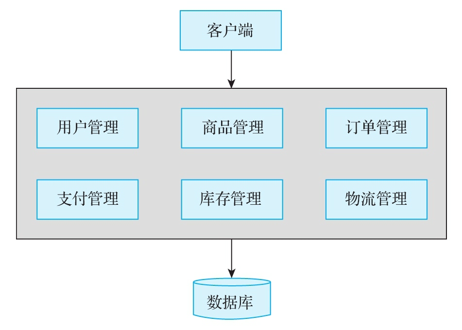{width="6.427890419947507in"
height="4.594293525809274in"}

> 237
>
> 图4-1　单体应用系统架构
>
> 这种架构的优点如下。
>
> 1）架构简单，项目开发和维护成本低。
>
> 2）所有项目模块部署在一起，对于小型项目来说， 方便维护。
>
> 但是，其缺点也是比较明显的。
>
> 1）所有模块耦合在一起，对于大型项目来说，不易 开发和维护。
>
> 2）项目各模块之间过于耦合，一旦有模块出现问 题，整个项目将不可用。
>
> 3）无法针对某个具体模块来提升性能。
>
> 4）无法对项目进行水平扩展。
>
> 正是由于单体应用架构存在诸多缺点，才逐渐演变为 垂直应用架构。
>
> 238
>
> 4.2.2　垂直应用架构
>
> 随着企业业务的不断发展，单节点的单体应用无法满
> 足业务需求。于是，企业将单体应用部署多份，分别放在
> 不同的服务器上。然而，不是所有的模块都有比较大的访
> 问量。如果想针对项目中的某些模块进行优化和性能提
>
> 升，对于单体应用来说，是做不到的。于是，垂直应用架 构诞生了。
>
> 垂直应用架构就是将原来的项目应用拆分为互不相干
> 的几个应用，以此提升系统的整体性能。
>
> 同样以电商系统为例，在垂直应用架构下，我们可以
> 将整个电商项目拆分为电商交易系统、后台管理系统、数
> 据分析系统，系统架构如图4-2所示。

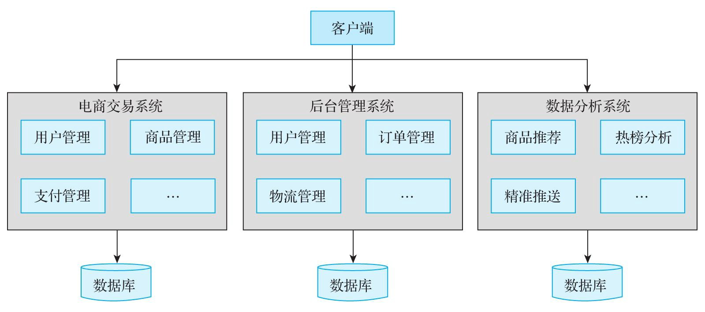{width="6.427890419947507in"
height="2.8431047681539807in"}

> 图4-2　垂直应用系统架构
>
> 239
>
> 将单体应用架构拆分为垂直应用架构之后，一旦访问
> 量变大，只需要针对访问量大的业务增加服务器节点，无
> 须针对整个项目增加服务器节点。
>
> 这种架构的优点如下。
>
> 1）对系统进行拆分，可根据不同系统的访问情况， 有针对性地进行优化。
>
> 2）能够实现应用的水平扩展。
>
> 3）各系统能够分担整体访问流量，解决了并发问
>
> 题。
>
> 4）子系统发生故障，不影响其他子系统的运行情 况，提高了整体的容错率。
>
> 这种架构的缺点如下。
>
> 1）拆分后的各系统之间相对独立，无法进行互相调
>
> 用。
>
> 2）各系统难免存在重叠的业务，会存在重复开发的 业务，后期维护比较困难。
>
> 240
>
> 4.2.3　分布式架构
>
> 将系统演变为垂直应用架构之后，当垂直应用越来越
> 多时，重复编写的业务代码就会越来越多。此时，我们需
> 要将重复的代码抽象出来，形成统一的服务，供其他系统
> 或者业务模块调用，这就是分布式架构。
>
> 在分布式架构中，我们会将系统整体拆分为服务层和
> 表现层。服务层封装了具体的业务逻辑供表现层调用，表
> 现层则负责处理与页面的交互操作。分布式系统架构如图 4-3所示。

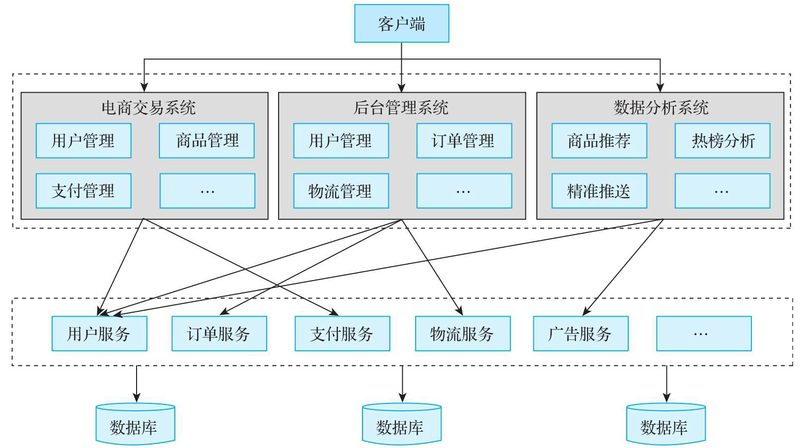{width="6.427890419947507in"
height="3.584785651793526in"}

> 图4-3　分布式系统架构
>
> 这种架构的优点如下。
>
> 241
>
> 1）将重复的业务代码抽象出来，形成公共的访问服 务，提高了代码的复用性。
>
> 2）可以有针对性地对系统和服务进行性能优化，以 提升整体的访问性能。
>
> 这种架构的缺点如下。
>
> 1）系统之间的调用关系变得复杂。
>
> 2）系统之间的依赖关系变得复杂。
>
> 3）系统维护成本高。
>
> 242
>
> 4.2.4　SOA架构
>
> 在分布式架构下，当部署的服务越来越多时，重复的
> 代码就会变得越来越多，不利于代码的复用和系统维护。
> 为此，我们需要增加一个统一的调度中心对集群进行实时
> 管理，这就是SOA（面向服务）架构。SOA系统架构如图4- 4所示。

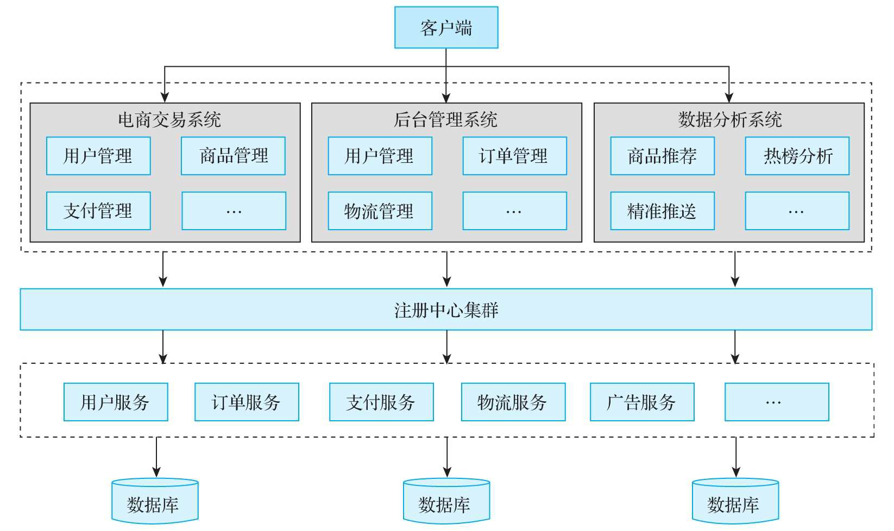{width="6.427890419947507in"
height="3.8217104111986in"}

> 图4-4　SOA系统架构
>
> 这种架构的优点是通过注册中心解决了各个服务之间
> 服务依赖和调用关系的自动注册与发现。
>
> 这种架构的缺点如下。
>
> 243
>
> 1）各服务之间存在依赖关系，如果某个服务出现故
> 障，可能会造成服务器崩溃。
>
> 2）服务之间的依赖与调用关系复杂，增加了测试和 运维的成本。
>
> 244
>
> 4.2.5　微服务架构
>
> 微服务架构是在SOA架构的基础上进行进一步的扩展
> 和拆分。在微服务架构下，一个大的项目拆分为一个个小
>
> 的可独立部署的微服务，每个微服务都有自己的数据库。
> 微服务系统架构如图4-5所示。
>
> 这种架构的优点如下。
>
> 1）服务彻底拆分，各服务独立打包、独立部署和独 立升级。
>
> 2）每个微服务负责的业务比较清晰，利于后期扩展 和维护。
>
> 3）微服务之间可以采用REST和RPC协议进行通信。
>
> 245

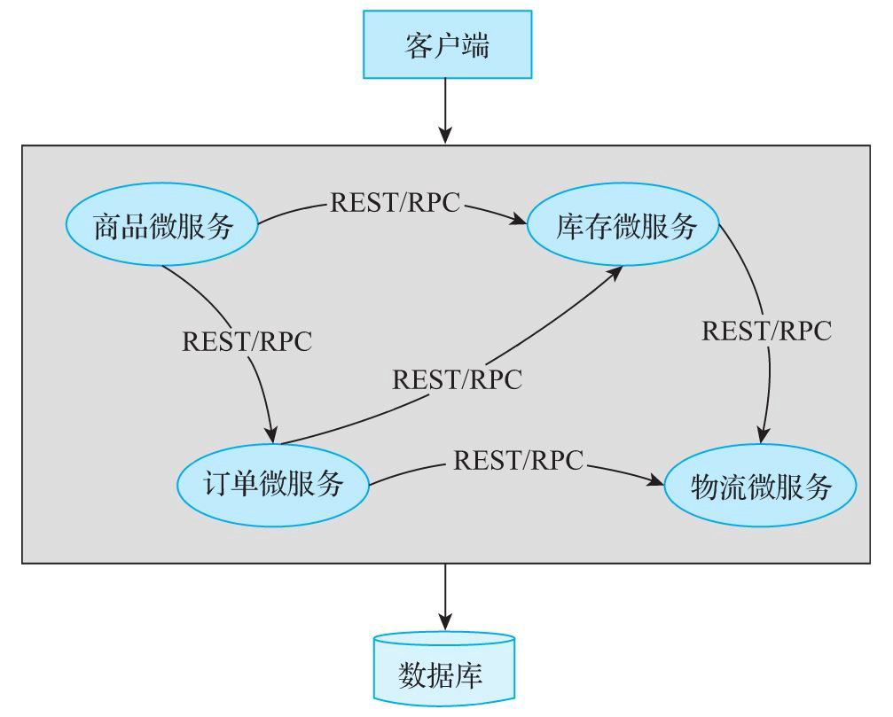{width="6.427890419947507in"
height="5.160854111986001in"}

> 图4-5　微服务系统架构图
>
> 这种架构的缺点如下。
>
> 1）开发成本比较高。
>
> 2）涉及各服务的容错性问题。
>
> 3）涉及数据的一致性问题。
>
> 4）涉及分布式事务问题。
>
> 246
>
> 4.3　分布式事务场景
>
> 将一个大的应用系统拆分为多个可以独立部署的应
> 用服务，需要各个服务远程协作才能完成某些事务操
> 作，这就涉及分布式事务的问题。总的来讲，分布式事
> 务会在3种场景下产生，分别是跨JVM进程、跨数据库实
> 例和多服务访问单数据库。
>
> 247
>
> 4.3.1　跨JVM进程
>
> 将单体项目拆分为分布式、微服务项目之后，各个服
> 务之间通过远程REST或者RPC调用来协同完成业务操作。
> 典型的场景是商城系统的订单微服务和库存微服务，用户
> 在下单时会访问订单微服务。订单微服务在生成订单记录
> 时，会调用库存微服务来扣减库存。各个微服务部署在不
> 同的JVM进程中，此时会产生因跨JVM进程而导致的分布式
> 事务问题。商城系统中跨JVM进程产生分布式事务的场景 如图4-6所示。

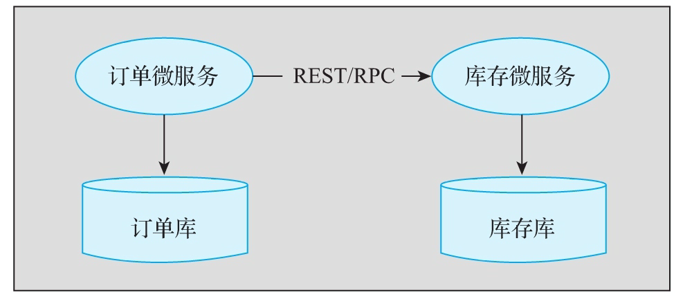{width="6.427891513560805in"
height="2.791599956255468in"}

> 图4-6　商城系统中跨JVM进程产生分布式事务场景
>
> 248
>
> 4.3.2　跨数据库实例
>
> 单体系统访问多个数据库实例，也就是跨数据源访问
> 时会产生分布式事务。例如，系统中的订单数据库和交易
> 数据库放在不同的数据库实例中，当用户发起退款时，会
> 同时操作用户的订单数据库和交易数据库（在交易数据库
> 中执行退款操作，在订单数据库中将订单的状态变更为已
> 退款）。由于数据分布在不同的数据库实例中，需要通过
> 不同的数据库连接会话来操作数据库中的数据，因此产生
> 了分布式事务。商城系统中跨数据库实例产生分布式事务 场景如图4-7所示。

{width="6.427890419947507in"
height="3.1521391076115486in"}

> 图4-7　商城系统中跨数据库实例产生分布式事务场景
>
> 249
>
> 4.3.3　多服务访问单数据库
>
> 多个微服务访问同一个数据库，例如，订单微服务和
> 交易微服务访问同一个数据库就会产生分布式事务，原因
> 是多个微服务访问同一个数据库，本质上也是通过不同的
> 数据库会话来操作数据库，此时就会产生分布式事务。商
> 城系统中多服务访问单数据库产生分布式事务的场景如图 4-8所示。
>
> 跨数据库实例场景和多服务访问单数据库场景，在本
> 质上都会产生不同的数据库会话来操作数据库中的数据，
> 进而产生分布式事务。这两种场景是比较容易被忽略的。

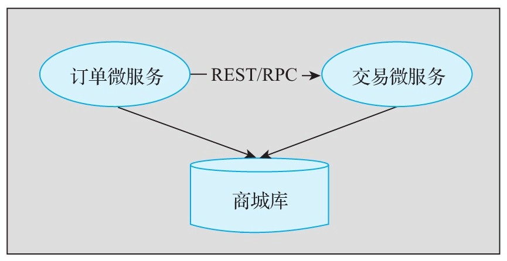{width="6.427890419947507in"
height="3.316956474190726in"}

> 图4-8　商城系统中多服务访问单数据库产生分布式事务 的场景
>
> 250
>
> 4.4　数据一致性
>
> 在分布式场景下，当网络、服务器或者系统软件出
> 现故障，就可能会导致数据一致性的问题。本节介绍数
> 据一致性相关的问题及解决方案。
>
> 251
>
> 4.4.1　数据的一致性问题
>
> 总的来说，数据的一致性问题包含数据多副本、调
> 用超时、缓存与数据库不一致、多个缓存节点数据不一 致等场景。
>
> 1.数据多副本场景
>
> 如果数据的存储存在多副本的情况，当网络、服务
> 器或者系统软件出现故障时，可能会导致一部分副本写
> 入成功，一部分副本写入失败，造成各个副本之间数据 的不一致。
>
> 2.调用超时场景
>
> 调用超时场景包含同步调用超时和异步调用超时。
>
> 同步调用超时往往是由于网络、服务器或者系统软
> 件异常引起的，例如，服务A同步调用服务B时出现超时
> 现象，导致服务A与服务B之间的数据不一致。
>
> 异步调用超时是指服务A异步调用服务B，同样是由
> 于网络、服务器或者系统软件异常导致调用失败，出现
> 服务A与服务B之间的数据不一致的情况。一个典型的场
> 景就是支付成功的异步回调通知。
>
> 3.缓存与数据库不一致场景
>
> 252
>
> 这种场景主要针对缓存与数据库。在高并发场景
> 下，一些热数据会缓存到Redis或者其他缓存组件中。此
>
> 时，如果对数据库中的数据进行新增、修改和删除操
> 作，缓存中的数据如果得不到及时更新，就会导致缓存
> 与数据库中数据不一致。
>
> 4.多个缓存节点数据不一致场景
>
> 这种场景主要针对缓存内部各节点之间数据的不一
> 致。例如在Redis集群中，由于网络异常等原因引起的脑
>
> 裂问题，就会导致多个缓存节点数据不一致。
>
> 253
>
> 4.4.2　数据一致性解决方案
>
> 业界对于数据一致性问题提出了相应的解决方案，
> 目前比较成熟的方案有ACID特性、CAP理论、Base理论、
>
> DTP模型、2PC（两阶段提交）模型、3PC（三阶段提交）
> 模型、TCC模型、可靠消息最终一致性模型、最大努力通 知模型等。
>
> ACID特性已在第1章介绍过，其他解决方案会在后续 章节进行详细介绍。
>
> 254
>
> 4.5　本章小结
>
> 本章首先简单介绍了分布式系统架构的产生背景、
> 目标和原则，接着介绍了分布式系统架构的演进历程，
> 包括单体应用架构、垂直应用架构、分布式架构、SOA架
>
> 构和微服务架构，随后介绍了分布式事务产生的场景，
> 最后介绍了数据的一致性问题。第5章将会对分布式事务
> 相关的理论进行简单的介绍。
>
> 255
>
> 第5章　分布式事务的理论知识
>
> 从某种程度上讲，同一业务中通过不同的会话操作
> 数据库，就有可能出现分布式事务问题。解决分布式事
> 务问题需要一定的理论支撑。
>
> 本章简单介绍分布式事务相关的理论知识，涉及的 内容如下。
>
> ·CAP理论。\
> ·Base理论。
>
> 256
>
> 5.1　CAP理论
>
> CAP是一致性（Consistency）、可用性
> （Availability）和分区容忍性（Partition
>
> Tolerance）首字母的缩写。CAP是分布式领域著名的理
> 论，本节对CAP理论进行简单的介绍。
>
> 257
>
> 5.1.1　一致性
>
> 在互联网领域，企业往往会将一份数据复制多份进
> 行存储。一致性是指用户对数据的更新操作（包括新
> 增、修改和删除），要么在所有的数据副本都执行成
> 功，要么在所有的数据副本都执行失败。也就是说，一
> 致性要求对所有数据节点的数据副本的修改是原子操
> 作。所有数据节点的数据副本的数据都是最新的，从任
> 意数据节点读取的数据都是最新的状态。
>
> 例如，在数据库主从集群模式中，应用程序向主数
> 据库写数据，主数据库向应用程序返回写入结果并将数
> 据同步到从数据库中。对于应用程序向从数据库读取数
> 据的场景，如果要满足一致性，需要实现如下目标。
>
> 1）应用程序向主数据库写数据失败，则向从数据库 读取数据也失败。
>
> 2）应用程序向主数据库写数据成功，则向从数据库 读取数据也成功。
>
> 实现上述目标，需要在技术上满足如下条件。
>
> 1）应用程序将数据写入主数据库后，将数据同步到 从数据库中。
>
> 2）数据写入主数据库后，主数据库将数据同步到从
> 数据库存在一定的时间延迟，这个过程需要将从数据库
>
> 258
>
> 锁定，避免应用程序向从数据库中读取出与主数据库不
> 一致的数据，待数据同步完成后再释放从数据库的锁。
>
> 综上所述，一致性存在如下特点。
>
> 1）存在数据同步的过程，应用程序的写操作存在一 定的延迟。
>
> 2）为了保证各节点数据的一致性，需要对相应的资
> 源进行锁定，待数据同步完成后再释放锁定的资源。
>
> 3）如果数据写入并同步成功，所有节点都会返回最
> 新的数据。相反地，如果数据写入或者同步失败，所有
> 节点都不会存在最新写入的数据。
>
> 259
>
> 5.1.2　可用性
>
> 可用性指的是客户端访问数据的时候，能够快速得
> 到响应。需要注意的是，系统处于可用性状态时，每个
> 存储节点的数据可能会不一致，并不要求应用程序向数
> 据库写入数据时能够立刻读取到最新的数据。也就是
>
> 说，处于可用性状态的系统，任何事务的操作都可以得
> 到响应的结果，不会存在超时或者响应错误的情况。
>
> 例如，在数据库主从集群模式中，应用程序向主数
> 据库写数据，主数据库向应用程序返回写入结果并将数
> 据同步到从数据库中。对于应用程序向从数据库读取数
> 据的场景，如果要满足可用性，则需要实现如下目标。
>
> 1）从数据库接收到应用程序读取数据的请求，能够 快速响应结果数据。
>
> 2）从数据库不能出现响应超时或者响应错误的情
>
> 况。
>
> 实现上述目标，需要在技术上满足如下条件。
>
> 1）应用程序将数据写入主数据库后，主数据库需要 将数据同步到从数据库中。
>
> 2）主数据库同步数据到从数据库的过程中，不能锁 定从数据库的资源。
>
> 260
>
> 3）应用程序向从数据库查询数据时，从数据库一定
> 要返回数据。此时如果主从数据同步还没有完成，从数
> 据库也要返回数据，即使是旧数据也要返回，如果从数
> 据库中连旧数据都没有，则返回一个默认数据。总之，
> 从数据库不能出现响应超时或者响应错误的情况。
>
> 综上所述，可用性存在如下特点。
>
> 1）所有的请求都会被响应。
>
> 2）不会存在响应超时或者响应错误的情况。
>
> 3）如果对不同的应用程序设定了超时响应时间，一
> 旦超过这个时间，系统将不可用。
>
> 261
>
> 5.1.3　分区容忍性
>
> 如果只是将存储系统部署并运行在一个节点上，当
> 系统出现故障时，整个系统将不可用。如果将存储系统
> 部署并运行在多个不同的节点上，并且这些节点处于不
> 同的网络中，这就形成了网络分区。此时，不可避免地
> 会出现网络问题，导致节点之间的通信出现失败的情
>
> 况，但是，此时的系统仍能对外提供服务，这就是分区 容忍性。
>
> 例如，在数据库主从集群模式中，应用程序向主数
> 据库写数据，主数据库向应用程序返回写入结果并将数
> 据同步到从数据库中。对于应用程序向从数据库读取数
> 据的场景，如果要满足分区容忍性，则需要实现如下目 标。
>
> 1）主数据库向从数据库同步数据，无论同步结果是
> 成功还是失败，都不会影响数据的写操作。
>
> 2）不管是主数据库还是从数据库，其中一个节点挂
> 掉，并不会影响另一个节点继续对外提供服务。
>
> 实现上述目标，需要在技术上满足如下条件。
>
> 1）主数据库向从数据库同步数据时，使用异步方式 代替同步方式。
>
> 262
>
> 2）尽量多增加一些从数据库节点，如果一个节点挂
> 掉，其他从数据库节点继续提供服务。
>
> 综上所述，分区容忍性存在如下特点。
>
> 1）一个节点挂掉，不影响其他节点对外提供服务。
>
> 2）分区容忍性是分布式系统必须具备的基础能力。
>
> 263
>
> 5.1.4　CAP的组合
>
> 在分布式系统中，不会同时具备CAP三个特性，只能 同时具备其中的两个。
>
> 在CAP理论中，如果要满足一致性，需要在数据由主
> 数据库同步到从数据库的过程中对从数据库加锁，以防
> 止同步的过程中应用程序向从数据库读取不一致的数
> 据，数据同步完成后会释放从数据库的锁。如果数据同
> 步失败，则需要从数据库返回错误信息或者超时信息。
>
> 如果要满足可用性，则必须保证数据节点的可用
> 性，无论何时查询从数据库中的数据，从数据库都要快
>
> 速响应查询结果，不能出现响应超时或者返回错误信息 的情况。
>
> 由此可见，系统在满足分区容忍性的前提下，一致
> 性和可用性就是矛盾的。那么CAP理论中的三个特性有哪
>
> 些组合方式呢？很显然，有AP、CP、CA三种组合方式。
>
> 1.AP
>
> 放弃一致性，追求系统的可用性和分区容忍性。这
> 是实际工作中，大部分分布式系统在架构设计时的选 择。
>
> 在实际场景中，大部分分布式系统会采用AP的方
> 式，舍弃了一致性，这并不代表就真的放弃了一致性。
>
> 264
>
> 此时，架构设计方案采用了最终一致性，允许多个节点
> 的数据在一定的时间内存在差异，一段时间后达到数据 一致的状态。
>
> 2.CP
>
> 放弃可用性，追求系统的一致性和分区容忍性。这
> 种组合方式对于数据的一致性要求比较高，追求的是强 一致性。
>
> 在实际场景中，跨行转账业务需要每个银行系统都
> 执行完转账操作的整个事务才算完成，这是典型的CP方 式。
>
> 3.CA
>
> 放弃分区容忍性，追求系统的一致性和可用性。此
> 时系统不会进行分区，也不会考虑网络不通和节点挂掉
> 的问题。主数据库和从数据库不再进行数据同步，此时
> 系统也不再是一个标准的分布式系统。
>
> 265
>
> 5.2　Base理论
>
> 分布式系统最多只能同时满足CAP理论中的两个特
> 性。在实际场景中，大部分分布式系统会采用AP方式，
>
> 即舍弃一致性，保证可用性和分区容忍性。但是通常情
> 况下还是要保证一致性，这种一致性与CAP中描述的一致
> 性有所区别：CAP中的一致性要求的是强一致性，即任何
> 时间读取任意节点的数据都必须一致，而这里的一致性
> 指的是最终一致性，允许在一段时间内每个节点的数据
> 不一致，但经过一段时间后，每个节点的数据达到一 致。
>
> 1.Base理论概述
>
> Base理论是对CAP理论中AP的一个扩展，它通过牺牲
> 强一致性来获得可用性。Base理论中的Base是基本可用 （Basically
> Available）、软状态（Soft State）和最 终一致性（Eventually
> Consistent）的缩写。当系统出
> 现故障时，Base理论允许部分数据不可用，但是会保证
> 核心功能可用；允许数据在一段时间内不一致，但是经
> 过一段时间，数据最终是一致的。符合Base理论的事务 可以称为柔性事务。
>
> 2.基本可用
>
> 基本可用是指分布式系统出现故障时，允许其损失
> 系统的部分可用性，比如响应时间或者功能上的损失，
> 但是要保证系统基本可用。例如在电商业务场景中，添
>
> 266
>
> 加购物车和下单功能出现故障时，商品浏览功能仍然可 用。
>
> 3.软状态
>
> 软状态是指允许系统中存在中间状态，这些中间状
> 态不会影响系统的整体可用性，只是允许系统各个节点
> 之间的数据同步存在延迟。例如在电商业务场景中，订
> 单中的"支付中""退款中"等状态就是中间状态，当
> 达到一段时间后，就会变成"支付成功"或者"退款成 功"的状态。
>
> 4.最终一致性
>
> 最终一致性是指系统中各个节点的数据副本经过一
> 段时间的同步，最终能够达到一致的状态。最终一致性
> 需要保证数据经过一段时间的同步达到一致，并不要求
> 各个节点的数据保持实时一致。例如在电商业务场景
>
> 中，订单中的"支付中""退款中"等状态，最终会变
> 成"支付成功""退款成功"的状态，经过一段时间的
> 延迟，能够使得订单中的状态与最终的交易结果一致。
>
> 267
>
> 5.3　本章小结
>
> 本章的内容比较简单，介绍了分布式事务中的两大
> 基本理论：CAP理论和Base理论。第6章将对分布式事务
> 中常用的解决方案进行简单的介绍。
>
> 268
>
> 第二部分　分布式事务解决方案
>
> ·第6章　强一致性分布式事务解决方案\
> ·第7章　最终一致性分布式事务解决方案
>
> 269
>
> 第6章　强一致性分布式事务解决方案
>
> 在前面的章节中，我们学习了产生分布式事务的场
> 景和分布式事务的理论依据。从本章开始，正式进入分
> 布式事务解决方案部分。总体来说，分布式事务解决方
> 案可以分为强一致性分布式事务解决方案和最终一致性 分布式事务解决方案。
>
> 本章简单介绍一下强一致性分布式事务解决方案， 涉及的内容如下。
>
> ·强一致性事务概述。\
> ·DTP模型。\
> ·2PC模型。\
> ·3PC模型。
>
> 270
>
> 6.1　强一致性事务概述
>
> 在分布式事务领域，最早采用的是符合CAP理论的强
> 一致性事务方案来解决分布式事务问题。强一致性分布
> 式事务要求在任意时刻查询参与全局事务的各节点的数
> 据都是一致的。本节主要介绍强一致性分布式事务的典
> 型方案、使用场景和优缺点。
>
> 271
>
> 6.1.1　典型方案
>
> 在强一致性事务解决方案中，典型的方案包括DTP模
> 型（全局事务模型）、2PC模型（二阶段提交模型）和
> 3PC模型（三阶段提交模型）3种。
>
> 基于DTP模型，典型的解决方案是分布式通信协议XA
> 规范，MySQL默认支持XA规范，详见2.5节。另外，
> Atomikos框架和Dromara开源社区的RainCat框架也在应
> 用层支持XA规范，能够实现分布式事务。
>
> 基于2PC模型，典型的解决方案是Dromara开源社区
> 开源的RainCat框架，在应用层实现了2PC模型，避免出
> 现在数据库层实现2PC模型时阻塞数据库的情况。
>
> 由于3PC模型的设计过于复杂，在解决2PC问题的同
> 时又引入了新的问题，因此在实际工作中的应用不是很 广泛。
>
> 272
>
> 6.1.2　适用场景
>
> 在分布式事务解决方案中，强一致性事务要求应用
> 程序在任何时间，读取任意节点上的数据，都是最新写 入的。
>
> 强一致性事务主要用于对数据一致性要求比较高，
> 在任意时刻都要查询到最新写入数据的场景，例如跨行
> 转账业务中，张三向李四转账100元，则张三账户减少
>
> 100元，李四账户增加100元，这两个操作要么都执行成
> 功，要么都执行失败。不存在一个成功，另一个失败的 情况。
>
> 273
>
> 6.1.3　优缺点
>
> 强一致性事务解决方案存在如下优点。
>
> 1）数据一致性比较高。
>
> 2）在任意时刻都能够查询到最新写入的数据。
>
> 强一致性事务解决方案也存在着如下缺点。
>
> 1）存在性能问题，在分布式事务未完全提交和回滚
> 之前，应用程序不会查询到最新的数据。
>
> 2）实现复杂。
>
> 3）牺牲了可用性。
>
> 4）不适合高并发场景。
>
> 274
>
> 6.2　DTP模型
>
> DTP模型是X/Open组织定义的一套分布式事务标准，
> 这套标准主要定义了实现分布式事务的规范和API，具体
> 的实现则交给相应的厂商来实现。本节对DTP模型的重要
> 概念和执行流程进行简单的介绍。
>
> 275
>
> 6.2.1　DTP模型的重要概念
>
> DTP模型中定义了几个重要的概念，分别为事务、全
> 局事务、分支事务和控制线程。
>
> 1）事务：一个事务就是一个完整的工作单元，具备 ACID特性。
>
> 2）全局事务：由事务管理器管理的事务，能够一次 性操作多个资源管理器。
>
> 3）分支事务：由事务管理器管理的全局事务中，每
> 个资源管理器中独立执行的事务。
>
> 4）控制线程：执行全局事务的线程，这个线程用来
> 关联应用程序、事务管理器和资源管理器三者之间的关
> 系，也就是表示全局事务和分支事务的关系，通常称为 事务上下文环境。
>
> 276
>
> 6.2.2　DTP模型的执行流程
>
> DTP模型定义了实现分布式事务的规范和API，主要的 执行流程如图6-1所示。

{width="6.427891513560805in"
height="4.110142169728784in"}

> 图6-1　DTP模型示意图
>
> 在DTP模型中，主要定义了3个核心组件，分别为AP、 TM、RM。
>
> 1）AP：应用程序（Application Program）可以理解
> 为参与DTP分布式事务模型的应用程序。
>
> 277
>
> 2）RM：资源管理器（Resource Manager）可以理解
> 为数据库管理系统或消息服务管理器。应用程序可以通过
>
> 资源管理器对相应的资源进行有效的控制。相应的资源需
> 要实现XA定义的接口。
>
> 3）TM：事务管理器（Transaction Manager）负责协
> 调和管理DTP模型中的事务，为应用程序提供编程接口， 同时管理资源管理器。
>
> 其中，AP可以和TM、RM通信，TM和RM互相之间可以通
> 信，DTP模型定义了XA接口，TM和RM能够通过XA接口进行
> 双向通信。TM控制着全局事务，管理事务的生命周期并协
> 调资源。RM控制和管理实际的资源。
>
> 278
>
> 6.3　2PC模型
>
> 2PC模型是指两阶段提交协议模型，这种模型将整个
> 事务流程分为Prepare阶段和Commit阶段。2PC中的2指的
> 是两个阶段，P是指Prepare，即准备，C是指Commit，即 提交。
>
> 279
>
> 6.3.1　2PC模型的执行流程
>
> 2PC模型两阶段执行流程如下所示。
>
> 1.Prepare阶段
>
> 在Prepare阶段，事务管理器给每个参与全局事务的
> 资源管理器发送Prepare消息，资源管理器要么返回失
> 败，要么在本地执行相应的事务，将事务写入本地的\
> Redo Log文件和Undo Log文件，此时，事务并没有提 交。
>
> 2.Commit阶段
>
> 如果事务管理器收到了参与全局事务的资源管理器
> 返回的失败消息，则直接给Prepare阶段执行成功的资源
>
> 管理器发送回滚消息，否则，向每个资源管理器发送
> Commit消息。相应的资源管理器根据事务管理器发送过
> 来的消息指令，执行对应的事务回滚或事务提交操作，
> 并且释放事务处理过程中使用的锁资源。
>
> 2PC的流程分为事务提交成功和事务提交失败两种情 况，下面进行详细介绍。
>
> 280
>
> 6.3.2　事务执行成功的流程
>
> 在2PC模型中，正常情况下，分布式事务执行成功
> 时，整体上也分为Prepare阶段和Commit阶段。在Prepare
>
> 阶段事务管理器会向各资源管理器发送Prepare消息，在
> Commit阶段事务管理器会向各资源管理器发送Commit消 息。
>
> 事务执行成功的流程如图6-2、图6-3所示。

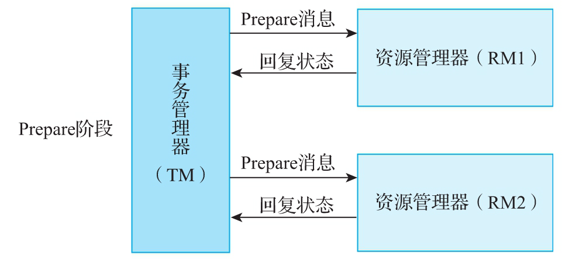{width="6.427890419947507in"
height="2.915213254593176in"}

> 图6-2　2PC事务执行成功的Prepare阶段
>
> 由图6-2可以看出，事务提交成功的情况下，在2PC的
> Prepare阶段，由事务管理器向参与全局事务的资源管理
> 器发送Prepare消息，资源管理器收到消息后，将事务写 入本地的Redo
> Log和Undo Log日志，并向事务管理器返回 事务执行成功的状态。
>
> 281
>
> 由图6-3可以看出，事务执行成功的情况下，在2PC的
> Commit阶段，由事务管理器向参与全局事务的资源管理器
> 发送Commit消息，资源管理器收到消息后，提交本地事
>
> 务，并将提交成功的消息返回给事务管理器，同时释放相 应的锁资源。

{width="6.427891513560805in"
height="3.069729877515311in"}

> 图6-3　2PC事务执行成功的Commit阶段
>
> 282
>
> 6.3.3　事务执行失败的流程
>
> 在2PC模型中，当执行分布式事务失败时，例如在
> Prepare阶段，某些资源管理器向事务管理器响应了Error
>
> 消息，则在Commit阶段，事务管理器会向其他响应正常消
> 息的资源管理器发送回滚消息。
>
> 事务执行失败的流程如图6-4、图6-5所示。

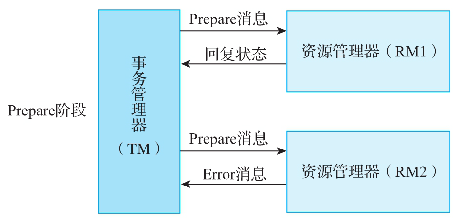{width="6.427890419947507in"
height="3.1521391076115486in"}

> 图6-4　2PC事务执行失败的Prepare阶段
>
> 由图6-4可以看出，事务执行失败的情况下，在2PC的
> Prepare阶段，事务管理器向资源管理器发送Prepare消
> 息，某些资源管理器收到消息后，将事务写入本地Redo Log和Undo
> Log日志失败，会向事务管理器返回执行失败 的消息。
>
> 283

{width="6.427891513560805in"
height="3.0491272965879266in"}

> 图6-5　2PC事务执行失败的Commit阶段
>
> 由图6-5可以看出，事务执行失败的情况下，在2PC的
> Commit阶段，事务管理器会向在Prepare阶段执行事务成
> 功的资源管理器发送Rollback消息，对应的资源管理器收
> 到事务管理器发送的Rollback消息后，回滚本地的事务，
> 并将回滚成功的消息返回给事务管理器。
>
> 284
>
> 6.3.4　2PC模型存在的问题
>
> 值得注意的是，2PC模型存在着如下的缺点。
>
> 1）同步阻塞问题：事务的执行过程中，所有参与事
> 务的节点都会对其占用的公共资源加锁，导致其他访问
> 公共资源的进程或者线程阻塞。
>
> 2）单点故障问题：如果事务管理器发生故障，则资 源管理器会一直阻塞。
>
> 3）数据不一致问题：如果在Commit阶段，由于网络
> 或者部分资源管理器发生故障，导致部分资源管理器没
> 有接收到事务管理器发送过来的Commit消息，会引起数 据不一致的问题。
>
> 4）无法解决的问题：如果在Commit阶段，事务管理
> 器发出Commit消息后宕机，并且唯一接收到这条Commit
> 消息的资源管理器也宕机了，则无法确认事务是否已经 提交。
>
> 285
>
> 6.4　3PC模型
>
> 3PC模型是指三阶段提交模型，是在2PC模型的基础
> 上改进的版本。3PC模型把2PC模型中的Prepare阶段一分
>
> 为二，最终形成3个阶段：CanCommit阶段、PreCommit阶
> 段和doCommit或者doRollback阶段。3PC模型的流程同样
> 分为事务执行成功和事务执行失败两种情况。
>
> 286
>
> 6.4.1　事务执行成功的流程
>
> 在3PC模型中，当事务执行成功时，在CanCommit阶
> 段、PreCommit阶段和doCommit阶段，事务管理器与资源
>
> 管理器之间的消息发送与接收都是正常的，整个分布式事
> 务最终会成功提交。事务执行成功的流程如图6-6～图6-8 所示。

{width="6.427890419947507in"
height="2.688588145231846in"}

> 图6-6　3PC模型事务执行成功的CanCommit阶段
>
> 由图6-6可以看出，在事务执行成功的CanCommit阶
> 段，事务管理器向参与全局事务的资源管理器发送
> CanCommit消息，资源管理器收到CanCommit消息，认为能
> 够执行事务，会向事务管理器响应Yes消息，进入预备状 态。
>
> 287

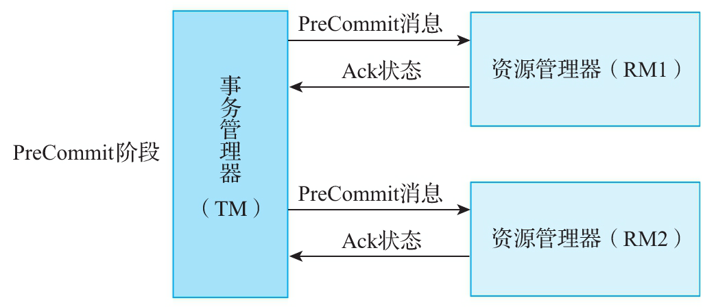{width="6.427891513560805in"
height="2.770997375328084in"}

> 图6-7　3PC模型事务执行成功的PreCommit阶段
>
> 由图6-7可以看出，在事务执行成功的PreCommit阶
> 段，事务管理器会向参与全局事务的资源管理器发送
> PreCommit消息，资源管理器收到PreCommit消息后，执行
> 事务操作，将Undo和Redo信息写入事务日志，并向事务管
> 理器响应Ack状态，但此时不会提交事务。

{width="6.427891513560805in"
height="2.791599956255468in"}

> 图6-8　3PC模型事务执行成功的doCommit阶段
>
> 288
>
> 由图6-8可以看出，在事务执行成功的doCommit阶
> 段，事务管理器会向参与全局事务的资源管理器发送
> doCommit消息，事务管理器接收到doCommit消息后，正式
> 提交事务，并释放执行事务期间占用的资源，同时向事务
> 管理器响应事务已提交的状态。事务管理器收到资源管理
> 器响应的事务已提交的状态，完成事务的提交。
>
> 289
>
> 6.4.2　事务执行失败的流程
>
> 在3PC模型中，某些资源管理器接收到事务管理器发
> 送过来的CanCommit消息时，如果资源管理器认为不能执
> 行事务，则会向事务管理器响应无法执行事务的No消息。
>
> 之后事务管理器会在PreCommit阶段向资源管理器发送准
> 备回滚的消息，资源管理器向事务管理器响应准备好事务
> 回滚的消息。在doRollback阶段，事务管理器会向资源管
> 理器发送回滚事务的消息。
>
> 3PC模型中，事务执行失败的流程如图6-9～图6-11所
>
> 示。

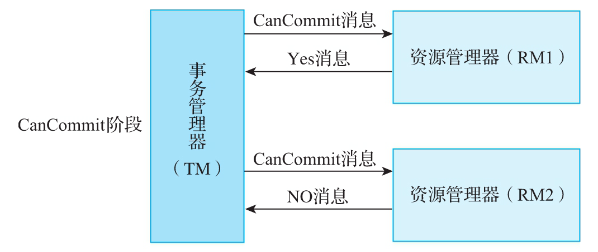{width="6.427890419947507in"
height="2.719491469816273in"}

> 图6-9　3PC模型事务执行失败的CanCommit阶段
>
> 由图6-9可以看出，在事务执行失败的CanCommit阶
> 段，事务管理器会向参与全局事务的资源管理器发送
>
> 290
>
> CanCommit消息，如果资源管理器收到CanCommit消息后，
> 认为不能执行事务，则会向事务管理器响应No状态。

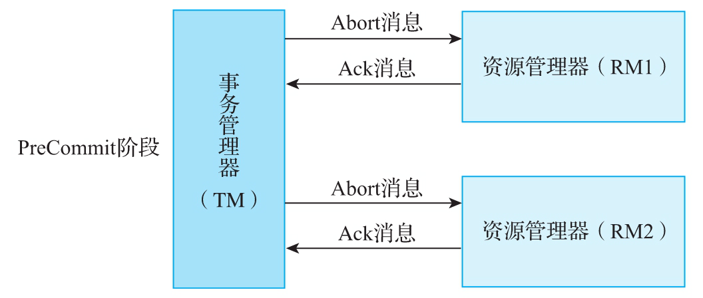{width="6.427890419947507in"
height="2.7194925634295712in"}

> 图6-10　3PC模型事务执行失败的PreCommit阶段
>
> 由图6-10可以看出，在事务执行失败的PreCommit阶
> 段，事务管理器会向参与全局事务的资源管理器发送
> Abort消息，资源管理器收到Abort消息或者期间出现超
> 时，都会中断事务的执行。

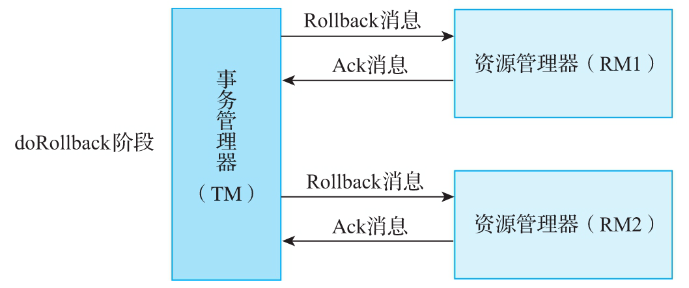{width="6.427891513560805in"
height="2.698889982502187in"}

> 图6-11　3PC模型事务执行失败的doRollback阶段
>
> 291
>
> 由图6-11可以看出，在事务执行失败的doRollback阶
> 段，事务管理器会向参与全局事务的资源管理器发送
> Rollback消息，资源管理器会利用Undo Log日志信息回滚
> 事务，并释放执行事务期间占用的资源，向事务管理器返
> 回事务已回滚的状态。事务管理器收到资源管理器返回的
> 事务已回滚的消息，完成事务回滚。
>
> 292
>
> 6.4.3　3PC模型中存在的问题
>
> 与2PC模型相比，3PC模型主要解决了单点故障问
> 题，并减少了事务执行过程中产生的阻塞现象。在3PC模
>
> 型中，如果资源管理器无法及时收到来自事务管理器发
> 出的消息，那么资源管理器就会执行提交事务的操作，
> 而不是一直持有事务的资源并处于阻塞状态，但是这种
> 机制会导致数据不一致的问题。
>
> 如果由于网络故障等原因，导致资源管理器没有及
> 时收到事务管理器发出的Abort消息，则资源管理器会在
>
> 一段时间后提交事务，这就导致与其他接收到Abort消息
> 并执行了事务回滚操作的资源管理器的数据不一致。
>
> 293
>
> 6.5　本章小结
>
> 本章主要介绍了强一致性分布式事务的解决方案，
> 包括强一致性分布式事务概述、DTP模型、2PC模型和3PC
>
> 模型，并详细描述了各个模型的执行流程，同时对2PC模
> 型和3PC模型存在的问题进行了简单的介绍。第7章将对
> 最终一致性分布式事务解决方案进行介绍。
>
> 294
>
> 第7章　最终一致性分布式事务解决方案
>
> 第6章主要介绍了强一致性分布式事务解决方案，本
> 章对最终一致型分布式事务解决方案进行简单的介绍， 涉及的内容如下。
>
> ·最终一致性分布式事务概述。\
> ·服务模型。
>
> ·TCC解决方案。\
> ·可靠消息最终一致性解决方案。\
> ·最大努力通知型解决方案。
>
> 295
>
> 7.1　最终一致性分布式事务概述
>
> 强一致性分布式事务解决方案要求参与事务的各个
> 节点的数据时刻保持一致，查询任意节点的数据都能得
> 到最新的数据结果。这就导致在分布式场景，尤其是高
> 并发场景下，系统的性能受到影响。而最终一致性分布
> 式事务解决方案并不要求参与事务的各节点数据时刻保
> 持一致，允许其存在中间状态，只要一段时间后，能够
> 达到数据的最终一致状态即可。本节将对最终一致性分
> 布式事务的典型方案、适用场景和优缺点进行简单的介 绍。
>
> 296
>
> 7.1.1　典型方案
>
> 业界对于数据的一致性问题，一直在探索有效的解
> 决方案。为了解决分布式、高并发场景下系统的性能问
> 题，业界基于Base理论提出了最终一致性分布式事务解 决方案。
>
> 典型的最终一致性解决方案如下所示。
>
> 1）TCC解决方案。
>
> 2）可靠消息最终一致性解决方案。
>
> 3）最大努力通知型解决方案。
>
> 本章后续小节会对这些方案进行简单的介绍。
>
> 297
>
> 7.1.2　适用场景
>
> 最终一致性分布式事务解决方案主要用于不要求结
> 果数据时刻保持一致、允许存在中间状态，但经过一段
> 时间后，各个节点的数据能够达到一致状态的场景。
>
> 在电商支付场景中，会涉及订单服务、支付服务、
> 库存服务、积分服务、仓储服务等环节，每个服务都是
> 单独部署的。订单服务会调用支付服务生成交易流水，
> 订单服务会调用库存服务扣减商品库存，订单服务会调
> 用积分服务为用户的账户增加积分，订单服务会调用仓
> 储服务生成出库单。如果这一系列的服务调用操作使用
> 强一致性分布式事务，很容易造成系统性能低下，导致
> 系统卡顿，并且服务与服务之间的交互是通过网络进行
> 的，由于网络的不稳定性，就会导致服务之间的调用出
> 现各种各样的问题，难以完成强一致性分布式事务的提 交操作。
>
> 上述电商支付场景就是最终一致性分布式事务解决
> 方案的适用场景。在最终一致性分布式事务解决方案
> 中，每个服务都存在中间状态，服务与服务之间不必保
> 持强一致性，允许在某个时刻查询出来的数据存在短暂
> 的不一致性，经过一段时间后，各个服务之间的数据能
> 够达到最终一致性。这样，不仅各个服务的数据达到了
> 最终一致性，还极大地提高了系统的整体性能并降低了
> 分布式事务执行过程中出错的概率。
>
> 298
>
> 7.1.3　优缺点
>
> 最终一致性分布式事务解决方案的优点如下。
>
> 1）性能比较高，这是因为最终一致性分布式事务解
> 决方案不要求数据时刻保持一致，不会因长时间持有事
> 务占用的资源而消耗过多的性能。
>
> 2）具备可用性。
>
> 3）适合高并发场景。
>
> 最终一致性分布式事务解决方案的缺点如下。
>
> 1）因为数据存在短暂的不一致，所以在某个时刻查
> 询出的数据状态可能会不一致。
>
> 2）对于事务一致性要求特别高的场景不太适用。
>
> 299
>
> 7.2　服务模式
>
> 最终一致性分布式事务解决方案存在4种典型的服务
> 模式，分别为可查询操作、幂等操作、TCC操作和可补偿
> 操作。本节简单介绍这4种服务模式。
>
> 300
>
> 7.2.1　可查询操作
>
> 可查询操作服务模式需要服务的操作具有可标识性，
> 主要体现在服务的操作具有全局唯一的标识，可以是业务
> 的单据编码（如订单号），也可以是系统分配的操作流水
> 号（如支付产生的交易流水号）。另外，在可查询的服务
> 模式中，也要有完整的操作时间信息。可查询操作示意图 如图7-1所示。

{width="6.427890419947507in"
height="2.6164807524059492in"}

> 图7-1　可查询操作示意图
>
> 由图7-1可以看出，在可查询操作中，业务服务需要
> 提供操作业务的接口、查询某条业务数据的接口和批量查
>
> 询业务数据的接口。
>
> 处理订单操作的方法片段如下，在一个方法中不仅要
> 更新本地数据库中的订单状态，还要通过RPC调用的方式
> 来处理远程服务的逻辑。也就是说，其他远程业务服务为
> 订单服务提供了操作业务的接口。
>
> 301
>
> public void handleOrder() {
>
> //订单服务本地更新订单状态\
> orderDao.update();\
> //调用资金账户服务给资金账户扣款\
> accountService.update();\
> //调用积分服务给积分账户增加积分\
> pointService.update();\
> //调用会计服务向会计系统写入会计原始凭证\
> accountingService.insert();\
> //调用物流服务生成物流信息\
> logisticsService.save();
>
> }
>
> 在上面的代码中，完成支付功能后需要处理订单的状
> 态信息，在处理订单信息的方法中，除了更新订单状态的
> 操作为本地操作外，其他操作都需要调用RPC接口来执
>
> 行。在这种情况下，只使用本地事务就无法保证数据一致
> 性了，需要引入分布式事务。在分布式事务的执行过程
> 中，如果出现了错误，需要明确知道其他操作的处理情
> 况。此时需要其他服务提供可查询的接口，以保证通过可
> 查询的接口获取其他服务的处理情况。
>
> 302
>
> 7.2.2　幂等操作
>
> 幂等操作服务模式要求操作具有幂等性。幂等性是数
> 学上的概念，指的是使用相同的参数执行同一个方法时，
> 无论执行多少次，都能输出相同的结果。在编程中，幂等
> 性指的是对于同一个方法来说，只要参数相同，无论执行
> 多少次都与第一次执行时产生的影响相同。幂等操作示意 图如图7-2所示。

{width="6.427890419947507in"
height="2.657684820647419in"}

> 图7-2　幂等操作服务模式示意图
>
> 由图7-2可以看出，业务服务对外提供操作业务数据
> 的接口，并且需要在接口的实现中保证对数据处理的幂等
>
> 性。
>
> 在分布式环境中，难免会出现数据不一致的情况。很
> 多时候，为了保证数据的最终一致性，系统会提供很多重
> 试操作。如果这些重试操作涉及的方法中，某些方法的实
>
> 303
>
> 现不具有幂等性，则即使重试操作成功了，也无法保证数 据最终一致性。
>
> 通常有两种实现幂等性的方式：一种是通过业务操作
> 本身实现幂等性；另一种是通过系统缓存所有的请求与处
> 理结果，当再次检测到相同的请求时，直接返回之前缓存 的处理结果。
>
> 304
>
> 7.2.3　TCC操作
>
> TCC操作服务模式主要包括3个阶段，分别为Try阶段
> （尝试业务执行）、Confirm阶段（确定业务执行）和
> Cancel阶段（取消业务执行），如图7-3所示。

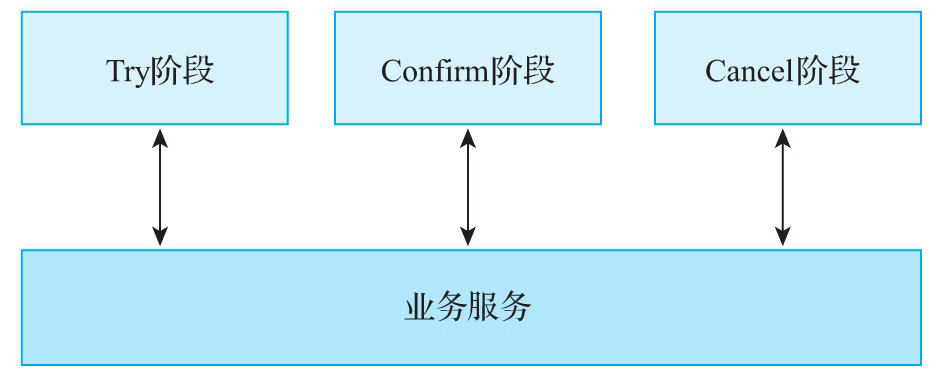{width="6.427891513560805in"
height="2.554674103237095in"}

> 图7-3　TCC操作服务模式示意图
>
> 在TCC操作服务模式中，各阶段的主要功能及特性如 下所示。
>
> 1.Try阶段
>
> 1）完成所有业务的一致性检查。
>
> 2）预留必要的业务资源，并需要与其他操作隔离。
>
> 2.Confirm阶段
>
> 1）此阶段会真正执行业务操作。
>
> 305
>
> 2）因为在Try阶段完成了业务的一致性检查，所以此
> 阶段不会做任何业务检查。
>
> 3）只用Try阶段预留的业务资源进行操作。
>
> 4）此阶段的操作需要满足幂等性。
>
> 3.Cancel阶段
>
> 1）释放Try阶段预留的业务资源。
>
> 2）此阶段的操作需要满足幂等性。
>
> 306
>
> 7.2.4　可补偿操作
>
> 在分布式系统中，如果某些数据处于不正常的状态，
> 需要通过某种方式进行业务补偿，使数据能够达到最终一
> 致性，这种因数据不正常而进行的补偿操作，就是可补偿 操作服务模式。
>
> 可补偿服务模式示意图如图7-4所示。

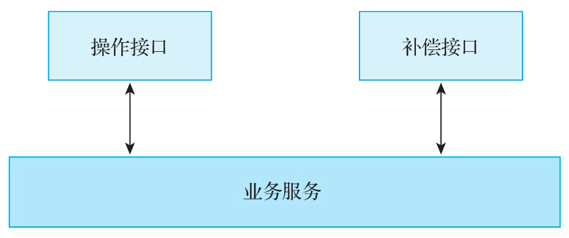{width="6.427890419947507in"
height="2.698889982502187in"}

> 图7-4　可补偿操作服务模式示意图
>
> 由图7-4可以看出，业务服务对外提供操作数据的接
> 口时，也需要对外提供补偿业务的接口，当其他服务调用
>
> 业务服务操作数据的接口出现异常时，能够通过补偿接口 进行业务补偿操作。
>
> 1）在执行业务操作时，完成业务操作并返回业务操
> 作结果，这些操作结果对外部都是可见的。
>
> 307
>
> 2）在进行业务补偿时，能够补偿或者抵消正向业务
> 操作的结果，并且业务补偿操作需要满足幂等性。
>
> 308
>
> 7.3　TCC解决方案
>
> TCC是一种典型的解决分布式事务问题的方案，主要
> 解决跨服务调用场景下的分布式事务问题，广泛应用于 分布式事务场景。
>
> 309
>
> 7.3.1　适用场景
>
> TCC解决方案适用于具有强隔离性、严格一致性要求
> 的业务场景，也适用于执行时间比较短的业务。
>
> 对于电商业务场景中的下单减库存等业务，如果使
> 用TCC分布式事务，则会经过Try、Confirm、Cancel三个
>
> 阶段。
>
> 1.Try阶段
>
> 提交订单并将订单的状态设置为待提交，调用库存
> 服务预扣减库存，具体操作为在库存数据表中将商品库
> 存字段的数据减去提交订单时传递的商品数量，同时在
> 预扣减库存字段中增加提交订单时传递的商品数量。
>
> 2.Confirm阶段
>
> 如果Try阶段的操作全部执行成功，则执行Confirm
> 阶段。在Confirm阶段，订单服务将订单数据的状态标记
>
> 为已提交。库存服务则将库存数据表中预扣减库存字段
> 的数据减去提交订单时传递的商品数量，实现真正扣减 库存。
>
> 3.Cancel阶段
>
> 如果Try阶段执行失败或者抛出异常，则执行Cancel
> 阶段。在Cancel阶段，订单服务将订单数据的状态标记
>
> 310
>
> 为已取消。库存服务将库存数据表中商品库存字段的数
> 据增加提交订单时传递的商品数量，同时对预扣减库存
> 字段的数据减去提交订单时传递的商品数量，实现事务 回滚。
>
> 311
>
> 7.3.2　需要实现的服务模式
>
> 在TCC分布式事务解决方案中，需要实现的服务模式
> 包括TCC操作、幂等操作、可补偿操作和可查询操作。
>
> 例如，实现TCC分布式事务方案时，需要实现Try、
> Confirm和Cancel三个阶段的业务逻辑，这就是TCC操
> 作。在TCC操作的每个阶段的方法都需要实现幂等性，这
> 就是幂等操作。如果在执行分布式事务的过程中，业务
> 服务或者网络出现了异常情况，则需要支持重试操作，
> 以达到事务补偿的目的，这就是可补偿操作。另外，业
> 务服务需要提供可以查询自身内部事务状态的接口，以
> 供其他服务调用，这就是可查询操作。
>
> 312
>
> 7.3.3　方案的执行流程
>
> 从本质上讲，TCC是一种应用层实现的二阶段提交协
> 议，TCC方案的执行流程如图7-5所示。

{width="6.427891513560805in"
height="6.706020341207349in"}

> 313
>
> 图7-5　TCC方案执行流程
>
> 1.Try阶段
>
> 不会执行任何业务逻辑，仅做业务的一致性检查和预
> 留相应的资源，这些资源能够和其他操作保持隔离。
>
> 2.Confirm阶段
>
> 当Try阶段所有分支事务执行成功后开始执行Confirm
> 阶段。通常情况下，采用TCC方案解决分布式事务时会认
> 为Confirm阶段是不会出错的。也就是说，只要Try阶段的
> 操作执行成功了，Confirm阶段就一定会执行成功。如果
> Confirm阶段出错了，就需要引入重试机制或人工处理，
> 对出错的事务进行干预。
>
> 3.Cancel阶段
>
> 在业务执行异常或出现错误的情况下，需要回滚事务
> 的操作，执行分支事务的取消操作，并且释放Try阶段预
> 留的资源。通常情况下，采用TCC方案解决分布式事务
> 时，同样会认为Cancel阶段也是一定会执行成功的。如果
> Cancel阶段出错了，也需要引入重试机制或人工处理，对
> 出错的事务进行干预。
>
> 314
>
> 7.3.4　方案的优缺点
>
> TCC分布式事务的优点如下。
>
> 1）在应用层实现具体逻辑，锁定资源的粒度变小，
> 不会锁定所有资源，提升了系统的性能。
>
> 2）Confirm阶段和Cancel阶段的方法具备幂等性，
> 能够保证分布式事务执行完毕后数据的一致性。
>
> 3）TCC分布式事务解决方案由主业务发起整个事
> 务，无论是主业务还是分支事务所在的业务，都能部署
>
> 为集群模式，从而解决了XA规范的单点故障问题。
>
> TCC方案的缺点是代码需要耦合到具体业务中，每个
> 参与分布式事务的业务方法都要拆分成Try、Confirm和
> Cancel三个阶段的方法，提高了开发成本。
>
> 315
>
> 7.3.5　需要注意的问题
>
> 使用TCC方案解决分布式事务问题时，需要注意空回 滚、幂等和悬挂的问题。
>
> 1.空回滚问题
>
> （1）空回滚问题出现的原因
>
> 出现空回滚的原因是一个分支事务所在的服务器宕
> 机或者网络发生异常，此分支事务调用失败，此时并未
> 执行此分支事务Try阶段的方法。当服务器或者网络恢复
>
> 后，TCC分布式事务执行回滚操作，会调用分支事务
> Cancel阶段的方法，如果Cancel阶段的方法不能处理这
> 种情况，就会出现空回滚问题。
>
> （2）空回滚问题的解决方案
>
> 识别是否出现了空回滚操作的方法是判断是否执行
> 了Try阶段的方法。如果执行了Try阶段的方法，就没有
> 空回滚，否则，就出现了空回滚。
>
> 具体解决方案是在主业务发起全局事务时，生成全
> 局事务记录，并为全局事务记录生成一个全局唯一的
> ID，叫作全局事务ID。这个全局事务ID会贯穿整个分布
> 式事务的执行流程。再创建一张分支事务记录表，用于
> 记录分支事务，将全局事务ID和分支事务ID保存到分支
> 事务表中。执行Try阶段的方法时，会向分支事务记录表
>
> 316
>
> 中插入一条记录，其中包含全局事务ID和分支事务ID，
> 表示执行了Try阶段。当事务回滚执行Cancel阶段的方法
> 时，首先读取分支事务表中的数据，如果存在Try阶段插
> 入的数据，则执行正常操作回滚事务，否则为空回滚， 不做任何操作。
>
> 2.幂等问题
>
> （1）幂等问题出现的原因
>
> 由于服务器宕机、应用崩溃或者网络异常等原因，
> 可能会出现方法调用超时的情况，为了保证方法的正常
> 执行，往往会在TCC方案中加入超时重试机制。因为超时
>
> 重试有可能导致数据不一致的问题，所以需要保证分支
> 事务的执行以及TCC方案的Confirm阶段和Cancel阶段具 备幂等性。
>
> （2）幂等问题的解决方案
>
> 解决方案是在分支事务记录表中增加事务的执行状
> 态，每次执行分支事务以及Confirm阶段和Cancel阶段的
>
> 方法时，都查询此事务的执行状态，以此判断事务的幂 等性。
>
> 3.悬挂问题
>
> （1）悬挂问题出现的原因
>
> 在TCC分布式事务中，通过RPC调用分支事务Try阶段
> 的方法时，会先注册分支事务，再执行RPC调用。如果此
> 时发生服务器宕机、应用崩溃或者网络异常等情况，RPC
>
> 317
>
> 调用就会超时。如果RPC调用超时，事务管理器会通知对
> 应的资源管理器回滚事务。可能资源管理器回滚完事务
> 后，RPC请求达到了参与分支事务所在的业务方法，因为
> 此时事务已经回滚，所以在Try阶段预留的资源就无法释
> 放了。这种情况，就称为悬挂。总之，悬挂问题就是预
> 留业务资源后，无法继续往下处理。
>
> （2）解决悬挂问题的方案
>
> 解决方案的思路是如果执行了Confirm阶段或者
> Cancel阶段的方法，则Try阶段的方法就不能再执行。具
> 体方案是在执行Try阶段的方法时，判断分支记录表中是
> 否已经存在同一全局事务下Confirm阶段或者Cancel阶段
>
> 的事务记录，如果存在，则不再执行Try阶段的方法。
>
> 318
>
> 7.4　可靠消息最终一致性解决方案
>
> 可靠消息最终一致性分布式事务解决方案指的是事
> 务的发起方执行完本地事务之后，发出一条消息，事务
> 的参与方，也就是消息的消费者一定能够接收到这条消
> 息并处理成功。这个方案强调的是只要事务发起方将消
> 息发送给事务参与方，事务参与方就一定能够执行成
>
> 功，事务最终达到一致的状态。
>
> 319
>
> 7.4.1　适用场景
>
> 可靠消息最终一致性方案主要适用于消息数据能够
> 独立存储，能够降低系统之间耦合度，并且业务对数据
> 一致性的时间敏感度高的场景。例如，基于RocketMQ实
> 现的可靠消息最终一致性分布式事务解决方案。
>
> 以电商支付场景，向用户发放优惠券为例，具体流
> 程为订单服务向RocketMQ发送Half消息（Half消息是
> RocketMQ中的概念），发送成功后，RocketMQ会向订单
> 服务响应Half消息发送成功的状态。接下来，订单服务
> 执行本地事务，修改订单数据的状态，并向RocketMQ发
> 送提交事务或者回滚事务的消息。如果是提交事务的消
> 息，则RocketMQ会向优惠券服务投递事务消息，优惠券
> 服务收到消息后，会执行为用户发放优惠券的逻辑。如
> 果是回滚消息，则RocketMQ会删除相应的消息，不再向
> 优惠券服务投递对应的事务消息。
>
> 320
>
> 7.4.2　需要实现的服务模式
>
> 可靠消息最终一致性分布式事务解决方案需要实现
> 的服务模式是可查询操作和幂等操作。
>
> 在具体实现的过程中，需要参与分布式事务的业务
> 服务提供可查询自身事务状态的接口，在发生异常时，
> 能够让其他服务通过查询接口查询具体的事务状态，这
> 就是可查询操作。参与分布式事务的各个业务接口需要
> 保证数据操作的幂等性，只要参数相同，无论调用多少
> 次接口，都应该和第一次调用接口产生的结果相同，这 就是幂等操作。
>
> 321
>
> 7.4.3　方案的执行流程
>
> 可靠消息最终一致性解决方案中，事务发起方执行完
> 本地事务后，通过可靠消息服务将消息发送给事务参与
> 方，事务参与方接收到消息后，一定能够成功执行。这里
> 的可靠消息服务可以通过本地消息表实现，也可以通过
> RocketMQ消息队列实现。
>
> 可靠消息最终一致性方案的执行流程如图7-6所示。
>
> 322

{width="6.427890419947507in"
height="8.27179024496938in"}

> 图7-6　可靠消息最终一致性方案执行流程
>
> 323
>
> 首先，事务发起方将消息发送给可靠消息服务，这里
> 的可靠消息服务可以基于本地数据表实现，也可以基于消
> 息队列中间件实现。然后，事务参与方从可靠消息服务中
> 接收消息。事务发起方和可靠消息服务之间、可靠消息服
> 务和事务参与方之间都是通过网络进行通信的。由于网络
> 本身的不稳定性，可能会造成分布式事务问题，因此在实
> 现上，需要引入消息确认服务和消息恢复服务。
>
> 消息确认服务会定期检测事务发起方业务的执行状态
> 和消息库中的数据，如果发现事务发起方业务的执行状态
> 与消息库中的数据不一致，消息确认服务就会同步事务发
> 起方的业务数据和消息库中的数据，保证数据一致性，确
> 保事务发起方业务完成本地事务后消息一定会发送成功。
>
> 消息恢复服务会定期检测事务参与方业务的执行状态
> 和消息库中的数据，如果发现事务参与方业务的执行状态
> 与消息库中的数据不一致（这里的不一致，通常指的是事
> 务参与方消费消息后，执行本地事务操作失败，导致事务
> 参与方本地事务的执行状态与消息库中的数据不一致），
> 消息恢复服务就会恢复消息库中消息的状态，使消息的状
> 态回滚为事务发起方发送消息成功，但未被事务参与方消 费的状态。
>
> 324
>
> 7.4.4　方案的优缺点
>
> 消息最终一致性方案的可靠消息服务可以基于本地
> 消息表和消息队列中间件两种方式实现，本节对这两种
> 实现方式的优缺点进行简单的介绍。
>
> 1.基于本地消息表实现的最终消息一致性方案
>
> （1）优点
>
> 在业务应用中实现了消息的可靠性，减少了对消息 中间件的依赖。
>
> （2）缺点
>
> 1）绑定了具体的业务场景，耦合性太高，不可公用 和扩展。
>
> 2）消息数据与业务数据在同一个数据库，占用了业 务系统的资源。
>
> 3）消息数据可能会受到数据库并发性的影响。
>
> 2.基于消息队列中间件实现的最终消息一致性方案
>
> （1）优点
>
> 1）消息数据能够独立存储，与具体的业务数据库解
>
> 耦。
>
> 325
>
> 2）消息的并发性和吞吐量优于本地消息表方案。
>
> （2）缺点
>
> 1）发送一次消息需要完成两次网络交互，一次是消
> 息的发送，另一次是消息的提交或回滚。
>
> 2）需要实现消息的回查接口，增加了开发成本。
>
> 326
>
> 7.4.5　需要注意的问题
>
> 使用可靠消息最终一致性方案解决分布式事务问题
> 时，需要注意本地事务与消息发送的原子性问题、事务
> 参与方接收消息的可靠性与幂等性问题。
>
> 1.事务发送方本地事务与消息发送的原子性问题
>
> （1）原子性问题产生的原因
>
> 可靠消息最终一致性要求事务发起方的本地事务与
> 消息发送的操作具有原子性，也就是事务发起方执行本
> 地事务成功后，一定要将消息发送出去，执行本地事务
> 失败后，一定要丢弃消息。执行本地事务和发送消息，
> 要么都成功，要么都失败。
>
> （2）原子性问题的解决方案
>
> 在实际的解决方案中，可以通过消息确认服务解决
> 本地事务与消息发送的原子性问题。
>
> 2.事务参与方接收消息的可靠性问题
>
> （1）可靠性问题产生的原因
>
> 由于服务器宕机、服务崩溃或网络异常等原因，导
> 致事务参与方不能正常接收消息，或者接收消息后处理
>
> 327
>
> 事务的过程中发生异常，无法将结果正确回传到消息库
> 中。此时，就会产生可靠性问题。
>
> （2）可靠性问题的解决方案
>
> 可以通过消息恢复服务保证事务参与方的可靠性。
>
> 3.事务参与方接收消息的幂等性问题
>
> （1）幂等性问题产生的原因
>
> 在实际场景中，由于某种原因，可靠消息服务可能
> 会多次向事务参与方发送消息，如果事务参与方的方法
> 不具有幂等性，就会造成消息重复消费的问题，这就是 典型的幂等性问题。
>
> （2）幂等性问题的解决方案
>
> 解决方案就是事务参与方的方法实现要具有幂等
> 性，只要参数相同，无论调用多少次接口或方法，得出
>
> 的结果都与第一次调用接口或方法得出的结果相同。
>
> 328
>
> 7.5　最大努力通知型解决方案
>
> 当分布式事务跨越多个不同的系统，尤其是不同企
> 业之间的系统时，解决分布式事务问题就需要用到最大 努力通知型方案。
>
> 329
>
> 7.5.1　适用场景
>
> 最大努力通知型解决方案适用于最终一致性时间敏
> 感度低的场景，并且事务被动方的处理结果不会影响主
> 动方的处理结果。最典型的使用场景就是支付成功后，
> 支付平台异步通知商户支付结果。
>
> 330
>
> 7.5.2　需要实现的服务模式
>
> 最大努力通知型解决方案需要实现的服务模式是可 查询操作和幂等操作。
>
> 例如，在充值业务场景中，用户调用支付服务充值
> 成功后，支付服务会按照一定的阶梯型通知规则调用账
> 户服务的接口，向账户服务发送支付数据。此时，账户
> 服务的接口需要满足幂等性，这就是幂等操作。如果支
> 付服务调用账户服务的接口超过了设置的最大次数，仍
> 然没有调用成功，则支付服务需要提供查询支付结果的
> 接口，以便账户服务调用并恢复丢失的业务。
>
> 331
>
> 7.5.3　方案的执行流程
>
> 最大努力通知型分布式事务解决方案在执行的过程
> 中，允许丢失消息，但需要业务主动方提供事务状态查询
>
> 接口，以便业务被动方主动调用并恢复丢失的业务。最大
> 努力通知型分布式事务执行流程如图7-7所示。
>
> 332

{width="6.427890419947507in"
height="8.158477690288715in"}

> 图7-7　最大努力通知型解决方案流程
>
> 333
>
> 实现最大努力通知型方案时，需要实现如下功能。
>
> 1）业务主动方在完成业务处理后，会向业务被动方
> 发送消息通知。发送消息通知时，允许消息丢失。
>
> 2）在实现上，业务主动方可以设置时间阶梯型通知
> 规则，在消息通知失败后，可以按照规则再次通知，直到
>
> 到达最大通知次数为止。
>
> 3）业务主动方需要提供查询接口供业务被动方按照
> 需要查询，用于恢复丢失的消息。
>
> 334
>
> 7.5.4　方案的优缺点
>
> 最大努力通知型方案存在如下优点。
>
> 1）能够实现跨企业的数据一致性。
>
> 2）业务被动方的处理结果不会影响业务主动方的处 理结果。
>
> 3）能够快速接入其他业务系统，达到业务数据一致
>
> 性。
>
> 最大努力通知型方案存在如下缺点。
>
> 1）只适用于时间敏感度低的场景。
>
> 2）业务主动方发送的消息可能丢失，造成业务被动 方收不到消息。
>
> 3）需要业务主动方提供查询消息的接口，业务被动
> 方需要按照主动方的接口要求查询数据，增加了开发成 本。
>
> 335
>
> 7.5.5　需要注意的问题
>
> 业务被动方需要保证接收通知的方法的幂等性，关
> 键是要业务主动方通过一定的机制最大限度地将业务的
> 处理结果通知给业务被动方，因此必须解决如下两个问 题。
>
> 1.消息重复通知产生的问题
>
> （1）消息重复通知产生的原因
>
> 由于业务主动方发送消息通知后，业务被动方不一
> 定能够接收到消息，因此需要按照一定的阶梯型通知规
> 则重复向业务被动方发送消息通知。此时，就出现了消
> 息重复通知的情况，因为业务被动方的方法被执行了多
> 次，所以有可能造成数据不一致的问题。
>
> （2）消息重复通知的解决方案
>
> 保证业务被动方接收消息通知的方法具备幂等性，
> 则在业务上就能够解决消息重复通知的问题。
>
> 2.消息通知丢失的问题
>
> （1）消息通知丢失问题的原因
>
> 如果业务主动方尽最大努力都没有将消息通知给业
> 务被动方，或者业务被动方接收到消息并执行完毕后，
>
> 336
>
> 需要再次获取消息。此时，业务主动方已经删除对应的
> 通知消息，不再向业务被动方发送消息通知，也就是 说，消息通知已经丢失。
>
> （2）消息通知丢失的解决方案
>
> 业务主动方需要提供查询消息的接口来满足业务被
> 动方主动查询消息的需求，以恢复丢失的业务。另外，
> 业务主动方在设计消息回查接口时，一定要注意接口的 安全性和并发性。
>
> 337
>
> 7.5.6　最大努力通知与可靠消息最终一致 性的区别
>
> 最大努力通知型方案和可靠消息最终一致性方案有
> 着本质的不同，主要体现在设计不同、业务场景不同和
> 解决的问题不同3个方面。
>
> 1.设计不同
>
> 1）可靠消息最终一致性方案需要事务发起方一定要 将消息发送成功。
>
> 2）最大努力通知型方案中，业务主动方尽最大努力
> 将消息通知给业务被动方，但消息可能会丢失，业务被
> 动方不一定能够接收到消息。
>
> 2.业务场景不同
>
> 1）可靠消息最终一致性方案适用于时间敏感度高的
> 场景，以异步的方式达到事务的最终一致。
>
> 2）最大努力通知型方案适用于时间敏感度低的场
> 景，业务主动方只需要将处理结果通知出去。
>
> 3.解决的问题不同
>
> 1）可靠消息最终一致性方案解决的是消息从事务发
> 起方发出，到事务参与方接收的一致性，并且事务参与
>
> 338
>
> 方接收到消息后，能够正确地执行事务操作，达到事务 最终一致。
>
> 2）最大努力通知型方案虽然无法保证消息从业务主
> 动方发出到业务被动方接收的一致性，但是能够提供消
> 息接收的可靠性。这里的可靠性包括业务被动方能够接
> 收到业务主动方通知的消息和业务被动方能够主动查询
> 业务主动方提供的消息回查接口，来恢复丢失的业务。
>
> 339
>
> 7.6　本章小结
>
> 本章主要对分布式事务解决方案中的最终一致性分
> 布式事务解决方案进行了简单的介绍，然后介绍了最终
> 一致性分布式事务解决方案的服务模式，接着介绍了分
> 布式事务中三大经典的最终一致性解决方案，分别为TCC
>
> 解决方案、可靠消息最终一致性解决方案和最大努力通
> 知型解决方案。第8章将对XA强一致性分布式事务的原理 进行简单的介绍。
>
> 340
>
> 第三部分　分布式事务原理
>
> ·第8章　XA强一致性分布式事务原理
>
> ·第9章　TCC分布式事务原理
>
> ·第10章　可靠消息最终一致性分布式事务原理\
> ·第11章　最大努力通知型分布式事务原理
>
> 341
>
> 第8章　XA强一致性分布式事务原理
>
> 从本章开始，正式进入分布式事务原理相关的章
> 节。原理和规范是解决分布式事务问题的基石。本章对
>
> XA强一致性分布式事务的基本原理进行介绍。
>
> 本章所涉及的内容如下所示。
>
> ·X/Open DTP模型与XA规范分布式系统架构演
>
> 进。
>
> ·MySQL对XA规范的支持。\
> ·XA规范的优化与思考。\
> ·主流XA分布式事务的解决方案。
>
> 342
>
> 8.1　X/Open DTP模型与XA规范
>
> X/Open DTP模型是X/Open组织定义的分布式事务标
> 准规范，这个规范定义了分布式事务处理的一套规范和
> API，具体的实现由各厂商负责。本节对X/Open DTP模型
>
> 与XA规范进行简单介绍。
>
> 343
>
> 8.1.1　DTP模型
>
> DTP模型主要定义了3个核心组件，分别是应用程序、
> 资源管理器和事务管理器，三者之间的关系如图8-1所 示。
>
> 1）应用程序用于定义事务边界，即定义事务的开始
> 和结束，并且在事务边界内对资源进行操作。
>
> 2）资源管理器也称为事务参与者，如数据库、文件
> 系统等，并提供访问资源的方式。
>
> 3）事务管理器也称为事务协调者，负责分配事务唯
> 一标识，监控事务的执行进度，并负责事务的提交、回滚
>
> 等操作。
>
> 344

{width="6.427890419947507in"
height="4.553089457567804in"}

> 图8-1　DTP模型示意图
>
> 345
>
> 8.1.2　XA规范
>
> 下面简要介绍XA规范。
>
> 1）xa_start：负责开启或恢复一个事务分支，并且 管理XID到调用线程。
>
> 2）xa_end：负责取消当前线程与事务分支的关联。
>
> 3）xa_prepare：负责询问资源管理器是否准备好提 交事务分支。
>
> 4）xa_commit：负责通知资源管理器提交事务分
>
> 支。
>
> 5）xa_rollback：负责通知资源管理器回滚事务分
>
> 支。
>
> 6）xa_recover：负责列出需要恢复的XA事务分支。
>
> 346
>
> 8.1.3　JTA规范
>
> JTA（Java Transaction API）为J2EE平台提供了分
> 布式事务服务的能力。JTA规范是XA规范的Java版，即把
> XA规范中规定的DTP模型交互接口抽象成Java接口中的方
> 法，并规定每个方法要实现什么样的功能，其架构如图8-
>
> 2所示。
>
> JTA定义的接口如下。
>
> 1）javax.transaction.TransactionManager：事务
> 管理器，负责事务的begin、commit、rollback等命令。
>
> 2）javax.transaction.UserTransaction：用于声明 一个分布式事务。
>
> 3） javax.transaction.TransactionSynchronizationRegist
>
> ry：事务同步注册。
>
> 4）javax.transaction.xa.XAResource：定义资源管
> 理器提供给事务管理器操作的接口。
>
> 5）javax.transaction.xa.Xid：事务XID接口。
>
> 347

{width="6.427890419947507in"
height="3.6465912073490814in"}

> 图8-2　JTA规范架构
>
> 事务管理器提供者：实现UserTransaction、
> TransactionManager、Transaction、 TransactionSynchronizationRegistry、
> Synchronization、XID接口，通过与XAResource接口交互 来实现分布式事务。
>
> 资源管理器提供者：XAResource接口需要由资源管理
> 器实现，该接口中定义了一些方法，这些方法会被事务管 理器调用。
>
> 1）start方法：开启事务分支，对应XA底层实现是XA START。
>
> 2）end方法：结束事务分支，对应XA底层实现是XA
>
> END。
>
> 348
>
> 3）prepare方法：准备提交分支事务，对应XA底层实 现是XA PREPARE。
>
> 4）commit方法：提交分支事务，对应XA底层实现是 XA COMMIT。
>
> 5）rollback方法：回滚分支事务，对应XA底层实现 是XA ROLLBACK。
>
> 6）recover方法：列出所有处于PREPARED状态的事务
> 分支，对应XA底层实现是XA RECOVER。
>
> 349
>
> 8.1.4　XA二阶段提交
>
> 一提到分布式事务，总会出现二阶段这个词，什么
> 是二阶段，什么是XA的二阶段提交呢？
>
> 一阶段：执行XA PREPARE语句。事务管理器通知各
> 个资源管理器准备提交它们的事务分支。资源管理器收 到通知后执行XA
> PREPARE语句。
>
> 二阶段：执行XA COMMIT/ROLLBACK语句。事务管理 器根据各个资源管理器的XA
> PREPARE语句执行结果，决
> 定是提交事务还是回滚事务。如果所有的资源管理器都
> 预提交成功，那么事务管理器通知所有的资源管理器执
> 行XA提交操作；如果有资源管理器的XA PREPARE语句执
> 行失败，则由事务管理器通知所有资源管理器执行XA回 滚操作。
>
> 350
>
> 8.2　MySQL对XA规范的支持
>
> MySQL从5.0.3版本开始支持XA分布式事务，且只有 InnoDB存储引擎支持。MySQL
> Connector/J从5.0.0版本 开始直接提供对XA的支持。需要注意的是，在DTP模型
>
> 中，MySQL属于资源管理器，而一个完整的分布式事务中
> 一般会存在多个资源管理器，由事务管理器来统一协
> 调。因此，这里所说的MySQL对XA分布式事务的支持，一
> 般指的是单台MySQL实例如何执行自己的事务分支。可以
> 执行如下命令来查看MySQL对XA分布式事务的支持情况。
>
> mysql\> show engines;\
> +\-\-\-\-\-\-\-\-\-\-\-\-\-\-\--+\-\-\-\-\-\-\-\--+\-\-\-\-\-\-\-\-\-\-\-\-\-\-\-\-\-\-\-\-\-\-\-\-\-\-\-\-\-\-\-\-\-\-\--
>
> \-\-\-\-\-\-\--+\-\-\-\-\-\--+\-\-\-\-\--+\-\-\-\-\-\--+
>
> \| Engine \| Support \| Comment \|
>
> Transactions \| XA \| Savepoints \|\
> +\-\-\-\-\-\-\-\-\-\-\-\-\-\-\--+\-\-\-\-\-\-\-\--+\-\-\-\-\-\-\-\-\-\-\-\-\-\-\-\-\-\-\-\-\-\-\-\-\-\-\-\-\-\-\-\-\-\-\--
>
> \-\-\-\-\-\-\--+\-\-\-\-\-\--+\-\-\-\-\--+\-\-\-\-\-\--+
>
> \| FEDERATED \| NO \| Federated MySQL storage engine
>
> \| NULL \| NULL \| NULL \|
>
> \| MEMORY \| YES \| Hash based, stored in memory, useful\
> for \| NO \| NO \| NO \|
>
> temporary tables
>
> \| InnoDB \| DEFAULT \| Supports transactions, row-level
>
> locking, \| YES

\| YES

\| YES

\|

> \| PERFORMANCE\_

\| YES

> and foreign keys

\| Performance Schema

> \| NO
>
> SCHEMA
>
> \| MyISAM

\| NO

\| NO

> \| YES

\|

> \| MyISAM storage engine
>
> \| NO

\| NO

\| NO

\|

> \| MRG_MYISAM

\| YES

\| Collection of identical MyISAM

> tables

\| NO

> \| NO

\| NO

\|

> \| BLACKHOLE

\| YES

\| /dev/null storage engine (anything

> you
>
> \| CSV
>
> \| NO

\| NO

> \| NO

\| NO

> \| YES

\| NO

\| NO

> \|
>
> \|
>
> write to it disappears)

\| CSV storage engine

> \| ARCHIVE

\| YES

\| Archive storage engine

> 351
>
> \| NO \| NO \| NO \|\
> +\-\-\-\-\-\-\-\-\-\-\-\-\-\--+\-\-\-\-\-\-\-\--+\-\-\-\-\-\-\-\-\-\-\-\-\-\-\-\-\-\-\-\-\-\-\-\-\-\-\-\-\-\-\-\-\-\-\-\--
>
> \-\-\-\-\--+\-\-\-\-\-\--+\-\-\-\-\--+\-\-\-\-\-\--+\
> 9 rows in set (0.00 sec)
>
> 352
>
> 8.2.1　MySQL XA事务的语法
>
> 我们首先来看一下MySQL事务的语法。
>
> 1）XA{START\|BEGIN}xid\[JOIN\|RESUME\]：开启XA事
> 务，注意如果使用的是XA START，那么不支持 \[JOIN\|RESUME\]语句。
>
> 2）XA END xid\[SUSPEND\[FOR MIGRATE\]\]：结束一个
> XA事务，不支持\[SUSPEND\[FOR MIGRATE\]\]语句。
>
> 3）XA PREPARE xid：准备提交XA事务（如果使用了
> 一阶段提交，该过程可以省略）。
>
> 4）XA COMMIT xid\[ONE PHASE\]：提交XA事务。
>
> 5）XA ROLLBACK xid：回滚XA事务。
>
> 6）XA RECOVER\[CONVERT XID\]：列出所有处于 Prepare阶段的XA事务。
>
> 353
>
> 8.2.2　MySQL XID详解
>
> 在MySQL的事务语法中的最后都会跟上XID，对于
> MySQL来说，XID有什么特殊意义呢？MySQL使用XID作为
>
> 一个事务分支的标识符。事实上，XID作为事务分支标识
> 符是在XA规范中定义的。XID的结构描述如下。
>
> #define XIDDATASIZE 128 #define MAXGTRIDSIZE 64 #define MAXBQUALSIZE
> 64 struct xid_t {
>
> long formatID;
>
> long gtrid_length;
>
> long bqual_length;
>
> char data\[XIDDATASIZE\];\
> };
>
> typedef struct xid_t XID;
>
> extern int ax_reg(int, XID \*, long); extern int ax_unreg(int, long);
>
> 我们可以看到，在XID中有4个字段，下面分别解释 各字段的含义。
>
> 1）formatID：记录gtrid、bqual的格式，类似
> Memcached中flags字段的作用。XA规范中通过一个结构
>
> 体约定了XID的组成部分，但没有规定data中存储的
> gtrid、bqual的内容应该是什么格式。
>
> 2）gtrid_length：全局事务标识符（Global Transaction
> Identifier），最大不能超过64字节。
>
> 354
>
> 3）bqual_length：分支限定符（Branch Qualifier），最大不能超过64字节。
>
> 4）data：XID的值，即gtrid和bqual拼接后的内
> 容。在XID的结构体中，没有gtrid和bqual，只有
> gtrid_length、bqual_length。由于二者的内容都存储
> 在data中，因此我们可以根据data反推出gtrid和
> bqual。举例来说，假设gtrid为abc,bqual为def，那么
> gtrid_length=3，bqual_length=3，data=abcdef。反推
> 的时候，从data\[0\]到data\[gtrid_length－1\]之间的部
> 分就是gtrid的值，从data\[gtrid_length\]到
> data\[gtrid_length+bqual_length－1\]部分就是bqual的 值。
>
> 执行如下命令查看MySQL中的XID信息。
>
> mysql\> XA RECOVER;\
> +\-\-\-\-\-\-\-\-\--+\-\-\-\-\-\-\-\-\-\-\-\-\--+\-\-\-\-\-\-\-\-\-\-\-\-\--+\-\-\-\-\-\-\--+
>
> \| formatID \| gtrid_length \| bqual_length \| data \|\
> +\-\-\-\-\-\-\-\-\--+\-\-\-\-\-\-\-\-\-\-\-\-\--+\-\-\-\-\-\-\-\-\-\-\-\-\--+\-\-\-\-\-\-\--+
>
> \| 7 \| 3 \| 3 \| abcdef \|\
> +\-\-\-\-\-\-\-\-\--+\-\-\-\-\-\-\-\-\-\-\-\-\--+\-\-\-\-\-\-\-\-\-\-\-\-\--+\-\-\-\-\-\-\--+
>
> 355
>
> 8.2.3　MySQL XA事务的状态
>
> MySQL XA事务状态是正确执行XA事务的关键。每次执
> 行MySQL的XA事务语句都会修改XA事务的状态，进而执行
> 不同的XA语句。XA事务状态流程如图8-3所示。

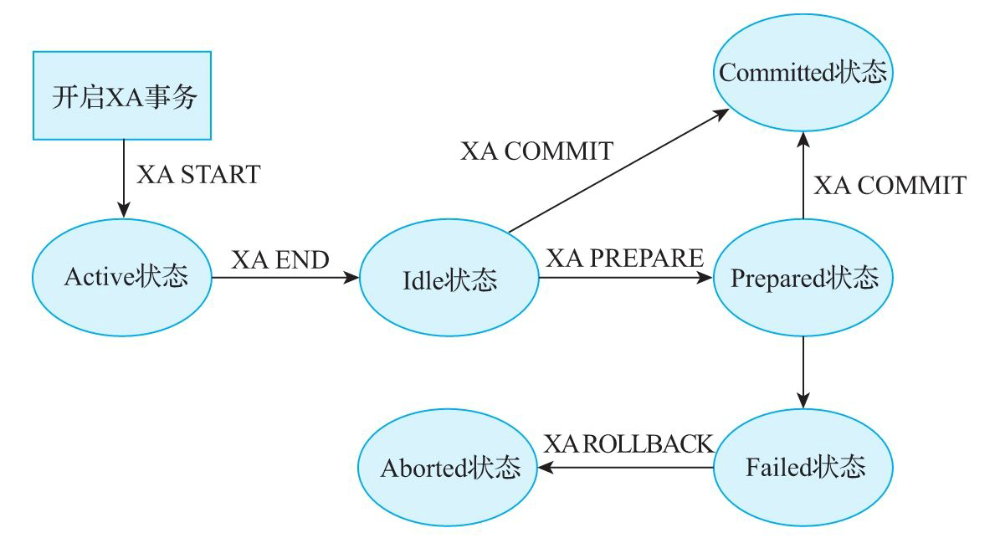{width="6.427890419947507in"
height="3.4611712598425197in"}

> 图8-3　XA事务状态流程图

{width="0.504753937007874in"
height="0.504753937007874in"}

> 注意
>
> 1）在XA START和XA END之间执行的是业务SQL语
>
> 句，无论是否执行成功，都应该执行XA END语句。
>
> 2）在IDLE状态下的事务可以直接执行XA
> COMMIT，这里我们可以这样理解，当只有一个资源管理
>
> 356
>
> 器的时候，可以直接退化成一阶段提交。
> 3）只有状态为Failed的时候，才能执行XA
>
> ROLLBACK进行XA事务回滚。
>
> 4）XA事务和非XA事务（即本地事务）是互斥的。 例如，已经执行了XA
> START命令来开启一个XA事务，则
>
> 本地事务不会被启动，直到XA事务被提交或回滚为止。
> 相反的，如果已经使用START TRANSACTION启动了一
> 个本地事务，则XA语句不能被使用，直到该事务被提交 或回滚为止。
>
> 357
>
> 8.2.4　MySQL XA的问题
>
> 1.MySQL低于5.7版本会出现的问题
>
> 1）已经预提交的事务，在客户端退出或者服务宕机
> 的时候，二阶段提交的事务会被回滚。
>
> 2）在服务器故障重启提交后，相应的BinLog会丢
>
> 失。
>
> MySQL 5.6版本在客户端退出的时候，会自动回滚已
> 经准备好的事务，这是因为，对于处于Prepare状态的事
> 务，MySQL是不会记录BinLog的（官方解释为减少
>
> fsync，起到优化的作用），Prepare状态以前的操作信
> 息都保存在连接的IO_CACHE中，如果此时客户端退出
> 了，那么BinLog信息会被丢弃，重启后会丢失数据。
>
> 2.MySQL高于5.7版本的优化
>
> 事务在Prepare阶段就完成了写BinLog的操作（通过
> 新增一种名为XA_prepare_log_event的event类型来实 现）。
>
> 读者可访问网址
> <https://dev.mysql.com/worklog/task/?id=6860>[查看](https://dev.mysql.com/worklog/task/?id=6860查看)
>
> MySQL对于XA分布式事务的具体优化细节。
>
> 358
>
> 8.3　XA规范的问题思考
>
> XA二阶段规范虽然提供了分布式事务的解决思路与
> 方案，但是自身也存在很多问题，本节我们来一起探讨 下。
>
> 359
>
> 8.3.1　XA规范的缺陷
>
> 下面使用两个MySQL实例，完成一次XA分布式事务， 如图8-4所示。

{width="6.427890419947507in"
height="5.181456692913386in"}

> 图8-4　XA分布式事务流程图
>
> XA规范中每个分支事务的执行都是同步的，并且只会
> 存在一个事务协调者，由于网络的不稳定性，可能会出现
>
> 360
>
> 数据不一致的问题。总体来说，XA分布式事务会存在如下 几个问题。
>
> 1.同步阻塞
>
> 全局事务内部包含多个独立的事务分支，这些事务分
> 支要么都成功，要么都失败。各个事务分支的ACID特性共
> 同构成了全局事务的ACID特性，即单个事务分支支持的
>
> ACID特性被提升到分布式事务的范畴。即使在非分布事务
> 中，如果对读操作很敏感，我们也需要将事务隔离级别设
> 置为串行化。而分布式事务更是如此，可重复读隔离级别
> 不足以保证分布式事务的一致性。如果我们使用MySQL来
>
> 支持XA分布式事务，那么最好将事务隔离级别设置为串行
> 化。串行化是4个事务隔离级别中最高的级别，也是执行 效率最低的级别。
>
> 2.单点故障
>
> 一旦协调者事务管理器发生故障，参与者资源管理器
> 会一直阻塞下去。尤其在两阶段提交的第二个阶段，如果
> 协调者发生故障，那么所有的参与者都将处于锁定事务资
> 源的状态中，无法继续完成事务操作（如果是协调者宕
>
> 机，可以重新选举一个协调者，但是无法解决因为协调者
> 宕机导致的参与者处于阻塞状态的问题）。
>
> 3.数据不一致
>
> 在Commit阶段，当协调者向参与者发送commit请求
> 后，发生了局部网络异常或者在发送commit请求的过程
> 中，协调者发生了故障，会导致只有一部分参与者接收到
>
> 了commit请求。而这部分参与者接到commit请求之后就会
>
> 361
>
> 执行commit操作，但是其他部分未接到commit请求的参与
> 者无法执行事务提交。于是整个分布式系统便出现了数据 不一致性的现象。
>
> 362
>
> 8.3.2　XA流程的优化与异常思考
>
> 本节列举几条XA流程的优化与异常思考。
>
> 1）持久化事务协调阶段的各个状态。事务管理器作
> 为一个单点的事务协同器，很有可能宕机，出现单点故
> 障。其职责主要是事务协调，属于无状态的服务。宕机
> 重启后，可以根据持久化的全局事务状态来恢复事务管
> 理器的执行逻辑，需要将各个协调阶段以及该阶段中每
> 个资源管理器的执行状态持久化到独立的数据库中，多
> 个事务管理器共享一个持久化数据库。例如，Prepare阶
> 段的子阶段branch_tansaction_send、prepare_send、
> prepare_ack阶段，Commit阶段的子阶段commit_send、
> commit_ack阶段，记录每个子阶段中每个资源管理器的 执行状态。
>
> 2）是否需要并行发送语句。在
> branch_tansaction_send、prepare_send、commit_send
>
> 阶段，如果事务管理器往资源管理器发送的语句是串行
> 执行的，单个全局事务的执行时间加长，事务管理器的
> TPS（每秒事务请求数）会降低，可以在这些阶段将已生
>
> 成的语句，通过线程池并行发送给各个资源管理器，事
> 务管理器同步等待语句的返回值，以降低延时。
>
> 3）事务管理器在prepare_send阶段前宕机，重启恢
> 复后，是否需要继续执行prepare_send动作。
>
> 363
>
> 4）事务管理器在prepare_send阶段宕机，可能会有
> 部分资源管理器收到prepare语句，部分没有收到。重启
> 后，向收到prepare语句的资源管理器发送rollback语
>
> 句。
>
> 5）事务管理器在prepare_ack阶段记录各个资源管
> 理器的执行状态后宕机，重启后，根据日志状态发送
> rollback或者commit语句。
>
> ·事务管理器在commit_send阶段宕机，可能会有部
> 分资源管理器收到commit语句，部分没有收到，重启
> 后，向没有收到commit语句的资源管理器发送commit语 句。
>
> ·事务管理器在commit_send阶段宕机，可能会有部
> 分资源管理器收到commit语句，部分没有收到，重启
> 后，向没有收到commit语句的资源管理器发送commit语 句。
>
> ·事务管理器在commit_ack阶段记录各个资源管理器
> 的执行状态后宕机，重启后，根据日志状态发送重试 commit语句或者不操作。
>
> ·资源管理器长时间没有收到事务管理器的rollback
> 或者commit语句时，会一直持有数据库中相关数据的记
> 录锁，不仅占用系统资源，而且会使得相关数据记录无
> 法被其他业务修改，因此资源管理器要有自动回滚或者 提交的功能。
>
> 364
>
> 8.3.3　解决XA数据不一致的问题
>
> 虽然XA规范存在一些缺陷，但是业界提出了解决相应
> 问题的方案。本节简单介绍解决XA数据不一致问题的方 案。
>
> 1.日志存储
>
> 记录XA事务在每个流程中的执行状态，是解决XA数据
> 不一致问题的关键。至于日志应该存储在哪里，使用什么
> 存储，则根据具体需求确定，一般推荐采用中心化的存储
> 方式，比如数据库。表8-1是一个简单的事务日志的数据
>
> 结构。
>
> 表8-1　事务日志数据结构

{width="6.427891513560805in"
height="0.5871620734908136in"}

> 2.自定义事务恢复
>
> 事务恢复，首先通过XA recovery命令从资源管理器
> 中获取需要被恢复的事务记录，然后根据XID匹配应用程
> 序中存储的日志，根据事务状态进行提交或回滚，大体流
>
> 程如图8-5所示。
>
> 365

{width="6.427891513560805in"
height="1.6687784339457568in"}

> 图8-5　自定义事务流程图
>
> 366
>
> 8.3.4　解决事务管理器的单点故障问题
>
> 解决事务管理器的单点故障问题，我们一般会想到集
> 群部署和注册中心。实际上，注册中心检测服务是否可用
> 也是需要时间的。目前业界大致有两种解决方式，一种是
> 去中心化部署（事务管理器嵌套在业务系统中），一种是
> 中心化部署，如图8-6所示。

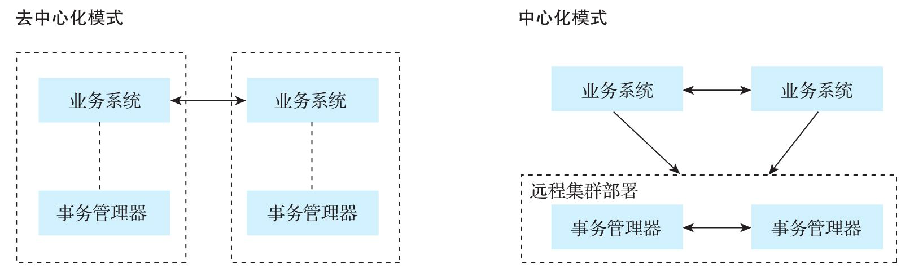{width="6.427890419947507in"
height="1.9263068678915136in"}

> 图8-6　解决事务管理器单点故障问题的部署模型
>
> 1）去中心化部署：事务管理器嵌套在应用程序里
> 面，不再单独部署。集群模式中事务角色由应用程序来解
>
> 决。
>
> 2）中心化部署：事务管理器单独部署，然后与应用
> 程序进行远程通信。集群模式中事务角色依赖其自身解 决。
>
> 367
>
> 8.4　主流的解决方案
>
> XA规范虽已提出多年，但在开源社区中，完整的解
> 决方案并不是很多，下面给大家简单介绍几个目前开源
> 社区中主流的XA分布式事务解决方案。
>
> 1.Atomikos解决方案
>
> Atomikos有免费的社区版本和收费的商业版本。\
> ·官网地址：[https://www.atomikos.com](https://www.atomikos.com/)。\
> ·社区版源码地址：
>
> <https://github.com/atomikos/transactions-essentials>[。](https://github.com/atomikos/transactions-essentials。)
>
> ·社区版本与商业版对比：
> [https://www.atomikos.com/Main/CompareSubscriptions?](https://www.atomikos.com/Main/CompareSubscriptions?done_form=1)
>
> [done_form=1。](https://www.atomikos.com/Main/CompareSubscriptions?done_form=1)
>
> 2.Hmily解决方案
>
> Hmily是国内Dromara开源社区提供的一站式分布式 事务解决方案。
>
> ·官网地址：[https://dromara.org](https://dromara.org/)。\
> ·项目源码地址：
>
> <https://github.com/dromara/hmily>[。](https://github.com/dromara/hmily。)
>
> 368
>
> 3.Narayana解决方案
>
> Narayana是Jboos团队提供的XA分布式事务解决方
>
> 案。
>
> ·官网地址：[http://narayana.io](http://narayana.io/)。\
> ·项目源码地址：
>
> <https://github.com/jbosstm/narayana>[。](https://github.com/jbosstm/narayana。)
>
> 369
>
> 8.5　本章小结
>
> 本章首先介绍了DTP模型、XA规范以及MySQL作为资
> 源管理器对XA规范的支持，接着对XA规范的缺陷进行了
> 一些思考并提出了相关的解决方案，最后简单介绍了目
> 前主流的XA开源解决方案。第9章将对TCC分布式事务原 理进行介绍。
>
> 370
>
> 第9章　TCC分布式事务原理
>
> 基于前面章节介绍的TCC分布式事务解决方案，读者
> 对TCC分布式事务应该有了大体的认识。本章详细介绍
> TCC分布式事务的原理，所涉及的内容如下。
>
> ·TCC核心思想。\
> ·TCC实现原理。\
> ·TCC核心流程。\
> ·TCC关键技术。
>
> 371
>
> 9.1　TCC核心思想
>
> TCC分布式事务最核心的思想就是在应用层将一个完
> 整的事务操作分为三个阶段。在某种程度上讲，TCC是一
> 种资源，实现了Try、Confirm、Cancel三个操作接口。与
>
> 传统的两阶段提交协议不同的是，TCC是一种在应用层实
> 现的两阶段提交协议，在TCC分布式事务中，对每个业务
> 操作都会分为Try、Confirm和Cancel三个阶段，每个阶段
>
> 所关注的重点不同，如图9-1所示。
>
> 1.Try阶段
>
> Try阶段是准备执行业务的阶段，在这个阶段尝试执
> 行业务，重点关注如下事项。
>
> 1）完成所有的业务检查，确保数据的一致性。
>
> 2）预留必要的业务资源，确保数据的隔离性。
>
> 在下单扣减库存的业务场景中，如果使用了TCC分布
> 式事务，则需要在Try阶段检查商品的库存数量是否大于
> 或者等于下单提交的商品数量，如果商品的库存数量大于
>
> 或者等于下单提交的商品数量，则标记扣减库存数量。此
> 时的商品数量并没有真正扣减，只是做资源预留操作，并
> 且会将订单信息保存到数据库，标记为待提交状态。如果
> 商品的库存数量小于下单提交的商品数量，则提示用户库
> 存不足，并且删除提交的订单数据或者将订单状态标记为 删除。
>
> 372

{width="6.427891513560805in"
height="4.841520122484689in"}

> 图9-1　TCC分布式事务每个阶段关注的重点
>
> 2.Confirm阶段
>
> Confirm阶段是确认执行业务的阶段，在这个阶段确
> 认执行的业务。此时，重点关注如下事项。
>
> 1）真正地执行业务。
>
> 2）不做任何业务逻辑检查，直接将数据持久化到数 据库。
>
> 3）直接Try阶段预留的业务资源。
>
> 373
>
> 在下单扣减库存的业务场景中，由于在Try阶段已经
> 检查过商品的库存数量大于或者等于下单提交的商品数
> 量，因此在Confirm阶段不会进行二次检查，直接将订单
> 的状态更新为"已提交"，并且真正执行扣减库存操作。
> 在Confirm阶段是真正地执行业务操作，其间不会做任何
> 业务检查，直接使用Try阶段预留的业务资源。
>
> 3.Cancel阶段
>
> Cancel阶段取消执行业务，重点关注如下事项。
>
> 1）释放Try阶段预留的业务资源。
>
> 2）将数据库中的数据恢复到最初的状态。
>
> 在下单扣减库存的业务场景中，假设Try阶段检查的
> 结果为商品的库存数量大于或者等于下单提交的商品数
> 量，在执行完订单提交业务后，执行扣减库存操作时发生
> 异常，或者在执行Confirm阶段的业务时发生异常。此
> 时，会执行Cancel阶段的操作回滚业务，使数据回到提交 订单之前的状态。
>
> 在某种程度上，TCC分布式事务的三个阶段与关系型
> 数据库的事务操作也存在类似的地方，如图9-2所示。
>
> 374

{width="6.427891513560805in"
height="3.1521391076115486in"}

> 图9-2　TCC分布式事务与关系型数据库事务操作的对应关
>
> 系
>
> 在一个分布式或微服务系统中，TCC分布式事务的Try
> 阶段是先把多个应用中的业务资源锁定，预留执行分布式
> 事务的资源。同样，关系型数据库的DML操作会锁定数据
>
> 库的行记录，持有数据库的资源。TCC分布式事务的
> Confirm操作是在所有涉及分布式事务的应用的Try阶段都
> 执行成功后确认并提交最终事务状态的操作，而关系型数
> 据库的Commit操作是在所有的DML操作执行成功之后提交
> 事务。TCC分布式事务的Cancel操作是在涉及分布式事务
> 的应用没有全部执行成功时，将已经执行成功的应用进行
> 回滚，而关系型数据库的回滚操作是在执行的DML操作存
> 在异常时执行的。关系型数据库中的Commit操作和
> Rollback操作也是一对反向业务操作，TCC分布式事务中
> 的Confirm操作和Cancel操作也是一对反向业务操作。
>
> 另外，由于使用TCC分布式事务时，各业务系统的事
> 务未达到最终状态时，会存在短暂的数据不一致现象，因
>
> 375
>
> 此各业务系统需要具备兼容数据最终一致性之前带来的可 见性问题的能力。
>
> 376
>
> 9.2　TCC实现原理
>
> TCC分布式事务在应用层将整体事务的执行分为
> Try、Confirm、Cancel三个阶段。每个阶段的执行不会
>
> 过多地占用数据库资源，而是在Try阶段预留事务提交必
> 须的业务资源。TCC分布式事务的实现与其核心原理密不
> 可分。本节就简单介绍下TCC分布式事务的核心原理。
>
> 377
>
> 9.2.1　TCC核心组成
>
> 一个完整的TCC分布式事务需要包含三个部分：主业
> 务服务、从业务服务和TCC管理器，如图9-3所示。

{width="6.427890419947507in"
height="2.4722648731408574in"}

> 图9-3　TCC分布式事务包含的核心部分
>
> 主业务服务是TCC分布式事务的发起方，在下单扣减
> 库存的业务场景中，订单服务是TCC分布式事务的发起 方，就是主业务服务。
>
> 从业务服务主要负责提供TCC业务操作，是整个业务
> 活动的操作方。从业务活动必须实现TCC分布式事务Try、
>
> Confirm和Cancel三个阶段的接口，供主业务服务调用。
> 由于在TCC分布式事务的执行过程中，Confirm阶段的操作
> 和Cancel阶段的操作可能会被执行多次，因此需要
> Confirm阶段的操作和Cancel阶段的操作保证幂等性。
>
> 378
>
> TCC管理器在整个TCC分布式事务的执行过程中，管理
> 并控制着整个事务活动，包括记录并维护TCC全局事务的
> 事务状态和每个从业务服务的分支事务状态，并在参与分
> 布式事务的所有分支事务的Try阶段都执行成功时，自动
> 调用每个分支事务的Confirm阶段的操作，完成分布式事
> 务，同时会在参与分布式事务的某些分支事务执行失败
> 时，自动调用分支事务的Cancel操作回滚分布式事务。
>
> 379
>
> 9.2.2　TCC核心原理
>
> 在使用TCC分布式事务解决分布式场景下的数据一致
> 性问题时，需要将原本的一个事务接口改造成三个不同的
>
> 事务逻辑，也就是前文说的Try阶段、Confirm阶段和 Cancel阶段。
>
> 原本一个接口的方法完成的事务逻辑也要分拆成如下 执行流程。
>
> 1）依次执行所有参与TCC分布式事务的分支事务Try 阶段的操作。
>
> 2）如果每个分支事务Try阶段的逻辑都执行成功，则
> TCC分布式事务管理器会自动调用每个分支事务Confirm阶
> 段的方法并执行，完成整个分布式事务的逻辑。
>
> 3）如果某个分支事务的Try逻辑或者Confirm逻辑的
> 执行出现问题，则TCC分布式事务管理器会自动感知这些
> 异常信息，然后自动调用每个分支事务Cancel阶段的方法
>
> 执行Cancel逻辑，回滚之前执行的各种操作，使数据恢复
> 到执行TCC分布式事务之前的状态。
>
> 讲得直白点，就是如果遇到如下情况，TCC分布式事
> 务会在Try阶段检查参与分布式事务的各个服务、数据库
> 和资源是否都能够保证分布式事务正常执行，能否将执行
>
> 分布式事务的资源预留出来，而不是先执行业务逻辑操 作。
>
> 380
>
> 1）数据库或其他数据存储服务宕机，例如下单扣减
> 库存时，库存数据库宕机了。
>
> 2）某个应用服务宕机，例如下单扣减库存时，库存 服务宕机了。
>
> 3）参与分布式事务的资源不足，例如下单扣减库存 时，商品库存不足。
>
> 如果参与分布式事务的服务都正常执行了，也就是
> 说，数据库或其他数据存储能够正常提供服务，所有参与
>
> 分布式事务的应用服务正常，执行分布式事务时需要的资
> 源充足，并且在Try阶段顺利预留出执行分布式事务需要
> 的资源，再执行TCC分布式事务的Confirm阶段，就能够大
> 概率保证分布式事务成功执行。
>
> 如果在Try阶段，某个服务执行失败了，可能是数据
> 库或者其他数据存储宕机了，或者是这个服务宕机了，也
>
> 有可能是这个服务对应的数据资源不足。此时，会自动执
> 行各个服务Cancel阶段的逻辑，回滚Try阶段执行的业务
> 逻辑，将数据恢复到执行分布式事务之前的状态。
>
> 其实，通过上面的逻辑，TCC分布式事务还是不能保
> 证执行结果数据的一致性。这里存在着一个问题，那就是
>
> 如果发生了异常情况，例如，在下单扣减库存的业务场景
> 中，订单服务突然宕机，然后重启订单服务，TCC分布式
> 事务如何保证之前没有执行完的事务继续执行呢？
>
> 这种问题在实际的业务场景中是经常出现的，在设计
> TCC分布式事务框架时必须要考虑这种异常场景。在执行
> TCC分布式事务时，需要记录一些分布式事务的活动日
>
> 381
>
> 志，将这些活动日志存储到文件或者数据库中，将分布式
> 事务的各个阶段和每个阶段执行的状态全部记录下来。
>
> 除了参与TCC分布式事务的某些服务宕机这种问题，
> 还需要注意空回滚、幂等和悬挂等问题。有关空回滚、幂
>
> 等和悬挂问题及解决方案，读者可以参考第7章的有关内
> 容，这里笔者不再赘述。
>
> 综上可以得出图9-4所示的TCC分布式事务总体执行示 意图。

{width="6.427890419947507in"
height="2.698889982502187in"}

> 图9-4　TCC分布式事务总体执行示意图
>
> 无论是主业务服务还是从业务服务，在执行TCC分布
> 式事务时，都需要TCC事务管理器的参与。在实际业务场
> 景中，TCC事务管理器作为某一种具体的TCC分布式事务框
>
> 架，例如Dromara开源社区的Hmily框架，会在Try阶段进
> 行业务检查、预留业务资源。在Confirm阶段不再进行业
> 务检查，使用Try阶段预留的业务资源真正地执行业务操
> 作。在Cancel阶段释放Try阶段预留的资源，使数据回滚
> 到执行TCC分布式事务之前的状态。在TCC分布式事务的每
>
> 382
>
> 个阶段，TCC事务管理器都会将各个阶段和每个阶段执行
> 的状态全部记录到事务记录数据库或者事务记录文件中。
>
> 通过上面的执行逻辑，只要业务逻辑中不存在明显的
> Bug和异常，TCC分布式事务就能够保证所有参与分布式事
> 务的服务逻辑要么全部执行成功，要么全部不执行。
>
> 383
>
> 9.3　TCC核心流程
>
> 为了更好地理解TCC分布式事务的执行流程，本节以
> 电商业务场景中提交订单、扣减库存、增加积分、创建
> 出库单的场景为例，简单介绍TCC分布式事务每个阶段的 核心执行流程。
>
> 384
>
> 9.3.1　业务场景介绍
>
> 在电商业务场景中，一个典型的业务场景就是支付订
> 单。这个场景包含修改订单状态、扣减存库、增加积分、
> 创建出库单等业务，这些业务要么全部执行成功，要么全
> 部执行失败，必须是一个完整的事务。如果不能构成一个
> 完整的事务，就有可能出现库存未扣减或者超卖的问题。
>
> 如果没有使用分布式事务，在订单服务中，修改订单
> 状态成功，调用远程的库存服务出现异常，此时有可能出
> 现修改订单成功，但库存未扣减的情况，如图9-5所示。

{width="6.427890419947507in"
height="3.6568930446194226in"}

> 图9-5　支付场景修改订单成功但库存未扣减
>
> 385
>
> 如果库存服务出现异常，则订单服务在第②步调用库
> 存服务执行扣减库存的操作就失败了，随后调用积分服务
> 增加积分和调用存储服务生成出库单却都成功了，此时就
> 出现了支付修改订单状态成功，商品库存未扣减的情况。
>
> 如果修改订单状态的操作执行失败，而调用库存服务
> 扣减商品库存的操作执行成功，此时就出现了商品库存被
> 异常扣减的情况，可能会导致超卖的现象，如图9-6所
>
> 示。

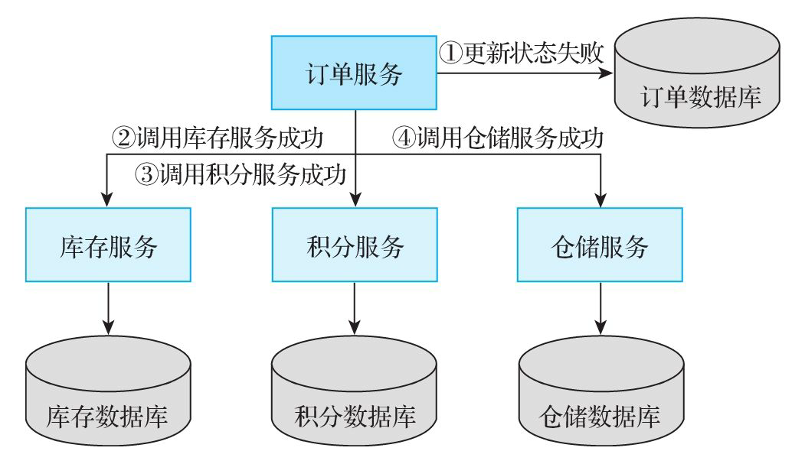{width="6.427890419947507in"
height="3.7083978565179354in"}

> 图9-6　支付场景更新订单状态失败而库存却扣减成功
>
> 在支付订单的场景中，第①步更新订单操作失败，但
> 是后续调用库存服务、积分服务和仓储服务都执行成功，
> 这种情况可能就是用户支付失败，或者取消了支付，但是
> 仍旧扣减了库存、增加了用户积分、提交了出库单，最终
> 可能会导致商品超卖的严重问题。
>
> 386
>
> 在电商支付订单的业务场景中，涉及多个服务之间的
> 调用，为了保证数据的一致性，必须使用分布式事务。接
> 下来，结合电商支付订单的业务场景，简单介绍下TCC分
>
> 布式事务中每个阶段的执行流程。
>
> 注意，在上述异常情况中，笔者只列举了更新订单状
> 态和扣减库存失败的情况，积分服务和仓储服务也有可能
> 会出现异常的情况，读者可以自行分析，笔者不再赘述。
>
> 387
>
> 9.3.2　Try阶段流程
>
> 在电商支付订单的业务场景中，为了保证最终数据的
> 一致性，对于订单服务，不能将订单状态直接更新为"支
> 付成功"，而是要先更新为"支付中"的状态；对于库存
> 服务，也不能直接扣减库存，而是要扣减库存后在冻结库
> 存的字段中保存扣减库存的数量；对于积分服务，不能直
> 接为用户账户增加积分，而是要在单独的字段中设置用户
> 应该增加的积分；对于仓储服务，创建的出库单状态应该
> 被标记为"不确定"，如图9-7所示。
>
> 在电商支付订单的场景中，Try阶段主要的业务流程 如下所示。
>
> 1）订单服务将订单数据库中订单的状态更新为"支 付中"。
>
> 2）订单服务调用库存服务冻结部分库存，将冻结的
> 库存数量也就是用户下单时提交的商品数量，单独写入商
>
> 品库存表的冻结字段中，同时将商品库存数量减去冻结的 商品数量。
>
> 3）订单服务调用积分服务进行预增加积分的操作，
> 在用户积分数据表中，将要增加的积分写入单独的预增加
>
> 积分字段中，而不是直接增加用户的积分。
>
> 388

{width="6.427891513560805in"
height="3.7083978565179354in"}

> 图9-7　电商支付场景中Try阶段执行的流程
>
> 4）订单服务调用仓储服务生成出库单时，将出库单
> 的状态标记为"未知"，并不直接生成正常的出库单。
>
> 389
>
> 9.3.3　Confirm阶段流程
>
> 如果Try阶段的业务逻辑全部执行成功，则TCC分布式
> 事务会执行Confirm阶段的业务逻辑。在实际场景中，
> Confirm阶段的执行往往是由TCC分布式事务框架调用完成
> 的。在订单服务中会将订单的状态由"支付中"更新为
> "支付成功"。在库存服务中会真正地扣减库存，将写入
> 冻结字段的库存数量减去当次下单时提交的商品数量。在
> 积分服务中会将当次支付产生的积分从预增加积分字段中
> 扣除，并将对应的积分增加到用户积分账户中。在仓储服
> 务中会将出库单的状态由"未知"更新为"已创建"，如 图9-8所示。

{width="6.427891513560805in"
height="4.202851049868767in"}

> 390
>
> 图9-8　电商支付场景中Confirm阶段执行的流程
>
> 在电商支付订单的场景中，Confirm阶段主要的业务 流程如下所示。
>
> 1）订单服务将订单数据库中订单的状态更新为"支 付成功"。
>
> 2）TCC分布式事务框架调用库存服务中Confirm阶段
> 的方法，真正地扣减库存，将预扣减字段中的库存数量减
>
> 去当次下单提交的商品数量。
>
> 3）TCC分布式事务框架调用积分服务中Confirm阶段
> 的方法，真正地增加积分，将预增加积分字段中的积分数
>
> 量减去当次支付产生的积分数量，并且在用户的积分账户
> 中增加当次支付产生的积分数量。
>
> 4）TCC分布式事务框架调用仓储服务中Confirm阶段
> 的方法，将出库单的状态更新为"已创建"。
>
> 391
>
> 9.3.4　Cancel阶段流程
>
> 如果Try阶段的业务执行失败，或者某个服务出现异
> 常等，TCC分布式事务框架能够感知到这些异常信息，会
> 自动执行Cancel阶段的流程，对整个TCC分布式事务进行
> 回滚。在实际场景中，Cancel阶段的执行往往是由TCC分
> 布式事务框架调用完成的。
>
> 在订单服务中，将订单的状态更新为"已取消"。在
> 库存服务中，将当次下单提交的商品数量加回到商品库存
> 字段中，并且在预扣减库存的字段中减去当次下单提交的
> 商品数量。在积分服务中，在预增加积分字段中减去当次
> 支付产生的积分数量。在仓储服务中，将出库单的状态标
> 记为"已取消"。具体流程如图9-9所示。
>
> 392

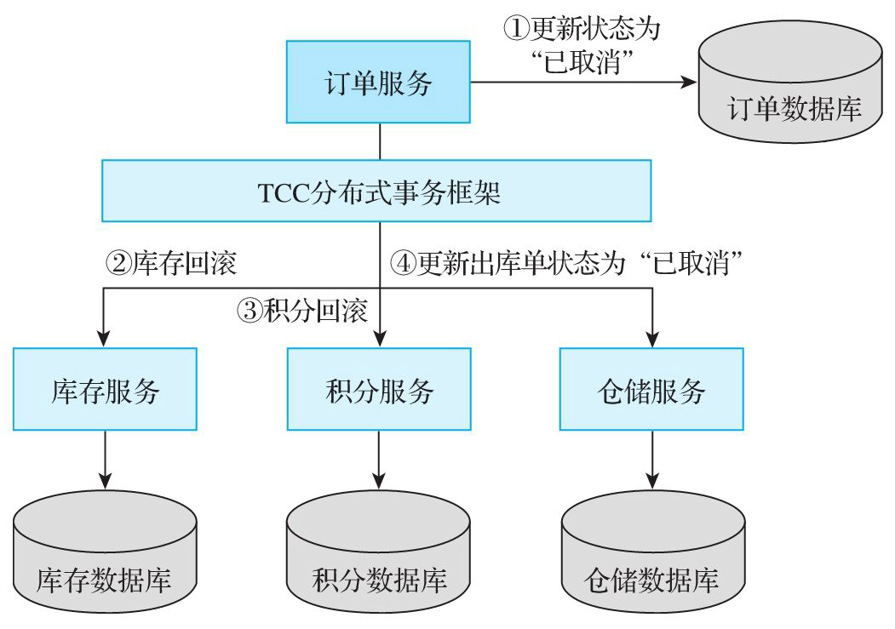{width="6.427890419947507in"
height="4.522186132983377in"}

> 图9-9　电商支付场景中Cancel阶段执行的流程
>
> 在电商支付订单的场景中，Cancel阶段主要的业务流 程如下所示。
>
> 1）订单服务将订单数据库中订单的状态标记为"已 取消"。
>
> 2）TCC分布式事务框架调用库存服务Cancel阶段的方
> 法进行事务回滚，将库存数据表中的预扣减库存字段中存
> 储的商品数量减去当次下单提交的商品数量，并且将库存
> 数据表中的商品库存字段存储的商品库存数量增加当次下 单提交的商品数量。
>
> 393
>
> 3）TCC分布式事务框架调用积分服务Cancel阶段的方
> 法进行事务回滚，将积分数据中的预增加积分字段中的积
> 分数量减去当次支付产生的积分数量。
>
> 4）TCC分布式事务框架调用仓储服务Cancel阶段的方
> 法进行事务回滚，将出库单的状态标记为"已取消"。
>
> 394
>
> 9.4　TCC关键技术
>
> 在TCC事务管理器，也就是TCC分布式事务框架的实
> 现过程中，有几项关键技术需要注意。本节就以Dromara
>
> 开源社区的TCC分布式事务框架Hmily为例，简单介绍实
> 现TCC分布式事务框架的关键技术。
>
> 1.AOP切面
>
> 实现TCC分布式事务的第一个核心技术就是AOP切
> 面。无论是TCC分布式事务的发起者，还是参与者，都需
>
> 要经过AOP切面的处理。通过AOP切面拦截具体的业务逻
> 辑，在AOP切面中执行事务日志的记录、远程调用等逻
> 辑。Hmily框架中大量使用了Spring的AOP切面，处理分 布式事务问题。
>
> 2.反射技术
>
> 实现TCC分布式事务的第二个核心技术就是反射技
> 术。TCC分布式事务中Confirm阶段的方法和Cancel阶段
>
> 的方法是通过反射技术调用的。这也就是Hmily框架在
> Try阶段的方法上使用注解来指定Confirm方法和Cancel
> 方法的原因。在Try阶段的方法上使用注解指定Confirm
> 方法和Cancel方法，Hmily框架会在执行完Try方法后，
> 使用反射技术自动调用Confirm方法或者Cancel方法。
>
> 3.持久化技术
>
> 395
>
> 实现TCC分布式事务的第三个核心技术就是持久化技
> 术。在分布式事务的实现中，所有参与事务的服务都存
> 在数据的持久化操作。在分布式环境中，由于网络的不
> 稳定性，随时都有可能出现调用服务方法失败的情况，
> 在TCC分布式事务中，需要保证数据的最终一致性。如果
> 只有一部分服务的请求被正常处理，则另一部分服务的
> 请求最终也需要被处理，对请求数据持久化是必不可少
> 的。Hmily框架不仅支持使用Redis、ZooKeeper、文件、
> 缓存、ETCD、MongoDB等进行持久化操作，还提供了SPI
> 扩展接口，使具体业务能够根据实际需求实现自身的持 久化技术。
>
> 4.序列化技术
>
> 实现TCC分布式事务的第四个核心技术就是序列化技
> 术。在分布式环境中，数据的持久化和在网络中的传
> 输，都需要序列化技术的支持。Hmily框架支持的序列化
> 技术包括JDK自带的序列化技术、Hessian序列化技术、
> Kyro序列化技术、MsgPack序列化技术和ProtoBuf序列化
> 技术。另外，Hmily框架还提供了SPI扩展接口，使具体
> 的业务能够根据实际需求实现自身的序列化技术。
>
> 5.定时任务
>
> 实现TCC分布式事务的第五个核心技术就是定时任
> 务。在分布式环境中，由于网络的不稳定性，难免会出
>
> 现方法调用失败的情况，此时，需要利用定时任务来重
> 试方法的调用操作。Hmily框架实现了当方法调用失败
> 时，使用定时任务进行重试的机制。
>
> 396
>
> 6.动态代理
>
> 实现TCC分布式事务的第六个核心技术就是动态代
> 理。分布式环境中存在很多远程调用框架，在分布式事
>
> 务的实现过程中，需要通过动态代理的方式支持多种远
> 程调用框架。例如，在Hmily框架中通过动态代理支持多
> 种远程调用框架，这些远程调用框架包括Apache Dubbo、Alibaba
> Dubbo、BRPC、gRPC、Motan、Sofa- RPC、Spring Cloud、Tars等。
>
> 7.多配置源技术
>
> 实现TCC分布式事务的第七个核心技术就是多配置源
> 技术。在分布式环境中，为了便于管理各业务系统的配
> 置，往往会集中存储各业务系统的配置，并通过相应的
> 技术快速同步到各业务系统的本地缓存中。由于在真正
> 的业务场景中，会存在不同的配置存储技术，因此实现
> 分布式事务时，需要支持多配置源技术。例如，在Hmily
> 框架中，就实现了多种配置源技术，这些配置源包括
> Apollo、Consul、ETCD、Loader、Nacos、ZooKeeper、
> 本地存储等。另外，Hmily框架还提供了SPI扩展接口，
> 使具体的业务能够根据实际需求实现自身的配置源技 术。
>
> 397
>
> 9.5　本章小结
>
> 本章主要对TCC分布式事务的原理进行了简单的介
> 绍。首先介绍了TCC分布式事务的核心思想，接下来介绍
>
> 了TCC分布式事务的实现原理，包括TCC分布式事务的核
> 心组成部分和TCC分布式事务的核心原理，随后对TCC分
> 布式事务的核心流程进行了详细的介绍，最后简单介绍
> 了实现TCC分布式事务的关键技术。第10章将对基于可靠
>
> 消息最终一致性的分布式事务原理进行介绍。
>
> 398
>
> 第10章　可靠消息最终一致性分布式事 务原理
>
> 可靠消息最终一致性是分布式事务解决方案中一种
> 典型的柔性事务解决方案。这种分布式事务解决方案通
> 常有两种实现方式：一种是基于本地消息表方案实现，
> 另一种是基于RocketMQ事务消息实现。同时，需要注意
> 消息发送的一致性和消息的可靠性问题。本章简单介绍
> 可靠消息最终一致性的基本原理，所涉及的内容如下。
>
> ·基本原理。\
> ·本地消息表。\
> ·独立消息服务。\
> ·RocketMQ事务消息。\
> ·消息发送的一致性。\
> ·消息接收的一致性。\
> ·消息的可靠性。
>
> 399
>
> 10.1　基本原理
>
> 可靠消息最终一致性的基本原理是事务发起方（消息
> 发送者）执行本地事务成功后发出一条消息，事务参与方
> （消息消费者）接收到事务发起方发送过来的消息，并成
> 功执行本地事务。事务发起方和事务参与方最终的数据能 够达到一致的状态。
>
> 这里主要强调如下两点。
>
> 1）事务发起方一定能够将消息成功发送出去。
>
> 2）事务参与方一定能够成功接收到消息。
>
> 可以利用消息中间件实现可靠消息最终一致性分布式
> 事务方案，如图10-1所示。

{width="6.427890419947507in"
height="0.9270997375328084in"}

> 图10-1　可靠消息最终一致性基本原理图
>
> 事务发起方将消息发送给消息中间件，事务参与方从
> 消息中间件中订阅（接收）消息。事务发起方会通过网络
> 将消息发送给消息中间件，而事务参与方也需要通过网络
> 接收消息中间件的消息。网络的不确定性可能会造成事务
> 发起方发送消息失败，也可能会造成事务参与方接收消息
> 失败，即造成分布式事务的问题。
>
> 400
>
> 在使用可靠消息最终一致性方案解决分布式事务的问
> 题时，需要确保消息发送和消息消费的一致性，从而确保 消息的可靠性。
>
> 401
>
> 10.2　本地消息表
>
> 为了防止在使用消息一致性方案处理分布式事务的
> 过程中出现消息丢失的情况，使用本地事务保证数据业
> 务操作和消息的一致性，也就是通过本地事务，将业务
> 数据和消息数据分别保存到本地数据库的业务数据表和
> 本地消息表中，然后通过定时任务读取本地消息表中的
> 消息数据，将消息发送到消息中间件，等到消息消费者
> 成功接收到消息后，再将本地消息表中的消息删除。这
> 种方式实现的分布式事务就是基于本地消息表的可靠消
> 息最终一致性分布式事务。
>
> 402
>
> 10.2.1　实现原理
>
> 基于本地消息表实现的可靠消息最终一致性方案的核
> 心思想是将需要通过分布式系统处理的任务，比如同步数
> 据等操作，通过消息或者日志的形式异步执行，这些消息
> 或者日志可以存储到本地文件中，也可以存储到本地数据
> 库的数据表中，还可以存储到消息中间件中，然后通过一
> 定的业务规则进行重试。这种方案要求各个服务的接口具
> 有幂等性，原理如图10-2所示。
>
> 存放消息的本地消息表和存放数据的业务数据表位于
> 同一个数据库中，这种设计能够保证使用本地事务达到消
> 息和业务数据的一致性，并且引入消息中间件实现多个分
> 支事务之间的最终一致性，整体流程如下所示。
>
> 第一步：事务发起方向业务数据表成功写入数据后，
> 会向本地消息表发送一条消息数据，因为写业务数据和写
> 消息数据在同一个本地事务中，所以本地事务会保证这条
> 消息数据一定能够正确地写入本地消息表。
>
> 第二步：使用专门的定时任务将本地消息表中的消息
> 写入消息中间件，如果写入成功，会将消息从本地消息表
> 中删除。否则，继续根据一定的规则进行重试操作。
>
> 第三步：如果消息根据一定的规则写入消息中间件仍
> 然失败，可以将失败的消息数据转储到"死信"队列数据
> 表中，后续进行人工干预，以达到事务最终一致性的目
>
> 的。
>
> 403
>
> 第四步：事务参与方，也就是消息消费者会订阅消息
> 中间件的消息，当接收到消息中间件的消息时，完成本地 的业务逻辑。
>
> 第五步：事务参与方的本地事务执行成功，则整个分
> 布式事务执行成功。否则，会根据一定的规则进行重试。
> 如果仍然不能成功执行本地事务，则会给事务发起方发送
> 一条事务执行失败的消息，以此来通知事务发起方进行事 务回滚。

{width="6.427890419947507in"
height="2.863707349081365in"}

> 图10-2　基于本地消息表实现的可靠消息最终一致性原理
>
> 404
>
> 10.2.2　优缺点
>
> 可靠消息最终一致性分布式事务解决方案是处理分
> 布式事务的典型方案，也是业界使用比较多的一种方
> 案。基于本地消息表实现的可靠消息方案是其中一种具
> 体实现方式，这种实现方式有如下明显的优点。
>
> 1）使用消息中间件在多个服务之前传递消息数据，
> 在一定程度上避免了分布式事务的问题。
>
> 2）作为业界使用比较多的一种方案，相对比较成
>
> 熟。
>
> 也有比较明显的缺点，如下所示。
>
> 1）无法保证各个服务节点之间数据的强一致性。
>
> 2）某个时刻可能会查不到提交的最新数据。
>
> 3）消息表会耦合到业务库中，需要额外手动处理很
> 多发送消息的逻辑，不利于消息数据的扩展。如果消息
> 表中存储了大量的消息数据，会对操作业务数据的性能 造成一定的影响。
>
> 4）消息发送失败时需要重试，事务参与方需要保证 消息的幂等。
>
> 405
>
> 5）如果消息重试后仍然失败，则需要引入人工干预 机制。
>
> 6）消息服务与业务服务耦合，不利于消息服务的扩 展和维护。
>
> 7）消息服务不能共用，每次需要实现分布式事务
> 时，都需要单独开发消息服务逻辑，增加了开发和维护
>
> 的成本。
>
> 406
>
> 10.3　独立消息服务
>
> 顾名思义，独立消息服务就是将消息处理部分独立
> 部署成单独的服务，以便消息服务能够单独开发和维
> 护，这样就实现了消息服务和业务服务的解耦、消息数
> 据和业务数据的解耦，方便对消息服务进行扩展。
>
> 407
>
> 10.3.1　实现原理
>
> 独立消息服务是在本地消息表的基础上进一步优化，
> 将消息服务独立出来，并将消息数据从本地消息表独立成
> 单独消息数据库，引入消息确认服务和消息恢复服务，如 图10-3所示。
>
> 408

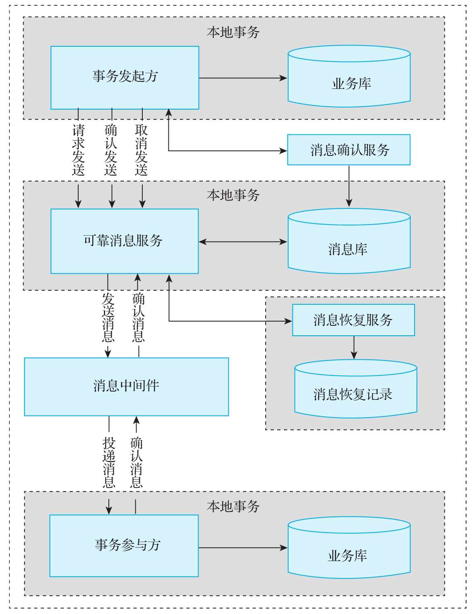{width="6.427890419947507in"
height="8.31299321959755in"}

> 图10-3　独立消息服务实现的分布式事务
>
> 409
>
> 独立消息服务实现的分布式事务中有几个核心服务，
> 分别为可靠消息服务、消息确认服务、消息恢复服务和消
> 息中间件，具体流程如下所示。
>
> 第一步：事务发起方向可靠消息服务成功发送消息 后，执行本地事务。
>
> 第二步：可靠消息服务接收到事务发起方发送的消息
> 后，将消息存储到消息库中，并将消息记录的状态标记为
> "待发送"，并不会马上向消息中间件发送消息。同时，
> 向事务发起方响应消息发送已就绪的状态。
>
> 第三步：当事务发起方的事务执行成功时，事务发起
> 方会向可靠消息服务发送确认消息，否则，发送取消消 息。
>
> 第四步：当可靠消息服务接收到事务发起方发送过来
> 的确认消息时，会将消息发送到消息中间件，并将消息库
> 中保存的当前消息记录状态标记为"已发送"。如果可靠
> 消息接收到事务发起方发送的取消消息，会直接将消息库
> 中保存的当前消息删除或者标记为"已删除"。
>
> 第五步：消息中间件接收到可靠消息服务发送过来的
> 消息时，会将消息投递给业务参与方，业务参与方接收到
> 消息后，执行本地事务，并将执行结果作为确认消息发送 到消息中间件。
>
> 第六步：消息中间件将确认结果投递到可靠消息服
> 务，可靠消息服务接收到确认消息后，根据结果状态将消
>
> 息库中的当前消息记录标记为"已完成"。
>
> 410
>
> 第七步：如果事务发起方向可靠消息服务发送消息失
> 败，会触发消息重试机制。如果重试后仍然失败，则会由
> 消息确认服务定时校对事务发起方的事务状态和消息数据
> 库中当前消息的状态，发现状态不一致时，采用一定的校 对规则进行校对。
>
> 第八步：如果可靠消息服务向消息中间件发送消息失
> 败，会触发消息重试机制。如果重试后仍然失败，则会由
> 消息恢复服务根据一定的规则定时恢复消息库中的消息数 据。
>
> 411
>
> 10.3.2　优缺点
>
> 使用独立消息服务实现分布式事务的优点如下所
>
> 示。
>
> 1）消息服务能够独立部署、独立开发和维护。
>
> 2）消息服务与业务服务解耦，具有更好的扩展性和 伸缩性。
>
> 3）消息表从本地数据库解耦出来，使用独立的数据
> 库存储，具有更好的扩展性和伸缩性。
>
> 4）消息服务可以被多个服务共用，降低了重复开发 消息服务的成本。
>
> 5）消息数据的可靠性不依赖于消息中间件，弱化了 对于消息中间件的依赖性。
>
> 缺点如下。
>
> 1）发送一次消息需要请求两次接口。
>
> 2）事务发起方需要开发比较多的事务查询接口，在
> 一定程度上增加了开发成本。
>
> 412
>
> 10.4　RocketMQ事务消息
>
> RocketMQ是阿里巴巴开源的一款支持事务消息的消
> 息中间件，于2012年正式开源，2017年成为Apache基金
> 会的顶级项目。RocketMQ的高可用机制以及可靠消息设
> 计能够在系统发生异常时保证事务达到最终一致性。
>
> 413
>
> 10.4.1　实现原理
>
> RocketMQ主要由Producer端和Broker端组成。
> RocketMQ的事务消息主要是为了让Producer端的本地事务
>
> 与消息发送逻辑形成一个完整的原子操作，即Producer端
> 的本地事务和消息发送逻辑要么全部执行成功，要么全部
> 不执行。在RocketMQ内部，Producer端和Broker端具有双
> 向通信能力，使得Broker端具备事务协调者的功能。
>
> RockertMQ提供的消息存储机制本身就能够对消息进行持
> 久化操作，这些可靠的设计能够保证在系统出现异常时，
> 事务依然能够达到一致性。
>
> RocketMQ 4.3版之后引入了完整的事务消息机制，其
> 内部实现了完整的本地消息表逻辑，使用RocketMQ实现可
> 靠消息分布式事务就不用用户再实现本地消息表的逻辑
>
> 了，极大地减轻了开发工作量。
>
> 使用RocketMQ实现可靠消息分布式事务解决方案的基 本原理如图10-4所示。
>
> 414

{width="6.427890419947507in"
height="4.57369094488189in"}

> 图10-4　RocketMQ实现可靠消息分布式事务解决方案的基 本原理
>
> 整体流程如下所示。
>
> 第一步：事务发起方向RocketMQ发送Half消息。
>
> 第二步：RocketMQ向事务发起方响应Half消息发送成
>
> 功。
>
> 第三步：事务发起方执行本地事务，向本地数据库中 插入、更新、删除数据。
>
> 第四步：事务发起方向RocketMQ发送提交事务或者回 滚事务的消息。
>
> 415
>
> 第五步：如果事务参与方未收到消息或者执行事务失
> 败，且RocketMQ未删除保存的消息数据，则RocketMQ会回
> 查事务发起方的接口，查询事务状态，以此确认是再次提
> 交事务还是回滚事务。
>
> 第六步：事务发起方查询本地数据库，确认事务是否 是执行成功的状态。
>
> 第七步：事务发起方根据查询到的事务状态，向
> RocketMQ发送提交事务或者回滚事务的消息。
>
> 第八步：如果第七步中，事务发起方向RocketMQ发送
> 的是提交事务的消息，则RocketMQ会向事务参与方投递消 息。
>
> 第九步：如果第七步中，事务发起方向RocketMQ发送
> 的是回滚事务的消息，则RocketMQ不会向事务参与方投递
> 消息，并且会删除内部存储的消息数据。
>
> 第十步：如果RocketMQ向事务参与方投递的是执行本
> 地事务的消息，则事务参与方会执行本地事务，向本地数
> 据库中插入、更新、删除数据。
>
> 第十一步：如果RocketMQ向事务参与方投递的是查询
> 本地事务状态的消息，则事务参与方会查询本地数据库中 事务的执行状态。
>
> 在使用RocketMQ实现分布式事务时，上述流程中的主
> 要部分都由RocketMQ自动实现了，开发人员只需要实现本
> 地事务的执行逻辑和本地事务的回查方法，重点关注事务 的执行状态即可。
>
> 416
>
> 10.4.2　RocketMQ本地事务监听接口
>
> RocketMQ内部提供了本地事务的监听接口
> RocketMQLocalTransactionListener。Rocket-
>
> MQLocalTransactionListener接口中主要有
> executeLocalTransaction(Message,Object)和check-
> LocalTransaction(Message)两个方法，源码如下所示。
>
> public interface RocketMQLocalTransactionListener {
>
> RocketMQLocalTransactionState\
> executeLocalTransaction(Message msg, Object arg);
>
> RocketMQLocalTransactionState checkLocalTransaction(Message msg);
>
> }
>
> 当事务发起方成功向RocketMQ发送准备执行事务的 消息后，RocketMQ会回调
> RocketMQLocalTransactionListener接口中的
> executeLocalTransaction(Message,Object)方法。
> executeLocalTransaction(Message,Object)方法中主要
> 接收两个参数：一个是Message类型参数，表示回传的消
> 息；另一个是Object类型参数，是事务发起方调用
> RocketMQ的send()方法时传递的参数。此方法会返回事
> 务的状态，当返回COMMIT时，表示事务提交，当返回
> ROLLBACK时，表示事务回滚，当返回UNKNOW时，表示事 务回调。
>
> 当需要回查本地事务状态时，调用
> checkLocalTransaction(Message)方法。checkLocal-
>
> 417
>
> Transaction(Message)方法中接收一个Message类型参
> 数，表示要回查的事务消息。此方法返回事务的状态，
> 同executeLocalTransaction(Message,Object)方法返回
> 的事务状态，这里不再赘述。
>
> 使用RocketMQ实现分布式事务时，事务发起方向
> RocketMQ发送事务消息比较简单，代码片段如下所示。
>
> //创建一个事务消息生产者
>
> TransactionMQProducer producer = new
> TransactionMQProducer(\"ProducerGroup\");
>
> //设置Producer端的地址
>
> producer.setNamesrvAddr(\"127.0.0.1:9876\");
>
> //启动Producer端
>
> producer.start();
>
> //设置TransactionListener实现\
> //transactionListene表示发送准备消息成功后执行的回调接口
> producer.setTransactionListener(transactionListener);\
> //发送事务消息
>
> SendResult sendResult = producer.sendMessageInTransaction(msg, null);
>
> 418
>
> 10.5　消息发送的一致性
>
> 消息发送一致性指的是事务发起方执行本地事务与
> 产生消息数据和发送消息的整体一致性。换句话说，就
> 是事务发起方执行事务操作成功，则一定能够将其产生
> 的消息成功发送出去。这里一般会将消息发送到消息中
> 间件中，例如Kafka、RocketMQ、RabbitMQ等。消息发送
>
> 的一致性包括消息发送与确认机制、消息发送的不可靠
> 性、保证发送消息的一致性。
>
> 419
>
> 10.5.1　消息发送与确认机制
>
> 消息发送的一致性涉及消息的发送与确认机制。常
> 规消息中间件的消息发送与确认机制如下所示。
>
> 第一步：消息生产者生成消息并将消息发送给消息
> 中间件。这里可以通过同步和异步的方式发送。
>
> 第二步：消息中间件接收到消息后，将消息数据持
> 久化存储到磁盘。这里可以根据配置调整存储策略。
>
> 第三步：消息中间件向消息生产者返回消息的发送
> 结果。这里返回的可以是消息发送的状态，也可以是异 常信息。
>
> 第四步：消息消费者监听消息中间件并消费指定主 题中的数据。
>
> 第五步：消息消费者获取消息中间件中的数据后， 执行本地的业务逻辑。
>
> 第六步：消息消费者对已经成功消费的消息向消息
> 中间件进行确认，消息中间件收到消费者反馈的确认消
> 息后，将确认后的消息从消息中间件中删除。
>
> 一般情况下，常规的消息中间件对消息的处理流程
> 无法实现消息发送的一致性，因此，直接使用现成的消
> 息中间件无法完全实现消息发送的一致性。在实现分布
>
> 420
>
> 式事务时，需要手动开发消息发送与确认机制以满足消 息发送的一致性。
>
> 421
>
> 10.5.2　消息发送的不一致性
>
> 如果不做处理，消息的发送是不可靠的，无法满足
> 消息发送的一致性。这里通过几个具体的案例来说明因
> 消息发送的不可靠性导致的不一致问题。
>
> 1）先操作数据库，再发送消息，代码片段如下所
>
> 示。
>
> public void saveDataAndSendMessage(){
>
> //保存交易流水信息\
> payService.save(payInfo);\
> //发送消息
>
> messageService.sendMessage(message);\
> }
>
> 这种情况无法保证消息发送的一致性，可能虽然数
> 据保存成功了，但是消息发送失败了。事务参与方未能
> 收到消息，无法执行事务参与方的业务逻辑，最终导致 事务的不一致。
>
> 2）先发送消息，再操作数据库，代码片段如下所
>
> 示。
>
> public void saveDataAndSendMessage(){
>
> //发送消息
>
> messageService.sendMessage(message);\
> //保存交易流水信息\
> payService.save(payInfo);
>
> }
>
> 422
>
> 这种情况无法保证消息发送的一致性，可能虽然消
> 息发送成功了，但是保存数据失败了。事务参与方收到
> 消息并成功地执行了本地事务操作，而事务发起方保存
> 数据失败了，最终导致事务的不一致。
>
> 3）在同一事务中，先发送消息，后操作数据库，代 码片段如下所示。
>
> \@Transactional
>
> public void saveDataAndSendMessage(){
>
> //发送消息
>
> messageService.sendMessage(message);\
> //保存交易流水信息\
> payService.save(payInfo);
>
> }
>
> 这种情况下，虽然使用了Spring的@Transactional
> 注解，使发送消息和保存数据的操作在同一事务中，但
> 是仍然无法保证消息发送的一致性。可能消息发送成
>
> 功，数据库操作失败，消息发送成功后无法进行回滚操
> 作。事务发起方执行事务失败，事务参与方接收到消息
> 后执行事务成功，最终导致事务的不一致。
>
> 4）在同一事务中，先操作数据库，后发送消息，代 码片段如下所示。
>
> \@Transactional
>
> public void saveDataAndSendMessage(){
>
> //保存交易流水信息\
> payService.save(payInfo);\
> //发送消息
>
> messageService.sendMessage(message);\
> }
>
> 423
>
> 这种情况下，如果保存数据成功，而发送消息失
> 败，则抛出异常，对保存数据的操作进行回滚，最终，
>
> 保存数据的操作和发送消息的操作都执行失败，看上去
> 发送消息满足一致性了，实际上，这种情况仍然无法满 足消息发送的一致性。
>
> 如果数据保存成功，消息发送成功，由于网络出现
> 故障等异常情况，导致发送消息的响应超时，则抛出异
> 常，回滚保存数据的操作。但是事务参与者可能已经成
> 功接收到消息，并成功执行了事务操作，最终导致事务 的不一致。
>
> 424
>
> 10.5.3　如何保证消息发送的一致性
>
> 要保证消息发送的一致性，就要实现消息的发送与确
> 认机制。事务发起方向消息中间件成功发送消息后，消息
> 中间件向事务发起方返回消息发送成功的状态。当事务参
> 与方接收到消息并处理完事务操作后，需要向消息中间件
> 发送确认消息，整体流程如图10-5所示。

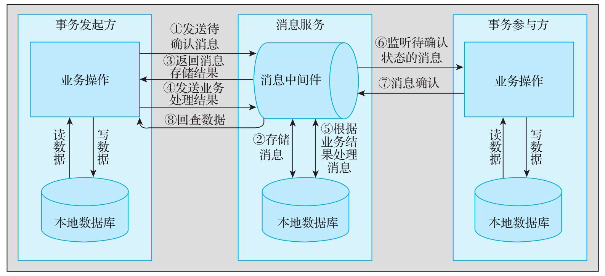{width="6.427891513560805in"
height="2.9255139982502185in"}

> 图10-5　消息发送一致性流程
>
> 主体流程如下所示。
>
> 第一步：事务发起方向消息中间件发送待确认消息。
>
> 第二步：消息中间件接收到事务发起方发送过来的消
> 息，将消息存储到本地数据库，此时并不会向事务参与方 投递消息。
>
> 425
>
> 第三步：消息中间件向事务发起方返回消息存储结
> 果，事务发起方根据返回的结果确定执行的业务逻辑。当
>
> 消息中间件向事务发起方返回的结果为"存储成功"时，
> 事务发起方会执行后续的业务逻辑。否则，事务发起方不
> 再执行后续的业务逻辑，必要时，还会向上层抛出异常信 息。
>
> 第四步：事务发起方完成业务处理后，把业务处理的 结果发送给消息中间件。
>
> 第五步；消息中间件收到事务发起方发送过来的结果
> 数据后，根据结果确定后续的处理逻辑。如果事务发起方
> 发送过来的结果为"成功"，消息中间件会更新本地数据
> 库中的消息状态为"待发送"。否则，将本地数据库中的
> 消息状态标记为"已删除"，或者直接删除数据库中相应 的消息记录。
>
> 第六步：事务参与方会监听消息中间件，并接收状态
> 为"待发送"的消息，当收到消息中间件的消息后，会执
> 行对应的业务逻辑，消息中间件中对应的记录变更为"已 发送"。
>
> 第七步：事务参与方的业务操作完成后，会向消息中
> 间件发送确认消息，表示事务参与方已经收到消息并且执
> 行完对应的业务逻辑，消息中间件会将消息从本地数据库 中删除。
>
> 第八步：为了保证事务发起方一定能够将消息发送出
> 去，在事务发起方的应用服务中需要暴露一个回调查询接
> 口。消息服务在后台开启一个线程，定时扫描消息服务中
>
> 426
>
> 状态为"待发送"的消息，回调事务发起方提供的回调查
> 询接口，根据消息服务中的业务参数回查事务发起方本地
> 事务的执行状态。如果消息服务查询到事务发起方的事务
> 状态为"执行成功"。同时，当前消息中间件中对应的消
> 息状态为"待发送"，则将对应的消息投递出去，并且将
> 对应的消息记录更新为"已发送"。如果消息服务查询到
> 事务发起方的执行状态为"执行失败"，则消息服务会删
> 除消息中间件中对应的消息，不再投递。
>
> 第九步：消息中间件也会根据状态向事务发起方投递
> 事务参与方的执行状态，事务发起方会根据状态执行对应
> 的操作，比如事务回滚等。
>
> 经过上述的流程，事务发起方就能够保证消息发送的 一致性了。
>
> 427
>
> 10.6　消息接收的一致性
>
> 消息发送的一致性主要由事务发起方保证，消息服
> 务进行辅助。消息接收的一致性需要由事务参与方保 证，消息服务进行辅助。
>
> 428
>
> 10.6.1　消息接收与确认机制
>
> 消息接收的一致性在一定程度上需要满足消息的接
> 收与确认机制，具体过程如下所示。
>
> 第一步：消息中间件向消息消费方投递消息。
>
> 第二步：消息消费方接收到消息中间件投递过来的
> 消息，执行本地业务逻辑，执行完成后，将执行结果发 送到消息中间件。
>
> 第三步：消息中间件接收到消费者发送过来的结果
> 状态，如果状态为"执行成功"，则删除对应的消息记
> 录，或者将其状态设置为"已删除"。
>
> 第四步：如果消息中间件向消息消费方投递消息失
> 败，会根据一定的规则进行重试。如果重试多次后，仍
> 然无法投递到消息消费方，则会将对应的消息存储到死
> 信队列中，后续进行人工干预。
>
> 第五步：如果消息消费方执行完业务逻辑后，无法
> 成功将结果返回给消息中间件，则同样需要引入重试机
> 制，在消息消费方单独开启一个线程，定时扫描本地数
> 据库中状态为执行完成但向消息中间件发送消息失败的
> 记录，并定时向消息中间件发送状态结果。
>
> 这里，有两点需要注意。
>
> 429
>
> 1）消息消费方接收消息中间件消息的接口需要满足 幂等性。
>
> 2）消息消费方向消息中间件发送结果状态时，如果
> 需要重试，则应限制最大的重试次数，否则，消息发送
> 操作可能会变成死循环。
>
> 常规消息中间件无法做到上述流程，在实现分布式 事务时，需要手动实现。
>
> 430
>
> 10.6.2　消息接收的不一致性
>
> 如果对消息的接收逻辑不做任何限制和处理，消息
> 的接收是不可靠的，会导致每次接收到消息后，对事务
> 的处理得出不同的结果，最终导致消息接收的不一致
>
> 性，具体表现在如下几个方面。
>
> 1）事务参与方接收消息的方法没有实现幂等，消息
> 中间件向事务参与方多次重试投递消息时，事务参与方
> 得出不同的业务处理结果，导致事务参与方与事务发起 方的事务结果不一致。
>
> 2）事务参与方可能无法收到消息中间件投递的消
> 息，但是消息中间件未实现消息重试投递机制，事务参
>
> 与方无法执行分支事务，导致事务参与方与事务发起方 的事务结果不一致。
>
> 3）事务参与方执行完本地业务逻辑后，无法正确地
> 将执行结果反馈给消息中间件，消息中间件无法正确删
> 除已处理过的消息，会再次向事务发起方重试投递消
> 息，可能会导致事务参与方与事务发起方的事务结果不 一致。
>
> 4）事务参与方无法保证完整收到消息中间件投递过
> 来的消息，导致事务参与方与事务发起方的事务结果不 一致。
>
> 431
>
> 事务参与方如果需要保证消息接收的一致性，需要
> 对消息的接收逻辑进行相应的限制和处理，并且消息中
> 间件需要支持重试消息投递的逻辑。
>
> 432
>
> 10.6.3　如何保证消息接收的一致性
>
> 如果需要实现消息接收的一致性，则需要解决如下几 个问题。
>
> 1）限制消息中间件重复投递消息的最大次数。
>
> 2）事务参与方接收消息的接口满足幂等性。
>
> 3）实现事务参与方与消息中间件之间的确认机制。
>
> 4）消息中间件中的消息多次重试投递失败后，放入
> 死信队列，后续引入人工干预机制。
>
> 具体处理流程如图10-6所示。
>
> 433

{width="6.427891513560805in"
height="4.614896106736658in"}

> 图10-6　保证消息接收一致性流程图
>
> 整体流程说明如下所示。
>
> 第一步：消息中间件向事务参与方投递消息时，如果
> 投递失败，则会按照一定的重试规则重新投递未确认的消
> 息，也就是会按照一定的规则，扫描发送失败并且状态为
> "待发送"的消息，将其投递给事务参与方。
>
> 第二步：如果重试次数达到最大重试次数，仍然无法
> 成功将消息投递出去，则将对应的消息存入死信队列，后
> 续通过人工干预投递。
>
> 434
>
> 第三步：如果消息正确投递出去，则会将数据库中存
> 储的对应的消息记录状态更新为"已发送"。
>
> 第四步：事务参与方接收到消息中间件投递的消息，
> 执行业务逻辑后，将执行的结果发送给消息中间件。
>
> 第五步：消息中间件接收到事务参与方发送的确认消
> 息后，根据确认消息更新数据库中对应消息的记录状态。
> 还会根据确认消息执行是否向事务发起方投递消息的逻
>
> 辑，事务发起方根据接收的消息执行相应的逻辑处理，比 如事务回滚等。
>
> 总之，上述流程需要满足消息中间件重试消息投递
> 时，有最大重试次数。事务接收方的接口需要满足幂等
> 性。事务接收方与消息中间件之间需要实现消息确认机
> 制。消息中间件向事务参与方多次投递消息失败后，达到
>
> 最大重试次数，需要将消息放入死信队列，并引入人工干 预机制。
>
> 经过上述流程，消息的接收就能够保证一致性了。
>
> 435
>
> 10.7　消息的可靠性
>
> 在实现可靠消息最终一致性分布式事务时，需要满
> 足消息的可靠性，这里的可靠性包括消息发送的可靠
> 性、消息存储的可靠性和消息消费的可靠性。
>
> 436
>
> 10.7.1　消息发送的可靠性
>
> 消息发送的可靠性除了要满足消息发送的一致性，
> 还需要保证事务发起方的可靠性，最简单的实现方式就
> 是多副本机制。也就说，将事务发起方部署多份，形成 集群模式。
>
> 另外，还需要保证消息生产和发送的可靠性。引入
> 回调确认机制，在事务发起方提供回调接口，在消息发
> 送异常时，消息服务也能通过一定的机制回调事务发起
> 方提供的回调接口，获取事务发起方的事务执行状态和
> 消息数据，确保消息一定被消息服务成功接收。消息服
> 务收到消息后，会返回一个确认信息，表示消息服务已
> 经成功收到事务发起方发送的消息。如果事务发起方在
> 一定时间内未收到消息服务返回的确认消息，就会触发
> 消息重试机制，按照一定的规则重新发送消息。
>
> 例如，事务发起方消息发送成功，但是由于网络异
> 常，未能收到消息服务返回的确认消息，此时，事务发
> 起方就会按照一定的规则重新发送消息，消息服务就有
> 可能收到多条相同的消息数据。因此消息服务也需要实 现幂等。
>
> 消息的重试机制需要实现响应时长判断逻辑（例
> 如，超出1分钟，未收到返回的确认信息，就认为本次消
>
> 息需要重新发送），也需要对重试的次数进行限制。
>
> 437
>
> 10.7.2　消息存储的可靠性
>
> 消息存储的可靠性就是确保消息能够进行持久化，
> 不会因为消息堆积、服务崩溃、服务器宕机、网络故障
> 等因素，造成消息丢失。
>
> 实现消息存储的可靠性最简单的方式就是消息存储
> 的多副本机制，将原本只存储一份的消息，冗余存储成
> 多份。目前，大多数消息中间件都实现了消息的冗余副
> 本机制，这里不再赘述。
>
> 438
>
> 10.7.3　消息消费的可靠性
>
> 消息消费的可靠性除了要满足消息接收的一致性
> 外，还要确保消息被成功消费，避免由于消息丢失，事
>
> 务参与方崩溃或者服务器宕机造成消息消费不成功。此
> 时，就需要将事务参与方冗余成多个副本，部署成集群 模式。
>
> 除了事务参与方的多副本机制，还要实现事务参与
> 方的重试机制与幂等机制，按照一定的规则获取消息中
> 间件中的数据，以确保事务发起方成功收到消息并成功 消费。
>
> 例如，使用RocketMQ消息中间件实现的分布式事务
> 中，事务参与方从RocketMQ消息中间件中拉取消息，如
> 果成功获取消息并执行完本地事务操作，则会向
>
> RocketMQ返回确认消息。如果事务参与方从RocketM Q拉
> 取消息失败，或者消费消息失败，就需要重新获取消息
> 进行消费，如果达到一定的重试次数仍然失败，则会将
> 该消息发送到RocketMQ的重试队列中。
>
> 如果事务参与者崩溃或者服务器宕机，RocketMQ会
> 认为该消息没有被事务参与方成功消费，会被其他的事
> 务参与方重新消费。此时，就有可能造成事务参与方重
> 复消费消息的情况，因此需要事务参与方实现消息的幂 等操作。
>
> 439
>
> 10.8　本章小结
>
> 本章主要介绍了可靠消息最终一致性的原理，首先
> 介绍了可靠消息最终一致性的基本原理。接下来分别介
> 绍了可靠消息最终一致性的三种实现原理，分别为本地
> 消息表，独立消息服务和RocketMQ事务消息。随后介绍
> 了消息发送的一致性和消息接收的一致性。最后简单介
> 绍了消息的可靠性。只有满足了本章所描述的全部内
>
> 容，才能实现一个完整的可靠消息最终一致性分布式事
> 务解决方案。第11章将对最大努力通知型分布式事务原 理进行简单的介绍。
>
> 440
>
> 第11章　最大努力通知型分布式事务原 理
>
> 最大努力通知型分布式事务解决方案适用于数据能
> 够最终达到一致的场景，并且对时间的敏感度比较低的
> 场景。例如，支付成功后通知商户付款成功，这种场景
> 往往是两个不同系统之间的分布式事务场景。本章对最
> 大努力通知型分布式事务的原理进行简单的介绍。
>
> 本章所涉及的内容如下。\
> ·适用场景。\
> ·方案特点。\
> ·基本原理。\
> ·异常处理。\
> ·注意事项。
>
> 441
>
> 11.1　适用场景
>
> 在前面的章节中，虽然简单提到过最大努力通知型
> 分布式事务解决方案的应用场景，但不够全面。这里就
> 最大努力通知型分布式事务解决方案适用的场景进行总
> 结。总体来说，最大努力通知型分布式事务解决方案适
> 用于满足如下特点的场景。
>
> 1）业务主动方完成业务逻辑操作后，向业务被动方 发送消息，允许消息丢失。
>
> 2）业务主动方需要提供消息回查接口，供业务被动
> 方回查调用，以恢复丢失的业务消息。
>
> 3）业务被动方未接收到业务主动方发送的消息，或
> 者接收到消息执行业务逻辑失败，业务被动方查询业务
> 主动方提供的消息回查接口，进行数据校对。
>
> 4）业务被动方接收到业务主动方发送过来的消息，
> 执行完业务处理（或者先将消息存储到本地，后续进行
> 业务处理），需要向业务主动方返回已成功接收消息的
> 状态，避免业务主动方触发消息重试机制。
>
> 5）业务主动方未及时收到业务被动方返回的确认消
> 息时，会根据一定的延时策略向业务被动方重新发送消 息数据。
>
> 6）业务被动方的业务处理结果不影响业务主动方的 业务处理结果。
>
> 442
>
> 满足如上业务场景的往往是两个不同系统之间需要 满足事务的最终一致性。
>
> 443
>
> 11.2　方案特点
>
> 特殊的使用场景决定了最大努力通知型方案具有如 下特点。
>
> 1）使用到的服务模式有可查询操作、幂等操作。
>
> 2）对最终一致性的时间敏感度低，短则几秒钟或几
> 分钟，长则数天才能达到事务的一致性。
>
> 3）业务被动方对业务的处理结果不会影响业务主动 方对业务的处理结果。
>
> 4）多用于跨企业的系统，或者企业内部比较独立的
> 系统之间实现事务的一致性，总之，就是不同系统之间 实现事务的一致性。
>
> 5）业务主动方完成业务处理操作后向业务被动方发
> 送通知消息，并允许消息丢失。
>
> 6）业务主动方可以根据一定的策略设置阶梯型通知
> 规则，在通知失败后，按照规则进行重复通知，直到通
> 知的次数达到设置的最大次数为止。
>
> 7）业务主动方需要提供查询接口给业务被动方按照
> 需求进行校对查询，以便恢复可能丢失的业务消息。
>
> 444
>
> 11.3　基本原理
>
> 最大努力通知型分布式事务原理比较简单，在业务主
> 动方主要分为业务处理服务、消息中间件、消息消费服务
> 和消息通知服务四大部分。这四大部分协调完成了最大努
> 力通知型分布式事务，具体如图11-1所示。
>
> 基本流程如下所示。
>
> 1）业务处理服务处理完业务逻辑，向消息中间件发 送消息数据。
>
> 2）消息中间件接收到消息数据后，将消息保存到消
> 息数据库中，并将消息记录的状态标记为待发送。
>
> 3）消息消费服务订阅消息中间件中的消息数据，当
> 接收到消息数据时，会向消息中间件发送确认消息。
>
> 4）消息中间件接收到消息消费者发送的确认消息，
> 会将消息数据库中对应的消息记录状态更新为"已发 送"。
>
> 445

{width="6.427890419947507in"
height="5.356575896762904in"}

> 图11-1　最大努力通知型分布式事务基本原理
>
> 5）消息消费者调用消息通知服务的接口，将消息数 据传递给消息通知服务。
>
> 6）消息通知服务向业务被动方发送通知消息，并将
> 通知记录保存到通知记录库中。
>
> 7）如果业务被动方没有收到通知消息，或者收到通
> 知消息后处理业务逻辑失败，或者需要再次获取通知消
> 息，则会按照需求主动查询业务主动方提供的回调接口，
> 以便恢复丢失的业务消息。
>
> 446
>
> 8）业务被动方接收消息通知的接口需要实现消息的 幂等操作。
>
> 447
>
> 11.4　异常处理
>
> 11.3节简单介绍了最大努力通知型分布式事务原
> 理，在原理实际落地的过程中，难免会出现异常的情
> 况。这些异常情况主要有消息中间件宕机、消息消费服
>
> 务宕机、消息通知服务宕机、业务被动方宕机等。
>
> 1.消息中间件宕机
>
> 业务处理服务向消息中间件发送消息失败，导致整
> 个通知流程不可用，无法将消息正确通知到业务被动 方。
>
> 这种异常情况并不会影响整个服务，如果消息中间
> 件宕机，消息无法发送出去，业务处理服务会多次尝试
> 将消息发送给消息中间件，直到重试次数达到最大重试
> 次数为止。如果在重试过程中，消息中间件恢复服务，
> 则继续向下执行。如果消息仍然发送失败，则业务被动
> 方会按照需求主动查询业务处理服务的接口，恢复丢失 的业务消息。
>
> 2.消息消费服务宕机
>
> 如果消息消费服务宕机，则无法消费消息中间件中
> 的消息数据，消息中间件根据一定的规则会尝试多次投
> 递消息。如果在尝试投递消息的过程中，消息消费服务
> 已经恢复，则继续执行后续流程。如果在重试投递消息
> 的次数达到了设置的最大重试次数时，消息恢复服务仍
>
> 448
>
> 然没有恢复，则业务被动方会按照需求主动查询业务处
> 理服务的接口，恢复丢失的业务消息。
>
> 3.消息通知服务宕机
>
> 如果消息通知服务宕机，则无法向业务被动方发送
> 通知消息。消息消费服务会根据一定的规则重新调用消
> 息通知服务的接口，直到重试次数达到了设置的最大重
> 试次数为止。如果在重试的过程中消息通知服务已经恢
> 复，则继续执行后续通知逻辑。如果此时消息通知服务
> 仍然未能恢复，则业务被动方会按照需求主动查询业务
> 处理服务的接口，恢复丢失的业务消息。
>
> 4.业务被动方宕机
>
> 如果业务被动方宕机，则消息通知服务向业务被动
> 方发送通知消息失败。消息通知服务会按照一定的规则
> 向业务被动方进行阶梯式消息通知，直到达到设置的最
> 大重试次数为止。如果在重试的过程中业务被动方的服
> 务已经恢复，则会成功发送消息通知。如果此时业务被
> 动方仍然处于宕机状态，则消息通知服务不再向业务被
> 动方发送消息通知。待业务被动方的服务恢复后，可以
> 根据具体的业务需求，主动查询业务处理服务提供的回
> 调接口，恢复丢失的业务消息。
>
> 综上所述，只要业务主动方提供了回调查询接口，
> 业务被动方保证接口的幂等性，消息数据是允许丢失 的。
>
> 449
>
> 在实现最大努力通知型分布式事务时，最关键的两
> 点是业务主动方提供回调查询接口，业务被动方接收消
> 息通知的接口保证幂等性。
>
> 450
>
> 11.5　本章小结
>
> 本章的内容比较简单，主要对最大努力通知型分布
> 式事务的原理进行了简单的介绍。首先总结了最大努力
> 通知型分布式事务的使用场景和方案特点。然后简单介
> 绍了最大努力型分布式事务的基本原理和异常情况的处
> 理方式。第12章进入实战内容，对XA分布式事务实战进 行简单的介绍。
>
> 451
>
> 第四部分　分布式事务源码与实战
>
> ·第12章　XA强一致性分布式事务解决方案源码解
>
> 析
>
> ·第13章　Hmily-TCC分布式事务解决方案源码解析
>
> ·第14章　XA强一致性分布式事务实战
>
> ·第15章　TCC分布式事务实战
>
> ·第16章　可靠消息最终一致性分布式事务实战
>
> ·第17章　最大努力通知型分布式事务实战
>
> 452
>
> 第12章　XA强一致性分布式事务解决方 案源码解析
>
> 本章是对XA强一致性分布式事务的实战与源码解
> 析。实战是基于XA规范处理数据一致性的最好体验，源
>
> 码解析则带领我们深入底层，学习和理解XA规范在底层
> 处理过程中所遇到的挑战与难题。本章涉及的内容如 下。
>
> ·分布式数据一致性场景的搭建。\
> ·Atomikos解决方案源码解析。\
> ·Narayana解决方案源码解析。
>
> 453
>
> 12.1　分布式数据一致性场景的搭建
>
> 搭建分布式数据一致性场景的模式多种多样，我们
> 可以选择多个微服务，也可以选择分布式数据库，还可
> 以选择分布式数据库的中间件。本章选取Apache
>
> ShardingSphere-Proxy（5.0.0-beta）作为分布式数据
> 一致性体验的场景。Apache ShardingSphere-
> Proxy（5.0.0-beta）提供了代理多个数据库的功能，整
> 合并提供了XA分布式事务的功能。
>
> 454
>
> 12.1.1　构建环境
>
> 构建环境的方式有两种，一种是直接下载可执行
> 包，另一种是下载源码并编译。以下采用直接下载可执
>
> 行包的方式。
>
> 第一步：访问地址
> [https://www.apache.org/dyn/closer.cgi/shardingsph](https://www.apache.org/dyn/closer.cgi/shardingsphere/5.0.0-beta/apache-shardingsphere-5.0.0-beta-shardingsphere-proxy-bin.tar.gz)
>
> [ere/5.0.0-beta/apache-shardingsphere-5.0.0-beta-](https://www.apache.org/dyn/closer.cgi/shardingsphere/5.0.0-beta/apache-shardingsphere-5.0.0-beta-shardingsphere-proxy-bin.tar.gz)
> [shardingsphere-proxy-bin.tar.gz下载包。](https://www.apache.org/dyn/closer.cgi/shardingsphere/5.0.0-beta/apache-shardingsphere-5.0.0-beta-shardingsphere-proxy-bin.tar.gz)
>
> 第二步：解压缩TAR包，包括3个目录。\
> ·/bin：存放的是可执行脚本，包含Windows、Linux
>
> 启动脚本。
>
> ·/conf：存放的是Proxy的配置（包含分库分表、登 录权限等）。
>
> ·/lib：Proxy所需要的依赖包。
>
> 第三步：将MySQL的驱动复制到/lib目录下。
>
> 455
>
> 12.1.2　准备环境
>
> 第一步：ShardingSphere-Proxy是用Java语言开发 的，我们首先安装JDK。
>
> 第二步：安装MySQL，在MySQL中执行以下脚本。
>
> \-\--创建两个测试数据库
>
> CREATE SCHEMA IF NOT EXISTS demo_ds_0; CREATE SCHEMA IF NOT EXISTS
> demo_ds_1;
>
> \-\-\--demo_ds_0 创建两张表t_order_0 与 t_order_1
>
> CREATE TABLE IF NOT EXISTS demo_ds_0.t_order_0 (order_id BIGINT NOT
> NULL AUTO_INCREMENT, user_id INT NOT NULL, status VARCHAR(50), PRIMARY
> KEY (order_id));
>
> CREATE TABLE IF NOT EXISTS demo_ds_0.t_order_1 (order_id BIGINT NOT
> NULL AUTO_INCREMENT, user_id INT NOT NULL, status VARCHAR(50), PRIMARY
> KEY (order_id));
>
> \-\-\--demo_ds_1 创建两张表t_order_0 与 t_order_1
>
> CREATE TABLE IF NOT EXISTS demo_ds_1.t_order_0 (order_id BIGINT NOT
> NULL AUTO_INCREMENT, user_id INT NOT NULL, status VARCHAR(50), PRIMARY
> KEY (order_id));
>
> CREATE TABLE IF NOT EXISTS demo_ds_1.t_order_1 (order_id BIGINT NOT
> NULL AUTO_INCREMENT, user_id INT NOT NULL, status VARCHAR(50), PRIMARY
> KEY (order_id));
>
> 456
>
> 12.1.3　修改配置
>
> 修改/conf下的配置，打开server.yaml，代码如
>
> 下。
>
> rules:
>
> \- !AUTHORITY
>
> users:
>
> \- root@%:root
>
> \- sharding@:sharding
>
> provider:
>
> type: NATIVE
>
> props:
>
> max-connections-size-per-query: 1
>
> executor-size: 16
>
> proxy-frontend-flush-threshold: 128
>
> proxy-transaction-type: XA
>
> xa-transaction-manager-type: Atomikos\
> proxy-opentracing-enabled: false
>
> proxy-hint-enabled: false
>
> sql-show: false
>
> check-table-metadata-enabled: false\
> lock-wait-timeout-milliseconds: 50000 \# The maximum time to
>
> wait for a lock\
> show-process-list-enabled: false
>
> 打开并修改config-sharding.yaml。
>
> schemaName: sharding_db
>
> dataSources:
>
> ds_0:
>
> url: jdbc:mysql://数据库地址:数据库端口/demo_ds_0?
> serverTimezone=UTC&useSSL=false
>
> username: root
>
> password:
>
> connectionTimeoutMilliseconds: 30000
>
> 457
>
> idleTimeoutMilliseconds: 60000\
> maxLifetimeMilliseconds: 1800000\
> maxPoolSize: 50
>
> minPoolSize: 1
>
> maintenanceIntervalMilliseconds: 30000\
> ds_1:
>
> url: jdbc:mysql://数据库地址:数据库端口/demo_ds_1?
> serverTimezone=UTC&useSSL=false
>
> username: root
>
> password:
>
> connectionTimeoutMilliseconds: 30000\
> idleTimeoutMilliseconds: 60000\
> maxLifetimeMilliseconds: 1800000\
> maxPoolSize: 50
>
> minPoolSize: 1
>
> maintenanceIntervalMilliseconds: 30000
>
> rules:
>
> \- !SHARDING
>
> tables:
>
> t_order:
>
> actualDataNodes: ds\_\${0..1}.t_order\_\${0..1}\
> tableStrategy:
>
> standard:
>
> shardingColumn: order_id
>
> shardingAlgorithmName: t_order_inline
>
> keyGenerateStrategy:
>
> column: order_id
>
> keyGeneratorName: snowflake
>
> t_order_item:
>
> actualDataNodes: ds\_\${0..1}.t_order_item\_\${0..1}\
> tableStrategy:
>
> standard:
>
> shardingColumn: order_id
>
> shardingAlgorithmName: t_order_item_inline
>
> keyGenerateStrategy:
>
> column: order_item_id
>
> keyGeneratorName: snowflake
>
> bindingTables:
>
> \- t_order,t_order_item
>
> defaultDatabaseStrategy:
>
> standard:
>
> shardingColumn: user_id
>
> shardingAlgorithmName: database_inline\
> defaultTableStrategy:
>
> none:
>
> shardingAlgorithms:\
> database_inline:
>
> type: INLINE
>
> 458
>
> props:
>
> algorithm-expression: ds\_\${user_id % 2}
>
> t_order_inline:
>
> type: INLINE
>
> props:
>
> algorithm-expression: t_order\_\${order_id % 2}
>
> t_order_item_inline:
>
> type: INLINE
>
> props:
>
> algorithm-expression: t_order_item\_\${order_id %
>
> 2}
>
> keyGenerators:
>
> snowflake:
>
> type: SNOWFLAKE
>
> props:
>
> worker-id: 123
>
> 459
>
> 12.1.4　启动
>
> 执行bin目录下的脚本，启动ShardingSphere- Proxy。
>
> ·Windows系统执行start.bat命令。\
> ·Linux/Mac系统执行start.sh命令。
>
> 460
>
> 12.1.5　验证
>
> 使用MySQL的客户端进行验证，操作如下。
>
> \>mysql -P3307 -uroot --proot
>
> Warning: Using a password on the command line interface can be
> insecure.
>
> Welcome to the MySQL monitor. Commands end with ; or \\g.
>
> Your MySQL connection id is 2
>
> Server version: 5.6.23-ShardingSphere-Proxy 5.0.0-beta
>
> Copyright (c) 2000, 2015, Oracle and/or its affiliates. All rights
> reserved.
>
> Oracle is a registered trademark of Oracle Corporation and/or its
>
> affiliates. Other names may be trademarks of their respective owners.
>
> 继续执行如下命令。
>
> mysql\> show databases;\
> +\-\-\-\-\-\-\-\-\-\-\-\--+
>
> \| SCHEMA_NAME \|\
> +\-\-\-\-\-\-\-\-\-\-\-\--+
>
> \| sharding_db \|\
> +\-\-\-\-\-\-\-\-\-\-\-\--+
>
> 1 row in set (0.23 sec)
>
> 以上我们搭建了ShardingSphere-Proxy，新建了两
> 个数据库demo_ds_0和demo_ds_1。每个数据库中都有
> t_order_0和t_order_1两张表。配置的分库规则是根据
> t_order表中的user_id列的值对2取模，分表规则是根据
> t_order表中的order_id列的值对2取模。
>
> 461
>
> 12.2　ShardingSphere对XA分布式事务方案 的整合
>
> ShardingSphere定义了一套服务提供接口（Service Provider
> Interface，SPI）来实现XA规范中
> TransactionManager的整合。整体架构如图12-1所示。

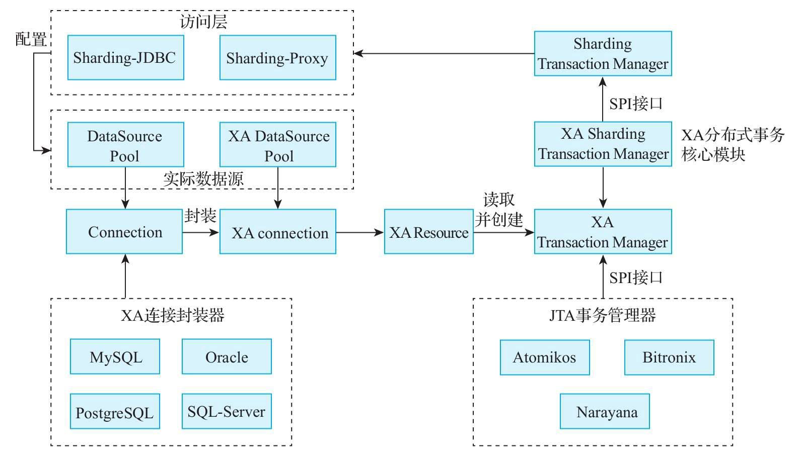{width="6.427891513560805in"
height="3.6671937882764656in"}

> 图12-1　ShardingSphere整合XA分布式事务架构图
>
> 462
>
> 12.2.1　ShardingTransactionManager接口
>
> 这个接口是ShardingSphere处理分布式事务的顶级
> 接口，目前的实现有XASharding-TransactionManager、
>
> SeataATShardingTransactionManager，接口代码如下。
>
> /\*\*
>
> \* ShardingTransactionManager
>
> \*/
>
> public interface ShardingTransactionManager extends
>
> AutoCloseable {
>
> /\*\*
>
> \* 分布式事务管理器的初始化接口\
> \*/
>
> void init(DatabaseType databaseType, Collection\<ResourceDataSource\>
> resource DataSources, String
>
> transactionMangerType);
>
> /\*\*
>
> \* 获取事务类型
>
> \* Get transaction type.\
> \*
>
> \* \@return transaction type\
> \*/
>
> TransactionType getTransactionType();
>
> /\*\*
>
> \* 判断是否在事务中
>
> \* Judge is in transaction or not.\
> \*
>
> \* \@return in transaction or not\
> \*/
>
> boolean isInTransaction();
>
> /\*\*
>
> \* 获取数据库连接
>
> \* Get transactional connection.\
> \*
>
> \* \@param dataSourceName data source name\
> \* \@return connection
>
> \* \@throws SQLException SQL exception
>
> 463
>
> \*/
>
> Connection getConnection(String dataSourceName) throws SQLException;
>
> /\*\*
>
> \* 开启事务
>
> \* Begin transaction.\
> \*/
>
> void begin();
>
> /\*\*
>
> \* 提交事务
>
> \* Commit transaction.\
> \*/
>
> void commit();
>
> /\*\*
>
> \* 回滚事务
>
> \* Rollback transaction.\
> \*/
>
> void rollback();\
> }
>
> 464
>
> 12.2.2　XATransactionManager接口
>
> 此接口是定义、整合各种XA分布式事务框架事务管 理器的接口，目前的实现有
> AtomikosTransactionManager、
> NarayanaXATransactionManager，接口定义如下。
>
> /\*\*
>
> \* XATransactionManager.
>
> \*/
>
> public interface XATransactionManager extends AutoCloseable,
>
> TypedSPI {
>
> /\*\*
>
> \* 初始化 XA 事务管理器\
> \*/
>
> void init();
>
> /\*\*
>
> \* 注册恢复资源
>
> \* \@param dataSourceName data source name\
> \* \@param xaDataSource XA data source
>
> \*/
>
> void registerRecoveryResource(String dataSourceName, XADataSource
> xaDataSource);
>
> /\*\*
>
> \* 删除恢复资源
>
> \* \@param dataSourceName data source name\
> \* \@param xaDataSource XA data source
>
> \*/
>
> void removeRecoveryResource(String dataSourceName, XADataSource
> xaDataSource);
>
> /\*\*
>
> \* 注册资源（同JTA里面的定义）
>
> \* \@param singleXAResource single XA resource\
> \*/
>
> void enlistResource(SingleXAResource singleXAResource);
>
> /\*\*
>
> 465
>
> \* 获取JTA规范事务管理器
>
> \* \@return transaction manager
>
> \*/
>
> TransactionManager getTransactionManager();
>
> }
>
> 466
>
> 12.2.3　DataSourceSwapper类
>
> 此类将原始的DataSource转换成XADatasource，核 心代码如下。
>
> public XADataSource swap(final DataSource dataSource) {\
> //创建XADataSource
>
> XADataSource result = createXADataSource();\
> //设置属性
>
> setProperties(result, getDatabaseAccessConfiguration(dataSource));
>
> return result;\
> }
>
> private XADataSource createXADataSource() {
>
> XADataSource result = null;
>
> List\<ShardingSphereException\> exceptions = new LinkedList\<\>
>
> ();
>
> for (String each :
>
> xaDataSourceDefinition.getXADriverClassName()) {
>
> try {
>
> //通过驱动名称，以SPI的方式加载
>
> result = loadXADataSource(each);
>
> } catch (final ShardingSphereException ex) {
>
> exceptions.add(ex);
>
> }
>
> }
>
> if (null == result && !exceptions.isEmpty()) {
>
> if (exceptions.size() \> 1) {
>
> throw new ShardingSphereException(\"Failed to create
>
> \[%s\] XA DataSource\", xaDataSourceDefinition);
>
> } else {
>
> throw exceptions.iterator().next();
>
> }
>
> }
>
> return result;
>
> }
>
> 467
>
> 12.2.4　XAConnectionWrapper接口
>
> 该接口的作用是适配关系型数据库连接，并将原始
> 的数据库连接转换成XAConnection连接，目前的实现有
> MySQLXAConnectionWrapper、H2XAConnection-
>
> Wrapper、MariaDB-XAConnectionWrapper、 OracleXAConnectionWrapper、
> PostgreSQLXAConnectionWrapper，接口定义如下。
>
> /\*\*
>
> \* XAConnectionWrapper
>
> \*/
>
> public interface XAConnectionWrapper {
>
> /\*\*
>
> \* 将XA数据源与原始连接，包装成XA数据源连接\
> \* \@param xaDataSource XA data source\
> \* \@param connection connection
>
> \* \@return sharding XA connection\
> \*/
>
> XAConnection wrap(XADataSource xaDataSource, Connection connection);
>
> }
>
> 468
>
> 12.2.5　XA事务初始化
>
> 启动ShardingSphere-Proxy并且指定分布式事务类
> 型为XA，在启动过程中会进入XA-
> ShardingTransactionManager.init()方法，代码如下。
>
> public void init(final DatabaseType databaseType,
> finalCollection\<ResourceDataSource\> resourceDataSources, final
> String transactionMangerType) {
>
> xaTransactionManager =
> XATransactionManagerLoader.getInstance().getXATransactionManager
>
> (transactionMangerType);\
> xaTransactionManager.init();
>
> resourceDataSources.forEach(each -\>
> cachedDataSources.put(each.getOriginalName(),
>
> newXATransactionDataSource(databaseType, each)));\
> }
>
> private XATransactionDataSource newXATransactionDataSource(final
> DatabaseType databaseType, final ResourceDataSource
> resourceDataSource) {
>
> String resourceName = resourceDataSource.getUniqueResourceName();
>
> DataSource dataSource = resourceDataSource.getDataSource();\
> return new XATransactionDataSource(databaseType,
>
> resourceName, dataSource, xaTransactionManager);\
> }
>
> 如上述代码所示，首先根据XA事务管理器类型，获
> 取不同的XATransactionManager，并进行初始化。然后
> 将原始的DataSource转换成XADataSource保存起来。下 面重点分析new
>
> XATransactionDataSource(databaseType,resourceName
> ,dataSource,xaTransaction-Manager)方法，代码如 下。
>
> 469
>
> public XATransactionDataSource(final DatabaseType databaseType, final
> String resourceName, final DataSource dataSource, final
> XATransactionManager xaTransactionManager) {
>
> this.databaseType = databaseType;\
> this.resourceName = resourceName;\
> this.dataSource = dataSource;
>
> if
>
> (!CONTAINER_DATASOURCE_NAMES.contains(dataSource.getClass().getS
> impleName())) {
>
> xaDataSource = XADataSourceFactory.build(databaseType, dataSource);
>
> this.xaTransactionManager = xaTransactionManager;
>
> xaTransactionManager.registerRecoveryResource(resourceName,
> xaDataSource);
>
> }\
> }
>
> 在上述代码中， XADataSourceFactory.build(databaseType,dataSource
>
> )表示根据数据库类型，将DataSource转换成 XADatasource。
> xaTransactionManager.registerRecoveryResource(res
> ourceName,xaDataSource)表示注册恢复资源，用于XA事 务的恢复。
>
> 470
>
> 12.2.6　XA资源注册
>
> 先来看一下JTA规范中关于事务资源注册的接口。
>
> public boolean enlistResource(XAResource xaRes)\
> throws RollbackException, IllegalStateException,
>
> SystemException;
>
> 1）事务资源注册的接口需要使用一个XAResource资
> 源对象完成XA分布式事务的所有流程。
>
> 2）执行一条SQL语句，需要先获取连接，
> ShardingSphere正是在获取连接的同时将连接转换成
>
> XAResource，具体注册流程如图12-2所示。
>
> 471

{width="6.427890419947507in"
height="4.110142169728784in"}

> 图12-2　ShardingSphere整合XA方案的事务资源注册流程
>
> 根据图12-2所示的流程，我们进入
> org.apache.shardingsphere.transaction.xa.jta.datas
>
> ourceXATransactionDataSource.getConnection()方法， 代码如下。
>
> public Connection getConnection() throws SQLException,
> SystemException, RollbackException {
>
> //先检查是否已经存在连接，这一步是XA的关键，因为XA事务必须在同一个连接中
>
> if
>
> (CONTAINER_DATASOURCE_NAMES.contains(dataSource.getClass().getSim
> pleName())) {
>
> return dataSource.getConnection();
>
> }
>
> //获取数据库连接
>
> Connection result = dataSource.getConnection();\
> //转换成XAConnection，其实是同一个连接
>
> XAConnection xaConnection =
>
> XAConnectionFactory.createXAConnection(databaseType, xaDataSource,
> result);
>
> 472
>
> //获取JTA事务定义接口\
> Transaction transaction =
>
> xaTransactionManager.getTransactionManager().getTransaction();
>
> if (!enlistedTransactions.get().contains(transaction)) {\
> //进行资源注册
>
> transaction.enlistResource(new\
> SingleXAResource(resourceName, xaConnection.getXAResource()));
>
> transaction.registerSynchronization(new Synchronization()\
> {
>
> \@Override
>
> public void beforeCompletion() {
>
> enlistedTransactions.get().remove(transaction);
>
> }
>
> \@Override
>
> public void afterCompletion(final int status) {
>
> enlistedTransactions.get().clear();
>
> }
>
> });
>
> enlistedTransactions.get().add(transaction);\
> }
>
> return result;
>
> }
>
> 上面代码的逻辑关键点是，对于ShardingSphere来
> 说，因为在一个事务里面会有多个SQL语句，所以路由到
>
> 相同库的SQL语句，如果想要获取同一个XAConnection，
> 只能注册一次，这样才能进行XA事务的提交与回滚。
>
> 473
>
> 12.3　ShardingSphere对Atomikos方案的实 战与源码解析
>
> 本节将实战与源码解析相结合，向大家详细讲解
> Atomikos-XA方案中框架的初始化、事务提交、事务回滚
>
> 等流程。以下内容基于之前搭建的环境。
>
> 474
>
> 12.3.1　Atomikos-XA分布式事务初始化流程
>
> 首先，简单介绍下Atomikos中XA分布式事务的初始化 流程，如图12-3所示。

{width="6.427890419947507in"
height="2.8328040244969377in"}

> 图12-3　Atomikos中XA分布式事务的初始化流程
>
> 启动并初始化ShardingSphere-Proxy，进入
> XaTransactionManager.init()方法，这是一个SPI的实
>
> 现。因为我们配置的类型是Atomikos，最后会进入
> AtomikosTransaction-Manager.init()方法，这个类的源 码如下。
>
> public final class AtomikosTransactionManager implements
> XATransactionManager {
>
> private UserTransactionManager transactionManager;
>
> private UserTransactionService userTransactionService;
>
> \@Override
>
> 475
>
> public void init() {
>
> transactionManager = new UserTransactionManager();
>
> userTransactionService = new UserTransactionServiceImp();\
> userTransactionService.init();
>
> }
>
> \@Override
>
> public void registerRecoveryResource(final String dataSourceName,
> final XADataSource xaDataSource) {
>
> userTransactionService.registerResource(new
> AtomikosXARecoverableResource (dataSourceName, xaDataSource));
>
> }
>
> \@Override
>
> public void removeRecoveryResource(final String\
> dataSourceName, final XADataSource xaDataSource) {
>
> userTransactionService.removeResource(new
> AtomikosXARecoverableResource
>
> (dataSourceName, xaDataSource));
>
> }
>
> \@SneakyThrows({SystemException.class,\
> RollbackException.class})
>
> \@Override
>
> public void enlistResource(final SingleXAResource xaResource)\
> {
>
> transactionManager.getTransaction().enlistResource(xaResource);
>
> }
>
> \@Override
>
> public TransactionManager getTransactionManager() {
>
> return transactionManager;\
> }
>
> \@Override
>
> public void close() {\
> userTransactionService.shutdown(true);
>
> }
>
> \@Override
>
> public String getType() {
>
> return XATransactionManagerType.ATOMIKOS.getType();
>
> }\
> }
>
> 这里重点关注userTransactionService.init()方
> 法，在该方法中进入initialize()方法，代码如下所示。
>
> 476
>
> private void initialize() {
>
> //

添加恢复资源，我们暂时不用关心

> for (RecoverableResource resource : resources\_) {
>
> Configuration.addResource ( resource );
>
> }
>
> for (LogAdministrator logAdministrator : logAdministrators\_)
>
> {
>
> Configuration.addLogAdministrator ( logAdministrator );
>
> }
>
> //

注册插件，我们暂时不用关心

> for (TransactionServicePlugin nxt : tsListeners\_) {
>
> Configuration.registerTransactionServicePlugin ( nxt
>
> );
>
> }
>
> //获取配置属性，重点关心 ConfigProperties configProps =
>
> Configuration.getConfigProperties();\
> configProps.applyUserSpecificProperties(properties\_);
>
> //进行初始化
>
> Configuration.init();\
> }
>
> 我们需要关注initialize()方法是如何获取配置属性 的，最后进入
> com.atomikos.icatch.provider.imp.AssemblerImp.init
> ializeProperties()方法，代码如下所示。
>
> public ConfigProperties initializeProperties() {
>
> Properties defaults = new Properties();\
> //读取classpath下的transactions-defaults.properties文件\
> loadPropertiesFromClasspath(defaults,
>
> DEFAULT_PROPERTIES_FILE_NAME);
>
> Properties transactionsProperties = new Properties(defaults);
>
> //读取classpath下的transactions.properties文件配置，覆盖
> transactions-defaults.
>
> //properties文件中相同key的值\
> loadPropertiesFromClasspath(transactionsProperties,
>
> TRANSACTIONS_PROPERTIES_FILE_NAME);
>
> Properties jtaProperties = new Properties(transactionsProperties);
>
> //读取classpath下的jta.properties文件配置，覆盖transactions-
> defaults.properties、
>
> //transactions.properties文件中相同key的值\
> loadPropertiesFromClasspath(jtaProperties,
>
> 477
>
> JTA_PROPERTIES_FILE_NAME);
>
> Properties customProperties = new Properties(jtaProperties);
>
> //读取通过java -Dcom.atomikos.icatch.file方式指定的自定义配置文件
> 路径，覆盖之前相同key的值
>
> loadPropertiesFromCustomFilePath(customProperties);\
> Properties finalProperties = new
>
> Properties(customProperties);\
> ConfigProperties configProperties = new
>
> ConfigProperties(finalProperties);\
> checkRegistration(configProperties);
>
> return configProperties;\
> }
>
> 获取配置后，我们需要重点关注Configuration类的 初始化方法，代码如下。
>
> public static synchronized boolean init() {
>
> boolean startupInitiated = false;\
> if (service\_ == null) {
>
> startupInitiated = true;\
> //以SPI方式加载插件注册，我们暂时不用关心\
> addAllTransactionServicePluginServicesFromClasspath();\
> ConfigProperties configProperties = getConfigProperties();\
> //调用插件的BeforeInit()方法进行初始化\
> notifyBeforeInit(configProperties);\
> //进行事务日志恢复的初始化，很重要，接下来重点详解\
> assembleSystemComponents(configProperties);
>
> /

/进入系统注解的初始化

> initializeSystemComponents(configProperties);
>
> notifyAfterInit();
>
> if (configProperties.getForceShutdownOnVmExit()) {
>
> addShutdownHook(new ForceShutdownHook());
>
> }
>
> }
>
> return startupInitiated;\
> }
>
> 接下来，重点来看事务日志恢复的初始化，进入
> assembleSystemComponents(configPro-perties)方法后
>
> 会进入
>
> 478
>
> com.atomikos.icatch.provider.imp.AssemblerImp.asse
> mbleTransaction-Service()方法，代码如下。
>
> public TransactionServiceProvider assembleTransactionService(
>
> ConfigProperties configProperties) {
>
> RecoveryLog recoveryLog =null;
>
> //打印配置信息\
> logProperties(configProperties.getCompletedProperties());\
> //获取配置的事务管理器唯一名称
>
> String tmUniqueName = configProperties.getTmUniqueName();\
> long maxTimeout = configProperties.getMaxTimeout();
>
> int maxActives = configProperties.getMaxActives();
>
> boolean threaded2pc = configProperties.getThreaded2pc();\
> //以SPI方式加载OltpLog
>
> OltpLog oltpLog = createOltpLogFromClasspath();
>
> if (oltpLog == null) {
>
> LOGGER.logInfo(\"Using default (local) logging and recovery\...\");
>
> Repository repository =
>
> createRepository(configProperties);
>
> oltpLog = createOltpLog(repository);
>
> recoveryLog = createRecoveryLog(repository);
>
> }
>
> StateRecoveryManagerImp recoveryManager = new
>
> StateRecoveryManagerImp();\
> recoveryManager.setOltpLog(oltpLog);
>
> //生成id生成器，用于生成XID
>
> UniqueIdMgr idMgr = new UniqueIdMgr ( tmUniqueName );\
> int overflow = idMgr.getMaxIdLengthInBytes() -
>
> MAX_TID_LENGTH;
>
> if ( overflow \> 0 ) {
>
> // see case 73086
>
> String msg = \"Value too long : \" + tmUniqueName;\
> LOGGER.logFatal ( msg );
>
> throw new SysException(msg);
>
> }
>
> return new TransactionServiceImp(tmUniqueName,
>
> recoveryManager, idMgr, maxTimeout, maxActives, !threaded2pc,
> recoveryLog);
>
> }
>
> 首先重点分析下createOltpLogFromClasspath()方
> 法，该方法采用SPI的方式加载OltpLog，如果没有扩展，
>
> 479
>
> 会默认返回null。Atomikos会创建框架自定义的资源来存
> 储事务日志，代码如下所示。
>
> private OltpLog createOltpLogFromClasspath() {
>
> OltpLog ret = null;\
> //以SPI的方式加载，如果是用户自定义扩展日志存储，那么应该实现该接口\
> ServiceLoader\<OltpLogFactory\> loader =
>
> ServiceLoader.load(OltpLogFactory.class,Configuration.class.getCl
> assLoader());
>
> int i = 0;
>
> for (OltpLogFactory l : loader ) {\
> ret = l.createOltpLog();
>
> i++;
>
> }
>
> if (i \> 1) {
>
> String msg = \"More than one OltpLogFactory found in classpath
>
> \- error in configuration!\";
>
> LOGGER.logFatal(msg);
>
> throw new SysException(msg);\
> return ret;
>
> }
>
> 接下来，我们分析Repository
> repository=createRepository(configProperties)代
>
> 码，如下所示。
>
> private CachedRepository createCoordinatorLogEntryRepository(\
> ConfigProperties configProperties) throws LogException {
>
> InMemoryRepository inMemoryCoordinatorLogEntryRepository =\
> new InMemory Repository();
>
> //创建内存存储并初始化\
> inMemoryCoordinatorLogEntryRepository.init();\
> //创建文件方法存储，作为内存存储的备份，文件存储会创建xa.tx.lck的文件名
>
> 称
>
> FileSystemRepository backupCoordinatorLogEntryRepository =
>
> new FileSystem Repository();\
> backupCoordinatorLogEntryRepository.init();
>
> CachedRepository repository =
>
> new CachedRepository(inMemoryCoordinatorLogEntryRepository,
>
> backupCoordinatorLogEntryRepository);\
> repository.init();
>
> return repository;
>
> }
>
> 480
>
> 接下来分析 com.atomikos.icatch.config.Configuration.init()方
>
> 法中的notifyAfterInit()方法，代码如下所示。
>
> private static void notifyAfterInit() {
>
> //

插件的初始化

> for (TransactionServicePlugin p : tsListenersList\_) {
>
> p.afterInit();
>
> }
>
> for (LogAdministrator a : logAdministrators\_) {
>
> a.registerLogControl(service\_.getLogControl());
>
> }
>
> //设置事务恢复服务，进行事务的恢复
>
> for (RecoverableResource r : resourceList\_ ) {
>
> r.setRecoveryService(recoveryService\_);
>
> }
>
> }
>
> 插件初始化后，进入
>
> com.atomikos.icatch.jta.JtaTransactionServicePlugi
> n.afterInit()方法，代码如下所示。
>
> public void afterInit() {\
> TransactionManagerImp.installTransactionManager(Configuration.get
> CompositeTransactionManager(), autoRegisterResources);
>
> RecoveryLog reco
>
> Configuration.getRecoveryLog(
>
> com.atomikos.recovery.OltpLog

)，如果用户采用SPI的方式扩展了

，这里就会返回 ，且不会对

> XaResourceRecoveryManager

进行初始化

> RecoveryLog recoveryLog = Configuration.getRecoveryLog();\
> long maxTimeout =
>
> Configuration.getConfigProperties().getMaxTimeout();
>
> if (recoveryLog != null) {
>
> XaResourceRecoveryManager.installXaResourceRecoveryManager(new
> DefaultXaRecoveryLog(recoveryLog,
> maxTimeout),Configuration.getConfigProperties().getTmUniqueName() );
>
> 481
>
> }\
> }
>
> 下面分析事务恢复服务，从 setRecoveryService(RecoveryService
>
> recoveryService)方法开始，之后会进入recover()方 法，代码如下。
>
> public void recover() {
>
> XaResourceRecoveryManager xaResourceRecoveryManager =
>
> XaResourceRecoveryManager.getInstance();
>
> if (xaResourceRecoveryManager != null) { //null for LogCloud
>
> recovery
>
> try {
>
> xaResourceRecoveryManager.recover(getXAResource());\
> } catch (Exception e) {
>
> refreshXAResource(); //cf case 156968\
> }
>
> }\
> }
>
> 这里重点关注添加了英文注释的代码，如果用户采用
> SPI的方式扩展了com.atomikos.recovery.OltpLog，那么
> XaResourceRecoveryManager为null，表示进行云端恢
>
> 复，反之进行事务恢复。事务恢复很复杂，后续会单独介 绍。
>
> 482
>
> public void begin ( int timeout ) throws NotSupportedException,nt =
> new ResumePreviousTransactionSubTxAwareParticipant ( ct );
>
> }
>
> try {
>
> ct =
>
> compositeTransactionManager.createCompositeTransaction ( ( ( long )
> timeout ) \* 1000 );
>
> if ( resumeParticipant != null )\
> ct.addSubTxAwareParticipant ( resumeParticipant );
>
> if ( ct.isRoot () && getDefaultSerial () )
>
> ct.setSerial ();
>
> ct.setProperty ( JTA_PROPERTY_NAME , \"true\" );\
> } catch ( SysException se ) {
>
> String msg = \"Error in begin()\";\
> LOGGER.logError( msg , se );
>
> throw new ExtendedSystemException ( msg , se );
>
> }\
> recreateCompositeTransactionAsJtaTransaction(ct);
>
> }
>
> 12.3.2　Atomikos-XA分布式事务Begin流程
>
> 下面结合ShardingSphere-Proxy实战讲解Begin流
> 程。在连接ShardingSphere-Proxy的MySQL客户端执行以
>
> 下命令。
>
> mysql\> begin;
>
> ShardingSphere-Proxy收到命令后，最后会进入
> XAShardingTransactionManager的begin()方法，然后执
>
> 行XA分布式事务框架的Begin流程。Atomikos-XA分布式事
> 务的Begin流程如图12-4所示。
>
> 483

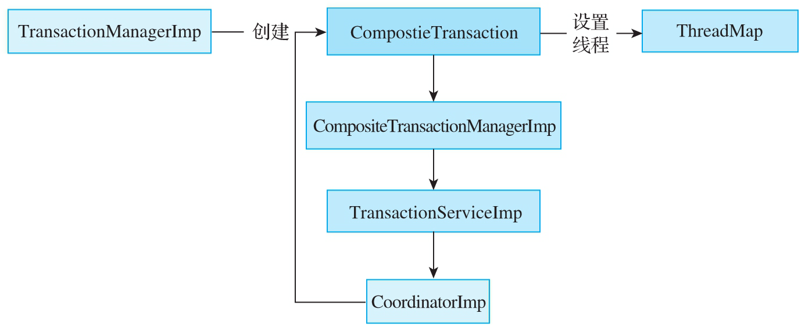{width="6.427891513560805in"
height="2.647384076990376in"}

> 图12-4　Atomikos-XA分布式事务的Begin流程
>
> 连接到ShardingSphere-Proxy的MySQL客户端后，执 行begin命令，调用
> org.apache.shardingsphere.transaction.xa.ShardingT
> ransactionManager.begin()方法，最后会调用
> com.atomikos.icatch.jta.TransactionManagerImp.begi
> n()方法，代码如下所示。
>
> public void begin ( int timeout ) throws NotSupportedException,
>
> SystemException
>
> {
>
> CompositeTransaction ct = null;
>
> ResumePreviousTransactionSubTxAwareParticipant resumeParticipant =
> null;
>
> ct = compositeTransactionManager.getCompositeTransaction();\
> if ( ct != null && ct.getProperty ( JTA_PROPERTY_NAME ) ==
>
> null ) {
>
> LOGGER.logWarning ( \"JTA: temporarily suspending
>
> incompatible transaction: \" + ct.getTid() +
>
> \" (will be resumed after JTA transaction ends)\"
>
> );
>
> ct = compositeTransactionManager.suspend();
>
> resumeParticipant = new
>
> ResumePreviousTransactionSubTxAwareParticipant ( ct );
>
> }
>
> 484
>
> try {
>
> ct =
>
> compositeTransactionManager.createCompositeTransaction ( ( ( long )
> timeout ) \* 1000 );
>
> if ( resumeParticipant != null )\
> ct.addSubTxAwareParticipant ( resumeParticipant );
>
> if ( ct.isRoot () && getDefaultSerial () )
>
> ct.setSerial ();
>
> ct.setProperty ( JTA_PROPERTY_NAME , \"true\" );\
> } catch ( SysException se ) {
>
> String msg = \"Error in begin()\";\
> LOGGER.logError( msg , se );
>
> throw new ExtendedSystemException ( msg , se );
>
> }\
> recreateCompositeTransactionAsJtaTransaction(ct);
>
> }
>
> 这里只需要关注 compositeTransactionManager.createCompositeTransac
>
> tion()方法，具体操作是创建事务补偿点，代码如下所 示。
>
> public CompositeTransaction createCompositeTransaction ( long timeout
> ) throws SysException
>
> {
>
> CompositeTransaction ct = null , ret = null;
>
> ct = getCurrentTx ();
>
> if ( ct == null ) {
>
> ret = getTransactionService().createCompositeTransaction\
> ( timeout );
>
> if(LOGGER.isDebugEnabled()){\
> LOGGER.logDebug(\"createCompositeTransaction ( \" +
>
> timeout + \" ): \"
>
> \+ \"created new ROOT transaction with id \" +
>
> ret.getTid ());
>
> }
>
> } else {
>
> if(LOGGER.isDebugEnabled())
> LOGGER.logDebug(\"createCompositeTransaction
>
> ( \" + timeout + \" )\");
>
> ret = ct.createSubTransaction ();
>
> }
>
> Thread thread = Thread.currentThread ();\
> setThreadMappings ( ret, thread );
>
> 485
>
> return ret;
>
> }
>
> 创建事务补偿点后，把它放到以当前线程作为key的
>
> Map中。
>
> 486
>
> 12.3.3　Atomikos-XA分布式事务资源注册 原理
>
> 本节重点关注AtomikosTransactionManager接口返
> 回的TransactionManager接口，进入
> com.atomikos.icatch.jta.TransactionImp.enlistReso
> urce()方法，截取部分代码如下。
>
> try {
>
> restx = (XAResourceTransaction) res
>
> .getResourceTransaction(this.compositeTransaction);\
> restx.setXAResource(xares);
>
> restx.resume();
>
> } catch (ResourceException re) {\
> throw new ExtendedSystemException(
>
> \"Unexpected error during enlist\", re);\
> } catch (RuntimeException e) {
>
> throw e;\
> }
>
> addXAResourceTransaction(restx, xares);\
> }
>
> return true;
>
> 这里重点关注restx.resume()方法。定位到
> this.xaresource.start(this.xid,flag)方法，发现该
>
> 方法已经在MySQL的驱动包里，代码如下所示。
>
> public synchronized void resume() throws ResourceException {
>
> try {
>
> this.xaresource.start(this.xid, flag);
>
> } catch (XAException xaerr) {
>
> 487
>
> String msg = interpretErrorCode(this.resourcename, \"resume\",
>
> this.xid, xaerr.errorCode);
>
> LOGGER.logWarning(msg, xaerr);
>
> throw new ResourceException(msg, xaerr);
>
> }
>
> setState(TxState.ACTIVE);\
> this.knownInResource = true;
>
> }
>
> 组装XA START语句，并在数据库中执行。
>
> public void start(Xid xid, int flags) throws XAException {
>
> StringBuilder commandBuf = new StringBuilder(MAX_COMMAND_LENGTH);
>
> commandBuf.append(\"XA START \");\
> appendXid(commandBuf, xid);\
> switch (flags) {
>
> case TMJOIN:
>
> commandBuf.append(\" JOIN\");
>
> break;
>
> case TMRESUME:
>
> commandBuf.append(\" RESUME\");
>
> break;
>
> case TMNOFLAGS:
>
> break;
>
> default:
>
> throw new XAException(XAException.XAER_INVAL);\
> }
>
> dispatchCommand(commandBuf.toString());\
> this.underlyingConnection.setInGlobalTx(true);
>
> }
>
> 到这里，整个资源注册的流程已经完成。我们来总
> 结一下，在一个XA事务里面，对于在同一个数据库执行
> 多条SQL语句获取连接的时候，只会在资源注册里面执行
>
> 一次XA START语句。
>
> 488
>
> 12.3.4　Atomikos-XA分布式事务Commit流程
>
> 在MySQL中连接ShardingSphere-Proxy客户端，执行 以下命令。
>
> \>begin;
>
> \> insert into t_order(user_id, order_id, status) values(1, 1,
> \'xa\');
>
> \> insert into t_order(user_id, order_id, status) values(2, 2,
> \'xa\');
>
> \>commit;
>
> 上面的命令开启XA事务，并且执行了两条SQL语句。
> 根据分库分表规则，第一条SQL语句会路由到demo_ds_1库
>
> 中的t_order_1表，第二条SQL语句会路由到demo_ds_0中
> 的t_order_0表，执行了一次跨库分布式事务。具体流程 如图12-5所示。
>
> 489

{width="6.427890419947507in"
height="5.119650043744532in"}

> 图12-5　Atomikos-XA分布式事务Commit流程
>
> 第一步：首先进入 XAShardingTransactionManager.commit()方法，之后会
>
> 进入
> [com.atomikos.icatch.imp.CompositeTransactionImp.co](http://com.atomikos.icatch.imp.CompositeTransactionImp.co)
> mmit()方法，代码如下。
>
> /\*\*
>
> \* \@see com.atomikos.icatch.CompositeTransaction#commit()
>
> \*/
>
> public void commit () throws HeurRollbackException,
>
> HeurMixedException,
>
> HeurHazardException, SysException, SecurityException,
>
> RollbackException
>
> 490
>
> {
>
> //这里只是更新事务状态与事务日志状态
>
> doCommit ();\
> setSiblingInfoForIncoming1pcRequestFromRemoteClient();\
> if ( isRoot () ) {
>
> try {
>
> //真正的提交操作
>
> coordinator.terminate ( true );
>
> }
>
> catch ( RollbackException rb ) {
>
> throw rb;
>
> } catch ( HeurHazardException hh ) {
>
> throw hh;
>
> } catch ( HeurRollbackException hr ) {
>
> throw hr;
>
> } catch ( HeurMixedException hm ) {
>
> throw hm;
>
> } catch ( SysException se ) {
>
> throw se;
>
> } catch ( Exception e ) {\
> throw new SysException (
>
> \"Unexpected error: \" + e.getMessage (), e );
>
> }
>
> }\
> }
>
> 第二步：接下来，重点分析terminate(boolean commit)方法，如下所示。
>
> protected void terminate ( boolean commit ) throws
> HeurRollbackException,
>
> HeurMixedException, SysException, java.lang.SecurityException,
>
> HeurCommitException, HeurHazardException, RollbackException,
>
> IllegalStateException
>
> {
>
> synchronized ( fsm\_ ) {
>
> if ( commit ) {
>
> if ( participants\_.size () \<= 1 ) {\
> //判断有几个参与者，如果只有一个，直接一阶段提交
>
> commit ( true );
>
> } else {
>
> //否则，执行XA二阶段提交流程，先准备，再提交
>
> 491
>
> int prepareResult = prepare ();
>
> if ( prepareResult != Participant.READ_ONLY )
>
> commit ( false );
>
> }
>
> } else {
>
> rollback ();
>
> }
>
> }\
> }
>
> 第三步：重点分析二阶段的prepare()方法，核心代 码如下。
>
> Enumeration\<Participant\> enumm = participants.elements ();
> //获取所有的参与者资源，循环
>
> while ( enumm.hasMoreElements () ) {
>
> Participant p = (Participant) enumm.nextElement ();
>
> //

封装成PrepareMessage对象

> PrepareMessage pm = new PrepareMessage ( p, result );
>
> if ( getCascadeList () != null && p.getURI () != null ) {
>
> //null for OTS
>
> Integer sibnum = (Integer) getCascadeList ().get (
>
> p.getURI () );
>
> if ( sibnum != null ) { // null for local participant!
>
> p.setGlobalSiblingCount ( sibnum.intValue () );\
> }
>
> p.setCascadeList ( getCascadeList () );
>
> }
>
> //异步提交执行
>
> getPropagator ().submitPropagationMessage ( pm );
>
> } // while
>
> 第四步：通过线程的run()方法进入
> PrepareMessage.send()方法，代码如下所示。
>
> protected Boolean send () throws PropagationException {
>
> Participant part = getParticipant ();\
> int ret = 0;
>
> Boolean result = null;
>
> try {
>
> ret = part.prepare ();
>
> 492
>
> if ( ret == Participant.READ_ONLY )
>
> result = null;
>
> else
>
> result = new Boolean ( true );
>
> } catch ( HeurHazardException heurh ) {
>
> throw new PropagationException ( heurh, false );
>
> } catch ( RollbackException jtr ) {
>
> result = new Boolean ( false );
>
> } catch ( Exception e ) {
>
> HeurHazardException heurh = new HeurHazardException ();
>
> throw new PropagationException ( heurh, false );
>
> }
>
> return result;
>
> }
>
> 第五步：通过part.prepare()方法进入
>
> com.atomikos.datasource.xa.XAResourceTransaction.p
> repare()方法，代码如下所示。
>
> public synchronized int prepare() throws RollbackException,\
> HeurHazardException, HeurMixedException, SysException {
>
> int ret = 0;
>
> if (TxState.ACTIVE == this.state) {
>
> suspend();
>
> }
>
> //省略其他非关键代码
>
> ret = this.xaresource.prepare(this.xid);
>
> }
>
> suspend()方法里面执行了
> this.xaresource.end(this.xid,XAResource.TMSUCCESS)
>
> ，在底层封装并执行了XA END XID语句。
> this.xaresource.prepare(this.xid)在底层封装并执行 了XA PREPARE
> XID语句。
>
> 493
>
> 第六步：回到commit()方法，进入
> [com.atomikos.icatch.imp.CoordinatorStateHandler.co](http://com.atomikos.icatch.imp.CoordinatorStateHandler.co)
>
> mmitFromWithinCallback()方法，核心代码如下。
>
> Enumeration\<Participant\> enumm = participants.elements ();\
> //获取所有的参与者循环
>
> while ( enumm.hasMoreElements () ) {
>
> Participant p = enumm.nextElement ();
>
> if ( !readOnlyTable\_.contains ( p ) ) {
>
> //构造对象
>
> CommitMessage cm = new CommitMessage ( p, commitresult, onePhase );
>
> if ( onePhase && cascadeList\_ != null ) {\
> Integer sibnum = cascadeList\_.get ( p );
>
> if ( sibnum != null )
>
> p.setGlobalSiblingCount ( sibnum.intValue () );
>
> p.setCascadeList ( cascadeList\_ );
>
> }
>
> //异步提交
>
> propagator\_.submitPropagationMessage ( cm );\
> }
>
> }
>
> 第七步：与prepare阶段类似，Commit流程构造了
> CommitMessage对象进行异步提交，通过线程的run()方法
>
> 进入CommitMessage.send()方法，代码如下所示。
>
> protected Boolean send () throws PropagationException\
> {
>
> Participant part = getParticipant ();\
> try {
>
> part.commit ( onephase\_ );\
> return null;
>
> } catch ( RollbackException rb ) {
>
> throw new PropagationException ( rb, false );
>
> } catch ( HeurMixedException heurm ) {
>
> throw new PropagationException ( heurm, false );
>
> } catch ( HeurRollbackException heurr ) {
>
> throw new PropagationException ( heurr, false );
>
> } catch ( Exception e ) {
>
> String msg = \"Unexpected error in commit\";
>
> LOGGER.logError ( msg, e );
>
> 494
>
> HeurHazardException heurh = new HeurHazardException();
>
> throw new PropagationException ( heurh, true );
>
> }
>
> }
>
> 第八步：通过part.commit()方法进入
> com.atomikos.datasource.xa.XAResourceTransaction.c
>
> ommit()方法，代码如下所示。
>
> if (!onePhase) {\
> testOrRefreshXAResourceFor2PC();
>
> }
>
> if (LOGGER.isDebugEnabled()) {
>
> LOGGER.logDebug(\"XAResource.commit ( \" + this.xidToHexString
>
> \+ \" , \" + onePhase + \" ) on resource \" +\
> this.resourcename +
>
> \" represented by XAResource instance \" +\
> this.xaresource);
>
> }
>
> this.xaresource.commit(this.xid, onePhase);
>
> this.xaresource.commit(this.xid,onePhase)在底 层封装了XA COMMIT
> XID语句。
>
> 本节执行了两条SQL语句，这两条SQL语句分别路由到
> 不同的数据库表。这里提出一个思考题：多个资源参与者
> 使用for循环一个一个提交事务，假设最后一个事务出现
>
> 异常，会不会造成数据的不一致性？读者可自行思考，笔 者不再赘述。
>
> 495
>
> 12.3.5　Atomikos-XA分布式事务Rollback流 程
>
> 接上述环境，在MySQL中连接ShardingSphere-Proxy 客户端，执行以下命令。
>
> \>begin;
>
> \> insert into t_order(user_id, order_id, status) values(1, 1,
> \'xa\');
>
> \> insert into t_order(user_id, order_id, status) values(2, 2,
> \'xa\');
>
> \>rollback;
>
> 这里开启了XA分布式事务，执行了两条SQL语句，最
> 后执行rollback命令，发现真实的数据库表中不会存在上
>
> 述数据。带着这个问题，我们结合图12-6所示的流程图进 行源码解析。
>
> 进入 org.apache.shardingsphere.transaction.xa.XAShardin
>
> gTransactionManager.rollback()方法后会进入
> [com.atomikos.icatch.imp.CompositeTransactionImp.ro](http://com.atomikos.icatch.imp.CompositeTransactionImp.ro)
> llback()方法，代码如下所示。
>
> /\*\*
>
> \* \@see com.atomikos.icatch.CompositeTransaction#rollback()
>
> \*/
>
> public void rollback () throws IllegalStateException,
>
> SysException\
> {
>
> //清空资源，同时更新事务日志状态等\
> doRollback ();
>
> 496
>
> if ( isRoot () ) {
>
> try {
>
> coordinator.terminate ( false );
>
> } catch ( Exception e ) {
>
> throw new SysException ( \"Unexpected error in
>
> rollback: \" + e.getMessage (), e );
>
> }
>
> }\
> }

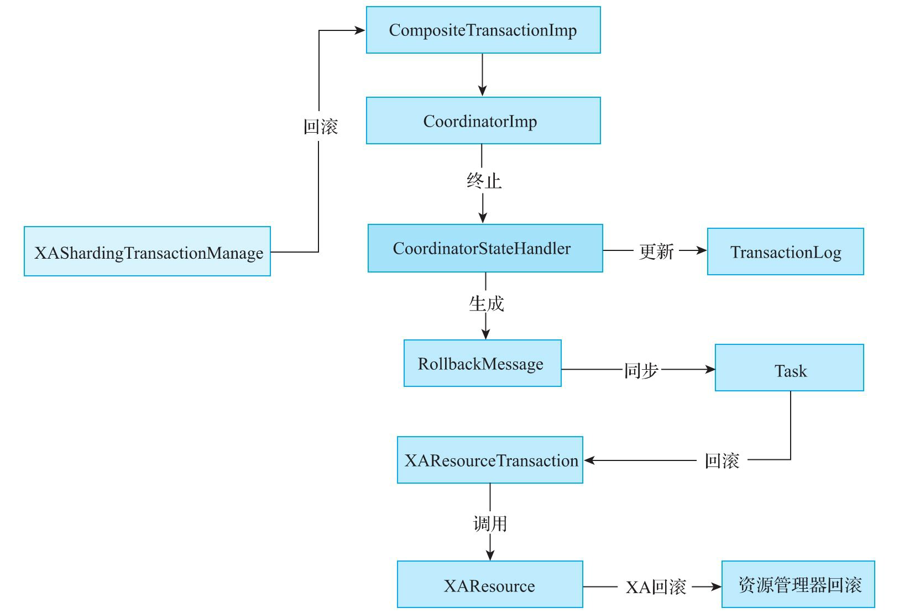{width="6.427891513560805in"
height="4.388272090988626in"}

> 图12-6　Atomikos-XA分布式事务Rollback流程
>
> 重点关注coordinator.terminate(false)，它和
> Commit流程是一样的，只不过在Commit流程里面，参数传
>
> 递的是true，代码如下所示。
>
> protected void terminate ( boolean commit ) throws
> HeurRollbackException,
>
> HeurMixedException, SysException, java.lang.SecurityException,
>
> 497
>
> HeurCommitException, HeurHazardException,\
> RollbackException,
>
> IllegalStateException
>
> {
>
> synchronized ( fsm\_ ) {
>
> if ( commit ) {
>
> if ( participants\_.size () \<= 1 ) {
>
> commit ( true );
>
> } else {
>
> int prepareResult = prepare ();
>
> if ( prepareResult != Participant.READ_ONLY )
>
> commit ( false );
>
> }
>
> } else {
>
> //

直接进行回滚

> rollback ();
>
> }
>
> }
>
> }
>
> 进入rollback()方法，核心代码如下所示。
>
> Enumeration\<Participant\> enumm = participants.elements (); while (
> enumm.hasMoreElements () ) {
>
> Participant p = enumm.nextElement ();
>
> if ( !readOnlyTable\_.contains ( p ) ) {
>
> RollbackMessage rm = new RollbackMessage ( p,
>
> rollbackresult, indoubt );
>
> propagator\_.submitPropagationMessage ( rm );\
> }
>
> }
>
> 在rollback()方法中，获取所有资源参与者进行循环
> 回滚，将要回滚的事务封装成PropagationMessage对象， 然后进行异步回滚。
>
> 根据线程的run()方法，最后会进入
> com.atomikos.datasource.xa.XAResourceTransaction.r
>
> ollback()方法，其核心代码如下所示。
>
> 498
>
> //如果状态是激活的，需要先执行 XA END XID
>
> if (this.state.equals(TxState.ACTIVE)) {
>
> suspend();
>
> }\
> this.xaresource.rollback(this.xid);
>
> 这里，this.xaresource.rollback(this.xid)方法在 底层封装并执行了XA
> ROLLBACK XID语句。
>
> 回滚流程相对来说比较简单，其核心逻辑是做如下两 件事情。
>
> 1）清理资源，包括事务日志等。
>
> 2）对每个资源参与者发起XA ROLLBACK XID语句。
>
> 499
>
> 12.3.6　Atomikos-XA分布式事务恢复流程
>
> 在8.3节中，简单介绍了XA事务存在的问题，包括XA
> 事务数据不一致的问题和事务管理器单点故障的问题。我
>
> 们需要在实际的项目中解决XA事务存在的问题，而
> Atomikos-XA方案提供了事务恢复的机制，能够有效解决 XA事务存在的问题。
>
> 本节对Atomikos-XA方案的事务恢复进行分析。解决
> 方法很简单，就是在事务操作的每一步，都人为记录事务
>
> 状态，我们可以把日志存储在需要存储的地方，可以是本
> 地存储，也可以是中心化存储。Atomikos的开源版本是使
> 用内存加文件的方式，将日志存储在本地。这样，在集群
> 系统中，如果有节点宕机，日志又存储在本地，就需要重
> 启服务解决相关的问题。
>
> 接下来分析Atomikos-XA分布式事务的恢复流程。
>
> com.atomikos.icatch.imp.TransactionServiceImp.
> init()方法会初始化一个定时任务，进行事务的恢复，代 码如下所示。
>
> \@Override
>
> public void recover() {
>
> XaResourceRecoveryManager xaResourceRecoveryManager =
> XaResourceRecoveryManager.getInstance();
>
> if (xaResourceRecoveryManager != null) { //null for LogCloud recovery
>
> try {
>
> //进行事务的恢复
>
> xaResourceRecoveryManager.recover(getXAResource());\
> } catch (Exception e) {
>
> 500
>
> refreshXAResource(); //cf case 156968\
> }
>
> }\
> }
>
> 这里重点关注XATransactionalResource.recover()
> 方法，具体流程如图12-7所示。

{width="6.427891513560805in"
height="2.6782874015748033in"}

> 图12-7　Atomikos-XA分布式事务恢复流程
>
> 在XaResourceRecoveryManager类的源码中，需要关
> 注recover(XaResource)方法，具体如下所示。
>
> public void recover(XAResource xaResource) throws XAException {
>
> //根据XA recovery协议，从XAResource中获取XID集合\
> List\<XID\> xidsToRecover =
>
> retrievePreparedXidsFromXaResource(xaResource);
>
> Collection\<XID\> xidsToCommit;\
> try {
>
> //获取事务日志中存储的XID集合
>
> xidsToCommit = retrieveExpiredCommittingXidsFromLog();\
> for (XID xid : xidsToRecover) {
>
> if (xidsToCommit.contains(xid)) {
>
> replayCommit(xid, xaResource);
>
> } else {
>
> attemptPresumedAbort(xid, xaResource);
>
> }
>
> 501
>
> }
>
> } catch (LogException couldNotRetrieveCommittingXids) {\
> LOGGER.logWarning(\"Transient error while recovering -
>
> will retry later\...\", couldNotRetrieveCommittingXids);
>
> }\
> }
>
> 首先我们来分析从XAResource中获取XID集合的代 码，通过
>
> retrievePreparedXidsFromXaResource(xaResource)方法 后进入
> com.atomikos.datasource.xa.RecoveryScan.recoverXid
> s()方法，代码如下所示。
>
> public static List\<XID\> recoverXids(XAResource xaResource,
> XidSelector selector) throws XAException {
>
> List\<XID\> ret = new ArrayList\<XID\>();
>
> boolean done = false;
>
> int flags = XAResource.TMSTARTRSCAN;
>
> Xid\[\] xidsFromLastScan = null;
>
> List\<XID\> allRecoveredXidsSoFar = new ArrayList\<XID\>();\
> do {
>
> //根据XA Recovery协议，从XAResource中获取XID\
> xidsFromLastScan = xaResource.recover(flags);\
> flags = XAResource.TMNOFLAGS;
>
> done = (xidsFromLastScan == null \|\|
>
> xidsFromLastScan.length == 0);
>
> if (!done) {
>
> done = true;
>
> for ( int i = 0; i \< xidsFromLastScan.length; i++\
> ) {
>
> XID xid = new XID ( xidsFromLastScan\[i\] );
>
> if (!allRecoveredXidsSoFar.contains(xid)) {
>
> allRecoveredXidsSoFar.add(xid);
>
> done = false;
>
> //筛选出符合自己框架定义的XID
>
> if (selector.selects(xid)) {
>
> ret.add(xid);
>
> }
>
> }
>
> }
>
> }
>
> } while (!done);
>
> 502
>
> return ret;
>
> }
>
> 上述代码核心包含两个逻辑，首先根据XA Recovery
> 协议从XAResource中获取XID，然后筛选出符合自己框架 定义的XID。
>
> 接下来从事务日志中获取XID集合，进入
> retrieveExpiredCommittingXidsFromLog()方法，然后进
>
> 入 com.atomikos.recovery.xa.DefaultXaRecoveryLog.getE
> xpiredCommittingXids()方法，代码如下所示。
>
> public Set\<XID\> getExpiredCommittingXids() throws LogReadException {
>
> Set\<XID\> ret = new HashSet\<XID\>();\
> Collection\<ParticipantLogEntry\> entries =
>
> log.getCommittingParticipants();
>
> for (ParticipantLogEntry entry : entries) {
>
> if (expired(entry) && !http(entry)) {
>
> XID xid = new XID(entry.coordinatorId, entry.uri);
>
> ret.add(xid);
>
> }
>
> }
>
> return ret;
>
> }
>
> 获取所有存储日志并转换成XID对象。再来看日志的
> 数据结构，协调者实体类CoordinatorLogEntry代码如下 所示。
>
> public class CoordinatorLogEntry implements Serializable {
>
> private static final long serialVersionUID =\
> -919666492191340531L;
>
> 503
>
> public final String id;
>
> public final boolean wasCommitted;
>
> public final String superiorCoordinatorId;
>
> //多个参与者
>
> public final ParticipantLogEntry\[\] participants;
>
> 参与者实体类如下所示。
>
> public class ParticipantLogEntry implements Serializable {
>
> private static final long serialVersionUID = 1728296701394899871L;
>
> public final String coordinatorId;
>
> public final String uri;
>
> public final long expires;
>
> public final TxState state;
>
> public final String resourceName;
>
> 最后回到主线，将事务日志中需要提交的XID集合与 通过XA
> Recovery协议获取的XID集合进行匹配，代码如下
>
> 所示。
>
> for (XID xid : xidsToRecover) {
>
> if (xidsToCommit.contains(xid)) {
>
> //如果能匹配，进行提交
>
> replayCommit(xid, xaResource);\
> } else {
>
> //进行回滚
>
> attemptPresumedAbort(xid, xaResource);\
> }
>
> }
>
> 504
>
> 事务提交代码如下。
>
> private void replayCommit(XID xid, XAResource xaResource) { if
> (LOGGER.isDebugEnabled()) LOGGER.logDebug(\"Replaying
>
> commit of xid: \" + xid);
>
> try {
>
> //执行XA commit协议，进行事务提交\
> xaResource.commit(xid, false);\
> log.terminated(xid);
>
> } catch (XAException e) {
>
> if (alreadyHeuristicallyTerminatedByResource(e)) {
>
> handleHeuristicTerminationByResource(xid, xaResource,\
> e, true);
>
> } else if (xidTerminatedInResourceByConcurrentCommit(e))\
> {
>
> log.terminated(xid);
>
> } else {
>
> LOGGER.logWarning(\"Transient error while replaying\
> commit - will retry later\...\", e);
>
> }
>
> }\
> }
>
> 事务回滚代码如下。
>
> private void attemptPresumedAbort(XID xid, XAResource xaResource) {
>
> try {
>
> log.presumedAborting(xid);
>
> if (LOGGER.isDebugEnabled()) LOGGER.logDebug(\"Presumed
>
> abort of xid: \" + xid);
>
> try {
>
> //执行XA rollback协议，进行事务回滚
>
> xaResource.rollback(xid);
>
> log.terminated(xid);
>
> } catch (XAException e) {
>
> if (alreadyHeuristicallyTerminatedByResource(e)) {
>
> handleHeuristicTerminationByResource(xid,
>
> xaResource, e, false);
>
> } else if
>
> (xidTerminatedInResourceByConcurrentRollback(e)) {
>
> log.terminated(xid);
>
> } else {
>
> LOGGER.logWarning(\"Unexpected exception during
>
> recovery ignoring to retry later\...\", e);
>
> 505
>
> }
>
> }
>
> } catch (IllegalStateException
> presumedAbortNotAllowedInCurrentLogState) {
>
> } catch (LogException logWriteException) {\
> LOGGER.logWarning(\"log write failed for Xid: \"+xid+\",
>
> ignoring to retry later\", logWriteException);
>
> }\
> }
>
> 以上我们深入框架底层，了解了事务恢复的逻辑：首 先根据XA
> Recovery协议获取XID，然后获取事务日志需要
> 提交的XID，接着将两个XID集合进行匹配，最后进行事务 的提交或者回滚。
>
> 506
>
> 12.4　ShardingSphere对Narayana方案的实 战与源码解析
>
> Narayana是由Jboss团队提供的XA分布式事务的解决 方案，具有以下特点。
>
> 1）标准的基于JTA实现。
>
> 2）事务管理器完全去中心化设计，与业务耦合，无 须单独部署。
>
> 3）事务日志支持数据库存储，支持集群模式下的事 务恢复。
>
> 本节对ShardingSphere-Proxy整合Narayana-XA分布
> 式事务解决方案进行实战演练以及源码解析。
>
> 507
>
> 12.4.1　Narayana环境搭建
>
> 由于开源协议的限制，Narayana框架的依赖包并没
> 有打包到ShardingShere-Proxy发行版本中，因此需要手
>
> 动添加依赖包，并且手动调整事务管理器类型，具体步 骤如下。
>
> 第一步：添加依赖包。将Narayana所需依赖包复制
> 至/lib目录，代码如下（读者可以去maven中央仓库自行
>
> 下载）。
>
> \<propeties\>\
> \<narayana.version\>5.9.1.Final\</narayana.version\>
>
> \<jboss-transaction-spi.version\>7.6.0.Final\</jboss-
> transaction-spi.version\>
>
> \<jboss-logging.version\>3.2.1.Final\</jboss-logging.version\>
> \</propeties\>
>
> \<dependency\>\
> \<groupId\>org.apache.shardingsphere\</groupId\>
>
> \<artifactId\>shardingsphere-transaction-xa- narayana\</artifactId\>
>
> \<version\>\${shardingsphere.version}\</version\>\
> \</dependency\>
>
> \<dependency\>
>
> \<groupId\>org.jboss.narayana.jta\</groupId\>\
> \<artifactId\>jta\</artifactId\>\
> \<version\>\${narayana.version}\</version\>
>
> \</dependency\>\
> \<dependency\>
>
> \<groupId\>org.jboss.narayana.jts\</groupId\>\
> \<artifactId\>narayana-jts-integration\</artifactId\>\
> \<version\>\${narayana.version}\</version\>
>
> \</dependency\>\
> \<dependency\>
>
> \<groupId\>org.jboss\</groupId\>\
> \<artifactId\>jboss-transaction-spi\</artifactId\>\
> \<version\>\${jboss-transaction-spi.version}\</version\>
>
> 508
>
> \</dependency\>\
> \<dependency\>
>
> \<groupId\>org.jboss.logging\</groupId\>\
> \<artifactId\>jboss-logging\</artifactId\>\
> \<version\>\${jboss-logging.version}\</version\>
>
> \</dependency\>
>
> 第二步：修改/conf/server.yaml，将XA事务管理器
> 类型设置为Narayana，代码如下所示。
>
> props:
>
> xa-transaction-manager-type: Narayana
>
> 第三步：重新启动ShardingSphere-Proxy，环境搭 建完成。
>
> 第四步：使用MySQL客户端重新连接到 ShardingSphere-Proxy。
>
> 509
>
> 12.4.2　Narayana-XA分布式事务初始化流程
>
> 首先我们来看一下初始化流程，如图12-8所示。

{width="6.427890419947507in"
height="3.3993646106736657in"}

> 图12-8　Narayana-XA分布式事务初始化流程
>
> 启动并初始化ShardingSphere-Proxy，进入
> XaTransactionManager.init()方法，这是一个SPI的实
>
> 现。因为我们配置的类型是Narayana，所以会进入
> org.apache.shardingsphere.transaction.xa.narayana.
> manager.NarayanaXATransactionManager.init()方法。
> 首先来看一下这个类的源码，如下所示。
>
> public final class NarayanaXATransactionManager implements
> XATransactionManager {
>
> private TransactionManager transactionManager;
>
> 510
>
> private XARecoveryModule xaRecoveryModule;
>
> private RecoveryManagerService recoveryManagerService;
>
> \@Override
>
> public void init() {\
> //获取TransactionManager，这是Narayana初始化的核心
>
> transactionManager =
>
> jtaPropertyManager.getJTAEnvironmentBean().getTransactionManager( );
>
> //获取事务恢复模块
>
> xaRecoveryModule =
>
> XARecoveryModule.getRegisteredXARecoveryModule();\
> recoveryManagerService = new RecoveryManagerService();
>
> RecoveryManager.delayRecoveryManagerThread();\
> recoveryManagerService.create();
>
> //开启事务恢复
>
> recoveryManagerService.start();\
> }
>
> \@Override
>
> public void registerRecoveryResource(final String dataSourceName,
> final XADataSource xaDataSource) {
>
> if (Objects.nonNull(xaRecoveryModule)) {\
> xaRecoveryModule.addXAResourceRecoveryHelper(new
>
> DataSourceXAResourceRecoveryHelper(xaDataSource));
>
> }
>
> }
>
> \@Override
>
> public void removeRecoveryResource(final String\
> dataSourceName, final XADataSource xaDataSource) {
>
> if (Objects.nonNull(xaRecoveryModule)) {\
> xaRecoveryModule.removeXAResourceRecoveryHelper(new
>
> DataSourceXAResourceRecoveryHelper(xaDataSource));
>
> }
>
> }
>
> \@SneakyThrows({SystemException.class,\
> RollbackException.class})
>
> \@Override
>
> public void enlistResource(final SingleXAResource singleXAResource) {
>
> transactionManager.getTransaction().enlistResource(singleXAResour
> ce.getDelegate());
>
> }
>
> \@Override
>
> public TransactionManager getTransactionManager() {
>
> return transactionManager;
>
> 511
>
> }
>
> \@Override
>
> public void close() throws Exception {
>
> recoveryManagerService.stop();
>
> recoveryManagerService.destroy();
>
> }
>
> \@Override
>
> public String getType() {
>
> return XATransactionManagerType.NARAYANA.getType();
>
> }
>
> }
>
> 这里重点关注
>
> jtaPropertyManager.getJTAEnvironmentBean().getTran
> sactionManager()方法，获取TransactionManager是
> Narayana初始化的核心。进入
> [com.arjuna.common.internal.util.propertyservice.Be](http://com.arjuna.common.internal.util.propertyservice.Be)
> anPopulator.getNamedInstance()方法，代码如下所示。
>
> private static \<T\> T getNamedInstance(Class\<T\> beanClass, String
> name, Properties properties) throws RuntimeException {
>
> StringBuilder sb = new StringBuilder().append(beanClass.getName());
>
> if (name != null)\
> sb.append(\":\").append(name);
>
> String key = sb.toString();\
> if(!beanInstances.containsKey(key)) {
>
> T bean = null;
>
> try {
>
> // 初始化JTAEnvironmentBean类
>
> bean = beanClass.newInstance();
>
> if (properties != null) {
>
> configureFromProperties(bean, name, properties);\
> } else {
>
> //初始化属性配置
>
> Properties defaultProperties =
>
> PropertiesFactory.getDefaultProperties();\
> configureFromProperties(bean, name,
>
> defaultProperties);
>
> }
>
> } catch (Throwable e) {
>
> 512
>
> throw new RuntimeException(e);
>
> }
>
> beanInstances.putIfAbsent(key, bean);
>
> }
>
> return (T) beanInstances.get(key);
>
> }
>
> 接下来，重点关注Properties
>
> defaultProperties=PropertiesFactory.getDefaultProp
> erties()方法，最后会进入
> com.arjuna.common.util.propertyservice.AbstractPro
> pertiesFactory.getProperties FromFile()方法，代码 如下所示。
>
> public Properties getPropertiesFromFile(String propertyFileName,
> ClassLoader classLoader) {
>
> String propertiesSourceUri = null;\
> try
>
> {
>
> propertiesSourceUri =
>
> com.arjuna.common.util.propertyservice.FileLocator.locateFile(pro
> pertyFileName, classLoader);
>
> }
>
> catch(FileNotFoundException fileNotFoundException)\
> {
>
> URL url =
>
> AbstractPropertiesFactory.class.getResource(\"/default-\"+property
>
> FileName);
>
> if(url == null) {
>
> commonLogger.i18NLogger.warn_could_not_find_config_file(url);
>
> } else {
>
> propertiesSourceUri = url.toString();\
> }
>
> }
>
> catch (IOException e)\
> {
>
> throw new RuntimeException(\"invalid property file
> \"+propertiesSourceUri, e);
>
> }
>
> Properties properties = null;\
> try {
>
> 513
>
> if (propertiesSourceUri != null) {
>
> properties = loadFromFile(propertiesSourceUri);
>
> }
>
> properties = applySystemProperties(properties);
>
> } catch(Exception e) {
>
> throw new RuntimeException(\"unable to load properties
>
> from \"+properties-\
> SourceUri, e);
>
> }
>
> return properties;
>
> }
>
> getPropertiesFromFile()方法的主要逻辑如下所
>
> 示。
>
> 1）获取jbossts-properties.xml文件的XML路径，获 取顺序为
>
> user.dir(pwd)→user.home→java.home→classpath。
>
> 2）如果没找到XML路径，就获取classpath下
> default-jbossts-properties.xml文件的XML路径。
>
> 3） properties=loadFromFile(propertiesSourceUri)表示根
>
> 据路径，将文件加载成属性。
>
> 4） properties=applySystemProperties(properties)表示叠
>
> 加系统配置属性，覆盖里面的Key。
>
> 接下来，看一下jbossts-properties.xml文件的内 容，部分配置如下所示。
>
> 514
>
> \<properties\>
>
> \<entry
>
> key=\"CoordinatorEnvironmentBean.commitOnePhase\"\>YES\</entry\>
>
> \<entry
>
> key=\"ObjectStoreEnvironmentBean.objectStoreType\"\>com.arjuna.ats.i
> nternal.arjuna.objectstore.jdbc.JDBCStore\</entry\>
>
> \<entry
>
> key=\"ObjectStoreEnvironmentBean.jdbcAccess\"\>com.arjuna.ats.intern
> al.arjuna.objectstore.jdbc.accessors.DynamicDataSourceJDBCAccess;
> ClassName=com.mysql.jdbc.jdbc2.optional.MysqlDataSource;DatabaseN
> ame=jbossts;ServerName=172.25.4.62;PortNumber=3306;User=j_jbossts
> ;Password=9MfNHoRncCi8\</entry\>
>
> \<entry
>
> key=\"ObjectStoreEnvironmentBean.tablePrefix\"\>Action\</entry\>
>
> \<entry
>
> key=\"ObjectStoreEnvironmentBean.dropTable\"\>true\</entry\>
>
> \<entry
>
> key=\"ObjectStoreEnvironmentBean.stateStore.objectStoreType\"\>com.a
> rjuna.ats.internal.arjuna.objectstore.jdbc.JDBCStore\</entry\>
>
> \<entry
>
> \</properties\>
>
> 文件被加载成java.util.Properties对象。entry名
> 称的形式为类名.属性。配置实体类都在
> com.arjuna.ats.arjuna.common包下，以bean结尾。这样 做的好处如下。
>
> 1）文件加载后会被缓存，直到JVM重新启动才重新读
> 取。对属性文件的更改需要重新启动JVM才能生效。
>
> 2）在属性加载之后，检查EnvironmentBean，对于每
> 个字段，如果属性在搜索顺序中包含如下匹配的键，则使
> 用属性的值调用该字段的setter方法，或者使用不同的系
> 统属性调用该字段的setter方法。
>
> 3）将Bean实例返回给调用者，使得调用者可以通过
> 调用setter方法进一步覆盖值。
>
> 515
>
> 接下来，返回 org.apache.shardingsphere.transaction.xa.narayana.
>
> manager.NarayanaXA-TransactionManage.init()方法，
> 分析XARecoveryModule.getRegisteredXARecovery
> Module()方法，代码如下所示。
>
> public static XARecoveryModule getRegisteredXARecoveryModule () {
>
> if (registeredXARecoveryModule == null) {\
> //获取事务恢复管理器
>
> RecoveryManager recMan = RecoveryManager.manager();\
> Vector recoveryModules = recMan.getModules();
>
> if (recoveryModules != null) {
>
> Enumeration modules = recoveryModules.elements();
>
> while (modules.hasMoreElements()) {
>
> RecoveryModule m = (RecoveryModule)
>
> modules.nextElement();
>
> if (m instanceof XARecoveryModule) {
>
> registeredXARecoveryModule =
>
> (XARecoveryModule) m;\
> break;
>
> }
>
> }
>
> }
>
> }
>
> return registeredXARecoveryModule;
>
> }
>
> 通过RecoveryManager.manager()方法会进入
> com.arjuna.ats.internal.arjuna.recovery.RecoveryMa
>
> nagerImple的构造方法，核心代码如下所示。
>
> //加载事务恢复
>
> recActivatorLoader = new RecActivatorLoader();
> \_recActivatorLoader.startRecoveryActivators();
>
> //核心初始流程
>
> \_periodicRecovery = new PeriodicRecovery(threaded, useListener);
>
> 516
>
> 这里重点关注new PeriodicRecovery(threaded,useListener)，首先加载恢
>
> 复模块，然后进入 com.arjuna.ats.internal.arjuna.recovery.AtomicActi
> onRecoveryModule的构造方法，代码如下所示。
>
> protected AtomicActionRecoveryModule (String type)\
> {
>
> if (tsLogger.logger.isDebugEnabled()) {\
> tsLogger.logger.debug(\"AtomicActionRecoveryModule
>
> created\");
>
> }
>
> if (\_recoveryStore == null)\
> {
>
> \_recoveryStore = StoreManager.getRecoveryStore();\
> }
>
> \_transactionStatusConnectionMgr = new
> TransactionStatusConnectionManager() ;
>
> \_transactionType = type;
>
> }
>
> 继续关注StoreManager.getRecoveryStore()方法， 最后会进入
> com.arjuna.ats.arjuna.objectstore.StoreManager.ini
> tStore()方法，进入事务日志的初始化，代码如下所示。
>
> private static final ObjectStoreAPI initStore(String name)\
> {
>
> ObjectStoreEnvironmentBean storeEnvBean =
> BeanPopulator.getNamedInstance(ObjectStoreEnvironmentBean.class,
>
> name);\
> //获取事务存储类型和支持的类名，默认使用ShadowNoFileLockStore存储
>
> String storeType = storeEnvBean.getObjectStoreType();\
> ObjectStoreAPI store;
>
> try
>
> {
>
> 517
>
> //进行SPI初始化加载
>
> store =
>
> ClassloadingUtility.loadAndInstantiateClass(ObjectStoreAPI.class,
> storeType, name);
>
> }
>
> catch (final Throwable ex)\
> {
>
> throw new
>
> FatalError(tsLogger.i18NLogger.get_StoreManager_invalidtype() + \"
> \" + storeType, ex);
>
> }
>
> //进行初始化
>
> store.start();
>
> return store;\
> }
>
> 如果storeType配置的是
> com.arjuna.ats.internal.arjuna.objectstore.jdbc.JD
>
> BCStore，那么就会进入这个类的构造方法进行初始化， 核心代码如下所示。
>
> public JDBCStore(ObjectStoreEnvironmentBean jdbcStoreEnvironmentBean)
> throws ObjectStoreException {
>
> StringTokenizer stringTokenizer = new
> StringTokenizer(connectionDetails, \";\");
>
> //初始化jdbcAccess
>
> JDBCAccess jdbcAccess = (JDBCAccess)
>
> Class.forName(stringTokenizer.nextToken()).newInstance();
>
> //进行JDBC连接，初始化datasource\
> jdbcAccess.initialise(stringTokenizer);
>
> final String packagePrefix = JDBCStore.class.getName().substring(0,
>
> JDBCStore.class.getName().lastIndexOf(\'.\')) + \".drivers.\";
>
> Class jdbcImpleClass = null;\
> try {
>
> jdbcImpleClass = Class.forName(packagePrefix + name + \"\_\"\
> + major + \"\_\" + minor + \"\_driver\");
>
> } catch (final ClassNotFoundException cnfe) {
>
> try {
>
> jdbcImpleClass = Class.forName(packagePrefix +
>
> name + \"\_\" + major + \"\_driver\");
>
> } catch (final ClassNotFoundException cnfe2) {
>
> jdbcImpleClass = Class.forName(packagePrefix +
>
> 518
>
> name + \"\_driver\");
>
> }
>
> }
>
> \_theImple =
>
> (com.arjuna.ats.internal.arjuna.objectstore.jdbc.JDBCImple_driver )
> jdbcImpleClass.newInstance();
>
> //使用不同的数据库类型来初始化\
> \_theImple.initialise(jdbcAccess, tableName,
>
> jdbcStoreEnvironmentBean);\
> }
>
> 这个方法还是比较清晰的，根据JDBC的配置，首先初
> 始化连接信息，然后获取连接，最后根据不同的数据库类
> 型进行初始化。我们来看下
>
> \_theImple.initialise(jdbcAccess,tableName,jdbcStor
> eEnvironmentBean)，代码如下所示。
>
> public void initialise(final JDBCAccess jdbcAccess, String tableName,
>
> ObjectStoreEnvironmentBean jdbcStoreEnvironmentBean)\
> throws SQLException, NamingException {
>
> this.jdbcAccess = jdbcAccess;
>
> try (Connection connection = jdbcAccess.getConnection()) {
>
> try (Statement stmt = connection.createStatement()) {
>
> // table \[type, object UID, format, blob\]
>
> //初始化是否需要删除表
>
> if (jdbcStoreEnvironmentBean.getDropTable()) {
>
> try {
>
> stmt.executeUpdate(\"DROP TABLE \" +
>
> tableName);
>
> } catch (SQLException ex) {
>
> checkDropTableException(connection, ex);
>
> }
>
> }
>
> //是否需要创建表
>
> if (jdbcStoreEnvironmentBean.getCreateTable()) {
>
> try {
>
> createTable(stmt, tableName);
>
> } catch (SQLException ex) {
>
> checkCreateTableError(ex);
>
> }
>
> }
>
> if (!connection.getAutoCommit()) {
>
> 519
>
> connection.commit();
>
> }
>
> }
>
> }
>
> this.tableName = tableName;\
> }
>
> 因为框架会自动创建事务日志表来进行存储，所以不
> 需要手动创建，SQL脚本如下。
>
> protected void createTable(Statement stmt, String tableName)
>
> throws SQLException {
>
> String statement = \"CREATE TABLE \"
>
> \+ tableName
>
> \+ \" (StateType INTEGER NOT NULL, Hidden INTEGER NOT\
> NULL, \"
>
> \+ \"TypeName VARCHAR(255) NOT NULL, UidString\
> VARCHAR(255) NOT NULL, ObjectState \"
>
> \+ getObjectStateSQLType()
>
> \+ \", PRIMARY KEY(UidString, TypeName, StateType))\";\
> stmt.executeUpdate(statement);
>
> }
>
> 本节主要介绍了Narayana框架在初始化时，如何加载
> 配置和初始化事务日志存储，对于如何进行事务恢复，我
> 们会在后续章节单独进行讲解。
>
> 520
>
> 12.4.3　Narayana-XA分布式事务Begin流程
>
> 我们结合ShardingSphere-Proxy实战来讲解Begin流
> 程。在连接ShardingSphere-Proxy的MySQL客户端执行以 下命令。
>
> mysql\> begin;
>
> ShardingSphere-Proxy收到命令后，会进入
> XAShardingTransactionManager的begin方法，然后执行
>
> XA分布式事务框架的Begin流程，调用
> com.arjuna.ats.internal.jta.transaction.arjunacore
> .BaseTransaction.begin()方法，核心代码如下。
>
> public void begin() throws javax.transaction.NotSupportedException,
>
> javax.transaction.SystemException\
> {
>
> //检测事务状态\
> checkTransactionState();\
> //获取超时时间
>
> Integer value = \_timeouts.get();\
> int v = 0;
>
> if (value != null)\
> {
>
> v = value.intValue();
>
> }\
> else
>
> v = TxControl.getDefaultTimeout();
>
> //初始化事务具体实现
>
> TransactionImple.putTransaction(new TransactionImple(v));
>
> }
>
> 521
>
> Begin流程主要检查事务状态、获取超时时间以及创
> 建事务实现。我们进入该类的构造方法，代码如下所示。
>
> public TransactionImple(int timeout)\
> {
>
> //创建事务Action
>
> \_theTransaction = new AtomicAction();\
> //开启事务
>
> \_theTransaction.begin(timeout);
>
> \_resources = new Hashtable();\
> \_duplicateResources = new Hashtable();\
> \_suspendCount = 0;\
> \_xaTransactionTimeoutEnabled =
>
> getXATransactionTimeoutEnabled();
>
> \_txLocalResources = Collections.synchronizedMap(new HashMap());
>
> }
>
> new AtomicAction()方法对相关的父类进行初始化。
> AtomicAction的继承体系如图12-9所示。
>
> 522

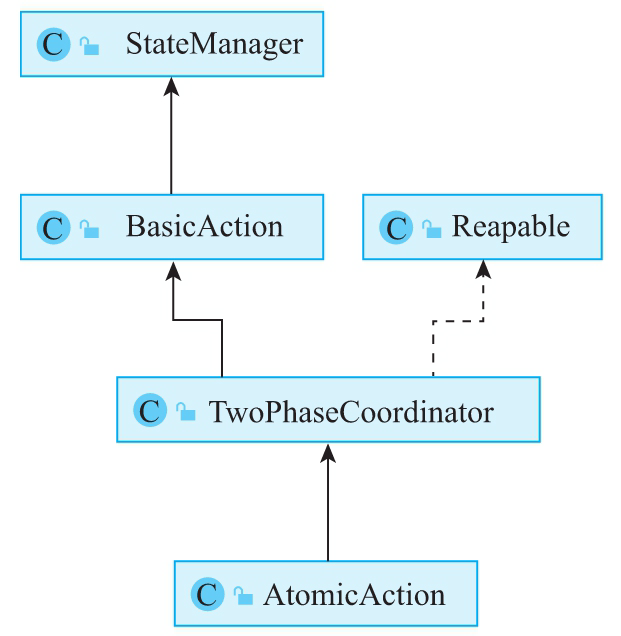{width="6.427547025371829in"
height="6.582801837270341in"}

> 图12-9　AtomicAction的继承体系
>
> 接下来分析 com.arjuna.ats.arjuna.AtomicAction.begin()方法，代
>
> 码如下所示。
>
> public int begin (int timeout) {
>
> 523
>
> //调用父类start()方法，完成Begin流程
>
> int status = super.start();
>
> if (status == ActionStatus.RUNNING)\
> {
>
> //把当前对象设置到ThreadLocal中\
> ThreadActionData.pushAction(this);\
> \_timeout = timeout;
>
> if (\_timeout == 0)
>
> \_timeout = TxControl.getDefaultTimeout();
>
> if (\_timeout \> 0)
>
> //插入超时时间控制
>
> TransactionReaper.transactionReaper().insert(this,\
> \_timeout);
>
> }
>
> return status;
>
> }
>
> 524
>
> 12.4.4　Narayana-XA分布式事务资源注册
>
> NarayanaXATransactionManager接口返回 TransactionManager接口，进入
> com.arjuna.ats.internal.jta.transaction.arjunacor
> e.TransactionImp.enlistResource()方法，核心代码如 下所示。
>
> AbstractRecord abstractRecord = createRecord(xaRes, params, xid);
>
> if(abstractRecord != null) {
>
> xaRes.start(xid, xaStartNormal);\
> if(\_theTransaction.add(abstractRecord) ==
>
> AddOutcome.AR_ADDED) {
>
> \_resources.put(xaRes, new TxInfo(xid));
>
> return true;
>
> } else {
>
> abstractRecord.topLevelAbort();\
> }
>
> }
>
> 最核心的步骤是执行XA规范接口中的XA start
> xid，然后把XAResource放到本地缓存中。
>
> 525
>
> 12.4.5　Narayana-XA分布式事务Commit流程
>
> 将MySQL连接到ShardingSphere-Proxy客户端，执行 以下命令。
>
> \>begin;
>
> \> insert into t_order(user_id, order_id, status) values(5, 5,
> \'xa\');
>
> \> insert into t_order(user_id, order_id, status) values(6, 6,
> \'xa\');
>
> \>commit;
>
> 上述代码开启了XA事务，并且执行了两条SQL语句，
> 根据分库分表规则，第一条SQL语句会路由到demo_ds_1库
>
> 中的t_order_1表，第二条SQL语句会路由到demo_ds_0中
> 的t_order_0表，执行了一次跨库的分布式事务。流程如 图12-10所示。
>
> 进入 com.arjuna.ats.internal.jta.transaction.arjunacore
>
> .BaseTransaction.commit()方法，核心代码如下所示。
>
> 526

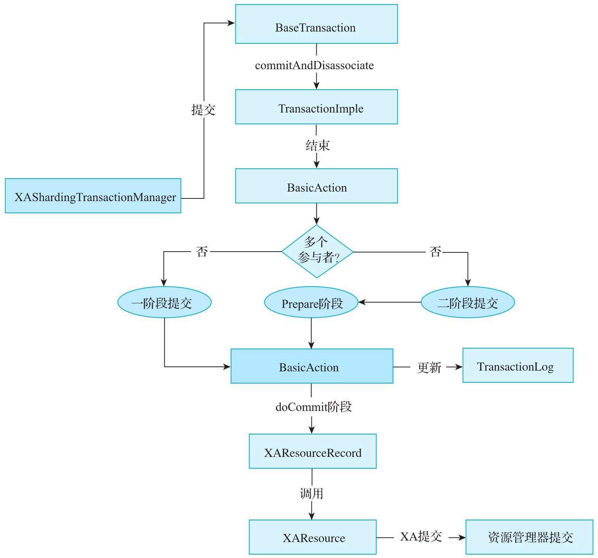{width="6.427890419947507in"
height="5.9952449693788274in"}

> 图12-10　Narayana-XA分布式事务Commit流程
>
> public void commit() throws javax.transaction.RollbackException,
>
> javax.transaction.HeuristicMixedException,\
> javax.transaction.HeuristicRollbackException,\
> java.lang.SecurityException,
>
> java.lang.IllegalStateException,\
> javax.transaction.SystemException
>
> {
>
> //获取当前事务
>
> TransactionImple theTransaction = TransactionImple.getTransaction();
>
> //执行事务提交
>
> 527
>
> theTransaction.commitAndDisassociate();\
> }
>
> 接下来，重点关注 theTransaction.commitAndDisassociate()方法，之后进
>
> 入com.arjuna.ats.arjuna.AtomicAction.commit()方 法，代码如下所示。
>
> public int commit (boolean report_heuristics) {
>
> //进行事务提交
>
> int status = super.end(report_heuristics);
>
> //

清空数据

> ThreadActionData.popAction();
>
> TransactionReaper.transactionReaper().remove(this);
>
> return status;
>
> }
>
> 随后进入
>
> com.arjuna.ats.arjuna.coordinator.BasicAction.End(
> )方法，首先判断是否能优化成一阶段提交，如果不能，
> 则进行二阶段提交（二阶段提交还可以使用异步线程池方
> 式），核心代码如下。
>
> if (doOnePhase())\
> {
>
> onePhaseCommit(reportHeuristics);
>
> ActionManager.manager().remove(get_uid());\
> }
>
> else
>
> {
>
> int prepareStatus = prepare(reportHeuristics);
>
> if (!reportHeuristics && TxControl.asyncCommit
>
> && (parentAction == null)) {
>
> 528
>
> TwoPhaseCommitThreadPool.submitJob(new\
> AsyncCommit(this, false));
>
> } else
>
> phase2Abort(reportHeuristics); /\* first phase failed\
> \*/
>
> }\
> else
>
> {
>
> if (!reportHeuristics && TxControl.asyncCommit
>
> && (parentAction == null))
>
> {
>
> TwoPhaseCommitThreadPool.submitJob(new\
> AsyncCommit(this, true));
>
> }
>
> else
>
> phase2Commit(reportHeuristics); /\* first phase\
> succeeded \*/
>
> }\
> }
>
> 重点分析二阶段提交，首先执行int
> prepareStatus=prepare(reportHeuristics)，然后调用
>
> com.arjuna.ats.internal.jta.resources.arjunacore.X
> AResourceRecord.topLevelPrepare()方法，核心代码如 下所示。
>
> //省略相关代码\
> //执行XA end语句
>
> endAssociation(XAResource.TMSUCCESS, TxInfo.NOT_ASSOCIATED);
>
> //执行XA prepare\
> theXAResource.prepare(\_tranID)
>
> 接下来进行提交，进入phase2Commit方法，最后会调
>
> 用 com.arjuna.ats.internal.jta.resources.arjunacore.X
> AResourceRecord.topLevelCommit()方法。该方法会执行 XA
> commit语句，核心代码如下所示。

{width="6.386224846894138in"
height="5.555555555555555e-2in"}

> 529

{width="3.807852143482065e-2in"
height="3.807852143482065e-2in"}

> //省略相关代码 \_theXAResource.commit(\_tranID, fase);
>
> 530
>
> 12.4.6　Narayana-XA分布式事务Rollback 流程
>
> 接上述环境，将MySQL连接到ShardingSphere-Proxy 客户端，执行以下命令。
>
> \>begin;
>
> \> insert into order(user_id, order_id, status) values(5, 5, \'ax\');
>
> \> insert into order(user_id, order_id, status) values(6, 26 \'ax\');
>
> \>rollback;
>
> 这里开启了XA分布式事务，执行了两条SQL语句，最
> 后执行rollback命令，发现真实的数据库表中不存在上 述数据。
>
> 带着问题找到 org.apache.shardingsphere.transaction.xa.XAShardi
>
> ngTransactionManager.rollback()方法，然后进入
> com.arjuna.ats.internal.jta.transaction.arjunacor
> e.BaseTransaction.rollback()方法，代码如下所示。
>
> public void rollback() throws java.lang.IllegalStateException,
>
> java.lang.SecurityException,\
> javax.transaction.SystemException
>
> {
>
> if (jtaLogger.logger.isTraceEnabled()) {\
> jtaLogger.logger.trace(\"BaseTransaction.rollback\");
>
> }
>
> TransactionImple theTransaction =
>
> 531
>
> TransactionImple.getTransaction();
>
> if (theTransaction == null)
>
> throw new IllegalStateException(
>
> \"BaseTransaction.rollback - \"
>
> \+
>
> jtaLogger.i18NLogger.get_transaction_arjunacore_notx());
>
> theTransaction.rollbackAndDisassociate();\
> }
>
> 最后进入
>
> com.arjuna.ats.arjuna.coordinator.BasicAction.top
> LevelAbort()方法，核心代码如下所示。
>
> //先执行XA end语句
>
> endAssociation(XAResource.TMFAIL, TxInfo.FAILED);\
> //然后执行XA rollback语句\
> \_theXAResource.rollback(\_tranID);
>
> ActionManager.manager().remove(get_uid());\
> actionStatus = ActionStatus. ABORTED;
>
> if (TxStats.enabled()) {\
> TxStats.getInstance().incrementAbortedTransactions();
>
> if (applicationAbort)
>
> TxStats.getInstance(). incrementApplicationRollbacks();
>
> }
>
> 可以看到回滚流程比较简单，先执行XA end语句， 然后执行XA
> rollback语句，最后清除缓存。
>
> 532
>
> 12.4.7　Narayana-XA分布式事务恢复流程
>
> Narayana的开源版本提供了文件和数据库两种存储方
> 式，文件存储方式只支持单机环境，而数据库存储方式除
> 支持单机环境外，还支持集群环境进行事务恢复。
>
> Narayana使用了单线程轮询资源管理器，执行XA
> recovery语句，判断是否有需要恢复的语句，流程如图
>
> 12-11所示。

{width="6.427890419947507in"
height="5.3359733158355205in"}

> 533
>
> 图12-11　Narayana-XA分布式事务恢复流程
>
> 进入 com.arjuna.ats.internal.arjuna.recovery.PeriodicRe
>
> covery.run()方法，其核心代码如下所示。
>
> public void run ()\
> {
>
> doInitialWait();
>
> boolean finished = false;
>
> do
>
> {
>
> boolean workToDo = false;
>
> synchronized(\_stateLock) {
>
> if (getStatus() == Status.SCANNING) {
>
> doScanningWait();
>
> if (getMode() == Mode.ENABLED &&
>
> !\_workerScanRequested) {\
> doPeriodicWait();
>
> finished = (getMode() == Mode.TERMINATED);
>
> }
>
> } else {
>
> switch (getMode()) {
>
> case ENABLED:
>
> setStatus(Status.SCANNING);
>
> \_stateLock.notifyAll();
>
> workToDo = true;
>
> break;
>
> case SUSPENDED:
>
> doSuspendedWait();
>
> finished = (getMode() ==
>
> Mode.TERMINATED);
>
> break;
>
> case TERMINATED:
>
> finished = true;
>
> break;
>
> }
>
> }
>
> }
>
> if (workToDo) {
>
> boolean notifyRequired;
>
> synchronized(\_stateLock) {
>
> notifyRequired = \_workerScanRequested;
>
> \_workerScanRequested = false;
>
> 534
>
> }
>
> doWorkInternal();
>
> synchronized(\_stateLock) {
>
> setStatus(Status.INACTIVE);
>
> \_stateLock.notifyAll();
>
> if (notifyRequired && !\_workerScanRequested) {
>
> notifyWorker();
>
> }
>
> if (getMode() == Mode.ENABLED &&
>
> !\_workerScanRequested) {\
> doPeriodicWait();
>
> }
>
> finished = (getMode() == Mode.TERMINATED);
>
> }
>
> }
>
> } while (!finished);
>
> synchronized(\_stateLock) {
>
> if (\_workerScanRequested) {
>
> notifyWorker();
>
> }
>
> }\
> }
>
> 在线程中获取事务日志，进行轮询，重点关注
> doWorkInternal()方法，核心代码如下所示。
>
> private void doWorkInternal()\
> {
>
> Vector copyOfModules = getModules();
>
> Enumeration modules = copyOfModules.elements();\
> while (modules.hasMoreElements())
>
> {
>
> RecoveryModule m = (RecoveryModule) modules.nextElement();
>
> ClassLoader cl = switchClassLoader(m);\
> try {
>
> m.periodicWorkFirstPass();\
> } finally {
>
> restoreClassLoader(cl);
>
> }
>
> }
>
> synchronized (\_stateLock) {
>
> doBackoffWait();
>
> if (getMode() == Mode.TERMINATED) {
>
> return;
>
> 535
>
> }
>
> }
>
> modules = copyOfModules.elements();\
> while (modules.hasMoreElements())
>
> {
>
> RecoveryModule m = (RecoveryModule) modules.nextElement();
>
> ClassLoader cl = switchClassLoader(m);\
> try {
>
> m.periodicWorkSecondPass();\
> } finally {
>
> restoreClassLoader(cl);
>
> }
>
> }\
> }
>
> 代码的核心思想是获取RecoveryModule集合，循环执
> 行它的两个阶段。接下来，看一下这个接口定义，代码如 下所示。
>
> public interface RecoveryModule\
> {
>
> public void periodicWorkFirstPass ();
>
> public void periodicWorkSecondPass ();\
> }
>
> RecoveryModule的实现类包含XARecoveryModule、
> AtomicActionRecoveryModule、 SubordinateAtomicActionRecoveryModule、
> CommitMarkableResourceRecordRecoveryModule。接下
> 来，简单介绍恢复事务的两个阶段。
>
> 1.恢复执行第一阶段
>
> 1）XARecoveryModule：执行XA recovery命令从
> RecoveryModule中获取XID数组并缓存。
>
> 536
>
> 2）AtomicActionRecoveryModule：从事务日志中获
> 取需要恢复的XID数组并缓存。
>
> 2.恢复执行第二阶段
>
> 1）AtomicActionRecoveryModule：调用
> processTransactionsStatus()方法，最终会调用
>
> com.arjuna.ats.arjuna.recovery.RecoverAtomicAction
> .replayPhase2()方法，源码如下所示。
>
> public void replayPhase2()\
> {
>
> if ( \_activated )
>
> {
>
> if ( (\_theStatus == ActionStatus.PREPARED) \|\|
>
> (\_theStatus == ActionStatus.COMMITTING) \|\|\
> (\_theStatus == ActionStatus.COMMITTED) \|\|\
> (\_theStatus == ActionStatus.H_COMMIT) \|\|\
> (\_theStatus == ActionStatus.H_MIXED) \|\|\
> (\_theStatus == ActionStatus.H_HAZARD) )
>
> {
>
> super.phase2Commit( \_reportHeuristics ) ;
>
> }
>
> else if ( (\_theStatus == ActionStatus. ABORTED) \|\|
>
> (\_theStatus == ActionStatus.H_ROLLBACK) \|\|\
> (\_theStatus == ActionStatus.ABORTING) \|\|\
> (\_theStatus == ActionStatus.ABORT_ONLY) )
>
> {
>
> super.phase2Abort( \_reportHeuristics ) ;
>
> }
>
> AtomicActionExpiryScanner scanner = new
>
> AtomicActionExpiryScanner(); scanner.moveEntry(get_uid());
>
> }
>
> 这段代码的核心逻辑为判断事务状态，如果是需要进
> 入Commit阶段的状态，则进行提交操作，否则进行回滚处
> 理，最后进行事务日志的清理。
>
> 537
>
> 2）XARecoveryModule：尝试再次进行恢复，核心代 码如下所示。
>
> private void bottomUpRecovery() {\
> for (XAResource : \_resources) {
>
> try {
>
> xaRecoverySecondPass(xaResource);\
> } catch (Exception ex) {
>
> jtaLogger.i18NLogger.warn_recovery_getxaresource(ex);\
> }
>
> }
>
> if (\_xidScans != null) {
>
> Set\<XAResource\> keys = new HashSet\<XAResource\>
> (\_xidScans.keySet());
>
> for(XAResource theKey : keys) {
>
> RecoveryXids recoveryXids = \_xidScans.get(theKey);
>
> if(recoveryXids.isStale()) {
>
> \_xidScans.remove(theKey);
>
> }
>
> }
>
> }\
> }
>
> 538
>
> 12.5　本章小结
>
> 本章介绍了ShardingSphere-Proxy的XA分布式事务
> 实战，深入XA分布式事务解决方案底层，对Atomikos、
> Narayana框架进行了源码解析。第13章会对TCC分布式事
>
> 务框架Hmily的源码进行解析。
>
> 539
>
> 第13章　Hmily-TCC分布式事务解决方案 源码解析
>
> 从本章开始，正式进入Hmily-TCC实战与源码解析。
> 实战是体验TCC方案解决数据一致性问题最好的方式，而
> 源码解析则会带领我们深入底层，学习和理解TCC框架在
> 底层处理过程中遇到的挑战与难题。本章就对TCC分布式
> 事务解决方案中的一款优秀的开源框架------Hmily进行简
> 单的介绍与源码解析。本章涉及的内容如下。
>
> ·Hmily-TCC分布式场景的搭建。\
> ·Hmily框架初始化流程源码解析。\
> ·Hmily-TCC分布式事务源码解析。\
> ·Hmily对RPC框架的支持。\
> ·Hmily-TCC事务恢复源码解析。
>
> 540
>
> 13.1　Hmily-TCC分布式场景的搭建
>
> Hmily是一款由Dromara开源组织提供高性能、零侵
> 入、金融级分布式事务解决方案，目前主要提供柔性事务
>
> 的支持，包含TCC、TAC（自动生成回滚SQL）方案，未来 还会支持XA等方案。
>
> 本章主要讲解TCC的事务过程以及源码解析，Hmily架 构如图13-1所示。

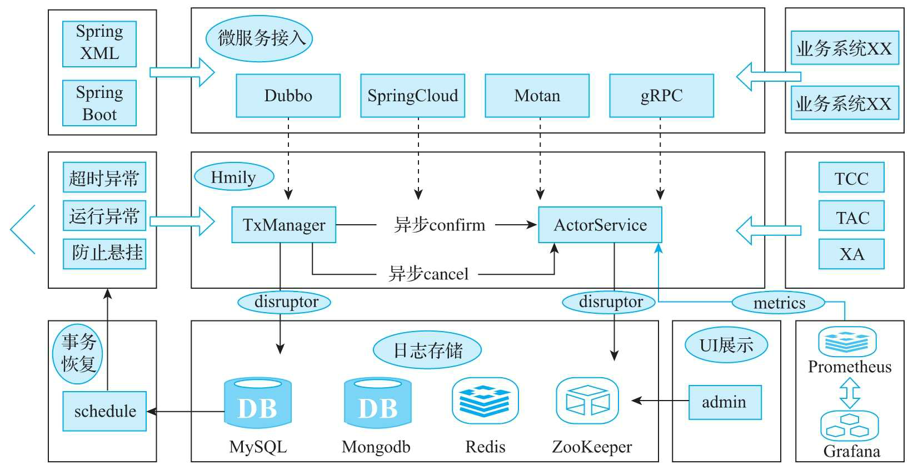{width="6.427890419947507in"
height="3.306654636920385in"}

> 图13-1　Hmily框架整体架构图
>
> Hmily框架中包含多种功能特性，如下所示。
>
> 1）高可靠性：支持分布式场景下，事务异常回滚，
> 超时异常恢复，防止事务悬挂。
>
> 541
>
> 2）易用性：提供零侵入性式的Spring-Boot、
> Spring-Namespace快速与业务系统集成。
>
> 3）高性能：去中心化设计，与业务系统完全融合， 天然支持集群部署。
>
> 4）可观测性：Metrics多项指标性能监控，以及 admin管理后台UI展示。
>
> 5）多种RPC：支持Dubbo、Spring Cloud、Motan、 BRPC、Tars等知名RPC框架。
>
> 6）日志存储：支持MySQL、Oracle、MongoDB、 Redis、ZooKeeper等方式。
>
> 7）复杂场景：支持RPC嵌套调用事务。
>
> 542
>
> 13.1.1　准备环境
>
> 因为Hmily是用Java语言开发的，所以要先安装JDK
> 环境。读者可自行安装JDK环境，笔者不再赘述。本地安
>
> 装、配置好Git以及Maven环境，准备一个MySQL数据库，
> 在数据库中执行以下业务建表脚本。
>
> CREATE DATABASE IF NOT EXISTS \'hmily_account\' DEFAULT CHARACTER SET
> utf8mb4 COLLATE utf8mb4_bin ;
>
> USE \'hmily_account\';
>
> DROP TABLE IF EXISTS \'account\';
>
> CREATE TABLE \'account\' (
>
> \'id\' bigint(20) NOT NULL AUTO_INCREMENT,
>
> \'user_id\' varchar(128) NOT NULL,
>
> \'balance\' decimal(10,0) NOT NULL COMMENT \'用户余额\',\
> \'freeze_amount\' decimal(10,0) NOT NULL COMMENT \'冻结金额，扣款
>
> 暂存余额\',
>
> \'create_time\' datetime NOT NULL,
>
> \'update_time\' datetime DEFAULT NULL,\
> PRIMARY KEY (\'id\')
>
> ) ENGINE=InnoDB AUTO_INCREMENT=2
>
> DEFAULT CHARSET=utf8mb4 COLLATE=utf8mb4_bin;
>
> insert into
> \'account\'(\'id\',\'user_id\',\'balance\',\'freeze_amount\',\'create_time\'
> , \'update_time\') values
>
> (1, \'10000\', 10000000, 0, \'2017-09-18 14:54:22\', NULL);
>
> CREATE DATABASE IF NOT EXISTS \'hmily_stock\' DEFAULT CHARACTER SET
> utf8mb4;
>
> USE \'hmily_stock\';
>
> DROP TABLE IF EXISTS \'inventory\';
>
> CREATE TABLE \'inventory\' (
>
> \'id\' bigint(20) NOT NULL AUTO_INCREMENT,
>
> 543
>
> \'product_id\' VARCHAR(128) NOT NULL,
>
> \'total_inventory\' int(10) NOT NULL COMMENT \'总库存\',
>
> \'lock_inventory\' int(10) NOT NULL COMMENT
>
> PRIMARY KEY (\'id\')
>
> ) ENGINE=InnoDB AUTO_INCREMENT=2
>
> DEFAULT CHARSET=utf8mb4 COLLATE=utf8mb4_bin;
>
> insert into

\'锁定库存\',

> \'inventory\'(\'id\',\'product_id\',\'total_inventory\',\'lock_inventory\'
> ) values
>
> (1,\'1\',10000000,0);
>
> CREATE DATABASE IF NOT EXISTS \'hmily_order\' DEFAULT CHARACTER SET
> utf8mb4;
>
> USE \'hmily_order\';
>
> DROP TABLE IF EXISTS \'order\';
>
> CREATE TABLE \'order\' (
>
> \'id\' bigint(20) NOT NULL AUTO_INCREMENT,
>
> \'create_time\' datetime NOT NULL,
>
> \'number\' varchar(20) COLLATE utf8mb4_bin NOT NULL,\
> \'status\' tinyint(4) NOT NULL,
>
> \'product_id\' varchar(128) NOT NULL,
>
> \'total_amount\' decimal(10,0) NOT NULL,
>
> \'count\' int(4) NOT NULL,
>
> \'user_id\' varchar(128) NOT NULL,
>
> PRIMARY KEY (\'id\')
>
> ) ENGINE=InnoDB DEFAULT CHARSET=utf8mb4 COLLATE=utf8mb4_bin;
>
> 以上SQL语句中，主要完成了如下逻辑处理。
>
> 1）创建Hmily库，用来配置事务日志的存储(后面配
> 置会用到)。创建账户业务库和账户业务表account。创
> 建库存业务库和库存业务表invertory。
>
> 2）创建订单业务库，并创建订单业务表order。
>
> 544
>
> 13.1.2　下载源码并编译
>
> 这里采用拉取源码的方式构建环境，源码中包含了
> 各种RPC框架的分布式事务场景示例。
>
> git clone <https://github.com/dromara/hmily.git> cd hmily
>
> mvn -DskipTests clean install --U
>
> 使用开发工具打开项目代码。
>
> 545
>
> 13.1.3　修改配置
>
> 本章的示例环境，RPC选取的是Spring Cloud，因此 进入如图13-2所示的目录。
>
> 546

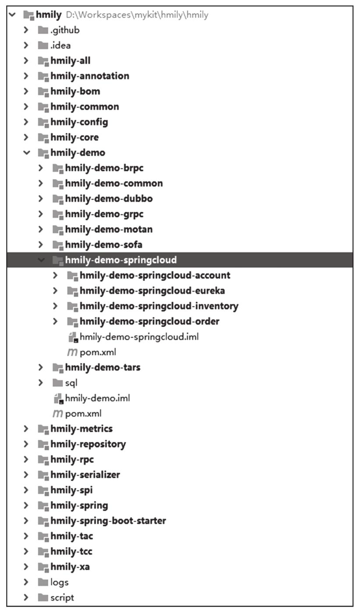{width="5.270833333333333in" height="9.0in"}

> 547
>
> 图13-2　Hmily框架中Spring Cloud相关的示例
>
> Hmily-TCC分布式事务场景的具体搭建步骤如下所
>
> 示。
>
> 第一步：在hmily-demo-tcc-springcloud-account
> 项目中修改application.yaml文件中的业务数据库连 接，代码如下所示。
>
> spring:\
> datasource:
>
> driver-class-name: com.mysql.jdbc.Driver
>
> url: jdbc:mysql:/你的ip:你的端口/hmily_account?
>
> useUnicode=true&characterEncoding=utf8
>
> username: 你的用户名
>
> password: 你的密码
>
> 第二步：在hmily-demo-tcc-springcloud-account
> 项目中修改hmily.yaml文件中事务日志存储的数据库连
> 接（本章我们采用本地配置模式，事务日志存储使用
>
> MySQL），代码如下所示。
>
> repository:\
> database:
>
> driverClassName: com.mysql.jdbc.Driver
>
> url: jdbc:mysql://你的数据库ip:你的数据库端口/hmily?
>
> useUnicode=true&characterEncoding=utf8
>
> username: 你的用户名
>
> password: 你的密码
>
> maxActive: 20
>
> minIdle: 10
>
> connectionTimeout: 30000\
> idleTimeout: 600000
>
> maxLifetime: 1800000
>
> 548
>
> 第三步：在hmily-demo-tcc-springcloud-
> inventory项目配置中修改application.yaml文件中的业
>
> 务数据库连接，代码如下所示。
>
> spring:\
> datasource:
>
> driver-class-name: com.mysql.jdbc.Driver\
> url: jdbc:mysql:/你的ip:你的端口/hmily_stock?
>
> useUnicode=true&characterEncoding=utf8
>
> username: 你的用户名
>
> password: 你的密码
>
> 第四步：在hmily-demo-tcc-springcloud-
> inventory项目配置中修改hmily.yaml文件中事务日志存
>
> 储的数据库连接（本章我们采用本地配置模式，事务日
> 志存储使用MySQL），代码如下所示。
>
> repository:\
> database:
>
> driverClassName: com.mysql.jdbc.Driver
>
> url : jdbc:mysql://你的数据库ip:你的数据库端口/hmily?
>
> useUnicode=true&characterEncoding=utf8
>
> username: 你的用户名
>
> password: 你的密码
>
> maxActive: 20
>
> minIdle: 10
>
> connectionTimeout: 30000\
> idleTimeout: 600000
>
> maxLifetime: 1800000
>
> 第五步：在hmily-demo-tcc-springcloud-order项
> 目中修改application.yaml文件中的业务数据库连接， 代码如下所示。
>
> 549
>
> spring:\
> datasource:
>
> driver-class-name: com.mysql.jdbc.Driver\
> url: jdbc:mysql:/你的ip:你的端口/hmily_order?
>
> useUnicode=true&characterEncoding=utf8
>
> username: 你的用户名
>
> password: 你的密码
>
> 第六步：在hmily-demo-tcc-springcloud-order项
> 目中修改hmily.yaml文件中事务日志存储的数据库连接
> （本章我们采用本地配置模式，事务日志存储使用
>
> MySQL），代码如下所示。
>
> repository:\
> database:
>
> driverClassName: com.mysql.jdbc.Driver
>
> url: jdbc:mysql://你的数据库ip:你的数据库端口/hmily?
>
> useUnicode=true&characterEncoding=utf8
>
> username: 你的用户名
>
> password: 你的密码
>
> maxActive: 20
>
> minIdle: 10
>
> connectionTimeout: 30000\
> idleTimeout: 600000
>
> maxLifetime: 1800000
>
> 550
>
> 13.1.4　启动程序
>
> 由于微服务示例程序使用的Spring Cloud框架需要
> 一个注册中心，示例中自带了一个Spring Cloud的注册
> 中心程序，因此按照如下步骤即可启动Hmily框架中的
>
> Spring Cloud示例程序。
>
> 第一步：启动hmily-demo-tcc-springcloud-eureka
> 项目中的EurekaServerApplication类，启动eureka注册 中心。
>
> 第二步：启动hmily-demo-tcc-springcloud-
> account项目中的SpringCloudHmilyAccountApplication
>
> 类，启动账户业务服务。
>
> 第三步：启动hmily-demo-tcc-springcloud- inventory项目中的
> SpringCloudHmilyInventoryApplication类，启动库存 业务服务。
>
> 第四步：启动hmily-demo-tcc-springcloud-order
> 项目中的SpringCloudHmilyOrderApplication类，启动 订单业务服务。
>
> 551
>
> 13.1.5　验证
>
> 程序的验证方式比较简单，在浏览器地址栏访问
> <http://127.0.0.1:8090/swagger-ui.html>[。](http://127.0.0.1:8090/swagger-ui.html。)
>
> 执行/order/orderPay接口，若返回成功，证明环境 搭建完成。
>
> 552
>
> 13.2　Hmily框架初始流程源码解析
>
> 本节主要讲解Hmily分布式事务框架的初始化过程。
> 在13.1节的示例中，启动微服务程序。在pom.xml文件里
> 面，依赖了如下JAR包。
>
> \<dependency\>\
> \<groupId\>org.dromara\</groupId\>
>
> \<artifactId\>hmily-spring-boot-starter- springcloud\</artifactId\>
>
> \<version\>\${project.version}\</version\> \</dependency\>
>
> Hmily框架会随着应用程序的启动而启动，通过
> spring-boot-starter包我们能很容易地找到它的初始化
>
> 类HmilyAutoConfiguration，其源码如下所示。
>
> \@Configuration\
> \@EnableAspectJAutoProxy(proxyTargetClass = true)\
> public class HmilyAutoConfiguration {
>
> \@Bean
>
> public SpringHmilyTransactionAspect hmilyTransactionAspect()\
> {
>
> return new SpringHmilyTransactionAspect();\
> }
>
> \@Bean
>
> \@ConditionalOnProperty(value =\
> \"hmily.support.rpc.annotation\", havingValue = \"true\")
>
> public BeanPostProcessor\
> refererAnnotationBeanPostProcessor() {
>
> return new RefererAnnotationBeanPostProcessor();\
> }
>
> \@Bean
>
> \@Qualifier(\"hmilyTransactionBootstrap\")\
> \@Primary
>
> 553
>
> public HmilyApplicationContextAware hmilyTransactionBootstrap() {
>
> return new HmilyApplicationContextAware();\
> }
>
> }
>
> 在HmilyAutoConfiguration类中，共初始化了3个
> Spring的Bean实例，作用分别如下所示。
>
> 1）SpringHmilyTransactionAspect：处理添加 \@HmlyTCC注解的切面入口。
>
> 2）RefererAnnotationBeanPostProcessor：为了支
> 持使用注解调用的RPC框架。
>
> 3）HmilyApplicationContextAware：框架启动初始 化类。
>
> HmilyApplicationContextAware源码如下所示。
>
> public class HmilyApplicationContextAware
>
> implements ApplicationContextAware, BeanFactoryPostProcessor {
>
> \@Override
>
> public void setApplicationContext(@NonNull final ApplicationContext
> applicationContext) throws BeansException {
>
> SpringBeanUtils.INSTANCE.setCfgContext((ConfigurableApplicationC
> ontext) applicationContext);
>
> SingletonHolder.INST.register(ObjectProvide.class, new
> SpringBeanProvide());
>
> }
>
> \@Override
>
> public void postProcessBeanFactory(@NonNull final
> ConfigurableListable-BeanFactory beanFactory) throws BeansException {
>
> HmilyBootstrap.getInstance().start();
>
> 554
>
> }\
> }
>
> 这里重点关注 HmilyBootstrap.getInstance().start()方法，从类名
>
> 和方法名应该能猜到其是整个框架的初始化入口，代码 如下所示。
>
> public void start() {
>
> try {
>
> ConfigLoaderServer.load();\
> HmilyConfig hmilyConfig =
>
> ConfigEnv.getInstance().getConfig(HmilyConfig.class);
>
> check(hmilyConfig);
>
> registerProvide();
>
> loadHmilyRepository(hmilyConfig);\
> registerAutoCloseable(new
>
> HmilyTransactionSelfRecoveryScheduled(),
> HmilyRepositoryEventPublisher.getInstance());
>
> initMetrics();
>
> } catch (Exception e) {
>
> LOGGER.error(\" hmily init exception:\", e);
>
> System.exit(0);
>
> }
>
> new HmilyLogo().logo();
>
> }
>
> HmilyBootstrap.getInstance().start()方法主要 包括5个步骤，如下所示。
>
> 第一步：ConfigLoaderServer.load()：加载框架的 配置。
>
> 第二步：registerProvide()：注册对象的提供者，
> 默认使用发射方式获取，如果是Spring环境，则通过 Spring
> Bean的代理方式获取。
>
> 555
>
> 第三步：loadHmilyRepository(hmilyConfig)：初
> 始化事务日志资源，后面章节重点介绍。
>
> 第四步：registerAutoCloseable(new
> HmilyTransactionSelfRecoveryScheduled()，
>
> HmilyRepositoryEventPublisher.getInstance())：初
> 始化事务恢复调度和事件分发器并注册关闭资源接口。
>
> 第五步：initMetrics()：初始化metrics监控信
>
> 息。
>
> 556
>
> 13.2.1　加载配置
>
> 配置文件是一个框架中最重要的组成部分。框架的性
> 能优化、控制开关等重要信息，都是通过配置文件进行控
> 制的。因此如何加载配置，从哪里加载配置就变得尤为关
> 键。Hmily提供了6种加载配置的方式，分别是本地模式、
> ZooKeeper注册中心、Nacos配置中心、Apollo配置中心、
> ETCD注册中心和Consul注册中心。接下来，我们深入分析
> Hmily框架涉及的这些逻辑的代码。
>
> 进入ConfigLoaderServer.load()方法，源码如下所
>
> 示。
>
> \@Slf4j
>
> public class ConfigLoaderServer {
>
> public static void load() {
>
> //

扫描所有的配置bean案例

> ConfigScan.scan
>
> //new ServerConfigLoade

();

r进行加载

> ServerConfigLoader loader = new ServerConfigLoader();\
> loader.load(ConfigLoader.Context::new, (context, config)
>
> -\> {
>
> if (config != null) {
>
> if
>
> (StringUtils.isNotBlank(config.getConfigMode())) {
>
> String configMode = config.getConfigMode();
>
> ConfigLoader\<?\> configLoader =
>
> ExtensionLoaderFactory.load(ConfigLoader.class, configMode);
>
> log.info(\"Load the configuration
>
> information\...\", configMode);

【{}】

> configLoader.load(context, (contextAfter,
>
> configAfter) -\> {
>
> log.info(\"Configuration information: {}\",
>
> configAfter);
>
> });
>
> }
>
> 557
>
> }
>
> });
>
> }\
> }
>
> 首先来分析ConfigScan.scan()方法，它的作用是使
> 用SPI的方式加载所有实现了Config接口的配置类并缓 存，代码如下所示。
>
> public final class ConfigScan {
>
> public static void scan() {\
> //采用SPI的方式加载所有实现Config接口的配置类
>
> List\<Config\> configs =
>
> ExtensionLoaderFactory.loadAll(Config.class); for (Config conf :
> configs) {
>
> //
>
> }

将配置类进行注册缓存

> ConfigEnv.getInstance().registerConfig(conf);
>
> }
>
> }

接下来，看一下实现Config接口的配置类，实现类如

> 图13-3所示。

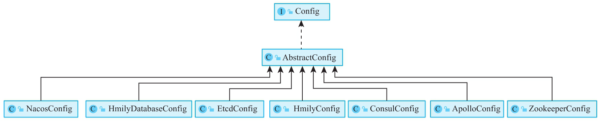{width="6.427891513560805in"
height="1.3082403762029746in"}

> 图13-3　Config接口的实现关系图
>
> 再来分析ServerConfigLoader.load()方法，它的作
> 用是加载hmily.server前缀的配置，其核心代码如下所 示。
>
> 558
>
> public class ServerConfigLoader implements ConfigLoader\<HmilyServer\>
> {
>
> private final YamlPropertyLoader propertyLoader = new
> YamlPropertyLoader();
>
> \@Override
>
> public void load(final Supplier\<Context\> context, final
> LoaderHandler\<HmilyServer\> handler) {
>
> String filePath = System.getProperty(\"hmily.conf\");\
> File configFile;
>
> if (StringUtils.isBlank(filePath)) {\
> String dirPath = getDirGlobal();
>
> configFile = new File(dirPath);
>
> if (configFile.exists()) {
>
> filePath = dirPath;
>
> } else {
>
> //Mainly used for development environment。
>
> ClassLoader loader =
>
> ConfigLoader.class.getClassLoader();
>
> URL url = loader.getResource(\"hmily.yml\");
>
> if (url != null) {
>
> filePath = url.getFile();
>
> configFile = new File(filePath);
>
> } else {
>
> throw new
>
> ConfigException(\"ConfigLoader:loader config error,error file
> path:\" + filePath);
>
> }
>
> }
>
> } else {
>
> configFile = new File(filePath);
>
> if (!configFile.exists()) {
>
> throw new ConfigException(\"ConfigLoader:loader
>
> config error,error file path:\" + filePath);
>
> }
>
> }
>
> try (FileInputStream inputStream = new FileInputStream(configFile)) {\
> //使用YAML属性加载流
>
> List\<PropertyKeySource\<?\>\> propertyKeySources =
> propertyLoader.load(filePath, inputStream);\
> //默认实现OriginalConfigLoader先去加载
>
> OriginalConfigLoader original = new
>
> OriginalConfigLoader();\
> //先加载HmilyServer配置类，再加载属性配置
>
> againLoad(() -\>
>
> context.get().with(propertyKeySources, original), handler,
> HmilyServer.class);
>
> } catch (IOException e) {
>
> 559
>
> throw new ConfigException(\"ConfigLoader:loader config\
> error,file path:\" + filePath);
>
> }
>
> }
>
> private String getDirGlobal() {
>
> String userDir = System.getProperty(\"user.dir\");
>
> String fileName = \"hmily.yml\";
>
> return String.join(String.valueOf(File.separatorChar),
>
> userDir, fileName);
>
> }
>
> 核心逻辑为加载hmily.yml配置文件，加载优先级别
> 为Dhmily.conf→user.dir→resource。首先调用
> againLoad()方法，将YAML配置文件转换成HmilyServer配
> 置类，源码如下所示。
>
> default void againLoad(final Supplier\<Context\> context, final
> LoaderHandler\<T\> handler, final Class\<T\> tClass) {
>
> T config = ConfigEnv.getInstance().getConfig(tClass);\
> for (PropertyKeySource\<?\> propertyKeySource :
>
> context.get().getSource()) {
>
> ConfigPropertySource configPropertySource =
>
> new DefaultConfigPropertySource\<\>(propertyKeySource,
> PropertyKeyParse.INSTANCE);
>
> Binder binder = Binder.of(configPropertySource);\
> //进行属性绑定
>
> T newConfig = binder.bind(config.prefix(),
> BindData.of(DataType.of(tClass), () -\> config));
>
> //
>
> }

回调进行属性加载或者自定义处理

> handler.finish(context, newConfig);
>
> }

最后使用handler.finish(context,newConfig)回调

> 方法，完成配置的加载。
>
> 继续分析load()回调方法的实现，代码如下所示。
>
> 560
>
> loader.load(ConfigLoader.Context::new, (context, config) -\> {
>
> if (config != null) {
>
> if (StringUtils.isNotBlank(config.getConfigMode())) {
>
> String configMode = config.getConfigMode();\
> //根据模式获取 SPI接口的具体实现
>
> ConfigLoader\<?\> configLoader =
>
> ExtensionLoaderFactory.load(ConfigLoader.class, configMode);
>
> log.info(\"Load the configuration
>
> configMode);

【{}】information\...\",

> //

进行配置属性的加载

> configLoader.load(context, (contextAfter,\
> configAfter) -\> {
>
> log.info(\"Configuration information: {}\",
>
> configAfter);\
> });
>
> }
>
> }\
> });
>
> 首先获取配置模式，然后根据配置模式获取具体的实
> 现类，这里的实现类有Apoll oConfigLoader、
> ConsulConfigLoader、LocalConfigLoader、
> ZooKeeperConfigLoader、NacosConfigLoader，最后加载
> 实现类。这里使用本地模式，会进入
> org.dromara.hmily.config.loader.OriginalConfigLoad
> er的load()方法，核心代码如下所示。
>
> public class OriginalConfigLoader implements ConfigLoader\<Config\> {
>
> \@Override
>
> public void load(final Supplier\<Context\> context, final
> LoaderHandler\<Config\> handler) {
>
> for (PropertyKeySource\<?\> propertyKeySource :
> context.get().getSource()) {
>
> ConfigPropertySource configPropertySource =\
> new DefaultConfigPropertySource\<\>(propertyKeySource,
> PropertyKeyParse.INSTANCE);
>
> ConfigEnv.getInstance().stream()
>
> .filter(e -\> !e.isLoad())
>
> .map(e -\> {
>
> //进行属性匹配前缀绑定
>
> Config config = getBind(e,
>
> 561
>
> configPropertySource);
>
> if (config != null) {
>
> \@SuppressWarnings(\"unchecked\")
>
> Map\<String, Object\> source =
>
> (Map\<String, Object\>) propertyKeySource.getSource();\
> config.setSource(source);
>
> }
>
> return config;
>
> }).filter(Objects::nonNull).peek(Config::flagLoad)
>
> .forEach(e -\> handler.finish(context, e));
>
> }
>
> }
>
> \@Override
>
> public void passive(final Supplier\<Context\> context, final
> PassiveHandler\<Config\> handler, final Config config) {
>
> for (PropertyKeySource\<?\> propertyKeySource :
> context.get().getSource()) {
>
> ConfigPropertySource configPropertySource =\
> new DefaultConfigPropertySource\<\>(propertyKeySource,
> PropertyKeyParse.INSTANCE);
>
> Config bindConfig = getBind(config,
>
> configPropertySource);
>
> if (bindConfig != null) {
>
> \@SuppressWarnings(\"unchecked\")
>
> Map\<String, Object\> source =
>
> (Map\<String, Object\>) propertyKeySource.getSource();
>
> Optional.ofNullable(config.getSource()).ifPresent(e -\> {
>
> e.putAll(source);
>
> });
>
> }
>
> Optional.ofNullable(bindConfig).ifPresent(e -\>
> handler.passive(context, e));
>
> }
>
> }
>
> private Config getBind(final Config config, final ConfigPropertySource
> configPropertySource) {
>
> Binder binder = Binder.of(configPropertySource);\
> //属性配置绑定成javabean的属性
>
> return binder.bind(config.prefix(),
> BindData.of(DataType.of(config.getClass()), () -\> config));
>
> }
>
> 562
>
> 上述代码的核心思想是根据加载的YAML配置文件，与
> 实现config接口的Javabean进行前缀匹配，然后进行属性
> 绑定。其他的加载方式同理，可以具体看里面的实现，这 里就不一一展开了。
>
> 563
>
> 13.2.2　初始化事务日志存储
>
> 对于分布式事务来说，事务日志至关重要，采用本地
> 存储还是中心化存储由用户决定。目前Hmily支持同步和
> 异步2种方式来存储日志。在事务日志的存储上，Hmily支
> 持File、Redis、ZooKeeper、MySQL、Oracle、
> PostgreSQL、SQLServer、ETCD、MongoDB等多种模式来存
> 储日志，对应的模块为hmily-repository，本节主要讲解
> 采用MySQL来存储事务日志。首先我们来看Hmily事务日志
> 存储的架构如图13-4所示。
>
> TCC事务日志的结构主要由HmilyTransaction、
> HmilyParticipant和HmilyInvocation类组成。
>
> HmilyTransaction是主事务实体类，包含多个
> HmilyParticipant，源码如下所示。
>
> \@Data
>
> public class HmilyTransaction implements Serializable {
>
> private static final long serialVersionUID =\
> -6792063780987394917L;
>
> private Long transId;
>
> private String appName;
>
> private int status;
>
> private String transType;
>
> private Integer retry = 0;
>
> private Integer version = 1;
>
> 564
>
> private Date createTime;
>
> private Date updateTime;
>
> private List\<HmilyParticipant\> hmilyParticipants;

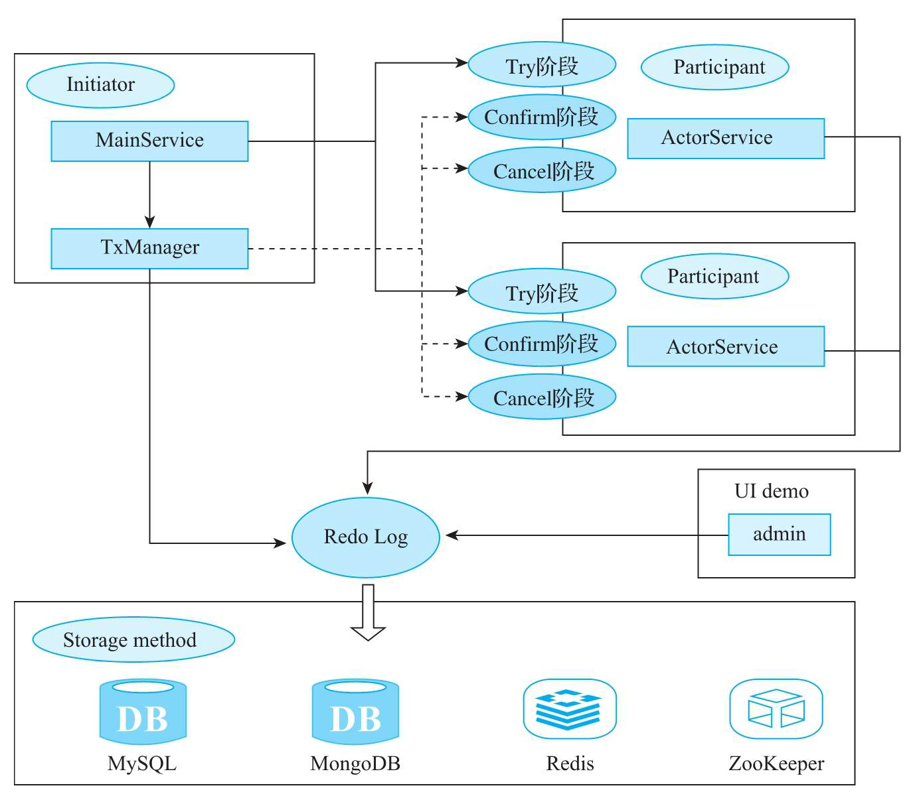{width="6.427890419947507in"
height="5.655307305336833in"}

> 图13-4　Hmily事务日志存储的架构
>
> HmilyParticipant是分支事务的实体类，包含多个
> HmilyInvocation，源码如下所示。
>
> \@Data \@EqualsAndHashCode
>
> 565
>
> public class HmilyParticipant implements Serializable {
>
> private static final long serialVersionUID =\
> -2590970715288987627L;
>
> private Long participantId;
>
> private Long participantRefId;
>
> private Long transId;
>
> private String transType;
>
> private Integer status;
>
> private String appName;
>
> private int role;
>
> private int retry;
>
> private String targetClass;
>
> private String targetMethod;
>
> private String confirmMethod;
>
> private String cancelMethod;
>
> private Integer version = 1;
>
> private Date createTime;
>
> private Date updateTime;
>
> private HmilyInvocation confirmHmilyInvocation;
>
> private HmilyInvocation cancelHmilyInvocation;
>
> HmilyInvocation是事务方法的参数列表实体类，源 码如下所示。
>
> \@Data
>
> \@AllArgsConstructor
>
> \@NoArgsConstructor
>
> public class HmilyInvocation implements Serializable {
>
> 566
>
> private static final long serialVersionUID =\
> -5108578223428529356L;
>
> \@Getter
>
> private Class\<?\> targetClass;
>
> \@Getter
>
> private String methodName;
>
> \@Getter
>
> private Class\<?\>\[\] parameterTypes;
>
> \@Getter
>
> private Object\[\] args;\
> }
>
> 分析完事务日志的存储结构，再来看事务日志的初始
> 化方法loadHmilyRepository(hmily-Config)，源码如下 所示。
>
> private void loadHmilyRepository(final HmilyConfig hmilyConfig) {
>
> HmilySerializer hmilySerializer =
> ExtensionLoaderFactory.load(HmilySerializer.class,
>
> hmilyConfig.getSerializer());\
> HmilyRepository hmilyRepository =
>
> ExtensionLoaderFactory.load(HmilyRepository.class,
> hmilyConfig.getRepository());
>
> hmilyRepository.setSerializer(hmilySerializer);\
> hmilyRepository.init(buildAppName(hmilyConfig));
>
> HmilyRepositoryFacade.getInstance().setHmilyRepository(hmilyRepos
> itory);
>
> }
>
> 在loadHmilyRepository(hmilyConfig)方法中，通过
> SPI的方式加载属性，具体步骤如下所示。
>
> 第一步：SPI方式获取配置的序列化方式，其对应配
> 置属性为hmily.config.serializer。
>
> 567
>
> 第二步：SPI方式获取配置的事务日志存储，其对应
> 配置属性为hmily.config.repository=mysql。
>
> 执行init()方法进行初始化。因为我们配置的框架为 MySQL，所以会进入
> org.dromara.hmily.repository.database.manager.Abst
> ractHmilyDatabase.init()方法，代码如下所示。
>
> \@Override
>
> public void init(final String appName) {
>
> this.appName = appName;\
> try {
>
> //获取数据库配置
>
> HmilyDatabaseConfig hmilyDatabaseConfig =
>
> ConfigEnv.getInstance().getConfig(HmilyDatabaseConfig.class);\
> //初始化数据库连接池
>
> HikariDataSource hikariDataSource = new\
> HikariDataSource();
>
> hikariDataSource.setJdbcUrl(hmilyDatabaseConfig.getUrl());
>
> hikariDataSource.setDriverClassName(hmilyDatabaseConfig.getDriver
> Class Name());
>
> hikariDataSource.setUsername(hmilyDatabaseConfig.getUsername());
>
> hikariDataSource.setPassword(hmilyDatabaseConfig.getPassword());
>
> hikariDataSource.setMaximumPoolSize(hmilyDatabaseConfig.getMaxAct
> ive());
>
> hikariDataSource.setMinimumIdle(hmilyDatabaseConfig.getMinIdle()) ;
>
> hikariDataSource.setConnectionTimeout(hmilyDatabaseConfig.getConn
> ectionTimeout());
>
> hikariDataSource.setIdleTimeout(hmilyDatabaseConfig.getIdleTimeou
> t());
>
> hikariDataSource.setMaxLifetime(hmilyDatabaseConfig.getMaxLifetim
> e());
>
> hikariDataSource.setConnectionTestQuery(hmilyDatabaseConfig.getCo
> nnectionTest Query());
>
> 568
>
> if (hmilyDatabaseConfig.getPropertyMap() != null\
> && !hmilyDatabaseConfig.getPropertyMap().isEmpty()) {
>
> hmilyDatabaseConfig.getPropertyMap().forEach(hikariDataSource::ad
> dDataSourceProperty);
>
> }
>
> HmilyConfig hmilyConfig =
> ConfigEnv.getInstance().getConfig(HmilyConfig.class);
>
> this.dataSource = hikariDataSource;
>
> //
>
> //

是否自定执行脚本，默认是true

> if (hmilyConfig.isAutoSql()) {

执行初始化脚本

> this.initScript(hmilyDatabaseConfig);
>
> }
>
> } catch (Exception e) {
>
> log.error(\"hmily jdbc log init exception please check
>
> config:{}\", e. getMessage());
>
> throw new HmilyRuntimeException(e.getMessage());\
> }
>
> }
>
> this.initScript(hmilyDatabaseConfig)是一个抽象
> 的方法，这里配置的是MySQL，因此进入
> org.dromara.hmily.repository.database.mysql.MysqlR
> epository，源码如下所示。
>
> \@Override
>
> protected void initScript(final HmilyDatabaseConfig config) throws
> Exception {
>
> //替换链接中的hmily库
>
> String jdbcUrl = StringUtils.replace(config.getUrl(), \"/hmily\",
> \"/\");
>
> //获取连接
>
> Connection conn = DriverManager.getConnection(jdbcUrl,
> config.getUsername(), config.getPassword());
>
> ScriptRunner runner = new ScriptRunner(conn);\
> runner.setLogWriter(null);\
> runner.setAutoCommit(false);\
> Resources.setCharset(StandardCharsets.UTF_8);
>
> //
>
> //

加载resource/mysql下的schema.sql脚本

> Reader read = Resources.getResourceAsReader(SQL_FILE_PATH);

执行脚本

> runner.runScript(read);
>
> conn.commit();
>
> 569
>
> runner.closeConnection();
>
> conn.close();
>
> }
>
> resource/mysql下的schema.sql脚本内容如下所示。
>
> //如果没hmily库会自动创建
>
> CREATE DATABASE IF NOT EXISTS \'hmily\' DEFAULT CHARACTER SET utf8mb4
> COLLATE utf8mb4_unicode_ci ;
>
> USE \'hmily\';
>
> create table if not exists \'hmily_transaction_global\'
>
> (
>
> \'trans_id\'
>
> primary key,

bigint(20)

not null comment

\'全局事务id\'

> \'app_name\'

varchar(128) not null comment

\'应用名称\',

> \'status\'
>
> \'trans_type\'

tinyint

varchar(16)

not null comment not null comment

\'事务状态\',

\'事务模式\',

> 数\',

\'retry\'

int

default 0 not null comment \'

重试次

> \'version\'
>
> \'create_time\'

int

datetime

not null comment not null comment

\'版本号\',

\'创建时间\',

> \'update_time\' datetime
>
> ON UPDATE
>
> CURRENT_TIMESTAMP comment \'
>
> ) ENGINE = InnoDB
>
> not null DEFAULT CURRENT_TIMESTAMP

更新时间\'

> DEFAULT CHARSET = utf8mb4
>
> COLLATE = utf8mb4_unicode_ci comment \'hmily事务表（发起者）\';
>
> create table if not exists \'hmily_transaction_participant\'
>
> (
>
> \'participant_id\' 务id\' primary key,

bigint(20)

not null comment \'

参与者事

> \'participant_ref_id\' bigint(20)
>
> 联id且套调用时候会存在\',

comment \'

参与者关

> id\',
>
> 型\',

\'trans_id\'

\'trans_type\'

bigint(20)

varchar(16)

not null comment \'

not null comment \'

全局事务

事务类

> \'status\'
>
> 状态\',
>
> \'app_name\'

tinyint

varchar(64)

not null comment \'

not null comment \'

分支事务

应用名

> 称\',
>
> 色\',

\'role\'

tinyint

not null comment \'

事务角

> \'retry\'

int default 0 not null comment \'

> 570

重试次

> 数\',
>
> 称\',

\'target_class\'

varchar(512)

null comment \'

接口名

> \'target_method\' 名称\',

varchar(128)

null comment \'

接口方法

> \'confirm_method\'
>
> 方法名称\',

varchar(128)

null comment \'confirm

> \'cancel_method\'
>
> 法名称\',

varchar(128)

null comment \'cancel

方

> \'confirm_invocation\' longblob
>
> 调用点\',

null comment \'confirm

> \'cancel_invocation\'
>
> 用点\',

longblob

null comment \'cancel

调

> \'version\'

int default 0 not null,

> 间\',

\'create_time\'

> datetime

not null comment \'

创建时

> \'update_time\'
>
> CURRENT_TIMESTAMP ON

datetime

not null DEFAULT

> UPDATE CURRENT_TIMESTAMP comment \'
>
> ) ENGINE = InnoDB

更新时间\'

> DEFAULT CHARSET = utf8mb4
>
> COLLATE = utf8mb4_unicode_ci comment \'hmily事务参与者\';
>
> 其他事务日志存储也是一样的模式，这里就不一一展
> 开了，感兴趣的读者可以自行阅读Hmily源码，笔者不再 赘述。
>
> 571
>
> 13.2.3　初始化事务恢复调度器
>
> 事务恢复是框架的核心功能之一，Hmily框架采用定
> 时任务的方式进行事务恢复，根据new
> HmilyTransactionSelfRecoveryScheduled()方法进行初 始化，源码如下所示。
>
> public HmilyTransactionSelfRecoveryScheduled() {
>
> hmilyRepository = ExtensionLoaderFactory.load(HmilyRepository.class,
>
> hmilyConfig.getRepository());\
> //new tcc事务恢复单线程池
>
> this.selfTccRecoveryExecutor =\
> new ScheduledThreadPoolExecutor(1,
> HmilyThreadFactory.create(\"hmily-tcc-self-recovery\", true));
>
> this.selfTacRecoveryExecutor =\
> new ScheduledThreadPoolExecutor(1,
> HmilyThreadFactory.create(\"hmily-tac-self-recovery\", true));
>
> //new事务日志清理线程池\
> this.cleanHmilyTransactionExecutor =
>
> new ScheduledThreadPoolExecutor(1,
> HmilyThreadFactory.create(\"hmily-transaction-clean\", true));
>
> hmilyTransactionRecoveryService = new
> HmilyTransactionRecoveryService();\
> //进行TCC事务恢复
>
> selfTccRecovery();\
> selfTacRecovery();
>
> //清理无用的事务日志\
> cleanHmilyTransaction();
>
> //删除过期的日志\
> phyDeleted();
>
> }
>
> 572
>
> 13.2.4　初始化事件分发器
>
> Hmily采用高性能队列disruptor进行事务日志的异
> 步存储，根据HmilyRepository-
> EventPublisher.getInstance()方法进行初始化，核心 代码如下所示。
>
> public final class HmilyRepositoryEventPublisher implements
> AutoCloseable {
>
> private static final HmilyRepositoryEventPublisher INSTANCE\
> =
>
> new HmilyRepositoryEventPublisher();
>
> private HmilyDisruptor\<HmilyRepositoryEvent\> disruptor;
>
> private final HmilyConfig hmilyConfig =
> ConfigEnv.getInstance().getConfig(Hmily Config.class);
>
> private HmilyRepositoryEventPublisher() {
>
> start();
>
> }
>
> public static HmilyRepositoryEventPublisher getInstance() {
>
> return INSTANCE;
>
> }
>
> private void start() {
>
> List\<SingletonExecutor\> selects = new ArrayList\<\>();
>
> for (int i = 0; i \< hmilyConfig.getConsumerThreads();\
> i++) {
>
> selects.add(new SingletonExecutor(\"hmily-log-\
> disruptor\" + i));
>
> }
>
> //new根据事务id一致性哈希的线程选择器\
> ConsistentHashSelector selector = new
>
> ConsistentHashSelector(selects);\
> //创建disruptor
>
> disruptor =
>
> new HmilyDisruptor\<\>(
>
> new HmilyRepositoryEventConsumer(selector),
>
> 573
>
> 1, hmilyConfig.getBufferSize());\
> //进行启动
>
> disruptor.startup();
>
> }
>
> \@Override
>
> public void close() {\
> disruptor.getProvider().shutdown();
>
> }\
> }
>
> 这里重点分析disruptor.startup()方法，核心代码 如下所示。
>
> public void startup() {\
> //创建多生产者的消费队列
>
> Disruptor\<DataEvent\<T\>\> disruptor = new Disruptor\<\>(new
> DisruptorEvent Factory\<\>(),
>
> size,
>
> HmilyThreadFactory.create(\"disruptor_consumer\_\" +
> consumer.fixName(), false),
>
> ProducerType.MULTI,
>
> new BlockingWaitStrategy());
>
> //创建工作线程池
>
> HmilyDisruptorWorkHandler\<T\>\[\] workerPool =
>
> new HmilyDisruptorWorkHandler\[consumerSize\]; for (int i = 0; i \<
> consumerSize; i++) {
>
> workerPool\[i\] = new HmilyDisruptorWorkHandler\<\>\
> (consumer);
>
> }\
> disruptor.handleEventsWithWorkerPool(workerPool);
>
> //设置异常策略\
> disruptor.setDefaultExceptionHandler(new
>
> IgnoreExceptionHandler());\
> //启动
>
> disruptor.start();\
> RingBuffer\<DataEvent\<T\>\> ringBuffer =
>
> disruptor.getRingBuffer();
>
> provider = new DisruptorProvider\<\>(ringBuffer, disruptor);
>
> }
>
> 574
>
> 13.2.5　初始化Metrics监控信息
>
> Metrics信息主要是Hmily框架用来监控执行事务状
> 态的指标，目前的实现为Prome-theus，对应的模块为
> hmily-metrics。Metrics主要分为两个部分。
>
> 1）应用的JVM信息：内存、CPU、线程使用等。
>
> 2）事务信息：包括事务的总数、事务的迟延时间、
> 事务的状态、事务执行成功的数量、事务执行失败的数 量等。
>
> 根据HmilyBootstrap里面的initMetrics()方法初始
> 化metrics，源码如下所示。
>
> private void initMetrics() {\
> HmilyMetricsConfig metricsConfig =
>
> ConfigEnv.getInstance().getConfig(HmilyMetrics Config.class);\
> //是否配置了metrics，如果有配置才进行初始化
>
> if (Objects.nonNull(metricsConfig) &&
> StringUtils.isNoneBlank(metricsConfig.get MetricsName())) {
>
> MetricsTrackerFacade facade = new MetricsTrackerFacade();
>
> //进行初始化
>
> facade.start(metricsConfig);\
> registerAutoCloseable(facade);
>
> }\
> }
>
> 接下来，重点分析facade.start(metricsConfig)方 法，源码如下所示。
>
> 575
>
> public void start(final HmilyMetricsConfig metricsConfig) {
>
> if (this.isStarted.compareAndSet(false, true)) {\
> //SPI的方式获取启动类，目前只支持Promethues
>
> metricsBootService = ExtensionLoaderFactory.
> load(MetricsBootService.class, metricsConfig.getMetricsName());
>
> Preconditions.checkNotNull(metricsBootService,
>
> \"Can not find metrics tracker manager with
>
> metrics name : %s in metrics configuration.\",
> metricsConfig.getMetricsName());\
> //进行启动（metrics注册器目前也只支持Promethues）
>
> metricsBootService.start(metricsConfig,
> ExtensionLoaderFactory.load(Metrics\
> Register.class, metricsConfig.getMetricsName()));
>
> } else {
>
> log.info(\"metrics tracker has started !\");\
> }
>
> }
>
> 直接进入
>
> org.dromara.hmily.metrics.prometheus.service.Prom
> etheusBootService，源码如下所示。
>
> \@Getter
>
> \@Slf4j
>
> \@HmilySPI(\"prometheus\")
>
> public final class PrometheusBootService implements MetricsBootService
> {
>
> private HTTPServer server;
>
> private volatile AtomicBoolean registered = new AtomicBoolean(false);
>
> \@Override
>
> public void start(final HmilyMetricsConfig metricsConfig, final
> MetricsRegister register) {
>
> startServer(metricsConfig);\
> MetricsReporter.register(register);
>
> }
>
> \@Override
>
> public void stop() {
>
> if (server != null) {
>
> //关闭资源
>
> 576
>
> server.stop();
>
> registered.set(false);
>
> //清空注册器
>
> CollectorRegistry.defaultRegistry.clear();
>
> }
>
> }
>
> private void startServer(final HmilyMetricsConfig metricsConfig) {
>
> //注册metrics指标
>
> register(metricsConfig.getJmxConfig());
>
> int port = metricsConfig.getPort();
>
> String host = metricsConfig.getHost();\
> InetSocketAddress inetSocketAddress;
>
> if (null == host \|\| \"\".equalsIgnoreCase(host)) {
>
> inetSocketAddress = new InetSocketAddress(port);\
> } else {
>
> inetSocketAddress = new InetSocketAddress(host,\
> port);
>
> }
>
> try {
>
> //启动httpServer，这里开启了一个端口，Prometheus采用拉模式通过该端口获取
> metrics信息
>
> server = new HTTPServer(inetSocketAddress, CollectorRegistry.default
> Registry, true);
>
> log.info(String.format(\"Prometheus metrics HTTP\
> server \'%s:%s\' start success.\", inetSocketAddress.getHostString(),
> inetSocketAddress.getPort()));
>
> } catch (final IOException ex) {\
> log.error(\"Prometheus metrics HTTP server start
>
> fail\", ex);
>
> }
>
> }
>
> private void register(final String jmxConfig) {
>
> if (!registered.compareAndSet(false, true)) {
>
> return;
>
> }
>
> //注册JDK版本的metrics指标
>
> new BuildInfoCollector().register();
>
> //注册JVM参数的metrics指标\
> DefaultExports.initialize();
>
> try {
>
> if (StringUtils.isNotEmpty(jmxConfig)) {\
> //注册jmx metrics指标
>
> new JmxCollector(jmxConfig).register();
>
> }
>
> } catch (MalformedObjectNameException e) {\
> log.error(\"init jmx collector error\", e);
>
> 577
>
> }
>
> }
>
> 本节主要讲解了Hmily框架的初始化过程，加载配置
> 部分的代码相当精彩，很容易被函数式编程绕晕，由于
> 篇幅原因并没有非常详情的讲解，读者可以自行理解。
> 接着，我们介绍了最重要的事务日志，包括它的流程
> 图、日志结构以及初始化过程。最后讲解了事务恢复的
> 初始化过程、Metrics的初始化过程。
>
> 578
>
> 13.3　Hmily-TCC分布式事务源码解析
>
> 本节正式进入Hmily-TCC分布式事务流程的源码解
> 析，在13.1节已经构建好了Spring Cloud微服务分布式事
>
> [务的环境，访问http://127.0.0.1:8090/swagger-](http://127.0.0.1:8090/swagger-ui.html#!/order-controller/orderPayUsingPOST)
> [ui.html#!/order-controller/orderPayUsingPOST](http://127.0.0.1:8090/swagger-ui.html#!/order-controller/orderPayUsingPOST)[，模拟](http://127.0.0.1:8090/swagger-ui.html#!/order-controller/orderPayUsingPOST，模拟用户下单场景。其产生分布式事务场景图如图13-5所示。)
> [用户下单场景。其产生分布式事务场景图如图13-5所示。](http://127.0.0.1:8090/swagger-ui.html#!/order-controller/orderPayUsingPOST，模拟用户下单场景。其产生分布式事务场景图如图13-5所示。)

{width="6.427891513560805in"
height="3.914420384951881in"}

> 图13-5　用户下单产生分布式事务的场景
>
> 579
>
> 13.3.1　Try流程源码解析
>
> 根据上述请求接口，找到hmily-demo-tcc-
> springcloud-order模块下OrderController类
> 的/orderPay请求，代码如下所示。
>
> \@Override
>
> \@HmilyTCC(confirmMethod = \"confirmOrderStatus\", cancelMethod =
> \"cancelOrderStatus\")
>
> public void makePayment(Order order) {
>
> //更新本地数据库订单状态
>
> updateOrderStatus(order, OrderStatusEnum.PAYING);
>
> //RPC调用付款服务\
> accountClient.payment(buildAccountDTO(order));
>
> //RPC调用扣减库存服务\
> inventoryClient.decrease(buildInventoryDTO(order));
>
> }
>
> 这里可以发现在makePayment(Order)方法上标注了
> \@HmilyTCC注解，源码如下所示。
>
> \@Retention(RetentionPolicy.RUNTIME) \@Target(ElementType.METHOD)
>
> public \@interface HmilyTCC {
>
> /\*\*
>
> \* confirm方法名称
>
> \*/
>
> String confirmMethod() default \"\";
>
> /\*\*
>
> \* 取消方法名称
>
> \*/
>
> String cancelMethod() default \"\";
>
> /\*\*
>
> \* 模式
>
> 580
>
> \*/
>
> TransTypeEnum pattern() default TransTypeEnum.TCC;
>
> }
>
> 注意，Try、Confirm、Cancel方法的参数列表要一
>
> 致，上述makePayment方法为Try方法。
>
> \@HmilyTCC为Hmily框架处理TCC事务的切面，在初始 化流程里面初始化的new
> SpringHmilyTransactionAspect()切面，继承了
> AbstractHmilyTransactionAspect，源码如下所示。
>
> \@Aspect
>
> public abstract class AbstractHmilyTransactionAspect {
>
> private final HmilyTransactionInterceptor interceptor = new
> HmilyGlobalInterceptor();
>
> /\*\*
>
> \* 添加了如下注解的都会成为切点
>
> \* this is point cut with {@linkplain HmilyTCC }.\
> \*/
>
> \@Pointcut(\"@annotation(org.dromara.hmily.annotation.HmilyTCC)\
> \|\|
>
> \@annotation(org.dromara.hmily.annotation.HmilyTAC) \|\|\
> \@annotation(org.dromara.hmily.annotation.HmilyXA)\")\
> public void hmilyInterceptor() {
>
> }
>
> /\*\*
>
> \* this is around in {@linkplain HmilyTCC }.\
> \* 切面环绕执行
>
> \* \@param proceedingJoinPoint proceedingJoinPoint\
> \* \@return Object object
>
> \* \@throws Throwable Throwable
>
> \*/
>
> \@Around(\"hmilyInterceptor()\")
>
> public Object interceptTccMethod(final ProceedingJoinPoint
>
> proceedingJoinPoint) throws Throwable {
>
> return interceptor.invoke(proceedingJoinPoint);
>
> }\
> }
>
> 581
>
> 上述代码很清楚了，遇到@HmilyTCC就会进入
> interceptor.invoke(proceedingJoinPoint)方法，源码
>
> 如下所示。
>
> public class HmilyGlobalInterceptor implements
> HmilyTransactionInterceptor {
>
> private static RpcParameterLoader parameterLoader;
>
> private static final EnumMap\<TransTypeEnum,
> HmilyTransactionHandlerRegistry\>
>
> REGISTRY = new EnumMap\<\>(TransTypeEnum.class);
>
> static {
>
> //根据引入不同的RPC支持包，获取不同的RPC参数加载器
>
> parameterLoader =
>
> Optional.ofNullable(ExtensionLoaderFactory.
> load(RpcParameterLoader.class)).orElse(new LocalParameterLoader());
>
> }
>
> static {
>
> //注册不同模式的事务处理器，使用SPI加载不同的事务处理器
>
> REGISTRY.put(TransTypeEnum.TCC,
> ExtensionLoaderFactory.load(HmilyTransactionHandlerRegistry.class
>
> , \"tcc\"));\
> REGISTRY.put(TransTypeEnum.TAC,
>
> ExtensionLoaderFactory.load(HmilyTransactionHandlerRegistry.class ,
> \"tac\"));
>
> REGISTRY.put(TransTypeEnum.XA,
> ExtensionLoaderFactory.load(HmilyTransactionHandlerRegistry.class
>
> , \"xa\"));\
> }
>
> \@Override
>
> public Object invoke(final ProceedingJoinPoint pjp) throws Throwable {
>
> HmilyTransactionContext context = parameterLoader.load();\
> return invokeWithinTransaction(context, pjp);
>
> }
>
> private Object invokeWithinTransaction(final HmilyTransactionContext
> context, final ProceedingJoinPoint point)
>
> throws Throwable {
>
> MethodSignature signature = (MethodSignature)
>
> point.getSignature();\
> //获取事务处理器，进行事务处理
>
> 582
>
> return
>
> getRegistry(signature.getMethod()).select(context).handleTransact ion
> (point, context);
>
> }
>
> private HmilyTransactionHandlerRegistry getRegistry(final\
> Method method) {
>
> if (method.isAnnotationPresent(HmilyTCC.class)) {
>
> return REGISTRY.get(TransTypeEnum.TCC);
>
> } else if (method.isAnnotationPresent(HmilyTAC.class)) {
>
> return REGISTRY.get(TransTypeEnum.TAC);
>
> } else if (method.isAnnotationPresent(HmilyXA.class)) {
>
> return REGISTRY.get(TransTypeEnum.XA);\
> } else {
>
> return REGISTRY.get(TransTypeEnum.TAC);\
> }
>
> // return null != method.getAnnotation(HmilyTCC.class) ?
> REGISTRY.get(TransTypeEnum.TCC) :
>
> REGISTRY.get(TransTypeEnum.TAC);
>
> }
>
> 因为使用的是Spring Cloud，所以代码会进入
> org.dromara.hmily.springcloud.parameter.SpringClou
>
> dParameterLoader，源码如下所示。
>
> \@HmilySPI(value = \"springCloud\")
>
> public class SpringCloudParameterLoader implements RpcParameterLoader
> {
>
> private static final Logger LOGGER
> =LoggerFactory.getLogger(SpringCloudParameterLoader.class);
>
> \@Override
>
> public HmilyTransactionContext load() {\
> HmilyTransactionContext hmilyTransactionContext = null;
>
> try {
>
> final RequestAttributes requestAttributes =
> RequestContextHolder.current RequestAttributes();
>
> hmilyTransactionContext =
>
> RpcMediator.getInstance().acquire(key -\>
>
> ((ServletRequestAttributes)
> requestAttributes).getRequest().getHeader(key));
>
> } catch (IllegalStateException ex) {\
> LogUtil.warn(LOGGER, () -\> \"can not acquire request
>
> info:\" +\
> ex.getLocalizedMessage());
>
> 583
>
> }
>
> return hmilyTransactionContext;
>
> }
>
> }
>
> 上述代码是从header中获取key为
> \_HMILY_TRANSACTION_CONTEXT的值。很明显，第一次进入
>
> 的时候，返回的是null。
>
> 接下来，分析 getRegistry(signature.getMethod()).select(context)
>
> .handleTransaction(point,context)方法。因为这里使
> 用的是@HmilyTCC注解，所以代码会进入
> org.dromara.hmily.tcc.handler.HmilyTccTransactionH
> andlerRegistry，源码如下所示。
>
> \@HmilySPI(\"tcc\")
>
> public class HmilyTccTransactionHandlerRegistry extends
> AbstractHmilyTransactionHandlerRegistry {
>
> \@Override
>
> public void register() {\
> //注册了不同角色的事务处理器
>
> getHandlers().put(HmilyRoleEnum.START, new
> StarterHmilyTccTransactionHandler());
>
> getHandlers().put(HmilyRoleEnum.PARTICIPANT,\
> new ParticipantHmilyTccTransactionHandler());
>
> getHandlers().put(HmilyRoleEnum.CONSUMER,\
> new ConsumeHmilyTccTransactionHandler());
>
> getHandlers().put(HmilyRoleEnum.LOCAL, new
> LocalHmilyTccTransactionHandler());
>
> }\
> }
>
> 接下来，分析抽象的父类
> AbstractHmilyTransactionHandlerRegistry,select()方
>
> 法代码如下所示。
>
> 584
>
> public abstract class AbstractHmilyTransactionHandlerRegistry
> implements HmilyTransactionHandlerRegistry {
>
> \@Getter
>
> private final Map\<HmilyRoleEnum, HmilyTransactionHandler\> handlers =
>
> new EnumMap\<\>(HmilyRoleEnum.class);
>
> public AbstractHmilyTransactionHandlerRegistry() {
>
> register();
>
> }
>
> protected abstract void register();
>
> \@Override
>
> public HmilyTransactionHandler select(final HmilyTransactionContext
> context) {
>
> if (Objects.isNull(context)) {\
> //如果事务上下文为空，返回的是发起者处理器
>
> return getHandler(HmilyRoleEnum.START);\
> } else {
>
> if (context.getRole() ==
>
> HmilyRoleEnum.LOCAL.getCode()) {
>
> return getHandler(HmilyRoleEnum.LOCAL);
>
> } else if (context.getRole() ==
>
> HmilyRoleEnum.PARTICIPANT.getCode()
>
> \|\| context.getRole() ==
>
> HmilyRoleEnum.START.getCode()) {
>
> return getHandler(HmilyRoleEnum.PARTICIPANT);
>
> }
>
> return getHandler(HmilyRoleEnum.CONSUMER);\
> }
>
> }
>
> private HmilyTransactionHandler getHandler(final HmilyRoleEnum role) {
>
> Preconditions.checkState(handlers.containsKey(role));\
> return handlers.get(role);
>
> }
>
> 上述代码就是根据hmily事务上下文中，不同的角色
> 获取的不同的事务处理器，这里由于事务上下文为null，
>
> 所以返回的是 org.dromara.hmily.tcc.handler.StarterHmilyTccTrans
>
> 585
>
> actionHandler。看一下它的handleTransaction()方法， 源码如下所示。
>
> \@Override
>
> public Object handleTransaction(final ProceedingJoinPoint point, final
> HmilyTransactionContext context)
>
> throws Throwable {
>
> Object returnValue;
>
> //metrics信息记录\
> \
> MetricsReporter.counterIncrement(LabelNames.TRANSACTION_TOTAL, new
> String\[\]{TransTypeEnum.TCC.name()});
>
> LocalDateTime starterTime = LocalDateTime.now();\
> try {
>
> //执行preTry()方法，最为重要
>
> HmilyTransaction hmilyTransaction =
>
> executor.preTry(point);
>
> try {
>
> 方法

//

执行切面进入点的原始Try方法，也就是上文中提到的makePayment

> //Try
>
> returnValue = point.proceed();

执行成功事务日志状态

> hmilyTransaction.setStatus(HmilyActionEnum.TRYING.getCode());
>
> executor.updateStartStatus(hmilyTransaction);\
> } catch (Throwable throwable) {
>
> //如果出现异常，异步执行Cancel方法
>
> final HmilyTransaction currentTransaction =
> HmilyTransactionHolder.getInstance().getCurrentTransaction();
>
> disruptor.getProvider().onData(() -\> {
>
> MetricsReporter.counterIncrement(LabelNames.TRANSACTION_STATUS, new
> String\[\]{TransTypeEnum.TCC.name(), HmilyRoleEnum.START.name(),
> HmilyActionEnum.CANCELING.name()});
>
> executor.globalCancel(currentTransaction);
>
> });
>
> throw throwable;
>
> }
>
> //Try方法执行成功，执行Confirm方法
>
> final HmilyTransaction currentTransaction =
>
> HmilyTransactionHolder.getInstance().getCurrentTransaction();
>
> disruptor.getProvider().onData(() -\> {
>
> MetricsReporter.counterIncrement(LabelNames.TRANSACTION_STATUS,ne w
> String\[\]{TransTypeEnum.TCC.name(),HmilyRoleEnum.START.name(), Hmily
> ActionEnum.CONFIRMING.name()});
>
> executor.globalConfirm(currentTransaction);\
> });
>
> 586
>
> } finally {
>
> //清理资源与缓存\
> HmilyContextHolder.remove();
>
> executor.remove();
>
> //记录调用耗时
>
> MetricsReporter.recordTime(LabelNames.TRANSACTION_LATENCY,
> starterTime.until(LocalDateTime.now(), ChronoUnit.MILLIS));
>
> }
>
> return returnValue;
>
> }
>
> 整理流程已经给了注释，重点来看一下
> executor.preTry(point)方法。它是在Try方法执行之前
>
> 需要做的事情，源码如下所示。
>
> public HmilyTransaction preTry(final ProceedingJoinPoint point) {
>
> LogUtil.debug(LOGGER, () -\> \"\...\...hmily tcc transaction
> starter\....\");
>
> //创建主事务
>
> HmilyTransaction hmilyTransaction = createHmilyTransaction();\
> //进行存储
>
> HmilyRepositoryStorage.createHmilyTransaction(hmilyTransaction);
>
> //构建事务参与者（分支事务）\
> HmilyParticipant hmilyParticipant =
>
> buildHmilyParticipant(point, null, null,
> HmilyRoleEnum.START.getCode(), hmilyTransaction.getTransId());
>
> //存储事务参与者\
> HmilyRepositoryStorage.createHmilyParticipant(hmilyParticipant);
>
> hmilyTransaction.registerParticipant(hmilyParticipant);\
> //缓存事务
>
> HmilyTransactionHolder.getInstance().set(hmilyTransaction);\
> //创建事务上下文
>
> HmilyTransactionContext context = new
>
> HmilyTransactionContext();\
> context.setAction(HmilyActionEnum.TRYING.getCode());
>
> context.setTransId(hmilyTransaction.getTransId());\
> context.setRole(HmilyRoleEnum.START.getCode());\
> context.setTransType(TransTypeEnum.TCC.name());
>
> //

设置事务上下文

> HmilyContextHolder.set(context);
>
> return hmilyTransaction;
>
> }

{width="6.3861100174978125in"
height="5.555555555555555e-2in"}

> 587

{width="3.809383202099738e-2in"
height="3.80916447944007e-2in"}

> 上述代码首先创建了主事务进行存储，然后解析了
> \@HmilyTCC注解、构建了分支事务进行存储，接着构建事
>
> 务上下文，使用HmilyContextHolder设置事务上下文。接
> 下来，重点分析事务日志的存储以及事务上下文的传递。
>
> 继续分析构建事务日志的方法 BuildHmilyParticipant()，代码如下所示。
>
> private HmilyParticipant buildHmilyParticipant(final
> ProceedingJoinPoint point, final Long participantId, final Long
> participantRefId, final int role, final Long transId) {
>
> MethodSignature signature = (MethodSignature) point.getSignature();
>
> Method method = signature.getMethod();\
> Object\[\] args = point.getArgs();
>
> final HmilyTCC hmilyTCC =
>
> method.getAnnotation(HmilyTCC.class);
>
> String confirmMethodName = hmilyTCC.confirmMethod();
>
> String cancelMethodName = hmilyTCC.cancelMethod();\
> if (StringUtils.isBlank(confirmMethodName) \|\|
>
> StringUtils.isBlank(cancel MethodName)) {
>
> return null;
>
> }
>
> HmilyParticipant hmilyParticipant = new HmilyParticipant();\
> if (null == participantId) {
>
> hmilyParticipant.setParticipantId(IdWorkerUtils.getInstance().cre ate
>
> UUID());
>
> } else {
>
> hmilyParticipant.setParticipantId(participantId);\
> }
>
> if (null != participantRefId) {
>
> hmilyParticipant.setParticipantRefId(participantRefId);\
> }
>
> Class\<?\> clazz = point.getTarget().getClass();\
> hmilyParticipant.setTransId(transId);\
> hmilyParticipant.setTransType(TransTypeEnum.TCC.name());
>
> hmilyParticipant.setStatus(HmilyActionEnum.PRE_TRY.getCode());
>
> hmilyParticipant.setRole(role);\
> hmilyParticipant.setTargetClass(clazz.getName());\
> hmilyParticipant.setTargetMethod(method.getName());
>
> 588
>
> if (StringUtils.isNoneBlank(confirmMethodName)) {\
> hmilyParticipant.setConfirmMethod(confirmMethodName);
>
> HmilyInvocation confirmInvocation = new
> HmilyInvocation(clazz.getInterfaces()\[0\], method.getName(),
>
> method.getParameterTypes(), args);
>
> hmilyParticipant.setConfirmHmilyInvocation(confirmInvocation);
>
> }
>
> if (StringUtils.isNoneBlank(cancelMethodName)) {
>
> hmilyParticipant.setCancelMethod(cancelMethodName);\
> HmilyInvocation cancelInvocation = new
>
> HmilyInvocation(clazz.getInterfaces()\[0\], method.getName(),
> method.getParameterTypes(), args);
>
> hmilyParticipant.setCancelHmilyInvocation(cancelInvocation);
>
> }
>
> return hmilyParticipant;
>
> }
>
> 其中的关键是构建HmilyInvocation对象，该对象需
> 要进行序列化存储，在后续Confirm和Cancel阶段调用流
> 程中会使用到HmilyInvocation对象。
>
> 存储事务日志，根据配置
> hmily.config.asyncRepository可以使用同步还是异步的
>
> 方式来存储，核心代码如下所示。
>
> private void push(final HmilyRepositoryEvent event) {
>
> if (Objects.nonNull(hmilyConfig) && hmilyConfig.isAsyncRepository())
> {\
> //异步模式使用disruptor事件机制
>
> disruptor.getProvider().onData(event);\
> } else {
>
> //同步模式直接存储
>
> HmilyRepositoryEventDispatcher.getInstance().doDispatch(event);
>
> }\
> }
>
> 589
>
> 这里重点分析异步存储。根据disruptor事件机制，
>
> 进入 org.dromara.hmily.core.disruptor.handler.HmilyRepo
> sitoryEventConsumer，代码如下所示。
>
> public class HmilyRepositoryEventConsumer
>
> implements HmilyDisruptorConsumer\<HmilyRepositoryEvent\> {
>
> private ConsistentHashSelector executor;
>
> public HmilyRepositoryEventConsumer(final ConsistentHashSelector
> executor) {
>
> this.executor = executor;\
> }
>
> \@Override
>
> public String fixName() {
>
> return \"HmilyRepositoryEventConsumer\";
>
> }
>
> \@Override
>
> public void execute(final HmilyRepositoryEvent event) {
>
> Long transId = event.getTransId();\
> //根据事务id一致性哈希算法，同一个事务id，会被同一线程顺序执行，这点很重要
>
> executor.select(String.valueOf(transId)).execute(() -\> {
>
> HmilyRepositoryEventDispatcher.getInstance().doDispatch(event);
>
> event.clear();
>
> });
>
> }\
> }
>
> 根据事务id一致性哈希算法，同一个事务id会被同一
> 线程顺序执行，在异步场景下，保证了数据的正确性，如
> 果不是这样，可能会因为先执行了更新操作，再执行插入
> 操作，或者先执行了删除操作，后执行了更新等操作。
>
> 事务上下文传递时，调用 HmilyContextHolder.set(context)，代码如下所示。
>
> 590
>
> public class HmilyContextHolder {
>
> private static HmilyContext hmilyContext;
>
> static {
>
> HmilyConfig hmilyConfig =
> ConfigEnv.getInstance().getConfig(HmilyConfig.class);
>
> if (Objects.isNull(hmilyConfig)) {
>
> hmilyContext = new ThreadLocalHmilyContext();
>
> } else {
>
> //根据SPI加载hmily.config.contextTransmittalMode配置属性，默认是
> ThreadLocal模式
>
> hmilyContext =
>
> Optional.ofNullable(ExtensionLoaderFactory.load(HmilyContext.clas s,
> hmilyConfig.getContextTransmittalMode())).orElse(new
> ThreadLocalHmilyContext());
>
> }
>
> }
>
> public static void set(final HmilyTransactionContext context)\
> {
>
> hmilyContext.set(context);\
> }
>
> public static HmilyTransactionContext get() {
>
> return hmilyContext.get();\
> }
>
> public static void remove() {
>
> hmilyContext.remove();
>
> }\
> }
>
> 使用HmilyContext设置事务上下文有两种模式，一种
> 是ThreadLocal模式（默认），另一种是
> TransmittableThreadLocal，这是阿里提供的跨线程 ThreadLocal的实现。
>
> preTry()方法我们已经分析完成，接下来分析
> point.proceed()方法，这是Try阶段执行的方法。当执行
>
> point.proceed()方法的时候，就会进入makePayment()方 法。
>
> 591
>
> \@Override
>
> \@HmilyTCC(confirmMethod = \"confirmOrderStatus\", cancelMethod =
> \"cancelOrderStatus\")
>
> public void makePayment(Order order) {\
> //更新本地数据库订单状态
>
> updateOrderStatus(order, OrderStatusEnum.PAYING);\
> //RPC调用付款服务\
> accountClient.payment(buildAccountDTO(order));\
> //RPC调用扣减库存服务\
> inventoryClient.decrease(buildInventoryDTO(order));
>
> }
>
> 这里强调一下，Try阶段一般是预留资源，Confirm阶
> 段是对Try阶段方法的确认，Cancel阶段是对Try阶段方法 的回滚。
>
> 上述方法的流程为更新订单状态，然后发起付款服务
> 以及库存服务的调用，首先来看下扣款服务这个接口的声 明。
>
> \@FeignClient(value = \"account-service\") public interface
> AccountClient {
>
> /\*\*
>
> \*
>
> \*

用户账户付款.

> \* \@param accountDO

实体类

> \* \@return true
>
> \*/

成功

> \@RequestMapping(\"/account-service/account/payment\")
>
> \@Hmily
>
> Boolean payment(@RequestBody AccountDTO accountDO);
>
> }
>
> 上述代码添加了Hmily注解，表明使用了Hmily分布式
>
> 事务框架。由于它依赖了hmily-springcloud jar包，这 是Hmily框架对Spring
> Cloud的支持JAR包，在初始化的时
>
> 592
>
> 候，会进行Spring Cloud支持的相关初始化，代码如下所 示。
>
> \@Configuration
>
> public class HmilyFeignConfiguration {
>
> \@Bean
>
> \@Qualifier(\"hmilyFeignInterceptor\")
>
> public RequestInterceptor hmilyFeignInterceptor() {
>
> return new HmilyFeignInterceptor();\
> }
>
> \@Bean
>
> public HmilyFeignBeanPostProcessor feignPostProcessor() {
>
> return new HmilyFeignBeanPostProcessor();\
> }
>
> \@Bean
>
> \@ConditionalOnProperty(name = \"feign.hystrix.enabled\")\
> public HystrixConcurrencyStrategy
>
> hmilyHystrixConcurrencyStrategy() {
>
> return new HmilyHystrixConcurrencyStrategy();
>
> }\
> }
>
> 上述代码主要初始化了3个重要的Bean实例，并加载 到Spring的IOC容器中。
>
> 1）HmilyFeignInterceptor：对RPC调用进行参数的 传递。
>
> 2）HmilyFeignBeanPostProcessor：对添加了Hmily 注解的Bean实例进行代理。
>
> 3）HmilyHystrixConcurrencyStrategy：处理 hystrix跨线程传递参数问题。
>
> 593
>
> 当进行扣款服务时，就会进入HmilyFeignHandler， 源码如下所示。
>
> public class HmilyFeignHandler implements InvocationHandler {
>
> private static final Logger LOGGER =
> LoggerFactory.getLogger(HmilyFeignHandler.class);
>
> private InvocationHandler delegate;
>
> \@Override
>
> public Object invoke(final Object proxy, final Method method, final
> Object\[\] args)
>
> throws Throwable {
>
> if (Object.class.equals(method.getDeclaringClass())) {
>
> return method.invoke(this, args);\
> } else {
>
> //获取事务上下文
>
> final HmilyTransactionContext context = HmilyContextHolder.get();
>
> if (Objects.isNull(context)) {\
> //如果为空，进行正常调用
>
> return this.delegate.invoke(proxy, method, args);\
> }
>
> //调用方法上是否含有Hmily注解
>
> final Hmily hmily = method.getAnnotation(Hmily.class);\
> if (Objects.isNull(hmily)) {
>
> return this.delegate.invoke(proxy, method, args);\
> }
>
> try {
>
> //

构建参与者对象，进行缓存

> Long participantId = context.getParticipantId();
>
> final HmilyParticipant hmilyParticipant =
>
> buildParticipant(method, args, context);
>
> Optional.ofNullable(hmilyParticipant).ifPresent(participant -\>
>
> context.setParticipantId(participant.getParticipantId()));
>
> if (context.getRole() ==
>
> HmilyRoleEnum.PARTICIPANT.getCode()) {\
> context.setParticipantRefId(participantId);
>
> }
>
> //发起真正的调用
>
> final Object invoke = delegate.invoke(proxy, method,\
> args);
>
> //如果成功调用，缓存参与者对象至发起者
>
> if (context.getRole() ==
>
> HmilyRoleEnum.PARTICIPANT.getCode()) {
>
> 594
>
> HmilyTransactionHolder.getInstance().registerParticipantByNested(
> participantId, hmilyParticipant);
>
> } else {
>
> HmilyTransactionHolder.getInstance().registerStarterParticipant(h
> milyParticipant);
>
> }
>
> return invoke;
>
> } catch (Throwable e) {
>
> LOGGER.error(\"HmilyFeignHandler invoker exception :\",\
> e);
>
> throw e;
>
> }
>
> }\
> }
>
> private HmilyParticipant buildParticipant(final Method method, final
> Object\[\] args, final HmilyTransactionContext context) {
>
> if (HmilyActionEnum.TRYING.getCode() != context.getAction())\
> {
>
> return null;
>
> }
>
> HmilyParticipant hmilyParticipant = new HmilyParticipant();
>
> hmilyParticipant.setParticipantId(IdWorkerUtils.getInstance().cre
> ateUUID());
>
> hmilyParticipant.setTransId(context.getTransId());\
> hmilyParticipant.setTransType(context.getTransType());
>
> final Class\<?\> declaringClass = method.getDeclaringClass();\
> HmilyInvocation hmilyInvocation = new
>
> HmilyInvocation(declaringClass, method.getName(),
> method.getParameterTypes(), args);
>
> hmilyParticipant.setConfirmHmilyInvocation(hmilyInvocation);\
> hmilyParticipant.setCancelHmilyInvocation(hmilyInvocation);\
> return hmilyParticipant;
>
> }
>
> void setDelegate(final InvocationHandler delegate) {
>
> this.delegate = delegate;\
> }
>
> 当我们真正调用final Object
> invoke=delegate.invoke(proxy,method,args)这行代码
>
> 时，包括如下两个步骤。
>
> 595
>
> 第一步：进入HmilyFeignInterceptor，作用是在
> header里面设置事务上下文，源码如下所示。
>
> public class HmilyFeignInterceptor implements RequestInterceptor {
>
> \@Override
>
> public void apply(final RequestTemplate requestTemplate) {
>
> RpcMediator.getInstance().transmit(requestTemplate::header,
> HmilyContext Holder.get());
>
> }\
> }
>
> 第二步：进入Spring Cloud的服务端口，也就是 hmily-demo-tcc-springcloud-
> account/AccountServiceImpl/payment方法，源码如下所 示。
>
> \@Override
>
> \@HmilyTCC(confirmMethod = \"confirm\", cancelMethod = \"cancel\")
> public boolean payment(final AccountDTO accountDTO) {
>
> LOGGER.info(\"============

执行try付款接口===============\");

> accountMapper.update(accountDTO);
>
> return Boolean.TRUE;
>
> }
>
> 根据上述分析可知，payment()方法上添加了
>
> \@HmilyTCC注解，首先会进入切面，随后会进入
> HmilyGlobalInterceptor。因为在header里面设置了事务
> 上下文，所以SpringCloud ParameterLoader的loader()
> 方法能够获取到事务上下文，根据事务上下文的角色，最 后会进入
>
> org.dromara.hmily.tcc.handler.ParticipantHmilyTccT
>
> 596
>
> ransactionHandler.handleTransaction()方法，源码如 下所示。
>
> public class ParticipantHmilyTccTransactionHandler implements
> HmilyTransaction Handler {
>
> private final HmilyTccTransactionExecutor executor
> =HmilyTccTransactionExecutor.getInstance();
>
> static {
>
> //注册事务角色类型metrics指标
>
> MetricsReporter.registerCounter(LabelNames.TRANSACTION_STATUS, new
> String\[\]{\"type\", \"role\", \"status\"}, \"collect hmily
> transaction count\");
>
> }
>
> \@Override
>
> public Object handleTransaction(final ProceedingJoinPoint\
> point,
>
> final HmilyTransactionContext context) throws Throwable {
>
> HmilyParticipant hmilyParticipant = null;\
> switch
>
> (HmilyActionEnum.acquireByCode(context.getAction())) {
>
> case TRYING:
>
> try {
>
> //执行preTry方法
>
> hmilyParticipant =
>
> executor.preTryParticipant(context, point);
>
> //真正地执行业务方法
>
> final Object proceed = point.proceed();
>
> //更新事务状态
>
> hmilyParticipant.setStatus(HmilyActionEnum.TRYING.getCode());
>
> HmilyRepositoryStorage.updateHmilyParticipantStatus(hmilyParticip
> ant);
>
> //返回
>
> return proceed;
>
> } catch (Throwable throwable) {
>
> if (Objects.nonNull(hmilyParticipant)) {
>
> HmilyParticipantCacheManager.getInstance().
>
> removeByKey(hmilyParticipant.getParticipantId());
>
> }
>
> //删除参与者
>
> 597
>
> HmilyRepositoryStorage.removeHmilyParticipant(hmilyParticipant); throw
> throwable;
>
> } finally {
>
> HmilyContextHolder.remove();
>
> }
>
> case CONFIRMING:
>
> MetricsReporter.counterIncrement(LabelNames.TRANSACTION_STATUS, new
> String\[\]{TransTypeEnum.TCC.name(),
>
> HmilyRoleEnum.PARTICIPANT.name(),
>
> HmilyActionEnum.CONFIRMING.name()});\
> List\<HmilyParticipant\> confirmList =
>
> HmilyParticipantCacheManager.getInstance().get(context.getPartici
> pantId());
>
> return executor.participantConfirm(confirmList,
>
> context.getPartici\
> pantId());
>
> case CANCELING:
>
> MetricsReporter.counterIncrement(LabelNames.TRANSACTION_STATUS, new
> String\[\]{TransTypeEnum.TCC.name(), HmilyRoleEnum.PARTICI
> PANT.name(), HmilyActionEnum.CANCELING.name()});
>
> List\<HmilyParticipant\> cancelList =
>
> HmilyParticipantCacheManager.getInstance().get(context.getPartici
> pantId());
>
> return executor.participantCancel(cancelList,
>
> context.getPartici\
> pantId());
>
> default:
>
> break;
>
> }
>
> //返回
>
> Method method = ((MethodSignature)
> (point.getSignature())).getMethod();
>
> return
>
> DefaultValueUtils.getDefaultValue(method.getReturnType());\
> }
>
> 接下来，重点分析 executor.preTryParticipant(context,point)方法，源
>
> 码如下所示。
>
> public HmilyParticipant preTryParticipant(final
> HmilyTransactionContext context, final ProceedingJoinPoint point)
> {LogUtil.debug(LOGGER, \"participant hmily tcc transaction
>
> 598
>
> start..：{}\", context::toString);
>
> //构建参与者
>
> final HmilyParticipant hmilyParticipant = buildHmilyParticipant(point,
> context.getParticipantId(),
>
> context.getParticipantRefId(), HmilyRoleEnum.PARTICIPANT.getCode(),
> context.getTransId());
>
> //缓存参与者到本地\
> HmilyTransactionHolder.getInstance().cacheHmilyParticipant(hmilyP
> articipant);
>
> //存储参与者
>
> HmilyRepositoryStorage.createHmilyParticipant(hmilyParticipant);
>
> //设置角色
>
> context.setRole(HmilyRoleEnum.PARTICIPANT.getCode());
>
> //

设置事务上下文，支持且套调用

> HmilyContextHolder.set(context);
>
> return hmilyParticipant;
>
> }
>
> 然后执行代码final Object
>
> proceed=point.proceed()，并执行hmily-demo-tcc-
> springcloud-account/AccountServiceImpl/payment()方
> 法，最终执行payment()方法中的资源预留方法
> accountMapper.update(accountDTO)，代码如下。
>
> \@Update(\"update account set balance = balance - #{amount},\" +
>
> \" freeze_amount= freeze_amount + #{amount} ,update_time =
>
> now()\" +
>
> \" where user_id =#{userId} and balance \>= #{amount} \")
>
> int update(AccountDTO accountDTO);
>
> 执行库存服务调用的流程和执行账户调用的流程一
> 样，这里就不再多做描述了。到这里，整个Try流程已经
>
> 执行完成。13.3.2节进行Confirm流程源码解析。
>
> 599
>
> 13.3.2　Confirm流程源码解析
>
> 对于Hmily框架来说，所有的Confirm流程都是由分
> 布式事务发起方调用的，具体对应的类为
> org.dromara.hmily.tcc.handler.StarterHmilyTccTran
> sactionHandler，核心代码如下所示。
>
> public class StarterHmilyTccTransactionHandler implements
> HmilyTransactionHandler, AutoCloseable {
>
> //省略部分代码
>
> \@Override
>
> public Object handleTransaction(final ProceedingJoinPoint point, final
> Hmily TransactionContext context)
>
> throws Throwable {
>
> try {
>
> HmilyTransaction hmilyTransaction =
>
> executor.preTry(point);
>
> try {
>
> returnValue = point.proceed();
>
> hmilyTransaction.setStatus(HmilyActionEnum.TRYING.getCode());
> executor.updateStartStatus(hmilyTransaction);
>
> } catch (Throwable throwable) {
>
> //省略部分代码
>
> }
>
> final HmilyTransaction currentTransaction =
> HmilyTransactionHolder.getInstance().getCurrentTransaction();
>
> disruptor.getProvider().onData(() -\> {\
> //执行Confirm方法
>
> executor.globalConfirm(currentTransaction);
>
> });
>
> } finally {
>
> HmilyContextHolder.remove();
>
> executor.remove();
>
> MetricsReporter.recordTime(LabelNames.TRANSACTION_LATENCY, starter
> Time.until(LocalDateTime.now(), ChronoUnit.MILLIS));
>
> }
>
> return returnValue;
>
> 600
>
> }
>
> }
>
> 在所有的Try流程执行完成，且没有异常的情况下，
> 使用disruptor队列异步执行
> executor.globalConfirm(currentTransaction)，源码 如下所示。
>
> public void globalConfirm(final HmilyTransaction currentTransaction)
>
> throws HmilyRuntimeException {
>
> LogUtil.debug(LOGGER, () -\> \"hmily transaction confirm\
> \...\....！start\");
>
> if (Objects.isNull(currentTransaction) \|\|
>
> CollectionUtils.isEmpty(currentTransaction.getHmilyParticipants( ))) {
>
> return;
>
> }\
> currentTransaction.setStatus(HmilyActionEnum.CONFIRMING.getCode( ));
>
> //更新事务状态为confirm\
> HmilyRepositoryStorage.updateHmilyTransactionStatus(currentTrans
> action);
>
> //从本地缓存里面获取所有的参与者对象
>
> final List\<HmilyParticipant\> hmilyParticipants =
> currentTransaction.getHmilyParticipants();
>
> List\<Boolean\> successList = new ArrayList\<\>();
>
> for (HmilyParticipant hmilyParticipant : hmilyParticipants)
>
> {
>
> try {
>
> //如果参与者的角色是发起者，类似order模块，order模块既是事务的发起者也是事
> 务的参与者
>
> if (hmilyParticipant.getRole() ==
>
> HmilyRoleEnum.START.getCode()) {\
> //执行本地调用
>
> HmilyReflector.executor(HmilyActionEnum.CONFIRMING, Executor
> TypeEnum.LOCAL, hmilyParticipant);
>
> HmilyRepositoryStorage.removeHmilyParticipant(hmilyParticipant);
>
> 601
>
> } else {
>
> //进行RPC调用
>
> HmilyReflector.executor(HmilyActionEnum.CONFIRMING, Executor
> TypeEnum.RPC, hmilyParticipant);
>
> }
>
> successList.add(true);
>
> } catch (Throwable e) {
>
> successList.add(false);
>
> LOGGER.error(\"HmilyParticipant confirm exception\
> param:{} \", hmily
>
> Participant.toString(), e);
>
> } finally {
>
> HmilyContextHolder.remove();
>
> }
>
> }
>
> if (successList.stream().allMatch(e -\> e)) {
>
> // 如果每个参与者都执行成功，删除主事务
>
> HmilyRepositoryStorage.removeHmilyTransaction(currentTransaction );
>
> }\
> }
>
> 这里，重点分析HmilyReflector.executor方法，它
> 是执行调用的核心，源码如下所示。
>
> public static Object executor(final HmilyActionEnum action, final
> ExecutorTypeEnum executorType, final HmilyParticipant
> hmilyParticipant) throws Exception {
>
> if (executorType == ExecutorTypeEnum.RPC && hmilyParticipant.getRole()
> != HmilyRoleEnum.START.getCode()) {
>
> setContext(action, hmilyParticipant);
>
> if (action == HmilyActionEnum.CONFIRMING) {
>
> return
>
> executeRpc(hmilyParticipant.getConfirmHmilyInvocation());
>
> } else {
>
> return
>
> executeRpc(hmilyParticipant.getCancelHmilyInvocation());
>
> }
>
> } else {
>
> if (action == HmilyActionEnum.CONFIRMING) {
>
> return
>
> executeLocal(hmilyParticipant.getConfirmHmilyInvocation(), hmily
> Participant.getTargetClass(), hmilyParticipant.getConfirmMethod());
>
> 602
>
> } else {
>
> return
>
> executeLocal(hmilyParticipant.getConfirmHmilyInvocation(), hmily
> Participant.getTargetClass(), hmilyParticipant.getCancelMethod());
>
> }
>
> }\
> }
>
> 分析executeRpc()方法与executeLocal()方法的差 异，如下所示。
>
> public static Object executor(final HmilyActionEnum action, final
> ExecutorTypeEnum executorType, final HmilyParticipant
> hmilyParticipant) throws Exception {
>
> //设置事务上下文
>
> setContext(action, hmilyParticipant);
>
> if (executorType == ExecutorTypeEnum.RPC && hmilyParticipant.getRole()
> != Hmily\
> RoleEnum.START.getCode()) {
>
> if (action == HmilyActionEnum.CONFIRMING) {\
> //如果是confirm状态，执行confirm方法
>
> return
>
> executeRpc(hmilyParticipant.getConfirmHmilyInvocation());
>
> } else {
>
> //执行Cancel方法\
> return
>
> executeRpc(hmilyParticipant.getCancelHmilyInvocation());
>
> }
>
> } else {
>
> if (action == HmilyActionEnum.CONFIRMING) {\
> //执行本地反射调用
>
> return
>
> executeLocal(hmilyParticipant.getConfirmHmilyInvocation(), hmily
> Participant.getTargetClass(), hmilyParticipant.getConfirmMethod());
>
> } else {
>
> return
>
> executeLocal(hmilyParticipant.getCancelHmilyInvocation(), hmily
> Participant.getTargetClass(), hmilyParticipant.getCancelMethod());
>
> }
>
> }\
> }
>
> 603
>
> executeLocal执行发起者本地方法调用，类似执行
> order模块中@HmilyTCC注解的Confirm方法，代码如下所
>
> 示。
>
> private static Object executeLocal(final HmilyInvocation
> hmilyInvocation, final String className, final String methodName)
> throws Exception {
>
> if (Objects.isNull(hmilyInvocation)) {
>
> return null;
>
> }
>
> //获取class对象
>
> final Class\<?\> clazz = Class.forName(className);\
> final Object\[\] args = hmilyInvocation.getArgs();\
> final Class\<?\>\[\] parameterTypes =
>
> hmilyInvocation.getParameterTypes();
>
> final Object bean =
> SingletonHolder.INST.get(ObjectProvide.class).provide(clazz);
>
> //发起反射调用
>
> return MethodUtils.invokeMethod(bean, methodName, args,
>
> parameterTypes);\
> }
>
> executeRpc执行远程RPC调用，代码如下所示。
>
> private static Object executeRpc(final HmilyInvocation
> hmilyInvocation) throws Exception {
>
> if (Objects.isNull(hmilyInvocation)) {
>
> return null;
>
> }
>
> final Class\<?\> clazz = hmilyInvocation.getTargetClass();\
> final String method = hmilyInvocation.getMethodName();\
> final Object\[\] args = hmilyInvocation.getArgs();
>
> final Class\<?\>\[\] parameterTypes =
>
> hmilyInvocation.getParameterTypes();\
> //获取提供者对象，如果是Spring对象，则获取其bean实例，否则是反射获取对
>
> 象
>
> final Object bean =
>
> SingletonHolder.INST.get(ObjectProvide.class).provide(clazz);
>
> //进行反射调用
>
> return MethodUtils.invokeMethod(bean, method, args,
>
> parameterTypes);\
> }
>
> 604
>
> 这里发起RPC调用的时候，其实还是发起对原方法的
> 调用，只是之前设置事务上下文中的动作为confirm，设 置代码如下所示。
>
> private static void setContext(final HmilyActionEnum action, final
> HmilyParticipant hmilyParticipant) {
>
> HmilyTransactionContext context = new HmilyTransactionContext();
>
> context.setAction(action.getCode());\
> context.setTransId(hmilyParticipant.getTransId());
>
> context.setParticipantId(hmilyParticipant.getParticipantId());
>
> context.setRole(HmilyRoleEnum.START.getCode());\
> context.setTransType(hmilyParticipant.getTransType());\
> HmilyContextHolder.set(context);
>
> }
>
> 因此当再次调用原来的RPC方法时，会进入
> org.dromara.hmily.tcc.handler.ParticipantHmilyTcc
>
> TransactionHandler类的handleTransaction方法，此时
> 事务执行动作为confirm，执行以下代码。
>
> public class ParticipantHmilyTccTransactionHandler implements
> HmilyTransaction Handler {
>
> //省略部分代码
>
> \@Override
>
> public Object handleTransaction(final ProceedingJoinPoint point, final
> Hmily
>
> TransactionContext context) throws Throwable {
>
> HmilyParticipant hmilyParticipant = null;\
> //省略部分代码
>
> switch
>
> (HmilyActionEnum.acquireByCode(context.getAction())) {\
> //省略部分代码
>
> case CONFIRMING:
>
> //获取参与者
>
> List\<HmilyParticipant\> confirmList =
>
> HmilyParticipantCache
> Manager.getInstance().get(context.getParticipantId());
>
> 605
>
> //执行参与者Confirm方法
>
> return executor.participantConfirm(confirmList,
>
> context.get\
> ParticipantId());
>
> default:
>
> break;
>
> }
>
> Method method = ((MethodSignature)
> (point.getSignature())).getMethod();
>
> return
>
> DefaultValueUtils.getDefaultValue(method.getReturnType());
>
> }\
> }
>
> 这里重点关注 executor.participantConfirm(confirmList,context.g
>
> etParticipantId())方法，代码如下所示。
>
> public Object participantConfirm(final List\<HmilyParticipant\>
> hmilyParticipantList, final Long selfParticipantId) {
>
> if (CollectionUtils.isEmpty(hmilyParticipantList)) {
>
> return null;
>
> }
>
> List\<Object\> results =
>
> Lists.newArrayListWithCapacity(hmilyParticipantList.size());
>
> for (HmilyParticipant hmilyParticipant :\
> hmilyParticipantList) {
>
> try {
>
> if
>
> (hmilyParticipant.getParticipantId().equals(selfParticipantId)) {
>
> //本地反射执行
>
> final Object result =
>
> HmilyReflector.executor(HmilyActionEnum.CONFIRMING,
> ExecutorTypeEnum.LOCAL, hmilyParticipant);
>
> results.add(result);
>
> //删除本地参与者对象
>
> HmilyRepositoryStorage.removeHmilyParticipant(hmilyParticipant);
>
> } else {
>
> final Object result =
>
> HmilyReflector.executor(HmilyActionEnum.CONFIRMING,
> ExecutorTypeEnum.RPC, hmilyParticipant);
>
> results.add(result);
>
> }
>
> 606
>
> } catch (Throwable throwable) {
>
> throw new HmilyRuntimeException(\" hmilyParticipant
>
> execute confirm exception:\" + hmilyParticipant.toString());
>
> } finally {
>
> HmilyContextHolder.remove();
>
> }
>
> }\
> //清空缓存
>
> HmilyParticipantCacheManager.getInstance().removeByKey(selfParti
> cipantId);
>
> return results.get(0);\
> }
>
> 当执行参与者Confirm方法的时候，因为这个代码已
> 经在参与者的提供方执行了，所以直接进行本地反射调
> 用，如果成功就删除参与者对象，再清理缓存。
>
> 在Confirm阶段，如果前面的参与者提交成功了，后
> 面有一个失败了怎么办？如果没有都提交成功，主事务
> 日志不会删除，如果在Confirm阶段没有提交成功，则依
> 赖定时任务进行事务恢复，再次提交。
>
> 607
>
> 13.3.3　Cancel流程源码解析
>
> 对于Hmily框架来说，所有的Cancel流程都是分布式
> 事务发起方发现在Try阶段有异常时调用的，具体对应的 类为
>
> org.dromara.hmily.tcc.handler.StarterHmilyTccTran
> sactionHandler，核心代码如下所示。
>
> public class StarterHmilyTccTransactionHandler implements
> HmilyTransactionHandler, AutoCloseable {
>
> \@Override
>
> public Object handleTransaction(final ProceedingJoinPoint point, final
> Hmily TransactionContext context)
>
> throws Throwable {
>
> try {
>
> HmilyTransaction hmilyTransaction =
>
> executor.preTry(point);
>
> try {
>
> returnValue = point.proceed();
>
> hmilyTransaction.setStatus(HmilyActionEnum.TRYING.getCode());
> executor.updateStartStatus(hmilyTransaction);
>
> } catch (Throwable throwable) {
>
> final HmilyTransaction currentTransaction =
>
> HmilyTransactionHolder.getInstance().getCurrentTransaction();
>
> disruptor.getProvider().onData(() -\> {
>
> executor.globalCancel(currentTransaction);
>
> });
>
> throw throwable;
>
> }
>
> //省略部分代码
>
> } finally {
>
> HmilyContextHolder.remove();
>
> executor.remove();
>
> MetricsReporter.recordTime(LabelNames.TRANSACTION_LATENCY,
> starterTime.until(LocalDateTime.now(), ChronoUnit.MILLIS));
>
> }
>
> 608
>
> return returnValue;
>
> }\
> }
>
> 当Try阶段有异常的时候，使用disruptro队列执行
> executor.globalCancel(currentTransaction)方法，代
>
> 码如下所示。
>
> public void globalCancel(final HmilyTransaction currentTransaction) {
>
> LogUtil.debug(LOGGER, () -\> \"tcc cancel \...\...\.....start!\");\
> if (Objects.isNull(currentTransaction) \|\|
>
> CollectionUtils.isEmpty(currentTransaction.getHmilyParticipants( ))) {
>
> return;
>
> }\
> currentTransaction.setStatus(HmilyActionEnum.CANCELING.getCode() );
>
> //更新事务日志状态为cancel
> HmilyRepositoryStorage.updateHmilyTransactionStatus(currentTrans
>
> action);
>
> final List\<HmilyParticipant\> hmilyParticipants =
>
> currentTransaction.getHmilyParticipants();
>
> for (HmilyParticipant hmilyParticipant : hmilyParticipants)
>
> {
>
> try {
>
> if (hmilyParticipant.getRole() ==
>
> HmilyRoleEnum.START.getCode()) {\
> //如果是发起者，执行本地调用
>
> HmilyReflector.executor(HmilyActionEnum.CANCELING,
> ExecutorTypeEnum.LOCAL, hmilyParticipant);
>
> HmilyRepositoryStorage.removeHmilyParticipant(hmilyParticipant);
>
> } else {
>
> //执行远端RPC调用
>
> HmilyReflector.executor(HmilyActionEnum.CANCELING, Executor
> TypeEnum.RPC, hmilyParticipant);
>
> }
>
> } catch (Throwable e) {
>
> LOGGER.error(\"HmilyParticipant cancel exception :\
> {}\", hmilyParticipant.toString(), e);
>
> } finally {
>
> 609
>
> HmilyContextHolder.remove();
>
> }
>
> }\
> }
>
> HmilyReflector.executor执行模式同上述Confirm
> 流程类似，唯一的区别是这里设置的执行动作为
> cancel。因此当再次调用原来RPC方法时，会进入
> org.dromara.hmily.tcc.handler.ParticipantHmilyTcc
> TransactionHandler类的handleTransaction方法，根据
> 事务执行确定Cancel阶段执行的逻辑，代码如下。
>
> public class ParticipantHmilyTccTransactionHandler implements
> HmilyTransaction
>
> Handler {
>
> //省略部分代码\
> \@Override
>
> public Object handleTransaction(final ProceedingJoinPoint point,
>
> final HmilyTransactionContext context) throws Throwable {
>
> HmilyParticipant hmilyParticipant = null;\
> switch
>
> (HmilyActionEnum.acquireByCode(context.getAction())) {
>
> case CANCELING:
>
> List\<HmilyParticipant\> cancelList =
>
> HmilyParticipantCacheManager.getInstance().get(context.getPartic
> ipantId());
>
> return executor.participantCancel(cancelList,
>
> context.getPartici\
> pantId());
>
> default:
>
> break;
>
> }
>
> Method method = ((MethodSignature)
> (point.getSignature())).getMethod();
>
> return
>
> DefaultValueUtils.getDefaultValue(method.getReturnType());
>
> }\
> }
>
> 610
>
> 这里重点关注 executor.participantCancel(confirmList,context.ge
>
> tParticipantId())方法，其代码如下所示。
>
> public Object participantCancel(final List\<HmilyParticipant\>
> hmilyParticipants, final Long selfParticipantId) {
>
> LogUtil.debug(LOGGER, () -\> \"tcc cancel \...\...\.....start!\");\
> if (CollectionUtils.isEmpty(hmilyParticipants)) {
>
> return null;
>
> }
>
> HmilyParticipant selfHmilyParticipant =
>
> filterSelfHmilyParticipant(hmilyParticipants);
>
> if (Objects.nonNull(selfHmilyParticipant)) {
>
> selfHmilyParticipant.setStatus(HmilyActionEnum.CANCELING.getCode ());
>
> HmilyRepositoryStorage.updateHmilyParticipantStatus(selfHmilyPar ti
>
> cipant);
>
> }
>
> List\<Object\> results =
>
> Lists.newArrayListWithCapacity(hmilyParticipants.size());
>
> for (HmilyParticipant hmilyParticipant : hmilyParticipants)
>
> {
>
> try {
>
> if
>
> (hmilyParticipant.getParticipantId().equals(selfParticipantId)) {
>
> //发起发射调用
>
> final Object result =
> HmilyReflector.executor(HmilyActionEnum.CANCELING,
> ExecutorTypeEnum.LOCAL, hmily Participant);
>
> results.add(result);
>
> //删除参与者
>
> HmilyRepositoryStorage.removeHmilyParticipant(hmilyParticipant);
>
> } else {
>
> final Object result
>
> =HmilyReflector.executor(HmilyActionEnum.CANCELING,
> ExecutorTypeEnum.RPC, hmilyParticipant);
>
> results.add(result);
>
> }
>
> } catch (Throwable throwable) {
>
> throw new HmilyRuntimeException(\" hmilyParticipant
>
> execute cancel exception:\" + hmilyParticipant.toString());
>
> } finally {
>
> 611
>
> HmilyContextHolder.remove();
>
> }
>
> }\
> HmilyParticipantCacheManager.getInstance().removeByKey(selfParti
> cipantId);
>
> return results.get(0);\
> }
>
> 当执行参与者Cancel阶段的方法时，因为上述代码
> 已经在参与者的提供方执行了，所以直接进行本地反射
> 调用，如果调用成功就删除参与者对象，再清理缓存。
>
> 在循环里面执行回滚操作，如果前面的参与者回滚
> 成功了，后面有一个失败了怎么办？如果没有都执行成
> 功，主事务日志不会删除，如果在Cancel阶段没有执行
> 成功，则依赖定时任务进行事务恢复，再次回滚。
>
> 612
>
> 13.4　Hmily对RPC框架的支持
>
> Hmily对RPC框架的支持，其实是针对不同的RPC框
> 架，对RPC调用拦截的封装、RPC传参、负载均衡等关键
>
> 特性。目前，Hmily支持Dubbo、BRPC、gRPC、Spring
> Cloud、Motan、Sofa-RPC等国内外主流的RPC框架，对应
> 的模块为hmily-rpc。Hmily提供的SPI扩展接口，用来屏
> 蔽各RPC框架在参数传递的差异性，具体接口定义如下。
>
> 1）RpcParameterLoader：根据不同的RPC传参，获
> 取HmilyTransactionContext。接口定义如下所示。
>
> public interface RpcParameterLoader {
>
> HmilyTransactionContext load();\
> }
>
> 2）RpcTransmit：RPC参数传递接口，接口定义如下 所示。
>
> public interface RpcTransmit {
>
> void transmit(String key, String value);\
> }
>
> 3）RpcAcquire：RPC参数获取接口，接口定义如下 所示。
>
> public interface RpcAcquire {
>
> 613
>
> String acquire(String key);\
> }
>
> 614
>
> 13.4.1　对Dubbo框架的支持
>
> Dubbo是阿里巴巴开源的RPC框架，后来被捐献给了
> Apache基金会。目前，Hmily提供的hmily-dubbo模块是
> 对Alibaba-Dubbo的扩展，hmily-apache-dubbo是针对
>
> Apache-Dubbo的扩展，以支持分布式事务场景。Dubbo支 持的特性如下。
>
> 1）参数传递：Hmily利用Dubbo框架的Filter特性，
> 成功拦截到Dubbo的请求调用，并利用RpcContext进行
> RPC传递，核心代码如下所示。
>
> \@Activate(group = Constants.CONSUMER)
>
> public class DubboHmilyTransactionFilter implements Filter {
>
> private static final Logger LOGGER =
> LoggerFactory.getLogger(DubboHmilyTransactionFilter.class);
>
> \@Override
>
> public Result invoke(final Invoker\<?\> invoker, final\
> Invocation invocation) throws RpcException {
>
> final HmilyTransactionContext context = HmilyContextHolder.get();\
> //利用RpcTransmit的接口，封装Dubb的 RpcContext传参
>
> RpcMediator.getInstance().transmit(RpcContext.getContext()::setA
> ttachment, context);
>
> final Result result = invoker.invoke(invocation);\
> return result;
>
> }
>
> 2）参数获取：实现RpcParameterLoader接口，利用
> RpcContext进行获取，供Hmily框架使用，代码如下所 示。
>
> 615
>
> \@HmilySPI(value = \"dubbo\")
>
> public class DubboParameterLoader implements RpcParameterLoader {
>
> \@Override
>
> public HmilyTransactionContext load() {
>
> return
>
> Optional.ofNullable(RpcMediator.getInstance().acquire(RpcContext
> .getContext()::getAttachment)).
>
> orElse(HmilyContextHolder.get());
>
> }\
> }
>
> 3）负载均衡：扩展实现Dubbo的LoadBalance接口，
> 主要目的是让Try、Confirm、Cancel的请求调用全部落
> 到同一应用，使用缓存提高性能，核心代码如下所示。
>
> public class HmilyLoadBalanceUtils {
>
> private static final Map\<String, URL\> URL_MAP =
> Maps.newConcurrentMap();
>
> public static \<T\> Invoker\<T\> doSelect(final Invoker\<T\>
> defaultInvoker, final List\<Invoker\<T\>\> invokers) {
>
> final HmilyTransactionContext hmilyTransactionContext =
> HmilyContextHolder.get();
>
> if (Objects.isNull(hmilyTransactionContext)) {
>
> return defaultInvoker;
>
> }
>
> //在Try阶段，将调用请求存放到map里面，然后返回
>
> String key = defaultInvoker.getInterface().getName();\
> if (hmilyTransactionContext.getAction() ==
>
> HmilyActionEnum.TRYING.getCode()) {
>
> URL_MAP.put(key, defaultInvoker.getUrl());
>
> return defaultInvoker;
>
> }
>
> final URL orlUrl = URL_MAP.get(key);\
> URL_MAP.remove(key);
>
> if (Objects.nonNull(orlUrl)) {
>
> for (Invoker\<T\> inv : invokers) {
>
> //获取Try阶段的请求，进行匹配，然后返回
>
> if (Objects.equals(inv.getUrl(), orlUrl)) {
>
> return inv;
>
> }
>
> 616
>
> }
>
> }
>
> return defaultInvoker;
>
> }
>
> }
>
> 617
>
> 13.4.2　对Spring Cloud框架的支持
>
> Spring Cloud是目前最流行的微服务RPC框架，提供
> 了一整套组件，Hmily提供了hmily-springcloud模块对
> 其进行扩展，以支持分布式事务场景。Spring Cloud支 持的特性如下。
>
> 1）请求拦截：Hmily针对Spring Cloud请求的调
> 用，生成了HmilyFeignHandler对象进行拦截。生成代码
>
> 如下所示。
>
> public class HmilyFeignBeanPostProcessor implements BeanPostProcessor
> {
>
> \@Override
>
> public Object postProcessBeforeInitialization(final Object bean, final
> String beanName) throws BeansException {
>
> return bean;
>
> }
>
> \@Override
>
> public Object postProcessAfterInitialization(final Object\
> bean, final String beanName) throws BeansException {
>
> if (!Proxy.isProxyClass(bean.getClass())) {
>
> return bean;
>
> }
>
> InvocationHandler handler =\
> Proxy.getInvocationHandler(bean);
>
> final Method\[\] methods =
> ReflectionUtils.getAllDeclaredMethods(bean.getClass());
>
> for (Method method : methods) {\
> //注意：使用Feign接口调用Spring Cloud时，需要添加Hmily注解
>
> Hmily hmily = AnnotationUtils.findAnnotation(method, Hmily.class);
>
> if (Objects.nonNull(hmily)) {
>
> HmilyFeignHandler hmilyFeignHandler = new
>
> HmilyFeignHandler();\
> hmilyFeignHandler.setDelegate(handler);
>
> 618
>
> Class\<?\> clazz = bean.getClass();
>
> Class\<?\>\[\] interfaces = clazz.getInterfaces();
>
> ClassLoader loader = clazz.getClassLoader();
>
> return Proxy.newProxyInstance(loader,
>
> interfaces, hmilyFeign\
> Handler);
>
> }
>
> }
>
> return bean;
>
> }\
> }
>
> 2）参数传递：Hmily实现Feign的
> RequestInterceptor接口，进行Header传参，代码如下
>
> 所示。
>
> public class HmilyFeignInterceptor implements RequestInterceptor {
>
> \@Override
>
> public void apply(final RequestTemplate requestTemplate) {
>
> RpcMediator.getInstance().transmit(requestTemplate::header,
> HmilyContext
>
> Holder.get());
>
> }\
> }
>
> 3）参数获取：实现RpcParameterLoader接口，利用
> Spring的RequestContextHolder获取Header，供Hmily框
> 架使用，代码如下所示。
>
> \@HmilySPI(value = \"springCloud\")
>
> public class SpringCloudParameterLoader implements RpcParameterLoader
> {
>
> private static final Logger LOGGER =
> LoggerFactory.getLogger(SpringCloudParameterLoader.class);
>
> \@Override
>
> 619
>
> public HmilyTransactionContext load() {\
> HmilyTransactionContext hmilyTransactionContext = null;
>
> try {
>
> final RequestAttributes requestAttributes = RequestContextHolder.
>
> currentRequestAttributes();
>
> hmilyTransactionContext =
>
> RpcMediator.getInstance().acquire(key -\>
>
> ((ServletRequestAttributes)
> requestAttributes).getRequest().getHeader(key));
>
> } catch (IllegalStateException ex) {
>
> LogUtil.warn(LOGGER, () -\>
>
> \"can not acquire request info:\" + ex.getLocalizedMessage());
>
> }
>
> return hmilyTransactionContext;\
> }
>
> }
>
> 4）负载均衡：主要目的是让Try、Confirm、Cancel
> 的请求调用全部落到同一应用，使用缓存提高性能。
> Hmily继承ZoneAvoidanceRule实现了扩展，核心代码如 下所示。
>
> public class HmilyZoneAwareLoadBalancer extends ZoneAvoidanceRule {
>
> private static final Map\<String, Server\> SERVER_MAP =
> Maps.newConcurrentMap();
>
> public HmilyZoneAwareLoadBalancer() {\
> }
>
> \@Override
>
> public Server choose(final Object key) {
>
> List\<Server\> serverList =\
> getLoadBalancer().getAllServers();
>
> if (null == serverList \|\| serverList.isEmpty() \|\|
> serverList.size() == 1) {
>
> return super.choose(key);
>
> }
>
> final Server server = super.choose(key);
>
> final HmilyTransactionContext hmilyTransactionContext =
>
> HmilyContext Holder.get();
>
> if (Objects.isNull(hmilyTransactionContext)) {
>
> 620
>
> return server;
>
> }
>
> //将Try阶段执行的应用放到缓存里面，然后直接返回
>
> if (hmilyTransactionContext.getAction() ==
>
> HmilyActionEnum.TRYING.getCode()) {\
> SERVER_MAP.put(server.getMetaInfo().getAppName(),
>
> server);
>
> return server;
>
> }
>
> final Server oldServer =
> SERVER_MAP.get(server.getMetaInfo().getAppName());
>
> SERVER_MAP.remove(server.getMetaInfo().getAppName());\
> if (Objects.nonNull(oldServer)) {
>
> for (Server s : serverList) {
>
> //将所有的应用，与Try阶段存入的应用进行匹配，然后返回
>
> if (Objects.equals(s, oldServer)) {
>
> return oldServer;
>
> }
>
> }
>
> }
>
> return server;
>
> }\
> }
>
> 5）Hystrix使用线程池模型：Hmily提供继承
> HystrixConcurrencyStrategy的方式来解决跨线程的问
>
> 题，核心代码如下所示。
>
> public class HmilyHystrixConcurrencyStrategy extends
> HystrixConcurrencyStrategy {
>
> \@Override
>
> public \<T\> Callable\<T\> wrapCallable(final Callable\<T\> callable)
> {
>
> final HmilyTransactionContext hmilyTransactionContext =
> HmilyContextHolder.get();
>
> return () -\> {
>
> HmilyContextHolder.set(hmilyTransactionContext);\
> return delegate.wrapCallable(callable).call();
>
> };
>
> }\
> }
>
> 621
>
> 13.4.3　对BRPC框架的支持
>
> BRPC是由百度开源的RPC框架，目前已经在Apache基
> 金会孵化。Hmily提供了hmily-brpc模块，针对其Java客
> 户端进行了扩展，以支持分布式事务场景。BRPC支持的
>
> 特性如下。
>
> 1）参数传递：Hmily利用BRPC框架的Interceptor接
> 口，拦截到BRPC的请求调用，并利用BRPC的RpcContext
> 对象进行RPC传递，核心代码如下所示。
>
> public class BrpcHmilyTransactionInterceptor extends
> AbstractInterceptor {
>
> \@Override
>
> public void aroundProcess(final Request request, final\
> Response response, final InterceptorChain chain) throws RpcException {
>
> RpcMediator.getInstance().transmit(RpcContext.getContext()::setR
> equestKvAttachment, context);
>
> chain.intercept(request, response);
>
> }\
> }
>
> 2）参数获取：实现RpcParameterLoader接口，利用
> BRPC的RpcContext对象进行获取，供Hmily框架使用，核 心代码如下所示。
>
> \@HmilySPI(value = \"brpc\")
>
> public class BrpcParameterLoader implements RpcParameterLoader {
>
> \@Override
>
> public HmilyTransactionContext load() {
>
> 622
>
> return
>
> Optional.ofNullable(RpcMediator.getInstance().acquire(key -\> {
>
> //获取对象
>
> Map\<String, Object\> attachment =
>
> RpcContext.getContext().getReque-stKvAttachment();
>
> if (attachment != null) {
>
> return String.valueOf(attachment.get(key));
>
> }
>
> return null;
>
> })).orElse(HmilyContextHolder.get());\
> }
>
> }
>
> 3）负载均衡：扩展实现BRPC的 LoadBalanceStrategy接口，主要目的是让Try、
>
> Confirm、Cancel的请求调用全部路由到同一应用，使用
> 缓存提高性能，核心代码如下所示。
>
> public class HmilyLoadBalanceUtils {
>
> private static final Map\<String, String\> URL_MAP =
> Maps.newConcurrentMap();
>
> public static CommunicationClient doSelect(final CommunicationClient
> defaultClient, final List\<CommunicationClient\> instances) {
>
> final HmilyTransactionContext hmilyTransactionContext =
> HmilyContextHolder.get();
>
> if (Objects.isNull(hmilyTransactionContext)) {
>
> return defaultClient;
>
> }
>
> //将Try阶段调用的服务存入map\
> String key =
>
> defaultClient.getCommunicationOptions().getClientName();
>
> if (hmilyTransactionContext.getAction() ==
> HmilyActionEnum.TRYING.getCode()) {
>
> URL_MAP.put(key,
>
> defaultClient.getServiceInstance().getIp());
>
> return defaultClient;
>
> }
>
> final String ip = URL_MAP.get(key);\
> URL_MAP.remove(key);
>
> if (Objects.nonNull(ip)) {
>
> for (CommunicationClient client : instances) {
>
> 623
>
> //所有的实例与Try阶段存入的实例进行匹配，然后返回
>
> if
>
> (Objects.equals(client.getServiceInstance().getIp(), ip)) {
>
> return client;
>
> }
>
> }
>
> }
>
> return defaultClient;
>
> }\
> }
>
> 624
>
> 13.4.4　对Motan框架的支持
>
> Motan是新浪微博开源的RPC框架。Hmily提供了
> hmily-motan模块对其进行扩展，以支持分布式事务场
>
> 景。Motan支持的特性如下。
>
> 1）参数传递：Hmily利用Motan框架的Filter接口，
> 拦截Motan的请求调用，并利用Motan的Request对象进行
> RPC传递，核心代码如下所示。
>
> \@SpiMeta(name = \"motanHmilyTransactionFilter\")\
> \@Activation(key = {MotanConstants.NODE_TYPE_REFERER})
>
> public class MotanHmilyTransactionFilter implements Filter {
>
> \@Override
>
> public Response filter(final Caller\<?\> caller, final Request
> request) {
>
> RpcMediator.getInstance().transmit(request::setAttachment, context);
>
> final Response response = caller.call(request);\
> return response;
>
> }
>
> }
>
> 2）参数获取：实现RpcParameterLoader接口，利用
> Motan的Request对象调用接口，供Hmily框架使用，核心 代码如下所示。
>
> \@HmilySPI(value = \"motan\")
>
> public class MotanParameterLoader implements RpcParameterLoader {
>
> \@Override
>
> 625
>
> public HmilyTransactionContext load() {
>
> return
>
> Optional.ofNullable(RpcMediator.getInstance().acquire(key -\> {
>
> final Request request =
>
> RpcContext.getContext().getRequest();
>
> return Optional.ofNullable(request).map(r -\> {
>
> final Map\<String, String\> attachments =
>
> request.getAttachments();
>
> if (attachments != null &&
>
> !attachments.isEmpty()) {
>
> return attachments.get(key);
>
> }
>
> return null;
>
> }).orElse(null);
>
> })).orElse(HmilyContextHolder.get());\
> }
>
> }
>
> 3）负载均衡：扩展实现Motan的LoadBalance接口，
> 主要目的是让Try、Confirm、Cancel的请求调用全部路
> 由到同一应用，使用缓存提高性能，核心代码如下所 示。
>
> public class HmilyLoadBalanceUtils {
>
> private static final Map\<String, URL\> URL_MAP =
> Maps.newConcurrentMap();
>
> public static \<T\> Referer\<T\> doSelect(final Referer\<T\>
> defaultReferer, final List\<Referer\<T\>\> refererList) {
>
> final HmilyTransactionContext hmilyTransactionContext =
> HmilyContextHolder.get();
>
> if (Objects.isNull(hmilyTransactionContext)) {
>
> return defaultReferer;
>
> }
>
> String key = defaultReferer.getInterface().getName();\
> if (hmilyTransactionContext.getAction() ==
>
> HmilyActionEnum.TRYING.getCode()) {
>
> URL_MAP.put(key, defaultReferer.getUrl());
>
> return defaultReferer;
>
> }
>
> final URL orlUrl = URL_MAP.get(key);\
> URL_MAP.remove(key);
>
> if (Objects.nonNull(orlUrl)) {
>
> 626
>
> for (Referer\<T\> inv : refererList) {
>
> if (Objects.equals(inv.getUrl(), orlUrl)) {
>
> return inv;
>
> }
>
> }
>
> }
>
> return defaultReferer;
>
> }
>
> }
>
> 627
>
> 13.4.5　对gRPC框架的支持
>
> gRPC是谷歌开源的RPC框架。Hmily提供了hmily-
> grpc模块对其进行扩展，以支持分布式事务场景。gRPC
>
> 支持的特性如下。
>
> 1）参数传递：Hmily利用gRPC框架的
> ClientInterceptor接口，拦截gRPC客户端请求调用，利
>
> 用gRPC框架的Metadata对象进行RPC参数传递，核心代码 如下所示。
>
> public class GrpcHmilyTransactionFilter implements ClientInterceptor {
>
> \@Override
>
> public \<R, P\> ClientCall\<R, P\> interceptCall(final
> MethodDescriptor\<R, P\> methodDescriptor, final CallOptions
>
> callOptions, final Channel channel) {
>
> final HmilyTransactionContext context =
>
> HmilyContextHolder.get();
>
> try {
>
> if (method != null) {
>
> return new
>
> ForwardingClientCall.SimpleForwardingClientCall\<R, P\>
> (channel.newCall(methodDescriptor, callOptions)) {
>
> \@Override
>
> public void start(final Listener\<P\>
>
> responseListener, final Metadata headers) {\
> //设置Metadata里面的KV进行参数传递
>
> RpcMediator.getInstance().transmit((key,
>
> value) -\> headers.put(GrpcHmilyContext.HMILY_META_DATA, value),
> context);
>
> super.start(new
>
> ForwardingClientCallListener.SimpleForwardingClientCallListener\<
> P\>(responseListener) {
>
> public void onClose(final Status
>
> status, final Metadata trailers) {
>
> if (status.getCode().value() ==
>
> 628
>
> Status.Code.OK.
>
> value()) {
>
> if (context.getRole() ==
>
> HmilyRoleEnum.PARTI-CIPANT.getCode()) {
>
> HmilyTransactionHolder.getInstance().registerParticipantByNested
> (participantId, hmilyParticipant);
>
> } else {
>
> HmilyTransactionHolder.getInstance().registerStarterParticipant(
> hmilyParticipant);
>
> }
>
> } else {
>
> GrpcHmilyContext.getHmilyFailContext().set(true);
>
> }
>
> GrpcHmilyContext.removeAfterInvoke();
>
> super.onClose(status, trailers);
>
> } }, headers);
>
> }
>
> };
>
> }
>
> } catch (Exception e) {
>
> LOGGER.error(\"exception is {}\", e.getMessage());\
> }
>
> return channel.newCall(methodDescriptor, callOptions);\
> }
>
> }
>
> 2）参数获取：首先利用ServerInterceptor拦截器
> 获取Metadata对象的RPC参数，并设置到ThreadLocal 中，代码如下所示。
>
> public class GrpcHmilyServerFilter implements ServerInterceptor {
>
> \@Override
>
> public \<R, P\> ServerCall.Listener\<R\> interceptCall(final
> ServerCall\<R, P\> serverCall,final Metadata metadata, final
> ServerCallHandler\<R, P\> serverCallHandler) {\
> GrpcHmilyContext.getHmilyContext().set(metadata.get(GrpcHmilyCon
> text.HMILY_META_DATA));
>
> return serverCallHandler.startCall(new
>
> 629
>
> ForwardingServerCall.SimpleForwarding\
> ServerCall\<R, P\>(serverCall) {
>
> \@Override
>
> public void sendMessage(final P message) {\
> GrpcHmilyContext.getHmilyContext().remove();
>
> super.sendMessage(message);
>
> }
>
> }, metadata);
>
> }\
> }
>
> 3）实现RpcParameterLoader接口，供Hmily框架获 取，核心代码如下所示。
>
> \@HmilySPI(value = \"grpc\")
>
> public class GrpcParameterLoader implements RpcParameterLoader {
>
> \@Override
>
> public HmilyTransactionContext load() {
>
> return
>
> Optional.ofNullable(RpcMediator.getInstance().acquire(key -\>
> GrpcHmily Context.getHmilyContext().get()))
>
> .orElse(HmilyContextHolder.get());
>
> }\
> }
>
> 630
>
> 13.4.6　对Sofa-RPC框架的支持
>
> Sofa-RPC是蚂蚁金服开源的RPC框架。Hmily提供了
> hmily-sofa-rpc对其进行扩展，以支持分布式事务。
> Sofa-RPC支持的特性如下。
>
> 1）参数传递：Hmily利用Sofa-RPC框架的Filter抽
> 象类，拦截Sofa-RPC的请求调用，并利用Sofa-RPC的
> SofaRequest对象进行RPC参数传递，核心代码如下所 示。
>
> \@Extension(value = \"hmilySofaRpcTransactionConsumer\")
> \@AutoActive(consumerSide = true)
>
> public class HmilySofaRpcTransactionConsumerFilter extends Filter {
>
> \@Override
>
> \@SneakyThrows
>
> public SofaResponse invoke(final FilterInvoker invoker,
>
> final SofaRequest sofaRequest) throws SofaRpcException
>
> RpcMediator.getInstance().transmit(sofaRequest::addRequestProp,
> context);
>
> final SofaResponse result = invoker.invoke(sofaRequest);\
> return result;
>
> }\
> }
>
> 2）参数获取，分为两步。
>
> 首先在服务端利用Filter接口获取SofaRequest对
> 象，再将客户端传过来的参数设置到
> RpcInternalContext里面，核心代码如下所示。
>
> 631
>
> \@Extension(value = \"hmilySofaRpcTransactionProvider\")
> \@AutoActive(providerSide = true)
>
> public class HmilySofaRpcTransactionProviderFilter extends Filter {
>
> \@Override
>
> public SofaResponse invoke(final FilterInvoker\
> filterInvoker, final SofaRequest sofaRequest) throws
>
> SofaRpcException {
>
> RpcMediator.getInstance().getAndSet(sofaRequest::getRequestProp,
> RpcInternalContext.getContext()::setAttachment);
>
> return filterInvoker.invoke(sofaRequest);\
> }
>
> }
>
> 然后实现RpcParameterLoader接口，利用
> RpcInternalContext对象调用接口，供Hmily框架获取，
>
> 核心代码如下所示。
>
> \@HmilySPI(value = \"sofa-rpc\")
>
> public class SofaRpcParameterLoader implements RpcParameterLoader {
>
> \@Override
>
> public HmilyTransactionContext load() {
>
> return
>
> Optional.ofNullable(RpcMediator.getInstance().acquire(key -\> {
>
> Object context =
>
> RpcInternalContext.getContext().getAttachment(key);
>
> return
>
> Optional.ofNullable(context).map(String::valueOf).orElse(\"\");
>
> })).orElse(HmilyContextHolder.get());\
> }
>
> }
>
> 3）负载均衡：扩展实现Sofa-RPC的LoadBalance接
> 口，主要目的是让Try、Confirm、Cancel的请求调用全
> 部路由到同一应用，使用缓存提高性能，核心代码如下 所示。
>
> 632
>
> public class HmilyLoadBalanceUtils {
>
> private static final Map\<String, ProviderInfo\> URL_MAP =
> Maps.newConcurrentMap();
>
> public static ProviderInfo doSelect(final ProviderInfo
> defaultProviderInfo, final List\<ProviderInfo\> providerInfos) {
>
> final HmilyTransactionContext hmilyTransactionContext =
> HmilyContextHolder.get();
>
> if (Objects.isNull(hmilyTransactionContext)) {
>
> return defaultProviderInfo;
>
> }
>
> //将Try阶段使用的服务缓存到map里面
>
> String key = defaultProviderInfo.getPath();\
> if (hmilyTransactionContext.getAction() ==
>
> HmilyActionEnum.TRYING.getCode()) {\
> URL_MAP.put(key, defaultProviderInfo);
>
> return defaultProviderInfo;
>
> }
>
> final ProviderInfo oldProviderInfo = URL_MAP.get(key);\
> URL_MAP.remove(key);
>
> if (Objects.nonNull(oldProviderInfo)) {
>
> for (ProviderInfo providerInfo : providerInfos) {
>
> //在Confirm和Cancel阶段，循环匹配Try阶段保存的服务并返回
>
> if (Objects.equals(providerInfo,
>
> oldProviderInfo)) {
>
> return oldProviderInfo;
>
> }
>
> }
>
> }
>
> return defaultProviderInfo;\
> }
>
> }
>
> 633
>
> 13.4.7　对Tars框架的支持
>
> Tars是腾讯开源的RPC框架。Hmily提供了hmily-
> tars模块对其提供的Java客户端进行扩展，以支持分布
>
> 式事务的场景。Tars支持的特性如下。
>
> 1）参数传递：Hmily利用Tars框架的Filter接口，
> 拦截Tars的请求调用，利用Tars的Context对象进行RPC
> 参数传递。核心代码如下所示。
>
> public class TarsHmilyTransactionFilter implements Filter {
>
> \@Override
>
> public void doFilter(final Request request, final Response response,
> final FilterChain chain) throws Throwable {
>
> if (request instanceof TarsServantRequest && response instanceof
> TarsServantResponse) {
>
> RpcMediator.getInstance().transmit(ContextManager.getContext():: set
>
> Attribute, context);
>
> chain.doFilter(request, response);
>
> }
>
> }
>
> 2）参数获取：实现RpcParameterLoader接口，利用
> Context对象调用接口，供Hmily框架获取，核心代码如 下所示。
>
> \@HmilySPI(value = \"tars\")
>
> public class TarsParameterLoader implements RpcParameterLoader {
>
> \@Override
>
> public HmilyTransactionContext load() {
>
> 634
>
> if (ContextManager.getContext() != null) {
>
> return Optional.ofNullable(RpcMediator.getInstance()
>
> .acquire(ContextManager.getContext()::getAttribute)).orElse(Hmil
> yContextHolder.get());
>
> }
>
> return HmilyContextHolder.get();\
> }
>
> }
>
> 3）负载均衡：扩展实现Tars的LoadBalance接口，
> 主要目的是让Try、Confirm、Cancel的请求调用全部路
> 由到同一应用，使用缓存提高性能，核心代码如下所
>
> 示。
>
> public class HmilyLoadBalanceUtils {
>
> private static final Map\<String, Url\> URL_MAP =
> Maps.newConcurrentMap();
>
> public static \<T\> Invoker\<T\> doSelect(final Invoker\<T\>
> defaultInvoker, final List\<Invoker\<T\>\> invokers) {
>
> final HmilyTransactionContext hmilyTransactionContext = HmilyContext
> Holder.get();
>
> if (Objects.isNull(hmilyTransactionContext)) {
>
> return defaultInvoker;
>
> }
>
> //将Try阶段使用的服务缓存到map里面
>
> String key = defaultInvoker.getApi().getName();\
> if (hmilyTransactionContext.getAction() ==
>
> HmilyActionEnum.TRYING.getCode()) {
>
> URL_MAP.put(key, defaultInvoker.getUrl());
>
> return defaultInvoker;
>
> }
>
> final Url orlUrl = URL_MAP.get(key);\
> URL_MAP.remove(key);
>
> if (Objects.nonNull(orlUrl)) {
>
> for (Invoker\<T\> inv : invokers) {
>
> //
>
> }\
> }

在Confirm和Cancel阶段，循环匹配Try阶段保存的服务并返回

> if (Objects.equals(inv.getUrl(), orlUrl)) {
>
> return inv;
>
> }
>
> 635
>
> return defaultInvoker;
>
> }\
> }
>
> 636
>
> 13.5　Hmily-TCC事务恢复源码解析
>
> 事务恢复日志只针对非常特殊、极少的场景，在正
> 常的流程中都会被清理掉，比如正在执行Try阶段方法
> 时，服务宕机，或在执行Confirm或者Cancel阶段方法
> 时，有RPC服务执行不成功等特殊场景。我们来看一下在
> Hmily框架启动时候，初始化的事务恢复定时任务，定时
> 调度时间由hmily.config.scheduledRecoveryDelay来配
> 置，默认60s执行一次，代码如下所示。
>
> private void selfTccRecovery() {
>
> selfTccRecoveryExecutor\
> .scheduleWithFixedDelay(() -\> {
>
> try {
>
> ①
>
> List\<HmilyParticipant\> hmilyParticipantList
>
> = hmilyRepository.listHmilyParticipant(acquireDelayData(hmilyConfi
> g.getRecoverDelayTime()), TransTypeEnum.TCC.name(),
> hmilyConfig.getLimit());
>
> if
>
> (CollectionUtils.isEmpty(hmilyParticipantList)) {
>
> return;
>
> }
>
> for (HmilyParticipant hmilyParticipant :
>
> hmilyPartici\
> pantList) {
>
> ②
>
> if (hmilyParticipant.getRetry() \> hmilyConfig.getRetryMax()) {
>
> LogUtil.error(LOGGER, \"This hmily
>
> tcc transaction exceeds the maximum number of retries and no retries
> will occur：{}\", () -\> hmilyParticipant);
>
> hmilyRepository.updateHmilyParticipantStatus(hmilyParticipant.ge
> tParticipantId(), HmilyActionEnum.DEATH.getCode());
>
> continue;
>
> }
>
> ③
>
> if (hmilyParticipant.getStatus() ==
>
> HmilyActionEnum.PRE_TRY.getCode()) {
>
> 637
>
> continue;
>
> }
>
> ④
>
> final boolean successful =
>
> hmilyRepository.lockHmilyParticipant(hmilyParticipant);
>
> if (successful) {
>
> LOGGER.info(\"hmily tcc transaction
>
> begin self recovery:
>
> {}\", hmilyParticipant.toString());\
> ⑤
>
> HmilyTransaction
>
> globalHmilyTransaction = hmily
> Repository.findByTransId(hmilyParticipant.getTransId());
>
> if
>
> (Objects.isNull(globalHmilyTransaction)) {\
> ⑥
>
> tccRecovery(hmilyParticipant.getStatus(), hmily\
> Participant);
>
> } else {
>
> ⑦
>
> tccRecovery(globalHmilyTransaction.getStatus(), hmily Participant);
>
> }
>
> }
>
> }
>
> } catch (Exception e) {
>
> LOGGER.error(\"hmily scheduled transaction
>
> log is error:\", e);
>
> }
>
> }, hmilyConfig.getScheduledInitDelay(),
> hmilyConfig.getScheduledRecovery
>
> Delay(), TimeUnit.SECONDS);
>
> }
>
> 638
>
> 13.5.1　逻辑处理
>
> 事务恢复逻辑分7个步骤来完成，下面的数字与上面 代码里面的标注一一对应。
>
> 1）首先根据延迟时间和数据条数，获取本应用作为
> 事务参与者需要恢复的日志。延迟时间由
> hmily.config.scheduledRecoveryDelay配置，默认
> 60s，数据条数由hmily.config.limit配置，默认100 条。
>
> 2）判断重试次数是否超过了配置的最大重试次数，
> 如果超过了，则将事务日志设置成DEATH状态，这个状态
> 的日志需要人工来处理。最大重试次数由
>
> hmily.config.retryMax配置，默认10次。
>
> 3）如果事务参与者还处于PRE_TRY状态，证明Try方
> 法还未调用时，服务就已经宕机。这种情况不需要处
> 理，这种事务日志无效，需要等待事务日志清理任务来 删除。
>
> 4）对该条事务日志进行锁定，因为在集群环境下可
> 能有多个定时任务同时执行，只有成功拿到锁的这条事
> 务日志，才继续往下执行。对事务日志进行锁定，不同
> 的存储有不同的实现，如果采用数据库来存储，则通过
> 更新version字段来获取锁。
>
> 639
>
> 5）根据全局事务id获取全局事务对象。需要根据全
> 局事务及状态来判断到底是进行Confirm操作还是Cancel 操作。
>
> 6）如果没有全局事务，证明整个事务流程已经完
> 成，则根据自身的事务状态进行恢复。这种场景最常见
>
> 于RPC接口调用超时，但是自身执行又成功了。
>
> 7）如果全局事务存在，则根据全局事务状态进行恢
>
> 复。
>
> 640
>
> 13.5.2　事务恢复
>
> 最后分析下tccRecovery事务恢复方法，源码如下所
>
> 示。
>
> private void tccRecovery(final int status, final HmilyParticipant
> hmilyParticipant) {
>
> if (status == HmilyActionEnum.TRYING.getCode() \|\| status ==
> HmilyActionEnum.CANCELING.getCode()) {
>
> hmilyTransactionRecoveryService.cancel(hmilyParticipant);
>
> } else if (status == HmilyActionEnum.CONFIRMING.getCode()) {
>
> hmilyTransactionRecoveryService.confirm(hmilyParticipant);
>
> }\
> }
>
> 该方法很简单，如果事务状态是TRYING和
> CANCELING，则执行HmilyTransaction-RecoveryService
>
> 类的cancel()方法。如果事务状态是CONFIRING状态，则
> 执行Hmily-TransactionRecoveryService类的confirm()
> 方法。HmilyTransactionRecoveryService类的源码如下 所示。
>
> public class HmilyTransactionRecoveryService {
>
> public boolean cancel(final HmilyParticipant hmilyParticipant) {
>
> try {
>
> HmilyReflector.executor(HmilyActionEnum.CANCELING,
> ExecutorTypeEnum.LOCAL, hmilyParticipant);
>
> removeHmilyParticipant(hmilyParticipant.getParticipantId());
>
> return true;
>
> } catch (Exception e) {
>
> 641
>
> LOGGER.error(\"hmily Recovery executor cancel\
> exception param {}\", hmilyParticipant.toString(), e);
>
> return false;
>
> }
>
> }
>
> public boolean confirm(final HmilyParticipant\
> hmilyParticipant) {
>
> try {
>
> HmilyReflector.executor(HmilyActionEnum.CONFIRMING,
> ExecutorTypeEnum.LOCAL, hmilyParticipant);
>
> removeHmilyParticipant(hmilyParticipant.getParticipantId());
>
> return true;
>
> } catch (Exception e) {
>
> LOGGER.error(\"hmily Recovery executor confirm\
> exception param:{} \",
>
> hmilyParticipant.toString(), e);
>
> return false;
>
> }
>
> }
>
> private void removeHmilyParticipant(final Long\
> participantId) {
>
> HmilyRepositoryFacade.getInstance().removeHmilyParticipant(parti
> cipantId);
>
> }\
> }
>
> 使用HmilyReflector.executor()方法执行本地反射
> 调用，实现对Cancel或者Confirm阶段方法的调用。最后
> 删除参与者事务日志，整个事务恢复完成。
>
> 注意，在事务日志中，根据切面保存用户提供的
> Confirm与Cancel方法对象、参数列表以及运行时的参
>
> 数。
>
> 642
>
> 13.6　本章小结
>
> 本章首先搭建了Hmily-TCC分布式事务场景，以便于
> 进行源码调试。然后分析了Hmily框架的整体初始化流
> 程，尤其是加载配置，初始化事务日志存储。接下来根
> 据搭建的环境，模拟了一次TCC分布式事务的请求，并根
> 据请求完成了Hmily-TCC框架中Try、Confirm、Cancel阶
> 段的源码解析。接着讲解了Hmily如何整合目前主流的
> RPC框架，支持分布式事务。最后讲解了Hmily框架中TCC
> 场景的事务恢复原理与逻辑。第14章将进行分布式事务
> 实战，会基于Atomikos框架实现一个完整的XA分布式事 务案例。
>
> 643
>
> 第14章　XA强一致性分布式事务实战
>
> 前面介绍了XA强一致性分布式事务的原理。本章综
> 合前面介绍的XA分布式事务原理，模拟跨库转账业务场
> 景。具体的业务场景是在同一个微服务项目中操作不同
> 的数据库，实现跨库转账业务，以及使用Atomikos框架 实现分布式事务。
>
> 本章涉及的内容如下。\
> ·场景说明。\
> ·程序模块说明。\
> ·数据库表设计。\
> ·程序实现。\
> ·测试程序。
>
> 644
>
> 14.1　场景说明
>
> 本案例使用Atomikos框架实现XA强一致性分布式事
> 务，模拟跨库转账的业务场景。不同账户之间的转账操作
>
> 通过同一个项目程序完成，具体流程如图14-1所示。

{width="6.427891513560805in"
height="4.058635170603675in"}

> 图14-1　通过Atomikos框架实现XA强一致性分布式事务
>
> 转账服务不会直接连接数据库进行转账操作，而是通
> 过Atomikos框架对数据库连接进行封装，通过Atomikos框
> 架操作不同的数据库。由于Atomikos框架内部实现了XA分
> 布式事务协议，因此转账服务的逻辑处理不用关心分布式
> 事务是如何实现的，只需要关注具体的业务逻辑。
>
> 645
>
> 14.2　程序模块说明
>
> 本案例涉及的服务和程序组件如下所示。\
> ·服务器：192.168.175.100和192.168.175.101。\
> ·MySQL：MySQL 8.0.20。
>
> ·JDK：64位JDK 1.8.0_212。\
> ·微服务框架：springboot-2.2.6.RELEASE。\
> ·Atomikos框架：springboot-2.2.6.RELEASE整合的版
>
> 本。
>
> ·数据库：转出金额数据库tx-xa-01，存储在
> 192.168.175.100服务器上；转入金额数据库tx-xa-02，存储
>
> 在192.168.175.101服务器上。
>
> 646
>
> 14.3　数据库表设计
>
> 本案例程序中涉及两个数据库，一个是转出金额数据
> 库tx-xa-01，一个是转入金额数据库tx-xa-02。两个数据
> 库中的数据表名称和数据表结构都相同，数据表名称为
>
> user_account，数据表结构如表14-1所示。
>
> 表14-1　user_account数据表结构

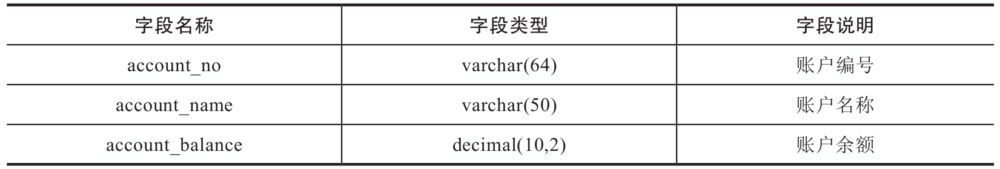{width="6.427890419947507in"
height="1.091917104111986in"}

> 设计完数据表后，在192.168.175.100服务器的MySQL
> 命令行执行如下命令创建转出金额数据库和数据表。
>
> create database if not exists tx-xa-01;
>
> CREATE TABLE \'user_account\' (
>
> 号\',

\'account_no\' varchar(64) NOT NULL DEFAULT \'\' COMMENT \'

账户编

> \'account_name\' varchar(50) DEFAULT \'\' COMMENT \'

账户名称\',

> 额\',

\'account_balance\' decimal(10,2) DEFAULT \'0.00\' COMMENT \'

PRIMARY KEY (\'account_no\')

> ) ENGINE=InnoDB DEFAULT CHARSET=utf8mb4;
>
> 在192.168.175.101服务器的MySQL命令行执行如下命
> 令创建转入金额数据库和数据表。
>
> create database if not exists tx-xa-02;
>
> 647
>
> CREATE TABLE \'user_account\' (
>
> \'account_no\' varchar(64) NOT NULL DEFAULT \'\' COMMENT \'

账户编

> 号\',
>
> \'account_name\' varchar(50) DEFAULT \'\' COMMENT \'

账户名称\',

> 额\',

\'account_balance\' decimal(10,2) DEFAULT \'0.00\' COMMENT \'

PRIMARY KEY (\'account_no\')

> ) ENGINE=InnoDB DEFAULT CHARSET=utf8mb4;
>
> 在两个数据库下分别执行如下命令为数据表插入一条 记录。
>
> 在tx-xa-01数据库为数据表插入一条记录，代码如
>
> 下。
>
> INSERT INTO \'tx-xa-01\'.\'user_account\'(\'account_no\',
> \'account_name\', \'account_balance\')
>
> VALUES (\'1001\', \'冰河001\', 1000.00);
>
> 在tx-xa-02数据库为数据表插入一条记录，代码如
>
> 下。
>
> INSERT INTO \'tx-xa-02\'.\'user_account\'(\'account_no\',
> \'account_name\', \'account_balance\')
>
> VALUES (\'1002\', \'冰河002\', 1000.00);
>
> 至此，数据库表就设计完成了。
>
> 648
>
> 14.4　程序实现
>
> 本案例利用Atomikos框架实现跨数据库的XA强一致
> 性分布式事务。整个程序的实现步骤分为项目搭建、持
> 久层的实现、业务逻辑层的实现、接口层的实现和项目 启动类的实现。
>
> 649
>
> 14.4.1　项目搭建
>
> 整个项目主要基于Spring Boot实现，项目的搭建过 程如下所示。
>
> 第一步：新建名称为tx-xa的Maven项目，在项目的
> pom.xml文件中添加如下配置。
>
> \<parent\>\
> \<groupId\>org.springframework.boot\</groupId\>
>
> \<artifactId\>spring-boot-starter-parent\</artifactId\>\
> \<version\>2.2.6.RELEASE\</version\>
>
> \</parent\>
>
> \<modelVersion\>4.0.0\</modelVersion\>
>
> \<artifactId\>tx-xa\</artifactId\>
>
> \<properties\>\
> \<project.build.sourceEncoding\>UTF-
>
> 8\</project.build.sourceEncoding\>\
> \<skip_maven_deploy\>false\</skip_maven_deploy\>
>
> \<java.version\>1.8\</java.version\>\
> \<druid.version\>1.1.10\</druid.version\>\
> \<mybatis.version\>3.4.6\</mybatis.version\>\
> \<mybatis.plus.version\>3.1.0\</mybatis.plus.version\>\
> \<jdbc.version\>5.1.49\</jdbc.version\>\
> \<lombok.version\>1.18.12\</lombok.version\>
>
> \</properties\>
>
> \<dependencies\>\
> \<dependency\>
>
> \<groupId\>org.springframework.boot\</groupId\>\
> \<artifactId\>spring-boot-starter-test\</artifactId\>
>
> \</dependency\>
>
> \<dependency\>\
> \<groupId\>org.springframework.boot\</groupId\>
>
> \<artifactId\>spring-boot-starter-web\</artifactId\>\
> \<exclusions\>
>
> 650
>
> \<exclusion\>
>
> \<groupId\>org.springframework.boot\</groupId\>
>
> \<artifactId\>spring-boot-starter-
>
> tomcat\</artifactId\>\
> \</exclusion\>
>
> \<exclusion\>
>
> \<groupId\>org.springframework.boot\</groupId\>
>
> \<artifactId\>spring-boot-starter-
>
> logging\</artifactId\>\
> \</exclusion\>
>
> \</exclusions\>
>
> \</dependency\>
>
> \<dependency\>\
> \<groupId\>org.springframework.boot\</groupId\>
>
> \<artifactId\>spring-boot-starter-jta-\
> atomikos\</artifactId\>
>
> \</dependency\>
>
> \<dependency\>\
> \<groupId\>org.springframework.boot\</groupId\>
>
> \<artifactId\>spring-boot-starter-undertow\</artifactId\>\
> \</dependency\>
>
> \<dependency\>\
> \<groupId\>org.springframework.boot\</groupId\>
>
> \<artifactId\>spring-boot-configuration-\
> processor\</artifactId\>
>
> \<optional\>true\</optional\>\
> \</dependency\>
>
> \<dependency\>\
> \<groupId\>mysql\</groupId\>
>
> \<artifactId\>mysql-connector-java\</artifactId\>\
> \<version\>\${jdbc.version}\</version\>\<!\--\$NO-MVN-MAN-VER\$\--
>
> \>
>
> \</dependency\>
>
> \<dependency\>\
> \<groupId\>org.mybatis.spring.boot\</groupId\>
>
> \<artifactId\>mybatis-spring-boot-starter\</artifactId\>\
> \<version\>1.1.1\</version\>
>
> \</dependency\>
>
> \<dependency\>\
> \<groupId\>com.baomidou\</groupId\>
>
> \<artifactId\>mybatis-plus-boot-starter\</artifactId\>\
> \<version\>\${mybatis.plus.version}\</version\>
>
> \</dependency\>
>
> 651
>
> \<dependency\>\
> \<groupId\>com.alibaba\</groupId\>
>
> \<artifactId\>druid\</artifactId\>\
> \<version\>\${druid.version}\</version\>
>
> \</dependency\>
>
> \<dependency\>\
> \<groupId\>com.alibaba\</groupId\>
>
> \<artifactId\>druid-spring-boot-starter\</artifactId\>\
> \<version\>\${druid.version}\</version\>
>
> \</dependency\>
>
> \<dependency\>\
> \<groupId\>org.projectlombok\</groupId\>
>
> \<artifactId\>lombok\</artifactId\>\
> \<version\>\${lombok.version}\</version\>
>
> \</dependency\>
>
> \</dependencies\>
>
> 第二步：在io.transaction.xa.config包下创建
> CorsConfig类、MybatisPlusConfig类和WebMvcConfig
>
> 类，分别表示Spring Boot项目实现跨域访问的配置类、
> MyBatisPlus框架的配置类、WebMVC的配置类，具体代码 如下所示。
>
> 创建CorsConfig类，代码如下。
>
> \@Configuration
>
> public class CorsConfig {
>
> private CorsConfiguration buildConfig(){\
> CorsConfiguration corsConfiguration = new
>
> CorsConfiguration();\
> corsConfiguration.addAllowedOrigin(\"\*\");
>
> corsConfiguration.addAllowedHeader(\"\*\");\
> corsConfiguration.addAllowedMethod(\"\*\");\
> return corsConfiguration;
>
> }
>
> \@Bean
>
> public CorsFilter corsFilter(){
>
> 652
>
> UrlBasedCorsConfigurationSource source = new
> UrlBasedCorsConfigurationSource();
>
> source.registerCorsConfiguration(\"/\*\*\", buildConfig());\
> return new CorsFilter(source);
>
> }\
> }
>
> 创建MybatisPlusConfig类，代码如下。
>
> \@EnableTransactionManagement
>
> \@Configuration
>
> \@MapperScan(value = {\"io.transaction.msg.order.mapper\"}) public
> class MybatisPlusConfig {
>
> \@Bean
>
> public PaginationInterceptor paginationInterceptor() {
>
> return new PaginationInterceptor();\
> }
>
> }
>
> 创建WebMvcConfig类，代码如下。
>
> \@Configuration
>
> public class WebMvcConfig extends WebMvcConfigurationSupport {
>
> \@Bean
>
> public HttpMessageConverter\<String\> responseBodyConverter()\
> {
>
> return new
>
> StringHttpMessageConverter(Charset.forName(\"UTF-8\"));
>
> }
>
> \@Override
>
> public void
>
> configureMessageConverters(List\<HttpMessageConverter\<?\>\>
> converters) {
>
> converters.add(responseBodyConverter());\
> addDefaultHttpMessageConverters(converters);
>
> }
>
> \@Override
>
> public void
>
> configureContentNegotiation(ContentNegotiationConfigurer configurer) {
>
> configurer.favorPathExtension(false);
>
> 653
>
> }
>
> \@Override
>
> protected void addResourceHandlers(ResourceHandlerRegistry registry) {
>
> registry.addResourceHandler(\"/\*\*\").addResourceLocations(\"classpa
> th:/static/\").addResourceLocations(\"classpath:/resources/\");
>
> super.addResourceHandlers(registry);\
> }
>
> }
>
> 第三步：在io.transaction.xa.config包下创建第
> 一个数据源的配置类DBConfig1，此类中的字段与
> application-db.yml文件中mysql.datasource.account1
> 节点下的字段一一对应，具体代码如下。
>
> \@Data
>
> \@ConfigurationProperties(prefix = \"mysql.datasource.account1\")
> public class DBConfig1 {
>
> private String url;
>
> private String username;
>
> private String password;
>
> private int minPoolSize;
>
> private int maxPoolSize;
>
> private int maxLifetime;
>
> private int borrowConnectionTimeout;\
> private int loginTimeout;
>
> private int maintenanceInterval;\
> private int maxIdleTime;
>
> private String testQuery;
>
> }
>
> 第四步：在io.transaction.xa.config包下创建第
> 二个数据源的配置类DBConfig2，此类中的字段与
> application-db.yml文件中mysql.datasource.account2
> 节点下的字段一一对应，具体代码如下。
>
> 654
>
> \@Data
>
> \@ConfigurationProperties(prefix = \"mysql.datasource.account2\")
> public class DBConfig2 {
>
> private String url;
>
> private String username;
>
> private String password;
>
> private int minPoolSize;
>
> private int maxPoolSize;
>
> private int maxLifetime;
>
> private int borrowConnectionTimeout;\
> private int loginTimeout;
>
> private int maintenanceInterval;\
> private int maxIdleTime;
>
> private String testQuery;
>
> }
>
> 第五步：在io.transaction.xa.config包下创建
> MyBatisConfig1类。MyBatisConfig1类的作用是整合
> Atomikos框架，读取DBConfig1类中的信息，实现数据库
>
> 连接池，最终通过Atomikos框架的数据库连接池连接数
> 据库并操作，具体代码如下。
>
> \@Configuration
>
> \@MapperScan(basePackages = \"io.transaction.xa.mapper1\",
> sqlSessionTemplateRef = \"account1SqlSessionTemplate\")\
> public class MyBatisConfig1 {
>
> // 配置数据源\
> \@Primary
>
> \@Bean(name = \"account1DataSource\")
>
> public DataSource account1DataSource(DBConfig1 dbConfig1)
>
> throws SQLException {
>
> MysqlXADataSource mysqlXaDataSource = new
>
> MysqlXADataSource();\
> mysqlXaDataSource.setUrl(dbConfig1.getUrl());
>
> mysqlXaDataSource.setPinGlobalTxToPhysicalConnection(true);\
> mysqlXaDataSource.setPassword(dbConfig1.getPassword());
>
> mysqlXaDataSource.setUser(dbConfig1.getUsername());
>
> mysqlXaDataSource.setPinGlobalTxToPhysicalConnection(true);
>
> AtomikosDataSourceBean xaDataSource = new
>
> 655
>
> AtomikosDataSourceBean();\
> xaDataSource.setXaDataSource(mysqlXaDataSource);
>
> xaDataSource.setUniqueResourceName(\"account1DataSource\");
>
> xaDataSource.setMinPoolSize(dbConfig1.getMinPoolSize());\
> xaDataSource.setMaxPoolSize(dbConfig1.getMaxPoolSize());\
> xaDataSource.setMaxLifetime(dbConfig1.getMaxLifetime());
>
> xaDataSource.setBorrowConnectionTimeout(dbConfig1.getBorrowConne ction
> Timeout());
>
> xaDataSource.setLoginTimeout(dbConfig1.getLoginTimeout());
>
> xaDataSource.setMaintenanceInterval(dbConfig1.getMaintenanceInte
> rval());
>
> xaDataSource.setMaxIdleTime(dbConfig1.getMaxIdleTime());\
> xaDataSource.setTestQuery(dbConfig1.getTestQuery());\
> return xaDataSource;
>
> }
>
> \@Primary
>
> \@Bean(name = \"accout1SqlSessionFactory\")
>
> public SqlSessionFactory accout1SqlSessionFactory(\
> \@Qualifier(\"account1DataSource\") DataSource dataSource)
>
> throws Exception {
>
> SqlSessionFactoryBean bean = new\
> SqlSessionFactoryBean();
>
> bean.setDataSource(dataSource);\
> return bean.getObject();
>
> }
>
> \@Primary
>
> \@Bean(name = \"account1SqlSessionTemplate\")
>
> public SqlSessionTemplate account1SqlSessionTemplate(
>
> \@Qualifier(\"accout1SqlSessionFactory\")\
> SqlSessionFactory sqlSessionFactory)
>
> throws Exception {
>
> return new SqlSessionTemplate(sqlSessionFactory);\
> }
>
> }
>
> 第六步：在io.transaction.xa.config包下创建
> MyBatisConfig2类。MyBatisConfig2类的作用与
> MyBatisConfig1类的作用相似，只不过MyBatisConfig2
> 类读取的是DBConfig2类中的信息，封装的是整合了
>
> 656
>
> Atomikos框架的另一个数据源的数据库连接池，通过连
> 接池连接数据库并操作，具体代码如下所示。
>
> \@Configuration
>
> \@MapperScan(basePackages = \"io.transaction.xa.mapper2\",
> sqlSessionTemplateRef = \"account2SqlSessionTemplate\")\
> public class MyBatisConfig2 {
>
> // 配置数据源
>
> \@Bean(name = \"account2DataSource\")
>
> public DataSource account2DataSource(DBConfig2 dbConfig2)
>
> throws SQLException {
>
> MysqlXADataSource mysqlXaDataSource = new
>
> MysqlXADataSource();\
> mysqlXaDataSource.setUrl(dbConfig2.getUrl());
>
> mysqlXaDataSource.setPinGlobalTxToPhysicalConnection(true);\
> mysqlXaDataSource.setPassword(dbConfig2.getPassword());
>
> mysqlXaDataSource.setUser(dbConfig2.getUsername());
>
> mysqlXaDataSource.setPinGlobalTxToPhysicalConnection(true);
>
> AtomikosDataSourceBean xaDataSource = new AtomikosDataSourceBean();
>
> xaDataSource.setXaDataSource(mysqlXaDataSource);
>
> xaDataSource.setUniqueResourceName(\"account2DataSource\");
>
> xaDataSource.setMinPoolSize(dbConfig2.getMinPoolSize());\
> xaDataSource.setMaxPoolSize(dbConfig2.getMaxPoolSize());\
> xaDataSource.setMaxLifetime(dbConfig2.getMaxLifetime());
>
> xaDataSource.setBorrowConnectionTimeout(dbConfig2.getBorrowConne
> ctionTimeout());
>
> xaDataSource.setLoginTimeout(dbConfig2.getLoginTimeout());
>
> xaDataSource.setMaintenanceInterval(dbConfig2.getMaintenanceInte
> rval());
>
> xaDataSource.setMaxIdleTime(dbConfig2.getMaxIdleTime());\
> xaDataSource.setTestQuery(dbConfig2.getTestQuery());\
> return xaDataSource;
>
> }
>
> \@Bean(name = \"account2SqlSessionFactory\")
>
> public SqlSessionFactory account2SqlSessionFactory(\
> \@Qualifier(\"account2DataSource\") DataSource dataSource)
>
> 657
>
> throws Exception {
>
> SqlSessionFactoryBean bean = new SqlSessionFactoryBean();
>
> bean.setDataSource(dataSource);\
> return bean.getObject();
>
> }
>
> \@Bean(name = \"account2SqlSessionTemplate\")
>
> public SqlSessionTemplate account2SqlSessionTemplate(
>
> \@Qualifier(\"account2SqlSessionFactory\") SqlSessionFactory
> sqlSession Factory)
>
> throws Exception {
>
> return new SqlSessionTemplate(sqlSessionFactory);
>
> }\
> }
>
> 第七步：在项目的src/main/resources目录下创建
> application.yml文件。Spring Boot在启动时会自动加
> 载application.yml文件，application.yml中主要定义
> 了项目启动后监听的端口号，访问项目的根URL和编码，
>
> 并引用application-db.yml文件，具体代码如下所示。
>
> server:
>
> port: 8083
>
> servlet:
>
> context-path: /xa
>
> tomcat:
>
> uri-encoding: UTF-8
>
> spring:\
> main:
>
> allow-bean-definition-overriding: true\
> profiles:
>
> include: db
>
> active: db
>
> output:
>
> ansi:
>
> enabled: detect
>
> application:\
> name: tx-xa
>
> http:
>
> encoding:
>
> charset: UTF-8
>
> 658
>
> enabled: true
>
> force: true
>
> 第八步：在项目的src/main/resources目录下创建
> application-db.yml文件，该文件主要定义了与数据源
> 相关的信息，其中mysql.datasource.account1节点下的
>
> 内容与DBConfig1类对应，mysql.datasource.account2
> 节点下的内容与DBConfig2类对应。同时，在
> application-db.yml文件中还定义了MyBatis扫描的实体
> 类包，具体代码如下所示。
>
> mysql:\
> datasource:
>
> account1:
>
> url: jdbc:mysql://192.168.175.100:3306/tx-xa-01?
> useUnicode=true&characterEncoding=UTF-
> 8&useOldAliasMetadataBehavior=true&autoReconnect=true&failOverRe
> adOnly=false&useSSL=false
>
> username: root
>
> password: root
>
> minPoolsize: 3
>
> maxPoolSize: 25
>
> maxLifetime: 30000
>
> borrowConnectionTimeout: 30
>
> loginTimeout: 30
>
> maintenanceInterval: 60
>
> maxIdleTime: 60
>
> testQuery: SELECT 1
>
> account2:
>
> url: jdbc:mysql://192.168.175.101:3306/tx-xa-02?
> useUnicode=true&characterEncoding=UTF-
> 8&useOldAliasMetadataBehavior=true&autoReconnect=true&failOverRe
> adOnly=false&useSSL=false
>
> username: root
>
> password: root
>
> minPoolsize: 3
>
> maxPoolSize: 25
>
> maxLifetime: 30000
>
> borrowConnectionTimeout: 30
>
> loginTimeout: 30
>
> maintenanceInterval: 60
>
> 659
>
> maxIdleTime: 60
>
> testQuery: SELECT 1
>
> mybatis:
>
> type-aliases-package: io.transaction.xa.entity
>
> 至此，项目搭建就完成了。
>
> 660
>
> 14.4.2　持久层的实现
>
> 项目的持久层主要通过MyBatis框架实现操作数据库
> 的简单方法，具体的实现步骤如下所示。
>
> 第一步：在io.transaction.xa.entity包下创建
> UserAccount类，UserAccount类封装的是用户的账户信
>
> 息，与user_account数据表中的字段一一对应，具体代 码如下所示。
>
> public class UserAccount implements Serializable {
>
> private static final long serialVersionUID = 6909533252826367496L;
>
> /\*\*
>
> \* 账户编号
>
> \*/
>
> private String accountNo;
>
> /\*\*
>
> \* 账户名称
>
> \*/
>
> private String accountName;
>
> /\*\*
>
> \* 账户余额
>
> \*/
>
> private BigDecimal accountBalance;\
> }
>
> 第二步：分别在io.transaction.xa.mapper1包和
> io.transaction.xa.mapper2包下创建UserAc-
> count1Mapper接口和UserAccount2Mapper接口。两个接
> 口中定义的方法相同，都定义了一个更新账户余额的接
>
> 661
>
> 口updateAccountBalance(BigDecimal,String)和一个查
> 询账户余额的接口getAccountBalance(String)。这里以
> UserAccount1Mapper接口的代码为例，具体代码如下所
>
> 示。
>
> public interface UserAccount1Mapper {
>
> /\*\*
>
> \* 更新账户余额
>
> \*/
>
> int updateAccountBalance(@Param(\"accountBalance\") BigDecimal
> accountBalance,
>
> \@Param(\"accountNo\") String accountNo);
>
> /\*\*
>
> \* 获取账户余额
>
> \*/
>
> BigDecimal getAccountBalance(@Param(\"accountNo\") String accountNo);
>
> }
>
> 第三步：分别在项目的 src/main/resources/io/transaction/xa/mapper1目录
>
> 和src/main/resources/io/transaction/xa/mapper2目
> 录下创建UserAccount1Mapper.xml文件和UserAccount2
> Mapper.xml文件。UserAccount1Mapper.xml文件对应的
> 是UserAccount1Mapper接口，UserAc-count2Mapper.xml
>
> 文件对应的是UserAccount2Mapper接口，两个文件的内
> 容大体相同，这里以UserAccount1Mapper.xml文件为 例，具体代码如下所示。
>
> \<?xml version=\"1.0\" encoding=\"UTF-8\"?\>
>
> \<!DOCTYPE mapper PUBLIC \"-//mybatis.org//DTD Mapper 3.0//EN\"
> \"<http://mybatis.org/dtd/mybatis-3-mapper.dtd>\"\>
>
> \<mapper
>
> namespace=\"io.transaction.xa.mapper1.UserAccount1Mapper\"\>
>
> 662
>
> \<update id=\"updateAccountBalance\"\>
>
> update user_account set account_balance =
>
> account_balance + #{account Balance} where account_no = \# {accountNo}
>
> \</update\>
>
> \<select id=\"getAccountBalance\"
> resultType=\"java.math.BigDecimal\"\>
>
> select account_balance from user_account where account_no =
> #{accountNo}
>
> \</select\>
>
> \</mapper\>
>
> 至此，项目的持久层实现完毕。
>
> 663
>
> 14.4.3　业务逻辑层的实现
>
> 项目的业务逻辑层主要实现具体的跨库转账的业务
> 逻辑，由于具体的XA跨库分布式事务是由Atomikos框架
> 内部实现的，因此在业务逻辑层处理跨库转账的逻辑
>
> 时，就像操作本地数据库一样简单，具体的实现步骤如 下所示。
>
> 第一步：在io.transaction.xa.service包下创建
> UserAccountService接口，UserAccountService接口中
>
> 定义了一个转账方法 transferAccounts(String,String,BigDecimal)，具体
> 代码如下所示。
>
> public interface UserAccountService {
>
> /\*\*
>
> \* 转账操作
>
> \*/
>
> void transferAccounts(String sourceAccountNo, String targetSourceNo,
> Big
>
> Decimal transferAmount);
>
> }
>
> 第二步：在io.transaction.xa.service.impl包下
> 创建UserAccountServiceImpl类，实现 UserAccountService接口，并在
> UserAccountServiceImpl类中实现了转账的具体逻辑， 具体代码如下所示。
>
> 664
>
> \@Service
>
> public class UserAccountServiceImpl implements UserAccountService {
>
> \@Autowired
>
> private UserAccount1Mapper userAccount1Mapper;
>
> \@Autowired
>
> private UserAccount2Mapper userAccount2Mapper;
>
> \@Override
>
> \@Transactional(rollbackFor = Exception.class)
>
> public void transferAccounts(String sourceAccountNo, String
>
> targetSourceNo, BigDecimal transferAmount) {\
> log.info(\"开始执行转账操作, sourceAccountNo:{},
>
> targetSourceNo:{}, transferAmount:{}\", sourceAccountNo,
> targetSourceNo, transferAmount);
>
> BigDecimal accountBalance =
> userAccount1Mapper.getAccountBalance(sourceAccountNo);
>
> if(accountBalance.compareTo(transferAmount) \< 0){
>
> throw new RuntimeException(\"转账余额不足\");
>
> }
>
> userAccount1Mapper.updateAccountBalance(transferAmount.negate(),
> sourceAccountNo);
>
> //int i = 1 / 0;
>
> userAccount2Mapper.updateAccountBalance(transferAmount,
> targetSourceNo);
>
> log.info(\"转账操作执行成功\...\");\
> }
>
> }
>
> 至此，业务逻辑层实现完毕。
>
> 665
>
> 14.4.4　接口层的实现
>
> 项目的接口层主要对外提供转账操作的接口，客户
> 端可以通过访问接口层对外提供的转账接口进行转账操
> 作。接口层的实现比较简单，就是在
>
> io.transaction.xa.controller包下创建一个
> TransferController类。TransferController类对外提
> 供了一个transfer接口。客户端访问这个接口，传入转
> 出账户、转入账户、转账金额3个参数即可进行转账操 作，具体代码如下所示。
>
> \@RestController
>
> public class TransferController {
>
> \@Autowired
>
> private UserAccountService userAccountService;\
> \@PostMapping(value = \"/transfer\")
>
> public String transfer(@RequestParam(\"sourceAccountNo\")
>
> String sourceAccountNo,
>
> \@RequestParam(\"targetAccountNo\")
>
> String targetAccountNo,
>
> \@RequestParam(\"amount\")BigDecimal
>
> amount){
>
> userAccountService.transferAccounts(sourceAccountNo,
>
> targetAccountNo, amount); return \"success\";
>
> }\
> }
>
> 至此，接口层实现完毕。
>
> 666
>
> 14.4.5　项目启动类的实现
>
> 项目的启动类是整个项目的启动入口，在Spring
> Boot实现的微服务项目中，通过main()方法即可启动一
>
> 个项目。在io.transaction.xa包下创建TxXaStarter类
> 作为整个项目的启动类，具体代码如下所示。
>
> \@SpringBootApplication(exclude = {DataSourceAutoConfiguration.class})
> \@EnableConfigurationProperties(value = {DBConfig1.class,
> DBConfig2.class})
>
> \@MapperScan(value = {
> \"io.transaction.xa.mapper1\",\"io.transaction.xa.mapper2\"})
> \@EnableTransactionManagement(proxyTargetClass = true) public class
> TxXaStarter {
>
> public static void main(String\[\] args){\
> SpringApplication.run(TxXaStarter.class, args);
>
> }\
> }
>
> 至此，整个项目就实现完毕了。
>
> 667
>
> 14.5　测试程序
>
> 本节对整个项目的实现进行测试，看看是否能够达
> 到转出账户减少100元，转入账户增加100元的效果，具 体测试步骤如下所示。
>
> 第一步：分别查询tx-xa-01数据库和tx-xa-02数据
> 库中user_account数据表的数据，如下所示。
>
> tx-xa-01数据库代码如下。
>
> mysql\> use tx-xa-01;
>
> Database changed
>
> mysql\> select \* from user_account;\
> +\-\-\-\-\-\-\-\-\-\-\--+\-\-\-\-\-\-\-\-\-\-\-\-\--+\-\-\-\-\-\-\-\-\-\-\-\-\-\-\-\--+
>
> \| account_no \| account_name \| account_balance \|\
> +\-\-\-\-\-\-\-\-\-\-\--+\-\-\-\-\-\-\-\-\-\-\-\-\--+\-\-\-\-\-\-\-\-\-\-\-\-\-\-\-\--+
>
> \| 1001 \| 冰河001 \| 1000.00 \|\
> +\-\-\-\-\-\-\-\-\-\-\--+\-\-\-\-\-\-\-\-\-\-\-\-\--+\-\-\-\-\-\-\-\-\-\-\-\-\-\-\-\--+
>
> 1 row in set (0.00 sec)
>
> 可以看到，tx-xa-01数据库中的user_account数据
> 表中账户编号为1001的账户余额为1000元。
>
> tx-xa-02数据库代码如下。
>
> mysql\> use tx-xa-02;
>
> Database changed
>
> mysql\> select \* from user_account;\
> +\-\-\-\-\-\-\-\-\-\-\--+\-\-\-\-\-\-\-\-\-\-\-\-\--+\-\-\-\-\-\-\-\-\-\-\-\-\-\-\-\--+
>
> \| account_no \| account_name \| account_balance \|\
> +\-\-\-\-\-\-\-\-\-\-\--+\-\-\-\-\-\-\-\-\-\-\-\-\--+\-\-\-\-\-\-\-\-\-\-\-\-\-\-\-\--+
>
> \| 1002 \| 冰河002 \| 1000.00 \|
>
> 668
>
> +\-\-\-\-\-\-\-\-\-\-\--+\-\-\-\-\-\-\-\-\-\-\-\-\--+\-\-\-\-\-\-\-\-\-\-\-\-\-\-\-\--+
>
> 1 row in set (0.00 sec)
>
> 可以看到，tx-xa-02数据库中的user_account数据
> 表中账户编号为1002的账户余额为1000元。
>
> 第二步：启动tx-xa项目，通过Postman等接口调用
> 工具调用<http://192.168.175.100:8083/xa/transfer>[接](http://192.168.175.100:8083/xa/transfer接)
>
> 口，并传递转出账户sourceUserAccount、转入账户
> targetUserAccount和转账金额amount。项目的日志文件
> 中会输出如下日志信息。
>
> INFO 102640 \-\-- \[main\] i.t.x.s.impl.UserAccountServiceImpl: 开始
> 执行转账操作, sourceAccountNo:1001, targetSourceNo:1002,
> transferAmount:100
>
> INFO 102640 \-\-- \[main\] i.t.x.s.impl.UserAccountServiceImpl: 转账
> 操作执行成功\...
>
> 通过日志可以看出，转账操作执行成功了。
>
> 第三步：再次查询tx-xa-01数据库和tx-xa-02数据
> 库中user_account数据表的数据，如下所示。
>
> tx-xa-01数据库代码如下。
>
> mysql\> use tx-xa-01;
>
> Database changed
>
> mysql\> select \* from user_account;\
> +\-\-\-\-\-\-\-\-\-\-\--+\-\-\-\-\-\-\-\-\-\-\-\-\--+\-\-\-\-\-\-\-\-\-\-\-\-\-\-\-\--+
>
> \| account_no \| account_name \| account_balance \|\
> +\-\-\-\-\-\-\-\-\-\-\--+\-\-\-\-\-\-\-\-\-\-\-\-\--+\-\-\-\-\-\-\-\-\-\-\-\-\-\-\-\--+
>
> \| 1001 \| 冰河001 \| 900.00 \|\
> +\-\-\-\-\-\-\-\-\-\-\--+\-\-\-\-\-\-\-\-\-\-\-\-\--+\-\-\-\-\-\-\-\-\-\-\-\-\-\-\-\--+
>
> 1 row in set (0.00 sec)
>
> 669
>
> 可以看出，tx-xa-01数据库中的user_account数据
> 表中账户编号为1001的账户余额由原来的1000元，减少 了100元，变为900元。
>
> tx-xa-02数据库代码如下。
>
> mysql\> use tx-xa-02;
>
> Database changed
>
> mysql\> select \* from user_account;\
> +\-\-\-\-\-\-\-\-\-\-\--+\-\-\-\-\-\-\-\-\-\-\-\-\--+\-\-\-\-\-\-\-\-\-\-\-\-\-\-\-\--+
>
> \| account_no \| account_name \| account_balance \|\
> +\-\-\-\-\-\-\-\-\-\-\--+\-\-\-\-\-\-\-\-\-\-\-\-\--+\-\-\-\-\-\-\-\-\-\-\-\-\-\-\-\--+
>
> \| 1002 \| 冰河002 \| 1100.00 \|\
> +\-\-\-\-\-\-\-\-\-\-\--+\-\-\-\-\-\-\-\-\-\-\-\-\--+\-\-\-\-\-\-\-\-\-\-\-\-\-\-\-\--+
>
> 1 row in set (0.00 sec)
>
> 可以看出，tx-xa-02数据库中的user_account数据
> 表中账户编号为1002的账户余额由原来的1000元，增加
> 了100元，变为了1100元。
>
> 说明整个项目达到了预期的效果，测试成功。
>
> 670
>
> 14.6　本章小结
>
> 本章主要使用Atomikos框架实现了XA强一致性分布
> 式事务。首先，对业务的场景和程序模块进行了简单的
> 说明。然后，简单介绍了数据库表设计。接着，详细介
> 绍了整个项目的实现过程。最后，对项目实现的效果进
> 行了测试。第15章将会基于TCC分布式事务实现一个完整
>
> 的项目案例。
>
> 本章的随书源码已提交到如下代码仓库。\
> [·GitHub：https://github.com/dromara/distribute-](https://github.com/dromara/distribute-transaction)
>
> [transaction。](https://github.com/dromara/distribute-transaction)
>
> [·Gitee：https://gitee.com/dromara/distribute-](https://gitee.com/dromara/distribute-transaction)
> [transaction。](https://gitee.com/dromara/distribute-transaction)
>
> 另外，除了可以基于Atomikos框架实现XA分布式事
> 务外，也可以基于Dromara社区的Raincat框架实现XA分
> 布式事务。读者可自行查询Raincat框架的源码进行学
>
> 习，这里不再赘述。Raincat框架的地址如下所示。
>
> ·GitHub：<https://github.com/dromara/Raincat>[。](https://github.com/dromara/Raincat。·Gitee：https://gitee.com/dromara/Raincat。)\
> [·Gitee：](https://github.com/dromara/Raincat。·Gitee：https://gitee.com/dromara/Raincat。)<https://gitee.com/dromara/Raincat>[。](https://github.com/dromara/Raincat。·Gitee：https://gitee.com/dromara/Raincat。)
>
> 671
>
> 第15章　TCC分布式事务实战
>
> 前面的章节介绍了TCC分布式事务的原理，详细剖析
> 了由Dromara社区开发并维护的业界知名的TCC分布式事
> 务框架Hmily的源码。本章基于Hmily框架实现一个跨行
> 转账的TCC分布式事务案例。
>
> 本章涉及的内容如下。\
> ·场景说明。\
> ·程序模块说明。\
> ·数据库表设计。\
> ·实现项目公共模块。\
> ·实现转出银行微服务。\
> ·实现转入银行微服务。\
> ·测试程序。
>
> 672
>
> 15.1　场景说明
>
> 案例程序分为3个部分：项目公共模块、转出银行微
> 服务和转入银行微服务。转出银行微服务和转入银行微服
>
> 务引用项目的公共模块，转出银行微服务作为TCC分布式
> 事务中的事务发起方，转入银行微服务作为TCC分布式事
> 务中的事务被动方，整体流程如图15-1所示。

{width="6.427890419947507in"
height="4.542787620297463in"}

> 图15-1　使用Hmily框架实现TCC分布式事务案例的流程
>
> 转出银行微服务作为事务发起方，调用转入银行微服
> 务的Try方法预留相应的资源，Hmily框架作为整个分布式
> 事务的TCC管理器，由Hmily框架调用转入银行微服务的
>
> 673
>
> Confirm方法和Cancel方法。如果Try方法执行成功，会调
> 用Confirm方法确定转账金额和转账状态，并将相应的数
> 据持久化到数据库中。如果Try方法执行失败，或者程序
> 出现异常，会调用Cancel方法释放Try阶段预留的资源，
> 也就是回滚Try阶段执行的操作。TCC分布式事务最终会使
> 转账操作要么全部执行成功，要么全部执行失败。
>
> 另外，这里使用Dubbo和ZooKeeper实现了微服务之间
> 的远程调用。有关ZooKeeper环境的搭建，读者可自行在
> 网上查询相关资料，笔者不再赘述。
>
> 674
>
> 15.2　程序模块说明
>
> 本案例涉及的服务和程序组件如下所示。\
> ·服务器：192.168.175.100和192.168.175.101。\
> ·MySQL：MySQL 8.0.20。
>
> ·JDK：64位JDK 1.8.0_212。\
> ·ZooKeeper服务：zookeeper-3.7.0。\
> ·Dubbo框架：2.6.5版本。\
> ·Hmily框架：2.1.1发行版。\
> ·微服务框架：springboot-2.2.6.RELEASE。\
> ·数据库：转出银行数据库tx-tcc-bank01，存储于
>
> 192.168.175.100服务器，转入银行数据库tx-tcc-bank02，存
> 储于192.168.175.101服务器。
>
> 675
>
> 15.3　数据库表设计
>
> 在模拟跨行转账的业务场景中，核心服务包括转出银
> 行微服务和转入银行微服务，对应的数据库包括转出银行
> 数据库和转入银行数据库。在整个分布式事务的实现过程
> 中，为了保证程序的幂等性和避免事务悬挂等问题，在数
> 据库中不仅要设计相应的账户数据表，还要创建TCC分布
>
> 式事务中执行Try阶段、Confirm阶段和Cancel阶段的记录 表。
>
> 在转出银行数据库和转入银行数据库中，需要创建4
> 张表，分别为账户数据表user_account、执行Try阶段的
> 记录表try_log、执行Cancel阶段的记录表cancel_log和
> 执行Confirm阶段的记录表confirm_log。4张数据表的表
> 结构如表15-1～表15-4所示。
>
> 表15-1　user_account账户数据表

{width="6.427891513560805in"
height="1.2979385389326334in"}

> 表15-2　try_log记录表

{width="6.427890419947507in"
height="0.8034864391951007in"}

> 表15-3　confirm_log记录表
>
> 676

{width="6.427890419947507in"
height="0.7725820209973753in"}

> 表15-4　cancel_log记录表

{width="6.427891513560805in"
height="0.7931846019247594in"}

> 接下来，在192.168.175.100服务器的MySQL命令行执
> 行如下命令创建转出银行数据库和数据表。
>
> create database if not exists tx-tcc-bank01;
>
> CREATE TABLE \'user_account\' (
>
> 号\',

\'account_no\' varchar(64) NOT NULL DEFAULT \'\' COMMENT \'

账户编

> \'account_name\' varchar(50) DEFAULT \'\' COMMENT \'

账户名称\',

> 额\',
>
> 额\',

\'account_balance\' decimal(10,2) DEFAULT \'0.00\' COMMENT \'

\'transfer_amount\' decimal(10,2) DEFAULT \'0.00\' COMMENT \'

PRIMARY KEY (\'account_no\')

转账金

> ) ENGINE=InnoDB DEFAULT CHARSET=utf8mb4 COMMENT=\'账户信息\';
>
> CREATE TABLE \'try_log\' (
>
> \'tx_no\' varchar(64) NOT NULL DEFAULT \'\' COMMENT \'全局事务编号\',
>
> \'create_time\' datetime DEFAULT CURRENT_TIMESTAMP COMMENT \'创建\
> 时间\',
>
> PRIMARY KEY (\'tx_no\')
>
> ) ENGINE=InnoDB DEFAULT CHARSET=utf8mb4 COMMENT=\'Try阶段执行的日志
>
> 记录\';
>
> CREATE TABLE \'confirm_log\' (
>
> \'tx_no\' varchar(64) NOT NULL DEFAULT \'\' COMMENT \'全局事务编号\',
>
> \'create_time\' datetime DEFAULT CURRENT_TIMESTAMP COMMENT \'
>
> 时间\',
>
> PRIMARY KEY (\'tx_no\')

创建

> ) ENGINE=InnoDB DEFAULT CHARSET=utf8mb4 COMMENT=\'Confir
>
> 日志记录\';

m阶段执行的

> CREATE TABLE \'cancel_log\' (
>
> \'tx_no\' varchar(64) NOT NULL DEFAULT \'\' COMMENT \'全局事务编号\',
>
> \'create_time\' datetime DEFAULT CURRENT_TIMESTAMP COMMENT \'创建
>
> 677
>
> 时间\',
>
> PRIMARY KEY (\'tx_no\')
>
> ) ENGINE=InnoDB DEFAULT CHARSET=utf8mb4 COMMENT=\'Cancel阶段执行的日
> 志记录\';
>
> 在192.168.175.101服务器的MySQL命令行执行如下命
> 令创建转入银行数据库和数据表。
>
> create database if not exists tx-tcc-bank02;
>
> CREATE TABLE \'user_account\' (
>
> 号\',

\'account_no\' varchar(64) NOT NULL DEFAULT \'\' COMMENT \'

账户编

> \'account_name\' varchar(50) DEFAULT \'\' COMMENT \'

账户名称\',

> 额\',
>
> 额\',

\'account_balance\' decimal(10,2) DEFAULT \'0.00\' COMMENT \'

\'transfer_amount\' decimal(10,2) DEFAULT \'0.00\' COMMENT \'

PRIMARY KEY (\'account_no\')

转账金

> ) ENGINE=InnoDB DEFAULT CHARSET=utf8mb4 COMMENT=\'账户信息\';
>
> CREATE TABLE \'try_log\' (
>
> \'tx_no\' varchar(64) NOT NULL DEFAULT \'\' COMMENT \'全局事务编号\',
>
> \'create_time\' datetime DEFAULT CURRENT_TIMESTAMP COMMENT \'创建\
> 时间\',
>
> PRIMARY KEY (\'tx_no\')
>
> ) ENGINE=InnoDB DEFAULT CHARSET=utf8mb4 COMMENT=\'Try阶段执行的日志
>
> 记录\';
>
> CREATE TABLE \'confirm_log\' (
>
> \'tx_no\' varchar(64) NOT NULL DEFAULT \'\' COMMENT \'全局事务编号\',
>
> \'create_time\' datetime DEFAULT CURRENT_TIMESTAMP COMMENT \'
>
> 时间\',
>
> PRIMARY KEY (\'tx_no\')

创建

> ) ENGINE=InnoDB DEFAULT CHARSET=utf8mb4 COMMENT=\'Confir
>
> 日志记录\';

m阶段执行的

> CREATE TABLE \'cancel_log\' (
>
> \'tx_no\' varchar(64) NOT NULL DEFAULT \'\' COMMENT \'全局事务编号\',
>
> \'create_time\' datetime DEFAULT CURRENT_TIMESTAMP COMMENT \'创建\
> 时间\',
>
> PRIMARY KEY (\'tx_no\')
>
> ) ENGINE=InnoDB DEFAULT CHARSET=utf8mb4 COMMENT=\'Cancel阶段执行的日
>
> 志记录\';
>
> 678
>
> 执行如下命令向转出银行数据库tx-tcc-bank01的
> user_account数据表插入测试数据。
>
> INSERT INTO \'tx-tcc-bank01\'.\'user_account\'(\'account_no\',
> \'account_name\', \'account_balance\', \'transfer_amount\') VALUES
> (\'1001\', \'冰河001\', 10000.00, 0.00);
>
> 执行如下命令向转入银行数据库tx-tcc-bank02的
> user_account数据表插入测试数据。
>
> INSERT INTO \'tx-tcc-bank02\'.\'user_account\'(\'account_no\',
> \'account_name\', \'account_balance\', \'transfer_amount\') VALUES
> (\'1002\', \'冰河002\', 10000.00, 0.00);
>
> 至此，程序的数据库和数据表就创建完成了。
>
> 679
>
> 15.4　实现项目公共模块
>
> 在模拟的跨行转账业务场景中，由于转出银行微服
> 务和转入银行微服务存在一些共同的业务功能，因此在
> 实现的过程中，将这些共同的业务功能分离出来，开发
> 一个单独的项目模块供转出银行微服务和转入银行微服
> 务调用，从而达到程序复用的目的。本节简单介绍如何
> 实现项目公共模块的开发。
>
> 680
>
> 15.4.1　项目搭建
>
> 在整个跨行转账业务场景的实现中，将项目的公共
> 业务功能和依赖环境全部放在公共模块中实现。整个公
> 共模块的项目搭建步骤比较简单，创建名为tx-tcc-
>
> common的Maven项目，并在pom.xml文件中添加如下配置 信息即可。
>
> \<parent\>\
> \<groupId\>org.springframework.boot\</groupId\>
>
> \<artifactId\>spring-boot-starter-parent\</artifactId\>\
> \<version\>2.2.6.RELEASE\</version\>
>
> \</parent\>\
> \<modelVersion\>4.0.0\</modelVersion\>
> \<groupId\>io.transaction\</groupId\>
> \<artifactId\>tx-tcc-common\</artifactId\>
> \<version\>1.0.0-SNAPSHOT\</version\>\
> \<properties\>
>
> \<project.build.sourceEncoding\>UTF-
> 8\</project.build.sourceEncoding\>
>
> \<skip_maven_deploy\>false\</skip_maven_deploy\>\
> \<java.version\>1.8\</java.version\>\
> \<druid.version\>1.1.10\</druid.version\>\
> \<mybatis.version\>3.4.6\</mybatis.version\>\
> \<mybatis.plus.version\>3.1.0\</mybatis.plus.version\>\
> \<jdbc.version\>5.1.49\</jdbc.version\>\
> \<rocketmq.version\>2.0.2\</rocketmq.version\>\
> \<lombok.version\>1.18.12\</lombok.version\>\
> \<curator.version\>5.1.0\</curator.version\>\
> \<dubbo.version\>2.6.5\</dubbo.version\>\
> \<zookeeper.version\>3.6.0\</zookeeper.version\>\
> \<hmily.version\>2.1.1\</hmily.version\>
>
> \</properties\>
>
> \<dependencies\>\
> \<dependency\>
>
> \<groupId\>org.springframework.boot\</groupId\>\
> \<artifactId\>spring-boot-starter-test\</artifactId\>
>
> \</dependency\>
>
> 681
>
> \<dependency\>\
> \<groupId\>org.springframework.boot\</groupId\>
>
> \<artifactId\>spring-boot-starter-web\</artifactId\>\
> \<exclusions\>
>
> \<exclusion\>
>
> \<groupId\>org.springframework.boot\</groupId\>
>
> \<artifactId\>spring-boot-starter-
>
> tomcat\</artifactId\>\
> \</exclusion\>
>
> \<exclusion\>
>
> \<groupId\>org.springframework.boot\</groupId\>
>
> \<artifactId\>spring-boot-starter-
>
> logging\</artifactId\>\
> \</exclusion\>
>
> \</exclusions\>
>
> \</dependency\>
>
> \<dependency\>\
> \<groupId\>org.springframework.boot\</groupId\>
>
> \<artifactId\>spring-boot-starter-undertow\</artifactId\>\
> \</dependency\>
>
> \<dependency\>\
> \<groupId\>org.springframework.boot\</groupId\>
>
> \<artifactId\>spring-boot-configuration-\
> processor\</artifactId\>
>
> \<optional\>true\</optional\>\
> \</dependency\>
>
> \<dependency\>\
> \<groupId\>mysql\</groupId\>
>
> \<artifactId\>mysql-connector-java\</artifactId\>\
> \<version\>\${jdbc.version}\</version\>\<!\--\$NO-MVN-MAN-VER\$\--
>
> \>
>
> \</dependency\>
>
> \<dependency\>\
> \<groupId\>com.baomidou\</groupId\>
>
> \<artifactId\>mybatis-plus-boot-starter\</artifactId\>\
> \<version\>\${mybatis.plus.version}\</version\>
>
> \</dependency\>
>
> \<dependency\>\
> \<groupId\>org.dromara\</groupId\>
>
> \<artifactId\>hmily-spring-boot-starter-dubbo\</artifactId\>\
> \<version\>\${hmily.version}\</version\>
>
> \<exclusions\>
>
> \<exclusion\>
>
> \<groupId\>mysql\</groupId\>
>
> \<artifactId\>mysql-connector-java\</artifactId\>
>
> 682
>
> \</exclusion\>
>
> \</exclusions\>
>
> \</dependency\>
>
> \<dependency\>\
> \<groupId\>com.alibaba\</groupId\>
>
> \<artifactId\>druid\</artifactId\>\
> \<version\>\${druid.version}\</version\>
>
> \</dependency\>
>
> \<dependency\>\
> \<groupId\>com.alibaba\</groupId\>
>
> \<artifactId\>druid-spring-boot-starter\</artifactId\>\
> \<version\>\${druid.version}\</version\>
>
> \</dependency\>
>
> \<dependency\>\
> \<groupId\>org.projectlombok\</groupId\>
>
> \<artifactId\>lombok\</artifactId\>\
> \<version\>\${lombok.version}\</version\>
>
> \</dependency\>
>
> \<dependency\>\
> \<groupId\>com.alibaba\</groupId\>
>
> \<artifactId\>dubbo\</artifactId\>\
> \<version\>\${dubbo.version}\</version\>
>
> \</dependency\>
>
> \<dependency\>\
> \<groupId\>org.apache.curator\</groupId\>
>
> \<artifactId\>curator-client\</artifactId\>\
> \<version\>\${curator.version}\</version\>
>
> \</dependency\>\
> \<dependency\>
>
> \<groupId\>org.apache.curator\</groupId\>\
> \<artifactId\>curator-framework\</artifactId\>\
> \<version\>\${curator.version}\</version\>
>
> \</dependency\>
>
> \<dependency\>\
> \<groupId\>org.apache.zookeeper\</groupId\>
>
> \<artifactId\>zookeeper\</artifactId\>\
> \<version\>\${zookeeper.version}\</version\>
>
> \</dependency\>
>
> \</dependencies\>
>
> 至此，项目的公共模块就搭建完成了。
>
> 683
>
> 15.4.2　持久层的实现
>
> 项目公共模块的持久层是转出银行微服务和转入银
> 行微服务共用的，在逻辑上既实现了转出金额的处理，
> 又实现了转入金额的处理，同时还实现了TCC分布式事务
>
> 每个阶段执行记录的保存和查询操作。具体的实现步骤 如下所示。
>
> 第一步：在io.transaction.tcc.common.entity包
> 下创建UserAccount类，UserAccount类封装了用户的账
> 户信息。UserAccount类的字段与user_account数据表的
>
> 字段一一对应，具体代码如下所示。
>
> public class UserAccount implements Serializable {
>
> private static final long serialVersionUID = 6909533252826367496L;
>
> /\*\*
>
> \* 账户编号
>
> \*/
>
> private String accountNo;
>
> /\*\*
>
> \* 账户名称
>
> \*/
>
> private String accountName;
>
> /\*\*
>
> \* 账户余额
>
> \*/
>
> private BigDecimal accountBalance;
>
> /\*\*
>
> \* 转账金额
>
> \*/
>
> private BigDecimal transferAmount;
>
> 684
>
> //\*\*\*\*\*\*\*\*\*\*省略构造方法和get/set方法\*\*\*\*\*\*\*\*\*\*\*\*\*\*\*\*//
>
> }
>
> 第二步：在io.transaction.tcc.common.dto包下创
> 建UserAccountDto类，UserAccountDto类封装了转账的
> 参数信息，包含转出账户、转入账户、转账金额和全局
> 事务编号，具体代码如下所示。
>
> public class UserAccountDto implements Serializable {
>
> private static final long serialVersionUID = 3361105512695088121L;
>
> /\*\*
>
> \* 自定义事务编号
>
> \*/
>
> private String txNo;
>
> /\*\*
>
> \* 转出账户
>
> \*/
>
> private String sourceAccountNo;
>
> /\*\*
>
> \* 转入账户
>
> \*/
>
> private String targetAccountNo;\
> /\*\*
>
> \* 金额
>
> \*/
>
> private BigDecimal amount;
>
> //\*\*\*\*\*\*\*\*\*\*省略构造方法和get/set方法\*\*\*\*\*\*\*\*\*\*\*\*\*\*\*\*//
>
> }
>
> 第三步：在io.transaction.tcc.common.mapper包
> 下创建UserAccountMapper接口，User AccountMapper接
>
> 口中定义了查询账户余额的接口、操作转出账户的接
> 口、操作转入账户的接口和操作TCC执行记录的接口，具 体代码如下所示。
>
> 685
>
> public interface UserAccountMapper {
>
> /\*\*
>
> \* 获取指定账户的余额\
> \*/
>
> UserAccount getUserAccountByAccountNo(@Param(\"accountNo\") String
> accountNo);
>
> /\*\*
>
> \* 更新转出账户余额\
> \*/
>
> int updateUserAccountBalanceBank01(@Param(\"amount\") BigDecimal
> amount,
>
> \@Param(\"acco-untNo\") String accountNo);
>
> /\*\*
>
> \* 转出账户余额确认接口\
> \*/
>
> int confirmUserAccountBalanceBank01(@Param(\"amount\") BigDecimal
> amount,
>
> \@Param(\"acco-untNo\") String accountNo);
>
> /\*\*
>
> \* 转出账户余额取消接口\
> \*/
>
> int cancelUserAccountBalanceBank01(@Param(\"amount\") BigDecimal
> amount,@Param
>
> (\"accountNo\") String accountNo);
>
> /\*\*
>
> \* 更新转入账户余额\
> \*/
>
> int updateUserAccountBalanceBank02(@Param(\"amount\") BigDecimal
> amount,@Param
>
> (\"accountNo\") String accountNo);
>
> /\*\*
>
> \* 转入账户余额确认接口\
> \*/
>
> int confirmUserAccountBalanceBank02(@Param(\"amount\") BigDecimal
> amount,@Param
>
> (\"accountNo\") String accountNo);
>
> /\*\*
>
> \* 转入账户余额取消接口\
> \*/
>
> int cancelUserAccountBalanceBank02(@Param(\"amount\") BigDecimal
> amount, \@Param
>
> (\"accountNo\") String accountNo);
>
> 686
>
> /\*\*
>
> \* 保存Try操作事务日志
>
> \*/
>
> int saveTryLog(@Param(\"txNo\") String txNo);
>
> /\*\*
>
> \* 检查是否存在Try操作日志，用于幂等
>
> \*/
>
> Integer existsTryLog(@Param(\"txNo\") String txNo);
>
> /\*\*
>
> \* 保存Confirm操作事务日志
>
> \*/
>
> int saveConfirmLog(@Param(\"txNo\") String txNo);
>
> /\*\*
>
> \* 检查是否存在Confirm操作日志，用于幂等
>
> \*/
>
> Integer existsConfirmLog(@Param(\"txNo\") String txNo);
>
> /\*\*
>
> \* 保存Cancel操作事务日志
>
> \*/
>
> int saveCancelLog(@Param(\"txNo\") String txNo);
>
> /\*\*
>
> \* 检查是否存在Cancel操作日志，用于幂等
>
> \*/
>
> Integer existsCancelLog(@Param(\"txNo\") String txNo);
>
> }
>
> 第四步：在项目的src/main/resources/mapper目录
>
> 下创建UserAccountMapper.xml文件，在
> UserAccountMapper.xml文件中，通过MyBatis实现
> UserAccountMapper接口定义的方法，具体代码如下所 示。
>
> \<?xml version=\"1.0\" encoding=\"UTF-8\"?\>
>
> \<!DOCTYPE mapper PUBLIC \"-//mybatis.org//DTD Mapper 3.0//EN\"\
> \"<http://mybatis.org/dtd/mybatis-3-mapper.dtd>\"\>
>
> \<mapper
>
> namespace=\"io.transaction.tcc.common.mapper.UserAccountMapper\"\>
>
> \<select id=\"getUserAccountByAccountNo\"
>
> 687
>
> resultType=\"io.transaction.tcc.common.entity.UserAccount\"\>
>
> select
>
> account_no as accountNo, account_name as\
> accountName, account_balance as accountBalance, transfer_amount
>
> as transferAmount
>
> from
>
> user_account
>
> where
>
> account_no = #{accountNo}
>
> \</select\>
>
> \<update id=\"updateUserAccountBalanceBank01\"\>
>
> update
>
> user_account
>
> set
>
> transfer_amount = transfer_amount + #{amount},\
> account_balance = account_balance - #{amount}
>
> where
>
> account_no = #{accountNo}
>
> \</update\>
>
> \<update id=\"confirmUserAccountBalanceBank01\"\>
>
> update
>
> user_account
>
> set
>
> transfer_amount = transfer_amount - #{amount}\
> where
>
> account_no = #{accountNo}
>
> \</update\>
>
> \<update id=\"cancelUserAccountBalanceBank01\"\>
>
> update
>
> user_account
>
> set
>
> transfer_amount = transfer_amount - #{amount},\
> account_balance = account_balance + #{amount}
>
> where
>
> account_no = #{accountNo}
>
> \</update\>
>
> \<update id=\"updateUserAccountBalanceBank02\"\>
>
> update
>
> user_account
>
> set
>
> transfer_amount = transfer_amount + #{amount}\
> where
>
> account_no = #{accountNo}
>
> \</update\>
>
> \<update id=\"confirmUserAccountBalanceBank02\"\>
>
> 688
>
> update
>
> user_account
>
> set
>
> transfer_amount = transfer_amount - #{amount},\
> account_balance = account_balance + #{amount}
>
> where
>
> account_no = #{accountNo}
>
> \</update\>
>
> \<update id=\"cancelUserAccountBalanceBank02\"\>
>
> update
>
> user_account
>
> set
>
> transfer_amount = transfer_amount - #{amount}\
> where
>
> account_no = #{accountNo}
>
> \</update\>
>
> \<insert id=\"saveTryLog\"\>
>
> insert into try_log (tx_no, create_time) values(#{txNo},
>
> now())
>
> \</insert\>
>
> \<select id=\"existsTryLog\" resultType=\"java.lang.Integer\"\>
>
> select 1 from try_log where tx_no = #{txNo} limit 1\
> \</select\>
>
> \<insert id=\"saveConfirmLog\"\>
>
> insert into confirm_log (tx_no, create_time) values(#
>
> {txNo}, now())
>
> \</insert\>
>
> \<select id=\"existsConfirmLog\"\
> resultType=\"java.lang.Integer\"\>
>
> select 1 from confirm_log where tx_no = #{txNo} limit 1\
> \</select\>
>
> \<insert id=\"saveCancelLog\"\>
>
> insert into cancel_log (tx_no, create_time) values(#
>
> {txNo}, now())
>
> \</insert\>
>
> \<select id=\"existsCancelLog\" resultType=\"java.lang.Integer\"\>
>
> select 1 from cancel_log where tx_no = #{txNo} limit 1\
> \</select\>
>
> \</mapper\>
>
> 689
>
> 15.4.3　Dubbo接口的定义
>
> 在整个项目的实现过程中，转出银行微服务和转入
> 银行微服务之间是通过Dubbo实现远程接口调用。因为项
>
> 目中定义的Dubbo接口需要被转出银行微服务和转入银行
> 微服务同时引用，所以需要将Dubbo接口放在项目的公共
> 模块。在io.transaction.tcc.common.api包下定义
>
> Dubbo接口UserAccountBank02Service的具体代码如下所 示。
>
> public interface UserAccountBank02Service {
>
> /\*\*
>
> \* 转账
>
> \*/
>
> \@Hmily
>
> void transferAmountToBank2(UserAccountDto userAccountDto);
>
> /\*\*
>
> \* 获取指定账户的余额\
> \*/
>
> UserAccount getUserAccountByAccountNo(String accountNo);\
> }
>
> 需要注意的是，在实现TCC分布式事务时，转出银行
> 微服务会通过Dubbo调用UserAccountBank02Service接口
> 的transferAmountToBank2(UserAccountDto)方法，这里
> 在transferAmountToBank2(UserAccountDto)方法上添加 了@Hmily注解。
>
> 至此，整个项目的公共模块就实现完毕了。
>
> 690
>
> 15.5　实现转出银行微服务
>
> 转出银行微服务在跨行转账的业务场景中，充当事
> 务发起方的角色，在执行TCC分布式事务的过程中，也会
>
> 实现Try、Confirm、Cancel三个阶段的方法，通过Hmily
> 和Dubbo调用转入银行微服务的接口，实现跨行转账业 务。
>
> 691
>
> 15.5.1　项目搭建
>
> 转出银行微服务实现扣减账户金额的功能，如果在
> 分布式事务执行的过程中出现异常，则会通过分布式事
> 务进行回滚操作。项目搭建步骤如下所示。
>
> 第一步：创建名称为tx-tcc-bank01的Maven项目，
> 在pom.xml文件中添加如下配置信息。
>
> \<parent\>\
> \<groupId\>org.springframework.boot\</groupId\>
>
> \<artifactId\>spring-boot-starter-parent\</artifactId\>\
> \<version\>2.2.6.RELEASE\</version\>
>
> \</parent\>\
> \<modelVersion\>4.0.0\</modelVersion\>
>
> \<artifactId\>tx-tcc-bank01\</artifactId\>
>
> \<dependencies\>\
> \<dependency\>
>
> \<groupId\>io.transaction\</groupId\>\
> \<artifactId\>tx-tcc-common\</artifactId\>\
> \<version\>1.0.0-SNAPSHOT\</version\>
>
> \</dependency\>\
> \</dependencies\>
>
> 第二步：创建io.transaction.tcc.bank01.config
> 包，在包下创建CorsConfig类、Mybatis-PlusConfig类
> 和WebMvcConfig类，分别表示Spring Boot项目实现跨域
>
> 访问的配置类、MyBatisPlus框架的配置类和WebMVC的配 置类，如下所示。
>
> 创建CorsConfig类，代码如下。
>
> 692
>
> \@Configuration
>
> public class CorsConfig {
>
> private CorsConfiguration buildConfig(){\
> CorsConfiguration corsConfiguration = new
>
> CorsConfiguration();\
> corsConfiguration.addAllowedOrigin(\"\*\");
>
> corsConfiguration.addAllowedHeader(\"\*\");\
> corsConfiguration.addAllowedMethod(\"\*\");\
> return corsConfiguration;
>
> }
>
> \@Bean
>
> public CorsFilter corsFilter(){\
> UrlBasedCorsConfigurationSource source = new
>
> UrlBasedCorsConfigurationSource();\
> source.registerCorsConfiguration(\"/\*\*\", buildConfig());
>
> return new CorsFilter(source);\
> }
>
> }
>
> 创建MybatisPlusConfig类，代码如下。
>
> \@EnableTransactionManagement
>
> \@Configuration
>
> \@MapperScan(value = {\"io.transaction.msg.order.mapper\"}) public
> class MybatisPlusConfig {
>
> \@Bean
>
> public PaginationInterceptor paginationInterceptor() {
>
> return new PaginationInterceptor();\
> }
>
> }
>
> 创建WebMvcConfig类，代码如下。
>
> \@Configuration
>
> public class WebMvcConfig extends WebMvcConfigurationSupport {
>
> \@Bean
>
> public HttpMessageConverter\<String\> responseBodyConverter()\
> {
>
> return new
>
> StringHttpMessageConverter(Charset.forName(\"UTF-8\"));
>
> 693
>
> }
>
> \@Override
>
> public void
>
> configureMessageConverters(List\<HttpMessageConverter\<?\>\>
> converters) {
>
> converters.add(responseBodyConverter());\
> addDefaultHttpMessageConverters(converters);
>
> }
>
> \@Override
>
> public void
>
> configureContentNegotiation(ContentNegotiationConfigurer configurer) {
>
> configurer.favorPathExtension(false);\
> }
>
> \@Override
>
> protected void addResourceHandlers(ResourceHandlerRegistry registry) {
>
> registry.addResourceHandler(\"/\*\*\").addResourceLocations(\"classpa
> th:/static/\").
>
> addResourceLocations(\"classpath:/resources/\");
>
> super.addResourceHandlers(registry);\
> }
>
> }
>
> 第三步：在项目的src/main/resources目录下创建
> application.yml文件，application.yml文件是Spring
> Boot项目启动时自动加载的文件。application.yml文件
>
> 中主要定义了项目启动后监听的端口号、访问项目的根
> 路径和项目编码，并在文件中引用application-db.yml
> 文件，具体代码如下所示。
>
> server:
>
> port: 10005
>
> servlet:
>
> context-path: /bank01
>
> tomcat:
>
> uri-encoding: UTF-8
>
> #设置编码为UTF-8
>
> 694
>
> spring:\
> main:
>
> allow-bean-definition-overriding: true\
> profiles:
>
> include: db
>
> active: db
>
> output:
>
> ansi:
>
> enabled: detect
>
> application:
>
> name: tx-tcc-bank01
>
> http:
>
> encoding:
>
> charset: UTF-8
>
> enabled: true
>
> force: true
>
> 第四步：在src/main/resources/目录下创建
> application-db.yml文件。application-db.yml文件中
>
> 主要定义了数据库连接池相关的信息和MyBatis相关的信 息，代码如下所示。
>
> spring:\
> datasource:
>
> url:jdbc:mysql://192.168.175.100:3306/tx-tcc-bank01?
> useUnicode=true&characterEncoding=UTF-
> 8&useOldAliasMetadataBehavior=true&autoReconnect=true&failOverRe
> adOnly=false&useSSL=false&serverTimezone=UTC
>
> username: root\
> password: root\
> driver-class-name: com.mysql.jdbc.Driver
>
> platform: mysql
>
> type: com.alibaba.druid.pool.DruidDataSource\
> \# 下面为连接池的补充设置，应用到上面所有数据源中
>
> \# 初始化大小，最小、最大
>
> initialSize: 10
>
> minIdle: 5
>
> maxActive: 20
>
> \# 配置获取连接等待超时的时间
>
> maxWait: 60000
>
> \# 配置间隔多久检测一次需要关闭的空闲连接，单位是毫秒\
> timeBetweenEvictionRunsMillis: 3600000
>
> \# 配置一个连接在数据库连接池中最小生存的时间，单位是毫秒
>
> 695
>
> minEvictableIdleTimeMillis: 3600000\
> validationQuery: select 1 from dual\
> testWhileIdle: true
>
> testOnBorrow: false\
> testOnReturn: false\
> \# 打开PSCache，并指定每个连接上PSCache的大小
>
> poolPreparedStatements: true\
> maxPoolPreparedStatementPerConnectionSize: 20\
> maxOpenPreparedStatements: 20
>
> \# 配置监控统计拦截的过滤器，去掉后监控界面SQL无法统计\
> filters: stat
>
> \# 通过connectProperties属性打开mergeSql功能；慢SQL记录
>
> \# connectionProperties:
>
> druid.stat.mergeSql=true;druid.stat.slowSqlMillis=5000
>
> mybatis-plus:\
> global-config:
>
> db-config:
>
> id-type: auto
>
> field-strategy: not-empty\
> table-underline: true\
> db-type: mysql
>
> logic-delete-value: 1 \# 逻辑已删除值（默认为1）
>
> logic-not-delete-value: 0 \#

逻辑未删除值（默认为0）

> mapper-locations: classpath:/mapper/\*.xml
>
> type-aliases-package: io.transaction.tcc.common.entity.\*
>
> 意：对应实体类的路径
>
> configuration:
>
> jdbc-type-for-null: \'null\'

\#

注

> 第五步：在项目的src/main/resources目录下创建
> hmily.yml文件，hmily.yml文件在项目启动时由Hmily分
>
> 布式事务框架自动加载，文件中主要定义了Hmily框架整
> 合Dubbo的配置信息、连接数据库的信息和监控信息等。
>
> 值得注意的是，hmily.config节点下的autoSql配置
> 为true时，在文件中配置的hmily数据库会在项目启动时
> 由Hmily框架自动创建，hmily数据库存储的是Hmily框架
> 运行过程中产生的分布式事务信息。感兴趣的读者可以
>
> 查看Hmily框架自带的Demo示例，这里笔者不再赘述。
>
> 696
>
> hmily.yml文件的具体代码如下所示。
>
> hmily:\
> server:
>
> configMode: local
>
> appName: user-account-bank01-dubbo
>
> \# 如果server.configMode的值为local，读取这里的配置信息
>
> config:
>
> appName: user-account-bank01-dubbo\
> serializer: kryo
>
> contextTransmittalMode: threadLocal\
> scheduledThreadMax: 16
>
> scheduledRecoveryDelay: 60\
> scheduledCleanDelay: 60
>
> scheduledPhyDeletedDelay: 600\
> scheduledInitDelay: 30
>
> recoverDelayTime: 60
>
> cleanDelayTime: 180
>
> limit: 200
>
> retryMax: 10
>
> bufferSize: 8192
>
> consumerThreads: 16
>
> asyncRepository: true
>
> autoSql: true
>
> phyDeleted: true
>
> storeDays: 3
>
> repository: mysql
>
> repository:\
> database:
>
> driverClassName: com.mysql.jdbc.Driver\
> url:jdbc:mysql://127.0.0.1:3306/hmily?
>
> useUnicode=true&characterEncoding=UTF-
> 8&useOldAliasMetadataBehavior=true&autoReconnect=true&failOverRe
> adOnly=false&useSSL=false&serverTimezone=UTC
>
> username: root
>
> password: root
>
> maxActive: 20
>
> minIdle: 10
>
> connectionTimeout: 30000\
> idleTimeout: 600000
>
> maxLifetime: 1800000
>
> file:
>
> path: D:\\hmilyLog
>
> prefix: /hmily
>
> mongo:
>
> databaseName:
>
> url:
>
> 697
>
> userName:
>
> password:
>
> zookeeper:
>
> host: localhost:2181
>
> sessionTimeOut: 1000000000
>
> rootPath: /hmily
>
> redis:
>
> cluster: false
>
> sentinel: false
>
> clusterUrl:
>
> sentinelUrl:
>
> masterName:
>
> hostName:
>
> port:
>
> password:
>
> maxTotal: 8
>
> maxIdle: 8
>
> minIdle: 2
>
> maxWaitMillis: -1
>
> minEvictableIdleTimeMillis: 1800000\
> softMinEvictableIdleTimeMillis: 1800000\
> numTestsPerEvictionRun: 3
>
> testOnCreate: false
>
> testOnBorrow: false
>
> testOnReturn: false
>
> testWhileIdle: false
>
> timeBetweenEvictionRunsMillis: -1\
> blockWhenExhausted: true
>
> timeOut: 1000
>
> metrics:
>
> metricsName: prometheus
>
> host:
>
> port: 9081
>
> async: true
>
> threadCount : 16\
> jmxConfig:
>
> 第六步：在项目的src/main/resources目录下创建
> applicationContext.xml文件，applicat-
> ionContext.xml文件主要是将Hmily框架中的
> SpringHmilyTransactionAspect类和HmilyApp-
> licationContextAware类实例化并装载到Spring的IOC容
>
> 698
>
> 器中，同时在文件中引用了spring-dubbo.xml文件，具 体代码如下所示。
>
> \<aop:aspectj-autoproxy expose-proxy=\"true\"/\>
>
> \<bean id = \"hmilyTransactionAspect\"\
> class=\"org.dromara.hmily.spring.aop.SpringHmilyTransactionAspect
> \"/\>
>
> \<bean id = \"hmilyApplicationContextAware\"
>
> class=\"org.dromara.hmily.spring.HmilyApplicationContextAware\"/\>
> \<import resource=\"spring-dubbo.xml\"/\>
>
> 第七步：在项目的src/main/resources目录下创建
> spring-dubbo.xml文件。spring-dubbo.xml文件中定义
> 了项目的Dubbo服务名称、ZooKeeper的地址、Dubbo的协
>
> 议信息和Dubbo服务的消费者接口，如下所示。
>
> \<dubbo:application name=\"user_account_bank01_service\"/\>
> \<dubbo:registry protocol=\"zookeeper\" address=\"localhost:2181\"/\>
> \<dubbo:protocol name=\"dubbo\" port=\"-1\"
>
> server=\"netty\"
>
> charset=\"UTF-8\" threadpool=\"fixed\" threads=\"500\"\
> queues=\"0\" buffer=\"8192\" accepts=\"0\" payload=\"8388608\" /\>
>
> \<dubbo:reference timeout=\"50000000\"\
> interface=\"io.transaction.tcc.common.api.UserAccountBank02Servic e\"
>
> id=\"userAccountBank02Service\"/\>
>
> 至此，转出银行微服务的项目就搭建完成了。
>
> 699
>
> 15.5.2　业务逻辑层的实现
>
> 转出银行微服务的业务逻辑层主要是实现本地账户
> 的金额扣减操作，并通过Hmily框架和Dubbo框架实现转
> 入银行微服务对应账户余额的增加操作，具体实现步骤 如下所示。
>
> 第一步：在io.transaction.tcc.bank01.service包
> 下创建UserAccountBank01Service接口，在
> UserAccountBank01Service接口中主要定义了转账操作
> 的方法，具体代码如下所示。
>
> public interface UserAccountBank01Service {
>
> /\*\*
>
> \* 转账
>
> \*/
>
> void transferAmount(UserAccountDto userAccountDto);\
> }
>
> 第二步：在 io.transaction.tcc.bank01.service.impl包下创建
>
> UserAccountBank01ServiceImpl类，实现
> UserAccountBank01Service接口，将具体的转账操作分
> 为Try、Confirm、Cancel三个阶段，在Try阶段会校验方
> 法的幂等性和账户的合法性，并处理事务悬挂问题，扣
> 减本地账户的余额并将扣减的余额保存在user_account
> 数据表的transfer_amount字段中。在Confirm阶段会将
> 保存在transfer_amount字段中的金额减去本次转账的金
> 额。在Cancel阶段会回滚本次转账的金额，具体操作是
>
> 700
>
> 将账户金额加上本次转账的金额，同时将
> transfer_amount字段中的金额减去本次转账的金额。
> Confirm阶段和Cancel阶段也会实现幂等，具体代码如下 所示。
>
> \@Service(\"userAccountBank01Service\")
>
> public class UserAccountBank01ServiceImpl implements
> UserAccountBank01Service {
>
> \@Autowired
>
> private UserAccountMapper userAccountMapper;\
> \@Autowired(required = false)
>
> private UserAccountBank02Service userAccountBank02Service;
>
> \@Override
>
> \@HmilyTCC(confirmMethod = \"confirmMethod\", cancelMethod =
> \"cancelMethod\")
>
> public void transferAmount(UserAccountDto userAccountDto) {
>
> String txNo = userAccountDto.getTxNo();\
> log.info(\"执行bank01的Try方法，事务id为:{}\", txNo);\
> if(userAccountMapper.existsTryLog(txNo)!= null){
>
> log.info(\"bank
>
> return;
>
> }
>
> //悬挂处理

01已经执行过Try方法, txNo:{}\", txNo);

> if(userAccountMapper.existsConfirmLog(txNo) != null \|\|
> userAccountMapper.existsCancelLog(txNo) != null){
>
> log.info(\"bank
>
> txNo:{}\", txNo);
>
> return;
>
> }

01的Confirm方法或者Cancel方法已经执行过，

> UserAccount sourceAccount =
> userAccountMapper.getUserAccountByAccountNo(userAccountDto.getSo
>
> urceAccountNo());
>
> if(sourceAccount == null){
>
> throw new RuntimeException(\"不存在转出账户\");\
> }
>
> if(sourceAccount.getAccountBalance().compareTo(userAccountDto.ge
> tAmount()) \< 0){
>
> throw new RuntimeException(\"账户余额不足\");\
> }
>
> UserAccount targetAccount = userAccountBank02Service.
>
> getUserAccountByAccountNo(userAccountDto.getTargetAccountNo());
>
> if(targetAccount == null){
>
> throw new RuntimeException(\"不存在转入账户\");
>
> 701
>
> }
>
> userAccountMapper.saveTryLog(txNo);
>
> userAccountMapper.updateUserAccountBalanceBank01(userAccountDto.
> getAmount(), userAccountDto.getSourceAccountNo());
>
> userAccountBank02Service.transferAmountToBank2(userAccountDto);
>
> }
>
> public void confirmMethod(UserAccountDto userAccountDto){
>
> String txNo = userAccountDto.getTxNo();\
> log.info(\"执行bank01的Confirm方法，事务id为:{}\", txNo);\
> if(userAccountMapper.existsConfirmLog(txNo) != null){
>
> log.info(\"bank01已经执行过Confirm方法, txNo:{}\",\
> txNo);
>
> return;
>
> }
>
> userAccountMapper.saveConfirmLog(txNo);
>
> userAccountMapper.confirmUserAccountBalanceBank01(userAccountDto
> .getAmount(), userAccountDto.getSourceAccountNo());
>
> }
>
> public void cancelMethod(UserAccountDto userAccountDto){
>
> String txNo = userAccountDto.getTxNo();\
> log.info(\"执行bank01的Cancel方法，事务id为:{}\", txNo);\
> if(userAccountMapper.existsCancelLog(txNo) != null){
>
> log.info(\"bank
>
> return;
>
> }

01已经执行过Cancel方法, txNo:{}\", txNo);

> userAccountMapper.saveCancelLog(txNo);
>
> userAccountMapper.cancelUserAccountBalanceBank01(userAccountDto.
> getAmount(), userAccountDto.getSourceAccountNo());
>
> }\
> }
>
> 702
>
> 15.5.3　接口层的实现
>
> 转出银行微服务的接口层提供了对外转账的HTTP接
> 口，实现比较简单，在io.tran- saction.tcc.bank01.controller包下创建
> TransferController类，在TransferController类中定
> 义transfer接口，将transfer接口映射到
> transfer(String,String,BigDecimal)方法上，
> transfer(String,String,BigDecimal)方法调用
> UserAccountBank01Service的transferAmount(User
> AccountDto)方法实现转账操作。
>
> 值得注意的是，为了能够跟踪整个事务的执行流 程，在TransferControlle类的
> transfer(String,String,BigDecimal)方法中，使用
> UUID生成的序列号作为事务传播的序列号。
>
> TransferController类的具体代码如下所示。
>
> \@RestController
>
> public class TransferController {
>
> \@Autowired
>
> private UserAccountBank01Service userAccountBank01Service;\
> \@PostMapping(value = \"/transfer\")
>
> public String transfer(@RequestParam(\"sourceAccountNo\")
>
> String sourceAccountNo, \@RequestParam(\"targetAccountNo\") String
> targetAccountNo,@RequestParam
>
> (\"amount\")BigDecimal amount){
>
> UserAccountDto userAccountDto = new
> UserAccountDto(UUID.randomUUID().toString(), \"1001\", \"1002\",
>
> BigDecimal.valueOf(100));\
> userAccountBank01Service.transferAmount(userAccountDto);
>
> return \"success\";
>
> 703
>
> }\
> }
>
> 704
>
> 15.5.4　项目启动类的实现
>
> 整个转出银行微服务基于Spring Boot实现，Spring
> Boot项目通过main()方法启动，项目的启动类实现比较
> 简单。在io.transaction.tcc.bank01包下创建
> TccBank01Starter类作为转出银行微服务的启动类，代 码如下所示。
>
> \@SpringBootApplication
>
> \@ComponentScan(basePackages = {\"io.transaction.tcc\"})
> \@MapperScan(value = { \"io.transaction.tcc.common.mapper\" })
> \@ImportResource({\"classpath:applicationContext.xml\"})
> \@EnableTransactionManagement(proxyTargetClass = true)
>
> public class TccBank01Starter {
>
> public static void main(String\[\] args){\
> SpringApplication.run(TccBank01Starter.class, args);
>
> }\
> }
>
> 至此，整个转出银行微服务就实现完毕了。
>
> 705
>
> 15.6　实现转入银行微服务
>
> 转入银行微服务对外提供了转入账户的Dubbo接口，
> 当转出银行微服务调用转入银行微服务的Dubbo接口时，
> 转入银行微服务会执行增加账户余额的操作。执行成
>
> 功，则将数据持久化到数据库，并将事务执行记录保存
> 到数据库中；执行失败或者出现异常，则回滚整个分布 式事务。
>
> 转入银行微服务项目搭建的过程与转出银行微服务
> 项目的搭建过程基本一致，只是有些配置文件中的配置
> 项和类上的包扫描路径不同，读者可参见本书的随书源
> 码对比学习，这里笔者不再赘述。
>
> 706
>
> 15.6.1　业务逻辑层的实现
>
> 转入银行微服务的业务逻辑层也是Dubbo接口的具体
> 实现，在io.transaction.tcc.bank02.service.impl包
> 下创建UserAccountBank02ServiceImpl类，实现对外提
> 供的Dubbo接口UserAccountBank02Service。同样将整个
> 转入金额的操作分为Try、Confirm、Cancel三个阶段，
> 在Try阶段会检验方法的幂等性、账户的合法性、处理事
> 务的悬挂问题，并且将转入的金额保存在user_account
> 数据表的transfer_amount字段中。在Confirm阶段将保
> 存在transfer_amount字段中的金额减去本次转账的金
> 额，并将账户的余额增加本次转账的金额。在Cancel阶
> 段则是将transfer_amount字段中的金额减去本次转账的
> 金额。Confirm阶段和Cancel阶段同样实现了方法的幂等
> 操作，具体代码如下所示。
>
> \@Service(\"userAccountBank02Service\")
>
> public class UserAccountBank02ServiceImpl implements
> UserAccountBank02Service {
>
> \@Autowired
>
> private UserAccountMapper userAccountMapper;
>
> \@Override
>
> \@Transactional(rollbackFor = Exception.class)\
> \@HmilyTCC(confirmMethod = \"confirmMethod\", cancelMethod =
>
> \"cancelMethod\")
>
> public void transferAmountToBank2(UserAccountDto
>
> userAccountDto) {
>
> String txNo = userAccountDto.getTxNo();
>
> log.info(\"执行bank02的Try方法，事务id为:{}, 参数为:{}\",\
> txNo, JSONObject.toJSONString(userAccountDto));
>
> //幂等处理
>
> if(userAccountMapper.existsTryLog(txNo) != null){\
> log.info(\"bank02已经执行过try方法, txNo:{}\", txNo);
>
> 707
>
> return;
>
> }
>
> //悬挂处理
>
> if(userAccountMapper.existsConfirmLog(txNo) != null \|\|
> userAccountMapper.existsCancelLog(txNo) != null){
>
> log.info(\"bank
>
> txNo:{}\", txNo);
>
> return;
>
> }

02的Confirm方法或者Cancel方法已经执行过，

> UserAccount userAccount =
> userAccountMapper.getUserAccountByAccountNo(userAccountDto.getTa
>
> rgetAccountNo());
>
> if(userAccount == null){
>
> throw new RuntimeException(\"不存在此账户\");\
> }
>
> userAccountMapper.saveTryLog(txNo);
>
> userAccountMapper.updateUserAccountBalanceBank02(userAccountDto.
> getAmount(), userAccountDto.getTargetAccountNo());
>
> }
>
> \@Override
>
> public UserAccount getUserAccountByAccountNo(String\
> accountNo) {
>
> return
>
> userAccountMapper.getUserAccountByAccountNo(accountNo);
>
> }
>
> \@Transactional(rollbackFor = Exception.class)
>
> public void confirmMethod(UserAccountDto userAccountDto){
>
> String txNo = userAccountDto.getTxNo();\
> log.info(\"执行bank02的Confirm方法，事务id为:{}, 参数为:{}\",
>
> txNo, JSONObject.toJSONString(userAccountDto));\
> if(userAccountMapper.existsConfirmLog(txNo) != null){
>
> log.info(\"bank02已经执行过Confirm方法, txNO:{}\",\
> txNo);
>
> return;
>
> }
>
> userAccountMapper.saveConfirmLog(txNo);
>
> userAccountMapper.confirmUserAccountBalanceBank02(userAccountDto
> .getAmount(), userAccountDto.getTargetAccountNo());
>
> }
>
> \@Transactional(rollbackFor = Exception.class)
>
> public void cancelMethod(UserAccountDto userAccountDto){
>
> String txNo = userAccountDto.getTxNo();\
> log.info(\"执行bank02的Confirm方法，事务id:{}, 参数为:{}\",
>
> txNo, JSONObject.toJSONString(userAccountDto));\
> if(userAccountMapper.existsCancelLog(txNo) != null){
>
> 708
>
> log.info(\"bank
>
> return;
>
> }

02已经执行过Cancel方法, txNo:{}\", txNo);

> userAccountMapper.saveCancelLog(txNo);
>
> userAccountMapper.cancelUserAccountBalanceBank02(userAccountDto.
> getAmount(), userAccountDto.getTargetAccountNo());
>
> }\
> }
>
> 709
>
> 15.6.2　项目启动类的实现
>
> 转入银行微服务的项目启动类也比较简单，在
> io.transaction.tcc.bank02包下创建TccBank02Starter
>
> 类，具体代码如下所示。
>
> \@SpringBootApplication
>
> \@ComponentScan(basePackages = {\"io.transaction.tcc\"})
> \@MapperScan(value = { \"io.transaction.tcc.common.mapper\" })
> \@ImportResource({\"classpath:applicationContext.xml\"})
> \@EnableTransactionManagement(proxyTargetClass = true)
>
> public class TccBank02Starter {
>
> public static void main(String\[\] args){\
> SpringApplication.run(TccBank02Starter.class, args);
>
> }\
> }
>
> 至此，整个转入银行微服务的项目就实现完毕了。
>
> 710
>
> 15.7　测试程序
>
> 项目开发完后，需要对项目进行测试，以确认转出
> 银行微服务账户减少的金额是否与转入银行微服务账户
> 增加的金额相同。具体测试步骤如下。
>
> 第一步：分别查询tx-tcc-bank01数据库和tx-tcc-
> bank02数据库中user_account数据表中的数据，如下所 示。
>
> tx-tcc-bank01数据库代码如下。
>
> mysql\> use tx-tcc-bank01;
>
> Database changed
>
> mysql\> select \* from user_account;\
> +\-\-\-\-\-\-\-\-\-\-\--+\-\-\-\-\-\-\-\-\-\-\-\-\--+\-\-\-\-\-\-\-\-\-\-\-\-\-\-\-\--+\-\-\-\-\-\-\-\-\-\-\-\-\-\-\-\--
>
> \+
>
> \| account_no \| account_name \| account_balance \| transfer_amount
>
> \|\
> +\-\-\-\-\-\-\-\-\-\-\--+\-\-\-\-\-\-\-\-\-\-\-\-\--+\-\-\-\-\-\-\-\-\-\-\-\-\-\-\-\--+\-\-\-\-\-\-\-\-\-\-\-\-\-\-\-\--
>
> \+
>
> \| 1001 \| 冰河001 \| 10000.00 \| 0.00 \|\
> +\-\-\-\-\-\-\-\-\-\-\--+\-\-\-\-\-\-\-\-\-\-\-\-\--+\-\-\-\-\-\-\-\-\-\-\-\-\-\-\-\--+\-\-\-\-\-\-\-\-\-\-\-\-\-\-\-\--
>
> \+
>
> 1 row in set (0.13 sec)
>
> 可以看到，在tx-tcc-bank01数据库的user_account
> 数据表中，冰河001用户的账户余额为10000元。
>
> tx-tcc-bank02数据库代码如下。
>
> mysql\> use tx-tcc-bank02; Database changed
>
> 711
>
> mysql\> select \* from user_account;\
> +\-\-\-\-\-\-\-\-\-\-\--+\-\-\-\-\-\-\-\-\-\-\-\-\--+\-\-\-\-\-\-\-\-\-\-\-\-\-\-\-\--+\-\-\-\-\-\-\-\-\-\-\-\-\-\-\-\--
>
> \+
>
> \| account_no \| account_name \| account_balance \| transfer_amount
>
> \|\
> +\-\-\-\-\-\-\-\-\-\-\--+\-\-\-\-\-\-\-\-\-\-\-\-\--+\-\-\-\-\-\-\-\-\-\-\-\-\-\-\-\--+\-\-\-\-\-\-\-\-\-\-\-\-\-\-\-\--
>
> \+
>
> \| 1002 \| 冰河002 \| 10000.00 \| 0.00 \|\
> +\-\-\-\-\-\-\-\-\-\-\--+\-\-\-\-\-\-\-\-\-\-\-\-\--+\-\-\-\-\-\-\-\-\-\-\-\-\-\-\-\--+\-\-\-\-\-\-\-\-\-\-\-\-\-\-\-\--
>
> \+
>
> 1 row in set (0.00 sec)
>
> 可以看到，在tx-tcc-bank02数据库的user_account
> 数据表中，冰河002用户的账户余额同样为10000元。
>
> 第二步：分别启动转出银行微服务和转入银行微服
> 务，通过Postman等工具调用转出银行微服务的
> <http://192.168.175.100:10005/bank01/transfer>[接](http://192.168.175.100:10005/bank01/transfer接口，并传递转账的参数，为冰河001的账户余额减少100元，为冰河002用户的账户余额增加100元。)
> [口，并传递转账的参数，为冰河001的账户余额减少100](http://192.168.175.100:10005/bank01/transfer接口，并传递转账的参数，为冰河001的账户余额减少100元，为冰河002用户的账户余额增加100元。)
> [元，为冰河002用户的账户余额增加100元。](http://192.168.175.100:10005/bank01/transfer接口，并传递转账的参数，为冰河001的账户余额减少100元，为冰河002用户的账户余额增加100元。)
>
> 此时，转出银行微服务的日志文件中输出了如下日 志信息。
>
> INFO 107956 \-\-- \[main\] i.t.t.b.s.i.UserAccountBank01ServiceImpl :
> 执行bank01的Try方法，事务id为:5f7c14ca-832e-4241-ba3f- 3c81f2cbb292
>
> INFO 107956 \-\-- \[ecutorHandler-8\]
> i.t.t.b.s.i.UserAccountBank01ServiceImpl : 执行bank01的Confirm方
> 法，事务id为:5f7c14ca-832e-4241-ba3f-3c81f2cbb292
>
> 转入银行微服务的日志文件中输出了如下日志信
>
> 息。
>
> 712
>
> INFO 106000 \-\-- \[:20880-thread-3\]
> i.t.t.b.s.i.UserAccountBank02ServiceImpl : 执行bank02的Try方法，事
> 务id为:5f7c14ca-832e-4241-ba3f-3c81f2cbb292, 参数为:
> {\"amount\":100,\"sourceAccountNo\":\"1001\",\"targetAccountNo\":\"1002\",
> \"txNo\":\"5f7c14ca832e-4241-ba3f-3c81f2cbb292\"}
>
> INFO 106000 \-\-- \[:20880-thread-4\]
> i.t.t.b.s.i.UserAccountBank02ServiceImpl : 执行bank02的Confirm方
> 法，事务id为:5f7c14ca-832e-4241-ba3f-3c81f2cbb292, 参数为:
> {\"amount\":100,\"sourceAccountNo\":\"1001\",\"targetAccountNo\":\"1002\",
> \"txNo\":\"5f7c14ca
>
> 832e-4241-ba3f-3c81f2cbb292\"}
>
> 从输出的日志中可以看出，转账操作执行成功了，
> 并且整个分布式事务执行的过程中传播的全局事务编号
> 为5f7c14ca-832e-4241-ba3f-3c81f2cbb292。
>
> 第三步：再次查询tx-tcc-bank01数据库和tx-tcc-
> bank02数据库中user_account数据表的数据，如下所 示。
>
> tx-tcc-bank01数据库代码如下。
>
> mysql\> use tx-tcc-bank01;
>
> Database changed
>
> mysql\> select \* from user_account;\
> +\-\-\-\-\-\-\-\-\-\-\--+\-\-\-\-\-\-\-\-\-\-\-\-\--+\-\-\-\-\-\-\-\-\-\-\-\-\-\-\-\--+\-\-\-\-\-\-\-\-\-\-\-\-\-\-\-\--
>
> \+
>
> \| account_no \| account_name \| account_balance \| transfer_amount
>
> \|\
> +\-\-\-\-\-\-\-\-\-\-\--+\-\-\-\-\-\-\-\-\-\-\-\-\--+\-\-\-\-\-\-\-\-\-\-\-\-\-\-\-\--+\-\-\-\-\-\-\-\-\-\-\-\-\-\-\-\--
>
> \+
>
> \| 1001 \| 冰河001 \| 9900.00 \| 0.00 \|\
> +\-\-\-\-\-\-\-\-\-\-\--+\-\-\-\-\-\-\-\-\-\-\-\-\--+\-\-\-\-\-\-\-\-\-\-\-\-\-\-\-\--+\-\-\-\-\-\-\-\-\-\-\-\-\-\-\-\--
>
> \+
>
> 1 row in set (0.00 sec)
>
> 可以看到，在tx-tcc-bank01数据库的user_account
> 数据表中，冰河001用户的账户余额由原来的10000元变
>
> 713
>
> 成了9900元，减少了100元。
>
> tx-tcc-bank02数据库代码如下。
>
> mysql\> use tx-tcc-bank02;
>
> Database changed
>
> mysql\> select \* from user_account;\
> +\-\-\-\-\-\-\-\-\-\-\--+\-\-\-\-\-\-\-\-\-\-\-\-\--+\-\-\-\-\-\-\-\-\-\-\-\-\-\-\-\--+\-\-\-\-\-\-\-\-\-\-\-\-\-\-\-\--
>
> \+
>
> \| account_no \| account_name \| account_balance \| transfer_amount
>
> \|\
> +\-\-\-\-\-\-\-\-\-\-\--+\-\-\-\-\-\-\-\-\-\-\-\-\--+\-\-\-\-\-\-\-\-\-\-\-\-\-\-\-\--+\-\-\-\-\-\-\-\-\-\-\-\-\-\-\-\--
>
> \+
>
> \| 1002 \| 冰河002 \| 10100.00 \| 0.00 \|\
> +\-\-\-\-\-\-\-\-\-\-\--+\-\-\-\-\-\-\-\-\-\-\-\-\--+\-\-\-\-\-\-\-\-\-\-\-\-\-\-\-\--+\-\-\-\-\-\-\-\-\-\-\-\-\-\-\-\--
>
> \+
>
> 1 row in set (0.00 sec)
>
> 可以看到，在tx-tcc-bank02数据库的user_account
> 数据表中，冰河002用户的账户余额由原来的10000元变
> 成了10100元，增加了100元。说明转出银行微服务对应
> 的账户余额减少的金额与转入银行微服务对应的账户余
> 额增加的金额相等，符合预期的效果。
>
> 查看数据库中TCC分布式事务每个阶段执行的记录
> 时，发现Try阶段的执行记录表和Confirm阶段的执行记
>
> 录表中存在数据，读者可自行下载随书源码进行学习验 证，笔者不再赘述。
>
> 714
>
> 15.8　本章小结
>
> 本章主要基于Hmily框架实现了模拟跨行转账业务的
> TCC分布式事务场景。首先对业务场景和程序模块进行了
> 简单的说明。接下来，对数据库表结构进行了简单的介
>
> 绍。随后详细描述了项目的公共模块、转出银行微服务
> 和转入银行微服务的实现过程。最后，对整个TCC分布式
> 事务场景进行了简单的测试。第16章将实现一个基于可
> 靠消息最终一致性分布式事务的完整案例。
>
> 本章的随书源码已提交到如下代码仓库。\
> [·GitHub：https://github.com/dromara/distribute-](https://github.com/dromara/distribute-transaction)
>
> [transaction。](https://github.com/dromara/distribute-transaction)
>
> [·Gitee：https://gitee.com/dromara/distribute-](https://gitee.com/dromara/distribute-transaction)
> [transaction。](https://gitee.com/dromara/distribute-transaction)
>
> 读者也可以自行阅读Hmily自带的Demo示例学习TCC
> 分布式事务，Hmily框架的地址如下所示。
>
> ·GitHub：<https://github.com/dromara/hmily>[。](https://github.com/dromara/hmily。·Gitee：https://gitee.com/dromara/hmily。)\
> [·Gitee：](https://github.com/dromara/hmily。·Gitee：https://gitee.com/dromara/hmily。)<https://gitee.com/dromara/hmily>[。](https://github.com/dromara/hmily。·Gitee：https://gitee.com/dromara/hmily。)
>
> 715
>
> 第16章　可靠消息最终一致性分布式事 务实战
>
> 前面的章节介绍了可靠消息最终一致性分布式事务
> 的解决方案和实现原理。本章综合前面章节介绍的内
> 容，结合电商业务场景中典型的下单减库存业务，使用
> RocketMQ消息中间件来实现分布式事务。
>
> 本章涉及的内容如下。\
> ·场景说明。\
> ·程序模块说明。\
> ·搭建RocketMQ环境。\
> ·数据库表设计。\
> ·实现订单微服务。\
> ·实现库存微服务。\
> ·测试程序。
>
> 716
>
> 16.1　场景说明
>
> 本实战案例通过RocketMQ消息中间件实现可靠消息最
> 终一致性分布式事务，模拟商城业务中的下单扣减库存场
> 景。订单微服务和库存微服务分别独立开发和部署，如图 16-1所示。

{width="6.427891513560805in"
height="0.9889063867016623in"}

> 图16-1　下单扣减库存业务
>
> 订单微服务通过调用库存微服务对外提供的扣减库存
> 接口，执行扣减库存的操作。
>
> 提交订单时，订单微服务向RocketMQ发送事务消息，
> RocketMQ成功接收到消息后，会向订单微服务返回确认消
> 息。此时，订单微服务执行本地事务，将订单信息写入订
> 单数据库。接下来，如果订单微服务本地事务执行成功，
> 则会向RocketMQ发送提交事务的消息。否则，订单微服务
> 向RocketMQ发送回滚事务的消息。库存微服务订阅
>
> RocketMQ的消息，如果接收到消息，就会执行本地事务，
> 扣减商品库存。异常情况下，RocketMQ会调用订单微服务
> 提供的回调接口回查事务状态，并根据事务状态执行消息
> 提交或回滚操作，整体流程如图16-2所示。
>
> 717

{width="6.427891513560805in"
height="4.388270997375328in"}

> 图16-2　下单减库存可靠消息最终一致性分布式事务流程
>
> 整体流程如下所示。
>
> 第一步：订单微服务向RocketMQ发送Half消息。
>
> 第二步：RocketMQ向订单微服务响应Half消息发送成
>
> 功。
>
> 第三步：订单微服务执行本地事务，向本地数据库中 插入、更新、删除数据。
>
> 第四步：订单微服务向RocketMQ发送提交事务或者回 滚事务的消息。
>
> 718
>
> 第五步：如果库存微服务未收到消息，或者执行事务
> 失败，且RocketMQ未删除保存的消息数据，RocketMQ会回
> 查订单微服务的接口，查询事务状态，以此确认是再次提
> 交事务还是回滚事务。
>
> 第六步：订单微服务查询本地数据库，确认事务是否 执行成功。
>
> 第七步：订单微服务根据查询出的事务状态，向
> RocketMQ发送提交事务或者回滚事务的消息。
>
> 第八步：如果第七步中订单微服务向RocketMQ发送的
> 是提交事务的消息，则RocketMQ会向库存微服务投递消 息。
>
> 第九步：如果第七步中订单微服务向RocketMQ发送的
> 是回滚事务的消息，则RocketMQ不会向库存微服务投递消
> 息，并且会删除内部存储的消息数据。
>
> 第十步：如果RocketMQ向库存微服务投递的是执行本
> 地事务的消息，则库存微服务会执行本地事务，向本地数
> 据库中插入、更新、删除数据。
>
> 第十一步：如果RocketMQ向库存微服务投递的是查询
> 本地事务状态的消息，则库存微服务会查询本地数据库中 事务的执行状态。
>
> 719
>
> 16.2　程序模块说明
>
> 本案例涉及的服务和程序组件如下所示。\
> ·服务器：192.168.175.100和192.168.175.101。\
> ·MySQL：MySQL 8.0.20。
>
> ·JDK：64位JDK 1.8.0_212。\
> ·RocketMQ消息中间件：rocketmq-all-4.5.0-bin-
>
> release。
>
> ·RocketMQ客户端：rocketmq-spring-boot-starter- 2.0.2-RELEASE。
>
> ·微服务框架：springboot-2.2.6.RELEASE。\
> ·数据库：订单数据库tx-msg-order，存储在
>
> 192.168.175.100服务器上，库存数据库tx-msg-stock，存储
> 在192.168.175.101服务器上。
>
> 720
>
> 16.3　RocketMQ环境搭建与测试
>
> 采用RocketMQ实现可靠消息最终一致性分布式事
> 务，需要先搭建RocketMQ环境。因为RocketMQ消息中间
>
> 件使用Java语言编程，所以需要搭建Java环境。本节在 CentOS
> 8服务器上基于Java 8环境搭建RocketMQ环境。
>
> 721
>
> 16.3.1　搭建Java环境
>
> 在CentOS 8中搭建Java 8环境还是比较简单的，将
> 下载的JDK8安装包上传到CentOS 8服务器指定的目录
> 下，解压后配置好系统环境变量即可，具体步骤如下所 示。
>
> 第一步：将下载的jdk-8u212-linux-x64.tar.gz安
> 装文件上传到服务器的/usr/local/src目录下，代码如 下。
>
> \[root@binghe101 \~\]# ls /usr/local/src/ jdk-8u212-linux-x64.tar.gz
>
> 第二步：将服务器命令行切换到/usr/local/src目
> 录下，解压jdk-8u212-linux-x64.tar.gz安装包，如下 所示。
>
> \[root@binghe101 \~\]# cd /usr/local/src/
>
> \[root@binghe101 src\]# tar -zxvf jdk-8u212-linux-x64.tar.gz
>
> 第三步：将解压出的jdk1.8.0_212移动 到/usr/local目录下，如下所示。
>
> \[root@binghe101 src\]# mv jdk1.8.0_212/ /usr/local/
>
> 722
>
> 第四步：使用vim命令编辑/etc/profile文件，如下 所示。
>
> \[root@binghe101 src\]# vim /etc/profile
>
> 在/etc/profile文件末尾添加如下代码行。
>
> JAVA_HOME=/usr/local/jdk1.8.0_212 CLASS_PATH=.:\$JAVA_HOME/lib
> PATH=\$JAVA_HOME/bin:\$PATH
>
> export JAVA_HOME CLASS_PATH PATH
>
> 保存并退出vim编辑器，执行如下命令使系统环境变 量生效。
>
> source /etc/profile
>
> 第五步：在命令行执行如下命令验证Java环境是否 搭建成功。
>
> \[root@binghe101 \~\]# java -version
>
> java version \"1.8.0_212\"
>
> Java(TM) SE Runtime Environment (build 1.8.0_212-b10)
>
> Java HotSpot(TM) 64-Bit Server VM (build 25.212-b10, mixed mode)
>
> 在命名行输入java-version命令查看Java版本号， 成功地输出了java
> version"1.8.0_212"，说明Java环
>
> 境搭建成功。
>
> 723
>
> 16.3.2　搭建RocketMQ环境
>
> 为了方便演示，本节在一台服务器上搭建RocketMQ
> 环境，在实际工作中，需要将RocketMQ搭建成集群模
> 式，以便实现RocketMQ环境高可用。接下来，按照如下
> 步骤搭建单机版RocketMQ环境。
>
> 第一步：将下载的rocketmq-all-4.5.0-bin-
> release.zip安装包上传到服务器的/usr/local/src目录
>
> 下，如下所示。
>
> \[root@binghe101 src\]# pwd
>
> /usr/local/src
>
> \[root@binghe101 src\]# ls
>
> jdk-8u212-linux-x64.tar.gz rocketmq-all-4.5.0-bin-release.zip
>
> 第二步：解压rocketmq-all-4.5.0-bin- release.zip安装包，如下所示。
>
> \[root@binghe101 src\]# unzip rocketmq-all-4.5.0-bin-release.zip
>
> 第三步：将解压出的rocketmq-all-4.5.0-bin-
> release文件夹移动到/usr/local目录下。
>
> \[root@binghe101 src\]# mv rocketmq-all-4.5.0-bin-release /usr/local/
>
> 724
>
> 第四步：将目录切换到/usr/local/rocketmq-all-
> 4.5.0-bin-release/目录下。
>
> \[root@binghe101 src\]# cd /usr/local/rocketmq-all-4.5.0-bin- release/
>
> 第五步：创建/data/logs/rocketmqlogs目录，并修
> 改broker、namesrv、tools的日志输出位置
> 为/data/logs/rocketmqlogs，如下所示。
>
> \[root@binghe101 rocketmq-all-4.5.0-bin-release\]# mkdir -p
> /data/logs/rocketmqlogs
>
> \[root@binghe101 rocketmq-all-4.5.0-bin-release\]# sed -i
> \'s#\${user.home}/logs/#/data/logs/#g\' conf/logback_broker.xml
> \[root@binghe101 rocketmq-all-4.5.0-bin-release\]# sed -i
> \'s#\${user.home}/logs/#/data/logs/#g\' conf/logback_namesrv.xml
> \[root@binghe101 rocketmq-all-4.5.0-bin-release\]# sed -i
> \'s#\${user.home}/logs/#/data/logs/#g\' conf/logback_tools.xml
>
> 第六步：为broker分配占用的JVM内存大小。
>
> vim bin/runbroker.sh
>
> 找到如下配置。
>
> JAVA_OPT=\"\${JAVA_OPT} -server -Xms8g -Xmx8g -Xmn4g\"
>
> 将其修改为如下配置。
>
> JAVA_OPT=\"\${JAVA_OPT} -server -Xms256m -Xmx256m -Xmn128m\"
>
> 725
>
> 保存并退出vim编辑器。
>
> 第七步：为namesrv分配占用的JVM内存大小。
>
> vim bin/runserver.sh
>
> 找到如下配置。
>
> JAVA_OPT=\"\${JAVA_OPT} -server -Xms4g -Xmx4g -Xmn2g -
> XX:MetaspaceSize=128m -XX:MaxMetaspaceSize=320m\"
>
> 将其修改为如下配置。
>
> JAVA_OPT=\"\${JAVA_OPT} -server -Xms256m -Xmx256m -Xmn128m -
> XX:MetaspaceSize=128m -XX:MaxMetaspaceSize=320m\"
>
> 第八步：为tools分配占用的JVM内存大小。
>
> vim bin/tools.sh
>
> 找到如下配置。
>
> JAVA_OPT=\"\${JAVA_OPT} -server -Xms1g -Xmx1g -Xmn256m -
> XX:PermSize=128m -XX:MaxPermSize=128m\"
>
> 将其修改为如下配置。
>
> 726
>
> JAVA_OPT=\"\${JAVA_OPT} -server -Xms128m -Xmx128m -Xmn256m -
> XX:PermSize=128m -XX:MaxPermSize=128m\"
>
> 第九步：修改broker.conf文件，如下所示。
>
> vim /usr/local/rocketmq-all-4.5.0-bin-release/conf/broker.conf
>
> 找到文件中的如下配置。
>
> namesrvAddr=127.0.0.1:9876
>
> 将其修改为如下配置。
>
> namesrvAddr=192.168.175.101:9876
>
> 并添加如下配置。
>
> brokerIP1=192.168.175.101
>
> 第十步：在/etc/profile文件中配置系统环境变
> 量，配置完成后的系统环境变量如下所示。
>
> JAVA_HOME=/usr/local/jdk1.8.0_212
> ROCKETMQ_HOME=/usr/local/rocketmq-all-4.5.0-bin-release
> CLASS_PATH=.:\$JAVA_HOME/lib
> PATH=\$JAVA_HOME/bin:\$ROCKETMQ_HOME/bin:\$PATH
>
> export JAVA_HOME ROCKETMQ_HOME CLASS_PATH PATH
>
> 727
>
> 在命令行输入如下命令使RocketMQ系统环境变量生
>
> 效。
>
> source /etc/profile
>
> 注意，本案例作为演示，broker、namesrv、tools
> 的占用的JVM内存不会太大，如果读者在实际业务场景搭
>
> 建RocketMQ环境，则需要根据具体需求分配JVM内存。
>
> 至此，RocketMQ环境搭建成功。
>
> 728
>
> 16.3.3　测试RocketMQ环境
>
> 搭建完RocketMQ环境后，需要对搭建的RocketMQ环
> 境进行测试。接下来，按照如下步骤测试搭建的 RocketMQ环境。
>
> 1.启动RocketMQ
>
> 第一步：启动namesrv服务，如下所示。
>
> \[root@binghe101 \~\]# nohup mqnamesrv \>\> /data/logs/mqnamesrv.log
> 2\>&1 &
>
> \[1\] 8166
>
> 第二步：启动broker服务，如下所示。
>
> \[root@binghe101 \~\]# nohup mqbroker -n 192.168.175.101:9876 -c
> /usr/local/rocketmq-all-4.5.0-bin-release/conf/broker.conf
> autoCreateTopicEnable=true \>\> /data/logs/mqbroker.log 2\>&1 & \[2\]
> 8187
>
> 这里通过-n 192.168.175.101:9876选项将RocketMQ
> 监听的IP和端口分别设置为192.168.175.101和9876。
>
> 第三步：分别输入如下命令，查看namesrv进程和 broker进程是否启动成功。
>
> \[root@binghe101 \~\]# ps -ef \| grep mqnamesrv
>
> root 8166 7742 0 09:09 pts/0 00:00:00 /bin/sh
>
> 729
>
> /usr/local/rocketmq-all-4.5.0
>
> bin-release/bin/mqnamesrv
>
> root 8258 7742 0 09:10 pts/0 00:00:00 grep \--color=auto\
> mqnamesrv
>
> \[root@binghe101 \~\]#
>
> \[root@binghe101 \~\]# ps -ef \| grep mqbroker
>
> root 8187 7742 0 09:09 pts/0 00:00:00 /bin/sh
> /usr/local/rocketmq-all-4.5.0
>
> bin-release/bin/mqbroker -n 192.168.175.101:9876
>
> root 8261 7742 0 09:11 pts/0 00:00:00 grep \--color=auto\
> mqbroker
>
> 根据输出的结果可以看出，namesrv进程和broker进 程已经启动成功。
>
> 2.测试RocketMQ
>
> 第一步：在命令行指定NAMESRV_ADDR的IP和端口， 如下所示。
>
> \[root@binghe101 \~\]# export NAMESRV_ADDR=192.168.175.101:9876
>
> 第二步：使用tools.sh脚本启动RocketMQ自带的 Producer类，如下所示。
>
> \[root@binghe101 \~\]# tools.sh
> org.apache.rocketmq.example.quickstart.Producer
>
> 启动后，发现Producer类会自动向RocketMQ发送消 息，如下所示。
>
> SendResult \[sendStatus=SEND_OK,
> msgId=AC110001213460E53B9320EF56F403E2,
> offsetMsgId=AC11000100002A9F00000000000837DE,
>
> 730
>
> messageQueue=MessageQueue \[topic=TopicTest, brokerName=binghe101,
> queueId=3\], queueOffset=748\] SendResult \[sendStatus=SEND_OK,
> msgId=AC110001213460E53B9320EF56F603E3,
> offsetMsgId=AC11000100002A9F0000000000083892,
> messageQueue=MessageQueue \[topic=TopicTest, brokerName=binghe101,
> queueId=0\], queueOffset=748\] SendResult \[sendStatus=SEND_OK,
> msgId=AC110001213460E53B9320EF56F703E4,
> offsetMsgId=AC11000100002A9F0000000000083946,
> messageQueue=MessageQueue \[topic=TopicTest, brokerName=binghe101,
> queueId=1\], queueOffset=749\] SendResult \[sendStatus=SEND_OK,
> msgId=AC110001213460E53B9320EF56F903E5,
> offsetMsgId=AC11000100002A9F00000000000839FA,
> messageQueue=MessageQueue \[topic=TopicTest, brokerName=binghe101,
> queueId=2\], queueOffset=749\] SendResult \[sendStatus=SEND_OK,
> msgId=AC110001213460E53B9320EF56FB03E6,
> offsetMsgId=AC11000100002A9F0000000000083AAE,
> messageQueue=MessageQueue \[topic=TopicTest, brokerName=binghe101,
> queueId=3\], queueOffset=749\] SendResult \[sendStatus=SEND_OK,
> msgId=AC110001213460E53B9320EF56FD03E7,
> offsetMsgId=AC11000100002A9F0000000000083B62,
> messageQueue=MessageQueue \[topic=TopicTest, brokerName=binghe101,
> queueId=0\], queueOffset=749\]
>
> 发送完毕后，在命令行输出如下信息。
>
> 09:29:16.302 \[NettyClientSelector_1\] INFO RocketmqRemoting -
> closeChannel: close the connection to remote
> address\[192.168.175.101:9876\] result: true
>
> 09:29:16.303 \[NettyClientSelector_1\] INFO RocketmqRemoting -
> closeChannel: close the connection to remote
> address\[172.17.0.1:10909\] result: true
>
> 09:29:16.304 \[NettyClientSelector_1\] INFO RocketmqRemoting -
> closeChannel: close the connection to remote
> address\[172.17.0.1:10911\] result: true
>
> 第三步：使用tools.sh脚本启动RocketMQ自定义的 Consumer类，如下所示。
>
> 731
>
> \[root@binghe101 \~\]# tools.sh
> org.apache.rocketmq.example.quickstart.Consumer
>
> 启动后，发现Consumer类会自动消费RocketMQ中的 消息，如下所示。
>
> ConsumeMessageThread_1 Receive New Messages: \[MessageExt \[queueId=3,
> storeSize=180, queueOffset=716, sysFlag=0,
> bornTimestamp=1625621354062, born Host=/172.17.0.1:49706,
> storeTimestamp=1625621354063, storeHost=/172. 17.0.1:10911,
> msgId=AC11000100002A9F000000000007DDDE, commitLogOffset=515550,
> bodyCRC=820827250, reconsumeTimes=0,
>
> preparedTransactionOffset=0, toString()= Message{topic=\'TopicTest\',
> flag=0, properties={MIN_OFFSET=0, MAX_OFFSET=750,
> CONSUME_START_TIME=1625621592039,
> UNIQ_KEY=AC110001213460E53B9320EF4E4E0362, WAIT=true,
>
> TAGS=TagA}, body=\[72, 101, 108, 108, 111, 32, 82, 111, 99, 107, 101,
> 116, 77, 81, 32, 56, 54, 54\], transactionId=\'null\'}\]\]
> ConsumeMessageThread_5 Receive New Messages: \[MessageExt \[queueId=3,
> storeSize=180, queueOffset=715, sysFlag=0,
> bornTimestamp=1625621354054, bornHost=/172.17.0.1:49706,
> storeTimestamp=1625621354055, storeHost=/172.17.0.1:10911,
> msgId=AC11000100002A9F000000000007DB0E, commitLogOffset=514830,
> bodyCRC=931205227, reconsumeTimes=0,
>
> preparedTransactionOffset=0, toString()=Message{topic=\'TopicTest\',
> flag=0, properties= {MIN_OFFSET=0, MAX_OFFSET=750,
> CONSUME_START_TIME=1625621592039,
> UNIQ_KEY=AC110001213460E53B9320EF4E46035E, WAIT=true,
>
> TAGS=TagA}, body=\[72, 101, 108, 108, 111, 32, 82, 111, 99, 107, 101,
> 116, 77, 81, 32, 56, 54, 50\], transactionId=\'null\'}\]\]
>
> 至此，RocketMQ环境搭建成功。
>
> 732
>
> 16.4　数据库表设计
>
> 下单扣减库存的业务场景主要涉及的核心业务表包括
> 订单数据表和库存数据表。这里为了方便演示，简化了订
> 单数据表和库存数据表的设计，去除了实际场景中复杂的
> 业务流程。order订单数据表设计和stock库存数据表设计
> 如表16-1、表16-2所示。
>
> 表16-1　order订单数据表

{width="6.427890419947507in"
height="1.6172736220472441in"}

> 表16-2　stock库存数据表

{width="6.427890419947507in"
height="1.091917104111986in"}

> 为了在实现分布式事务的过程中，统一全局事务id和
> 实现幂等操作，设计了事务记录表tx_log，如表16-3所 示。
>
> 表16-3　tx_log事务记录表
>
> 733

{width="6.427891513560805in"
height="0.8446905074365705in"}

> order数据表存储于tx-msg-order订单数据库，stock
> 数据表存储于tx-msg-stock库存数据库，tx_log数据表存
> 储于tx-msg-order订单数据库和tx-msg-stock库存数据
>
> 库。
>
> 设计完数据库，在192.168.175.100服务器的MySQL命
> 令行执行如下命令创建订单数据库和数据表，代码如下。
>
> create database if not exists tx-msg-order;
>
> CREATE TABLE \'order\' (
>
> \'id\' bigint(20) NOT NULL COMMENT

\'主键\',

> \'create_time\' datetime DEFAULT CURRENT_TIMESTAMP COMMENT \'
>
> 时间\',

创建

> \'order_no\' varchar(64) DEFAULT \'\' COMMENT \'

订单编号\',

> \'product_id\' bigint(20) DEFAULT \'0\' COMMENT \'

商品id\',

> \'pay_count\' int(11) DEFAULT NULL COMMENT \'购买数量\',\
> PRIMARY KEY (\'id\')
>
> ) ENGINE=InnoDB DEFAULT CHARSET=utf8mb4 COMMENT=\'模拟订单\';
>
> CREATE TABLE \'tx_log\' (
>
> \'tx_no\' varchar(64) NOT NULL COMMENT \'分布式事务全局序列号\',
>
> \'create_time\' datetime DEFAULT NULL COMMENT \'创建时间\',\
> PRIMARY KEY (\'tx_no\')
>
> ) ENGINE=InnoDB DEFAULT CHARSET=utf8mb4 COMMENT=\'事务记录\';
>
> 在192.168.175.101服务器的MySQL命令行执行如下命
> 令，创建库存数据库和数据表。
>
> create database if not exists tx-msg-stock;
>
> CREATE TABLE \'stock\' (
>
> \'id\' bigint(20) NOT NULL COMMENT \'主键id\',
>
> \'product_id\' bigint(20) DEFAULT \'0\' COMMENT \'商品id\',
>
> 734
>
> \'total_count\' int(11) DEFAULT \'0\' COMMENT \'

商品总库存\',

> PRIMARY KEY (\'id\')
>
> ) ENGINE=InnoDB DEFAULT CHARSET=utf8mb4 COMMENT=\'

模拟库存\';

> CREATE TABLE \'tx_log\' (
>
> \'tx_no\' varchar(64) NOT NULL COMMENT \'分布式事务全局序列号\',
>
> \'create_time\' datetime DEFAULT NULL COMMENT \'创建时间\',\
> PRIMARY KEY (\'tx_no\')
>
> ) ENGINE=InnoDB DEFAULT CHARSET=utf8mb4 COMMENT=\'事务记录\';
>
> 至此，数据库设计完成并创建了相关的数据和数据
>
> 表。
>
> 735
>
> 16.5　实现订单微服务
>
> 订单微服务作为下单扣减库存业务场景的核心模块
> 之一，是分布式事务场景中的事务发起方。当用户提交
> 订单时，就会发送请求到下单接口，下单接口触发提交
> 订单的业务逻辑。提交订单的业务逻辑是先将用户提交
> 的参数封装为事务消息发送到RocketMQ,RocketMQ收到消
>
> 息后会回调执行本地事务的接口方法，可以在这个方法
> 中执行订单微服务的本地事务提交订单。如果订单微服
> 务的本地事务执行成功，则向RocketMQ返回提交状态，
> 通知RocketMQ提交消息信息，库存微服务就会收到消
>
> 息。否则，向RocketMQ返回回滚状态，RocketMQ删除消
> 息，从而实现分布式事务。
>
> 736
>
> 16.5.1　项目搭建
>
> 订单微服务主要基于SpringBoot实现，项目的搭建 过程如下所示。
>
> 第一步：新建名为tx-msg-order的Maven项目，表示
> 基于可靠消息一致性分布式事务方案实现的订单微服
> 务，并在项目的pom.xml文件中进行如下配置。
>
> \<parent\>\
> \<groupId\>org.springframework.boot\</groupId\>
>
> \<artifactId\>spring-boot-starter-parent\</artifactId\>\
> \<version\>2.2.6.RELEASE\</version\>
>
> \</parent\>\
> \<modelVersion\>4.0.0\</modelVersion\>
>
> \<artifactId\>tx-msg-order\</artifactId\>\
> \<properties\>
>
> \<project.build.sourceEncoding\>UTF-
> 8\</project.build.sourceEncoding\>
>
> \<skip_maven_deploy\>false\</skip_maven_deploy\>\
> \<java.version\>1.8\</java.version\>\
> \<druid.version\>1.1.10\</druid.version\>\
> \<mybatis.version\>3.4.6\</mybatis.version\>\
> \<mybatis.plus.version\>3.1.0\</mybatis.plus.version\>\
> \<rocketmq.version\>4.3.0\</rocketmq.version\>\
> \<jdbc.version\>5.1.49\</jdbc.version\>\
> \<rocketmq.version\>2.0.2\</rocketmq.version\>\
> \<lombok.version\>1.18.12\</lombok.version\>
>
> \</properties\>
>
> \<dependencies\>\
> \<dependency\>
>
> \<groupId\>org.springframework.boot\</groupId\>\
> \<artifactId\>spring-boot-starter-test\</artifactId\>
>
> \</dependency\>
>
> \<dependency\>\
> \<groupId\>org.springframework.boot\</groupId\>
>
> \<artifactId\>spring-boot-starter-web\</artifactId\>
>
> 737
>
> \<exclusions\>
>
> \<exclusion\>
>
> \<groupId\>org.springframework.boot\</groupId\>
>
> \<artifactId\>spring-boot-starter-
>
> tomcat\</artifactId\>\
> \</exclusion\>
>
> \<exclusion\>
>
> \<groupId\>org.springframework.boot\</groupId\>
>
> \<artifactId\>spring-boot-starter-
>
> logging\</artifactId\>\
> \</exclusion\>
>
> \</exclusions\>
>
> \</dependency\>
>
> \<dependency\>\
> \<groupId\>org.springframework.boot\</groupId\>
>
> \<artifactId\>spring-boot-starter-undertow\</artifactId\>\
> \</dependency\>
>
> \<dependency\>\
> \<groupId\>org.springframework.boot\</groupId\>
>
> \<artifactId\>spring-boot-configuration-\
> processor\</artifactId\>
>
> \<optional\>true\</optional\>\
> \</dependency\>
>
> \<dependency\>\
> \<groupId\>mysql\</groupId\>
>
> \<artifactId\>mysql-connector-java\</artifactId\>\
> \<version\>\${jdbc.version}\</version\>\<!\--\$NO-MVN-MAN-VER\$\--
>
> \>
>
> \</dependency\>
>
> \<dependency\>\
> \<groupId\>com.baomidou\</groupId\>
>
> \<artifactId\>mybatis-plus-boot-starter\</artifactId\>\
> \<version\>\${mybatis.plus.version}\</version\>
>
> \</dependency\>
>
> \<dependency\>\
> \<groupId\>com.alibaba\</groupId\>
>
> \<artifactId\>druid\</artifactId\>\
> \<version\>\${druid.version}\</version\>
>
> \</dependency\>
>
> \<dependency\>\
> \<groupId\>com.alibaba\</groupId\>
>
> \<artifactId\>druid-spring-boot-starter\</artifactId\>\
> \<version\>\${druid.version}\</version\>
>
> \</dependency\>
>
> 738
>
> \<dependency\>\
> \<groupId\>org.apache.rocketmq\</groupId\>
>
> \<artifactId\>rocketmq-spring-boot-starter\</artifactId\>\
> \<version\>\${rocketmq.version}\</version\>
>
> \</dependency\>
>
> \<dependency\>\
> \<groupId\>org.projectlombok\</groupId\>
>
> \<artifactId\>lombok\</artifactId\>\
> \<version\>\${lombok.version}\</version\>
>
> \</dependency\>
>
> \</dependencies\>
>
> 第二步：创建io.transaction.msg.order.config
> 包，并在io.transaction.msg.order.config包下创建
> CorsConfig类、MybatisPlusConfig类和WebMvcConfig 类，分别表示Spring
> Boot项目实现跨域访问的配置类、
>
> MyBatisPlus框架的配置类、WebMVC的配置类，如下所 示。
>
> 创建CorsConfig类，代码如下。
>
> \@Configuration
>
> public class CorsConfig {
>
> private CorsConfiguration buildConfig(){\
> CorsConfiguration corsConfiguration = new
>
> CorsConfiguration();\
> corsConfiguration.addAllowedOrigin(\"\*\");
>
> corsConfiguration.addAllowedHeader(\"\*\");\
> corsConfiguration.addAllowedMethod(\"\*\");\
> return corsConfiguration;
>
> }
>
> \@Bean
>
> public CorsFilter corsFilter(){\
> UrlBasedCorsConfigurationSource source = new
>
> UrlBasedCorsConfigurationSource();\
> source.registerCorsConfiguration(\"/\*\*\", buildConfig());
>
> return new CorsFilter(source);
>
> 739
>
> }\
> }
>
> 创建MybatisPlusConfig类，代码如下。
>
> \@EnableTransactionManagement
>
> \@Configuration
>
> \@MapperScan(value = {\"io.transaction.msg.order.mapper\"}) public
> class MybatisPlusConfig {
>
> \@Bean
>
> public PaginationInterceptor paginationInterceptor() {
>
> return new PaginationInterceptor();\
> }
>
> }
>
> 创建WebMvcConfig类，代码如下。
>
> \@Configuration
>
> public class WebMvcConfig extends WebMvcConfigurationSupport {
>
> \@Bean
>
> public HttpMessageConverter\<String\> responseBodyConverter()\
> {
>
> return new
>
> StringHttpMessageConverter(Charset.forName(\"UTF-8\"));
>
> }
>
> \@Override
>
> public void
>
> configureMessageConverters(List\<HttpMessageConverter\<?\>\>
> converters) {
>
> converters.add(responseBodyConverter());\
> addDefaultHttpMessageConverters(converters);
>
> }
>
> \@Override
>
> public void
>
> configureContentNegotiation(ContentNegotiationConfigurer configurer) {
>
> configurer.favorPathExtension(false);\
> }
>
> \@Override
>
> protected void addResourceHandlers(ResourceHandlerRegistry
>
> 740
>
> registry) { registry.
> addResourceHandler(\"/\*\*\").addResourceLocations(\"classpath:/stati
> c/\").addResourceLocations(\"classpath:/resources/\");
>
> super.addResourceHandlers(registry);\
> }
>
> }
>
> 第三步：在项目的src/main/resources目录下新建
> 文件application.yml和application- db.yml,application.yml文件是Spring
> Boot启动加载的 主配置文件，配置了项目启动后监听的端口号、项目服
> 务名称、项目编码以及RocketMQ的信息等。在
> application.yml文件中引入application-db.yml文件。
> application-db.yml文件主要配置了数据库相关的信
> 息。application.yml文件和application-db.yml文件的 具体配置如下所示。
>
> 新建application.yml文件，代码如下。
>
> server:
>
> port: 8080
>
> servlet:
>
> context-path: /order
>
> tomcat:
>
> uri-encoding: UTF-8
>
> spring:\
> main:
>
> allow-bean-definition-overriding: true\
> profiles:
>
> include: db
>
> active: db
>
> output:
>
> ansi:
>
> enabled: detect
>
> application:
>
> name: tx-msg-order
>
> http:
>
> encoding:
>
> 741
>
> charset: UTF-8
>
> enabled: true
>
> force: true
>
> rocketmq:
>
> name-server: 192.168.175.101:9876 producer:
>
> group: order-group
>
> 新建application-db.yml文件，代码如下。
>
> spring:\
> datasource:
>
> url:jdbc:mysql://127.0.0.1:3306/tx-msg-order?
> useUnicode=true&characterEncoding=UTF-
> 8&useOldAliasMetadataBehavior=true&autoReconnect=true&failOverRe
> adOnly=false&useSSL=false
>
> username: root\
> password: root\
> driver-class-name: com.mysql.jdbc.Driver
>
> platform: mysql
>
> type: com.alibaba.druid.pool.DruidDataSource\
> \# 下面为连接池的补充设置，应用到上面所有数据源中
>
> \# 初始化大小，最小、最大
>
> initialSize: 10
>
> minIdle: 5
>
> maxActive: 20
>
> \# 配置获取连接等待超时的时间
>
> maxWait: 60000
>
> \# 配置间隔多久才进行一次检测，检测需要关闭的空闲连接，单位是毫秒\
> timeBetweenEvictionRunsMillis: 3600000
>
> \# 配置一个连接在池中最小生存的时间，单位是毫秒\
> minEvictableIdleTimeMillis: 3600000
>
> validationQuery: select 1 from dual
>
> testWhileIdle: true
>
> testOnBorrow: false
>
> testOnReturn: false
>
> \# 打开PSCache，并且指定每个连接上PSCache的大小\
> poolPreparedStatements: true\
> maxPoolPreparedStatementPerConnectionSize: 20\
> maxOpenPreparedStatements: 20
>
> \# 配置监控统计拦截的过滤器，去掉后监控界面SQL无法统计
>
> filters: stat
>
> mybatis-plus:\
> global-config:
>
> 742
>
> db-config:
>
> id-type: auto
>
> field-strategy: not-empty
>
> table-underline: true
>
> db-type: mysql
>
> logic-delete-value: 1
>
> 认为 1）
>
> logic-not-delete-value: 0
>
> 认为 0）
>
> configuration:
>
> jdbc-type-for-null: \'null\'

\#

\#

逻辑已删除值（默

逻辑未删除值（默

> mapper-locations: classpath\*:mapper/\*.xml

#注意：一定要对应

> mapper

映射XML文件的所

在路径

> type-aliases-package: io.transaction.msg.order.entity.\*
>
> 注意：对应实体类的路径
>
> 至此，订单微服务的项目搭建完成。
>
> 743

\#

> 16.5.2　持久层的实现
>
> 项目搭建完成后，先实现项目的持久层，为整个项
> 目的实现打下良好的基础。持久层的实现步骤如下所 示。
>
> 第一步：在项目的 io.transaction.msg.order.entity包下创建Order实体
>
> 类，Order实体类中的字段与order数据表中的字段一一
> 对应，具体代码如下所示。
>
> public class Order implements Serializable {\
> private static final long serialVersionUID =
>
> 2874316208843394191L;
>
> private Long id;
>
> /\*\*
>
> \* 创建时间.
>
> \*/
>
> private Date createTime;
>
> /\*\*
>
> \* 订单编号.
>
> \*/
>
> private String orderNo;
>
> /\*\*
>
> \* 商品id.
>
> \*/
>
> private Long productId;
>
> /\*\*
>
> \* 购买数量.
>
> \*/
>
> private Integer payCount;
>
> 744
>
> //\*\*\*\*\*\*\*\*\*\*\*\*省略构造方法和get/set方法\*\*\*\*\*\*\*\*\*\*\*\*\*\*\*\*\*\*//
>
> }
>
> 第二步：在项目的io.transaction.msg.order.tx包
> 下创建TxMessage类，主要用来封装实现分布式事务时，
> 在订单微服务、RocketMQ消息中间件和库存微服务之间
>
> 传递的全局事务消息，项目中会通过事务消息实现幂 等，具体代码如下所示。
>
> public class TxMessage implements Serializable {
>
> private static final long serialVersionUID =\
> -4704980150056885074L;
>
> /\*\*
>
> \* 商品id
>
> \*/
>
> private Long productId;
>
> /\*\*
>
> \* 商品购买数量
>
> \*/
>
> private Integer payCount;
>
> /\*\*
>
> \* 全局事务编号
>
> \*/
>
> private String txNo;
>
> //\*\*\*\*\*\*\*省略构造方法和get/set方法\*\*\*\*\*\*\*\*\*//\
> }
>
> 第三步：在io.transaction.msg.order.mapper包下
> 创建OrderMapper接口。基于MyBatis实现的操作order数
> 据表的Java接口主要定义了保存订单的方法、查询是否
>
> 存在指定事务编号的事务消息的方法和保存事务记录的
> 方法，具体代码如下所示。
>
> 745
>
> public interface OrderMapper {
>
> /\*\*
>
> \* 保存订单
>
> \*/
>
> void saveOrder(@Param(\"order\") Order order);
>
> /\*\*
>
> \* 检查是否存在指定事务编号的事务记录，如果存在，则说明已经执行过\
> \* 用于幂等操作
>
> \*/
>
> Integer isExistsTx(@Param(\"txNo\") String txNo);
>
> /\*\*
>
> \* 保存事务记录
>
> \*/
>
> void saveTxLog(@Param(\"txNo\") String txNo);\
> }
>
> 第四步：在项目的src/main/resources/mapper目录
> 下创建OrderMapper.xml文件，与OrderMapper接口对
> 应。这里主要实现了OrderMapper接口中定义的方法，具 体代码如下所示。
>
> \<?xml version=\"1.0\" encoding=\"UTF-8\"?\>
>
> \<!DOCTYPE mapper PUBLIC \"-//mybatis.org//DTD Mapper 3.0//EN\"\
> \"<http://mybatis.org/dtd/mybatis-3-mapper.dtd>\"\>
>
> \<mapper namespace=\"io.transaction.msg.order.mapper.OrderMapper\"\>
>
> \<insert id=\"saveOrder\"\>\
> insert into \'order\'
>
> (id, create_time, order_no, product_id, pay_count)\
> values
>
> (#{order.id}, #{order.createTime}, #{order.orderNo}, \#
> {order.productId}, #{order.payCount})
>
> \</insert\>
>
> \<select id=\"isExistsTx\" resultType=\"java.lang.Integer\"\>
>
> select 1 from tx_log where tx_no = #{txNo} limit 1\
> \</select\>
>
> \<insert id=\"saveTxLog\"\>
>
> insert into tx_log(tx_no, create_time) values (#{txNo},
>
> now())
>
> 746
>
> \</insert\>
>
> \</mapper\>
>
> 至此，订单微服务的持久层就搭建完成了。
>
> 747
>
> 16.5.3　业务逻辑层的实现
>
> 业务逻辑层主要实现了用户提交订单后的业务逻 辑，具体实现步骤如下所示。
>
> 第一步：在io.transaction.msg.order.service包
> 下创建OrderService接口，主要定义了
> submitOrderAndSaveTxNo(TxMessage)方法和
> submitOrder(Long,Integer)方法。用户下单时，通过下
> 单接口调用submitOrder(Long,Integer)方法，通过
> submitOrder(Long,Integer)方法向RocketMQ发送事务消
> 息。在RocketMQ的回调方法中会调用
> submitOrderAndSaveTxNo(TxMessage)方法执行订单微服
> 务的本地事务，将订单信息写入订单数据表，并将事务
> 记录写入事务记录表，同时通过事务信息实现了幂等操 作。
>
> OrderService接口的具体代码如下所示。
>
> public interface OrderService {
>
> /\*\*
>
> \* 提交订单同时保存事务信息\
> \*/
>
> void submitOrderAndSaveTxNo(TxMessage txMessage);
>
> /\*\*
>
> \* 提交订单
>
> \* \@param productId 商品id
>
> \* \@param payCount 购买数量\
> \*/
>
> void submitOrder(Long productId, Integer payCount);\
> }
>
> 748
>
> 第二步：在 io.transaction.msg.order.service.impl包下创建
>
> OrderServiceImpl类，实现OrderService接口，具体代 码如下所示。
>
> \@Service
>
> public class OrderServiceImpl implements OrderService {
>
> \@Autowired
>
> private OrderMapper orderMapper;
>
> \@Autowired
>
> RocketMQTemplate rocketMQTemplate;
>
> \@Override
>
> \@Transactional(rollbackFor = Exception.class)
>
> public void submitOrderAndSaveTxNo(TxMessage txMessage) {
>
> Integer existsTx =
>
> orderMapper.isExistsTx(txMessage.getTxNo());
>
> if(existsTx != null){
>
> log.info(\"订单微服务已经执行过事务,商品id为:{}，事务编号为:
> {}\",txMessage.get
>
> ProductId(), txMessage.getTxNo());
>
> return;
>
> }
>
> //生成订单
>
> Order order = new Order();\
> order.setId(System.currentTimeMillis());\
> order.setCreateTime(new Date());
>
> order.setOrderNo(String.valueOf(System.currentTimeMillis()));
>
> order.setPayCount(txMessage.getPayCount());\
> order.setProductId(txMessage.getProductId());\
> orderMapper.saveOrder(order);
>
> //添加事务日志
>
> orderMapper.saveTxLog(txMessage.getTxNo());\
> }
>
> \@Override
>
> public void submitOrder(Long productId, Integer payCount) {
>
> //生成全局分布式序列号
>
> String txNo = UUID.randomUUID().toString();
>
> TxMessage txMessage = new TxMessage(productId, payCount,
>
> 749
>
> txNo);
>
> JSONObject jsonObject = new JSONObject();
>
> jsonObject.put(\"txMessage\", txMessage);
>
> Message\<String\> message =
>
> MessageBuilder.withPayload(jsonObject.to JSONString()).build();
>
> //发送一条事务消息
>
> rocketMQTemplate.sendMessageInTransaction(\"tx_order_group\",
> \"topic_txmsg\", message, null);
>
> }\
> }
>
> 可以看到，submitOrder(Long,Integer)方法将传递
> 过来的参数封装到事务消息中，并将消息发送给 RocketMQ。
>
> 第三步：在io.transaction.msg.order.message下
> 创建OrderTxMessageListener类，实现
> RocketMQLocalTransactionListener接口。该接口的主
> 要作用就是实现RocketMQ回调生产者的
> executeLocalTransaction(Message,Object)方法，在方
> 法中执行本地事务提交订单信息，提交成功则向
> RocketMQ返回提交状态，提交失败或者异常则向 RocketMQ返回回滚状态。
>
> 另外，还要实现checkLocalTransaction(Message)
> 方法，RocketMQ会通过这个方法来查询消息生产者的本
> 地事务状态，具体代码如下所示。
>
> \@Component
>
> \@RocketMQTransactionListener(txProducerGroup = \"tx_order_group\")
> public class OrderTxMessageListener implements
> RocketMQLocalTransactionListener {
>
> \@Autowired
>
> private OrderService orderService;
>
> 750
>
> \@Autowired
>
> private OrderMapper orderMapper;
>
> \@Override
>
> \@Transactional(rollbackFor = Exception.class)\
> public RocketMQLocalTransactionState
>
> executeLocalTransaction(Message msg, Object obj) {
>
> try{
>
> log.info(\"订单微服务执行本地事务\");
>
> TxMessage txMessage = this.getTxMessage(msg);
>
> //

执行本地事务

> orderService.submitOrderAndSaveTxNo(txMessage);
>
> //提交事务
>
> log.info(\"订单微服务提交事务\");
>
> return RocketMQLocalTransactionState.COMMIT;
>
> }catch (Exception e){
>
> e.printStackTrace();\
> //异常回滚事务
>
> log.info(\"订单微服务回滚事务\");
>
> return RocketMQLocalTransactionState.ROLLBACK;
>
> }
>
> }
>
> \@Override
>
> public RocketMQLocalTransactionState checkLocalTransaction(Message
> msg) {
>
> log.info(\"订单微服务查询本地事务\");
>
> TxMessage txMessage = this.getTxMessage(msg);\
> Integer exists =
>
> orderMapper.isExistsTx(txMessage.getTxNo());
>
> if(exists != null){
>
> return RocketMQLocalTransactionState.COMMIT;\
> }
>
> return RocketMQLocalTransactionState.UNKNOWN;\
> }
>
> private TxMessage getTxMessage(Message msg){\
> String messageString = new String((byte\[\])
>
> msg.getPayload());
>
> JSONObject jsonObject =
>
> JSONObject.parseObject(messageString);
>
> String txStr = jsonObject.getString(\"txMessage\");
>
> return JSONObject.parseObject(txStr, TxMessage.class);\
> }
>
> }
>
> 至此，业务逻辑层的实现就完成了。
>
> 751
>
> 16.5.4　接口层的实现
>
> 项目接口层的实现就比较简单了，只需要实现一个
> OrderController类、对外提供一个submit_order接口、
>
> 接收用户提交的参数、调用业务逻辑层的方法执行业务
> 操作，具体代码如下所示。
>
> \@Controller
>
> public class OrderController {
>
> \@Autowired
>
> private OrderService orderService;
>
> \@GetMapping(value = \"/submit_order\")
>
> public String transfer(@RequestParam(\"productId\")Long
>
> productId, \@Request
>
> Param(\"payCount\") Integer payCount){
>
> orderService.submitOrder(productId, payCount);\
> return \"下单成功\";
>
> }\
> }
>
> 752
>
> 16.5.5　项目启动类的实现
>
> 项目启动类是整个程序的入口，整个项目基于\
> Spring Boot实现，项目的启动类也比较简单，代码如下
>
> 所示。
>
> \@SpringBootApplication
>
> \@ComponentScan(basePackages = {\"io.transaction.msg\"})
> \@MapperScan(value = { \"io.transaction.msg.order.mapper\" })
> \@EnableTransactionManagement(proxyTargetClass = true) public class
> OrderServerStarter {
>
> public static void main(String\[\] args) {\
> ConfigurableApplicationContext context =
>
> SpringApplication.run(Order ServerStarter.class, args);
>
> }\
> }
>
> 至此，整个订单微服务的逻辑就完成了。
>
> 753
>
> 16.6　实现库存微服务
>
> 库存微服务在整个分布式事务的实现中充当事务参
> 与方，主要接收RocketMQ发送过来的事务消息，并且执
> 行本地事务操作、扣减数据库中商品的库存数量。
>
> 754
>
> 16.6.1　项目搭建
>
> 库存微服务的项目搭建过程与订单微服务的项目搭
> 建过程基本一致，只是有两点需要注意。
>
> 1）库存微服务中MybatisPlusConfig类上的注解为 \@MapperScan(value=
> {\"io.transaction.msg.stock.mapper\"})，而订单微服
> 务中MybatisPlusConfig类的注解为@Mapper
> Scan(value={\"io.transaction.msg.order.mapper\"})。
>
> 2）库存微服务YML文件中配置的端口号为8081，并
> 且context-path路径为/stock，数据库为tx-msg-
> stock。而订单微服务YML文件中配置的端口号为8080，
> context-path路径为/order，数据库为tx-msg-order。
>
> 其他搭建步骤，读者可参见订单微服务的搭建过程
> 和随书源码了解，笔者不再赘述。
>
> 755
>
> 16.6.2　持久层的实现
>
> 库存微服务的持久层主要用来操作数据库中的库存
> 数据，主要的实现步骤如下所示。
>
> 第一步：在io.transaction.msg.stock.entity包下
> 创建Stock实体类，Stock实体类的字段与stock数据表的
> 字段一一对应，具体代码如下所示。
>
> public class Stock implements Serializable {
>
> private static final long serialVersionUID = 2127099109599870497L;
>
> private Long id;
>
> /\*\*
>
> \* 商品id.
>
> \*/
>
> private Long productId;
>
> /\*\*
>
> \* 总库存
>
> \*/
>
> private Integer totalCount;\
> }
>
> 第二步：在io.transaction.msg.stock.tx包下创建
> TxMessage类，主要作用是封装事务消息，用于RocketMQ
> 消息中间件和库存微服务之间传输事务信息，具体代码
>
> 如下所示。
>
> public class TxMessage implements Serializable {
>
> 756
>
> private static final long serialVersionUID = 7345475682023913652L;
>
> /\*\*
>
> \* 商品id
>
> \*/
>
> private Long productId;
>
> /\*\*
>
> \* 商品购买数量
>
> \*/
>
> private Integer payCount;
>
> /\*\*
>
> \* 全局事务编号
>
> \*/
>
> private String txNo;\
> }
>
> 第三步：在io.transaction.msg.stock.mapper包下
> 创建StockMapper接口。StockMapper接口主要定义了4个
> 方法，即根据商品id获取库存信息的方法
>
> getStockByProductId(Long)、修改商品库存信息的方法
> updateTotalCountById(Integer,Long)、查询是否存在
> 事务记录的方法isExistsTx(String)和保存事务记录的
> 方法saveTxLog(String)，具体代码如下所示。
>
> public interface StockMapper {
>
> /\*\*
>
> \* 根据商品id获取库存信息\
> \*/
>
> Stock getStockByProductId(@Param(\"productId\") Long productId);
>
> /\*\*
>
> \* 修改商品库存
>
> \*/
>
> int updateTotalCountById(@Param(\"count\") Integer count,
> \@Param(\"id\") Long id);
>
> /\*\*
>
> \* 检查是否存在指定事务编号的事务记录，如果存在，则说明已经执行过
>
> 757
>
> \* 用于幂等操作
>
> \*/
>
> Integer isExistsTx(@Param(\"txNo\") String txNo);
>
> /\*\*
>
> \* 保存事务记录
>
> \*/
>
> void saveTxLog(@Param(\"txNo\") String txNo);
>
> }
>
> 第四步：在项目的src/main/resources/mapper目录
>
> 下创建StockMapper.xml文件，主要用于实现
> StockMapper接口中定义的方法，具体代码如下所示。
>
> \<?xml version=\"1.0\" encoding=\"UTF-8\"?\>
>
> \<!DOCTYPE mapper PUBLIC \"-//mybatis.org//DTD Mapper 3.0//EN\"\
> \"<http://mybatis.org/dtd/mybatis-3-mapper.dtd>\"\>
>
> \<mapper namespace=\"io.transaction.msg.stock.mapper.StockMapper\"\>
>
> \<select id=\"getStockById\"
> resultType=\"io.transaction.msg.stock.entity.Stock\"\>
>
> select id as id, product_id as productId, total_count as totalCount
> from stock where id = #{id}
>
> \</select\>
>
> \<select id=\"getStockByProductId\"
> resultType=\"io.transaction.msg.stock.entity.Stock\"\>
>
> select
>
> id as id, product_id as productId, total_count as\
> totalCount
>
> from
>
> stock
>
> where
>
> product_id = #{productId}
>
> \</select\>
>
> \<update id=\"updateTotalCountById\"\>
>
> update stock set total_count = total_count - #{count}
>
> where id = #{id}
>
> \</update\>
>
> \<select id=\"isExistsTx\" resultType=\"java.lang.Integer\"\>
>
> select 1 from tx_log where tx_no = #{txNo} limit 1\
> \</select\>
>
> 758
>
> \<insert id=\"saveTxLog\"\>
>
> insert into tx_log(tx_no, create_time) values (#{txNo},
>
> now())
>
> \</insert\>
>
> \</mapper\>
>
> 至此，库存微服务的持久层实现完毕。
>
> 759
>
> 16.6.3　业务逻辑层的实现
>
> 库存微服务的业务逻辑层主要监听RocketMQ发送过
> 来的事务消息，并在本地事务中执行扣减库存的操作，
> 具体实现步骤如下所示。
>
> 第一步：在io.transaction.msg.stock.service包
> 下创建StockService接口。StockService接口中定义了
> 一个扣减库存的方法decreaseStock(TxMessage)，具体 代码如下所示。
>
> public interface StockService {
>
> /\*\*
>
> \* 扣减库存
>
> \*/
>
> void decreaseStock(TxMessage txMessage);\
> }
>
> 第二步：在 io.transaction.msg.stock.service.impl包下创建
>
> StockServiceImpl类，实现StockService接口，在
> decreaseStock(TxMessage)方法中首先实现幂等操作，
> 然后实现扣减库存的操作，最后记录事务日志，具体代 码如下所示。
>
> \@Service
>
> public class StockServiceImpl implements StockService {
>
> \@Autowired
>
> private StockMapper stockMapper;
>
> \@Override
>
> 760
>
> public void decreaseStock(TxMessage txMessage) {\
> log.info(\"库存微服务执行本地事务,商品id:{}, 购买数量:{}\",
>
> txMessage.getProductId(), txMessage.getPayCount());
>
> //检查是否执行过事务
>
> Integer exists =
>
> stockMapper.isExistsTx(txMessage.getTxNo());
>
> if(exists != null){
>
> log.info(\"库存微服务已经执行过事务,事务编号为:{}\",
> txMessage.getTxNo());
>
> }
>
> Stock stock =
>
> stockMapper.getStockByProductId(txMessage.getProductId());\
> if(stock.getTotalCount() \< txMessage.getPayCount()){
>
> throw new RuntimeException(\"库存不足\");\
> }
>
> stockMapper.updateTotalCountById(txMessage.getPayCount(),
> stock.getId());
>
> //记录事务日志
>
> stockMapper.saveTxLog(txMessage.getTxNo());\
> }
>
> }
>
> 第三步：在io.transaction.msg.stock.message包
> 下创建StockTxMessageConsumer类，用于消费RocketMQ
> 发送过来的事务消息，并且调用StockService中的
>
> decreaseStock(TxMessage)方法扣减库存，具体代码如 下所示。
>
> \@Component
>
> \@RocketMQMessageListener(consumerGroup = \"tx_stock_group\", topic =
> \"topic_txmsg\")
>
> public class StockTxMessageConsumer implements
> RocketMQListener\<String\> {
>
> \@Autowired
>
> private StockService stockService;
>
> \@Override
>
> public void onMessage(String message) {\
> log.info(\"库存微服务开始消费事务消息:{}\", message);
>
> TxMessage txMessage = this.getTxMessage(message);\
> stockService.decreaseStock(txMessage);
>
> }
>
> 761
>
> private TxMessage getTxMessage(String msg){
>
> JSONObject jsonObject = JSONObject.parseObject(msg);
>
> String txStr = jsonObject.getString(\"txMessage\");
>
> return JSONObject.parseObject(txStr, TxMessage.class);
>
> }
>
> }
>
> 762
>
> 16.6.4　项目启动类的实现
>
> 库存微服务项目启动类的实现与订单微服务项目启
> 动类的实现大体一致，具体代码如下所示。
>
> \@SpringBootApplication
>
> \@ComponentScan(basePackages = {\"io.transaction.msg\"})
> \@MapperScan(value = { \"io.transaction.msg.stock.mapper\" })
> \@EnableTransactionManagement(proxyTargetClass = true)\
> public class StockServerStarter {
>
> public static void main(String\[\] args) {\
> SpringApplication.run(StockServerStarter.class, args);
>
> }\
> }
>
> 至此，库存微服务的逻辑就实现完毕了。
>
> 763
>
> 16.7　测试程序
>
> 在实际工作中，项目开发完成后，必须经过严格的
> 测试才能将程序发布到生产环境，否则会存在很多Bug和
>
> 不可预知的问题。本节简单测试一下本章实现的案例程 序。
>
> 第一步：正式测试之前，先来查询下tx-msg-order
> 数据库和tx-msg-stock数据库各个数据表中的数据。
>
> tx-msg-order数据库代码如下。
>
> mysql\> use tx-msg-order; Database changed
>
> mysql\>
>
> mysql\> select \* from \'order\'; Empty set (0.12 sec)
>
> mysql\> select \* from tx_log; Empty set (0.01 sec)
>
> 可以看到，在tx-msg-order数据库中，各个数据表 的数据都为空。
>
> tx-msg-stock数据库代码如下。
>
> mysql\> use tx-msg-stock;
>
> Database changed
>
> mysql\> select \* from stock;\
> +\-\-\--+\-\-\-\-\-\-\-\-\-\-\--+\-\-\-\-\-\-\-\-\-\-\-\--+
>
> \| id \| product_id \| total_count \|\
> +\-\-\--+\-\-\-\-\-\-\-\-\-\-\--+\-\-\-\-\-\-\-\-\-\-\-\--+
>
> \| 1 \| 1001 \| 10000 \|
>
> 764
>
> +\-\-\--+\-\-\-\-\-\-\-\-\-\-\--+\-\-\-\-\-\-\-\-\-\-\-\--+
>
> 1 row in set (0.08 sec)
>
> mysql\> select \* from tx_log; Empty set (0.00 sec)
>
> 可以看到，在tx-msg-stock数据库中的stock数据表
> 中存在一条记录，商品id为1001，库存为10000。而
> tx_log数据表中的数据为空。
>
> 第二步：分别启动库存微服务tx-msg-stock和订单
> 微服务tx-msg-order，并在浏览器中访问
> [http://192.168.175.11:8080/order/submit_order?](http://192.168.175.11:8080/order/submit_order?productId=1001&amp;payCount=1)
> [productId=1001&payCount=1。](http://192.168.175.11:8080/order/submit_order?productId=1001&amp;payCount=1)
>
> 在订单微服务的日志文件中输出了如下信息。
>
> INFO 93236 \-\-- \[main\] i.t.m.o.message.OrderTxMessageListener: 订
> 单微服务执行本地事务
>
> INFO 93236 \-\-- \[main\] i.t.m.o.message.OrderTxMessageListener: 订
> 单微服务提交事务
>
> 在库存微服务的日志文件中输出了如下信息。
>
> INFO 92200 \-\-- \[MessageThread_1\]
> i.t.m.s.message.StockTxMessageConsumer : 库存微服务开始消费事务消\
> 息:{\"txMessage\":{\"payCount\":1,\"productId\":1001,\"txNo\":\"31a5294a-
> 451e-4dab-ac21-a833da5813c6\"}}
>
> INFO 92200 \-\-- \[MessageThread_1\]
>
> i.t.m.s.service.impl.StockServiceImpl
>
> 品id:1001, 购买数量:1

:

库存微服务执行本地事务,商

> 说明订单微服务成功将事务消息发送到了RocketMQ
> 并且执行了本地事务，而库存微服务也成功接收到
>
> 765
>
> RocketMQ发送过来的消息，并且执行了本地事务。
>
> 第三步：再次查询tx-msg-order数据库和tx-msg-
> stock数据库各个数据表中的数据。
>
> tx-msg-order数据库代码如下。
>
> mysql\> use tx-msg-order;
>
> Database changed
>
> mysql\> select \* from \'order\';\
> +\-\-\-\-\-\-\-\-\-\-\-\-\-\--+\-\-\-\-\-\-\-\-\-\-\-\-\-\-\-\-\-\-\-\--+\-\-\-\-\-\-\-\-\-\-\-\-\-\--+\-\-\-\-\-\-\-\--
>
> \-\--+\-\-\-\-\-\-\-\-\-\--+
>
> \| id \| create_time \| order_no \|\
> product_id \| pay_count \|\
> +\-\-\-\-\-\-\-\-\-\-\-\-\-\--+\-\-\-\-\-\-\-\-\-\-\-\-\-\-\-\-\-\-\-\--+\-\-\-\-\-\-\-\-\-\-\-\-\-\--+\-\-\-\-\-\-\-\--
>
> \-\--+\-\-\-\-\-\-\-\-\-\--+
>
> \| 1625912607941 \| 2021-07-10 18:23:28 \| 1625912607941 \|
>
> 1001 \| 1 \|
>
> +\-\-\-\-\-\-\-\-\-\-\-\-\-\--+\-\-\-\-\-\-\-\-\-\-\-\-\-\-\-\-\-\-\-\--+\-\-\-\-\-\-\-\-\-\-\-\-\-\--+\-\-\-\-\-\-\-\--
>
> \-\--+\-\-\-\-\-\-\-\-\-\--+
>
> 1 row in set (0.00 sec)
>
> mysql\> select \* from tx_log;\
> +\-\-\-\-\-\-\-\-\-\-\-\-\-\-\-\-\-\-\-\-\-\-\-\-\-\-\-\-\-\-\-\-\-\-\-\-\--+\-\-\-\-\-\-\-\-\-\-\-\-\-\-\-\-\-\-\-\--+
>
> \| tx_no \| create_time \|
>
> +\-\-\-\-\-\-\-\-\-\-\-\-\-\-\-\-\-\-\-\-\-\-\-\-\-\-\-\-\-\-\-\-\-\-\-\-\--+\-\-\-\-\-\-\-\-\-\-\-\-\-\-\-\-\-\-\-\--+
>
> \| 31a5294a-451e-4dab-ac21-a833da5813c6 \| 2021-07-10 18:23:28 \|\
> +\-\-\-\-\-\-\-\-\-\-\-\-\-\-\-\-\-\-\-\-\-\-\-\-\-\-\-\-\-\-\-\-\-\-\-\-\--+\-\-\-\-\-\-\-\-\-\-\-\-\-\-\-\-\-\-\-\--+
>
> 1 row in set (0.00 sec)
>
> 可以看到，在tx-msg-order数据库的order数据表中
> 生成了一条订单记录，其中商品id字段product_id的值
> 为1001，购买数量字段pay_count的值为1，并且在
> tx_log数据表中生成了一条事务记录，事务编号为
> 31a5294a-451e-4dab-ac21-a833da5813c6。
>
> tx-msg-stock数据库代码如下。
>
> 766
>
> mysql\> use tx-msg-stock;
>
> Database changed
>
> mysql\> select \* from stock;\
> +\-\-\--+\-\-\-\-\-\-\-\-\-\-\--+\-\-\-\-\-\-\-\-\-\-\-\--+
>
> \| id \| product_id \| total_count \|\
> +\-\-\--+\-\-\-\-\-\-\-\-\-\-\--+\-\-\-\-\-\-\-\-\-\-\-\--+
>
> \| 1 \| 1001 \| 9999 \|\
> +\-\-\--+\-\-\-\-\-\-\-\-\-\-\--+\-\-\-\-\-\-\-\-\-\-\-\--+
>
> 1 row in set (0.00 sec)
>
> mysql\> select \* from tx_log;\
> +\-\-\-\-\-\-\-\-\-\-\-\-\-\-\-\-\-\-\-\-\-\-\-\-\-\-\-\-\-\-\-\-\-\-\-\-\--+\-\-\-\-\-\-\-\-\-\-\-\-\-\-\-\-\-\-\-\--+
>
> \| tx_no \| create_time \|
>
> +\-\-\-\-\-\-\-\-\-\-\-\-\-\-\-\-\-\-\-\-\-\-\-\-\-\-\-\-\-\-\-\-\-\-\-\-\--+\-\-\-\-\-\-\-\-\-\-\-\-\-\-\-\-\-\-\-\--+
>
> \| 31a5294a-451e-4dab-ac21-a833da5813c6 \| 2021-07-10 18:23:29 \|\
> +\-\-\-\-\-\-\-\-\-\-\-\-\-\-\-\-\-\-\-\-\-\-\-\-\-\-\-\-\-\-\-\-\-\-\-\-\--+\-\-\-\-\-\-\-\-\-\-\-\-\-\-\-\-\-\-\-\--+
>
> 1 row in set (0.00 sec)
>
> 可以看到，在tx-msg-stock数据库的stock数据表
> 中，商品库存字段pay_count由原来的10000变成了
> 9999，减少了1，说明库存扣减成功，并且在tx_log表中
> 生成了一条事务记录，事务编号为31a5294a-451e-4dab-
> ac21-a833da5813c6，与tx-msg-order数据库的tx_log数
> 据表中的事务编号相同，说明实现了分布式事务。
>
> 限于篇幅，本案例只实现了正常逻辑下的分布式事
> 务，当由于库存不足等原因导致库存微服务发生异常
> 时，RocketMQ会向库存微服务发送消息，此时库存微服
> 务监听消息的方法需要实现幂等。解决方法是在库存微
> 服务抛出异常时，向RocketMQ发送一条回滚事务的消
> 息，订单微服务监听回滚事务的消息，当收到消息时，
> 订单微服务回滚之前提交的事务。关于这些异常逻辑，
> 读者可按照随书源码中的正常逻辑自行实现，笔者不再 赘述。
>
> 767
>
> 16.8　本章小结
>
> 本章实现了一个相对比较完整的基于可靠消息最终
> 一致性分布式事务案例，首先对案例的业务场景和案例
> 的各个程序模块进行了简单的说明，因为案例是基于
>
> RocketMQ实现的，所以对RocketMQ的环境搭建进行了介
> 绍。随后对案例的数据库设计、订单微服务的实现和库
> 存微服务的实现进行了简单的介绍。最后对案例程序进 行了测试。
>
> 限于篇幅，笔者只是实现了正常逻辑下的分布式事
> 务，对于异常逻辑，读者可按照笔者实现的正常逻辑自
> 行实现，本章的随书源码已提交到如下代码仓库。
>
> [·GitHub：https://github.com/dromara/distribute-](https://github.com/dromara/distribute-transaction)
> [transaction。](https://github.com/dromara/distribute-transaction)
>
> [·Gitee：https://gitee.com/dromara/distribute-](https://gitee.com/dromara/distribute-transaction)
> [transaction。](https://gitee.com/dromara/distribute-transaction)
>
> 除了可以使用RocketMQ实现可靠消息最终一致性分
> 布式事务外，也可以基于本地消息表实现。基于本地消
> 息表实现可靠消息最终一致性分布式事务推荐使用
>
> Dromara社区的Myth框架，读者可自行查阅Myth框架源码
> 进行学习，笔者不再赘述。Myth框架地址如下所示。
>
> ·GitHub：<https://github.com/dromara/myth>[。](https://github.com/dromara/myth。·Gitee：https://gitee.com/dromara/myth。)\
> [·Gitee：](https://github.com/dromara/myth。·Gitee：https://gitee.com/dromara/myth。)<https://gitee.com/dromara/myth>[。](https://github.com/dromara/myth。·Gitee：https://gitee.com/dromara/myth。)
>
> 768
>
> 第17章将会实现一个基于最大努力通知型分布式事 务的完整案例。
>
> 769
>
> 第17章　最大努力通知型分布式事务实 战
>
> 最大努力通知型解决方案适用于对最终一致性时间
> 敏感度低的场景，并且事务被动方的处理结果不会影响
> 主动方的处理结果。最典型的使用场景就是支付成功
>
> 后，支付平台异步通知商户支付结果。本章将实现一个
> 基于最大努力通知型分布式事务的完整案例。
>
> 本章涉及的内容如下。\
> ·场景说明。\
> ·程序模块说明。\
> ·数据库表设计。\
> ·实现账户微服务。\
> ·实现充值微服务。\
> ·测试程序。
>
> 770
>
> 17.1　场景说明
>
> 本案例模拟为账户充值的经典场景，案例分为两个微
> 服务：账户微服务和充值微服务。模拟用户调用充值微服
> 务的接口充值，充值微服务充值成功后会将充值信息发送
> 到RocketMQ消息中间件，由RocketMQ向账户微服务发送充
> 值成功的消息。当消息发送失败时，RocketMQ会以阶梯型
> 时间间隔向账户微服务重试发送消息。充值微服务提供了
> 查询充值结果的接口，供账户微服务查询对账。整体流程 如图17-1所示。

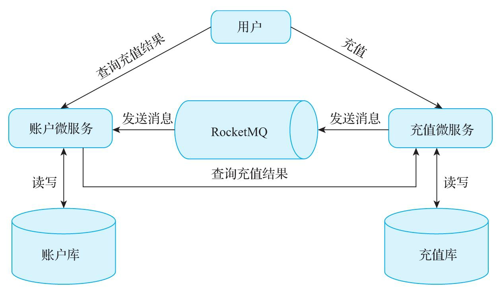{width="6.427890419947507in"
height="3.78050634295713in"}

> 图17-1　账户充值场景流程图
>
> 771
>
> 17.2　程序模块说明
>
> 本案例涉及的服务和程序组件如下所示。\
> ·服务器：192.168.175.100和192.168.175.101。\
> ·MySQL：MySQL 8.0.20。
>
> ·JDK：64位JDK 1.8.0_212。\
> ·RocketMQ消息中间件：rocketmq-all-4.5.0-bin-
>
> release。
>
> ·RocketMQ客户端：rocketmq-spring-boot-starter- 2.0.2-RELEASE。
>
> ·微服务框架：springboot-2.2.6.RELEASE。\
> ·数据库：账户数据库tx-notifymsg-account，存储在
>
> 192.168.175.100服务器上，充值数据库tx-notifymsg-pay，存
> 储在192.168.175.101服务器上。
>
> 本章所使用的RocketMQ消息中间件与第16章使用的
> RocketMQ消息中间件一致，关于RocketMQ环境的搭建，
> 读者可参见第16章，这里不再赘述。
>
> 772
>
> 17.3　数据库表设计
>
> 账户充值业务场景主要涉及的核心业务表包括账户数
> 据表和充值记录数据表。这里为了方便演示，简化了账户
> 数据表和充值记录数据表的设计，去除了实际场景中复杂
> 的业务流程。账户数据表account_info和充值记录数据表
> pay_info的设计分别如表17-1、表17-2所示。
>
> 表17-1　account_info账户数据表

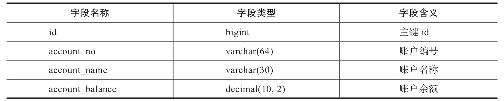{width="6.427891513560805in"
height="1.2979385389326334in"}

> 表17-2　pay_info充值记录数据表

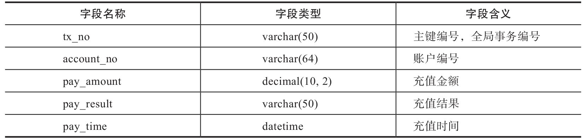{width="6.427890419947507in"
height="1.534864391951006in"}

> 注意，account_info数据表和pay_info数据表位于
> tx-notifymsg-account数据库中，pay_info数据库位于
> tx-notifymsg-pay数据库中。
>
> 设计完数据库后，在192.168.175.100服务器的MySQL
> 命令行中执行如下命令，创建账户数据库和数据表。
>
> 773
>
> create database if not exists tx-notifymsg-account;\
> use tx-notifymsg-account;
>
> CREATE TABLE \'account_info\' (
>
> \'id\' bigint(11) NOT NULL COMMENT \'主键id\',
>
> \'account_no\' varchar(64) DEFAULT \'\' COMMENT \'账户\',
>
> \'account_name\' varchar(30) DEFAULT \'\' COMMENT \'

账户名\',

> 额\',

\'account_balance\' decimal(10,2) DEFAULT \'0.00\' COMMENT \'

PRIMARY KEY (\'id\')

账户余

> ) ENGINE=InnoDB DEFAULT CHARSET=utf8mb4 COMMENT=\'账户信息\';
>
> CREATE TABLE \'pay_info\' (
>
> 号\',

\'tx_no\' varchar(50) NOT NULL DEFAULT \'\' COMMENT

\'充值记录流水

> \'account_no\' varchar(64) DEFAULT \'\' COMMENT \'

账户\',

> \'pay_amount\' decimal(10,2) DEFAULT \'0.00\' COMMENT \'

充值金额\',

> \'pay_result\' varchar(50) DEFAULT \'\' COMMENT \'

充值结果\',

> 间\',

\'pay_time\' datetime DEFAULT CURRENT_TIMESTAMP COMMENT \'

PRIMARY KEY (\'tx_no\') USING BTREE

充值时

> ) ENGINE=InnoDB DEFAULT CHARSET=utf8mb4 COMMENT=\'充值记录表\';
>
> 在192.168.175.101服务器的MySQL命令行中执行如下
> 命令，创建充值数据库和数据表。
>
> create database if not exists tx-notifymsg-pay; use tx-notifymsg-pay;
>
> CREATE TABLE \'pay_info\' (
>
> 号\',

\'tx_no\' varchar(50) NOT NULL DEFAULT \'\' COMMENT

\'充值记录流水

> \'account_no\' varchar(64) DEFAULT \'\' COMMENT \'

账户\',

> \'pay_amount\' decimal(10,2) DEFAULT \'0.00\' COMMENT \'

充值金额\',

> \'pay_result\' varchar(50) DEFAULT \'\' COMMENT \'

充值结果\',

> 间\',

\'pay_time\' datetime DEFAULT CURRENT_TIMESTAMP COMMENT \'

PRIMARY KEY (\'tx_no\') USING BTREE

充值时

> ) ENGINE=InnoDB DEFAULT CHARSET=utf8mb4 COMMENT=\'充值记录表\';
>
> 至此，数据库设计完成并创建了相关的数据库和数据
>
> 表。
>
> 774
>
> 17.4　实现账户微服务
>
> 账户微服务作为充值场景的核心服务模块之一，充
> 当最大努力通知型分布式事务的事务被动方。当用户调
> 用充值接口充值成功后，充值微服务会向RocketMQ发送
> 充值成功的消息，而账户微服务会订阅RocketMQ的消
>
> 息，当接收到RocketMQ的消息时，账户微服务会执行本
> 地事务，更新账户余额并记录充值信息。同时，账户微
> 服务订阅RocketMQ充值消息的接口会实现幂等。
>
> 775
>
> 17.4.1　项目搭建
>
> 账户微服务主要是基于Spring Boot实现，项目的搭 建过程如下所示。
>
> 第一步：新建名为tx-notifymsg-account的Maven项
> 目，并在pom.xml文件中进行如下配置。
>
> \<parent\>\
> \<groupId\>org.springframework.boot\</groupId\>
>
> \<artifactId\>spring-boot-starter-parent\</artifactId\>\
> \<version\>2.2.6.RELEASE\</version\>
>
> \</parent\>\
> \<modelVersion\>4.0.0\</modelVersion\>
>
> \<artifactId\>tx-notifymsg-account\</artifactId\>
>
> \<properties\>\
> \<project.build.sourceEncoding\>UTF-
>
> 8\</project.build.sourceEncoding\>\
> \<skip_maven_deploy\>false\</skip_maven_deploy\>
>
> \<java.version\>1.8\</java.version\>\
> \<druid.version\>1.1.10\</druid.version\>\
> \<mybatis.version\>3.4.6\</mybatis.version\>\
> \<mybatis.plus.version\>3.1.0\</mybatis.plus.version\>\
> \<rocketmq.version\>4.3.0\</rocketmq.version\>\
> \<jdbc.version\>5.1.49\</jdbc.version\>\
> \<rocketmq.version\>2.0.2\</rocketmq.version\>\
> \<lombok.version\>1.18.12\</lombok.version\>\
> \<httpclient.version\>4.5.2\</httpclient.version\>\
> \<commons-httpclient.version\>3.1\</commons-httpclient.version\>
>
> \</properties\>
>
> \<dependencies\>\
> \<dependency\>
>
> \<groupId\>org.springframework.boot\</groupId\>\
> \<artifactId\>spring-boot-starter-test\</artifactId\>
>
> \</dependency\>
>
> \<dependency\>
>
> 776
>
> \<groupId\>org.springframework.boot\</groupId\>\
> \<artifactId\>spring-boot-starter-web\</artifactId\>\
> \<exclusions\>
>
> \<exclusion\>
>
> \<groupId\>org.springframework.boot\</groupId\>
>
> \<artifactId\>spring-boot-starter-
>
> tomcat\</artifactId\>\
> \</exclusion\>
>
> \<exclusion\>
>
> \<groupId\>org.springframework.boot\</groupId\>
>
> \<artifactId\>spring-boot-starter-
>
> logging\</artifactId\>\
> \</exclusion\>
>
> \</exclusions\>
>
> \</dependency\>
>
> \<dependency\>\
> \<groupId\>org.springframework.boot\</groupId\>
>
> \<artifactId\>spring-boot-starter-undertow\</artifactId\>\
> \</dependency\>
>
> \<dependency\>\
> \<groupId\>org.springframework.boot\</groupId\>
>
> \<artifactId\>spring-boot-configuration-\
> processor\</artifactId\>
>
> \<optional\>true\</optional\>\
> \</dependency\>
>
> \<dependency\>\
> \<groupId\>mysql\</groupId\>
>
> \<artifactId\>mysql-connector-java\</artifactId\>\
> \<version\>\${jdbc.version}\</version\>\<!\--\$NO-MVN-MAN-VER\$\--
>
> \>
>
> \</dependency\>
>
> \<dependency\>\
> \<groupId\>com.baomidou\</groupId\>
>
> \<artifactId\>mybatis-plus-boot-starter\</artifactId\>\
> \<version\>\${mybatis.plus.version}\</version\>
>
> \</dependency\>
>
> \<dependency\>\
> \<groupId\>com.alibaba\</groupId\>
>
> \<artifactId\>druid\</artifactId\>\
> \<version\>\${druid.version}\</version\>
>
> \</dependency\>
>
> \<dependency\>\
> \<groupId\>com.alibaba\</groupId\>
>
> 777
>
> \<artifactId\>druid-spring-boot-starter\</artifactId\>\
> \<version\>\${druid.version}\</version\>
>
> \</dependency\>
>
> \<dependency\>\
> \<groupId\>org.apache.rocketmq\</groupId\>
>
> \<artifactId\>rocketmq-spring-boot-starter\</artifactId\>\
> \<version\>\${rocketmq.version}\</version\>
>
> \</dependency\>
>
> \<dependency\>\
> \<groupId\>org.projectlombok\</groupId\>
>
> \<artifactId\>lombok\</artifactId\>\
> \<version\>\${lombok.version}\</version\>
>
> \</dependency\>
>
> \<dependency\>\
> \<groupId\>org.apache.httpcomponents\</groupId\>
>
> \<artifactId\>httpclient\</artifactId\>\
> \<version\>\${httpclient.version}\</version\>
>
> \</dependency\>
>
> \<dependency\>\
> \<groupId\>commons-httpclient\</groupId\>
>
> \<artifactId\>commons-httpclient\</artifactId\>\
> \<version\>\${commons-httpclient.version}\</version\>
>
> \</dependency\>\
> \</dependencies\>
>
> 第二步：创建 io.transaction.notifymsg.account.config包，并在
>
> io.transaction.notifymsg.account.config包下创建
> CorsConfig类、MybatisPlusConfig类和WebMvcConfig 类，分别表示Spring
> Boot项目实现跨域访问的配置类、
>
> MyBatisPlus框架的配置类、WebMVC的配置类，如下所 示。
>
> 创建CorsConfig类，代码如下。
>
> \@Configuration
>
> public class CorsConfig {
>
> 778
>
> private CorsConfiguration buildConfig(){\
> CorsConfiguration corsConfiguration = new
>
> CorsConfiguration();\
> corsConfiguration.addAllowedOrigin(\"\*\");
>
> corsConfiguration.addAllowedHeader(\"\*\");\
> corsConfiguration.addAllowedMethod(\"\*\");\
> return corsConfiguration;
>
> }
>
> \@Bean
>
> public CorsFilter corsFilter(){\
> UrlBasedCorsConfigurationSource source = new
>
> UrlBasedCorsConfigurationSource();\
> source.registerCorsConfiguration(\"/\*\*\", buildConfig());
>
> return new CorsFilter(source);\
> }
>
> }
>
> 创建MybatisPlusConfig类，代码如下。
>
> \@EnableTransactionManagement
>
> \@Configuration
>
> \@MapperScan(value = {\"io.transaction.msg.order.mapper\"}) public
> class MybatisPlusConfig {
>
> \@Bean
>
> public PaginationInterceptor paginationInterceptor() {
>
> return new PaginationInterceptor();\
> }
>
> }
>
> 创建WebMvcConfig类，代码如下。
>
> \@Configuration
>
> public class WebMvcConfig extends WebMvcConfigurationSupport {
>
> \@Bean
>
> public HttpMessageConverter\<String\> responseBodyConverter()\
> {
>
> return new
>
> StringHttpMessageConverter(Charset.forName(\"UTF-8\"));
>
> }
>
> \@Override
>
> 779
>
> public void
>
> configureMessageConverters(List\<HttpMessageConverter\<?\>\>
> converters) {
>
> converters.add(responseBodyConverter());\
> addDefaultHttpMessageConverters(converters);
>
> }
>
> \@Override
>
> public void
>
> configureContentNegotiation(ContentNegotiationConfigurer configurer) {
>
> configurer.favorPathExtension(false);\
> }
>
> \@Override
>
> protected void addResourceHandlers(ResourceHandlerRegistry registry) {
>
> registry.addResourceHandler(\"/\*\*\").addResourceLocations(\"classpa
> th:/static/\").addResourceLocations(\"classpath:/resources/\");
>
> super.addResourceHandlers(registry);\
> }
>
> }
>
> 第三步：在项目的src/main/resources目录下新建
> application.yml文件和application-db.yml文件。
> application.yml文件是Spring Boot启动加载的主配置
> 文件，主要配置了项目启动后监听的端口号、项目服务
> 名称、项目编码以及RocketMQ的信息等。
> application.yml文件中引入了application-db.yml文
> 件。application-db.yml文件主要配置了数据库相关的
> 信息。application.yml文件和application-db.yml文件 的具体配置如下所示。
>
> 新建application.yml文件，代码如下。
>
> server:
>
> port: 8082
>
> servlet:
>
> context-path: /account
>
> 780
>
> tomcat:
>
> uri-encoding: UTF-8
>
> spring:\
> main:
>
> allow-bean-definition-overriding: true\
> profiles:
>
> include: db
>
> active: db
>
> output:
>
> ansi:
>
> enabled: detect
>
> application:
>
> name: tx-notifymsg-account
>
> http:
>
> encoding:
>
> charset: UTF-8
>
> enabled: true
>
> force: true
>
> rocketmq:
>
> name-server: 192.168.175.101:9876
>
> producer:
>
> group: account-group
>
> 新建application-db.yml文件，代码如下。
>
> spring:\
> datasource:
>
> url:jdbc:mysql://192.168.175.100:3306/tx-notifymsg-
> account?useUnicode=true&characterEncoding=UTF-
> 8&useOldAliasMetadataBehavior=true&autoReconnect=true&failOverRe
> adOnly=false&useSSL=false
>
> username: root
>
> password: root
>
> driver-class-name: com.mysql.jdbc.Driver\
> platform: mysql
>
> type: com.alibaba.druid.pool.DruidDataSource\
> \# 下面为连接池的补充设置，应用到上面的所有数据源中
>
> \# 初始化大小，最小、最大
>
> initialSize: 10
>
> minIdle: 5
>
> maxActive: 20
>
> \# 配置获取连接等待超时的时间\
> maxWait: 60000
>
> 781
>
> \# 配置检测的间隔时间，检测需要关闭的空闲连接，单位是毫秒\
> timeBetweenEvictionRunsMillis: 3600000
>
> \# 配置一个连接在池中最小生存的时间，单位是毫秒\
> minEvictableIdleTimeMillis: 3600000\
> validationQuery: select 1 from dual\
> testWhileIdle: true
>
> testOnBorrow: false
>
> testOnReturn: false
>
> \# 打开PSCache，并指定每个连接上PSCache的大小\
> poolPreparedStatements: true\
> maxPoolPreparedStatementPerConnectionSize: 20\
> maxOpenPreparedStatements: 20
>
> \# 配置监控统计拦截的过滤器，去掉后监控界面SQL无法统计\
> filters: stat
>
> mybatis-plus:\
> global-config:
>
> db-config:
>
> id-type: auto
>
> field-strategy: not-empty
>
> table-underline: true
>
> db-type: mysql
>
> logic-delete-value: 1 \# 逻辑已删除值（默认为1）
>
> logic-not-delete-value: 0 \# 逻辑未删除值（默认为0）\
> configuration:
>
> jdbc-type-for-null: \'null\'
>
> mapper-locations: classpath\*:mapper/\*.xml
>
> 应mapper映射XML文件的所在路径
>
> type-aliases-package:

#注意：一定要对

> io.transaction.notifymsg.account.entity.\*

\#

注意：对应实体类的路径

> 至此，账户微服务的项目就搭建完成了。
>
> 782
>
> 17.4.2　持久层的实现
>
> 账户微服务的持久层包含实体类的创建和MyBatis
> Mapper接口的创建与实现，具体步骤如下所示。
>
> 第一步：在 io.transaction.notifymsg.account.entity包下分别创
>
> 建AccountInfo类和PayInfo类。AccountInfo类表示账户
> 信息，AccountInfo类的字段与account_info数据表的字
> 段一一对应。PayInfo类表示充值信息，PayInfo类的字
>
> 段与pay_info数据表的字段一一对应。具体代码如下所 示。
>
> 创建AccountInfo类，代码如下。
>
> public class AccountInfo implements Serializable {
>
> private static final long serialVersionUID = 3159662335364762944L;
>
> /\*\*
>
> \* 主键id
>
> \*/
>
> private Long id;
>
> /\*\*
>
> \* 账户
>
> \*/
>
> private String accountNo;
>
> /\*\*
>
> \* 账户名
>
> \*/
>
> private String accountName;
>
> /\*\*
>
> \* 账户余额
>
> 783
>
> \*/
>
> private BigDecimal accountBalance;\
> //\*\*\*\*\*\*\*\*省略构造方法和get/set方法\*\*\*\*\*\*\*\*\*\*\*\*\*\*//
>
> }
>
> 创建PayInfo类，代码如下。
>
> public class PayInfo implements Serializable {\
> private static final long serialVersionUID =
>
> -1971185546761595695L;
>
> /\*\*
>
> \* 充值记录主键
>
> \*/
>
> private String txNo;
>
> /\*\*
>
> \* 账户
>
> \*/
>
> private String accountNo;
>
> /\*\*
>
> \* 充值金额
>
> \*/
>
> private BigDecimal payAmount;
>
> /\*\*
>
> \* 充值时间
>
> \*/
>
> private Date payTime;
>
> /\*\*
>
> \* 充值结果
>
> \*/
>
> private String payResult;\
> //\*\*\*\*\*\*\*\*省略构造方法和get/set方法\*\*\*\*\*\*\*\*\*\*\*\*\*\*//
>
> }
>
> 第二步：在 io.transaction.notifymsg.account.mapper包下分别创
>
> 建AccountInfoMapper接口和PayInfoMapper接口。
> AccountInfoMapper接口中定义了操作account_info数据
>
> 784
>
> 表的方法，PayInfoMapper接口中定义了操作pay_info数
> 据表的方法，具体代码如下所示。
>
> 创建AccountInfoMapper接口，代码如下。
>
> public interface AccountInfoMapper {
>
> /\*\*
>
> \* 更新指定账户下的余额\
> \*/
>
> int updateAccoutBalanceByAccountNo(@Param(\"payBalance\") BigDecimal
> payBalance,
>
> \@Param(\"accountNo\") String
>
> accountNo);\
> }
>
> PayInfoMapper接口代码如下。
>
> public interface PayInfoMapper {
>
> /\*\*
>
> \* 查询是否存在充值记录\
> \*/
>
> Integer isExistsPayInfo(@Param(\"txNo\") String txNo);
>
> /\*\*
>
> \* 保存充值记录
>
> \*/
>
> void savePayInfo(@Param(\"payInfo\")PayInfo payInfo);
>
> /\*\*
>
> \* 查询指定的充值信息\
> \*/
>
> PayInfo getPayInfoByTxNo(@Param(\"txNo\") String txNo);\
> }
>
> 第三步：在项目src/main/resources/mapper目录下
> 分别创建AccountInfoMapper.xml文件和
> PayInfoMapper.xml文件。AccountInfoMapper.xml文件
>
> 785
>
> 是对AccountInfoMapper接口定义的方法的实现，
> PayInfoMapper.xml文件是对PayInfoMapper接口定义的
> 方法的实现，具体代码如下所示。
>
> 创建AccountInfoMapper.xml文件，代码如下。
>
> \<?xml version=\"1.0\" encoding=\"UTF-8\"?\>
>
> \<!DOCTYPE mapper PUBLIC \"-//mybatis.org//DTD Mapper 3.0//EN\"\
> \"<http://mybatis.org/dtd/mybatis-3-mapper.dtd>\"\>
>
> \<mapper
>
> namespace=\"io.transaction.notifymsg.account.mapper.AccountInfoMa
> pper\"\>
>
> \<update id=\"updateAccoutBalanceByAccountNo\"\>\
> update account_info set account_balance =
>
> account_balance + #{payBalance} where account_no = #{accountNo}
>
> \</update\>
>
> \</mapper\>
>
> 创建PayInfoMapper.xml文件，代码如下。
>
> \<?xml version=\"1.0\" encoding=\"UTF-8\"?\>
>
> \<!DOCTYPE mapper PUBLIC \"-//mybatis.org//DTD Mapper 3.0//EN\"\
> \"<http://mybatis.org/dtd/mybatis-3-mapper.dtd>\"\>
>
> \<mapper
>
> namespace=\"io.transaction.notifymsg.account.mapper.PayInfoMapper \"\>
>
> \<select id=\"isExistsPayInfo\" resultType=\"java.lang.Integer\"\>\
> select 1 from pay_info where tx_no = #{txNo} limit 1
>
> \</select\>
>
> \<select id=\"savePayInfo\"\>
>
> insert into pay_info
>
> (tx_no, account_no, pay_amount, pay_result,\
> pay_time)
>
> values
>
> (#{payInfo.txNo}, #{payInfo.accountNo}, \#\
> {payInfo.payAmount}, #{payInfo.payResult}, #{payInfo.payTime})
>
> \</select\>
>
> \<select id=\"getPayInfoByTxNo\"
>
> 786
>
> resultType=\"io.transaction.notifymsg.account.entity.PayInfo\"\>
>
> select
>
> tx_no as txNo, account_no as accountNo, pay_amount\
> as payAmount, pay_result as payResult, pay_time as payTime
>
> from
>
> pay_info
>
> where
>
> tx_no = #{txNo}
>
> \</select\>
>
> \</mapper\>
>
> 至此，账户微服务的持久层就实现完毕了。
>
> 787
>
> 17.4.3　业务逻辑层的实现
>
> 账户微服务的业务逻辑层主要是实现订阅RocketMQ
> 的充值消息，实现相应的业务逻辑处理，同时提供了查
> 询充值结果的接口。在查询充值结果的方法中，调用充
> 值微服务的接口查询充值结果，并根据返回的结果状态
> 判断是否更新账户余额，具体的实现步骤如下所示。
>
> 第一步：在 io.transaction.notifymsg.account.service包下创建
>
> AccountInfoService接口。AccountInfoService接口中
> 主要定义了更新账户余额和查询充值结果的方法，具体 代码如下所示。
>
> public interface AccountInfoService {
>
> /\*\*
>
> \* 更新账户余额\
> \*/
>
> void updateAccountBalance(PayInfo payInfo);
>
> /\*\*
>
> \* 查询充值结果
>
> \*/
>
> PayInfo queryPayResult(String txNo);\
> }
>
> 第二步：在 io.transaction.notifymsg.account.service.impl包下
>
> 新建AccountInfoServiceImpl类，实现
> AccountInfoService接口，具体代码如下所示。
>
> 788
>
> \@Service
>
> public class AccountInfoServiceImpl implements AccountInfoService {
>
> \@Autowired
>
> private AccountInfoMapper accountInfoMapper;\
> \@Autowired
>
> private PayInfoMapper payInfoMapper;
>
> private String url =\
> \"<http://192.168.175.101:8083/pay/query/payresult/>\";
>
> \@Override
>
> \@Transactional(rollbackFor = Exception.class)
>
> public void updateAccountBalance(PayInfo payInfo) {
>
> if(payInfoMapper.isExistsPayInfo(payInfo.getTxNo()) !=
>
> null){
>
> log.info(\"
>
> return;
>
> }
>
> //更新账户余额

账户微服务已经处理过当前事务\...\");

> accountInfoMapper.updateAccoutBalanceByAccountNo(payInfo.getPayA
> mount(), payInfo.getAccountNo());
>
> //保存充值记录
>
> payInfoMapper.savePayInfo(payInfo);\
> }
>
> \@Override
>
> public PayInfo queryPayResult(String txNo) {
>
> String getUrl = url.concat(txNo);\
> try{
>
> String payData =
>
> HttpConnectionUtils.getPayData(getUrl, null, null,
> HttpConnectionUtils.TYPE_STREAM);
>
> if(!StringUtils.isEmptyWithTrim(payData)){
>
> JSONObject jsonObject =
>
> JSONObject.parseObject(payData);\
> PayInfo payInfo =
>
> jsonObject.toJavaObject(PayInfo.class);
>
> if(payInfo != null &&
>
> \"success\".equals(payInfo.getPayResult())){\
> this.updateAccountBalance(payInfo);
>
> }
>
> return payInfo;
>
> }
>
> }catch (Exception e){
>
> log.error(\"查询充值结果异常:{}\", e);
>
> }
>
> return null;
>
> 789
>
> }\
> }
>
> 第三步：在 io.transaction.notifymsg.account.message包下创建
>
> NotifyMsgAccountListener类，实现RocketMQListener
> 接口，主要是监听RocketMQ的消息，当收到RocketMQ的
> 消息时，调用AccountInfoService接口的方法处理业务
> 逻辑，具体代码如下所示。
>
> \@Component
>
> \@RocketMQMessageListener(consumerGroup = \"consumer_group_account\",
>
> topic = \"topic_nofitymsg\")
>
> public class NotifyMsgAccountListener implements
> RocketMQListener\<PayInfo\> {
>
> \@Autowired
>
> private AccountInfoService accountInfoService;\
> \@Override
>
> public void onMessage(PayInfo payInfo) {\
> log.info(\"账户微服务收到RocketMQ的消息:{}\",
>
> JSONObject.toJSONString(payInfo));
>
> //如果充值成功，则修改账户余额\
> if(\"success\".equals(payInfo.getPayResult())){
>
> accountInfoService.updateAccountBalance(payInfo);\
> }
>
> log.info(\"更新账户余额完毕:{}\", JSONObject.toJSONString(payInfo));
>
> }\
> }
>
> 至此，账户微服务的业务逻辑层实现完毕。
>
> 790
>
> 17.4.4　接口层的实现
>
> 账户微服务接口层的实现就比较简单了，即实现一
> 个AccountInfoController类、对外提供一
> 个/query/payresult/{txNo}接口、接收用户提交的参
> 数、调用业务逻辑层的方法查询充值的结果信息，具体 代码如下所示。
>
> \@Controller
>
> public class AccountInfoController {
>
> \@Autowired
>
> private AccountInfoService accountInfoService;
>
> //

主动查询充值结果

> \@GetMapping(value = \"/query/payresult/{txNo}\")
>
> public PayInfo result(@PathVariable(\"txNo\") String txNo){
>
> return accountInfoService.queryPayResult(txNo);
>
> }
>
> }
>
> 791
>
> 17.4.5　启动类的实现
>
> 账户微服务的启动类是账户微服务的启动入口，整 个项目基于Spring
> Boot实现，项目的启动类也比较简
> 单。在io.transaction.notifymsg.account包下新建
> AccountServerStarter类，具体代码如下所示。
>
> \@SpringBootApplication
>
> \@ComponentScan(basePackages = {\"io.transaction.notifymsg\"})
> \@MapperScan(value = { \"io.transaction.notifymsg.account.mapper\" })
>
> \@EnableTransactionManagement(proxyTargetClass = true)
>
> public class AccountServerStarter {
>
> public static void main(String\[\] args) {\
> SpringApplication.run(AccountServerStarter.class, args);
>
> }\
> }
>
> 至此，整个账户微服务的项目就开发完成了。
>
> 792
>
> 17.5　实现充值微服务
>
> 充值微服务充当最大努力通知型分布式事务的事务
> 主动方，主要提供了充值接口和查询充值结果的接口。
> 用户调用充值接口充值成功后，充值服务会向RocketMQ
> 发送充值消息。用户查询充值结果时，账户微服务会调
> 用充值微服务查询充值结果的接口，充值微服务再将查
> 询到的结果信息返回给账户微服务。
>
> 793
>
> 17.5.1　项目搭建与持久层的实现
>
> 充值微服务的项目搭建过程和持久层的实现基本上
> 与账户微服务的实现一致，只需要额外注意如下两点。
>
> 1）充值微服务中MybatisPlusConfig类上的注解为
> \@MapperScan(value={\"io.transact-
> ion.notifymsg.pay.mapper\"})，而账户微服务中
> MybatisPlusConfig类上的注解为@Mapper Scan(value=
> {\"io.transaction.notifymsg.account.mapper\"})。
>
> 2）充值微服务YML文件中配置的端口号为8083，并
> 且context-path路径为/pay，数据库为tx-notifymsg-
> pay。而账户微服务YML文件中配置的端口号为8082，
> context-path路径为/account，数据库为tx-notifymsg- account。
>
> 其他搭建步骤，读者可参见账户微服务的搭建过程
> 和随书源码了解，笔者不再赘述。
>
> 794
>
> 17.5.2　业务逻辑层的实现
>
> 充值微服务的业务逻辑层主要完成充值的业务逻辑
> 处理，当充值成功时，会向RocketMQ发送充值结果信
> 息，同时提供业务逻辑层查询充值结果信息的接口，具 体实现步骤如下所示。
>
> 第一步：在 io.transaction.notifymsg.pay.service包下创建
>
> PayInfoService接口。PayInfo Service接口中提供了两
> 个方法，分别为保存充值信息的savePayInfo(PayInfo)
> 方法和查询充值结果信息的方法 getPayInfoByTxNo(String
> txNo)，具体代码如下所示。
>
> public interface PayInfoService {
>
> /\*\*
>
> \* 保存充值信息
>
> \*/
>
> PayInfo savePayInfo(PayInfo payInfo);
>
> /\*\*
>
> \* 查询指定的充值信息\
> \*/
>
> PayInfo getPayInfoByTxNo(String txNo);\
> }
>
> 第二步：
>
> io.transaction.notifymsg.pay.service.impl包下创建
> PayInfoServiceImpl类，实现PayInfoService接口，并
>
> 795
>
> 在实现的savePayInfo(PayInfo)方法中根据充值结果判
> 断是否将消息发送到RocketMQ，具体代码如下所示。
>
> \@Service
>
> public class PayInfoServiceImpl implements PayInfoService {
>
> \@Autowired
>
> private PayInfoMapper payInfoMapper;\
> \@Autowired
>
> private RocketMQTemplate rocketMQTemplate;
>
> \@Override
>
> public PayInfo savePayInfo(PayInfo payInfo) {\
> payInfo.setTxNo(UUID.randomUUID().toString());
>
> payInfo.setPayResult(\"success\");\
> payInfo.setPayTime(new Date());
>
> int count = payInfoMapper.savePayInfo(payInfo);\
> //充值信息保存成功
>
> if(count \> 0){
>
> log.info(\"充值微服务向账户微服务发送结果消息\");\
> //发送消息通知账户微服务
>
> rocketMQTemplate.convertAndSend(\"topic_nofitymsg\",\
> payInfo);
>
> return payInfo;
>
> }
>
> return null;
>
> }
>
> \@Override
>
> public PayInfo getPayInfoByTxNo(String txNo) {\
> return payInfoMapper.getPayInfoByTxNo(txNo);
>
> }\
> }
>
> 796
>
> 17.5.3　接口层的实现
>
> 充值微服务的接口层的实现比较简单，只有一个
> PayInfoController类，对外提供了充值接口和查询充值
>
> 结果的接口。在 io.transaction.notifymsg.pay.controller包下创建
> PayInfoController类，具体代码如下所示。
>
> \@RestController
>
> public class PayInfoController {
>
> \@Autowired
>
> private PayInfoService payInfoService;
>
> //充值
>
> \@GetMapping(value = \"/pay_account\")\
> public PayInfo pay(PayInfo payInfo){
>
> //生成事务编号
>
> return payInfoService.savePayInfo(payInfo);\
> }
>
> //

查询充值结果

> \@GetMapping(value = \"/query/payresult/{txNo}\")
>
> public PayInfo payResult(@PathVariable(\"txNo\") String txNo){
>
> return payInfoService.getPayInfoByTxNo(txNo);
>
> }
>
> }
>
> 797
>
> 17.5.4　启动类的实现
>
> 充值微服务的启动类是充值微服务程序的入口，在
> io.transaction.notifymsg.pay包下新建
> PayServerStarter类，具体代码如下所示。
>
> \@SpringBootApplication
>
> \@ComponentScan(basePackages = {\"io.transaction.notifymsg\"})
> \@MapperScan(value = { \"io.transaction.notifymsg.pay.mapper\" })
> \@EnableTransactionManagement(proxyTargetClass = true)
>
> public class PayServerStarter {
>
> public static void main(String\[\] args) {\
> SpringApplication.run(PayServerStarter.class, args);
>
> }\
> }
>
> 至此，整个充值微服务项目的开发就完成了。
>
> 798
>
> 17.6　测试程序
>
> 开发完账户微服务和充值微服务后，需要对程序进
> 行测试，看是否符合预期效果，测试程序的步骤如下所 示。
>
> 第一步：查询tx-notifymsg-account数据库和tx-
> notifymsg-pay数据库各个数据表中的数据，如下所示。
>
> tx-notifymsg-account数据库代码如下。
>
> mysql\> use tx-notifymsg-account;
>
> Database changed
>
> mysql\> select \* from account_info;\
> +\-\-\-\-\--+\-\-\-\-\-\-\-\-\-\-\--+\-\-\-\-\-\-\-\-\-\-\-\-\--+\-\-\-\-\-\-\-\-\-\-\-\-\-\-\-\--+
>
> \| id \| account_no \| account_name \| account_balance \|\
> +\-\-\-\-\--+\-\-\-\-\-\-\-\-\-\-\--+\-\-\-\-\-\-\-\-\-\-\-\-\--+\-\-\-\-\-\-\-\-\-\-\-\-\-\-\-\--+
>
> \| 1001 \| 1001 \| 冰河 \| 1000.00 \|\
> +\-\-\-\-\--+\-\-\-\-\-\-\-\-\-\-\--+\-\-\-\-\-\-\-\-\-\-\-\-\--+\-\-\-\-\-\-\-\-\-\-\-\-\-\-\-\--+
>
> 1 row in set (0.01 sec)
>
> mysql\> select \* from pay_info;\
> Empty set (0.00 sec)
>
> 可以看到，tx-notifymsg-account数据库的
> account_info数据表中存在一条账户编号为1001的记
>
> 录，此时的余额为1000元，而pay_info数据表中的数据 为空。
>
> tx-notifymsg-pay数据库代码如下。
>
> mysql\> use tx-notifymsg-pay; Database changed
>
> 799
>
> mysql\> select \* from pay_info; Empty set (0.00 sec)
>
> 可以看到，在tx-notifymsg-pay数据库的pay_info 数据表中数据为空。
>
> 第二步：分别启动账户微服务和充值微服务，然后 调用充值微服务的接口
> <http://192.168.175.101:8083/pay/pay_account>[为账户](http://192.168.175.101:8083/pay/pay_account为账户编号为1001的账户充值1000元。)
> [编号为1001的账户充值1000元。](http://192.168.175.101:8083/pay/pay_account为账户编号为1001的账户充值1000元。)
>
> 充值微服务的日志文件中输出如下信息。
>
> INFO 98880 \-\-- \[main\] i.t.n.p.service.impl.PayInfoServiceImpl:
> 充值微服务向账户微服务发送结果消息
>
> 账户微服务的日志文件中输出如下信息。
>
> INFO 98740 \-\-- \[MessageThread_1\]
> i.t.n.a.m.NotifyMsgAccountListener: 账户微服务收到RocketMQ的消息:
> {\"accountNo\":\"1001\",\"payAmount\":1000,\"payResult\":\"success\",\"payT
> ime\":1625984117711,\"txNo\":\"803416ce-68dd-4b32-89b7-
> c77ab37a4961\"}
>
> INFO 98740 \-\-- \[MessageThread_1\]
> i.t.n.a.m.NotifyMsgAccountListener: 更新账户余额完毕:
> {\"accountNo\":\"1001\",\"payAmount\":1000,\"payResult\":\"success\",\"payT
> ime\":1625984117711,\"txNo\":\"803416ce-68dd-4b32-89b7-
> c77ab37a4961\"}
>
> 可以看到，充值微服务将充值结果信息成功发送到
> 了RocketMQ，并且账户微服务成功订阅了RocketMQ的消 息并执行了本地事务。
>
> 800
>
> 第三步：再次查询tx-notifymsg-account数据库和
> tx-notifymsg-pay数据库各个数据表中的数据，如下所 示。
>
> tx-notifymsg-account数据库代码如下。
>
> mysql\> use tx-notifymsg-account;
>
> Database changed
>
> mysql\> select \* from account_info;\
> +\-\-\-\-\-\-\-\-\-\-\-\-\-\-\-\-\--+\-\-\-\-\-\-\-\-\-\-\-\-\-\-\-\--+\-\-\-\-\-\-\-\-\-\-\-\-\-\-\-\-\-\-\--+\-\-\-\--
>
> \-\-\-\-\-\-\-\-\-\-\-\-\-\--+
>
> \| id \| account_no \| account_name \| account_balance \|\
> +\-\-\-\-\-\-\-\-\-\-\-\-\-\-\-\-\--+\-\-\-\-\-\-\-\-\-\-\-\-\-\-\-\--+\-\-\-\-\-\-\-\-\-\-\-\-\-\-\-\-\-\-\--+\-\-\-\--
>
> \-\-\-\-\-\-\-\-\-\-\-\-\-\--+
>
> \| 1001 \| 1001 \| 冰河 \| 2000.00 \|\
> +\-\-\-\-\-\-\-\-\-\-\-\-\-\-\-\-\--+\-\-\-\-\-\-\-\-\-\-\-\-\-\-\-\--+\-\-\-\-\-\-\-\-\-\-\-\-\-\-\-\-\-\-\--+\-\-\-\--
>
> \-\-\-\-\-\-\-\-\-\-\-\-\-\--+
>
> 1 row in set (0.00 sec)
>
> mysql\> select \* from pay_info;\
> +\-\-\-\-\-\-\-\-\-\-\-\-\-\-\-\-\--+\-\-\-\-\-\-\-\-\-\-\-\-\-\-\-\--+\-\-\-\-\-\-\-\-\-\-\-\-\-\-\-\-\-\-\--+\-\-\-\--
>
> \-\-\-\-\-\-\-\-\-\-\-\-\-\--+
>
> \| tx_no \| account_no \| pay_amount \|
>
> pay_result \| pay_time \|\
> +\-\-\-\-\-\-\-\-\-\-\-\-\-\-\-\-\--+\-\-\-\-\-\-\-\-\-\-\-\-\-\-\-\--+\-\-\-\-\-\-\-\-\-\-\-\-\-\-\-\-\-\-\--+\-\-\-\--
>
> \-\-\-\-\-\-\-\-\-\-\-\-\-\--+
>
> \| 803416ce-68dd-4b32-89b7-c77ab37a4961 \| 1001 \| 1000.00\
> \| success \| 2021-07-11 14:15:18 \|\
> +\-\-\-\-\-\-\-\-\-\-\-\-\-\-\-\-\--+\-\-\-\-\-\-\-\-\-\-\-\-\-\-\-\--+\-\-\-\-\-\-\-\-\-\-\-\-\-\-\-\-\-\-\--+\-\-\-\--
>
> \-\-\-\-\-\-\-\-\-\-\-\-\-\--+
>
> 1 row in set (0.00 sec)
>
> 可以看到，在tx-notifymsg-account数据库中，
> account_info数据表中账户编号为1001的余额已经由原
>
> 来的1000元变成了2000元，并且pay_info数据表中记录
> 了一条充值信息，事务编号为803416ce-68dd-4b32- 89b7-c77ab37a4961。
>
> tx-notifymsg-pay数据库代码如下。
>
> 801
>
> mysql\> use tx-notifymsg-pay;
>
> Database changed
>
> mysql\> select \* from pay_info;\
> +\-\-\-\-\-\-\-\-\-\-\-\-\-\-\-\-\--+\-\-\-\-\-\-\-\-\-\-\-\-\-\-\-\--+\-\-\-\-\-\-\-\-\-\-\-\-\-\-\-\-\-\-\--+\-\-\-\--
>
> \-\-\-\-\-\-\-\-\-\-\-\-\-\--+
>
> \| tx_no \| account_no \| pay_amount \|
>
> pay_result \| pay_time\|\
> +\-\-\-\-\-\-\-\-\-\-\-\-\-\-\-\-\--+\-\-\-\-\-\-\-\-\-\-\-\-\-\-\-\--+\-\-\-\-\-\-\-\-\-\-\-\-\-\-\-\-\-\-\--+\-\-\-\--
>
> \-\-\-\-\-\-\-\-\-\-\-\-\-\--+
>
> \| 803416ce-68dd-4b32-89b7-c77ab37a4961 \| 1001 \| 1000.00\
> \| success \| 2021-07-11 14:15:18 \|\
> +\-\-\-\-\-\-\-\-\-\-\-\-\-\-\-\-\--+\-\-\-\-\-\-\-\-\-\-\-\-\-\-\-\--+\-\-\-\-\-\-\-\-\-\-\-\-\-\-\-\-\-\-\--+\-\-\-\--
>
> \-\-\-\-\-\-\-\-\-\-\-\-\-\--+
>
> 1 row in set (0.00 sec)
>
> 可以看到，在tx-notifymsg-pay数据库中，
> pay_info数据表中记录了一条充值信息，事务编号为
>
> 803416ce-68dd-4b32-89b7-c77ab37a4961，与tx-
> notifymsg-account数据库中pay_info数据表记录的事务
> 编号一致，说明账户微服务与充值微服务实现了最大努
> 力通知型分布式事务，符合项目的预期。
>
> 802
>
> 17.7　本章小结
>
> 本章主要以经典的账户充值业务场景为例，实现了
> 一个完整的最大努力通知型分布式事务案例。首先对业
> 务场景和程序模块进行了简单的说明，接下来简单说明
> 了数据库表设计，随后重点实现了账户微服务和充值微
> 服务，最后对案例程序进行了测试。
>
> 本章的随书源码已提交到如下代码仓库。\
> [·GitHub：https://github.com/dromara/distribute-](https://github.com/dromara/distribute-transaction)
>
> [transaction。](https://github.com/dromara/distribute-transaction)
>
> [·Gitee：https://gitee.com/dromara/distribute-](https://gitee.com/dromara/distribute-transaction)
> [transaction。](https://gitee.com/dromara/distribute-transaction)
>
> 803
